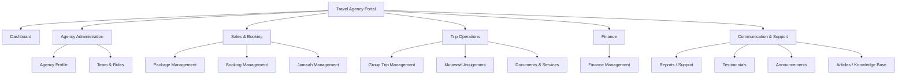
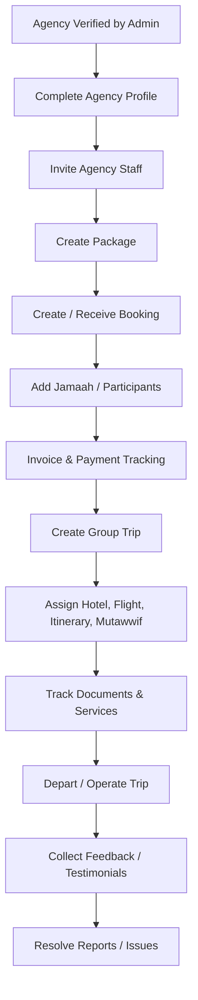
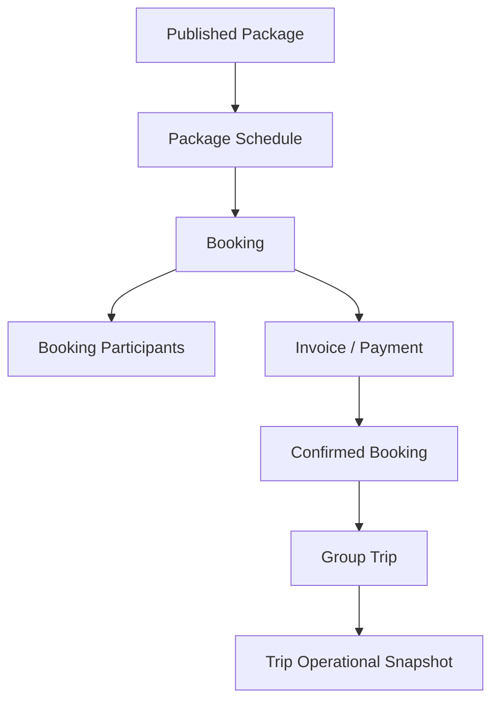
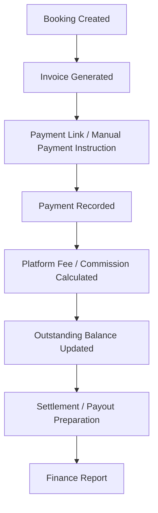
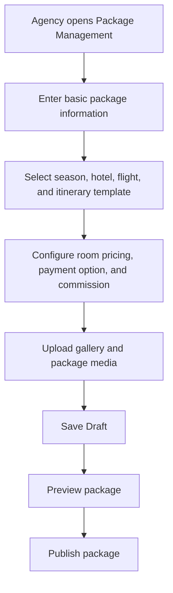
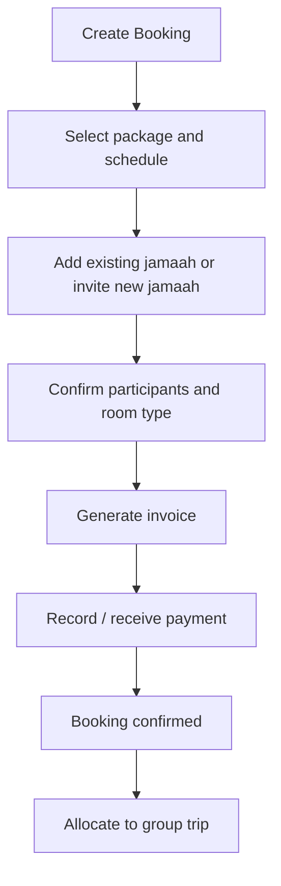
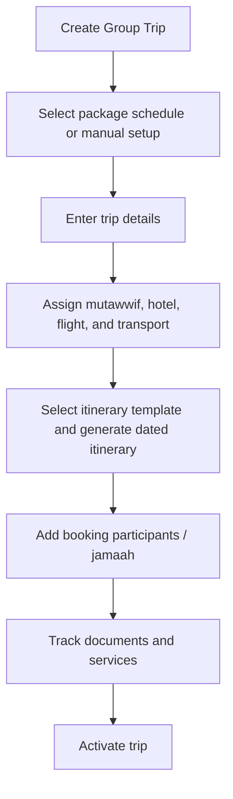
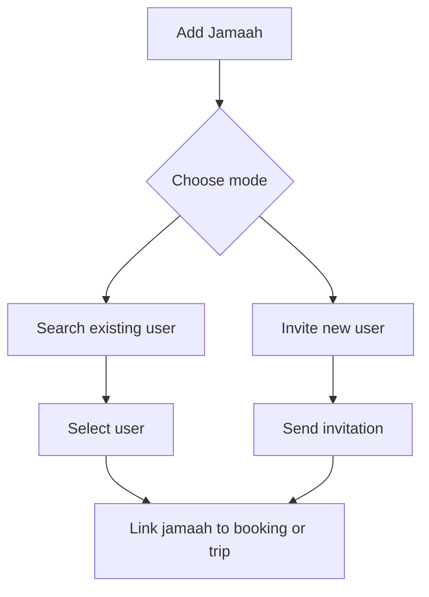
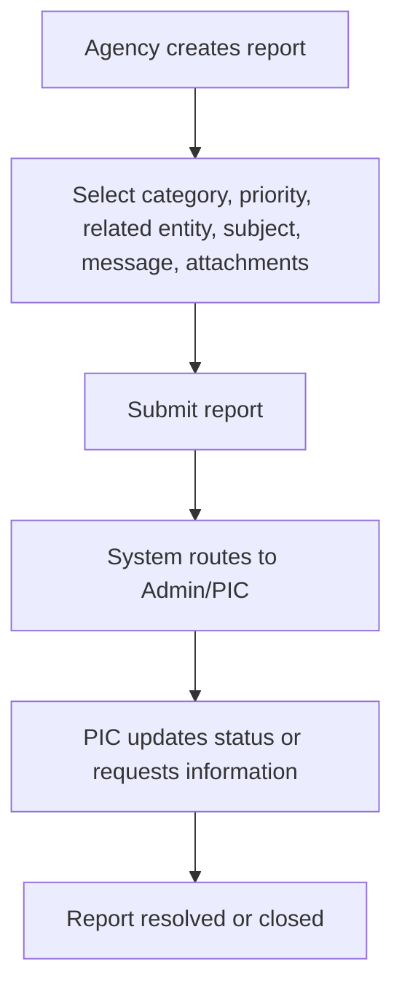
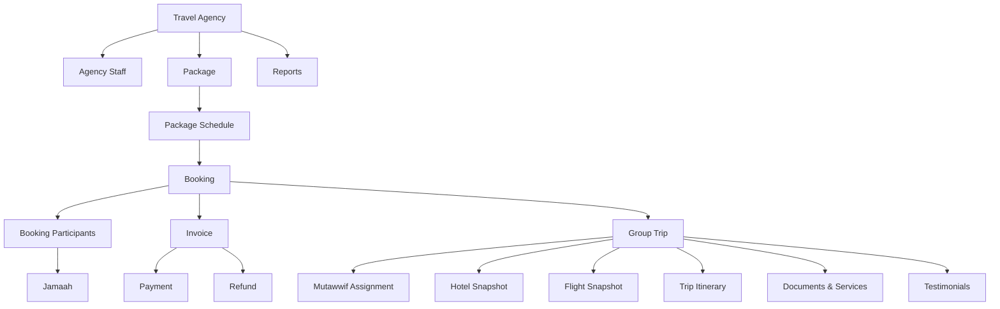

# Master PRD - UmrahHaji.com Travel Agency Portal

## 1. Document Information

| Item | Description |
|---|---|
| Product Name | UmrahHaji.com Travel Agency Portal |
| Document Type | Master PRD |
| Version | v1.0 |
| Prepared By | Product / UI/UX Team |
| Last Updated | 9 June 2026 |
| Status | Draft |
| Scope | Travel Agency Portal |

---

## 2. Product Overview

UmrahHaji.com Travel Agency Portal is a responsive web-based workspace for verified Travel Agencies to manage their own Umrah and Hajj operations inside the UmrahHaji.com ecosystem.

The portal allows Travel Agencies to manage their profile, staff access, packages, bookings, jamaah, group trips, mutawwif assignments, operational documents, finance tracking, reports, testimonials, and notifications within their own agency data scope.

This Master PRD defines the high-level product structure, navigation, priority, module relationships, workflows, permissions, and data behavior for the Travel Agency Portal. Detailed module PRDs can be created separately after this master structure is approved.

---

## 3. Product Relationship With Admin Panel

Admin Panel and Travel Agency Portal use the same design system, but each portal has a separate navigation structure, permission model, and data scope.

| Area | Admin Panel | Travel Agency Portal |
|---|---|---|
| Primary User | UmrahHaji.com internal team | Travel Agency owner and staff |
| Data Scope | All platform data | Own agency data only |
| Master Data Control | Create and maintain global master data | Consume approved master data |
| Package Control | Monitor, assist, approve-sensitive edits | Create and manage own packages |
| Booking Control | Monitor all bookings and assist agencies | Manage own bookings and customers |
| Group Trip Control | Monitor all group trips and assist agencies | Operate own group trips |
| Finance Control | Platform-wide revenue, commission, payout, refunds | Own agency invoices, payments, commission view, and settlement view |
| Reports | Platform-wide case management | Submit and manage own agency-related cases |

### 3.1 Shared Design System Principle

1. Both portals reuse the same components, typography, color tokens, table pattern, form pattern, status chips, modals, and responsive behavior.
2. Navigation labels and module placement are different because the user goal is different.
3. Admin Panel is supervisory and cross-agency.
4. Travel Agency Portal is operational and agency-scoped.
5. A user who has access to both portals must explicitly switch portal context.

---

## 4. Goals & Objectives

1. Allow Travel Agencies to operate independently after being verified by Admin.
2. Provide a structured portal for managing packages, bookings, jamaah, and group trips.
3. Reuse Admin-managed master data such as hotels, airlines, itinerary templates, seasons, and approved mutawwif profiles.
4. Reduce manual coordination between Travel Agencies and platform admins.
5. Give Travel Agencies clear visibility over payment status, outstanding balances, commissions, refunds, and settlement preparation.
6. Support operational readiness before departure through document and service tracking.
7. Provide a support/reporting channel for issues involving jamaah, mutawwif, operations, payment, documents, or platform data.
8. Support responsive access on desktop, tablet, and mobile browsers.

---

## 5. Platform Scope

Phase 1 focuses on a responsive web platform. Native Android and iOS applications are out of scope.

| Platform | Supported |
|---|---|
| Desktop Web | Yes |
| Tablet Web | Yes |
| Mobile Web | Yes |
| Android App | No - Phase 1 |
| iOS App | No - Phase 1 |

| Device | Width |
|---|---|
| Mobile | 320px - 767px |
| Tablet | 768px - 1023px |
| Desktop | 1024px+ |

---

## 6. User Roles

| Role | Description |
|---|---|
| Agency Owner / PIC | Main agency account owner with full access to agency data and configuration |
| Agency Admin | Manages daily portal operations and staff access based on permission |
| Operations Staff | Manages jamaah, group trips, documents, itinerary, hotel, flight, and mutawwif assignment |
| Sales / Booking Staff | Creates bookings, invites jamaah, manages customer registration, and tracks booking progress |
| Finance Staff | Manages invoices, payments, outstanding balances, refunds, commission view, and settlement records |
| Customer Service Staff | Handles reports, customer issues, announcements, and communication |
| Marketing Staff | Manages package content, media, promotional labels, and article/content requests when enabled |
| Auditor / View Only | Read-only access to selected agency data and reports |

### 6.1 Role Principle

1. Agency Owner can create roles and invite staff.
2. Staff access must be limited by role and permission.
3. Sensitive data such as payment records, identity documents, and passport documents must require explicit permission.
4. Staff cannot access another Travel Agency's data.
5. Admin can assist or override only through Admin Panel audit-controlled workflows.

---

## 7. Data Scope Rules

| Rule | Requirement |
|---|---|
| Agency Isolation | Travel Agency users can only see data owned by their own agency |
| Master Data Usage | Hotel, airline, itinerary template, season, and public mutawwif data are selectable from Admin-approved master data |
| Agency-Owned Data | Packages, bookings, jamaah records, group trips, invoices, and support reports belong to one Travel Agency |
| Snapshot Behavior | Booking and group trip data must store snapshots of package, price, hotel, flight, and itinerary data at the time of confirmation |
| Sensitive Documents | Passport, IC, visa, vaccination, ticket, and banking data require specific permission |
| Audit Trail | Create, update, delete, approve, archive, status change, and manual admin assistance must be logged |

---

## 8. Travel Agency Portal Navigation

```text
Dashboard
Agency Profile
Team & Roles
Package Management
Booking Management
Jamaah Management
Group Trip Management
Mutawwif Assignment
Documents & Services
Finance Management
- Overview
- Invoices
- Payments
- Outstanding Balance
- Refunds
- Commission View
- Settlement View
- Finance Reports
Reports / Support
Testimonials
Announcements
Articles / Knowledge Base
Settings
```

### 8.1 Information Architecture Overview



### 8.2 Core Business Flow



### 8.3 Package to Booking to Group Trip Logic



### 8.4 Finance Flow



---

## 9. Module Priority

### 9.1 P0 - Must Have for Operational MVP

| Priority | Module | Reason |
|---|---|---|
| P0 | Dashboard | Gives agency quick visibility of bookings, payments, departures, pending documents, and reports |
| P0 | Agency Profile | Required to maintain legal, contact, and operational agency identity |
| P0 | Team & Roles | Required so agency staff can operate with controlled access |
| P0 | Package Management | Core sales product that creates bookings and trips |
| P0 | Booking Management | Core reservation and payment tracking layer |
| P0 | Jamaah Management | Required to manage participants and customer data |
| P0 | Group Trip Management | Required for actual departure operations |
| P0 | Finance Management | Required to track invoice, payment, outstanding, refund, and commission visibility |
| P0 | Reports / Support | Required to handle operational issues and platform support cases |

### 9.2 P1 - Should Have After Core Flow Is Stable

| Priority | Module | Reason |
|---|---|---|
| P1 | Mutawwif Assignment | Important for operational readiness and customer experience |
| P1 | Documents & Services | Important for visa, ticket, room, transport, and service readiness |
| P1 | Testimonials | Important for quality tracking and trust |
| P1 | Announcements | Important for agency-to-jamaah and platform-to-agency updates |
| P1 | Itinerary Customization | Useful when package itinerary needs agency-specific adjustment from template |
| P1 | Finance Reports | Useful for agency owner and finance staff monitoring |

### 9.3 P2 - Growth / Optimization

| Priority | Module | Reason |
|---|---|---|
| P2 | Articles / Knowledge Base | Useful for content support, education, and customer engagement |
| P2 | Marketing & Promotion Tools | Useful after package and booking flow is stable |
| P2 | Advanced Analytics | Useful for business growth and operational optimization |
| P2 | API / Integration | Useful for future external supplier, CRM, accounting, or channel integrations |
| P2 | Automated Payout | Useful after finance process and compliance are stable |

---

## 10. Phase Scope

### 10.1 Phase 1 MVP Scope

Phase 1 should focus on the minimum complete operational loop for verified Travel Agencies.

| Module | Phase 1 Scope |
|---|---|
| Dashboard | Summary cards, upcoming departures, pending payments, pending documents, quick actions |
| Agency Profile | View and update agency profile, PIC, contact, documents, verification status view |
| Team & Roles | Invite staff, assign role, deactivate staff, basic permission matrix |
| Package Management | Create package using Admin-approved hotels, airlines, itinerary templates, and seasons |
| Booking / Manual Reservation | Manual booking intake, invite jamaah, participant list, invoice/payment status, booking status |
| Jamaah Management | Existing user selection, new invitation, profile view, document readiness summary |
| Group Trip Management | Create group trip, assign mutawwif, hotel, flight, itinerary, and members |
| Finance Management | Invoice list, payment tracking, outstanding, refund request, commission view |
| Reports / Support | Submit issue, view own agency reports, reply/update, track status |
| Announcements | Receive platform announcements and send basic trip announcements |

### 10.2 Phase 2 Full Scope

| Module | Phase 2 Scope |
|---|---|
| Full Booking Management | Customer-facing package booking, checkout integration, cancellation, refund automation, allocation rules, and waitlist |
| Documents & Services | Detailed document workflow, service readiness, bulk upload, reminder automation |
| Testimonials | Daily feedback and end-of-trip testimonial collection and moderation |
| Finance | Settlement preparation, payout automation, advanced reports, accounting export |
| Articles / Knowledge Base | Agency content consumption and optional article contribution workflow |
| Advanced Analytics | Conversion, package performance, finance, complaints, operational quality |
| Integrations | Payment gateway, WhatsApp provider, airline/hotel supplier, accounting exports |

---

## 11. Functional Requirements by Module

## 11.1 Dashboard

Objective: Provide an operational summary for the Travel Agency.

Main features:
- Total active packages.
- Total bookings.
- Total jamaah.
- Upcoming group trips.
- Pending payments.
- Overdue payments.
- Pending documents.
- Pending reports.
- Recent activities.
- Quick actions: create package, create booking, add jamaah, create group trip, create report.

Acceptance criteria:
- Dashboard only displays data owned by the logged-in Travel Agency.
- Cards are clickable and deep-link to filtered list pages.
- Mobile view stacks cards and prioritizes urgent items first.

## 11.2 Agency Profile

Objective: Allow the Travel Agency to maintain its own profile and view verification status.

Main features:
- Agency information.
- PIC information.
- Address and contact details.
- Legal documents.
- Bank account information.
- Subscription or platform plan view.
- Verification status and admin remarks.

Rules:
- Legal document changes may require admin re-review.
- Agency cannot self-approve verification.
- Sensitive fields must be audited.

## 11.3 Team & Roles

Objective: Allow the Agency Owner to manage internal staff access.

Main features:
- Staff list.
- Invite staff by email.
- Assign role.
- Role permission setup.
- Activate/deactivate staff.
- View login and activity history.

Rules:
- Agency Owner cannot remove their own owner access.
- Finance permissions must be separate from operations permissions.
- Document and payment access must be explicitly granted.

## 11.4 Package Management

Objective: Allow Travel Agencies to create and manage their own Umrah/Hajj packages.

Main features:
- Package list.
- Create package.
- Edit package.
- Draft/publish/archive status.
- Package category: Umrah / Hajj.
- Package type: economy, standard, premium, VIP, family, custom.
- Package schedule using season reference.
- Itinerary template selection.
- Hotel selection from Admin-approved hotel catalog.
- Airline/flight selection from Admin-approved flight catalog.
- Room configuration and pricing.
- Package inclusions and key features.
- Payment options and deposit rule.
- Commission configuration if allowed.
- Gallery and media.
- Share package link.

Rules:
- Published package must store version history.
- Booking must use package snapshot, not live mutable package data.
- Hotel, flight, and itinerary master data are read-only references from Admin Panel.
- Package media must follow upload limits and compression rules defined in module PRD.

## 11.5 Booking Management

Objective: Allow Travel Agencies to create and manage customer reservations.

Main features:
- Booking list.
- Create booking manually.
- Select package and schedule.
- Add existing jamaah.
- Invite new jamaah.
- Support individual, family, and group booking.
- Store primary booker.
- Store participant and room pricing snapshot.
- Invoice generation.
- Payment tracking.
- Booking status.
- Cancellation and refund request.
- Allocate confirmed booking to group trip.

Rules:
- Confirmed booking must preserve package, schedule, price, room, payment, and terms snapshot.
- Booking cannot be allocated to group trip before minimum confirmation rule is met.
- Booking cancellation must trigger payment/refund review if payment exists.

## 11.6 Jamaah Management

Objective: Allow Travel Agencies to manage jamaah records related to their agency operations.

Main features:
- Jamaah list.
- Search and filters.
- Add from existing user.
- Invite new user.
- Jamaah profile view.
- Personal information.
- Passport and identity documents.
- Emergency contact.
- Family/group relationship.
- Booking history.
- Trip history.
- Document readiness.

Rules:
- Travel Agency may view and update only jamaah records linked to their bookings/trips.
- Personal sensitive data must follow permission and audit controls.
- Invited jamaah receives email invitation and account activation flow.

## 11.7 Group Trip Management

Objective: Allow Travel Agencies to prepare and operate confirmed departure groups.

Main features:
- Group trip list.
- Create group trip from package schedule or booking allocation.
- Manual group trip creation.
- Assign mutawwif.
- Assign hotel.
- Assign flight.
- Select itinerary template and convert to dated trip itinerary.
- Manage transport information.
- Manage trip members.
- Trip members by documents.
- Trip members by services.
- WhatsApp group link.
- Export trip summary.

Rules:
- Group trip stores operational snapshots for hotel, flight, itinerary, room, member document status, and service status.
- Trip itinerary dates are generated from departure date and selected itinerary template.
- Manual changes to group trip do not automatically change the source package.

## 11.8 Mutawwif Assignment

Objective: Allow Travel Agencies to assign approved mutawwif to group trips.

Main features:
- View eligible mutawwif list.
- Filter by availability, language, location, gender, rating, experience, and job type.
- Assign mutawwif to group trip.
- View mutawwif profile summary.
- View assignment history.
- Track assignment status.

Rules:
- Only active and approved mutawwif can be assigned.
- Assignment conflicts should be detected.
- Payout remains handled by platform finance process unless enabled for agency-specific workflow in later phase.

## 11.9 Documents & Services

Objective: Track readiness of jamaah documents and trip services.

Main features:
- Document status by member.
- Service status by member.
- IC / identity document.
- Passport.
- Visa.
- Photo.
- Vaccination document.
- Flight e-ticket.
- Train ticket.
- Room configuration.
- Upload and view files.
- Bulk status update.

Rules:
- Uploads must have file type, size, and compression rules.
- Large media should be compressed and stored outside application server storage.
- Document access is permission-protected.

## 11.10 Finance Management

Objective: Allow Travel Agencies to monitor their own commercial and payment operations.

Main features:
- Finance overview.
- Invoice list.
- Create invoice if allowed.
- Payment tracking.
- Outstanding balance.
- Refund requests.
- Commission view.
- Settlement view.
- Payment reminders.
- Finance reports.

Rules:
- Travel Agency can only see invoices and payments under its own agency.
- Platform commission must be visible as calculated deduction or platform fee when applicable.
- Actual payout automation can be Phase 2; Phase 1 may use payout preparation and manual finance confirmation.
- Manual payment recording must require proof and audit trail.

## 11.11 Reports / Support

Objective: Provide a support and issue management channel for Travel Agencies.

Main features:
- Report list.
- Submit new report.
- Report categories: service, document, payment, compliance, platform, operations.
- Priority: normal, important, urgent.
- Attachments.
- Assigned PIC.
- Status tracking.
- Comments / updates.
- Notifications.

Rules:
- Reports can involve jamaah, travel agency staff, mutawwif, group trip, package, booking, payment, or platform issue.
- Agency users only see reports where their agency is sender, reported party, or related entity.
- Platform Admin can assign, escalate, resolve, close, reopen, or archive reports.

## 11.12 Testimonials

Objective: Allow Travel Agencies to view feedback from jamaah and service quality insights.

Main features:
- End-of-trip testimonial list.
- Daily itinerary feedback view if enabled.
- Rating for Travel Agency.
- Rating for mutawwif.
- General trip feedback.
- Media attachments.
- Recommendation flag.
- Moderation status view.

Rules:
- End-of-trip feedback should be encouraged but not blocking trip completion.
- Rating for Travel Agency and rating for Mutawwif should be separated to make analytics fair.
- Daily itinerary feedback remains optional because it can create fatigue during trip operations.

## 11.13 Announcements

Objective: Support communication between platform, agency staff, and jamaah.

Main features:
- Receive platform announcement.
- Create agency announcement.
- Target specific group trip.
- Target booking participants.
- Target all agency jamaah.
- Schedule announcement.
- Email / WhatsApp notification if enabled.

Rules:
- Platform announcements cannot be edited by Travel Agency.
- Sensitive or compliance announcements may require Admin-level source.

## 11.14 Articles / Knowledge Base

Objective: Provide educational content and operational guidance.

Main features:
- View published articles.
- Search by title/category/tag.
- Article categories.
- Featured articles.
- Read-time.
- Optional article contribution request in Phase 2.

Rules:
- Admin Panel owns official article publishing in Phase 1.
- Travel Agency Portal can consume content as read-only unless contribution workflow is enabled.

## 11.15 Settings

Objective: Allow agency-level configuration.

Main features:
- Agency preferences.
- Notification settings.
- Invoice settings if allowed.
- Team roles.
- Security settings.
- Activity logs.

Rules:
- Platform-controlled settings cannot be overridden by Travel Agency.
- Finance and security settings require owner/admin permission.

---

## 12. Key Workflows

### 12.1 Package Creation Flow



### 12.2 Booking Flow



### 12.3 Group Trip Creation Flow



### 12.4 Add Jamaah Flow



### 12.5 Report Submission Flow



---

## 13. Permission Matrix - High Level

| Module | Owner | Admin | Operations | Sales | Finance | CS | View Only |
|---|---|---|---|---|---|---|---|
| Dashboard | Full | View | View | View | View | View | View |
| Agency Profile | Full | Manage | View | View | View | View | View |
| Team & Roles | Full | Manage | No | No | No | No | View |
| Package | Full | Manage | Manage | Manage | View | View | View |
| Booking | Full | Manage | Manage | Manage | View | View | View |
| Jamaah | Full | Manage | Manage | Manage | No sensitive finance | View | View limited |
| Group Trip | Full | Manage | Manage | View | View | View | View |
| Mutawwif Assignment | Full | Manage | Manage | View | View | View | View |
| Documents & Services | Full | Manage | Manage | View | No by default | View limited | View limited |
| Finance | Full | View | No | Limited | Manage | No | View limited |
| Reports / Support | Full | Manage | Manage own | Create/view own | Create/view finance cases | Manage | View |
| Settings | Full | Manage limited | No | No | No | No | View |

---

## 14. Core Entities

| Entity | Description |
|---|---|
| Travel Agency | Verified agency operating on the platform |
| Agency Staff | User account linked to one Travel Agency and role |
| Package | Sellable Umrah/Hajj product created by Travel Agency |
| Package Schedule | Departure option under package |
| Booking | Customer reservation record |
| Booking Participant | Jamaah assigned to a booking |
| Jamaah | Customer/pilgrim profile |
| Family / Group | Relationship grouping between jamaah |
| Group Trip | Actual operational departure group |
| Mutawwif Assignment | Mutawwif assigned to a group trip |
| Hotel Reference | Admin-approved hotel selected by package/trip |
| Flight Reference | Admin-approved airline/flight selected by package/trip |
| Itinerary Template | Admin-approved template selected by package/trip |
| Trip Itinerary | Dated itinerary snapshot for one group trip |
| Invoice | Payment request for booking, add-on, service, or manual charge |
| Payment | Payment record linked to invoice or booking |
| Refund | Refund request and review record |
| Report | Issue/support/complaint case |
| Testimonial | Feedback from jamaah or trip participant |
| Announcement | Communication message to selected audience |

### 14.1 Core Entity Relationship Diagram



---

## 15. Master Data Dependencies

| Master Data | Source | Travel Agency Portal Behavior |
|---|---|---|
| Hotel Catalog | Admin Panel | Select only active hotels |
| Airline / Flight Catalog | Admin Panel | Select only active airlines/flights |
| Itinerary Template | Admin Panel | Select template, then copy into package/trip snapshot |
| Season Type and Period | Admin Panel | Use for schedule and pricing reference |
| Mutawwif Profile | Admin Panel | Assign only approved/active mutawwif |
| Article Content | Admin Panel | View published articles |
| Payment Gateway Settings | Admin / Finance | Use enabled payment methods |
| Report Categories | Admin Panel | Use active categories and SLA rules |

### 15.1 Cross-Module Dependency Matrix

The Travel Agency Portal must treat each module as an owner or consumer of specific operational data. This prevents duplicate logic and accidental data mutation across Package, Booking, Group Trip, Finance, Documents, Reports, and Settings.

| Data / Decision | Source of Truth | Consumed By | Rule |
|---|---|---|---|
| Published package offer | Package Management | Booking, Group Trip, Finance, Testimonials | Booking and Group Trip use package snapshot, not live package data |
| Booking participants and price | Booking Management | Group Trip, Documents & Services, Finance | Confirmed booking creates the operational participant and payment context |
| Trip operation data | Group Trip Management | Documents & Services, Testimonials, Reports, Announcements | Active trip changes must trigger impact review and notification review |
| Required documents and services | Documents & Services | Group Trip, Booking, Reports | Requirements can be inherited from package/trip and overridden only with permission |
| Invoice, payment, fee, refund | Finance Management | Dashboard, Booking, Reports | Financial records are append-only; corrections use adjustment, void, refund, or credit note |
| Reports and support cases | Reports / Support | Dashboard, Notifications, related modules | Reports reference related entities but do not directly mutate their records |
| Feedback and testimonial ratings | Testimonials | Dashboard, Mutawwif Assignment, Agency Profile | Public testimonial visibility requires moderation and consent |
| Announcement delivery | Announcements | Group Trip, Booking, Jamaah, Reports | Announcements can target entities but should not replace transactional notifications |
| Portal settings | Settings | All modules | Settings ownership must define agency-editable, permission-controlled, platform-controlled, and module-controlled values |

### 15.2 Status Taxonomy Principle

Module PRDs may define detailed statuses, but status wording must remain consistent.

| Status Family | Standard Values |
|---|---|
| Content / setup | Draft, Active / Published, Inactive, Archived |
| Operational process | Pending, In Progress, Completed, Blocked, Cancelled |
| Review / verification | Submitted, Pending Review, Approved / Verified, Need Revision, Rejected, Expired |
| Finance | Draft, Sent / Open, Partial, Paid, Overdue, Void, Refunded, Partially Refunded |
| Report / support | Open, In Progress, Waiting Response, Resolved, Closed, Reopened, Archived |
| Moderation | Pending Moderation, Approved, Hidden, Rejected |

Rules:
- A module may add a status only if the meaning is not covered by the standard values.
- Status transitions must be auditable.
- Status changes that impact customer, mutawwif, or agency operations must trigger the relevant notification rule.

---

## 16. Notification Events

| Event | Receiver |
|---|---|
| Agency profile update requires review | Agency Owner, Admin |
| Staff invited | Invited staff |
| Package published | Agency staff with package permission |
| Booking created | Agency staff, jamaah |
| Invoice generated | Jamaah, finance staff |
| Payment recorded | Jamaah, finance staff |
| Payment overdue | Jamaah, finance staff |
| Group trip activated | Trip members, operations staff |
| Document pending | Jamaah, operations staff |
| Mutawwif assigned | Mutawwif, operations staff |
| Report submitted | Agency user, platform support/admin |
| Report status updated | Report sender and assigned PIC |
| Announcement sent | Target audience |
| Feedback requested | Jamaah after daily itinerary or end of trip |

### 16.1 Notification Trigger Matrix

| Trigger | Primary Owner | Recipients | Delivery Rule |
|---|---|---|---|
| Booking confirmed | Booking Management | Agency staff, primary booker | Sent once per confirmation event |
| Payment recorded or rejected | Finance Management | Payer, finance staff | Manual payment rejection must include reason |
| Group trip activated or changed | Group Trip Management | Assigned members, mutawwif, agency operations | Major changes require impact preview before sending |
| Required document missing or rejected | Documents & Services | Jamaah, assigned staff | Reminder frequency follows module settings |
| Mutawwif assigned, replaced, or removed | Mutawwif Assignment | Mutawwif, operations staff | Phase 1 may be agency-confirmed; Phase 2 may require mutawwif self-confirmation |
| Report submitted, assigned, updated, resolved | Reports / Support | Sender, related party, PIC | Visibility follows report audience and privacy rules |
| Feedback request | Testimonials | Eligible jamaah / family PIC | End-of-trip request is strongly prompted but not mandatory |
| Announcement published | Announcements | Targeted audience | Urgent announcements may bypass quiet hours with permission |

Rules:
- Transactional notifications and announcements must not duplicate the same message unless explicitly configured.
- Notification history must store recipient, channel, delivery status, timestamp, and source entity.
- Failed delivery should be retryable without creating duplicate records.

---

## 17. Upload and Storage Principle

1. Images should be compressed before storage.
2. Large video files should be restricted or stored through external/object storage.
3. Default image upload limit should be 5 MB per image unless module requires lower limit.
4. Document upload limit should generally be 5 MB per file for PDF/JPG/PNG.
5. Gallery uploads should limit number of files per record.
6. File validation must include extension, MIME type, size, and basic malware scanning when available.
7. Uploaded files must not overload the application server storage.

### 17.1 Bulk Operation and Server Load Principle

Bulk operations are allowed only when they protect the server and give users clear results.

Rules:
- Bulk upload, bulk reminder, bulk announcement, bulk export, and bulk status update must have a max item limit per action.
- Long-running operations should run as background jobs with progress, completion, and failure summary.
- The system must show partial success details instead of failing the entire batch silently.
- Duplicate file detection should use filename, size, checksum, and related entity when feasible.
- Large exports should generate a downloadable file link instead of blocking the browser session.

---

## 18. Responsive Behavior

| Device | Behavior |
|---|---|
| Desktop | Full sidebar, wide tables, multi-column forms |
| Tablet | Collapsible sidebar, horizontal scrolling for large operational tables |
| Mobile | Bottom/compact navigation, stacked cards, simplified filters, important actions first |

Rules:
- Large tables such as trip members, documents, services, and finance lists may use horizontal scroll on tablet/mobile.
- Forms should use stacked sections on mobile.
- Critical actions such as save, send, publish, pay, and submit must remain visible or reachable.

---

## 19. Security, Privacy, and Compliance

1. Role-based access control is mandatory.
2. Agency-level data isolation is mandatory.
3. Sensitive documents require permission and audit logging.
4. Payment records cannot be deleted; they may be voided/reversed with reason.
5. Package, booking, invoice, and group trip changes must keep version or snapshot history.
6. User invitation tokens must expire.
7. Public links must be revocable.
8. Admin assistance from Admin Panel must be logged and visible where relevant.

### 19.1 Snapshot, Versioning, and Privacy Contract

Rules:
- Package, booking, group trip, invoice, document, and testimonial records must keep enough snapshot history to explain what the user saw at the time of action.
- Published package changes must create a new version and must not rewrite existing bookings or invoices.
- Active group trip changes to schedule, hotel, flight, itinerary, mutawwif, room, or member allocation require impact review before saving.
- Sent or paid invoices must not be edited silently; corrections must use revision, adjustment, void, refund, or credit note.
- Passport, IC, payment proof, bank data, medical notes, and report attachments must be masked by default in list views.
- Export and download actions must respect role permission, masking rules, and audit logging.

### 19.2 Phase 1 vs Phase 2 Contract

Phase 1 must prioritize stable manual operations with audit trail. Phase 2 can automate once the operational model is proven.

| Area | Phase 1 | Phase 2 |
|---|---|---|
| Finance settlement / payout | Settlement preparation, manual confirmation, export reference | Automated gateway settlement, accounting integration, payout disbursement |
| Mutawwif confirmation | Agency-confirmed assignment, optional notification | Mutawwif self-accept/decline portal or app |
| Documents | Manual upload, review, reminder, waiver | Vendor/API submission, OCR, automated validation |
| Reports | Manual assignment and escalation | Smarter routing and SLA automation |
| Articles | Read-only platform knowledge base | Agency contribution request workflow |
| Notifications | Configurable transactional delivery | Advanced template rules and delivery optimization |

---

## 20. Acceptance Criteria - Master Level

1. Travel Agency users can only access their own agency data.
2. Portal navigation is distinct from Admin Panel navigation.
3. Package, booking, jamaah, and group trip flows are connected clearly.
4. Admin-approved master data is selectable but not editable by Travel Agency users.
5. Finance visibility covers invoices, payments, outstanding, refund, commission, and settlement view.
6. Reports/support can cover jamaah, travel agency, mutawwif, package, booking, group trip, document, payment, and platform cases.
7. Responsive web behavior supports desktop, tablet, and mobile widths.
8. Sensitive data and payment actions are permission-controlled and audited.

---

## 21. Recommended Module PRD Breakdown

| PRD | Module | Priority |
|---|---|---|
| TA PRD 00 | Master PRD - Travel Agency Portal | P0 |
| TA PRD 01 | Dashboard | P0 |
| TA PRD 02 | Agency Profile & Verification Status | P0 |
| TA PRD 03 | Team & Roles | P0 |
| TA PRD 04 | Package Management | P0 |
| TA PRD 05 | Booking Management | P0 |
| TA PRD 06 | Jamaah Management | P0 |
| TA PRD 07 | Group Trip Management | P0 |
| TA PRD 08 | Mutawwif Assignment | P1 |
| TA PRD 09 | Documents & Services | P1 |
| TA PRD 10 | Finance Management | P0 |
| TA PRD 11 | Reports / Support | P0 |
| TA PRD 12 | Testimonials | P1 |
| TA PRD 13 | Announcements | P1 |
| TA PRD 14 | Articles / Knowledge Base | P2 |
| TA PRD 15 | Settings | P1 |

---

## 22. Open Questions

1. Should Travel Agency Portal support public customer checkout in Phase 1 or only manual booking?
2. Should agency staff be allowed to create invoices manually, or should invoices only be generated from booking?
3. Should Travel Agency be allowed to invite mutawwif directly, or only select Admin-approved mutawwif?
4. Should package publishing require platform approval for specific agencies or categories?
5. Should agency-level commission configuration be editable by Travel Agency or only visible?
6. Should end-of-trip feedback be sent automatically after group trip completion?
