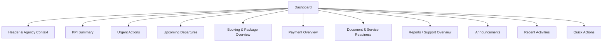
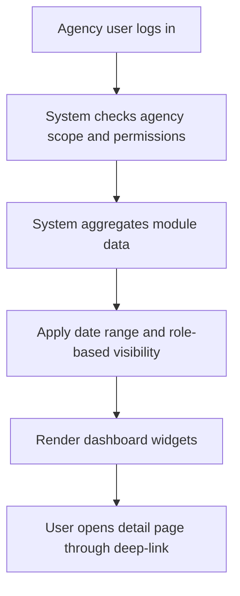

# TA PRD 01 - Dashboard

Product: UmrahHaji.com Travel Agency Portal  
Module: Dashboard  
Scope: Travel Agency Portal / Agency Workspace  
Platform: Responsive Web Platform  
Status: Draft  
Last Updated: 5 June 2026  

---

## 1. Objective

Dashboard is the main operational landing page for Travel Agency users after login. It provides a fast, agency-scoped overview of package sales, manual bookings, jamaah readiness, group trip operations, payment collection, reports, announcements, and urgent actions.

The Dashboard should help each Travel Agency answer:

1. What needs attention today?
2. Which departures are coming soon?
3. Which bookings or payments are pending?
4. Which jamaah documents or services are incomplete?
5. Which reports or support cases need follow-up?
6. What quick action should the user take next?

---

## 2. Relationship With Master PRD

This module follows the Travel Agency Portal Master PRD principles:

1. Same design system as Admin Panel.
2. Separate Travel Agency navigation structure.
3. Agency-scoped data only.
4. Admin-approved master data is consumed from Admin Panel.
5. Finance, package, booking, jamaah, group trip, mutawwif, reports, and announcement data are displayed based on permission.

Dashboard does not own business records. It summarizes and deep-links into other modules.

---

## 3. Scope

### 3.1 In Scope for Phase 1

1. Agency-scoped dashboard overview.
2. KPI summary cards.
3. Urgent action panel.
4. Upcoming departures.
5. Manual booking and reservation summary.
6. Payment and outstanding summary.
7. Document readiness summary.
8. Group trip readiness summary.
9. Open reports/support cases.
10. Recent activities.
11. Platform and agency announcements.
12. Quick actions.
13. Role-based widget visibility.
14. Responsive layout for desktop, tablet, and mobile web.

### 3.2 In Scope for Phase 2

1. Customizable dashboard widgets.
2. Saved dashboard views per role.
3. Advanced booking conversion analytics.
4. Package performance charts.
5. Finance trend charts.
6. Staff performance summary.
7. SLA performance for support reports.
8. Export dashboard summary.
9. Notification center integration.

### 3.3 Out of Scope

1. Editing package, booking, trip, invoice, or document data directly inside dashboard widgets.
2. Full analytics workspace.
3. Full finance reporting.
4. Cross-agency benchmark analytics.
5. Admin-only operational override.

---

## 4. Product Positioning

Dashboard is a read-first and action-oriented module.

It should not become a duplicate of every module. The dashboard should show concise status, trends, and actionable exceptions. Detailed work must happen in the source module.

| Data Area | Source Module | Dashboard Behavior |
|---|---|---|
| Package count | Package Management | Summary and deep-link |
| Booking count | Booking / Manual Reservation | Summary, status cards, deep-link |
| Jamaah count | Jamaah Management | Summary and readiness indicators |
| Upcoming departures | Group Trip Management | Date-based list and readiness status |
| Mutawwif assignment | Group Trip / Mutawwif Assignment | Missing assignment alert |
| Documents | Documents & Services / Jamaah / Group Trip | Pending/expired/incomplete summary |
| Payments | Finance Management | Collected, outstanding, overdue summary |
| Reports | Reports / Support | Open/in-progress/urgent summary |
| Announcements | Announcements | Latest platform and agency messages |
| Activity logs | All modules | Recent actions |

---

## 5. User Roles & Widget Visibility

| Widget / Section | Owner | Agency Admin | Operations | Sales | Finance | CS | View Only |
|---|---|---|---|---|---|---|---|
| Overall KPI Cards | Yes | Yes | Limited | Limited | Limited | Limited | Limited |
| Package Summary | Yes | Yes | View | Manage link | View | View | View |
| Booking Summary | Yes | Yes | View | Manage | View | View | View |
| Upcoming Departures | Yes | Yes | Manage | View | View | View | View |
| Document Readiness | Yes | Yes | Manage | View | No by default | View limited | View limited |
| Payment Summary | Yes | View | No | Limited | Manage | No | View limited |
| Reports / Support | Yes | Yes | Manage own | Create/view own | Create/view finance cases | Manage | View |
| Announcements | Yes | Yes | View | View | View | View | View |
| Recent Activities | Yes | Yes | Own scope | Own scope | Finance scope | Own scope | View limited |
| Quick Actions | Based on permission | Based on permission | Based on permission | Based on permission | Based on permission | Based on permission | No create action |

Rules:

1. Dashboard must hide widgets if the user has no permission to view the underlying data.
2. Sensitive finance and document metrics must not leak to roles without permission.
3. Widget links must respect the same permission checks as direct module access.

---

## 6. Information Architecture

```text
Dashboard
├── Header & Context
├── KPI Summary
├── Urgent Actions
├── Upcoming Departures
├── Booking & Package Overview
├── Payment Overview
├── Document & Service Readiness
├── Reports / Support Overview
├── Announcements
├── Recent Activities
└── Quick Actions
```

### 6.1 Dashboard IA Diagram



---

## 7. Dashboard Data Flow



Data principles:

1. Dashboard must only aggregate data from the logged-in agency.
2. Dashboard should use cached aggregate data where possible to avoid slow page load.
3. High-risk data such as payment and document status should use near-real-time values or show last updated timestamp.
4. Failed widget loading must not block the entire dashboard page.

---

## 8. Default Dashboard Layout

### 8.1 Header & Context

Content:

1. Greeting and agency name.
2. Current date.
3. Agency verification badge.
4. Last updated timestamp.
5. Date range filter.
6. Optional branch/filter if the agency has multiple branches in future.

Default date range:

| Metric Type | Default Range |
|---|---|
| Operational tasks | Today + next 30 days |
| Upcoming departures | Next 60 days |
| Finance summary | Current month |
| Package/booking summary | Current month |
| Recent activities | Last 7 days |

### 8.2 KPI Summary Cards

Recommended Phase 1 cards:

| Card | Definition | Click Behavior |
|---|---|---|
| Active Packages | Count of published active packages owned by agency | Package list filtered by Active/Published |
| New Bookings | Manual bookings created in selected period | Booking list filtered by New/Pending |
| Upcoming Departures | Active or scheduled group trips departing soon | Group trip list filtered by upcoming |
| Total Jamaah | Jamaah linked to agency bookings/trips | Jamaah list |
| Pending Documents | Required documents not completed | Documents & Services filtered by pending |
| Outstanding Payments | Sum unpaid invoice balance | Finance invoices filtered by outstanding |
| Open Reports | Open or in-progress reports related to agency | Reports list |
| Pending Tasks | Combined urgent action count | Urgent action panel |

Rules:

1. Cards should show current value and optional change from previous period.
2. Cards should display status color only when it indicates risk or urgency.
3. If a user cannot access a module, the related card must be hidden or replaced with a permission-safe summary.

### 8.3 Urgent Actions Panel

Objective: Surface the highest-priority operational tasks.

Recommended action types:

| Action Type | Example | Target Module |
|---|---|---|
| Payment Overdue | 3 invoices overdue | Finance Management |
| Document Pending | 12 passports pending | Documents & Services |
| Departure Soon | 2 group trips depart within 7 days | Group Trip Management |
| Missing Mutawwif | 1 trip has no mutawwif assigned | Mutawwif Assignment |
| Package Draft | 4 packages waiting to publish | Package Management |
| Report Waiting | 2 reports need agency response | Reports / Support |
| Agency Profile Review | Updated legal document waiting admin review | Agency Profile |

Priority order:

1. Overdue payment.
2. Departure within 7 days with incomplete readiness.
3. Missing required documents.
4. Open urgent report.
5. Missing mutawwif for upcoming trip.
6. Booking pending confirmation.
7. Profile/document review issue.

### 8.4 Upcoming Departures

Fields:

| Field | Description |
|---|---|
| Group Trip Name | Trip display name |
| Package | Related package if available |
| Departure Date | Start date |
| Return Date | End date |
| Destination Summary | Example: Makkah 3N, Madinah 4N |
| Jamaah Count | Confirmed members / capacity |
| Mutawwif | Assigned mutawwif |
| Readiness | Ready, Attention Needed, Critical |
| Quick Link | Open group trip details |

Readiness rules:

| Readiness | Condition |
|---|---|
| Ready | Required documents, services, hotel, flight, itinerary, and mutawwif are completed |
| Attention Needed | Non-critical items pending or less than 30 days before departure |
| Critical | Required item missing within 14 days before departure |

### 8.5 Booking & Package Overview

Content:

1. Booking count by status.
2. Package count by status.
3. Recently created bookings.
4. Packages with high interest or active promotions if available.
5. Draft packages awaiting completion.

Booking Phase 1 naming:

| Phase | Dashboard Label |
|---|---|
| Phase 1 | Booking / Manual Reservation |
| Phase 2 | Booking Management |

This keeps the portal aligned with Admin Panel, where full booking is a Phase 2 module while manual reservation tracking can exist in Phase 1.

### 8.6 Payment Overview

Content:

1. Total invoiced amount.
2. Collected amount.
3. Outstanding amount.
4. Overdue amount.
5. Collection rate.
6. Recent payments.
7. Payment reminder actions if enabled.

Formula:

| Metric | Formula |
|---|---|
| Outstanding | Invoice total - verified payments - approved adjustments |
| Collection Rate | Collected amount / Total invoiced amount |
| Overdue | Outstanding invoice balance where due date < today |
| Deposit Pending | Bookings requiring deposit where deposit not completed |

Rules:

1. Finance widgets are visible only to roles with finance permission.
2. Payment values must show currency.
3. Manual payment entries must be audited in Finance Management, not edited from Dashboard.

### 8.7 Document & Service Readiness

Content:

1. Pending IC/identity documents.
2. Pending passport.
3. Pending visa.
4. Pending photo.
5. Pending vaccination document.
6. Pending flight e-ticket.
7. Pending room assignment.
8. Pending service tasks.

Rules:

1. Show only aggregate counts for users without document detail permission.
2. Deep-link to filtered Documents & Services or Group Trip Members page.
3. Critical document warnings should prioritize upcoming departures.

### 8.8 Reports / Support Overview

Content:

1. Open reports.
2. In-progress reports.
3. Urgent reports.
4. Reports waiting for agency response.
5. Recent report updates.

Rules:

1. Report visibility follows sender/reported/related agency scope.
2. Urgent unresolved reports should appear in Urgent Actions.

### 8.9 Announcements

Content:

1. Latest platform announcements.
2. Agency announcements scheduled or recently sent.
3. Important/unread announcement marker.
4. Deep-link to Announcement module.

Rules:

1. Platform announcements are read-only.
2. Agency announcements follow sender permission.

### 8.10 Recent Activities

Activity types:

1. Package created/published/archived.
2. Booking created/confirmed/cancelled.
3. Jamaah invited/updated.
4. Payment recorded/verified.
5. Group trip created/updated/activated.
6. Document uploaded/status changed.
7. Report submitted/status changed.
8. Staff invited/role changed.

Rules:

1. Activity feed must not expose actions from other agencies.
2. Sensitive details should be masked for roles without permission.

### 8.11 Quick Actions

Recommended quick actions:

| Action | Permission Required |
|---|---|
| Create Package | Package Create |
| Create Manual Booking | Booking Create |
| Add / Invite Jamaah | Jamaah Create / Invite |
| Create Group Trip | Group Trip Create |
| Create Invoice | Finance Invoice Create |
| Submit Report | Report Create |
| Send Announcement | Announcement Create |

Rules:

1. Quick actions must be permission-based.
2. View-only users should not see create actions.
3. Actions should deep-link into the correct module page or modal.

---

## 9. Status & Color Rules

| Status Type | Example | Display Rule |
|---|---|---|
| Positive | Active, Paid, Ready, Published | Green chip |
| Warning | Pending, Draft, Attention Needed | Yellow/blue chip depending context |
| Critical | Overdue, Missing Required, Urgent | Red chip or alert |
| Neutral | Archived, Inactive, View Only | Gray chip |

Rules:

1. Do not overuse red unless immediate action is required.
2. Use consistent status labels across modules.
3. Dashboard status should match source module status.

---

## 10. Empty, Loading, and Error States

### Empty State

| Section | Empty Message |
|---|---|
| KPI Cards | No data available for selected period |
| Upcoming Departures | No upcoming departures |
| Urgent Actions | No urgent actions |
| Recent Activities | No recent activities |
| Reports | No open reports |
| Announcements | No announcements |

### Loading State

1. Show skeleton cards for KPI section.
2. Load critical widgets first.
3. Slow widgets must show independent loading state.

### Error State

1. If one widget fails, show widget-level error and retry action.
2. Do not block the whole dashboard unless authentication or agency scope fails.
3. Log aggregation errors for technical review.

---

## 11. Responsive Behavior

| Device | Behavior |
|---|---|
| Desktop | Multi-column cards, side-by-side operational widgets, full tables where needed |
| Tablet | Two-column cards, collapsed sidebar, compact tables |
| Mobile | Single-column cards, urgent actions first, horizontal scroll only for unavoidable tables |

Mobile priority order:

1. Urgent Actions.
2. Upcoming Departures.
3. KPI cards.
4. Pending Documents.
5. Payment Overview if permitted.
6. Reports.
7. Announcements.
8. Recent Activities.

---

## 12. Notification and Deep-Link Behavior

Dashboard alerts should deep-link into the source module with relevant filters applied.

| Alert | Deep-Link |
|---|---|
| Overdue invoices | Finance Management with status Overdue |
| Pending passports | Documents & Services with document Passport and status Pending |
| Departure in 7 days | Group Trip details |
| Missing mutawwif | Group Trip details -> Mutawwif assignment |
| Report waiting response | Report details |
| Draft package | Package edit page |

Rules:

1. Deep-link should preserve selected filters.
2. If user lacks permission, show access denied message instead of exposing data.
3. Notifications should not duplicate the same alert repeatedly in one session.

---

## 13. Analytics and Formulas

| Metric | Formula / Source |
|---|---|
| Active Packages | Count packages where status = Published/Active |
| Draft Packages | Count packages where status = Draft |
| New Bookings | Count bookings/manual reservations created in selected date range |
| Confirmed Bookings | Count bookings where status = Confirmed |
| Upcoming Departures | Count group trips with departure date >= today |
| Total Jamaah | Count unique jamaah linked to agency bookings/trips |
| Pending Documents | Count required document tasks with status Pending/Rejected |
| Document Completion Rate | Completed required documents / total required documents |
| Collected Amount | Sum verified payment amount |
| Outstanding Amount | Sum unpaid invoice balance |
| Collection Rate | Collected amount / total invoice amount |
| Open Reports | Count reports where status = Open or In Progress |

Rules:

1. Financial metrics must use verified payment status.
2. Cancelled/voided records should be excluded unless specifically shown.
3. Date range must be clear for all metrics.

---

## 14. Functional Requirements

| ID | Requirement | Priority |
|---|---|---|
| DASH-FR-001 | System must display dashboard only for logged-in agency scope | P0 |
| DASH-FR-002 | System must show KPI summary cards based on permission | P0 |
| DASH-FR-003 | System must show urgent actions ordered by priority | P0 |
| DASH-FR-004 | System must show upcoming departures | P0 |
| DASH-FR-005 | System must show pending documents and service readiness summary | P0 |
| DASH-FR-006 | System must show payment summary only for finance-authorized users | P0 |
| DASH-FR-007 | System must show report/support summary | P0 |
| DASH-FR-008 | System must show latest announcements | P0 |
| DASH-FR-009 | System must provide permission-based quick actions | P0 |
| DASH-FR-010 | System must deep-link dashboard widgets to filtered source modules | P0 |
| DASH-FR-011 | System must support desktop, tablet, and mobile web layouts | P0 |
| DASH-FR-012 | System should show recent activities | P1 |
| DASH-FR-013 | System should allow date range filtering | P1 |
| DASH-FR-014 | System should support widget-level error state | P1 |
| DASH-FR-015 | System may support customizable dashboard widgets | P2 |

---

## 15. Non-Functional Requirements

| Area | Requirement |
|---|---|
| Performance | Initial dashboard should load critical summary within acceptable web performance target |
| Reliability | Widget failure must not break the whole page |
| Security | All widgets must respect agency scope and permission |
| Audit | Quick actions that create/update records are audited in source modules |
| Privacy | Sensitive payment/document data must be hidden from unauthorized roles |
| Scalability | Dashboard aggregation should use optimized queries or cached summaries where possible |

---

## 16. Acceptance Criteria

1. User sees only data owned by their Travel Agency.
2. Dashboard widgets follow role and permission rules.
3. KPI cards show correct counts and deep-link to the related module.
4. Urgent Actions prioritize overdue payments, departure readiness, missing documents, and urgent reports.
5. Upcoming Departures shows group trips within the default date range.
6. Finance widgets are hidden for users without finance permission.
7. Document details are masked or hidden for users without document permission.
8. Mobile layout shows urgent actions before lower-priority widgets.
9. Widget-level error does not block other dashboard sections.
10. Dashboard wording uses Booking / Manual Reservation for Phase 1 and Full Booking Management for Phase 2.

---

## 17. Open Questions

1. Should Dashboard include branch-level filtering for agencies with multiple branches in Phase 1?
2. Should Agency Owner be able to reorder dashboard widgets in Phase 2?
3. Should payment and document alerts trigger automatic WhatsApp/email reminders from Dashboard or only from source modules?
4. Should package performance be visible in Phase 1 or deferred to analytics?
5. Should Dashboard show customer-facing package traffic/views if public package page is enabled?
