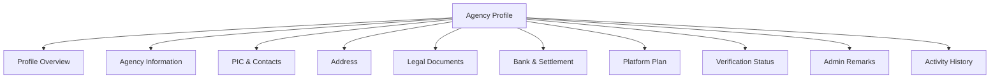
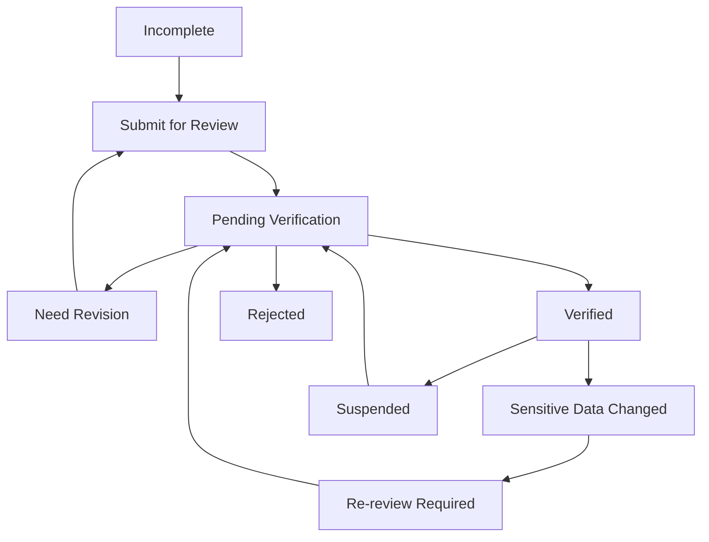
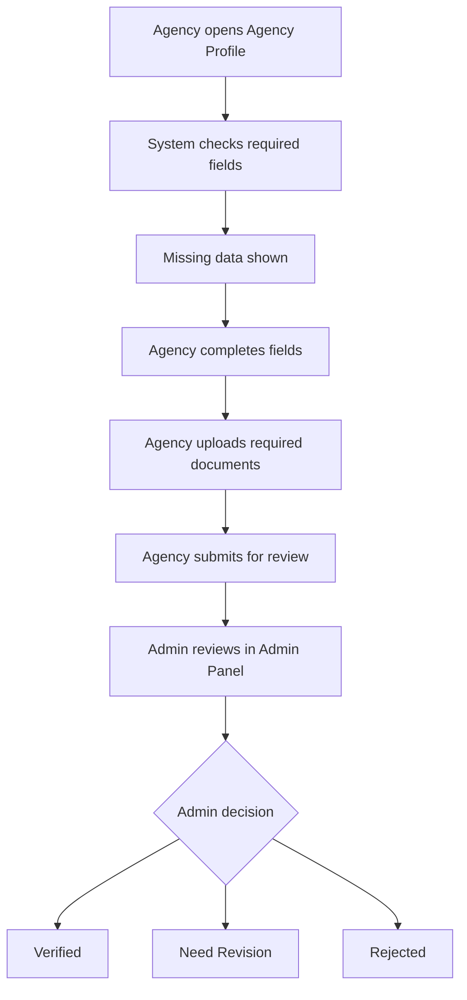
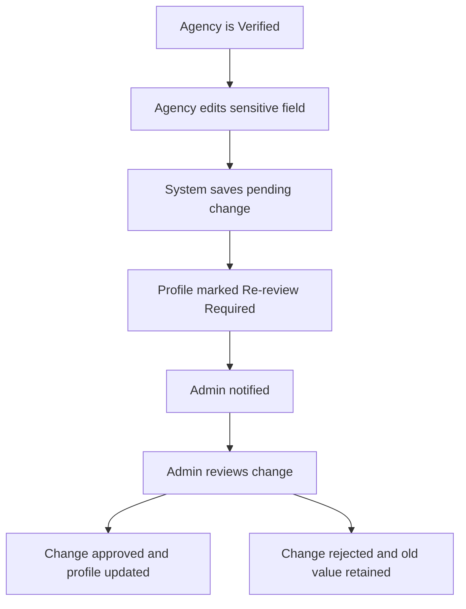
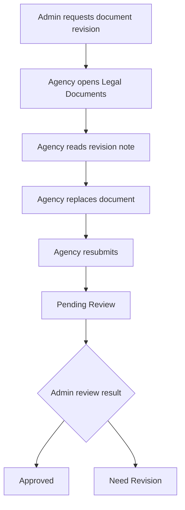

# TA PRD 02 - Agency Profile & Verification Status

Product: UmrahHaji.com Travel Agency Portal  
Module: Agency Profile & Verification Status  
Scope: Travel Agency Portal / Agency Workspace  
Platform: Responsive Web Platform  
Status: Draft  
Last Updated: 5 June 2026  

---

## 1. Module Overview

Agency Profile & Verification Status is the Travel Agency Portal workspace where a verified or registered Travel Agency can view and maintain its own business identity, PIC contact, address, legal documents, bank information, subscription or platform plan, and verification status.

The module must be agency-scoped. A Travel Agency can update its own data, but cannot approve its own verification. Any legal, bank, or identity-related changes that affect trust, compliance, or settlement must be routed to Admin Panel for review.

This module is the identity foundation for Package Management, Booking Management, Group Trip Management, Finance Management, Reports, and public-facing package trust indicators.

---

## 2. Relationship With Master PRD

This module follows the Travel Agency Portal Master PRD principles:

1. Travel Agency Portal uses the same design system as Admin Panel.
2. Travel Agency users can only access their own agency data.
3. Admin Panel remains the source of truth for approval, rejection, suspension, and compliance decisions.
4. Legal document changes may require admin re-review.
5. Sensitive profile, document, and bank updates must be audited.

---

## 3. Goals

1. Allow Travel Agency users to maintain accurate agency information.
2. Give agencies clear visibility into verification status and admin remarks.
3. Reduce manual back-and-forth between agency and Admin by showing missing or rejected requirements.
4. Protect compliance-sensitive fields through review workflows.
5. Provide verified agency identity data for package pages, invoices, reports, and customer trust.
6. Keep upload behavior lightweight and scalable for production.

---

## 4. In Scope and Out of Scope

### 4.1 In Scope for Phase 1

1. View agency profile summary.
2. Edit basic agency information.
3. Edit PIC and contact information.
4. Edit address information.
5. View and upload legal documents.
6. View and submit bank account information for settlement preparation.
7. View verification status, admin remarks, and revision requests.
8. Submit profile changes for admin review.
9. Track profile update history.
10. Display verification badge behavior for packages and public trust areas.

### 4.2 Out of Scope for Phase 1

1. Self-approval of agency verification.
2. Automated government license validation.
3. Automated bank account verification.
4. Multi-branch advanced hierarchy.
5. Subscription payment automation.
6. Public storefront profile customization beyond basic agency identity.

---

## 5. Primary Users

| User | Description | Main Need |
|---|---|---|
| Agency Owner / PIC | Main agency account owner | Maintain official agency identity and submit verification updates |
| Agency Admin | Daily agency admin | Update non-sensitive operational information |
| Finance Staff | Finance role | View or propose bank/payment-related information if permitted |
| Operations Staff | Operational staff | View agency status and contact data |
| Admin Reviewer | Internal Admin Panel user | Review submitted changes from Admin Panel |

---

## 6. Permission Rules

| Action | Owner / PIC | Agency Admin | Finance Staff | Operations Staff | View Only |
|---|---:|---:|---:|---:|---:|
| View profile | Yes | Yes | Yes | Yes | Yes |
| Edit basic profile | Yes | Yes | No | No | No |
| Edit PIC/contact | Yes | Yes | No | No | No |
| Upload legal document | Yes | Permission-based | No | No | No |
| Edit bank info | Yes | No | Permission-based | No | No |
| Submit for review | Yes | Permission-based | No | No | No |
| View verification remarks | Yes | Yes | Yes | Yes | Yes |
| View audit history | Yes | Permission-based | Permission-based | No | No |

Rules:

1. Agency Owner / PIC always has full profile permission.
2. Finance Staff can edit bank information only if explicit finance setup permission is granted.
3. Legal document and bank updates require stronger permission than basic profile updates.
4. No Travel Agency role can approve verification.
5. All changes must be logged with actor, timestamp, changed field, old value summary, and new value summary.

---

## 7. Information Architecture

```text
Agency Profile
├── Overview
├── Agency Information
├── PIC & Contacts
├── Address
├── Legal Documents
├── Bank & Settlement Information
├── Platform Plan
├── Verification Status
├── Admin Remarks
└── Activity History
```

### 7.1 IA Diagram



---

## 8. Page Structure

### 8.1 Header Area

The page header should show:

| Element | Description |
|---|---|
| Page Title | Agency Profile |
| Verification Badge | Verified, Pending Verification, Need Revision, Re-review Required, Suspended |
| Last Updated | Last profile update timestamp |
| Submit for Review Button | Visible when draft or sensitive change exists |
| Edit Button | Visible based on permission |

### 8.2 Profile Summary Card

Recommended information:

| Field | Description |
|---|---|
| Agency Logo | Uploaded agency logo |
| Agency Name | Official agency name |
| Registration Number | Company registration number |
| Travel License Number | Official travel/Umrah/Hajj license number where applicable |
| Country | Agency country |
| City | Primary operating city |
| PIC Name | Main contact person |
| Contact Email | Official contact email |
| Contact Phone | Official contact phone |
| Verification Status | Current verification state |
| Public Profile Status | Whether profile can appear on package/customer-facing areas |

### 8.3 Tab Structure

| Tab | Purpose |
|---|---|
| Agency Information | Official agency identity and business information |
| PIC & Contacts | Main PIC and support contact information |
| Address | Registered and operating address |
| Legal Documents | License and registration documents |
| Bank & Settlement | Bank account for payout/settlement preparation |
| Plan & Limits | Subscription/platform plan, package limits, staff limits if applicable |
| Remarks & History | Admin remarks, revision history, activity log |

---

## 9. Agency Information

### 9.1 Purpose

Agency Information stores the official business identity used across the portal, package listings, invoices, reports, and Admin Panel.

### 9.2 Field Requirements

| Field | Type | Required | Editable by Agency | Review Required | Notes |
|---|---|---:|---:|---:|---|
| Agency Logo | Image Upload | No | Yes | No | Used in portal and package display |
| Agency Name | Text | Yes | Yes | Yes | Official legal or trading name |
| Registration Number | Text | Yes | Yes | Yes | Company/business registration number |
| Travel License Number | Text | Conditional | Yes | Yes | Required if agency provides regulated travel services |
| License Expiry Date | Date | Conditional | Yes | Yes | Must be future date for active verification |
| Agency Type | Select | Yes | Yes | Yes | Umrah, Hajj, Umrah & Hajj, General Travel |
| Country | Select | Yes | Yes | Yes | Primary agency country |
| Website | URL | No | Yes | No | Public or business website |
| Description | Textarea | No | Yes | No | Short agency description |
| Public Display Name | Text | No | Yes | No | Optional customer-facing name |

### 9.3 Rules

1. Agency name, registration number, license number, and license expiry changes require admin re-review.
2. Public Display Name cannot be misleading or materially different from verified agency identity.
3. Expired license must trigger warning and may affect package publishing depending on platform policy.
4. Agency Logo must pass upload validation and moderation rules.

---

## 10. PIC & Contacts

### 10.1 Purpose

PIC & Contacts stores the official contact channels used by Admin, customers, invoice recipients, and support workflows.

### 10.2 Field Requirements

| Field | Type | Required | Editable by Agency | Review Required | Notes |
|---|---|---:|---:|---:|---|
| PIC Full Name | Text | Yes | Yes | Yes | Main accountable person |
| PIC Position | Text | Yes | Yes | No | Example: Owner, Director, Operations Manager |
| PIC Email | Email | Yes | Yes | Yes | Requires verification if changed |
| PIC Phone Country Code | Select | Yes | Yes | No | Default based on country |
| PIC Phone Number | Phone | Yes | Yes | Yes | Requires verification if changed |
| Support Email | Email | No | Yes | No | Customer support contact |
| Support Phone | Phone | No | Yes | No | Customer support contact |
| Finance Email | Email | No | Yes | No | Invoice and settlement communication |
| Emergency Contact | Phone | No | Yes | No | Optional operations contact |

### 10.3 Rules

1. PIC email and phone changes require confirmation and may require admin review.
2. System notifications should use PIC contact for compliance-sensitive messages.
3. Finance notifications may use Finance Email if configured.
4. If support contact is empty, system falls back to PIC contact.

---

## 11. Address

### 11.1 Purpose

Address stores the registered and operating location of the agency.

### 11.2 Field Requirements

| Field | Type | Required | Editable by Agency | Review Required | Notes |
|---|---|---:|---:|---:|---|
| Registered Country | Select | Yes | Yes | Yes | Legal registered country |
| Registered State/Province | Select | Yes | Yes | Yes | Legal registered area |
| Registered City | Select | Yes | Yes | Yes | Legal registered city |
| Registered Postal Code | Text | Yes | Yes | Yes | Postal/ZIP code |
| Registered Address | Textarea | Yes | Yes | Yes | Full registered address |
| Operating Address Same as Registered | Toggle | No | Yes | No | If enabled, copy registered address |
| Operating Address | Textarea | Conditional | Yes | No | Required if different |
| Map Coordinates | Text/Map Picker | No | Yes | No | Optional Phase 1 enhancement |

### 11.3 Rules

1. Registered address changes require admin re-review.
2. Operating address can be updated without re-review unless platform policy requires validation.
3. Address should be used for invoices, profile display, and compliance records.

---

## 12. Legal Documents

### 12.1 Purpose

Legal Documents allows the Travel Agency to upload supporting documents required for verification, compliance, and trust.

Important rule: legal verification should use both document number and uploaded document where applicable. Numbers alone are not enough for verification-sensitive documents because Admin needs evidence to review.

### 12.2 Document Types

| Document | Required | Number Required | Upload Required | Review Required | Notes |
|---|---:|---:|---:|---:|---|
| Company Registration Certificate | Yes | Yes | Yes | Yes | Required for verified agency status |
| Travel Agency License | Conditional | Yes | Yes | Yes | Required if country/regulation requires license |
| Umrah/Hajj Authorization | Conditional | Yes | Yes | Yes | Required if agency sells regulated pilgrimage packages |
| Director/PIC Identity Document | Yes | Yes | Yes | Yes | IC/passport or equivalent |
| Business Address Proof | Conditional | No | Yes | Yes | Utility bill, tenancy, office proof if needed |
| Bank Account Proof | Conditional | No | Yes | Yes | Required before settlement activation |
| Tax Registration Document | Optional | Yes | Optional | Yes if provided | Used for invoice/tax records |
| Other Supporting Document | Optional | Optional | Optional | Yes if submitted | Admin-defined requirement |

### 12.3 Document Status

| Status | Meaning |
|---|---|
| Not Uploaded | Required document has not been uploaded |
| Uploaded | File uploaded but not submitted for review |
| Pending Review | Submitted to Admin for verification |
| Approved | Admin verified the document |
| Need Revision | Admin requires correction |
| Rejected | Document invalid or unacceptable |
| Expired | Document expiry date has passed |

### 12.4 Upload Rules

| File Type | Allowed Format | Max Size | Notes |
|---|---|---:|---|
| Legal document | PDF, JPG, JPEG, PNG | 5 MB per file | Prefer PDF for certificates/licenses |
| Identity image | JPG, JPEG, PNG | 3 MB per file | Front/back can be separate files |
| Agency logo | JPG, JPEG, PNG, WEBP | 2 MB per file | Recommended square 512 x 512 px |
| Supporting image | JPG, JPEG, PNG | 5 MB per file | For address or supporting proof |

Server protection rules:

1. Uploads must use direct-to-object-storage or equivalent, not base64 payloads through application JSON.
2. Files should be virus-scanned asynchronously before becoming reviewable.
3. Images should be compressed and resized automatically for preview thumbnails.
4. Original files should be stored privately and accessed through signed URLs.
5. PDF previews should generate lightweight thumbnails; do not render full PDFs on every list load.
6. File names should be sanitized and stored with generated storage keys.
7. Maximum legal document upload batch in Phase 1 should be 10 files per submission.
8. If upload fails, profile draft must remain saved and user can retry the specific file.

---

## 13. Bank & Settlement Information

### 13.1 Purpose

Bank & Settlement Information stores payout and settlement preparation data. In Phase 1, actual payout automation can remain manual, but the system should collect clean, verified bank data for finance operations.

### 13.2 Field Requirements

| Field | Type | Required | Editable by Agency | Review Required | Notes |
|---|---|---:|---:|---:|---|
| Bank Country | Select | Conditional | Yes | Yes | Required before settlement activation |
| Bank Name | Select/Text | Conditional | Yes | Yes | Use master bank list where available |
| Account Holder Name | Text | Conditional | Yes | Yes | Must match agency or authorized party |
| Account Number | Text | Conditional | Yes | Yes | Masked after save |
| SWIFT/BIC | Text | Conditional | Yes | Yes | Required for international settlement |
| Settlement Currency | Select | Conditional | Yes | Yes | Default based on country |
| Bank Proof Document | Upload | Conditional | Yes | Yes | Bank statement/header or account proof |
| Finance Contact Email | Email | No | Yes | No | For settlement communication |

### 13.3 Rules

1. Bank information is hidden by default and only visible to permitted roles.
2. Account number should be masked after save, e.g. only last 4 digits visible.
3. Any bank change requires admin review before it can be used for settlement.
4. Admin approval from Admin Panel is required to mark bank status as Verified.
5. Finance Management should reference bank verification status before settlement preparation.

---

## 14. Platform Plan & Limits

### 14.1 Purpose

This section shows the agency's current platform plan or usage limits. In Phase 1 this can be read-only if subscription automation is not ready.

### 14.2 Data Display

| Field | Description |
|---|---|
| Plan Name | Current agency plan |
| Plan Status | Active, Trial, Suspended, Expired |
| Package Limit | Maximum active package count if applicable |
| Staff Limit | Maximum staff users if applicable |
| Commission Rule | Platform commission model summary |
| Settlement Rule | Settlement preparation schedule |
| Support Level | Basic, Standard, Priority |
| Effective Date | Plan start date |
| Renewal Date | Plan renewal date if applicable |

Rules:

1. Agency cannot directly edit plan in Phase 1 unless Admin enables self-service subscription.
2. If plan is Suspended or Expired, Package publishing and new booking creation may be restricted.
3. Plan changes must come from Admin Panel or billing/subscription workflow.

---

## 15. Verification Status

### 15.1 Status Definitions

| Status | Meaning | Agency Action |
|---|---|---|
| Incomplete | Required profile or documents are missing | Complete missing data |
| Pending Verification | Submitted and waiting for Admin review | Wait or respond to Admin questions |
| Need Revision | Admin requested correction | Update requested fields/documents and resubmit |
| Verified | Agency has passed verification | Maintain data and operate normally |
| Re-review Required | Sensitive verified data changed | Submit changes for Admin review |
| Suspended | Admin suspended agency access or operations | Contact support/Admin |
| Rejected | Agency verification rejected | View rejection reason if permitted |

### 15.2 Status Flow



### 15.3 Rules

1. Only Admin Panel can change status to Verified, Suspended, or Rejected.
2. Agency can trigger Pending Verification by submitting required data.
3. Sensitive field changes should set profile status to Re-review Required or create a pending change request.
4. Existing verified agency operations should not always be blocked during re-review; blocking depends on field severity.
5. If license expires, package publishing should be blocked or warned based on Admin policy.

---

## 16. Edit and Review Logic

### 16.1 Field Categories

| Category | Examples | Save Behavior |
|---|---|---|
| Low Risk | Description, website, support email, operating address | Save immediately with audit log |
| Medium Risk | PIC position, support phone, logo, public display name | Save or submit based on policy |
| High Risk | Agency name, registration number, license number, registered address | Save as pending change request |
| Critical Risk | Bank account, legal documents, PIC identity, license document | Save as pending change request and notify Admin |

### 16.2 Pending Change Behavior

1. Pending changes should be stored separately from currently approved profile data.
2. Public-facing package and invoice data should continue using approved values until Admin approves pending changes.
3. Agency can see a comparison between current approved value and submitted value.
4. Agency can cancel pending change before Admin review starts.
5. Admin decision must update agency profile and notify agency.

---

## 17. Main User Flows

### 17.1 Complete Profile Flow



### 17.2 Sensitive Profile Update Flow



### 17.3 Document Revision Flow



---

## 18. Functional Requirements

| ID | Requirement | Priority |
|---|---|---|
| TA-PROF-001 | System must display agency profile data scoped to the logged-in agency only. | P0 |
| TA-PROF-002 | System must show verification status in the page header and profile summary. | P0 |
| TA-PROF-003 | Agency users with permission can edit basic agency profile fields. | P0 |
| TA-PROF-004 | Agency users with permission can upload required legal documents. | P0 |
| TA-PROF-005 | System must require document uploads for verification-sensitive legal records. | P0 |
| TA-PROF-006 | System must support document status: Not Uploaded, Uploaded, Pending Review, Approved, Need Revision, Rejected, Expired. | P0 |
| TA-PROF-007 | System must route sensitive profile changes to Admin Panel for review. | P0 |
| TA-PROF-008 | System must keep approved values active until pending sensitive changes are approved. | P0 |
| TA-PROF-009 | System must show Admin remarks and revision instructions to agency users. | P0 |
| TA-PROF-010 | System must notify agency when verification status changes. | P0 |
| TA-PROF-011 | System must notify Admin when agency submits verification or re-review request. | P0 |
| TA-PROF-012 | System must mask bank account number after save. | P0 |
| TA-PROF-013 | System must restrict bank information visibility by permission. | P0 |
| TA-PROF-014 | System must log all profile, document, bank, and verification-related changes. | P0 |
| TA-PROF-015 | System must enforce upload format and max size rules. | P0 |
| TA-PROF-016 | System must support save draft behavior for incomplete profile changes. | P1 |
| TA-PROF-017 | System must support profile completion percentage or checklist. | P1 |
| TA-PROF-018 | System should support public profile preview if customer-facing package pages are enabled. | P1 |
| TA-PROF-019 | System should support branch information in Phase 2 if multi-branch agency operations are needed. | P2 |

---

## 19. Form Specification

### 19.1 Agency Information Form

| Field | Type | Required | Validation | Notes |
|---|---|---:|---|---|
| Agency Logo | Upload | No | JPG/JPEG/PNG/WEBP, max 2 MB | Auto-compress preview |
| Agency Name | Text | Yes | Max 150 chars | Review required |
| Registration Number | Text | Yes | Max 80 chars | Review required |
| Travel License Number | Text | Conditional | Max 80 chars | Required if regulated travel |
| License Expiry Date | Date | Conditional | Future date | Warning if near expiry |
| Agency Type | Select | Yes | Master options | Umrah/Hajj/etc. |
| Country | Select | Yes | Master country list | Required |
| Website | URL | No | Valid URL | Optional |
| Description | Textarea | No | Max 1,000 chars | Public summary |
| Public Display Name | Text | No | Max 100 chars | Optional |

### 19.2 PIC & Contact Form

| Field | Type | Required | Validation | Notes |
|---|---|---:|---|---|
| PIC Full Name | Text | Yes | Max 120 chars | Review required |
| PIC Position | Text | Yes | Max 80 chars | Owner/Director/etc. |
| PIC Email | Email | Yes | Valid email | Email verification if changed |
| PIC Phone Country Code | Select | Yes | Country code | Required |
| PIC Phone Number | Phone | Yes | Valid phone | Phone verification if changed |
| Support Email | Email | No | Valid email | Customer support |
| Support Phone | Phone | No | Valid phone | Customer support |
| Finance Email | Email | No | Valid email | Finance notifications |

### 19.3 Address Form

| Field | Type | Required | Validation | Notes |
|---|---|---:|---|---|
| Registered Country | Select | Yes | Master country list | Review required |
| Registered State/Province | Select | Yes | Master region list | Review required |
| Registered City | Select | Yes | Master city list | Review required |
| Registered Postal Code | Text | Yes | Max 20 chars | Review required |
| Registered Address | Textarea | Yes | Max 500 chars | Review required |
| Operating Same as Registered | Toggle | No | Boolean | Copy address |
| Operating Address | Textarea | Conditional | Max 500 chars | Required if different |

### 19.4 Legal Document Upload Form

| Field | Type | Required | Validation | Notes |
|---|---|---:|---|---|
| Document Type | Select | Yes | Master document type | Required |
| Document Number | Text | Conditional | Max 100 chars | Required for license/certificate |
| Issue Date | Date | No | Valid date | Optional |
| Expiry Date | Date | Conditional | Future date if required | Required for license |
| Upload File | Upload | Yes | PDF/JPG/JPEG/PNG, max 5 MB | Required for verification |
| Notes | Textarea | No | Max 500 chars | Agency note to Admin |

### 19.5 Bank & Settlement Form

| Field | Type | Required | Validation | Notes |
|---|---|---:|---|---|
| Bank Country | Select | Conditional | Master country list | Required before settlement |
| Bank Name | Select/Text | Conditional | Max 100 chars | Prefer master bank list |
| Account Holder Name | Text | Conditional | Max 150 chars | Must match agency/authorized party |
| Account Number | Text | Conditional | Numeric/alphanumeric by country | Mask after save |
| SWIFT/BIC | Text | Conditional | 8-11 chars | International settlement |
| Settlement Currency | Select | Conditional | Currency list | Example: MYR |
| Bank Proof Document | Upload | Conditional | PDF/JPG/JPEG/PNG, max 5 MB | Review required |
| Finance Contact Email | Email | No | Valid email | Optional |

---

## 20. Notifications

| Trigger | Recipient | Channel | Notes |
|---|---|---|---|
| Profile submitted for review | Admin reviewer | Admin notification | Creates review task |
| Verification approved | Agency Owner/PIC | Email/in-app | Status becomes Verified |
| Revision requested | Agency Owner/PIC | Email/in-app | Include admin remarks |
| Document rejected | Agency Owner/PIC | Email/in-app | Include document type |
| Sensitive change submitted | Admin reviewer | Admin notification | Re-review queue |
| Bank info submitted | Admin/Finance reviewer | Admin notification | Restricted visibility |
| License near expiry | Agency Owner/PIC | Email/in-app | Suggested 30/14/7 day reminders |

---

## 21. Empty, Error, and Loading States

### 21.1 Empty States

| Area | Empty State |
|---|---|
| Legal Documents | Show required document checklist and Upload Document action |
| Bank Information | Show message that settlement bank is not yet configured |
| Admin Remarks | Show "No admin remarks yet" |
| Activity History | Show "No activity recorded yet" |

### 21.2 Error States

| Error | Behavior |
|---|---|
| Upload too large | Reject upload and show max size |
| Unsupported format | Reject upload and show accepted formats |
| Virus scan failed | Mark file as blocked and require re-upload |
| Required field missing | Highlight field and block submit |
| Pending review exists | Prevent duplicate submission and show pending request |
| Permission denied | Hide edit action or show read-only warning |

### 21.3 Loading States

1. Show skeleton for profile summary.
2. Show loading indicator for document list.
3. Upload progress must be visible per file.
4. Large file upload should not block editing other profile fields.

---

## 22. Responsive Behavior

| Device | Behavior |
|---|---|
| Desktop | Tabs or side navigation with two-column form layout |
| Tablet | Tabs remain visible; forms collapse to one or two columns depending width |
| Mobile | Sections stack vertically; sticky submit bar optional; upload cards full width |

Rules:

1. Status badge and Submit for Review action must remain easy to find on mobile.
2. Document upload cards must show file status clearly without horizontal scrolling.
3. Sensitive data should remain masked on all screen sizes.

---

## 23. Data Dependencies

| Data | Source |
|---|---|
| Agency record | Travel Agency application approval / Admin Panel |
| Verification status | Admin Panel |
| Legal document types | Admin master data / settings |
| Country/city list | Admin master data |
| Bank list | Admin master data or finance settings |
| Plan/subscription | Admin billing/subscription configuration |
| Audit log | Shared audit log service |

---

## 24. Integration With Other Modules

| Module | Dependency |
|---|---|
| Dashboard | Shows profile completion, verification warnings, license expiry |
| Package Management | Package publishing may depend on Verified status and valid license |
| Booking Management | Booking invoices use approved agency data |
| Finance Management | Settlement preparation depends on verified bank data |
| Reports / Support | Reports reference agency identity and contact data |
| Announcements | Platform-to-agency announcements can target verification status |
| Admin Panel | Admin reviews submissions, documents, re-review requests, and status changes |

---

## 25. Acceptance Criteria

1. Agency Profile only displays data for the logged-in agency.
2. Verification status is visible in profile header and summary card.
3. Agency users can edit fields according to their permission.
4. Sensitive fields are saved as pending changes and routed to Admin review.
5. Approved values remain active until pending sensitive changes are approved.
6. Required legal documents cannot be submitted without uploaded evidence.
7. Upload validation enforces allowed format and max file size.
8. Bank account number is masked after save.
9. Admin remarks are visible to agency users when revision is requested.
10. All profile changes create audit log records.
11. Dashboard can surface profile completion and verification warning data.
12. Package publishing rules can check agency verification and license validity.

---

## 26. Open Questions

1. Should Phase 1 allow agencies to update bank information, or should bank updates be Admin-assisted only?
2. Should verified agencies be blocked from publishing new packages while sensitive profile changes are under re-review?
3. Which legal licenses are mandatory per target market in Phase 1?
4. Should public agency profile pages be enabled in Phase 1 or only package-level agency badges?
5. Should agency branch management be included in Phase 1 for large travel agencies?
