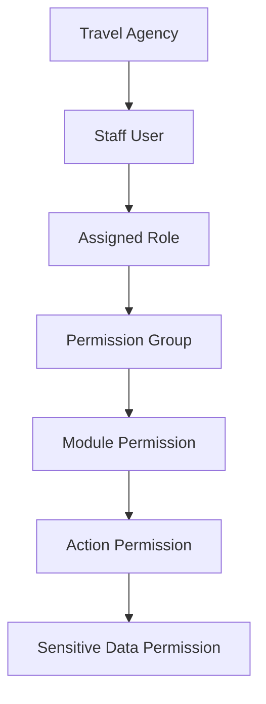
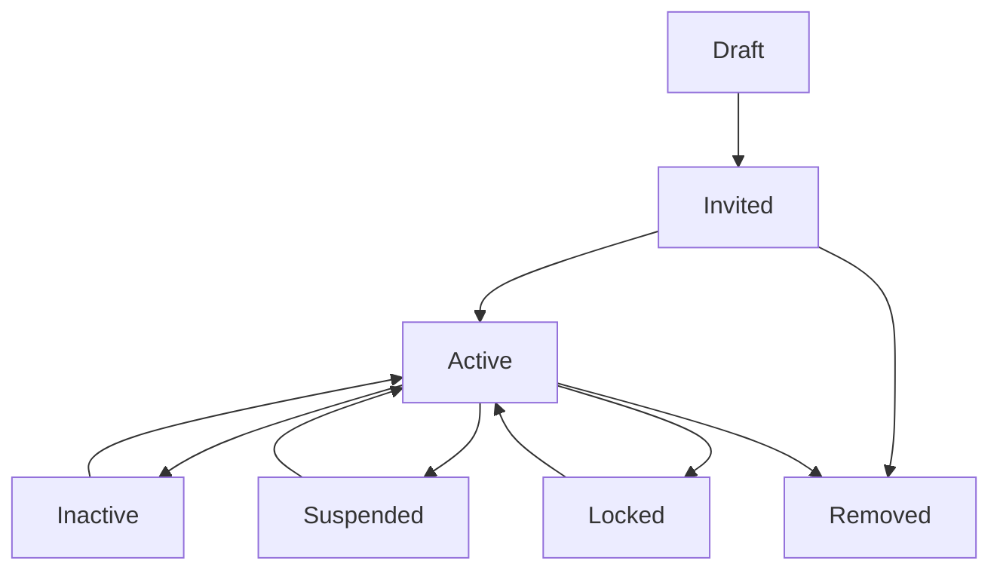
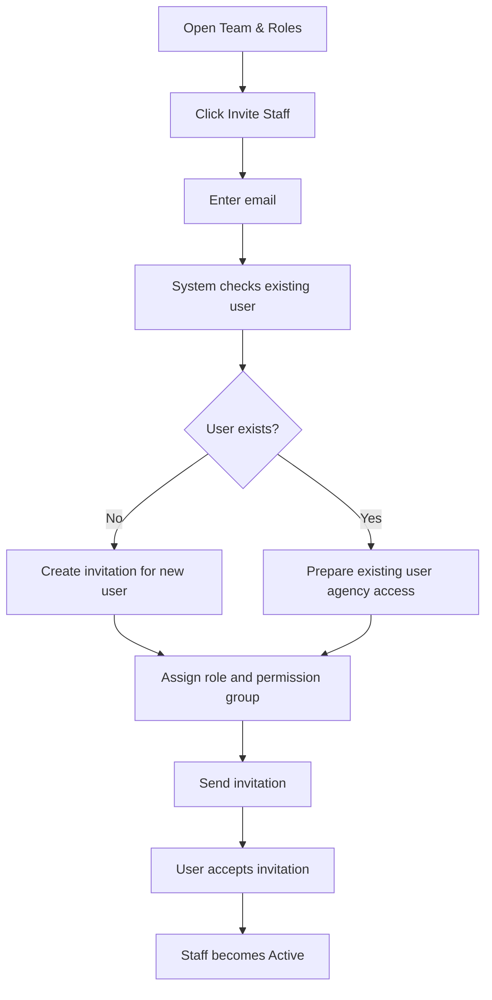
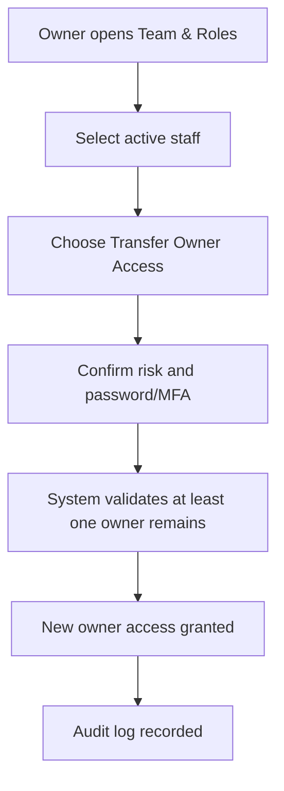

# TA PRD 03 - Team & Roles

Product: UmrahHaji.com Travel Agency Portal  
Module: Team & Roles  
Scope: Travel Agency Portal / Agency Workspace  
Platform: Responsive Web Platform  
Status: Draft  
Last Updated: 5 June 2026  

---

## 1. Module Overview

Team & Roles is the Travel Agency Portal module for managing agency staff access, role assignment, permission groups, invitation status, account security, and activity visibility.

This module allows Agency Owner and authorized Agency Admin users to invite staff, assign portal roles, configure access permissions, activate or deactivate users, and review login/activity history within their own agency scope.

Team & Roles must be separated from Jamaah Management. Jamaah users are customers or pilgrims. Team users are internal agency staff who operate packages, bookings, jamaah records, group trips, finance, reports, and settings on behalf of the Travel Agency.

---

## 2. Relationship With Master PRD

This module follows the Travel Agency Portal Master PRD principles:

1. Agency Owner can create roles and invite staff.
2. Staff access must be limited by role and permission.
3. Sensitive data such as payment records, identity documents, passport documents, and bank data must require explicit permission.
4. Staff cannot access another Travel Agency's data.
5. Admin assistance or override can only happen through Admin Panel audit-controlled workflows.

---

## 3. Goals

1. Allow Travel Agencies to manage their own internal staff access.
2. Reduce dependency on Admin Panel for routine staff invitation and access changes.
3. Support role-based and permission-based access control.
4. Protect sensitive finance, personal identity, travel document, and bank data.
5. Provide clear account status, invitation status, and login visibility.
6. Keep permission configuration understandable for non-technical agency owners.
7. Ensure every access-related action is auditable.

---

## 4. In Scope and Out of Scope

### 4.1 In Scope for Phase 1

1. Staff list.
2. Invite new staff by email.
3. Add existing platform user as agency staff.
4. Assign default role.
5. Assign permission group.
6. View staff profile and access summary.
7. Activate, deactivate, suspend, or remove staff access.
8. Resend invitation.
9. Cancel pending invitation.
10. Login and activity history.
11. Role templates for common agency roles.
12. Permission matrix by module and action.
13. Sensitive data permission controls.
14. Owner protection rule.

### 4.2 Out of Scope for Phase 1

1. Advanced organization hierarchy and multi-branch role inheritance.
2. Automated HR system integration.
3. Single sign-on with enterprise identity providers.
4. Device trust management.
5. Granular row-level permissions beyond agency scope.
6. Custom approval workflow for every permission change.
7. Native app staff management.

---

## 5. User Types

| User Type | Description | Access Principle |
|---|---|---|
| Agency Owner / PIC | Main agency account owner | Full agency access and cannot be removed by other staff |
| Agency Admin | Trusted internal admin | Can manage staff if permission is granted |
| Operations Staff | Handles operational records | Access to jamaah, group trip, documents, mutawwif, itinerary |
| Sales / Booking Staff | Handles package inquiry and booking intake | Access to package view, booking, jamaah invite, customer communication |
| Finance Staff | Handles invoice and payment operations | Access to finance, invoices, payments, refunds, settlement view |
| Customer Service Staff | Handles support and reports | Access to reports, announcements, customer issue history |
| Marketing Staff | Handles package content and promotion | Access to package content, media, promotional labels, articles if enabled |
| Auditor / View Only | Read-only observer | Read-only access to selected modules and reports |

---

## 6. Permission Model

### 6.1 Permission Hierarchy

```text
Agency
-> Staff User
-> Role
-> Permission Group
-> Module Permission
-> Action Permission
-> Sensitive Data Permission
```

### 6.2 Permission Diagram



### 6.3 Permission Types

| Permission Type | Description | Examples |
|---|---|---|
| Module Permission | Controls module visibility | View Package, View Finance |
| Action Permission | Controls what user can do inside module | Create, Edit, Archive, Export |
| Sensitive Data Permission | Controls protected data visibility | Passport, IC, payment proof, bank details |
| Settings Permission | Controls configuration access | Manage roles, notification settings |
| Report Permission | Controls case handling | View reports, assign report, resolve report |

---

## 7. Default Role Templates

Default role templates should be available to reduce setup friction. Agency Owner can use templates as-is or duplicate them into custom permission groups.

| Role Template | Default Purpose |
|---|---|
| Agency Owner / PIC | Full control over agency portal, team, finance, settings, and profile |
| Agency Admin | General operations admin with broad access but limited owner-only controls |
| Operations Staff | Trip, jamaah, document, service, itinerary, hotel, flight, and mutawwif operations |
| Sales / Booking Staff | Booking intake, jamaah invitation, package inquiry, and customer communication |
| Finance Staff | Invoice, payment, refund, commission, outstanding balance, settlement view |
| Customer Service Staff | Reports, customer issues, announcements, and communication |
| Marketing Staff | Package content, media, promo labels, testimonial view, article request if enabled |
| Auditor / View Only | Read-only access to selected records |

### 7.1 Role Template Rules

1. Role templates are system-provided defaults.
2. Agency can assign a template directly.
3. Agency can create custom permission groups based on a template.
4. System templates cannot be deleted.
5. Custom permission groups can be edited, archived, or duplicated.

---

## 8. Staff Account Status

| Status | Meaning | Allowed Actions |
|---|---|---|
| Draft | Staff record created but invitation not sent | Edit, send invitation, delete |
| Invited | Invitation sent but not accepted | Resend invitation, cancel invitation |
| Active | User accepted invitation and can access portal | Edit role, deactivate, suspend |
| Inactive | Access disabled by agency | Reactivate, remove access |
| Suspended | Access blocked due to risk or Admin action | View, request Admin support |
| Locked | Account locked due to failed login/security rule | Reset access, contact support |
| Removed | Staff access removed from agency | View audit only |

### 8.1 Staff Status Flow



---

## 9. Staff List

### 9.1 Purpose

Staff List allows authorized users to see all staff who have or had access to the Travel Agency Portal.

### 9.2 Recommended Columns

| Column | Description |
|---|---|
| Staff Name | Full name and avatar |
| Email | Login email |
| Phone | Staff phone number if available |
| Role | Assigned role template |
| Permission Group | Assigned custom or default permission group |
| Portal Access | Travel Agency Portal access indicator |
| Status | Draft, Invited, Active, Inactive, Suspended, Locked, Removed |
| Last Login | Last successful login timestamp |
| MFA | Enabled / Not Enabled if supported |
| Date Added | Staff added timestamp |
| Actions | View, edit role, resend invite, deactivate, remove |

### 9.3 Filters

| Filter | Options |
|---|---|
| Role | Owner, Admin, Operations, Sales, Finance, CS, Marketing, Auditor |
| Status | Draft, Invited, Active, Inactive, Suspended, Locked, Removed |
| Permission Group | Default and custom permission groups |
| Last Login | All Time, Today, This Week, This Month, This Year, Never Logged In |
| Date Added | All Time, Today, This Week, This Month, This Year, Custom Range |

### 9.4 Search

Search should support:

1. Staff name.
2. Email.
3. Phone number.
4. Role name.
5. Permission group name.

---

## 10. Invite Staff

### 10.1 Purpose

Invite Staff allows Agency Owner or authorized Agency Admin to add a new or existing platform user to the Travel Agency Portal.

### 10.2 Invite Modes

| Mode | Description | Behavior |
|---|---|---|
| Invite New User | Email does not exist in the platform | Create pending user and send invitation |
| Add Existing User | Email already exists in the platform | Attach user to agency with selected role after acceptance or confirmation |

### 10.3 Invite Flow



### 10.4 Invite Form Fields

| Field | Type | Required | Validation | Notes |
|---|---|---:|---|---|
| Full Name | Text | Conditional | Max 120 chars | Required for new user if not available |
| Email | Email | Yes | Valid email | Login identity |
| Phone Country Code | Select | No | Country code | Optional |
| Phone Number | Phone | No | Valid phone | Optional |
| Role | Select | Yes | Role template list | Required |
| Permission Group | Select | Optional | Agency permission group | Defaults from role |
| Job Title | Text | No | Max 80 chars | Internal label |
| Department | Select/Text | No | Max 80 chars | Operations, Finance, Sales, CS |
| Invitation Message | Textarea | No | Max 500 chars | Optional message |

### 10.5 Invite Rules

1. Email must be unique within the same agency staff list.
2. If email exists as a Jamaah user, system can attach staff access only after explicit invitation acceptance.
3. A user may have multiple portal contexts if allowed, but must explicitly switch context.
4. Invitation link should expire after a configurable period, recommended 7 days.
5. Expired invitations can be resent.
6. Staff cannot access portal before accepting invitation and completing password setup or login.
7. Invite action must be logged.

---

## 11. Staff Detail

### 11.1 Purpose

Staff Detail allows authorized users to review staff identity, role, permissions, status, sessions, and recent activities.

### 11.2 Detail Sections

| Section | Description |
|---|---|
| Profile | Name, email, phone, job title, department |
| Access Summary | Role, permission group, effective permissions |
| Account Status | Current status, invitation status, last login |
| Security | MFA status, failed login count, active sessions if available |
| Activity History | Recent actions performed by the staff |
| Audit Trail | Role changes, status changes, permission changes |

### 11.3 Staff Detail Rules

1. Agency Owner can view all staff details.
2. Agency Admin can view staff details if permission is granted.
3. Staff can view their own profile and access summary.
4. Sensitive security details should be limited to authorized users.
5. Removed staff remains visible in audit history but cannot access the portal.

---

## 12. Role & Permission Management

### 12.1 Purpose

Role & Permission Management allows Agency Owner or authorized Admin to control what agency staff can see and do.

### 12.2 Permission Matrix Actions

| Action | Meaning |
|---|---|
| View | Can access page or record |
| Create | Can create new record |
| Edit | Can update existing record |
| Delete | Can delete where deletion is allowed |
| Archive | Can archive record |
| Export | Can export data |
| Approve | Can approve internal agency workflow if applicable |
| Assign | Can assign members, mutawwif, PIC, or report owner |
| Manage Settings | Can change module settings |

### 12.3 Sensitive Data Permissions

| Permission | Protected Data |
|---|---|
| View Identity Documents | IC, passport, profile identity image |
| Manage Identity Documents | Upload, replace, status update identity documents |
| View Travel Documents | Visa, vaccination, e-ticket, train ticket |
| Manage Travel Documents | Upload and update travel document status |
| View Payment Data | Invoice amount, paid amount, proof, outstanding balance |
| Manage Payment Data | Create invoice, record payment, update payment status |
| View Bank Data | Agency bank and settlement details |
| Manage Bank Data | Edit bank and settlement information |
| View Commission Data | Commission, platform fee, settlement estimates |
| Manage Refunds | Refund request and adjustment handling |

### 12.4 Module Permission Matrix

| Module | Owner | Admin | Operations | Sales | Finance | CS | Marketing | Auditor |
|---|---:|---:|---:|---:|---:|---:|---:|---:|
| Dashboard | Full | View | View | View | View | View | View | View |
| Agency Profile | Full | Edit basic | View | View | View finance fields if permitted | View | View | View |
| Team & Roles | Full | Manage if permitted | No | No | No | No | No | View if permitted |
| Package Management | Full | Manage | View/Edit ops fields | View/Create booking-related | View price if permitted | View | Manage content | View |
| Booking / Manual Reservation | Full | Manage | Manage | Manage | View payment summary | View/manage support notes | View | View |
| Jamaah Management | Full | Manage | Manage | Invite/View | View payment summary if permitted | View | No | View |
| Group Trip Management | Full | Manage | Manage | View | View finance summary if permitted | View | No | View |
| Mutawwif Assignment | Full | Manage | Manage | View | No | View | No | View |
| Documents & Services | Full | Manage | Manage | View | View finance-related docs if permitted | View | No | View |
| Finance Management | Full | View/Manage if permitted | View limited | View limited | Manage | View limited | No | View |
| Reports / Support | Full | Manage | Manage related | Manage related | Manage payment reports | Manage | View | View |
| Testimonials | Full | View | View | View | No | Manage response | View | View |
| Announcements | Full | Manage | View | View | No | Manage | Manage | View |
| Settings | Full | Manage if permitted | No | No | Finance settings if permitted | No | No | View |

Rules:

1. Finance permissions must be separate from operations permissions.
2. Document permissions must be explicit.
3. Payment and bank permissions must be explicit.
4. Export permissions must be explicit for any module containing personal or financial data.
5. Permission changes must take effect immediately after save, except active sessions may need refresh.

---

## 13. Custom Permission Group

### 13.1 Purpose

Custom Permission Group allows agencies to create role variants without changing system templates.

### 13.2 Form Fields

| Field | Type | Required | Validation | Notes |
|---|---|---:|---|---|
| Permission Group Name | Text | Yes | Max 100 chars | Example: Finance Viewer |
| Description | Textarea | No | Max 500 chars | Internal explanation |
| Base Template | Select | No | Role template list | Optional starting point |
| Module Permissions | Checkbox Matrix | Yes | At least one module view | Grouped by module |
| Sensitive Data Permissions | Checkbox Matrix | Optional | Explicit selection | Identity, document, finance, bank |
| Status | Radio/Select | Yes | Active, Inactive | Active by default |

### 13.3 Rules

1. Permission group name must be unique within the agency.
2. System templates cannot be edited directly.
3. Editing a custom group affects all staff assigned to the group.
4. If a group is inactive, new assignment is blocked but existing staff retain or lose access based on policy.
5. Deleting a group is not allowed if assigned to active staff; use archive/inactive.

---

## 14. Owner Protection

Owner protection prevents accidental lockout of the Travel Agency.

Rules:

1. Agency Owner cannot remove their own owner access.
2. Agency Owner cannot deactivate their own account if they are the only active owner.
3. At least one active Agency Owner / PIC must remain in every agency.
4. Transfer owner action requires confirmation.
5. If owner access is lost due to exceptional circumstances, recovery must be handled through Admin Panel.

### 14.1 Owner Transfer Flow



---

## 15. Login & Activity History

### 15.1 Login History

Recommended fields:

| Field | Description |
|---|---|
| Login Timestamp | Date and time of login |
| User | Staff user |
| Status | Success, Failed, Locked |
| IP Address | IP address if available |
| Device | Browser/device summary |
| Location | Approximate location if available |
| Portal Context | Travel Agency Portal |

### 15.2 Activity History

Recommended tracked events:

1. Staff invited.
2. Invitation resent.
3. Invitation accepted.
4. Role changed.
5. Permission group changed.
6. Staff activated/deactivated/suspended/removed.
7. Owner transferred.
8. Export action.
9. Sensitive data viewed where required by policy.
10. Login failure and account lock.

---

## 16. Security Rules

1. Password and authentication rules are handled by the shared User Management system.
2. MFA should be supported for Agency Owner, Agency Admin, and Finance Staff when available.
3. Finance, bank, export, and role management actions should require recent authentication or MFA in higher-security mode.
4. Invitation tokens must be single-use and expire after the configured time.
5. Removed or inactive staff must lose access immediately.
6. Session invalidation should happen after high-risk status changes.
7. Agency staff must never be able to access another agency's data by URL manipulation.
8. Permission checks must be enforced at API level, not only UI level.

---

## 17. Functional Requirements

| ID | Requirement | Priority |
|---|---|---|
| TA-TEAM-001 | System must display staff list scoped to the logged-in agency only. | P0 |
| TA-TEAM-002 | Authorized users can invite new staff by email. | P0 |
| TA-TEAM-003 | System can detect whether invited email belongs to an existing platform user. | P0 |
| TA-TEAM-004 | Authorized users can assign role and permission group during invitation. | P0 |
| TA-TEAM-005 | System must send invitation email with secure expiring link. | P0 |
| TA-TEAM-006 | Authorized users can resend or cancel pending invitations. | P0 |
| TA-TEAM-007 | Authorized users can edit staff role and permission group. | P0 |
| TA-TEAM-008 | System must enforce owner protection rules. | P0 |
| TA-TEAM-009 | Authorized users can activate, deactivate, suspend, or remove staff access based on permission. | P0 |
| TA-TEAM-010 | System must separate finance permissions from operations permissions. | P0 |
| TA-TEAM-011 | System must require explicit permission for documents, payment, bank, and commission data. | P0 |
| TA-TEAM-012 | System must display effective permissions for a staff user. | P0 |
| TA-TEAM-013 | Authorized users can create custom permission groups. | P1 |
| TA-TEAM-014 | Authorized users can duplicate default role templates into custom permission groups. | P1 |
| TA-TEAM-015 | System must log invite, role, permission, status, and owner transfer actions. | P0 |
| TA-TEAM-016 | System must display login history for authorized users. | P1 |
| TA-TEAM-017 | System must block removed or inactive staff from accessing agency portal. | P0 |
| TA-TEAM-018 | System should support MFA indicator and security status. | P1 |
| TA-TEAM-019 | System should support export of staff list for Agency Owner only if export permission is granted. | P2 |

---

## 18. Form Specifications

### 18.1 Invite Staff Form

| Field | Type | Required | Validation | Notes |
|---|---|---:|---|---|
| Full Name | Text | Conditional | Max 120 chars | Required for new user if not auto-filled |
| Email | Email | Yes | Valid email | Invitation target |
| Phone Country Code | Select | No | Country code | Optional |
| Phone Number | Phone | No | Valid phone | Optional |
| Role | Select | Yes | Role template | Required |
| Permission Group | Select | Optional | Agency permission group | Defaults from role |
| Job Title | Text | No | Max 80 chars | Internal label |
| Department | Select/Text | No | Max 80 chars | Optional |
| Invitation Message | Textarea | No | Max 500 chars | Optional |

### 18.2 Staff Access Edit Form

| Field | Type | Required | Validation | Notes |
|---|---|---:|---|---|
| Role | Select | Yes | Role template | Updates role label |
| Permission Group | Select | Yes | Active group | Defines effective permissions |
| Status | Select | Yes | Active, Inactive, Suspended | Owner protection applies |
| Job Title | Text | No | Max 80 chars | Optional |
| Department | Select/Text | No | Max 80 chars | Optional |
| Change Reason | Textarea | Conditional | Max 500 chars | Required for high-risk changes |

### 18.3 Permission Group Form

| Field | Type | Required | Validation | Notes |
|---|---|---:|---|---|
| Permission Group Name | Text | Yes | Unique per agency, max 100 chars | Required |
| Description | Textarea | No | Max 500 chars | Optional |
| Base Template | Select | No | Role template list | Optional |
| Module Permissions | Checkbox Matrix | Yes | At least one View permission | Grouped by module |
| Sensitive Data Permissions | Checkbox Matrix | Optional | Explicit selection | Separate section |
| Export Permissions | Checkbox Matrix | Optional | Explicit selection | High-risk action |
| Status | Select | Yes | Active, Inactive | Active default |

### 18.4 Transfer Owner Form

| Field | Type | Required | Validation | Notes |
|---|---|---:|---|---|
| New Owner | Select | Yes | Active staff only | Cannot be removed user |
| Keep Current Owner Access | Toggle | Yes | Boolean | Recommended true |
| Confirmation Text | Text | Yes | Must match required phrase | Prevent accidental transfer |
| Password/MFA Confirmation | Secure Input | Conditional | Based on security settings | Required for high-risk action |

---

## 19. Notifications

| Trigger | Recipient | Channel | Notes |
|---|---|---|---|
| Staff invited | Invited staff | Email | Contains secure invitation link |
| Invitation accepted | Agency Owner/Admin | In-app/email | Staff is active |
| Role changed | Affected staff | In-app/email | Include role name |
| Permission changed | Affected staff | In-app/email | Include summary |
| Staff deactivated | Affected staff | Email | Access removed |
| Owner transfer | Old and new owner | Email/in-app | High-risk notification |
| Suspicious login/lock | Owner/Admin | Email/in-app | Security alert |

---

## 20. Empty, Error, and Loading States

### 20.1 Empty States

| Area | Empty State |
|---|---|
| Staff List | Show "No staff added yet" and Invite Staff action |
| Permission Groups | Show default templates and Create Permission Group action |
| Login History | Show "No login history yet" |
| Activity History | Show "No activity recorded yet" |

### 20.2 Error States

| Error | Behavior |
|---|---|
| Duplicate staff email | Show existing staff and block duplicate invite |
| Invalid email | Highlight email field |
| Invite expired | Show resend invitation option |
| Permission denied | Hide action or show read-only warning |
| Removing only owner | Block action and explain owner protection |
| Assigned group inactive | Block assignment and request active group |
| Network error | Preserve form draft and allow retry |

### 20.3 Loading States

1. Staff list should use skeleton rows.
2. Permission matrix should show loading state per module group.
3. Invitation send should show progress and prevent duplicate submit.
4. Staff status changes should show confirmation and update list after success.

---

## 21. Responsive Behavior

| Device | Behavior |
|---|---|
| Desktop | Staff table with filters, side drawer or modal for invite/edit |
| Tablet | Table columns reduce; role and status remain visible |
| Mobile | Staff list becomes stacked cards; permission matrix uses accordion |

Rules:

1. Invite Staff form should work as full-screen modal or dedicated page on mobile.
2. Permission matrix must be grouped by module to avoid overwhelming mobile users.
3. Sensitive actions should keep confirmation button visible and clear.

---

## 22. Data Dependencies

| Data | Source |
|---|---|
| Agency record | Travel Agency Profile |
| Staff user | Shared User Management / Auth service |
| Role templates | Platform default role configuration |
| Permission groups | Agency-owned configuration |
| Login history | Shared authentication audit log |
| Activity history | Portal audit log |
| Invitation token | Auth/invitation service |

---

## 23. Integration With Other Modules

| Module | Integration |
|---|---|
| Dashboard | Widget visibility depends on staff permission |
| Agency Profile | Only permitted roles can edit profile sections |
| Package Management | Package create/edit/publish depends on permission |
| Booking Management | Booking create/edit/payment view depends on permission |
| Jamaah Management | Jamaah profile and document access depends on permission |
| Group Trip Management | Trip assignment and document/service readiness depends on permission |
| Finance Management | Invoice, payment, refund, settlement, commission access depends on finance permissions |
| Reports / Support | Report assignment and resolution depends on support permissions |
| Settings | Team and role configuration is part of agency settings area if needed |
| Admin Panel | Admin can assist, suspend risky access, or recover owner access via audit-controlled flow |

---

## 24. Acceptance Criteria

1. Staff list only shows users connected to the logged-in agency.
2. Agency Owner can invite staff and assign role/permission group.
3. Invitation email uses secure expiring link.
4. Existing platform user can be invited into agency staff access without duplicate account creation.
5. Staff cannot access portal before accepting invitation.
6. Owner protection prevents removal of the only active owner.
7. Finance permissions are separate from operations permissions.
8. Sensitive data permissions are explicit and enforced.
9. Permission changes are logged.
10. Deactivated or removed staff lose access immediately.
11. Staff detail shows role, permission group, status, and activity history.
12. Mobile layout remains usable for staff list, invite form, and permission matrix.

---

## 25. Open Questions

1. Should custom permission groups be included in Phase 1, or should Phase 1 only use fixed role templates?
2. Should MFA be mandatory for Agency Owner and Finance Staff in Phase 1?
3. Should role changes require approval from Agency Owner if performed by Agency Admin?
4. Should staff be allowed to belong to multiple Travel Agencies in Phase 1?
5. Should agency staff export be available in Phase 1 or restricted to Admin Panel only?
