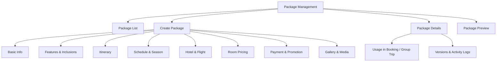
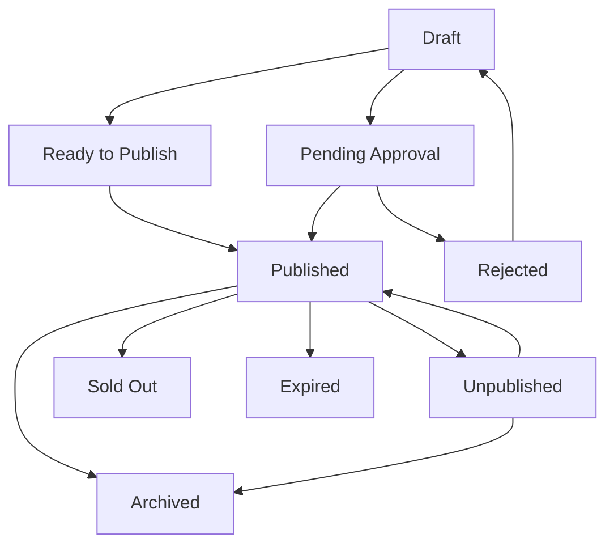
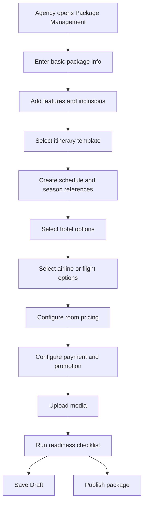
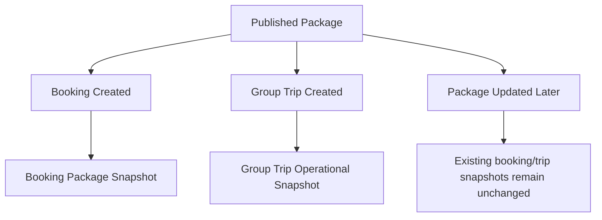

# TA PRD 04 - Package Management

Product: UmrahHaji.com Travel Agency Portal  
Module: Package Management  
Scope: Travel Agency Portal / Agency Workspace  
Platform: Responsive Web Platform  
Status: Draft  
Last Updated: 5 June 2026  

---

## 1. Module Overview

Package Management is the Travel Agency Portal module where a Travel Agency creates, edits, publishes, archives, and monitors its own Umrah and Hajj packages.

Packages are the commercial product that later creates bookings, invoices, jamaah assignments, group trips, itinerary snapshots, hotel assignments, flight assignments, payment records, commissions, and testimonials.

In Phase 1, Travel Agency users create packages using Admin-approved master data:

1. Hotel catalog.
2. Airline and flight catalog.
3. Itinerary templates.
4. Season types and periods.
5. Room type master data.
6. Package category and type master data.

Travel Agency owns the package content, schedule, pricing, inclusions, payment terms, and promotional labels. Admin Panel remains the source of truth for global catalogs and can assist with package edits only through audited workflows.

---

## 2. Relationship With Master PRD

This module follows the Travel Agency Portal Master PRD principles:

1. Package Management is a P0 module.
2. Packages belong to one Travel Agency.
3. Package creation consumes Admin-approved master data.
4. Booking must use package snapshot, not mutable live package data.
5. Group Trip must copy package, hotel, flight, itinerary, price, and schedule data into operational snapshots.
6. Published package changes must keep version history.
7. Admin assistance must be logged and should require approval reference for sensitive changes.

---

## 3. Goals

1. Allow Travel Agencies to create structured Umrah and Hajj packages.
2. Standardize package data so bookings, trips, invoices, and customer views stay consistent.
3. Reduce package setup errors by using Admin-approved hotels, airlines, itinerary templates, and seasons.
4. Support room-based and passenger-category pricing.
5. Support deposit and full-payment package rules.
6. Preserve historical accuracy through versioning and snapshot behavior.
7. Make package readiness clear before publishing.
8. Keep media uploads lightweight and scalable.

---

## 4. In Scope and Out of Scope

### 4.1 In Scope for Phase 1

1. Package list.
2. Package summary cards.
3. Create package wizard.
4. Edit package.
5. Save draft.
6. Preview package.
7. Publish, unpublish, archive, and duplicate package.
8. Package category and type.
9. Package schedules with season reference.
10. Itinerary template selection.
11. Hotel selection from Admin-approved hotel catalog.
12. Airline/flight option selection from Admin-approved catalog.
13. Room configuration and pricing.
14. Payment options and deposit rules.
15. Package inclusions, exclusions, and key features.
16. Promotional labels.
17. Commission configuration if permitted.
18. Transport information.
19. Gallery, thumbnail, and brochure upload.
20. Package share link.
21. Version history and activity log.
22. Readiness checklist.

### 4.2 Out of Scope for Phase 1

1. Public self-checkout with live payment gateway flow.
2. Live airline seat inventory.
3. Live hotel room inventory.
4. Automatic supplier confirmation.
5. Dynamic pricing engine.
6. Advanced coupon and promo campaign engine.
7. Package marketplace ranking algorithm.
8. Native app package editor.
9. Automated package compliance review using external regulator API.

---

## 5. User Roles and Permissions

| Action | Owner / PIC | Agency Admin | Operations | Sales | Finance | Marketing | Auditor |
|---|---:|---:|---:|---:|---:|---:|---:|
| View package list | Yes | Yes | Yes | Yes | Yes | Yes | Yes |
| Create package | Yes | Permission-based | Permission-based | Permission-based | No | Permission-based | No |
| Edit draft package | Yes | Permission-based | Permission-based | Permission-based | Finance fields only if permitted | Content/media if permitted | No |
| Publish package | Yes | Permission-based | No | No | No | No | No |
| Edit published package | Yes | Permission-based | Limited | Limited | Finance fields if permitted | Content/media if permitted | No |
| Configure pricing | Yes | Permission-based | No | No | Permission-based | No | No |
| Configure commission | Yes | Permission-based | No | No | Permission-based | No | No |
| Upload media | Yes | Permission-based | No | No | No | Permission-based | No |
| Archive package | Yes | Permission-based | No | No | No | No | No |
| Export package data | Yes | Permission-based | No | No | Permission-based | No | Permission-based |

Permission rules:

1. Package publish requires explicit permission.
2. Pricing and commission permissions must be separate from content editing.
3. Export must be separate from view permission.
4. Published package major edits require versioning and audit log.
5. Staff can only manage packages owned by their own Travel Agency.

---

## 6. Information Architecture

```text
Package Management
├── Package List
├── Create Package
│   ├── Basic Info & Package Details
│   ├── Features & Inclusions
│   ├── Itinerary Planning
│   ├── Schedule & Season
│   ├── Flight & Hotel Information
│   ├── Room Configuration & Pricing
│   ├── Payment & Promotion
│   ├── Commission
│   ├── Transport
│   └── Gallery & Media
├── Package Details
│   ├── Overview
│   ├── Pricing
│   ├── Schedule
│   ├── Hotel & Flight
│   ├── Itinerary
│   ├── Media
│   ├── Usage
│   ├── Terms
│   ├── Versions
│   └── Activity Logs
└── Package Preview
```

### 6.1 IA Diagram



---

## 7. Package Lifecycle

### 7.1 Status Values

| Status | Meaning |
|---|---|
| Draft | Package is being prepared |
| Ready to Publish | Required publish data is complete but not yet published |
| Published | Package is available according to visibility rules |
| Unpublished | Package is intentionally hidden |
| Pending Approval | Sensitive edit or admin-assisted change is waiting for approval |
| Rejected | Submitted change was rejected |
| Sold Out | All active schedules are full or manually marked sold out |
| Expired | All schedules are in the past |
| Archived | Package is hidden from active workflow but preserved |

### 7.2 Status Flow



### 7.3 Publish Requirements

| Requirement | Required for Publish |
|---|---:|
| Package name | Yes |
| Category and type | Yes |
| Description | Yes |
| At least one active schedule or On Request availability | Yes |
| Price and default room type | Yes |
| Payment option | Yes |
| Inclusions | Yes |
| Terms and cancellation/refund policy | Recommended / required if booking is enabled |
| Hotel selection | Required if hotel stay is included unless To Be Confirmed |
| Flight selection | Required if flight ticket is included unless To Be Confirmed |
| Itinerary template | Recommended |
| Thumbnail | Recommended |
| No blocking readiness warnings | Yes |

---

## 8. Package List

### 8.1 Purpose

Package List allows agency users to monitor package status, visibility, schedule readiness, price, bookings, and actions.

### 8.2 Summary Cards

| Card | Description |
|---|---|
| Total Packages | Total package count owned by agency |
| Published | Packages currently published |
| Draft | Packages being prepared |
| Archived | Archived packages |
| Pending Approval | Packages or changes waiting approval |
| Sold Out / Expired | Packages no longer bookable |

### 8.3 Recommended Columns

| Column | Description |
|---|---|
| Package Name | Thumbnail, name, badges, short description |
| Category / Type | Umrah/Hajj and package type |
| Schedule | Departure and return summary |
| Hotel | Makkah/Madinah hotel summary |
| Flight | Airline and route summary |
| Price / Pax | Base displayed price |
| Commission / Pax | Internal only, permission-based |
| Bookings | Booking count or confirmed pax |
| Status | Draft, Published, Pending Approval, etc. |
| Visibility | Internal, Public, Private Link |
| Date Created | Creation date |
| Actions | View, edit, duplicate, share, publish, unpublish, archive |

### 8.4 Filters

| Filter | Options |
|---|---|
| Category | Umrah, Hajj |
| Type | Economy, Standard, Premium, VIP, Family, Custom |
| Status | Draft, Published, Pending Approval, Unpublished, Archived, Sold Out, Expired |
| Season | Low, Medium, High, Peak, custom season |
| Hotel | Active hotels used by agency packages |
| Airline | Active airlines used by agency packages |
| Date Created | All Time, Today, This Week, This Month, This Year, Custom Range |
| Departure Date | Upcoming, Past, Custom Range |
| Visibility | Internal, Public, Private Link |

Search should support package name, package code, hotel name, airline name, route, package type, and schedule date.

---

## 9. Create Package Wizard

### 9.1 Recommended Steps

| Step | Purpose |
|---|---|
| Step 1 - Basic Info & Package Details | Package identity, category, type, description, visa type, features, inclusions, itinerary |
| Step 2 - Accommodation & Transportation | Schedules, seasons, flight, hotel, room pricing, payment, commission, transport |
| Step 3 - Gallery & Media | Thumbnail, gallery, brochure, preview, publish readiness |

### 9.2 Create Package Flow



### 9.3 Save Behavior

| Action | Behavior |
|---|---|
| Save Draft | Saves incomplete package |
| Save & Continue | Saves current step and moves forward |
| Preview | Shows customer-facing or internal preview |
| Publish | Runs publish validation and changes status if valid |
| Cancel | Warns user if unsaved changes exist |

Rules:

1. User can save draft from any step.
2. Publish is blocked if required fields are incomplete.
3. System should show readiness checklist before publish.
4. Package code should be auto-generated but editable only with permission.

---

## 10. Basic Package Information

| Field | Type | Required | Validation | Notes |
|---|---|---:|---|---|
| Package Code | Auto/Text | Yes | Unique per agency | Auto recommended |
| Package Name | Text | Yes | Max 150 chars | Customer-facing |
| Package Description | Textarea | Yes | Max 2,000 chars | Customer-facing |
| Package Category | Select | Yes | Umrah, Hajj | Master data |
| Package Type | Select | Yes | Economy, Standard, Premium, VIP, Family, Custom | Master data |
| Visa Type | Select | Optional | Master data | Example: Umrah visa |
| Package Visibility | Select | Yes | Internal, Private Link, Public | Default Internal |
| Booking Availability | Select | Yes | Open, Closed, On Request, Waitlist Phase 2 | Phase 1 can use Open/Closed/On Request |
| Package Tags | Multi-select/chips | Optional | Max 10 tags | Internal/search |

Rules:

1. Public visibility requires Published status.
2. Package description should not claim confirmed hotel/flight if status is To Be Confirmed.
3. Booking availability Closed prevents new manual bookings but keeps package visible if visibility allows.

---

## 11. Features, Inclusions, and Exclusions

### 11.1 Key Features

Key features highlight the package value proposition.

Examples:

1. Mutawwif guide.
2. 24/7 support.
3. Group transport.
4. Airport transfers.
5. Emergency medical support.
6. Comfortable accommodation.
7. Spiritual counselling.
8. Historical tours.
9. Multi-language support.

### 11.2 Package Inclusions

Inclusions define what is included in the package price.

Examples:

1. Flight tickets.
2. Visa processing.
3. Hotel stay.
4. Transportation.
5. Travel insurance.
6. Airport assistance.
7. Daily breakfast.
8. Guide services.
9. Zamzam water.
10. Ihram clothing.

### 11.3 Exclusions

Exclusions prevent misunderstanding.

Examples:

1. Personal expenses.
2. Additional baggage.
3. Optional tours.
4. Meals not listed.
5. Visa rejection cost if applicable.
6. Flight upgrade cost.

Rules:

1. Inclusions and exclusions should be customer-visible when package is public.
2. Duplicate chips should not be allowed.
3. Package with flight/hotel inclusion must configure related flight/hotel status.
4. Package must not imply a service is included if it is configured as Not Included.

---

## 12. Itinerary Planning

### 12.1 Purpose

Package may select an itinerary template created and approved in Admin Panel or allowed agency template if enabled.

### 12.2 Fields

| Field | Type | Required | Validation | Notes |
|---|---|---:|---|---|
| Itinerary Template | Select | Recommended | Active and Available for Package | Stores template version |
| Itinerary Version | Auto | Yes if template selected | Published version | Snapshot reference |
| Itinerary Preview | Read-only | No | Day/activity list | Preview only |
| Custom Note | Textarea | Optional | Max 500 chars | Package-level note |

Rules:

1. Package references a specific itinerary template version.
2. If itinerary template is updated later, existing package stays on selected version until user updates it.
3. Group Trip copies itinerary into its own operational snapshot.
4. Itinerary duration mismatch with package schedule should show warning.
5. Package can publish without itinerary only if policy allows, but should show readiness warning.

---

## 13. Schedule and Season

### 13.1 Purpose

Package schedule defines departure dates and return dates. Season Management provides calendar reference for low, medium, high, or peak season.

### 13.2 Schedule Fields

| Field | Type | Required | Validation | Notes |
|---|---|---:|---|---|
| Schedule Name | Text | Optional | Max 100 chars | Example: May 2025 Batch 1 |
| Departure Date | Date | Required before publish | Valid date | Must be before return |
| Return Date | Date | Required before publish | After departure | Used for duration |
| Duration | Auto | Yes | Derived from dates | Example: 7D/6N |
| Season Type | Auto/Select | Optional | Active season | Auto-resolved by departure date |
| Season Period | Auto/Select | Optional | Active period | From Season Management |
| Capacity | Number | Optional | >= 0 | Informational unless booking capacity is enabled |
| Schedule Status | Select | Yes | Active, Disabled, Sold Out, Expired | Controls availability |
| Flight Status | Select | Yes | Pending, Confirmed, To Be Confirmed, Not Included | Schedule-level if needed |
| Hotel Status | Select | Yes | Pending, Confirmed, To Be Confirmed, Not Included | Schedule-level if needed |

### 13.3 Schedule Rules

1. Published package requires at least one active schedule or On Request availability.
2. Return date must be after departure date.
3. Schedule used by booking or group trip cannot be hard-deleted.
4. Schedule can be disabled to prevent new booking.
5. Season should be auto-resolved based on departure date if possible.
6. Package price must not automatically change when Admin edits Season Management.
7. Group Trip stores schedule snapshot.

---

## 14. Flight Options

### 14.1 Purpose

Flight Options define package-level airline and route information. They do not guarantee live seat inventory.

### 14.2 Flight Fields

| Field | Type | Required | Validation | Notes |
|---|---|---:|---|---|
| Airline | Select | Recommended | Active airline | From Admin catalog |
| Airline Code | Auto | No | From catalog | Read-only |
| Package Flight Status | Select | Yes | Pending, Confirmed, To Be Confirmed, Not Included | Required |
| Default Flight Class | Select | Optional | Economy, Business, First, Mixed | Default for booking |
| Departure Airport | Select | Recommended | Active airport | Example: KUL |
| Arrival Airport | Select | Recommended | Active airport | Example: JED |
| Add Transit | Toggle | Optional | Boolean | Shows transit fields |
| Transit Airport | Select | Conditional | Required if transit enabled | Example: DXB |
| Transit Duration | Duration | Conditional | Required if transit enabled | Example: 1h 30m |
| Return Departure Airport | Select | Recommended | Active airport | Example: JED |
| Return Arrival Airport | Select | Recommended | Active airport | Example: KUL |
| Baggage Notes | Textarea | Optional | Max 500 chars | Customer-visible if needed |

Rules:

1. Only active Admin-approved airlines and airports can be selected.
2. Exact flight number can be optional at package stage if status is To Be Confirmed.
3. If flight ticket is included, package must show flight status clearly.
4. Group Trip copies selected flight option into actual flight assignment snapshot.
5. Inactive airline after publish should show warning but not break historical package.

---

## 15. Hotel Selection

### 15.1 Purpose

Hotel Selection defines package-level accommodation for Makkah, Madinah, and optional transit/other city stays.

### 15.2 Hotel Fields

| Field | Type | Required | Validation | Notes |
|---|---|---:|---|---|
| Makkah Nights | Number | Conditional | >= 0 | Drives hotel requirement |
| Madinah Nights | Number | Conditional | >= 0 | Drives hotel requirement |
| Makkah Hotel | Select | Conditional | Active hotel | Required if Makkah nights > 0 unless TBC |
| Madinah Hotel | Select | Conditional | Active hotel | Required if Madinah nights > 0 unless TBC |
| Other Hotel | Select | Optional | Active hotel | Transit/other city |
| Hotel Status | Select | Yes | Pending, Confirmed, To Be Confirmed, Not Included | Required |
| Hotel Notes | Textarea | Optional | Max 500 chars | Customer-visible |

Rules:

1. Only active Admin-approved hotels can be selected for new package.
2. Hotel stay inclusion requires hotel selection or To Be Confirmed status.
3. Package hotel option does not guarantee live room inventory.
4. Group Trip copies hotel data into hotel assignment snapshot.
5. Archived hotel after package publish should show warning for future updates.

---

## 16. Room Configuration and Pricing

### 16.1 Purpose

Room Configuration and Pricing defines package price per room type and passenger category.

### 16.2 Room Types

Recommended room types:

1. Single Room.
2. Double Room.
3. Triple Room.
4. Quad Room.
5. Quint Room.
6. Infant Pricing.

### 16.3 Pricing Fields

| Field | Type | Required | Validation | Notes |
|---|---|---:|---|---|
| Room Type Enabled | Toggle | Yes | Boolean | Per room type |
| Room Type | Select/Read-only | Yes | Master room type | Required |
| Default Room Type | Radio | Yes | One default required | Used for base price |
| Adult Price | Currency | Conditional | >= 0 | Required if room type enabled |
| Child Price | Currency | Optional | >= 0 | Child under configured age |
| Child Without Bed Price | Currency | Optional | >= 0 | Optional |
| Infant Price | Currency | Optional | >= 0 | Per infant |
| Discount Enabled | Toggle | Optional | Boolean | Per room type |
| Discount Type | Select | Conditional | Amount, Percentage | Required if discount enabled |
| Discount Amount | Number/Currency | Conditional | >= 0 | Amount or percentage |
| Base Price Package | Auto | Yes | Derived | Customer-facing display |

### 16.4 Pricing Rules

1. Published package requires at least one enabled room type.
2. Published package requires one default room type.
3. Default room type must have adult price.
4. Discount percentage cannot exceed 100%.
5. Deposit amount cannot exceed base price.
6. Currency must be stored explicitly for every price.
7. Price changes on published package require versioning or approval based on policy.
8. Existing bookings and group trips keep old price snapshot.
9. Schedule-level pricing can be Phase 1 if needed, but must be clearly shown.

---

## 17. Payment and Promotion Configuration

### 17.1 Payment Fields

| Field | Type | Required | Validation | Notes |
|---|---|---:|---|---|
| Full Payment | Toggle | Optional | Boolean | Allow full payment option |
| Deposit Payment | Toggle | Optional | Boolean | Allow deposit option |
| Deposit Type | Select | Conditional | Amount, Percentage | Required if deposit enabled |
| Deposit Amount | Currency/Number | Conditional | > 0 | Per pax |
| Balance Due Rule | Text/Select | Recommended | Max 500 chars | Example: 30 days before departure |
| Payment Notes | Textarea | Optional | Max 500 chars | Customer-visible |

Rules:

1. At least one payment option is required before publish if booking is enabled.
2. Payment gateway and payment link are owned by Finance/Billing modules.
3. Package stores payment terms for invoice and booking snapshot.
4. Deposit percentage cannot exceed 100%.
5. Balance due rule should appear on booking/invoice if booking is created.

### 17.2 Promotional Labels

Package can select up to two promotional labels:

| Label | Meaning |
|---|---|
| Hot Deal | Highlighted offer |
| Best Offer | Recommended offer |
| Low Season | Low season package |
| Mid Season | Mid season package |
| High Season | High season package |
| Early Bird | Early registration offer |
| New | Newly published |
| Limited Time | Time-limited offer |
| Family Deal | Family-focused package |

Rules:

1. Maximum two promotional labels can be selected.
2. Promotion label must not imply discount unless actual price/discount exists.
3. Labels are customer-visible only if package visibility allows.

---

## 18. Commission Configuration

### 18.1 Purpose

Commission Configuration defines package-level commission rules used later by Finance Management and settlement reports.

### 18.2 Fields

| Field | Type | Required | Validation | Notes |
|---|---|---:|---|---|
| Commission Type | Select | Yes | Fixed Amount, Percentage, None | Default can come from agency plan |
| Agent Commission | Currency/Number | Conditional | >= 0 | Per pax or percentage |
| Public Commission | Currency/Number | Optional | >= 0 | If public agent program exists |
| Commission Notes | Textarea | Optional | Max 500 chars | Internal only |

Rules:

1. Commission visibility requires finance/commission permission.
2. Commission is never shown to public customers by default.
3. Commission changes on published package require elevated permission and audit log.
4. Actual payout is not handled in Package Management.

---

## 19. Transport Information

| Field | Type | Required | Validation | Notes |
|---|---|---:|---|---|
| Makkah Transport Type | Select | Optional | Bus, Van, Private Coach, Other | Package-level |
| Makkah Transport Status | Select | Optional | Pending, Confirmed, To Be Confirmed, Not Included | Status |
| Madinah Transport Type | Select | Optional | Bus, Van, Private Coach, Other | Package-level |
| Madinah Transport Status | Select | Optional | Pending, Confirmed, To Be Confirmed, Not Included | Status |
| Inter-city Transport Type | Select | Optional | Bus, Haramain Train, Private Coach, Other | Package-level |
| Inter-city Transport Status | Select | Optional | Pending, Confirmed, To Be Confirmed, Not Included | Status |
| Transport Notes | Textarea | Optional | Max 500 chars | Customer-visible/internal based on setting |

Rules:

1. Transport status must not conflict with inclusions.
2. If Haramain train is selected, Group Trip service tracking can later request e-ticket train document.
3. Package-level transport is informational until group trip operational assignment is created.

---

## 20. Terms, Cancellation, and Disclaimers

| Field | Type | Required | Validation | Notes |
|---|---|---:|---|---|
| Cancellation Policy | Textarea/Template | Recommended | Max 2,000 chars | Customer-facing |
| Refund Policy | Textarea/Template | Recommended | Max 2,000 chars | Customer-facing |
| Amendment Policy | Textarea/Template | Optional | Max 1,000 chars | Date/name/package changes |
| Visa Disclaimer | Textarea | Optional | Max 1,000 chars | If visa processing included |
| Flight Disclaimer | Textarea | Optional | Max 1,000 chars | If flight pending/TBC |
| Hotel Disclaimer | Textarea | Optional | Max 1,000 chars | If hotel may change |
| General Terms | Textarea | Recommended | Max 3,000 chars | Package terms |

Rules:

1. Terms should be included in booking and invoice snapshot.
2. Major terms changes on published package require new version or approval.
3. Customer-facing package must not hide material disclaimers.

---

## 21. Gallery and Media

### 21.1 Media Fields

| Field | Type | Required | Validation | Notes |
|---|---|---:|---|---|
| Thumbnail | Upload | Recommended | JPG, JPEG, PNG, WEBP max 2 MB | Customer-facing image |
| Gallery Images | Multi-upload | Optional | JPG, JPEG, PNG, WEBP max 2 MB each, max 10 files | Customer gallery |
| Short Video | Upload/Link | Optional | MP4 max 10 MB or external URL | Prefer external link |
| Brochure PDF | Upload | Optional | PDF max 5 MB | Customer download |
| Media Alt Text | Text | Optional | Max 150 chars | Accessibility/SEO |

### 21.2 Server Load Rules

1. Upload must not use base64 payloads in JSON.
2. Prefer direct-to-object-storage upload.
3. Compress images before storage.
4. Generate thumbnails for gallery.
5. Reject unsupported formats.
6. Reject files above max size.
7. Limit gallery image count.
8. Prefer external hosted video URL over large direct video upload.
9. Scan brochure and uploaded files before making them downloadable.
10. Store original files privately and serve previews through optimized URLs.

### 21.3 Media Rules

1. Package media must not misrepresent selected hotel, airline, or itinerary.
2. If media comes from Hotel catalog, system should label it as inherited catalog media.
3. Agency-uploaded media belongs to the package and can be reviewed or hidden by Admin if needed.
4. Deleted media should remain in audit log but not appear publicly.

---

## 22. Package Details Page

### 22.1 Recommended Tabs

| Tab | Purpose |
|---|---|
| Overview | Package identity, status, price, visibility, readiness |
| Pricing | Room pricing, deposit, payment terms, commission if permitted |
| Schedule | Departure dates, season, capacity, status |
| Hotel & Flight | Accommodation and airline/route options |
| Itinerary | Selected itinerary template/version and preview |
| Media | Thumbnail, gallery, brochure |
| Usage | Bookings and group trips created from package |
| Terms | Cancellation, refund, disclaimers, exclusions |
| Versions | Draft, published, pending approval, archived versions |
| Activity Logs | Audit trail |

### 22.2 Overview Data

1. Package name.
2. Package code.
3. Category and type.
4. Package status.
5. Visibility.
6. Base price.
7. Default room type.
8. Promotional labels.
9. Booking availability.
10. Schedule summary.
11. Hotel summary.
12. Flight summary.
13. Itinerary summary.
14. Created by.
15. Last updated by.
16. Current version.
17. Readiness score.

---

## 23. Versioning and Snapshot Rules

### 23.1 Versioning Rules

1. Draft package can be edited directly.
2. Published package major edits create a new version or require approval.
3. Major edits include price, schedule dates, hotel, flight, inclusions, cancellation/refund terms, payment terms, commission, and visibility.
4. Minor edits such as typo fixes can update current version with audit log if policy allows.
5. User must provide change reason for major published edits.

### 23.2 Snapshot Rules



Rules:

1. Booking stores package, schedule, price, room, payment, terms, hotel, flight, and itinerary snapshot.
2. Group Trip stores operational snapshot from package and selected schedule.
3. Package edits never silently update existing booking invoices.
4. Package edits never silently update existing group trips.
5. User can manually apply selected updates to future schedules or new bookings only.

---

## 24. Admin Assistance and Approval Logic

Admin may create or edit package for a Travel Agency from Admin Panel when the Travel Agency asks for help.

Rules for Travel Agency Portal:

1. Agency can see Admin-assisted changes in package activity log.
2. Sensitive Admin-assisted changes require approval reference before publish.
3. Approval reference may be internal note, support report ID, email reference, or uploaded approval proof.
4. Agency Owner/PIC should be notified when Admin creates or modifies package.
5. Agency can review Pending Approval version if workflow is enabled.

Approval-sensitive actions:

| Action | Approval Need |
|---|---|
| Admin creates package for agency | Approval reference required before publish |
| Admin changes published package price | Approval reference or Pending Approval version |
| Admin changes cancellation/refund terms | Approval reference or Pending Approval version |
| Admin changes commission | Elevated permission and approval log |
| Admin archives package | Reason required and agency notification |

---

## 25. Functional Requirements

| ID | Requirement | Priority |
|---|---|---|
| TA-PKG-001 | System must show package list scoped to the logged-in agency. | P0 |
| TA-PKG-002 | Authorized users can create package draft. | P0 |
| TA-PKG-003 | Authorized users can edit draft package. | P0 |
| TA-PKG-004 | Authorized users can publish package after validation passes. | P0 |
| TA-PKG-005 | System must block publishing incomplete package. | P0 |
| TA-PKG-006 | Package can select Admin-approved itinerary template/version. | P0 |
| TA-PKG-007 | Package can select Admin-approved hotel catalog records. | P0 |
| TA-PKG-008 | Package can select Admin-approved airline/flight catalog records. | P0 |
| TA-PKG-009 | Package schedule can reference or auto-resolve active season period. | P0 |
| TA-PKG-010 | Package must support room type pricing and default base price. | P0 |
| TA-PKG-011 | Package must support full payment and deposit payment rules. | P0 |
| TA-PKG-012 | Package must support inclusions, exclusions, features, and terms. | P0 |
| TA-PKG-013 | Package media upload must enforce format, size, and count limits. | P0 |
| TA-PKG-014 | Published package major edit must create version or approval workflow. | P0 |
| TA-PKG-015 | Booking must store package snapshot when created. | P0 |
| TA-PKG-016 | Group Trip must store package operational snapshot when created. | P0 |
| TA-PKG-017 | Package share link must respect visibility and status. | P0 |
| TA-PKG-018 | Authorized users can archive package that is no longer active. | P0 |
| TA-PKG-019 | Package used by booking or group trip cannot be hard-deleted. | P0 |
| TA-PKG-020 | System must log package create, edit, publish, archive, duplicate, and share actions. | P0 |
| TA-PKG-021 | System should support package duplication to speed setup. | P1 |
| TA-PKG-022 | System should show readiness checklist before publish. | P1 |
| TA-PKG-023 | System should show package usage in bookings and group trips. | P1 |
| TA-PKG-024 | System should support package summary PDF export if permitted. | P2 |

---

## 26. Form Specification

### 26.1 Create / Edit Package Form

| Section | Field | Type | Required | Validation | Notes |
|---|---|---|---:|---|---|
| Basic Info | Package Code | Auto/Text | Yes | Unique | Auto recommended |
| Basic Info | Package Name | Text | Yes | Max 150 chars | Required |
| Basic Info | Description | Textarea | Yes | Max 2,000 chars | Customer-facing |
| Basic Info | Category | Select | Yes | Umrah/Hajj | Master data |
| Basic Info | Type | Select | Yes | Master data | Economy/VIP/etc. |
| Basic Info | Visa Type | Select | Optional | Master data | Optional |
| Basic Info | Visibility | Select | Yes | Internal/Private Link/Public | Default Internal |
| Features | Key Feature | Repeater/Chips | Optional | No duplicate | Customer-facing |
| Inclusions | Inclusion | Repeater/Chips | Recommended | No duplicate | Customer-facing |
| Exclusions | Exclusion | Repeater/Chips | Recommended | No duplicate | Customer-facing |
| Itinerary | Itinerary Template | Select | Recommended | Active template/version | Stores version |
| Schedule | Departure Date | Date | Conditional | Valid date | Required for schedule |
| Schedule | Return Date | Date | Conditional | After departure | Required for schedule |
| Schedule | Season Type/Period | Auto/Select | Optional | Active season | From Season Management |
| Flight | Airline | Select | Optional | Active airline | Package option |
| Flight | Flight Status | Select | Yes | Pending/Confirmed/TBC/Not Included | Required |
| Hotel | Makkah Hotel | Select | Conditional | Active hotel | If Makkah nights |
| Hotel | Madinah Hotel | Select | Conditional | Active hotel | If Madinah nights |
| Pricing | Room Type Prices | Table | Yes before publish | >= 0 | At least one room |
| Payment | Payment Option | Toggle group | Yes before publish | Full/deposit | Required if booking enabled |
| Payment | Deposit Amount | Currency/Number | Conditional | > 0 | If deposit enabled |
| Promotion | Labels | Multi-select | Optional | Max 2 | Customer-facing |
| Commission | Commission | Currency/Number | Optional | >= 0 | Internal permission-based |
| Transport | Transport Type/Status | Select | Optional | Master options | Package-level |
| Media | Thumbnail | Upload | Recommended | Image max 2 MB | Optimized |
| Media | Gallery | Multi-upload | Optional | Image max 2 MB each, max 10 | Optimized |
| Media | Brochure | Upload | Optional | PDF max 5 MB | Download |

---

## 27. Empty, Error, and Loading States

### 27.1 Empty States

| Area | Empty State |
|---|---|
| Package List | Show "No packages created yet" and Create Package action |
| Schedule | Show "No schedule added yet" and Add Schedule action |
| Gallery | Show upload area and media guidelines |
| Usage | Show "No bookings or group trips using this package yet" |

### 27.2 Error States

| Error | Behavior |
|---|---|
| Publish requirement missing | Block publish and show readiness checklist |
| Invalid schedule date | Highlight date fields |
| Deposit exceeds price | Block save/publish |
| No default room type | Block publish |
| Inactive hotel/airline selected | Show warning and block new publish/update if policy requires |
| Itinerary duration mismatch | Show warning and require confirmation |
| File too large | Reject upload with max size |
| Unsupported media format | Reject upload and show allowed formats |
| Package used by booking/trip | Block hard-delete and suggest archive |

### 27.3 Loading States

1. Package list should use skeleton rows.
2. Create wizard should autosave draft if enabled.
3. Master data dropdowns should show loading and empty states.
4. Upload progress should show per file.
5. Preview should show loading while generating package summary.

---

## 28. Responsive Behavior

| Device | Behavior |
|---|---|
| Desktop | Full table list and multi-column wizard |
| Tablet | Reduced columns; wizard sections stack where needed |
| Mobile | Package list becomes cards; wizard sections stack vertically |

Rules:

1. Pricing table may use horizontal scroll on mobile if needed.
2. Schedule, hotel, flight, and pricing sections should be collapsible.
3. Publish readiness checklist should be easy to read on mobile.
4. Upload controls should remain full width on mobile.

---

## 29. Data Dependencies

| Data | Source |
|---|---|
| Travel Agency profile | Agency Profile module |
| Staff permission | Team & Roles |
| Hotel catalog | Admin Hotel Management |
| Airline/flight catalog | Admin Flight/Airline Management |
| Itinerary template | Admin/allowed Itinerary Management |
| Season | Admin Season Management |
| Room types | Admin master data |
| Package categories/types | Admin master data |
| Payment settings | Finance/Settings |
| Commission rules | Finance/agency plan/package configuration |

---

## 30. Integration With Other Modules

| Module | Integration |
|---|---|
| Dashboard | Shows package summary, draft alerts, published count |
| Booking / Manual Reservation | Booking selects package and stores snapshot |
| Jamaah Management | Jamaah can be invited/assigned through booking derived from package |
| Group Trip Management | Group Trip can be created from package schedule |
| Finance Management | Invoice and payment use package price/payment snapshot |
| Documents & Services | Package inclusions influence service tracking |
| Testimonials | End-of-trip testimonial can reference package |
| Reports / Support | Package issues can be reported and linked |
| Admin Panel | Admin can monitor, assist, audit, and manage master data |

---

## 31. Acceptance Criteria

1. Package list only shows packages owned by the logged-in Travel Agency.
2. Authorized users can create and save package draft.
3. Package wizard includes basic info, inclusions, itinerary, schedule, hotel, flight, pricing, payment, commission, transport, and media.
4. Package cannot be published if required readiness checks fail.
5. Package can reference active itinerary template/version.
6. Package can select active Admin-approved hotels and airlines/flights.
7. Package can define room type pricing and one default base price.
8. Published package major changes are versioned or routed for approval.
9. Booking created from package stores package snapshot.
10. Group Trip created from package stores operational snapshot.
11. Package media uploads enforce max size, format, and count rules.
12. Package used by booking or group trip cannot be hard-deleted.
13. Package share link respects status and visibility.
14. All package actions are recorded in activity log.

---

## 32. Open Questions

1. Should Travel Agency be allowed to publish package directly in Phase 1, or should first package require Admin review?
2. Should package schedule capacity be managed in Package Management or only in Group Trip Management?
3. Should commission configuration be visible to Travel Agency in Phase 1 or only Finance/Admin?
4. Should package public link be enabled in Phase 1 if customer checkout is not yet enabled?
5. Should itinerary customization inside package be allowed, or should package only reference template version?
6. Should schedule-level pricing be Phase 1 or deferred until package logic stabilizes?
