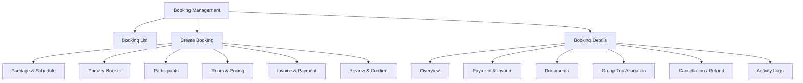
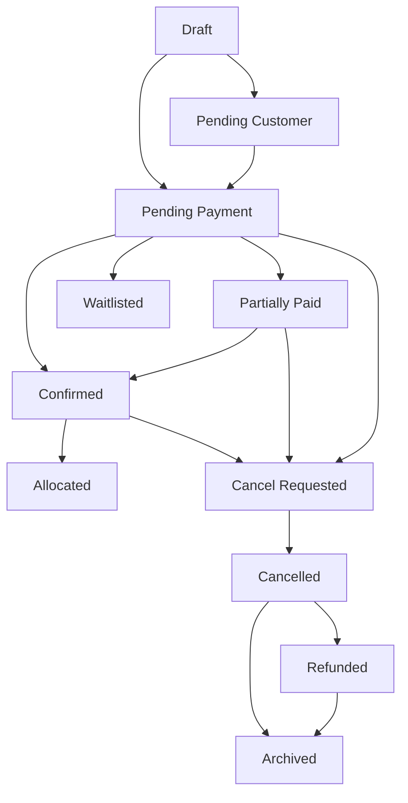
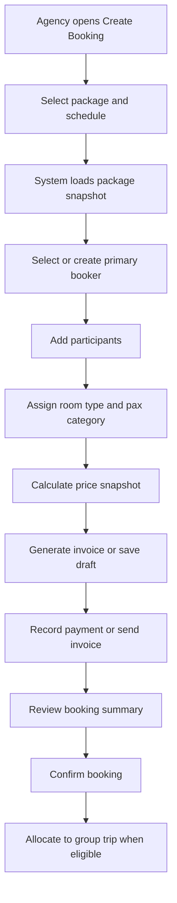
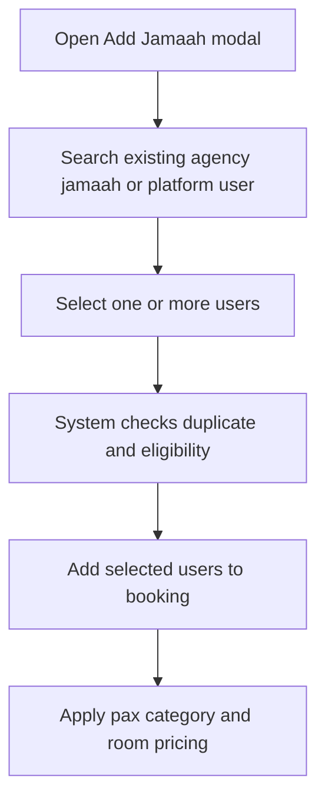
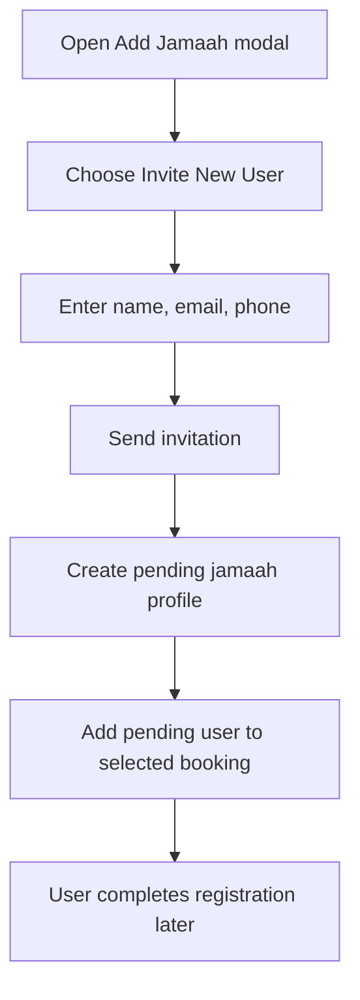
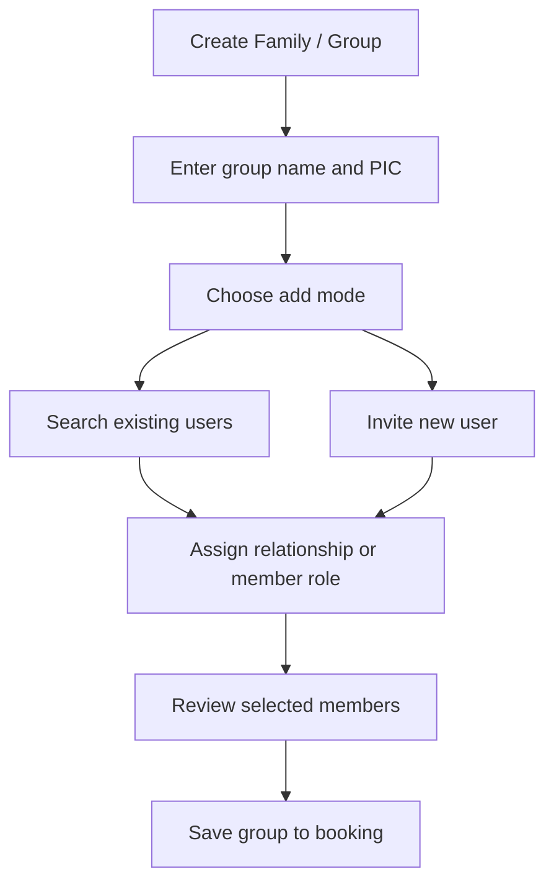
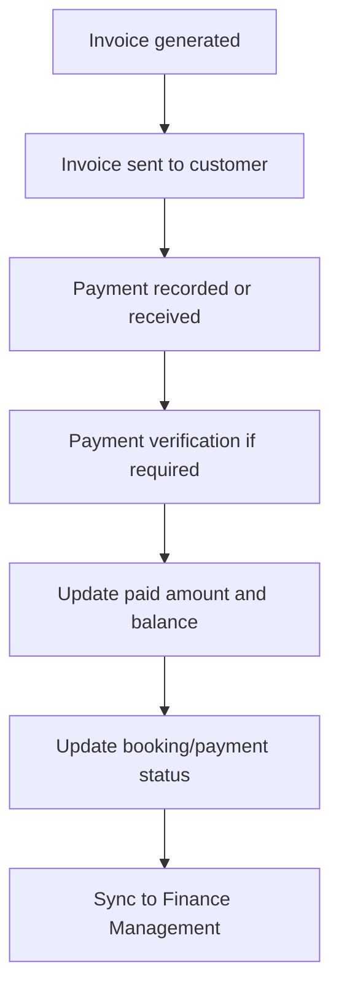
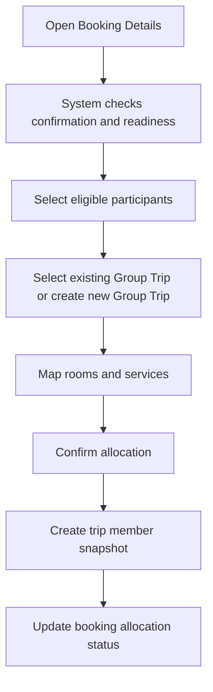
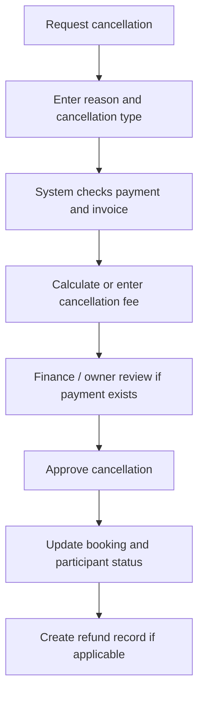

# TA PRD 05 - Booking Management

Product: UmrahHaji.com Travel Agency Portal  
Module: Booking Management  
Scope: Travel Agency Portal / Agency Workspace  
Platform: Responsive Web Platform  
Status: Draft  
Last Updated: 5 June 2026  

---

## 1. Module Overview

Booking Management is the Travel Agency Portal module where a Travel Agency creates, reviews, confirms, updates, cancels, and tracks customer reservations for Umrah and Hajj packages.

Booking is the commercial reservation layer between Package Management and Group Trip Management.

Package is the sellable offer. Booking is the customer's reservation and payment record. Group Trip is the operational departure group used to manage flight, hotel, itinerary, documents, services, and mutawwif execution.

In Phase 1, Booking Management focuses on manual and assisted reservation workflows handled by Travel Agency staff. In later phases, the same booking model can receive customer self-service bookings from public package pages and online checkout.

---

## 2. Relationship With Master PRD

This module follows the Travel Agency Portal Master PRD principles:

1. Booking Management is a P0 module.
2. Booking belongs to one Travel Agency.
3. Booking must store package snapshot at the time of reservation.
4. Booking can contain one individual jamaah, one family, or one group.
5. Booking can add existing users or invite new users.
6. Invoice, payment, outstanding balance, commission, and refund data must sync with Finance Management.
7. Confirmed booking participants can be allocated to Group Trip.
8. Booking must not expose another agency's customer, package, finance, or trip data.

---

## 3. Goals

1. Allow Travel Agencies to create structured reservations from published packages.
2. Support individual, family, and group bookings.
3. Preserve package, price, schedule, hotel, flight, itinerary, room, payment, and terms snapshots.
4. Track booking progress from draft to confirmed, cancelled, refunded, or allocated.
5. Connect booking participants to Jamaah profiles and document readiness.
6. Generate invoices and payment requirements from selected package pricing.
7. Help agency staff see what still blocks confirmation or group trip allocation.
8. Reduce manual spreadsheet tracking for customers, deposits, balances, and booking documents.

---

## 4. In Scope and Out of Scope

### 4.1 In Scope for Phase 1

1. Booking list.
2. Booking summary cards.
3. Create booking manually by Travel Agency.
4. Select package and package schedule.
5. Select primary booker.
6. Add existing jamaah.
7. Invite new jamaah.
8. Create individual booking.
9. Create family booking.
10. Create group booking.
11. Participant room type and pax category assignment.
12. Price snapshot per participant.
13. Invoice generation.
14. Deposit, full payment, installment, and outstanding balance tracking.
15. Manual payment record with proof upload.
16. Booking status and payment status.
17. Booking details page.
18. Booking document checklist summary.
19. Cancellation request and refund review trigger.
20. Allocation of eligible booking participants to Group Trip.
21. Activity log and audit history.
22. Export booking list.

### 4.2 Phase 2 / Future Scope

1. Public self-service checkout from customer-facing package page.
2. Online payment gateway confirmation webhook.
3. Automated waitlist handling.
4. Automated cancellation fee calculation.
5. Automated refund disbursement.
6. Live hotel room inventory.
7. Live airline seat inventory.
8. Multi-currency customer checkout.
9. Promo code engine.
10. Customer portal booking amendment request.

### 4.3 Out of Scope for Booking Management

1. Actual trip operation execution. This belongs to Group Trip Management.
2. Master hotel, airline, flight, itinerary, and season creation. These belong to Admin Panel.
3. Full accounting ledger. This belongs to Finance Management.
4. Mutawwif profile management. This belongs to Mutawwif Management or Mutawwif Assignment.
5. Full document verification workflow. Booking shows readiness summary, while Documents & Services / Group Trip handles operational tracking.

---

## 5. Key Definitions

| Term | Definition |
|---|---|
| Booking | Customer reservation record for a selected package and schedule |
| Primary Booker | Main contact responsible for booking communication and payment |
| Participant | Jamaah included in the booking |
| Package Snapshot | Copy of package data captured when booking is created or confirmed |
| Price Snapshot | Copy of selected room, pax category, discount, commission, and tax values |
| Booking Group | Family or group container inside one booking |
| Allocation | Process of assigning confirmed booking participants to a Group Trip |
| Outstanding Balance | Remaining unpaid amount for a booking or participant |
| Deposit | Initial payment required to reserve a booking |

---

## 6. User Roles and Permissions

| Action | Owner / PIC | Agency Admin | Sales / Booking | Operations | Finance | Customer Service | Auditor |
|---|---:|---:|---:|---:|---:|---:|---:|
| View booking list | Yes | Yes | Yes | Yes | Yes | Permission-based | Yes |
| Create booking | Yes | Permission-based | Yes | Permission-based | No | Permission-based | No |
| Edit draft booking | Yes | Permission-based | Yes | Permission-based | Finance fields only | Permission-based | No |
| Confirm booking | Yes | Permission-based | Permission-based | Permission-based | Permission-based | No | No |
| Record payment | Yes | Permission-based | No | No | Yes | No | No |
| Generate invoice | Yes | Permission-based | Permission-based | No | Yes | No | No |
| Cancel booking | Yes | Permission-based | Permission-based | Permission-based | Finance review if paid | No | No |
| Allocate to group trip | Yes | Permission-based | No | Yes | No | No | No |
| View sensitive documents | Yes | Permission-based | Permission-based | Permission-based | No | No | Permission-based |
| Export booking data | Yes | Permission-based | Permission-based | Permission-based | Permission-based | No | Permission-based |

Permission rules:

1. Finance fields require Finance permission.
2. Passport, IC, visa, vaccination, and medical documents require sensitive document permission.
3. Booking cancellation with payment requires Finance review.
4. Allocation to Group Trip requires Operations permission.
5. Confirmed booking edits must be logged and may require approval depending on the field changed.
6. Staff can only manage bookings owned by their own Travel Agency.

---

## 7. Information Architecture

```text
Booking Management
├── Booking List
├── Create Booking
│   ├── Select Package & Schedule
│   ├── Booker Information
│   ├── Participants
│   │   ├── Existing Jamaah
│   │   ├── Invite New Jamaah
│   │   └── Family / Group
│   ├── Room & Pricing
│   ├── Invoice & Payment
│   ├── Documents Summary
│   └── Review & Confirm
├── Booking Details
│   ├── Overview
│   ├── Participants
│   ├── Payment & Invoice
│   ├── Documents
│   ├── Allocation
│   ├── Cancellation / Refund
│   ├── Notes & Remarks
│   └── Activity Logs
└── Booking Export
```

### 7.1 IA Diagram



---

## 8. Booking Lifecycle

### 8.1 Booking Status Values

| Status | Meaning |
|---|---|
| Draft | Booking is being prepared but not sent or confirmed |
| Pending Customer | Waiting for invited jamaah/customer to complete required data |
| Pending Payment | Invoice or deposit has been issued but payment is incomplete |
| Partially Paid | Some payment has been received but balance remains |
| Confirmed | Minimum confirmation requirement is fulfilled |
| Allocated | Booking participants are assigned to a Group Trip |
| Waitlisted | Booking is waiting for available capacity |
| Cancel Requested | Cancellation is requested and waiting for review |
| Cancelled | Booking is cancelled |
| Refunded | Refund has been completed or marked as completed |
| No Show | Participant did not join after booking confirmation |
| Archived | Booking hidden from active list but preserved for audit |

### 8.2 Booking Status Flow



### 8.3 Payment Status Values

| Status | Meaning |
|---|---|
| Not Invoiced | Booking has no invoice yet |
| Invoice Draft | Invoice exists but not sent |
| Invoice Sent | Invoice sent to customer |
| Unpaid | Amount due but no payment recorded |
| Deposit Paid | Minimum deposit is paid |
| Partially Paid | More than deposit paid but not complete |
| Paid | Full amount paid |
| Overdue | Due date passed with outstanding balance |
| Refund Pending | Refund is under review |
| Refunded | Refund completed |

### 8.4 Confirmation Rule

A booking can become Confirmed when one of the following rules is met:

1. Full payment is received.
2. Required deposit is received.
3. Agency Owner or authorized staff manually confirms with reason.
4. Admin-assisted confirmation is approved and logged.

System must show the confirmation basis in Booking Details.

---

## 9. Booking List

Booking List is the main workspace for agency staff to monitor all agency-owned bookings.

### 9.1 Recommended Summary Cards

| Card | Description |
|---|---|
| Total Bookings | Total bookings in selected period |
| New Bookings | Bookings created in selected period |
| Pending Payment | Bookings waiting for deposit or payment |
| Confirmed | Bookings ready for allocation or operation |
| Outstanding Balance | Total unpaid amount |
| Cancel / Refund Review | Bookings requiring finance or owner review |

### 9.2 Table Columns

| Column | Description |
|---|---|
| Checkbox | Bulk select |
| Booking ID | Unique booking number |
| Primary Booker | Booker name, email, phone |
| Package | Package name and schedule |
| Participants | Count and type: Individual, Family, Group |
| Room | Default or selected room type summary |
| Total Amount | Booking total |
| Paid / Balance | Payment progress |
| Status | Booking status |
| Payment Status | Payment status |
| Allocation | Unallocated, Partially Allocated, Allocated |
| Created At | Date created |
| Actions | View, edit, invoice, record payment, cancel, archive |

### 9.3 Filters

| Filter | Options |
|---|---|
| Status | Draft, Pending Customer, Pending Payment, Partially Paid, Confirmed, Allocated, Cancel Requested, Cancelled, Refunded |
| Payment Status | Not Invoiced, Invoice Sent, Unpaid, Deposit Paid, Partially Paid, Paid, Overdue, Refund Pending |
| Package | Agency packages |
| Schedule | Package schedules |
| Booking Type | Individual, Family, Group |
| Allocation | Unallocated, Partially Allocated, Allocated |
| Date Created | All Time, Today, This Week, This Month, Custom Range |
| Departure Date | All Time, Upcoming, Departed, Custom Range |
| Sales Staff | Agency staff |

### 9.4 Bulk Actions

1. Export selected bookings.
2. Send payment reminder.
3. Send document reminder.
4. Assign sales staff.
5. Archive selected bookings.

Bulk cancellation is not recommended for Phase 1 because it requires review and customer communication.

---

## 10. Create Booking Flow

### 10.1 Main Flow



### 10.2 Create Booking Steps

| Step | Purpose | Required |
|---|---|---:|
| 1. Package & Schedule | Select sellable package and departure date | Yes |
| 2. Booker | Select or invite primary customer | Yes |
| 3. Participants | Add jamaah, family, or group members | Yes |
| 4. Room & Pricing | Assign room type and pax category | Yes |
| 5. Invoice & Payment | Generate invoice and define payment rule | Yes |
| 6. Documents Summary | Show missing required data and documents | Recommended |
| 7. Review & Confirm | Validate and create booking | Yes |

### 10.3 Package Selection Rules

1. Only Published packages can be selected by default.
2. Draft, Archived, and Unpublished packages cannot create new bookings.
3. On Request package availability can create booking with Pending Customer or Pending Payment status.
4. Package must have at least one schedule or On Request availability.
5. The selected package version must be stored in booking snapshot.
6. If package is later updated, the booking must still display the captured version.

---

## 11. Add Existing Jamaah / Invite New Jamaah

Booking participant selection follows the same user logic used by Jamaah Management.

### 11.1 Existing Jamaah Flow



### 11.2 Invite New Jamaah Flow



### 11.3 Duplicate Rules

1. A jamaah cannot be added twice to the same booking.
2. A jamaah can be in multiple bookings only if schedule dates do not conflict, unless overridden by authorized staff.
3. If the selected jamaah already has an active booking on the same package schedule, system must warn before adding.
4. Pending invited users can be added to a booking but may block confirmation if required customer data is missing.

---

## 12. Individual, Family, and Group Booking Logic

### 12.1 Booking Types

| Type | Description | Example |
|---|---|---|
| Individual | One jamaah booking for themselves | Single adult customer |
| Family | Related participants under one family/group container | Father, mother, children |
| Group | Non-family participants managed under one primary booker | Community group or corporate group |

### 12.2 Family / Group Rules

1. One booking can contain one or more family/group containers.
2. Each family/group container must have one PIC or primary member.
3. Participant relationship can be stored for family bookings.
4. Group booking can store group name and group PIC.
5. Family/group container can later help room assignment, document tracking, and invoice grouping.

### 12.3 Family / Group Creation Flow



---

## 13. Room and Pricing

### 13.1 Room Assignment

Booking must support room assignment before or after confirmation depending on agency workflow.

Recommended room types:

1. Single Room.
2. Double Room.
3. Triple Room.
4. Quad Room.
5. Quint Room.
6. Child Without Bed.
7. Infant.

### 13.2 Pricing Rules

1. Price is copied from Package Management into booking price snapshot.
2. Staff can edit price only if they have pricing permission.
3. Price override requires reason.
4. Discount requires permission and must be logged.
5. Each participant must have pax category.
6. Room type can influence participant price.
7. Booking total must equal the sum of participant pricing and selected add-ons.

### 13.3 Price Snapshot Fields

| Field | Description |
|---|---|
| Package ID and version | Package source |
| Schedule ID | Selected departure schedule |
| Room type | Selected room type |
| Pax category | Adult, child, child without bed, infant |
| Base price | Original package price |
| Discount | Amount or percentage |
| Tax | If enabled |
| Service fee | If enabled |
| Commission reference | Agent/public commission value if applicable |
| Final price | Participant final payable amount |

---

## 14. Invoice and Payment

Booking must connect to Finance Management so invoice, payment, balance, platform commission, refunds, and settlement view remain consistent.

### 14.1 Invoice Rules

1. Booking can save draft without invoice.
2. Invoice can be generated from booking total.
3. Invoice must use booking price snapshot.
4. Invoice line items should reference package, participant count, room type, add-ons, discounts, tax, and service fee.
5. Invoice number comes from Finance Management settings.
6. Invoice sent status should update booking payment status.

### 14.2 Payment Options

| Option | Behavior |
|---|---|
| Full Payment | Full amount due immediately or by due date |
| Deposit | Deposit due first, remaining balance due before configured date |
| Installment | Multiple scheduled payments |
| Manual Payment | Staff records offline payment with proof |

### 14.3 Payment Flow



### 14.4 Manual Payment Proof Upload

| Upload Type | Allowed Formats | Max Size | Notes |
|---|---|---:|---|
| Payment proof image | JPG, JPEG, PNG, WEBP | 2 MB per file | Compress on upload |
| Payment proof PDF | PDF | 5 MB per file | Store original and generated preview |

Server load rules:

1. Generate thumbnail preview for images.
2. Do not load original file in list view.
3. Use signed or protected URL for sensitive proof files.
4. Virus scan file before making it viewable.
5. Reject unsupported formats and oversized files before upload starts when possible.

---

## 15. Documents Summary

Booking should show document readiness but should not become the full operational document workspace.

### 15.1 Booking Document Summary

| Document | Phase 1 Behavior |
|---|---|
| IC / Identity | Show missing / uploaded / verified status |
| Passport | Show missing / uploaded / verified / expiring soon |
| Profile photo | Show missing / uploaded |
| Vaccination | Show if required by package or trip |
| Visa application | Show if package includes visa processing |
| Flight e-ticket | Usually handled in Group Trip Documents |
| Train e-ticket | Usually handled in Group Trip Documents |
| Room configuration | Can be shown from booking and updated in Group Trip |

### 15.2 Document Rules

1. Booking can collect basic documents if agency needs early intake.
2. Final operational document tracking belongs to Group Trip or Documents & Services.
3. Booking confirmation may be blocked by missing required identity data if agency enables strict mode.
4. Documents must follow upload limits and sensitive data permission rules from Jamaah Management.

Recommended upload limits:

| File Type | Allowed Formats | Max Size |
|---|---|---:|
| IC / Passport image | JPG, JPEG, PNG, WEBP | 2 MB |
| Passport / Visa PDF | PDF | 5 MB |
| Profile photo | JPG, JPEG, PNG, WEBP | 2 MB |
| Vaccination document | JPG, JPEG, PNG, WEBP, PDF | 5 MB |

---

## 16. Booking Details Page

### 16.1 Recommended Tabs

| Tab | Purpose |
|---|---|
| Overview | Booking status, package, schedule, booker, summary |
| Participants | Jamaah list, family/group containers, room and pax category |
| Payment & Invoice | Invoice, payments, balance, reminders |
| Documents | Booking-level document readiness |
| Allocation | Group trip assignment status |
| Cancellation / Refund | Cancellation reason, fee, refund status |
| Notes & Remarks | Internal notes and customer-facing remarks |
| Activity Logs | Audit history |

### 16.2 Overview Data

1. Booking ID.
2. Booking status.
3. Payment status.
4. Travel Agency.
5. Package name and package version.
6. Schedule.
7. Departure and return date.
8. Booking type.
9. Primary booker.
10. Participant count.
11. Total amount.
12. Paid amount.
13. Outstanding balance.
14. Allocation status.
15. Created by.
16. Last updated.

### 16.3 Participant Tab Data

1. Participant name.
2. Relationship or group role.
3. Email.
4. Phone.
5. User status.
6. Jamaah profile completion.
7. Pax category.
8. Room type.
9. Price snapshot.
10. Document readiness.
11. Allocation status.

---

## 17. Allocation to Group Trip

Allocation connects commercial booking participants to operational trip members.

### 17.1 Allocation Rules

1. Booking must be Confirmed before allocation unless Owner override is used.
2. Pending Customer booking cannot be allocated.
3. Cancelled booking cannot be allocated.
4. Participant-level allocation is allowed.
5. A booking can be partially allocated if some participants are not ready.
6. Group Trip must belong to the same Travel Agency.
7. Group Trip schedule should match booking schedule unless authorized override is used.
8. Allocation must copy participant booking snapshot into group trip member record.

### 17.2 Allocation Flow



### 17.3 Allocation Status

| Status | Meaning |
|---|---|
| Not Allocated | No participant assigned to group trip |
| Partially Allocated | Some participants assigned |
| Allocated | All active participants assigned |
| Allocation Blocked | Required rule not met |
| Allocation Removed | Participant removed from group trip |

---

## 18. Cancellation and Refund

### 18.1 Cancellation Rules

1. Draft booking can be deleted or archived if no invoice/payment exists.
2. Booking with invoice but no payment can be cancelled with reason.
3. Booking with payment must create refund review.
4. Cancellation fee should use package terms snapshot.
5. Cancelled participant should be removed from allocation if not departed.
6. Cancellation after departure should require special permission and finance review.

### 18.2 Cancellation Flow



### 18.3 Cancellation Form Fields

| Field | Type | Required | Notes |
|---|---|---:|---|
| Cancellation Scope | Select | Yes | Full booking or selected participants |
| Cancellation Reason | Textarea | Yes | Minimum 10 characters |
| Requested By | Select | Yes | Customer, agency, admin, system |
| Cancellation Date | Date | Yes | Default today |
| Cancellation Fee Type | Select | Conditional | Amount, percentage, none |
| Cancellation Fee | Number | Conditional | Required if fee applied |
| Refund Required | Toggle | Conditional | Enabled if paid amount exists |
| Internal Note | Textarea | No | Agency-only |
| Notify Customer | Toggle | No | Default Yes |

---

## 19. Notes, Remarks, and Communication

Booking should support lightweight notes for coordination.

### 19.1 Remark Fields

| Field | Type | Required | Notes |
|---|---|---:|---|
| Category | Select | Yes | Payment, Document, Customer Request, Operations, Cancellation, Other |
| Priority | Select | Yes | Low, Normal, Important, Urgent |
| Title | Text | Yes | Max 120 chars |
| Note | Textarea | Yes | Max 2,000 chars |
| Visibility | Select | Yes | Internal Only, Visible to Customer, Visible to Admin |
| Attachment | Upload | No | PDF/image max 5 MB |

### 19.2 Notification Events

1. Booking created.
2. Invitation sent.
3. Invoice sent.
4. Payment recorded.
5. Payment overdue.
6. Booking confirmed.
7. Booking allocated.
8. Cancellation requested.
9. Refund status updated.

---

## 20. Functional Requirements

| ID | Requirement | Priority |
|---|---|---|
| TA-BKG-001 | System must display agency-owned booking list only. | P0 |
| TA-BKG-002 | System must allow authorized staff to create manual booking. | P0 |
| TA-BKG-003 | System must allow package and schedule selection from agency-owned published packages. | P0 |
| TA-BKG-004 | System must store package snapshot when booking is created or confirmed. | P0 |
| TA-BKG-005 | System must support existing jamaah selection. | P0 |
| TA-BKG-006 | System must support inviting new jamaah from booking flow. | P0 |
| TA-BKG-007 | System must support individual, family, and group booking types. | P0 |
| TA-BKG-008 | System must assign participant pax category and room type. | P0 |
| TA-BKG-009 | System must calculate booking total from participant price snapshot. | P0 |
| TA-BKG-010 | System must generate invoice from booking. | P0 |
| TA-BKG-011 | System must track deposit, paid amount, and outstanding balance. | P0 |
| TA-BKG-012 | System must allow manual payment record with proof upload. | P0 |
| TA-BKG-013 | System must update booking status based on payment and confirmation rules. | P0 |
| TA-BKG-014 | System must prevent allocation of ineligible bookings to group trip. | P0 |
| TA-BKG-015 | System must support participant-level allocation to group trip. | P0 |
| TA-BKG-016 | System must support cancellation request with refund review trigger. | P0 |
| TA-BKG-017 | System must keep activity log for booking changes. | P0 |
| TA-BKG-018 | System must apply role-based access to finance and document fields. | P0 |
| TA-BKG-019 | System must support booking search and filters. | P1 |
| TA-BKG-020 | System must support export by permission. | P1 |
| TA-BKG-021 | System must support notes and remarks. | P1 |
| TA-BKG-022 | System must show document readiness summary. | P1 |
| TA-BKG-023 | System must send booking notifications based on enabled channels. | P1 |
| TA-BKG-024 | System should support duplicate booking warning. | P1 |
| TA-BKG-025 | System should support waitlist status for limited capacity package. | P2 |
| TA-BKG-026 | System should support online checkout integration in Phase 2. | P2 |

---

## 21. Form Specification

### 21.1 Create Booking - Package & Schedule

| Field | Type | Required | Validation / Notes |
|---|---|---:|---|
| Package | Searchable select | Yes | Published agency package only |
| Package Schedule | Select | Yes | Active schedule only |
| Booking Type | Segmented control | Yes | Individual, Family, Group |
| Sales Staff | Select | No | Default current user |
| Source Channel | Select | No | Walk-in, phone, WhatsApp, referral, website, admin-assisted |
| Internal Reference | Text | No | Optional agency reference |

### 21.2 Booker Information

| Field | Type | Required | Validation / Notes |
|---|---|---:|---|
| Booker Source | Select | Yes | Existing user, invite new user, manual contact |
| Booker Name | Text | Yes | Max 100 chars |
| Email | Email | Conditional | Required for invitation/invoice email |
| Phone Country Code | Select | Yes | Default agency country |
| Phone Number | Phone | Yes | Validate format |
| Address | Textarea | No | Used for invoice if available |
| Is Participant | Toggle | No | If booker is also a jamaah |

### 21.3 Participant

| Field | Type | Required | Validation / Notes |
|---|---|---:|---|
| Participant Source | Select | Yes | Existing jamaah, invite new jamaah |
| Full Name | Text | Yes | Max 100 chars |
| Email | Email | Conditional | Required for invitation |
| Phone | Phone | Conditional | Recommended |
| Relationship / Role | Select | Conditional | Required for family/group |
| Pax Category | Select | Yes | Adult, child, child without bed, infant |
| Room Type | Select | Yes | From package room configuration |
| Price Override | Number | No | Requires permission |
| Document Requirement | Read-only summary | No | Shows missing items |

### 21.4 Invoice and Payment

| Field | Type | Required | Validation / Notes |
|---|---|---:|---|
| Invoice Action | Select | Yes | Save draft, generate invoice, send invoice |
| Payment Type | Select | Yes | Full payment, deposit, installment |
| Deposit Amount | Number | Conditional | Required if deposit |
| Due Date | Date | Yes | Based on finance setting or manual |
| Accepted Payment Methods | Multi-select | Yes | Bank transfer, FPX, e-wallet, card, cash, cheque |
| Payment Reminder | Toggle | No | Default from finance setting |
| Customer Note | Textarea | No | Visible on invoice |
| Internal Note | Textarea | No | Agency-only |

### 21.5 Record Payment

| Field | Type | Required | Validation / Notes |
|---|---|---:|---|
| Payment Date | Date | Yes | Cannot be future unless allowed |
| Amount | Number | Yes | Greater than 0 |
| Payment Method | Select | Yes | Bank transfer, FPX, e-wallet, card, cash, cheque |
| Reference Number | Text | Conditional | Required for non-cash |
| Proof Upload | Upload | Conditional | Image max 2 MB, PDF max 5 MB |
| Verification Status | Select | Yes | Pending, verified, rejected |
| Note | Textarea | No | Internal finance note |

---

## 22. Empty, Error, and Loading States

| State | Behavior |
|---|---|
| Empty booking list | Show empty state and Create Booking CTA |
| No published package | Show message to create/publish package first |
| No schedule | Disable booking creation for selected package |
| Duplicate participant | Show warning and prevent duplicate add |
| Missing required customer data | Show blocking checklist |
| Package version unavailable | Show snapshot warning and require reselection |
| Payment proof too large | Reject upload with max size message |
| Allocation blocked | Show reason: payment, status, schedule mismatch, missing participant |
| Network error | Preserve unsaved form data and allow retry |

---

## 23. Responsive Behavior

### 23.1 Desktop

1. Booking list uses table layout.
2. Create Booking can use multi-step form.
3. Details page can show tabs with summary side panel.
4. Finance and participant tables can use horizontal scroll for dense data.

### 23.2 Tablet

1. Filters collapse into filter drawer.
2. Booking summary cards become two-column grid.
3. Participant and payment data can use stacked table/card hybrid.

### 23.3 Mobile

1. Booking list becomes card list.
2. Create Booking steps become vertical wizard.
3. Sticky bottom action bar should show Save Draft / Continue / Confirm.
4. Bulk actions are hidden or moved into selection mode.
5. Tables must not force unreadable columns; use expandable rows.

---

## 24. Data Dependencies

| Data | Source |
|---|---|
| Travel Agency | Agency Profile / Admin verification |
| Staff and permissions | Team & Roles |
| Package and schedule | Package Management |
| Season | Admin Season Management consumed by Package |
| Jamaah profile | Jamaah Management |
| Invoice settings | Finance Management |
| Payment records | Finance Management |
| Group Trip | Group Trip Management |
| Document rules | Jamaah / Documents & Services |
| Notifications | Settings / Notification configuration |

---

## 25. Integration With Other Modules

| Module | Integration |
|---|---|
| Package Management | Booking selects package and stores package snapshot |
| Jamaah Management | Booking adds existing or invited jamaah |
| Finance Management | Booking creates invoice, payment records, balance, refund, and commission reference |
| Group Trip Management | Confirmed bookings can allocate participants to group trip |
| Documents & Services | Booking provides early document readiness summary |
| Reports / Support | Booking can become report context |
| Testimonials | Completed booking/trip can trigger feedback request |
| Announcements | Booking participants can receive departure reminders |
| Admin Panel | Admin can monitor, assist, or review booking changes via audit-controlled workflow |

---

## 26. Audit and Security Rules

Audit log must record:

1. Booking created.
2. Package selected and snapshot created.
3. Participant added, removed, or invited.
4. Price override or discount applied.
5. Invoice generated, sent, or cancelled.
6. Payment recorded, verified, rejected, or deleted.
7. Booking confirmed.
8. Booking allocated to Group Trip.
9. Booking cancellation requested or approved.
10. Refund status updated.
11. Sensitive document viewed or downloaded.
12. Export action.

Security rules:

1. Sensitive fields require explicit permission.
2. Payment proof and identity documents must use protected file access.
3. Export should be permission-based and logged.
4. Deleted bookings with payment history should become archived instead of hard-deleted.
5. Staff cannot access bookings outside their agency.

---

## 27. Acceptance Criteria

1. Agency staff can create booking from a published package.
2. Booking stores package and pricing snapshot.
3. Agency staff can add existing jamaah to booking.
4. Agency staff can invite new jamaah from booking.
5. Individual, family, and group booking types are supported.
6. Booking total updates from participant pricing and selected room type.
7. Invoice can be generated from booking.
8. Payment status updates based on recorded payment.
9. Booking can become Confirmed after full payment, deposit, or authorized manual confirmation.
10. Confirmed booking can be allocated to Group Trip.
11. Ineligible booking cannot be allocated and system explains why.
12. Cancellation with payment creates refund review.
13. Finance and sensitive document fields follow permission rules.
14. Booking list supports search, filters, pagination, and export.
15. Upload fields display format and max-size guidance.
16. Activity log records key booking actions.
17. Mobile layout remains usable without table overflow.

---

## 28. Open Questions

1. Should Phase 1 require deposit payment before booking confirmation, or allow agency manual confirmation without payment?
2. Should booking capacity be controlled at package schedule level, group trip level, or both?
3. Should invoice be mandatory before booking can become Confirmed?
4. Should family/group booking allow multiple invoices or only one invoice per primary booker?
5. Should customer self-service booking be planned as Phase 2 under the same module or as a separate public booking flow PRD?

