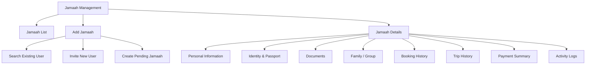
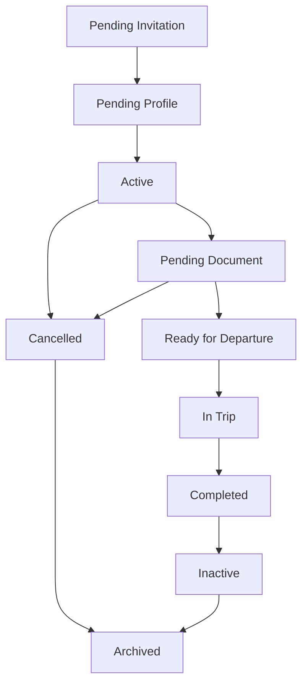
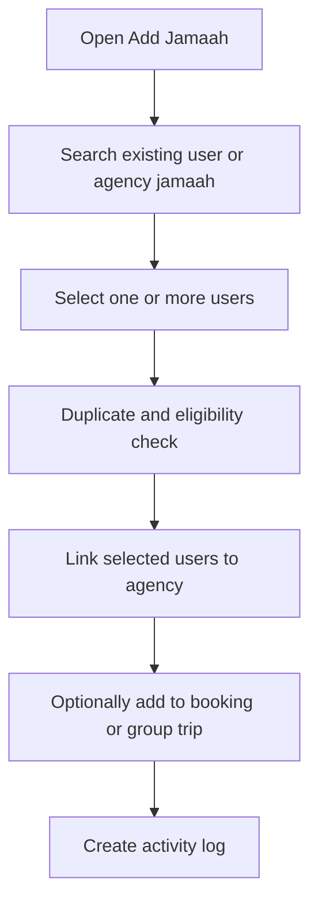
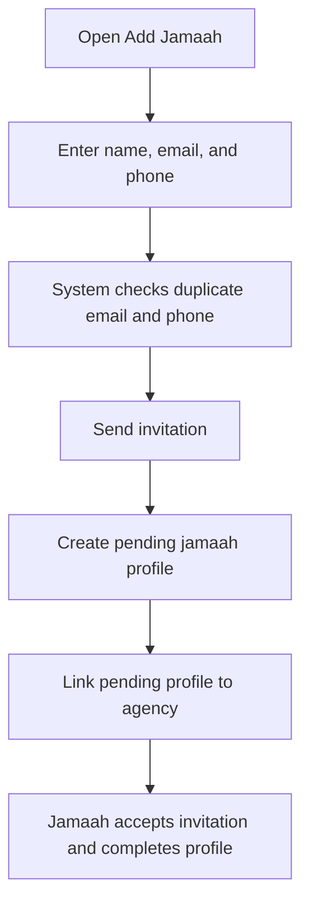
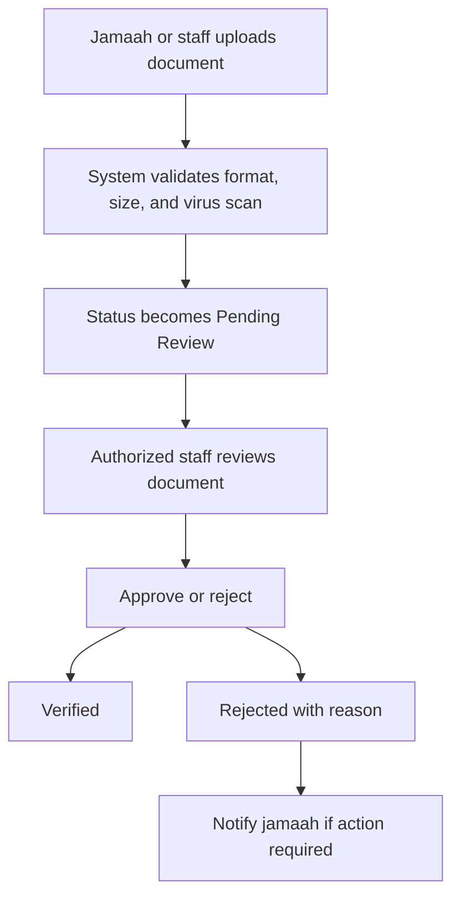
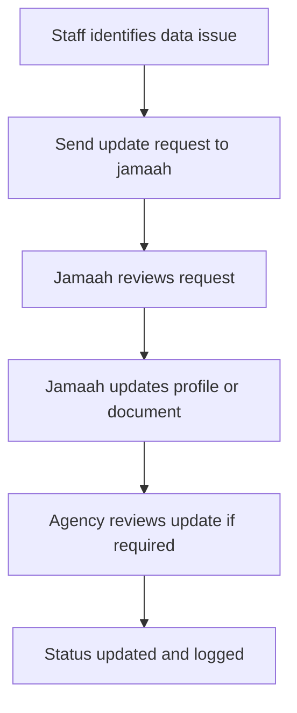

# TA PRD 06 - Jamaah Management

Product: UmrahHaji.com Travel Agency Portal  
Module: Jamaah Management  
Scope: Travel Agency Portal / Agency Workspace  
Platform: Responsive Web Platform  
Status: Draft  
Last Updated: 5 June 2026  

---

## 1. Module Overview

Jamaah Management is the Travel Agency Portal module where a Travel Agency manages jamaah records linked to its own bookings, packages, and group trips.

This module covers jamaah list, search, filters, add jamaah, invite jamaah, profile details, identity data, travel documents, emergency contact, family/group relationships, booking history, trip history, payment summary, and document readiness.

Jamaah Management must be separated from User Management:

1. User Management controls login accounts, staff access, roles, and permissions.
2. Jamaah Management controls pilgrim/customer operational profile data.
3. One jamaah profile may be linked to one user account.
4. A jamaah can exist as a pending profile before the invited user activates their account.

---

## 2. Relationship With Master PRD

This module follows the Travel Agency Portal Master PRD principles:

1. Jamaah Management is a P0 module.
2. Travel Agency can only access jamaah records linked to its own bookings, group trips, or agency-created jamaah records.
3. Add Jamaah supports existing user selection and new user invitation.
4. Sensitive identity, passport, payment, and bank data require explicit permission.
5. Booking, Group Trip, Finance, Documents & Services, and Reports consume jamaah data.
6. Jamaah documents must use upload limits and protected access rules.
7. All sensitive views, edits, uploads, downloads, and exports must be logged.

---

## 3. Goals

1. Allow Travel Agencies to manage jamaah records needed for booking and trip operations.
2. Support adding jamaah from existing users and inviting new users.
3. Keep jamaah profile data focused on pilgrimage operations, not generic social/profile data.
4. Track document readiness and identity completeness without overloading the first list view.
5. Support family/group relationships for bookings and group trips.
6. Provide booking history, trip history, and payment summary in one profile view.
7. Protect sensitive personal data with permission and audit controls.
8. Reduce duplicate jamaah records through duplicate detection.

---

## 4. In Scope and Out of Scope

### 4.1 In Scope for Phase 1

1. Jamaah list.
2. Search, filters, sorting, pagination, and export.
3. Add jamaah from existing user.
4. Invite new jamaah.
5. Pending jamaah profile creation.
6. Jamaah profile details.
7. Personal information.
8. Identity and passport information.
9. Emergency contact.
10. Address information.
11. Family/group relationship.
12. Documents summary and upload.
13. Booking history.
14. Trip history.
15. Payment summary.
16. Notes and remarks.
17. Status management.
18. Duplicate detection.
19. Activity log.
20. Responsive web behavior.

### 4.2 Out of Scope for Phase 1

1. Native Android app.
2. Native iOS app.
3. Public self-registration page design.
4. Full customer self-service portal.
5. Advanced CRM automation.
6. Loyalty, reward, or membership points.
7. Broad CV/profile sections such as work experience, education, awards, hobbies, and unrelated certificates.
8. Automated OCR for all documents unless added as a later enhancement.
9. Government visa submission integration.

### 4.3 Recommended Data Reduction

The following user-profile fields should not be included in Jamaah Management MVP unless there is a clear operational purpose:

1. Hobbies.
2. Working experience.
3. Education history.
4. Awards and achievements.
5. Broad certifications unrelated to pilgrimage readiness.
6. Specialized skills and talents, unless used for mutawwif or staff profile.
7. Bank details, unless refund workflow requires it and permission is granted.

Jamaah profile should prioritize travel readiness, identity verification, booking, group trip operation, and communication.

---

## 5. Key Definitions

| Term | Definition |
|---|---|
| Jamaah | Pilgrim/customer profile used in booking and trip operations |
| User Account | Login account that may be linked to a jamaah profile |
| Pending Jamaah | Jamaah profile created before user accepts invitation |
| Primary Contact | Main contact for communication if different from jamaah |
| Family / Group | Relationship container used for booking and trip organization |
| Document Readiness | Operational status of required documents |
| Sensitive Data | Identity, passport, payment, bank, medical, and document files |
| Agency Scope | Jamaah records linked to the logged-in Travel Agency |

---

## 6. User Roles and Permissions

| Action | Owner / PIC | Agency Admin | Sales / Booking | Operations | Finance | Customer Service | Auditor |
|---|---:|---:|---:|---:|---:|---:|---:|
| View jamaah list | Yes | Yes | Yes | Yes | Permission-based | Permission-based | Yes |
| Add jamaah | Yes | Permission-based | Yes | Permission-based | No | Permission-based | No |
| Invite jamaah | Yes | Permission-based | Yes | Permission-based | No | Permission-based | No |
| Edit basic profile | Yes | Permission-based | Permission-based | Permission-based | No | Permission-based | No |
| View identity/passport | Yes | Permission-based | Permission-based | Permission-based | No | No | Permission-based |
| Upload documents | Yes | Permission-based | Permission-based | Permission-based | No | No | No |
| Verify document status | Yes | Permission-based | No | Permission-based | No | No | No |
| View payment summary | Yes | Permission-based | Permission-based | Permission-based | Yes | No | Permission-based |
| Export jamaah data | Yes | Permission-based | Permission-based | Permission-based | Permission-based | No | Permission-based |
| Archive jamaah link | Yes | Permission-based | No | Permission-based | No | No | No |

Permission rules:

1. Staff can only access jamaah under their own Travel Agency scope.
2. Sensitive data visibility must be controlled separately from basic profile visibility.
3. Payment summary requires Finance permission or explicit payment-read permission.
4. Export must be logged and permission-based.
5. Editing verified identity data should require reason and audit log.
6. If jamaah has an active user account, customer-owned fields should prefer "request update" flow instead of silent staff overwrite.

---

## 7. Data Ownership Rules

### 7.1 Agency-Editable Fields

Travel Agency can edit:

1. Internal remarks.
2. Booking relationship.
3. Family/group relationship.
4. Trip assignment notes.
5. Document readiness status if permitted.
6. Operational travel notes.
7. Emergency contact if collected by agency.
8. Pending jamaah profile data before account activation.

### 7.2 Customer-Owned Fields

The following fields should be treated carefully once the jamaah has activated their account:

1. Full legal name.
2. Identity number.
3. Passport number.
4. Date of birth.
5. Gender.
6. Email.
7. Phone number.
8. Address.

Recommended rule:

1. Agency staff can request update or suggest correction.
2. Authorized staff can edit only with reason and audit log.
3. System must show "Last verified by" and "Last updated by" where relevant.

---

## 8. Information Architecture

```text
Jamaah Management
├── Jamaah List
├── Add Jamaah
│   ├── Search Existing User
│   ├── Invite New User
│   └── Create Pending Jamaah
├── Jamaah Details
│   ├── Overview
│   ├── Personal Information
│   ├── Identity & Passport
│   ├── Emergency Contact
│   ├── Documents
│   ├── Family / Group
│   ├── Booking History
│   ├── Trip History
│   ├── Payment Summary
│   ├── Notes & Remarks
│   └── Activity Logs
└── Export
```

### 8.1 IA Diagram



---

## 9. Jamaah Lifecycle

### 9.1 Status Values

| Status | Meaning |
|---|---|
| Pending Invitation | Invitation sent but user has not accepted |
| Pending Profile | Jamaah profile exists but required data is incomplete |
| Active | Jamaah profile can be used in booking/trip operations |
| Pending Document | Required documents are incomplete or pending review |
| Ready for Departure | Required booking/trip documents are complete |
| In Trip | Jamaah is currently assigned to active group trip |
| Completed | Jamaah completed trip |
| Cancelled | Jamaah cancelled booking/trip participation |
| Inactive | Jamaah is not active for current agency operations |
| Archived | Agency link hidden from active list but retained for audit |

### 9.2 Status Flow



---

## 10. Jamaah List

Jamaah List is the main workspace for Travel Agency staff to view and manage agency-linked jamaah.

### 10.1 Recommended Table Columns

| Column | Description |
|---|---|
| Checkbox | Bulk select |
| Jamaah Name | Avatar, full name, email, phone |
| Gender | Male, Female, Not Set |
| Country | Country name and optional flag |
| Booking / Package | Current or latest booking context |
| Group Trip | Assigned group trip if any |
| Document Status | Missing, Incomplete, Pending, Verified, Expiring Soon |
| Payment Status | Unpaid, Deposit Paid, Partial, Paid, Overdue, Refunded |
| Join Date | Date added to agency or platform |
| Status | Jamaah status |
| Actions | View, edit, resend invitation, request update, archive |

### 10.2 Search

Search supports:

1. Full name.
2. Email.
3. Phone number.
4. Identity number if permission allows.
5. Passport number if permission allows.
6. Booking ID.
7. Package name.
8. Group trip name.

Search rules:

1. Partial match is supported.
2. Search preserves active filters.
3. Sensitive identifiers are searchable only for users with sensitive-data permission.
4. Empty results show clear explanation and Add Jamaah action.

### 10.3 Filters

| Filter | Options |
|---|---|
| Sort By | Newest, Oldest, Name A-Z, Name Z-A, Recently Updated |
| Status | Pending Invitation, Pending Profile, Active, Pending Document, Ready for Departure, In Trip, Completed, Cancelled, Inactive |
| Invitation Status | Not Sent, Pending, Accepted, Expired |
| Country | Country master data |
| Gender | Male, Female, Not Set |
| Document Status | Missing, Incomplete, Pending Review, Verified, Expiring Soon, Rejected |
| Payment Status | Unpaid, Deposit Paid, Partial, Paid, Overdue, Refunded |
| Package | Agency packages |
| Group Trip | Agency group trips |
| Date Created | All Time, Today, This Week, This Month, Custom Range |

### 10.4 Bulk Actions

1. Export selected jamaah.
2. Send invitation reminder.
3. Send document reminder.
4. Add to booking.
5. Add to group trip if eligible.
6. Archive agency link.

Bulk delete is not recommended because jamaah records may have booking, payment, or trip history.

---

## 11. Add Jamaah

Add Jamaah supports two main modes:

1. Search Existing User.
2. Invite New User.

### 11.1 Add Existing User Flow



### 11.2 Invite New User Flow



### 11.3 Add Jamaah Modal Fields

| Field | Type | Required | Validation / Notes |
|---|---|---:|---|
| Mode | Segmented control | Yes | Existing User, Invite New User |
| Search Existing User | Search input | Conditional | Name, email, phone |
| Jamaah Name | Text | Conditional | Required for invite |
| Email | Email | Conditional | Required for invite |
| Phone Country Code | Select | Conditional | Default agency country |
| Phone Number | Phone | Conditional | Required for invite if email not enough |
| Link to Booking | Select | No | Optional booking context |
| Link to Group Trip | Select | No | Optional if eligible |
| Send Invitation | Toggle | No | Default Yes for new user |

### 11.4 Duplicate Detection

System checks:

1. Email.
2. Phone number.
3. Identity number if provided.
4. Passport number if provided.
5. Existing active booking on same schedule.

Duplicate outcomes:

1. Exact duplicate under same agency: show existing record and prevent duplicate creation.
2. Existing platform user outside agency: allow request/link flow if policy permits.
3. Same email but different phone: warn and require confirmation.
4. Same passport or identity number: block unless authorized staff confirms merge/review.

---

## 12. Invitation Email

Invitation email should use secure activation link rather than a visible temporary password.

### 12.1 Email Content Requirements

1. UmrahHaji.com branding.
2. Greeting with jamaah name.
3. Travel Agency name as inviter.
4. Invitation purpose.
5. Accept Invitation button.
6. Link expiry information.
7. Support contact.
8. Security note: do not share the link.

### 12.2 Invitation Rules

| Rule | Requirement |
|---|---|
| Link expiry | Recommended 7 days |
| Resend invitation | Allowed when Pending or Expired |
| Cancel invitation | Allowed before acceptance |
| Duplicate invitation | Prevent duplicate active invitation to same email |
| Account activation | Jamaah sets password during activation |
| Audit log | Invitation sent, resent, accepted, expired, cancelled |

---

## 13. Jamaah Details

Jamaah Details should be organized into operational tabs rather than one long form.

### 13.1 Recommended Tabs

| Tab | Purpose |
|---|---|
| Overview | Summary, readiness, active booking/trip |
| Personal Information | Basic profile and contact |
| Identity & Passport | IC, passport, nationality, expiry |
| Emergency Contact | Emergency contact and relationship |
| Documents | Uploaded files and verification status |
| Family / Group | Relationship and group membership |
| Booking History | Bookings under this agency |
| Trip History | Past/current group trips |
| Payment Summary | Agency-visible payment summary |
| Notes & Remarks | Internal remarks and customer update requests |
| Activity Logs | Audit history |

### 13.2 Overview Tab

| Field | Description |
|---|---|
| Jamaah Name | Full name and avatar |
| Status | Jamaah status |
| Profile Completion | Required profile fields completion |
| Document Readiness | Required document status |
| Active Booking | Current booking if any |
| Active Group Trip | Current group trip if any |
| Payment Summary | Paid / outstanding summary if permission allows |
| Last Updated | Latest profile update timestamp |

### 13.3 Personal Information Tab

| Field | Type | Required | Notes |
|---|---|---:|---|
| Profile Photo | Upload | No | JPG, JPEG, PNG, WEBP max 2 MB |
| Full Name | Text | Yes | Legal name preferred |
| Surname | Text | No | Optional |
| Email | Email | Yes | Unique where possible |
| Phone Country Code | Select | Yes | Country code |
| Phone Number | Phone | Yes | Validate format |
| Date of Birth | Date | Recommended | Needed for age category |
| Place of Birth | Text | No | Optional |
| Gender | Radio | Recommended | Male, Female |
| Marital Status | Select | No | Optional |
| Nationality | Select | Recommended | Country master data |
| Address | Address fields | No | Country, state, city, postal code, street |

### 13.4 Identity & Passport Tab

| Field | Type | Required | Notes |
|---|---|---:|---|
| ID Type | Select | Conditional | NRIC, IC, KTP, Passport ID, Other |
| ID Number | Text | Conditional | Sensitive field |
| Front ID Image | Upload | Conditional | JPG, JPEG, PNG, WEBP max 2 MB |
| Back ID Image | Upload | Conditional | JPG, JPEG, PNG, WEBP max 2 MB |
| Passport Number | Text | Conditional | Required for international trip |
| Passport Country | Select | Conditional | Country master data |
| Passport Issue Date | Date | No | Optional |
| Passport Expiry Date | Date | Conditional | Must not be expired |
| Passport Scan | Upload | Conditional | PDF max 5 MB or image max 2 MB |
| Verification Status | Select | Permission-based | Pending, Verified, Rejected |
| Verification Note | Textarea | No | Internal |

### 13.5 Emergency Contact Tab

| Field | Type | Required | Notes |
|---|---|---:|---|
| Contact Name | Text | Recommended | Max 100 chars |
| Relationship | Select | Recommended | Parent, spouse, sibling, child, friend, other |
| Phone Country Code | Select | Recommended | Country code |
| Phone Number | Phone | Recommended | Validate format |
| Email | Email | No | Optional |
| Address | Textarea | No | Optional |

---

## 14. Documents

Documents are used to track travel readiness. This module can collect and display documents, while final operational tracking can be handled in Documents & Services or Group Trip.

### 14.1 Document Types

| Document | Required When | Allowed Formats | Max Size |
|---|---|---|---:|
| Profile Photo | Recommended for all jamaah | JPG, JPEG, PNG, WEBP | 2 MB |
| Identity Front | Required if ID verification enabled | JPG, JPEG, PNG, WEBP | 2 MB |
| Identity Back | Required if ID verification enabled | JPG, JPEG, PNG, WEBP | 2 MB |
| Passport Scan | Required for international travel | PDF, JPG, JPEG, PNG, WEBP | PDF 5 MB, image 2 MB |
| Vaccination Record | Required if package/trip requires | PDF, JPG, JPEG, PNG, WEBP | 5 MB |
| Visa Document | Required if visa processing is tracked | PDF, JPG, JPEG, PNG, WEBP | 5 MB |
| Medical Note | Optional / special case | PDF, JPG, JPEG, PNG, WEBP | 5 MB |
| Consent Letter | Required for minor/special cases | PDF, JPG, JPEG, PNG, WEBP | 5 MB |

### 14.2 Document Status

| Status | Meaning |
|---|---|
| Missing | Not uploaded |
| Uploaded | File uploaded but not reviewed |
| Pending Review | Waiting for agency review |
| Verified | Accepted |
| Rejected | Rejected with reason |
| Expiring Soon | Expiry date is near threshold |
| Expired | Expiry date has passed |

### 14.3 Server Load Rules

1. Compress images client-side where possible.
2. Generate thumbnails for image previews.
3. Do not load original files in list view.
4. Use protected/signed URLs for sensitive files.
5. Virus scan uploaded files.
6. Reject oversized files before upload starts when possible.
7. Store file metadata separately from profile data.
8. Keep upload progress visible for slow connections.

### 14.4 Document Review Flow



---

## 15. Family / Group

Family / Group helps Travel Agency organize related jamaah for bookings, rooms, documents, and trip operation.

### 15.1 Family / Group Data

| Field | Type | Required | Notes |
|---|---|---:|---|
| Group Name | Text | Yes | Example: Ahmad Family |
| Group Type | Select | Yes | Family, friends, corporate, community |
| Primary Member / PIC | Select | Yes | One member must be PIC |
| Relationship | Select | Conditional | Required for family |
| Notes | Textarea | No | Internal |

### 15.2 Relationship Options

1. Father.
2. Mother.
3. Spouse.
4. Son.
5. Daughter.
6. Sibling.
7. Parent.
8. Relative.
9. Friend.
10. PIC.
11. Member.

### 15.3 Family / Group Rules

1. One jamaah can belong to multiple groups across different bookings/trips.
2. Each booking family/group container must have one PIC.
3. Relationship data is contextual to a booking or group unless saved globally.
4. Removing a jamaah from a family/group must not delete the jamaah profile.
5. Family/group membership should support room configuration later in Booking and Group Trip.

---

## 16. Booking History, Trip History, and Payment Summary

### 16.1 Booking History

| Field | Description |
|---|---|
| Booking ID | Linked booking |
| Package | Package name and version |
| Schedule | Departure and return |
| Booking Type | Individual, family, group |
| Room Type | Selected room |
| Booking Status | Current status |
| Payment Status | If permission allows |
| Created At | Booking date |

### 16.2 Trip History

| Field | Description |
|---|---|
| Group Trip | Linked operational trip |
| Package | Package reference |
| Mutawwif | Assigned mutawwif |
| Departure Date | Trip start |
| Return Date | Trip end |
| Document Readiness | Summary |
| Service Status | Visa, ticket, room, transport, etc. |
| Trip Status | Draft, active, completed, cancelled |

### 16.3 Payment Summary

Payment Summary is read-only in Jamaah Management. Create, record, verify, and refund payment actions belong to Finance Management or Booking Management.

| Field | Description |
|---|---|
| Total Amount | Total invoice or booking amount |
| Paid Amount | Paid amount |
| Outstanding Balance | Remaining balance |
| Payment Status | Unpaid, deposit paid, partial, paid, overdue, refunded |
| Latest Invoice | Linked invoice |
| Latest Payment Date | Last payment received |

---

## 17. Notes, Remarks, and Update Requests

### 17.1 Add Remark Fields

| Field | Type | Required | Notes |
|---|---|---:|---|
| Category | Select | Yes | Profile, Document, Booking, Payment, Trip, Customer Request, Other |
| Priority | Select | Yes | Low, Normal, Important, Urgent |
| Title | Text | Yes | Max 120 chars |
| Note | Textarea | Yes | Max 2,000 chars |
| Visibility | Select | Yes | Internal Only, Visible to Jamaah, Visible to Admin |
| Attachment | Upload | No | Image max 2 MB, PDF max 5 MB |

### 17.2 Request Update Flow



Request update is recommended for customer-owned fields such as legal name, passport, identity number, and contact information.

---

## 18. Functional Requirements

| ID | Requirement | Priority |
|---|---|---|
| TA-JAM-001 | System must display only jamaah records linked to the logged-in Travel Agency. | P0 |
| TA-JAM-002 | System must provide jamaah list with search, filters, pagination, and row actions. | P0 |
| TA-JAM-003 | System must allow authorized staff to add jamaah from existing user. | P0 |
| TA-JAM-004 | System must allow authorized staff to invite new jamaah. | P0 |
| TA-JAM-005 | System must create pending jamaah profile for invited users. | P0 |
| TA-JAM-006 | System must prevent duplicate jamaah records under the same agency. | P0 |
| TA-JAM-007 | System must support jamaah details page with operational tabs. | P0 |
| TA-JAM-008 | System must protect sensitive identity, passport, payment, and document data by permission. | P0 |
| TA-JAM-009 | System must support document upload with max size and format validation. | P0 |
| TA-JAM-010 | System must support document status tracking. | P0 |
| TA-JAM-011 | System must support family/group relationship. | P0 |
| TA-JAM-012 | System must show booking history linked to agency. | P0 |
| TA-JAM-013 | System must show trip history linked to agency. | P0 |
| TA-JAM-014 | System must show payment summary only to permitted users. | P0 |
| TA-JAM-015 | System must support status values and status history. | P0 |
| TA-JAM-016 | System must log profile edits, document uploads, sensitive views, downloads, and exports. | P0 |
| TA-JAM-017 | System must support resend and cancel invitation. | P1 |
| TA-JAM-018 | System must support request update flow for customer-owned fields. | P1 |
| TA-JAM-019 | System must support internal remarks. | P1 |
| TA-JAM-020 | System must support export by permission. | P1 |
| TA-JAM-021 | System should show document expiry warnings. | P1 |
| TA-JAM-022 | System should support merge/review flow for suspected duplicates. | P2 |
| TA-JAM-023 | System should support OCR-assisted document data extraction in later phase. | P2 |

---

## 19. Form Specification

### 19.1 Add Existing User

| Field | Type | Required | Validation / Notes |
|---|---|---:|---|
| Search | Search input | Yes | Name, email, phone |
| Selected Users | Multi-select list | Yes | Prevent duplicate under agency |
| Link to Booking | Select | No | Optional |
| Link to Group Trip | Select | No | Optional if eligible |
| Send Notification | Toggle | No | Default Yes |

### 19.2 Invite New Jamaah

| Field | Type | Required | Validation / Notes |
|---|---|---:|---|
| Jamaah Name | Text | Yes | Max 100 chars |
| Email | Email | Yes | Must be unique or warn if existing |
| Phone Country Code | Select | Yes | Default country |
| Phone Number | Phone | Recommended | Validate format |
| Link to Booking | Select | No | Optional |
| Link to Group Trip | Select | No | Optional |
| Invitation Note | Textarea | No | Optional |

### 19.3 Personal Information

| Field | Type | Required | Validation / Notes |
|---|---|---:|---|
| Profile Photo | Upload | No | JPG, JPEG, PNG, WEBP max 2 MB |
| Full Name | Text | Yes | Max 100 chars |
| Surname | Text | No | Max 100 chars |
| Email | Email | Yes | Unique where possible |
| Phone | Phone | Yes | Country code + number |
| Date of Birth | Date | Recommended | Required for age category if package pricing depends on age |
| Gender | Radio | Recommended | Male, Female |
| Nationality | Select | Recommended | Master country data |
| Address | Address fields | No | Country, state, city, postal, street |

### 19.4 Identity and Passport

| Field | Type | Required | Validation / Notes |
|---|---|---:|---|
| ID Type | Select | Conditional | NRIC, IC, KTP, Passport ID, Other |
| ID Number | Text | Conditional | Sensitive |
| Front ID Image | Upload | Conditional | Image max 2 MB |
| Back ID Image | Upload | Conditional | Image max 2 MB |
| Passport Number | Text | Conditional | Required for international travel |
| Passport Country | Select | Conditional | Country master data |
| Passport Expiry Date | Date | Conditional | Must satisfy trip rule |
| Passport Scan | Upload | Conditional | PDF max 5 MB, image max 2 MB |
| Verification Status | Select | Permission-based | Pending, verified, rejected |

### 19.5 Document Upload

| Field | Type | Required | Validation / Notes |
|---|---|---:|---|
| Document Type | Select | Yes | Passport, IC, visa, vaccination, medical, consent, other |
| File | Upload | Yes | Format and max size by document type |
| Expiry Date | Date | Conditional | Required for passport, vaccination if applicable |
| Notes | Textarea | No | Internal |
| Visibility | Select | Yes | Agency only, visible to jamaah, visible to admin |

---

## 20. Empty, Error, and Loading States

| State | Behavior |
|---|---|
| Empty list | Show Add Jamaah CTA and explanation |
| No search result | Show clear message and option to invite new jamaah |
| Duplicate found | Show existing record and available action |
| Permission denied | Hide sensitive value and show permission message |
| Upload too large | Reject upload and show max size |
| Unsupported format | Reject file and show allowed formats |
| Invitation expired | Show resend invitation action |
| Pending profile | Show profile completion checklist |
| Network error | Preserve unsaved input and allow retry |

---

## 21. Responsive Behavior

### 21.1 Desktop

1. Jamaah list uses table layout.
2. Details page uses tabs.
3. Document and history sections can use tables.
4. Sensitive fields can be masked with reveal permission.

### 21.2 Tablet

1. Filters collapse into drawer or wrapped filter row.
2. Details tabs can become horizontal scroll.
3. Document list can use card/table hybrid.

### 21.3 Mobile

1. Jamaah list becomes card list.
2. Add Jamaah modal becomes full-screen sheet.
3. Profile tabs become section accordion.
4. Long tables become expandable cards.
5. Sticky action bar shows Save, Request Update, or Upload Document.

---

## 22. Data Dependencies

| Data | Source |
|---|---|
| Travel Agency scope | Agency Profile / verification |
| Staff permissions | Team & Roles |
| User account | User Management |
| Booking history | Booking Management |
| Package context | Package Management |
| Group trip history | Group Trip Management |
| Payment summary | Finance Management |
| Document rules | Documents & Services / module settings |
| Country/city master | Admin Master Data |
| Notifications | Settings |

---

## 23. Integration With Other Modules

| Module | Integration |
|---|---|
| Booking Management | Add participants, primary booker, family/group, pricing context |
| Group Trip Management | Trip members, room assignment, documents, service readiness |
| Finance Management | Payment summary and invoice/payment links |
| Package Management | Package booking history and customer context |
| Documents & Services | Operational document checklist |
| Reports / Support | Jamaah can be sender or reported person |
| Testimonials | Jamaah can submit trip feedback |
| Announcements | Jamaah can receive targeted announcements |
| Admin Panel | Admin can monitor or assist through audit-controlled workflows |

---

## 24. Audit and Security Rules

Audit log must record:

1. Jamaah created.
2. Existing user linked to agency.
3. Invitation sent, resent, accepted, expired, or cancelled.
4. Profile edited.
5. Customer-owned field edited by staff.
6. Sensitive field viewed.
7. Document uploaded, viewed, downloaded, verified, rejected, or deleted.
8. Status changed.
9. Family/group relationship changed.
10. Export action.
11. Archive action.

Security rules:

1. Mask sensitive data by default where possible.
2. Require permission to reveal identity/passport/payment fields.
3. Use protected file access for document files.
4. Do not expose sensitive identifiers in list view by default.
5. Export must respect permission and masking rules.
6. Hard delete should be avoided when booking, payment, or trip history exists.

---

## 25. Acceptance Criteria

1. Agency staff can view only agency-linked jamaah records.
2. Jamaah list supports search, filters, pagination, and row actions.
3. Authorized staff can add existing users as jamaah.
4. Authorized staff can invite new jamaah.
5. Invitation creates pending jamaah profile.
6. Duplicate detection prevents duplicate records under the same agency.
7. Jamaah Details includes overview, personal info, identity/passport, emergency contact, documents, family/group, booking history, trip history, payment summary, notes, and logs.
8. Sensitive identity, passport, payment, and document fields follow permission rules.
9. Upload fields show allowed formats and max file sizes.
10. Document status can be tracked.
11. Family/group relationships can be created and updated.
12. Booking and trip history are visible under agency scope.
13. Payment summary is read-only and permission-based.
14. Profile changes are logged.
15. Request update flow exists for customer-owned fields.
16. Mobile layout remains usable without unreadable table overflow.

---

## 26. Open Questions

1. Should Travel Agency be allowed to edit verified passport and ID data directly, or only request jamaah update?
2. Should bank details be excluded completely from Jamaah Phase 1 and handled only in Finance refund workflow?
3. Should duplicate records across different Travel Agencies be merged globally or kept agency-scoped with shared user identity?
4. Should document verification be owned by Travel Agency or require Admin approval for specific document types?
5. Should passport expiry threshold be configurable per package/trip?

