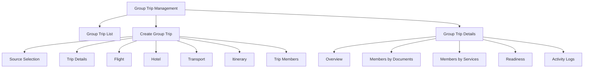
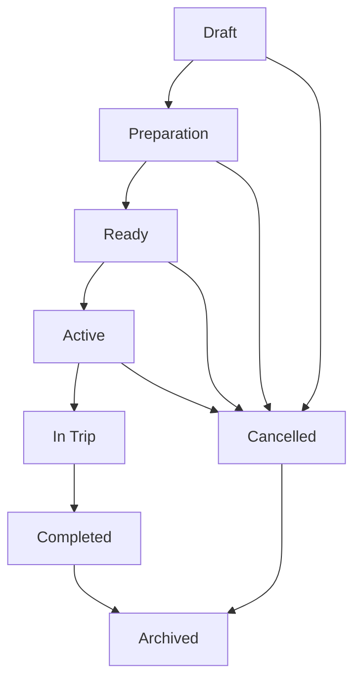
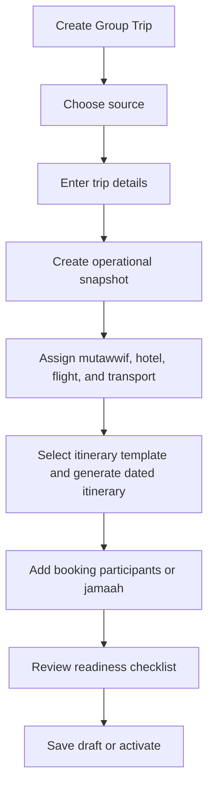
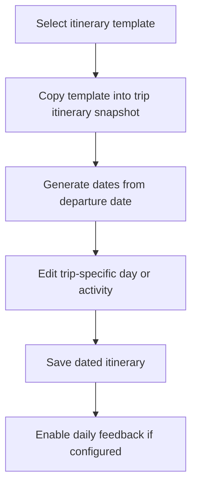
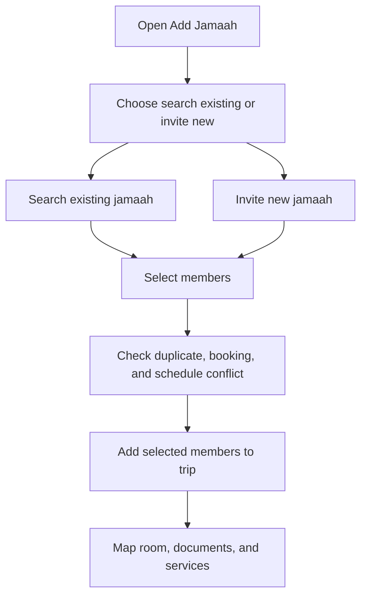
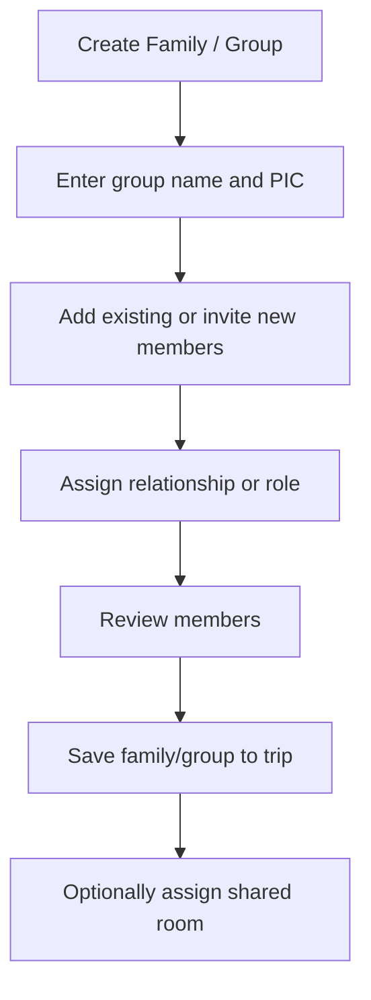

# TA PRD 07 - Group Trip Management

Product: UmrahHaji.com Travel Agency Portal  
Module: Group Trip Management  
Scope: Travel Agency Portal / Agency Workspace  
Platform: Responsive Web Platform  
Status: Draft  
Last Updated: 9 June 2026  

---

## 1. Module Overview

Group Trip Management is the Travel Agency Portal module where a Travel Agency prepares and operates actual Umrah or Hajj departure groups.

This module converts package schedules and confirmed bookings into an operational trip workspace. It brings together trip details, package snapshot, booking allocation, jamaah members, family/group members, mutawwif assignment, hotel assignment, flight assignment, itinerary schedule, transport information, documents, services, room configuration, WhatsApp group link, readiness tracking, and export.

Group Trip is the operational layer:

1. Package is the sellable offer.
2. Booking is the customer reservation and payment record.
3. Group Trip is the real departure group that operations staff manage before, during, and after travel.

---

## 2. Relationship With Master PRD

This module follows the Travel Agency Portal Master PRD principles:

1. Group Trip Management is a P0 module.
2. Group Trip belongs to one Travel Agency.
3. Group Trip can be created from package schedule, confirmed booking allocation, or manual setup.
4. Group Trip stores operational snapshots for package, hotel, flight, itinerary, transport, room, member document status, and member service status.
5. Manual changes in Group Trip must not automatically modify source package or booking.
6. Travel Agency users can only access their own group trips.
7. Admin Panel can monitor and assist through audited workflows.

---

## 3. Goals

1. Allow Travel Agencies to prepare and operate departure groups.
2. Convert package and booking data into operational trip snapshots.
3. Support manual group trip creation when needed.
4. Manage trip members by individual jamaah and family/group.
5. Track document readiness by member.
6. Track service readiness by member.
7. Assign mutawwif, hotel, flight, itinerary, and transport data.
8. Generate dated itinerary from itinerary template and departure date.
9. Provide clear readiness status before departure.
10. Export trip summary for operational sharing and review.

---

## 4. In Scope and Out of Scope

### 4.1 In Scope for Phase 1

1. Group trip list.
2. Create group trip from package schedule.
3. Create group trip from confirmed booking allocation.
4. Manual group trip creation.
5. Group trip details.
6. Group trip status management.
7. Mutawwif assignment.
8. Hotel assignment from Admin-approved hotel catalog.
9. Flight assignment from Admin-approved airline/flight catalog.
10. Itinerary template selection and dated schedule generation.
11. Transport information.
12. WhatsApp group link.
13. Trip member management.
14. Add members from confirmed bookings.
15. Add existing jamaah.
16. Invite new jamaah.
17. Create family/group member container.
18. Trip members by documents.
19. Trip members by services.
20. Room configuration and room number assignment.
21. Document upload and status tracking.
22. Service status tracking.
23. Trip readiness summary.
24. Export group trip summary to PDF.
25. Activity log and audit history.

### 4.2 Phase 2 / Future Scope

1. Live airline booking and seat inventory.
2. Live hotel room inventory.
3. Automated visa submission.
4. Automated train ticket booking.
5. Automated WhatsApp group creation.
6. In-app group chat.
7. Advanced operations task board.
8. Real-time mutawwif availability calendar.
9. Mobile offline mode for field operations.
10. Automated geolocation attendance tracking.

### 4.3 Out of Scope for Group Trip Management

1. Package publishing and pricing configuration. This belongs to Package Management.
2. Booking payment collection and refund processing. This belongs to Booking and Finance Management.
3. Master hotel, flight, airline, itinerary, season, and city catalog creation. This belongs to Admin Panel.
4. Full mutawwif profile verification. This belongs to Admin Mutawwif Management.
5. Public customer booking flow. This belongs to Booking Management Phase 2.

---

## 5. Key Definitions

| Term | Definition |
|---|---|
| Group Trip | Operational departure group for a specific travel period |
| Trip Member | Jamaah assigned to a group trip |
| Family / Group Container | Member grouping used for family or group booking context |
| Package Snapshot | Copied package information used by the trip |
| Booking Allocation | Confirmed booking participants assigned to a group trip |
| Operational Snapshot | Copied hotel, flight, itinerary, room, and service data |
| Document Readiness | Member-level document completion status |
| Service Readiness | Member-level operational service completion status |
| WAG Link | WhatsApp group link used for trip coordination |

---

## 6. User Roles and Permissions

| Action | Owner / PIC | Agency Admin | Operations | Sales / Booking | Finance | Customer Service | Auditor |
|---|---:|---:|---:|---:|---:|---:|---:|
| View group trip list | Yes | Yes | Yes | Permission-based | Permission-based | Permission-based | Yes |
| Create group trip | Yes | Permission-based | Yes | Permission-based | No | No | No |
| Edit trip details | Yes | Permission-based | Yes | No | No | No | No |
| Assign mutawwif | Yes | Permission-based | Yes | No | No | No | No |
| Assign hotel | Yes | Permission-based | Yes | No | No | No | No |
| Assign flight | Yes | Permission-based | Yes | No | No | No | No |
| Edit itinerary | Yes | Permission-based | Yes | No | No | No | No |
| Manage trip members | Yes | Permission-based | Yes | Permission-based | No | Permission-based | No |
| View member documents | Yes | Permission-based | Permission-based | Permission-based | No | No | Permission-based |
| Upload/update documents | Yes | Permission-based | Yes | Permission-based | No | No | No |
| Update service status | Yes | Permission-based | Yes | No | Permission-based | No | No |
| View payment summary | Yes | Permission-based | Permission-based | Permission-based | Yes | No | Permission-based |
| Export trip summary | Yes | Permission-based | Yes | Permission-based | Permission-based | No | Permission-based |
| Archive group trip | Yes | Permission-based | No | No | No | No | No |

Permission rules:

1. Staff can only manage group trips owned by their Travel Agency.
2. Sensitive member documents require explicit sensitive-data permission.
3. Payment summary is read-only and requires payment-read permission.
4. Deleting active trips should be blocked; archive is preferred.
5. Completed trips should become mostly read-only except for correction permission.
6. Admin-assisted changes from Admin Panel must be visible in activity log.

---

## 7. Data Ownership and Snapshot Rules

### 7.1 Source vs Snapshot

| Data | Source Module | Group Trip Behavior |
|---|---|---|
| Travel Agency | Agency Profile | Reference only |
| Package | Package Management | Copy package snapshot |
| Booking | Booking Management | Reference booking and allocation status |
| Jamaah | Jamaah Management | Reference jamaah profile and store trip-member status |
| Mutawwif | Mutawwif Assignment / Admin catalog | Reference assignment and copy display snapshot |
| Hotel | Admin Hotel catalog | Copy hotel assignment snapshot |
| Flight | Admin Airline/Flight catalog | Copy flight assignment snapshot |
| Itinerary | Admin/Agency itinerary template | Copy and convert to dated trip schedule |
| Transport | Package or manual trip setup | Store trip-specific transport details |
| Documents | Jamaah / trip upload | Store trip-specific document status |
| Services | Trip operations | Store trip-member service status |
| Room | Booking/package/trip | Store trip-specific room assignment |

### 7.2 Snapshot Rules

1. Group Trip must store source record ID and copied display data.
2. Changing a package after trip creation must not silently change existing group trip.
3. Changing catalog hotel, flight, or itinerary template must not silently change existing group trip.
4. Agency can manually refresh snapshot only with confirmation.
5. Snapshot refresh must preserve previous version in activity log.
6. Completed trip snapshots should be locked by default.

### 7.3 Active Trip Change Approval and Impact Review

After a group trip becomes Active, major operational changes must go through an impact review before saving.

| Change Type | Requires Impact Review | Requires Approval | Notification Target |
|---|---:|---:|---|
| Trip schedule / departure date | Yes | Yes | Members, mutawwif, operations, finance if invoice due dates are affected |
| Hotel assignment | Yes | Yes | Members, operations, customer service |
| Flight assignment | Yes | Yes | Members, operations, documents/services |
| Itinerary date or activity time | Yes | Permission-based | Members, mutawwif, operations |
| Mutawwif replacement | Yes | Permission-based | Members, old mutawwif, new mutawwif, operations |
| Room configuration | Yes | Permission-based | Affected members, operations |
| Member allocation | Yes | Permission-based | Affected members, finance if invoice/payment is affected |
| WhatsApp group link | No | No | Members if notification is enabled |

Rules:
- Impact review must show affected members, affected documents/services, affected invoices, and notification preview.
- System must store previous value, new value, reason, changed by, timestamp, and approval source.
- Admin-assisted changes from Admin Panel must appear in Travel Agency activity log.
- Completed trips remain locked except for correction permission with mandatory reason.

---

## 8. Information Architecture

```text
Group Trip Management
├── Group Trip List
├── Create Group Trip
│   ├── Source Selection
│   ├── Trip Details
│   ├── Flight Assignment
│   ├── Hotel Assignment
│   ├── Transport Information
│   ├── Itinerary
│   └── Trip Members
├── Group Trip Details
│   ├── Overview
│   ├── Trip Members
│   │   ├── By Documents
│   │   └── By Services
│   ├── Mutawwif
│   ├── Hotel
│   ├── Flight
│   ├── Itinerary
│   ├── Transport
│   ├── Finance Summary
│   ├── Readiness
│   ├── Export
│   └── Activity Logs
```

### 8.1 IA Diagram



---

## 9. Group Trip Lifecycle

### 9.1 Status Values

| Status | Meaning |
|---|---|
| Draft | Trip is being prepared |
| Preparation | Trip has core data but readiness is incomplete |
| Ready | Required operational data is complete |
| Active | Trip is active and approaching departure |
| In Trip | Trip is currently running |
| Completed | Trip has ended |
| Cancelled | Trip cancelled |
| Archived | Hidden from active view but retained |

### 9.2 Status Flow



### 9.3 Status Rules

1. Draft can be saved with incomplete data.
2. Ready requires minimum readiness criteria.
3. Active should require schedule, members, mutawwif or guide note, hotel, flight, and itinerary status depending on package inclusions.
4. In Trip can be set automatically by date or manually.
5. Completed can trigger end-of-trip testimonial request.
6. Cancelled trip with allocated bookings should trigger booking and finance review.

---

## 10. Group Trip List

### 10.1 Recommended Summary Cards

| Card | Description |
|---|---|
| Total Group Trips | Total trips in selected period |
| Upcoming Departures | Trips departing soon |
| Ready Trips | Trips with required readiness complete |
| Pending Documents | Trips with missing member documents |
| Pending Services | Trips with incomplete services |
| Completed Trips | Trips completed in selected period |

### 10.2 Table Columns

| Column | Description |
|---|---|
| Checkbox | Bulk selection |
| Group Trip | Trip name, image, member count |
| Package | Source package if any |
| Mutawwif | Assigned mutawwif |
| Schedule | Departure and return date |
| Hotel | Makkah/Madinah hotel summary |
| Flight | Airline/flight summary |
| Readiness | Documents/services readiness |
| Status | Group trip status |
| WAG Link | WhatsApp group link |
| Date Created | Creation date |
| Actions | View, edit, export, archive |

### 10.3 Filters

| Filter | Options |
|---|---|
| Status | Draft, Preparation, Ready, Active, In Trip, Completed, Cancelled, Archived |
| Package | Agency package list |
| Mutawwif | Assigned mutawwif |
| Schedule | Upcoming, this month, custom range |
| Hotel | Selected hotel |
| Flight | Airline or flight |
| Readiness | Complete, incomplete, missing documents, missing services |
| Date Created | All Time, Today, This Week, This Month, Custom Range |

### 10.4 Search

Search supports:

1. Group trip name.
2. Package name.
3. Mutawwif name.
4. Jamaah/member name.
5. Airline name.
6. Hotel name.
7. WhatsApp group link text if available.

---

## 11. Create Group Trip

### 11.1 Source Options

| Source | Description |
|---|---|
| From Package Schedule | Select published package and schedule, then generate trip data |
| From Booking Allocation | Select confirmed bookings and create group trip from allocated members |
| Manual Setup | Enter trip details manually for special cases |
| Duplicate Existing Trip | Copy structure from previous trip and adjust schedule |

### 11.2 Create Flow



### 11.3 Trip Details Fields

| Field | Type | Required | Notes |
|---|---|---:|---|
| Trip Image / Icon | Upload | No | JPG, JPEG, PNG, WEBP max 2 MB |
| Group Trip Name | Text | Yes | Max 120 chars |
| Category | Select | Yes | Umrah, Hajj, Ziyarah, Special |
| Source Package | Select | Conditional | Required if created from package |
| Source Schedule | Select | Conditional | Required if created from package schedule |
| Departure Date | Date | Yes | Used to generate itinerary dates |
| Return Date | Date | Yes | Must be after departure |
| Mutawwif | Select | Recommended | Only active/eligible mutawwif |
| Capacity | Number | No | Optional limit |
| Status | Select | Yes | Draft default |
| WhatsApp Group Link | URL | No | Validate URL |
| Internal Notes | Textarea | No | Agency-only |

### 11.4 Manual Creation Rules

1. Manual group trip must belong to current Travel Agency.
2. Manual trip can be created without package reference.
3. If created manually, pricing and booking data are not automatically generated.
4. Manual trip members can be added from Jamaah Management or invited.
5. Manual setup should still support hotel, flight, itinerary, transport, documents, and services.

---

## 12. Flight Assignment

Flight assignment consumes Admin-approved Airline/Flight catalog and stores trip-specific snapshot.

### 12.1 Flight Sections

1. Departure flight.
2. Return flight.
3. Optional transit area.
4. Flight class.
5. Departure airport.
6. Arrival airport.
7. Estimated duration.

### 12.2 Flight Fields

| Field | Type | Required | Notes |
|---|---|---:|---|
| Airline | Select | Conditional | Required if package includes flight |
| Flight Number | Select | Recommended | From selected airline |
| Flight Class | Select | Recommended | Economy, business, first |
| Departure Airport | Select | Conditional | Airport code and city |
| Arrival Airport | Select | Conditional | Airport code and city |
| Departure Date & Time | Date/time | Conditional | Trip-specific |
| Arrival Date & Time | Date/time | Conditional | Trip-specific |
| Add Transit Area | Toggle | No | Enables transit fields |
| Transit Airport | Select | Conditional | Required if transit enabled |
| Duration | Text/select | No | Display estimate |

### 12.3 Flight Rules

1. Flight assignment is optional if package is land arrangement only.
2. Flight snapshot must preserve airline name, code, flight number, airports, and schedule details.
3. Updating Admin flight catalog must not update existing trips automatically.
4. Changing trip flight should warn if e-ticket documents already exist.
5. Flight change should trigger notification reminder if enabled.

---

## 13. Hotel Assignment

Hotel assignment consumes Admin-approved Hotel catalog and stores trip-specific snapshot.

### 13.1 Hotel Sections

1. Makkah hotel.
2. Madinah hotel.
3. Optional transit/other city hotel.

### 13.2 Hotel Fields

| Field | Type | Required | Notes |
|---|---|---:|---|
| City | Select | Yes | Makkah, Madinah, Jeddah, other |
| Hotel | Select | Conditional | Active hotel from catalog |
| Check-in Date | Date | Recommended | Trip-specific |
| Check-out Date | Date | Recommended | Trip-specific |
| Nights | Number | Recommended | Can be calculated |
| Room Allocation Note | Textarea | No | Internal |
| Distance to Mosque | Read-only | No | From hotel snapshot |

### 13.3 Hotel Rules

1. Hotel assignment is required if package includes hotel stay.
2. Hotel snapshot must preserve hotel name, city, address, rating, distance, and display image.
3. Changing hotel should warn if room assignment already exists.
4. Group Trip can override hotel from package snapshot only with reason and audit log.

---

## 14. Transport Information

Transport tracks operational transport by trip segment.

### 14.1 Transport Segments

| Segment | Example |
|---|---|
| Makkah Transport | Bus or private coach |
| Madinah Transport | Bus or private coach |
| Inter-city Transport | Haramain High Speed Railway, bus, private coach |
| Airport Transfer | Airport to hotel |
| Ziyarah Transport | Local tour transport |

### 14.2 Transport Fields

| Field | Type | Required | Notes |
|---|---|---:|---|
| Segment | Select | Yes | Makkah, Madinah, inter-city, airport, ziyarah |
| Transport Type | Select | Yes | Bus, train, private coach, van, other |
| Provider Name | Text | No | Optional |
| Pickup Point | Text | No | Optional |
| Drop-off Point | Text | No | Optional |
| Date & Time | Date/time | No | Optional |
| Status | Select | Yes | Pending, confirmed, cancelled, not required |
| Notes | Textarea | No | Internal |

---

## 15. Itinerary

Group Trip uses itinerary template and converts it into a dated trip itinerary.

### 15.1 Itinerary Rules

1. Agency can select itinerary template from approved templates.
2. System generates day dates based on departure date.
3. Agency can edit trip-specific activity time, note, and sequence.
4. Editing group trip itinerary does not update the source itinerary template.
5. Daily itinerary can later trigger daily optional feedback.

### 15.2 Itinerary Flow



### 15.3 Activity Fields

| Field | Type | Required | Notes |
|---|---|---:|---|
| Day Number | Read-only | Yes | Generated |
| Date | Date | Yes | Generated from departure date |
| Day Title / Focus | Select/text | Yes | Departure, arrival, umrah, ziyarah, rest |
| Location | Select/text | Yes | Kuala Lumpur, Jeddah, Makkah, Madinah |
| Activity Name | Text | Conditional | Required if activity exists |
| Time | Time | Conditional | Local/destination time |
| Icon | Select | No | Departure, bus, hotel, prayer, ziyarah, etc. |
| Short Description | Textarea | No | Customer-facing or internal by setting |

---

## 16. Trip Members

Trip Members is the operational member workspace. It has two main views:

1. By Documents.
2. By Services.

Members can come from:

1. Confirmed booking allocation.
2. Existing jamaah.
3. Invited new jamaah.
4. Family/group creation flow.

### 16.1 Add Member Flow



### 16.2 Family / Group Flow



### 16.3 Member Columns - Base Identity

| Column | Description |
|---|---|
| Member | Avatar, name, email, phone |
| Member Type | Individual, family/group member, PIC |
| Family / Group | Group container |
| Booking ID | Source booking if any |
| Package | Package reference |
| Status | Active, pending profile, cancelled, removed |
| Actions | View profile, edit trip data, remove, request update |

### 16.4 Duplicate and Conflict Rules

1. Same jamaah cannot be added twice to the same group trip.
2. Jamaah with another active trip on overlapping dates should trigger conflict warning.
3. Pending invited jamaah can be added but may block Ready status.
4. Removing a member from trip must not delete jamaah profile.
5. Removing a booking-allocated member should update booking allocation status.

---

## 17. Trip Members by Documents

By Documents view tracks required document readiness per trip member.

### 17.1 Recommended Document Columns

| Column | Description |
|---|---|
| Member | Jamaah/member identity |
| IC / Identity | Status and view/upload action |
| Passport | Status and view/upload action |
| Photo | Status and view/upload action |
| Vaccination | Status and view/upload action |
| Visa Application | Status and application ID |
| Flight E-ticket | Status and upload/view action |
| Train E-ticket | Optional status and upload/view action |
| Room Configuration | Room type and room number |

### 17.2 Document Status Values

| Status | Meaning |
|---|---|
| Missing | Required file/data not available |
| Pending | Uploaded but not reviewed |
| Confirmed | Accepted or verified |
| Rejected | Rejected with reason |
| Expiring Soon | Expiry date near threshold |
| Not Required | Not required for this trip |

### 17.3 Document Upload Limits

| Document | Allowed Formats | Max Size |
|---|---|---:|
| IC / Identity image | JPG, JPEG, PNG, WEBP | 2 MB |
| Passport scan | PDF, JPG, JPEG, PNG, WEBP | PDF 5 MB, image 2 MB |
| Profile photo | JPG, JPEG, PNG, WEBP | 2 MB |
| Vaccination document | PDF, JPG, JPEG, PNG, WEBP | 5 MB |
| Visa document | PDF, JPG, JPEG, PNG, WEBP | 5 MB |
| Flight e-ticket | PDF, JPG, JPEG, PNG, WEBP | 5 MB |
| Train e-ticket | PDF, JPG, JPEG, PNG, WEBP | 5 MB |

Server load rules:

1. Do not load original files in table rows.
2. Use icons/status chips and lazy preview.
3. Generate thumbnails for images.
4. Use protected/signed URLs for sensitive files.
5. Reject oversized files before upload starts when possible.
6. Virus scan uploaded files.

---

## 18. Trip Members by Services

By Services view tracks operational services per member.

### 18.1 Recommended Service Columns

| Column | Description |
|---|---|
| Member | Jamaah/member identity |
| Visa Processing | Not started, pending, submitted, approved, rejected |
| Flight Ticket | Not required, pending, issued, changed |
| Train Ticket | Optional service status |
| Hotel Room | Room type and room number |
| Transport | Pending, confirmed, not required |
| Meal / Special Request | Optional note/status |
| Insurance | Not required, pending, confirmed |
| Umrah Kit | Pending, distributed |
| Mutawwif Briefing | Pending, completed |

### 18.2 Service Status Values

| Status | Meaning |
|---|---|
| Not Started | No action yet |
| Pending | Waiting for processing |
| In Progress | Being processed |
| Submitted | Submitted to external party |
| Confirmed | Completed or confirmed |
| Rejected | Rejected and requires action |
| Not Required | Service not applicable |
| Cancelled | Service cancelled |

### 18.3 Service Rules

1. Services can be configured per package/trip.
2. Service completion can contribute to overall trip readiness.
3. Service status changes must be logged.
4. Rejected service should require reason.
5. Some service statuses may sync with documents, such as visa and e-ticket.

---

## 19. Readiness Summary

Readiness Summary helps agency staff see whether the group trip is operationally ready.

### 19.1 Readiness Categories

| Category | Examples |
|---|---|
| Trip Details | Schedule, category, WAG link |
| Members | Member count, profile completion |
| Mutawwif | Assigned and confirmed |
| Hotel | Makkah/Madinah assignment |
| Flight | Departure/return flight assignment |
| Itinerary | Dated itinerary generated |
| Documents | Passport, IC, vaccination, visa, tickets |
| Services | Visa, room, transport, insurance, kit |
| Finance Reference | Payment readiness summary if enabled |

### 19.2 Readiness Status

| Status | Meaning |
|---|---|
| Complete | All required items complete |
| Warning | Non-blocking issue exists |
| Blocked | Required item missing |
| Not Required | Item not applicable |

### 19.3 Activation Rule

Trip can become Active only if required checklist is complete or authorized staff overrides with reason.

Recommended minimum requirements:

1. Trip name.
2. Departure and return date.
3. At least one active member.
4. Itinerary generated.
5. Hotel assigned if package includes hotel.
6. Flight assigned if package includes flight.
7. Mutawwif assigned or marked not required.
8. No blocking document/service issue, or override reason recorded.

---

## 20. Group Trip Details Page

### 20.1 Recommended Tabs

| Tab | Purpose |
|---|---|
| Overview | Trip summary, schedule, status, readiness |
| Members | Member list, family/group, allocation source |
| Documents | By Documents workspace |
| Services | By Services workspace |
| Mutawwif | Assignment and contact summary |
| Hotel | Hotel assignment snapshot |
| Flight | Flight assignment snapshot |
| Itinerary | Dated itinerary |
| Transport | Transport segments |
| Finance Summary | Payment/outstanding reference if permitted |
| Export | PDF summary and manifest |
| Activity Logs | Audit history |

### 20.2 Overview Fields

1. Group trip name.
2. Category.
3. Status.
4. Package reference.
5. Schedule.
6. Member count.
7. Family/group count.
8. Mutawwif.
9. Hotel summary.
10. Flight summary.
11. Readiness score.
12. WhatsApp group link.
13. Created by.
14. Last updated.

---

## 21. Export to PDF

Export should support operational sharing without exposing unnecessary sensitive data.

### 21.1 Export Types

| Export | Included Data |
|---|---|
| Trip Summary | Trip details, schedule, hotel, flight, mutawwif, itinerary |
| Member Manifest | Member list, contact, room, document/service status |
| Document Readiness | Member document statuses |
| Service Readiness | Member service statuses |
| Full Operational Export | Summary, members, documents, services, itinerary |

### 21.2 Export Rules

1. Export requires permission.
2. Sensitive fields should be masked unless user has permission.
3. Export action must be logged.
4. PDF should include generation timestamp and generated-by user.
5. Completed trip export should preserve historical snapshot.

---

## 22. Notification Events

Recommended notification events:

1. Group trip created.
2. Member added.
3. Member removed.
4. Mutawwif assigned or changed.
5. Hotel changed.
6. Flight changed.
7. Itinerary updated.
8. Document missing reminder.
9. Service status changed.
10. Trip activated.
11. Trip cancelled.
12. Trip completed.

Notification channels can follow agency settings: email, WhatsApp, or internal notification.

### 22.1 Notification De-duplication Rules

1. Group Trip notifications must not duplicate Announcement messages for the same change unless user explicitly sends both.
2. Major trip changes should show a notification preview before sending.
3. Failed notifications should be retryable without creating a new trip change record.
4. Notification history must store channel, recipient, delivery status, and source event.

---

## 23. Functional Requirements

| ID | Requirement | Priority |
|---|---|---|
| TA-GT-001 | System must display only group trips owned by the logged-in Travel Agency. | P0 |
| TA-GT-002 | System must provide group trip list with search, filters, pagination, and actions. | P0 |
| TA-GT-003 | System must allow authorized staff to create group trip from package schedule. | P0 |
| TA-GT-004 | System must allow authorized staff to create group trip from confirmed booking allocation. | P0 |
| TA-GT-005 | System must allow manual group trip creation. | P0 |
| TA-GT-006 | System must store operational snapshots for package, hotel, flight, itinerary, and transport data. | P0 |
| TA-GT-007 | System must allow mutawwif assignment. | P0 |
| TA-GT-008 | System must allow hotel assignment from approved catalog. | P0 |
| TA-GT-009 | System must allow flight assignment from approved catalog. | P0 |
| TA-GT-010 | System must generate dated itinerary from selected itinerary template and departure date. | P0 |
| TA-GT-011 | System must allow trip member management. | P0 |
| TA-GT-012 | System must support add members from booking allocation. | P0 |
| TA-GT-013 | System must support add existing jamaah and invite new jamaah. | P0 |
| TA-GT-014 | System must support family/group member container. | P0 |
| TA-GT-015 | System must provide Trip Members by Documents view. | P0 |
| TA-GT-016 | System must provide Trip Members by Services view. | P0 |
| TA-GT-017 | System must validate upload format and file size. | P0 |
| TA-GT-018 | System must support room configuration and room number assignment. | P0 |
| TA-GT-019 | System must calculate readiness status from required trip data, documents, and services. | P0 |
| TA-GT-020 | System must block Active status if required readiness items are missing unless override permission is used. | P0 |
| TA-GT-021 | System must export group trip summary to PDF by permission. | P1 |
| TA-GT-022 | System must keep activity log for trip changes. | P0 |
| TA-GT-023 | System must prevent duplicate member in same group trip. | P0 |
| TA-GT-024 | System should warn about overlapping trip schedule for same jamaah or mutawwif. | P1 |
| TA-GT-025 | System should support notification reminders for missing documents and services. | P1 |
| TA-GT-026 | System should support duplicate existing trip structure. | P2 |

---

## 24. Form Specification

### 24.1 Source Selection

| Field | Type | Required | Notes |
|---|---|---:|---|
| Create From | Select | Yes | Package schedule, booking allocation, manual, duplicate trip |
| Package | Searchable select | Conditional | Required for package source |
| Schedule | Select | Conditional | Required for package source |
| Booking | Multi-select | Conditional | Required for booking source |
| Existing Trip | Select | Conditional | Required for duplicate source |

### 24.2 Group Trip Details

| Field | Type | Required | Notes |
|---|---|---:|---|
| Group Trip Name | Text | Yes | Max 120 chars |
| Category | Select | Yes | Umrah, Hajj, Ziyarah, Special |
| Trip Image | Upload | No | Image max 2 MB |
| Departure Date | Date | Yes | Used for itinerary generation |
| Return Date | Date | Yes | Must be after departure |
| Capacity | Number | No | Optional |
| Mutawwif | Select | Recommended | Active/eligible mutawwif |
| Status | Select | Yes | Draft default |
| WhatsApp Group Link | URL | No | Validate URL |
| Internal Notes | Textarea | No | Agency-only |

### 24.3 Add Member

| Field | Type | Required | Notes |
|---|---|---:|---|
| Add Mode | Segmented control | Yes | Existing jamaah, invite new jamaah |
| Search | Search input | Conditional | Required for existing jamaah |
| Jamaah Name | Text | Conditional | Required for invite |
| Email | Email | Conditional | Required for invite |
| Phone | Phone | Conditional | Recommended |
| Family / Group | Select | No | Existing or create new |
| Room Type | Select | No | Single, double, triple, quad, quint |
| Room Number | Text | No | Optional |

### 24.4 Document Update

| Field | Type | Required | Notes |
|---|---|---:|---|
| Member | Read-only | Yes | Selected member |
| Document Type | Select | Yes | Passport, IC, photo, vaccination, visa, ticket, train |
| Status | Select | Yes | Missing, pending, confirmed, rejected, expiring soon, not required |
| File | Upload | Conditional | Required if uploading |
| Expiry Date | Date | Conditional | Passport/vaccination if applicable |
| Note | Textarea | No | Internal |

### 24.5 Service Update

| Field | Type | Required | Notes |
|---|---|---:|---|
| Member | Read-only | Yes | Selected member |
| Service Type | Select | Yes | Visa, flight ticket, train ticket, room, transport, meal, insurance, kit |
| Status | Select | Yes | Not started, pending, in progress, submitted, confirmed, rejected, not required |
| Reference Number | Text | No | Visa application ID, ticket number, etc. |
| Note | Textarea | No | Internal |
| Notify Member | Toggle | No | Default depends on settings |

---

## 25. Empty, Error, and Loading States

| State | Behavior |
|---|---|
| Empty group trip list | Show Create Group Trip CTA |
| No package schedule | Show message to create/publish package schedule first |
| No confirmed booking | Allow manual setup or show booking CTA |
| No mutawwif available | Allow save draft and show assignment warning |
| Hotel/flight not selected | Show readiness warning if required |
| Itinerary not generated | Block Ready/Active unless override |
| Duplicate member | Prevent add and show existing member |
| Schedule conflict | Warn and require confirmation/permission |
| Upload too large | Reject upload and show max size |
| Export permission denied | Hide export or show permission message |
| Network error | Preserve form data and allow retry |

---

## 26. Responsive Behavior

### 26.1 Desktop

1. Group trip list uses table layout.
2. Create Group Trip uses multi-section form.
3. Trip Members by Documents and By Services can use wide table with horizontal scroll.
4. Details page uses tabs.

### 26.2 Tablet

1. Filters collapse into drawer.
2. Trip member tables become card/table hybrid.
3. Itinerary schedule uses accordion per day.

### 26.3 Mobile

1. Group trip list becomes card list.
2. Create Group Trip becomes vertical wizard.
3. Trip member documents/services become member cards with expandable statuses.
4. Sticky action bar shows Save Draft, Save, or Activate.
5. Export and bulk actions move into overflow menu.

---

## 27. Data Dependencies

| Data | Source |
|---|---|
| Travel Agency scope | Agency Profile |
| Staff permission | Team & Roles |
| Package and schedule | Package Management |
| Confirmed booking and participants | Booking Management |
| Jamaah profile | Jamaah Management |
| Mutawwif | Mutawwif Assignment / Admin Mutawwif catalog |
| Hotel | Admin Hotel Management catalog |
| Airline/flight | Admin Flight / Airline Management catalog |
| Itinerary template | Itinerary Management |
| Transport settings | Package or trip manual setup |
| Payment summary | Finance Management |
| Document rules | Documents & Services |
| Notifications | Settings |

---

## 28. Integration With Other Modules

| Module | Integration |
|---|---|
| Package Management | Group Trip can be created from package schedule and stores package snapshot |
| Booking Management | Confirmed booking participants can be allocated to group trip |
| Jamaah Management | Trip members reference jamaah profiles |
| Mutawwif Assignment | Trip assigns eligible mutawwif |
| Documents & Services | Member documents and services can sync to operational readiness |
| Finance Management | Group trip shows payment/outstanding reference if permitted |
| Testimonials | Completed trip triggers end-of-trip testimonial and daily feedback references |
| Reports / Support | Group trip can be related entity for reports |
| Announcements | Group trip can be audience target |
| Admin Panel | Admin monitors and can assist with audited changes |

---

## 29. Audit and Security Rules

Audit log must record:

1. Group trip created.
2. Source package, booking, or manual source selected.
3. Snapshot created or refreshed.
4. Trip details edited.
5. Mutawwif assigned or changed.
6. Hotel assigned or changed.
7. Flight assigned or changed.
8. Itinerary generated or edited.
9. Member added, removed, or updated.
10. Document uploaded, viewed, downloaded, verified, rejected, or deleted.
11. Service status changed.
12. Room configuration changed.
13. Trip status changed.
14. Export generated.
15. Admin-assisted change.

Security rules:

1. Sensitive documents require protected access.
2. List view must not expose passport/IC numbers by default.
3. Export must respect masking and permission rules.
4. Completed trips should be locked from routine edits.
5. Hard delete should be blocked when trip has members, documents, service records, or finance references.

---

## 30. Acceptance Criteria

1. Agency staff can view only their own group trips.
2. Authorized staff can create group trip from package schedule.
3. Authorized staff can create group trip from confirmed booking allocation.
4. Authorized staff can create manual group trip.
5. Group trip stores operational snapshots.
6. Agency can assign mutawwif, hotel, flight, transport, and itinerary.
7. Itinerary template generates dated trip itinerary.
8. Agency can add members from bookings, existing jamaah, or new invitations.
9. Family/group member container is supported.
10. Trip Members has By Documents and By Services views.
11. Document uploads validate format and file size.
12. Service statuses can be updated per member.
13. Readiness summary identifies complete, warning, blocked, and not required states.
14. Active status is blocked when required readiness is incomplete unless override is permitted.
15. Export to PDF works by permission.
16. Sensitive data follows permission and masking rules.
17. Activity log records key actions.
18. Mobile layout remains usable without unreadable table overflow.

---

## 31. Open Questions

1. Should Ready status require all members to have complete documents, or allow percentage-based readiness threshold?
2. Should mutawwif assignment be mandatory for all trips or optional for agency-managed trips?
3. Should room assignment live primarily in Booking, Group Trip, or Documents & Services?
4. Should flight and hotel changes after member ticket/room assignment require approval?
5. Should daily itinerary feedback be enabled from Group Trip settings or inherited from Itinerary template?
