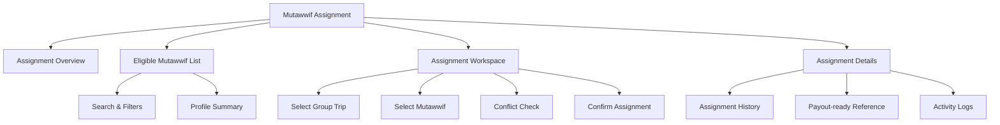
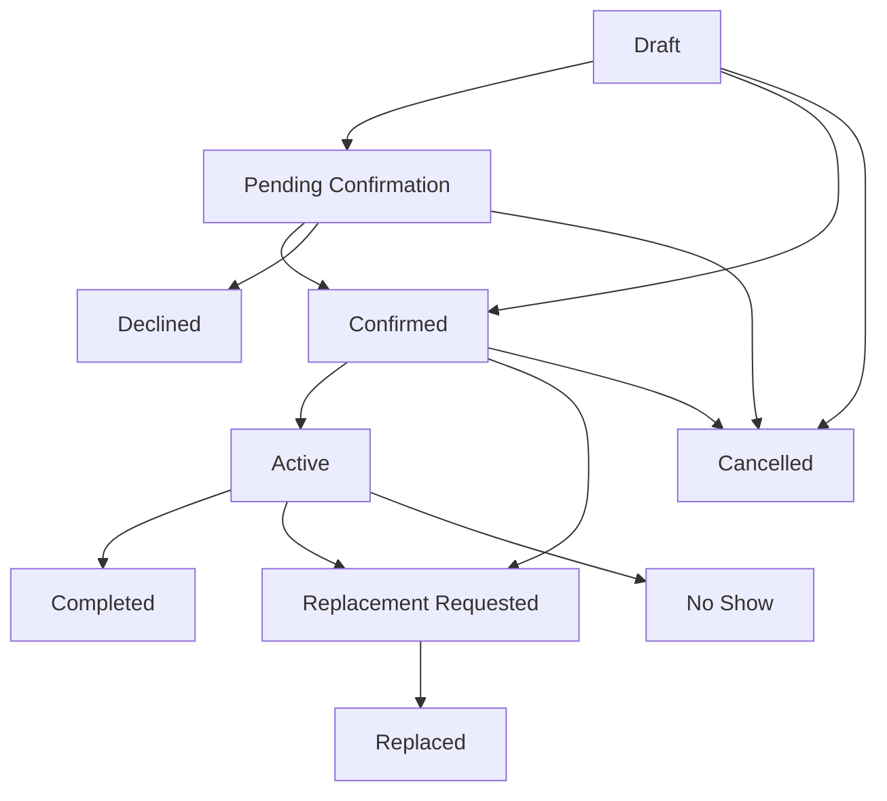
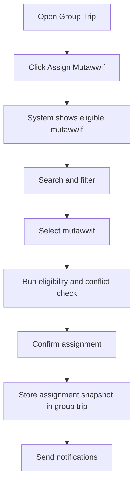
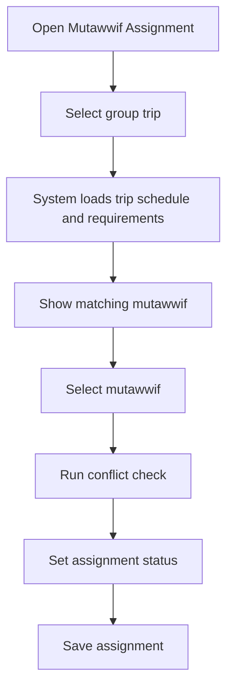
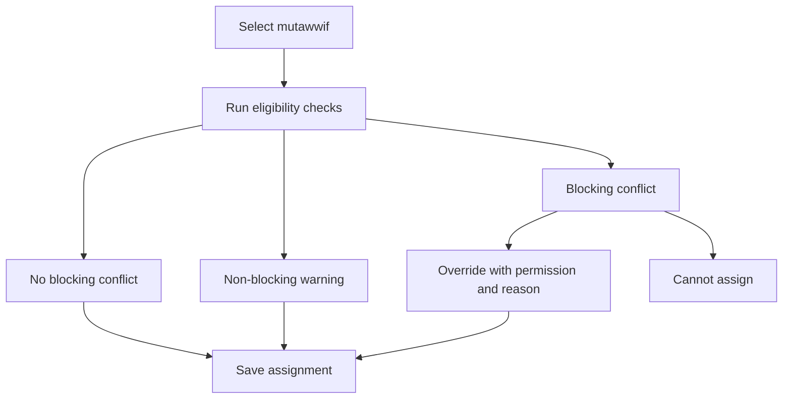
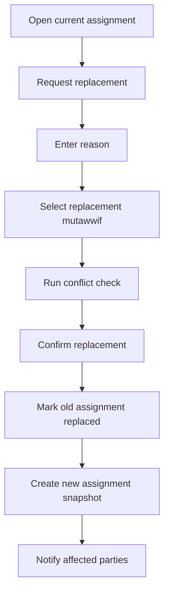

# TA PRD 08 - Mutawwif Assignment

Product: UmrahHaji.com Travel Agency Portal  
Module: Mutawwif Assignment  
Scope: Travel Agency Portal / Agency Workspace  
Platform: Responsive Web Platform  
Status: Draft  
Last Updated: 9 June 2026  

---

## 1. Module Overview

Mutawwif Assignment is the Travel Agency Portal module where a Travel Agency searches, reviews, selects, assigns, replaces, and tracks approved mutawwif for its own group trips.

This module is not the same as Admin Mutawwif Management.

Admin Mutawwif Management owns mutawwif profile creation, verification, compliance documents, certification records, and global status. Travel Agency Mutawwif Assignment consumes approved mutawwif data and focuses on operational assignment to group trips.

The module helps agency operations staff answer:

1. Which mutawwif is eligible for this trip?
2. Is the mutawwif available for the selected schedule?
3. Does the mutawwif match the language, location, gender preference, specialization, and experience needed?
4. Has the mutawwif accepted or confirmed the assignment?
5. Are there conflicts, replacements, or pending confirmations?

---

## 2. Relationship With Master PRD

This module follows the Travel Agency Portal Master PRD principles:

1. Mutawwif Assignment is a P0 module.
2. Travel Agency can assign mutawwif only to its own group trips.
3. Only active and approved mutawwif can be assigned.
4. Assignment conflicts should be detected.
5. Group Trip stores mutawwif assignment snapshot.
6. Payout remains handled by platform finance process unless agency-specific payout workflow is enabled later.
7. Admin Panel remains the source of truth for mutawwif verification and global status.

---

## 3. Goals

1. Allow Travel Agencies to find eligible mutawwif for upcoming group trips.
2. Support assignment, confirmation, replacement, and removal workflows.
3. Prevent schedule conflicts and invalid assignments.
4. Show enough profile summary for operational decision-making without exposing unnecessary sensitive data.
5. Preserve assignment snapshot in Group Trip.
6. Track assignment status and assignment history.
7. Support basic communication and notification around assignment changes.
8. Provide payout-ready assignment references without executing payout in Phase 1.

---

## 4. In Scope and Out of Scope

### 4.1 In Scope for Phase 1

1. Mutawwif assignment list.
2. Eligible mutawwif search and filters.
3. Mutawwif profile summary view.
4. Assignment from Group Trip.
5. Assignment from Mutawwif Assignment page.
6. Assign mutawwif to one or more group trips.
7. Detect schedule conflict.
8. Track assignment status.
9. Replace assigned mutawwif.
10. Remove assignment.
11. View assignment history.
12. View rating and review summary.
13. View languages, specialization, job type, country/location, and experience.
14. Notify mutawwif and agency staff.
15. Assignment activity log.
16. Payout-ready assignment references for Finance.
17. Responsive web behavior.

### 4.2 Phase 2 / Future Scope

1. Real-time mutawwif availability calendar.
2. Mutawwif self-acceptance portal or mobile app.
3. Automated matching recommendation.
4. Automated payout calculation and disbursement.
5. In-app chat between agency and mutawwif.
6. Live location tracking.
7. Mutawwif performance scoring algorithm.
8. Multi-mutawwif team planning with shift schedule.

### 4.3 Out of Scope for Mutawwif Assignment

1. Creating or verifying global mutawwif profiles.
2. Editing mutawwif certifications and compliance documents.
3. Mutawwif bank/payout account management.
4. Payout execution.
5. Jamaah feedback collection form. This belongs to Testimonials.
6. Full Group Trip operation. This belongs to Group Trip Management.

---

## 5. Key Definitions

| Term | Definition |
|---|---|
| Mutawwif | Approved guide/service provider for Umrah/Hajj group trips |
| Assignment | Link between mutawwif and one group trip |
| Assignment Snapshot | Copied display data stored with group trip assignment |
| Eligibility | Whether mutawwif can be assigned based on status, verification, schedule, and rules |
| Conflict | Overlapping assignment, inactive status, unverified status, or unavailable schedule |
| Replacement | Changing assigned mutawwif after assignment exists |
| Payout-ready Reference | Assignment completion data that Finance can use for manual payout process |

---

## 6. User Roles and Permissions

| Action | Owner / PIC | Agency Admin | Operations | Sales / Booking | Finance | Customer Service | Auditor |
|---|---:|---:|---:|---:|---:|---:|---:|
| View eligible mutawwif list | Yes | Yes | Yes | Permission-based | No | Permission-based | Yes |
| View mutawwif profile summary | Yes | Yes | Yes | Permission-based | No | Permission-based | Yes |
| Assign mutawwif | Yes | Permission-based | Yes | No | No | No | No |
| Replace mutawwif | Yes | Permission-based | Yes | No | No | No | No |
| Remove assignment | Yes | Permission-based | Yes | No | No | No | No |
| Override conflict warning | Yes | Permission-based | Permission-based | No | No | No | No |
| View assignment history | Yes | Yes | Yes | Permission-based | Permission-based | Permission-based | Yes |
| View payout-ready reference | Yes | Permission-based | Permission-based | No | Yes | No | Permission-based |
| Export assignment data | Yes | Permission-based | Yes | No | Permission-based | No | Permission-based |

Permission rules:

1. Staff can only assign mutawwif to group trips owned by their Travel Agency.
2. Assignment override requires explicit permission and reason.
3. Finance can view payout-ready references but cannot assign mutawwif unless granted operations permission.
4. Sensitive mutawwif data such as identity, bank, and private compliance files must not be visible in this module.
5. Admin-assisted assignment must be visible in Travel Agency activity log.

---

## 7. Data Ownership and Visibility

### 7.1 Data Visible to Travel Agency

| Data | Visibility |
|---|---|
| Full name | Visible |
| Profile photo | Visible |
| Job type | Visible |
| Gender | Visible |
| Country / location | Visible |
| Languages | Visible |
| Specialization | Visible |
| Years of experience | Visible |
| Total assigned trips | Visible |
| Rating summary | Visible |
| Verification status | Visible as status only |
| Certifications | Summary visible; files hidden unless permitted |
| Documents | Not visible by default |
| Bank/payout details | Hidden |
| Identity number | Hidden |

### 7.2 Source vs Snapshot

| Data | Source | Assignment Behavior |
|---|---|---|
| Mutawwif profile | Admin Mutawwif Management | Reference profile ID and copy display snapshot |
| Verification status | Admin Mutawwif Management | Check eligibility at assignment time |
| Availability | Assignment records / availability setting | Check conflict and availability |
| Group Trip | Group Trip Management | Assignment belongs to selected trip |
| Rating | Testimonials / Reviews | Display summary |
| Payout-ready data | Assignment completion | Reference for Finance Management |

### 7.3 Snapshot Rules

1. Group Trip stores mutawwif ID and display snapshot at assignment time.
2. Later profile changes do not change historical assignment display unless manually refreshed.
3. If mutawwif becomes inactive after assignment, system must alert agency staff.
4. Completed trip assignment snapshot should remain read-only except for correction permission.

---

## 8. Information Architecture

```text
Mutawwif Assignment
├── Assignment Overview
├── Eligible Mutawwif List
│   ├── Search
│   ├── Filters
│   ├── Availability
│   └── Profile Summary
├── Assignment Workspace
│   ├── Select Group Trip
│   ├── Select Mutawwif
│   ├── Conflict Check
│   ├── Assignment Terms / Notes
│   └── Confirm Assignment
├── Assignment Details
│   ├── Group Trip
│   ├── Mutawwif Snapshot
│   ├── Status
│   ├── History
│   ├── Payout-ready Reference
│   └── Activity Logs
└── Replacement Flow
```

### 8.1 IA Diagram



---

## 9. Assignment Lifecycle

### 9.1 Assignment Status Values

| Status | Meaning |
|---|---|
| Draft | Assignment prepared but not confirmed |
| Pending Confirmation | Assignment sent to mutawwif or waiting for internal confirmation |
| Confirmed | Mutawwif confirmed or agency confirmed assignment |
| Active | Assignment is active for upcoming/in-progress trip |
| Completed | Trip completed and assignment closed |
| Replacement Requested | Agency requested replacement |
| Replaced | Assignment replaced by another mutawwif |
| Cancelled | Assignment cancelled |
| Declined | Mutawwif declined if self-confirmation is enabled |
| No Show | Mutawwif did not attend or fulfill assignment |

### 9.2 Assignment Status Flow



### 9.3 Status Rules

1. Draft can be saved if group trip is still incomplete.
2. Pending Confirmation is optional in Phase 1 if mutawwif self-confirmation is not enabled.
3. Confirmed can be set manually by authorized agency staff.
4. Active can follow group trip status or be set manually.
5. Completed is set when group trip is completed.
6. Replacement requires reason.
7. No Show requires reason and should affect internal service history.

### 9.4 Phase 1 and Phase 2 Confirmation Rules

| Phase | Confirmation Model | Rule |
|---|---|---|
| Phase 1 | Agency-confirmed assignment | Authorized agency staff can mark assignment as Confirmed after contacting mutawwif outside the system |
| Phase 1 optional | Notification-only confirmation | System sends assignment notification, but mutawwif response is not required to activate trip |
| Phase 2 | Mutawwif self-confirmation | Mutawwif accepts or declines through portal/app; assignment remains Pending Confirmation until response |

Rules:
- Phase 1 must clearly label Confirmed as agency-confirmed when mutawwif self-confirmation is not enabled.
- If self-confirmation is enabled later, decline/no-response rules must be configurable.
- Group Trip readiness must show whether the assignment is draft, pending, confirmed, active, or missing.

---

## 10. Eligible Mutawwif List

### 10.1 Recommended Columns

| Column | Description |
|---|---|
| Mutawwif | Avatar, name, email/phone if allowed |
| Verification | Approved, pending, rejected, expired |
| Availability | Available, conflict, unavailable, unknown |
| Job Type | Full-time, part-time, freelance, seasonal, volunteer, on-demand |
| Gender | Male, Female |
| Country / Location | Current location or working country |
| Languages | Malay, Arabic, English, Indonesian, etc. |
| Specialization | Umrah, Hajj, Ziyarah, elderly support, family group, Arabic-speaking |
| Experience | Years or total assigned trips |
| Rating | Average rating and review count |
| Last Assigned | Latest trip date |
| Actions | View summary, assign, compare |

### 10.2 Filters

| Filter | Options |
|---|---|
| Availability | Available, conflict, unavailable, unknown |
| Verification Status | Approved, pending, rejected, expired |
| Job Type | Full-time, part-time, freelance, seasonal, volunteer, on-demand |
| Country / Location | Country/city/location |
| Gender | Male, Female |
| Language | Master language list |
| Specialization | Umrah, Hajj, Ziyarah, elderly support, family group, Arabic-speaking |
| Rating | 5, 4+, 3+, unrated |
| Experience | 0-1 year, 1-3 years, 3-5 years, 5+ years |
| Date Created | All Time, Today, This Week, This Month, Custom Range |

### 10.3 Search

Search supports:

1. Mutawwif name.
2. Email if visible.
3. Phone if visible.
4. Language.
5. Specialization.
6. Location.
7. Certification title if indexed.

### 10.4 List Rules

1. Only active and approved mutawwif can be assigned by default.
2. Pending verification mutawwif can be visible but assignment should be blocked.
3. Inactive, suspended, or archived mutawwif should not appear in default assignable list.
4. Mutawwif with schedule conflict can appear with warning but cannot be assigned unless override is allowed.
5. Sensitive data must not appear in list view.

---

## 11. Mutawwif Profile Summary

Profile Summary gives enough information for assignment decision without exposing full Admin-only data.

### 11.1 Summary Sections

| Section | Fields |
|---|---|
| Basic Profile | Name, photo, gender, country/location, job type |
| Capability | Languages, specialization, experience, total trips |
| Verification | Approved status, expiry warning if any |
| Rating | Average rating, review count, recent review highlights |
| Assignment History | Recent group trips, completion rate, no-show flag if any |
| Contact | Email/phone if permitted |
| Notes | Agency-visible internal notes if any |

### 11.2 Hidden or Restricted Data

1. Identity number.
2. Bank/payout account.
3. Compliance document files.
4. Private Admin notes.
5. Internal investigation or suspension details unless Admin grants visibility.

---

## 12. Assignment Flow

### 12.1 Assign From Group Trip



### 12.2 Assign From Mutawwif Assignment Page



### 12.3 Assignment Form Fields

| Field | Type | Required | Notes |
|---|---|---:|---|
| Group Trip | Searchable select | Yes | Own agency group trips only |
| Mutawwif | Searchable select | Yes | Active and approved by default |
| Assignment Role | Select | Yes | Lead mutawwif, assistant mutawwif, ziyarah guide, manasik guide |
| Assignment Status | Select | Yes | Draft, pending confirmation, confirmed |
| Start Date | Date | Yes | Default trip departure date |
| End Date | Date | Yes | Default trip return date |
| Expected Pax | Number | No | From trip member count |
| Language Requirement | Multi-select | No | From trip preference |
| Notes | Textarea | No | Internal assignment note |
| Notify Mutawwif | Toggle | No | Default Yes if contact available |

---

## 13. Eligibility and Conflict Rules

### 13.1 Eligibility Checks

| Check | Rule |
|---|---|
| Global Status | Mutawwif must be Active |
| Verification | Mutawwif must be Approved |
| Assignment Date | Assignment date must not conflict with existing active assignment |
| Group Trip Ownership | Group trip must belong to current Travel Agency |
| Suspension | Suspended mutawwif cannot be assigned |
| Expired Certification | Warn or block depending on compliance setting |
| Missing Contact | Warn if notification cannot be sent |

### 13.2 Conflict Types

| Conflict | Behavior |
|---|---|
| Schedule overlap | Block unless override permission exists |
| Mutawwif inactive | Block |
| Verification not approved | Block |
| Suspended status | Block |
| Already assigned to same trip | Block duplicate |
| Certification expiry warning | Warn or block based on setting |
| Language mismatch | Warn |
| Gender preference mismatch | Warn |
| Location mismatch | Warn |

### 13.3 Conflict Flow



### 13.4 Override Rules

1. Override requires permission.
2. Override requires reason.
3. Override cannot bypass inactive, suspended, or unapproved verification status unless Admin allows through Admin Panel.
4. Override should be shown in activity log.

---

## 14. Replacement and Removal

### 14.1 Replacement Use Cases

1. Mutawwif schedule conflict.
2. Mutawwif unavailable.
3. Travel Agency request.
4. Mutawwif declined.
5. Low readiness or operational concern.
6. Emergency replacement.

### 14.2 Replacement Flow



### 14.3 Replacement Form Fields

| Field | Type | Required | Notes |
|---|---|---:|---|
| Current Mutawwif | Read-only | Yes | Current assignment |
| Replacement Reason | Select | Yes | Conflict, unavailable, agency request, declined, emergency, other |
| Reason Note | Textarea | Yes | Minimum 10 characters |
| Replacement Mutawwif | Select | Yes | Must pass eligibility checks |
| Effective Date | Date | Yes | Defaults today |
| Notify Current Mutawwif | Toggle | No | Default Yes |
| Notify New Mutawwif | Toggle | No | Default Yes |
| Notify Admin | Toggle | No | Default based on setting |

### 14.4 Removal Rules

1. Removing assignment requires reason.
2. Group Trip readiness must update after removal.
3. If group trip requires mutawwif, removal may block Active status.
4. Completed assignment should not be removed; use correction note if needed.

---

## 15. Assignment Details

### 15.1 Assignment Details Fields

| Field | Description |
|---|---|
| Assignment ID | Unique assignment reference |
| Group Trip | Linked trip |
| Travel Agency | Current agency |
| Mutawwif Snapshot | Name, photo, job type, language, specialization |
| Assignment Role | Lead or assistant role |
| Assignment Status | Current assignment status |
| Schedule | Start and end date |
| Expected Pax | Trip member count |
| Confirmation | Confirmed by, date, note |
| Replacement History | If replaced |
| Payout-ready Reference | Completion data for Finance |
| Activity Log | Assignment audit history |

### 15.2 Assignment History

Assignment history should show:

1. Previous assignments for selected mutawwif.
2. Assignment status.
3. Group trip name.
4. Travel Agency name if visible.
5. Trip dates.
6. Pax count.
7. Rating after trip.
8. Completion/no-show flag.

For privacy and cross-agency safety, other agency trip details may be masked or summarized unless the mutawwif is shared and visibility policy allows.

---

## 16. Payout-ready Reference

Phase 1 does not execute payout. However, assignment data should be ready for Finance review.

Important wording rule:
- Payout-ready Reference means the assignment can be reviewed by Finance.
- It does not mean money has been transferred.
- It must not trigger disbursement, bank transfer, or payment gateway payout in Phase 1.

### 16.1 Payout-ready Data

| Field | Description |
|---|---|
| Assignment ID | Reference for payout review |
| Mutawwif | Assigned mutawwif |
| Group Trip | Completed trip |
| Trip Date | Departure and return |
| Assignment Role | Lead, assistant, guide |
| Pax Count | Number of jamaah handled |
| Completion Status | Completed, no-show, replaced, cancelled |
| Service Rating | Rating summary if available |
| Internal Note | Finance/operations note |

### 16.2 Payout Phase 1 Rule

1. System records assignment completion data.
2. Finance can view/export payout-ready references.
3. Actual payout is processed manually outside the system or by platform finance workflow.
4. No automatic payout disbursement is performed in Phase 1.
5. If payout amount is displayed, it must be labeled as estimated/manual review value.
6. Final payout execution, bank disbursement, and automated reconciliation belong to Finance Management Phase 2.

---

## 17. Notifications

### 17.1 Notification Events

| Event | Recipient |
|---|---|
| Assignment created | Mutawwif, agency operations |
| Assignment confirmation requested | Mutawwif |
| Assignment confirmed | Agency operations |
| Assignment replaced | Current mutawwif, replacement mutawwif, agency operations |
| Assignment cancelled | Mutawwif, agency operations |
| Trip approaching | Mutawwif, agency operations |
| Trip completed | Mutawwif, agency operations, Finance if enabled |
| Conflict detected | Agency operations |

### 17.2 Notification Channels

1. Email.
2. WhatsApp, if enabled.
3. In-app notification.

Notification delivery should follow agency and platform notification settings.

---

## 18. Functional Requirements

| ID | Requirement | Priority |
|---|---|---|
| TA-MUT-001 | System must display only assignment data relevant to the logged-in Travel Agency. | P0 |
| TA-MUT-002 | System must show eligible mutawwif list with search and filters. | P0 |
| TA-MUT-003 | System must allow authorized staff to assign mutawwif to agency-owned group trip. | P0 |
| TA-MUT-004 | System must allow assignment from Group Trip details. | P0 |
| TA-MUT-005 | System must allow assignment from Mutawwif Assignment page. | P0 |
| TA-MUT-006 | System must block assignment for inactive, suspended, or unapproved mutawwif. | P0 |
| TA-MUT-007 | System must detect schedule conflicts. | P0 |
| TA-MUT-008 | System must prevent duplicate assignment to the same group trip. | P0 |
| TA-MUT-009 | System must store assignment snapshot in Group Trip. | P0 |
| TA-MUT-010 | System must track assignment status. | P0 |
| TA-MUT-011 | System must allow authorized replacement with reason. | P0 |
| TA-MUT-012 | System must allow authorized removal/cancellation with reason. | P0 |
| TA-MUT-013 | System must update Group Trip readiness after assignment change. | P0 |
| TA-MUT-014 | System must show mutawwif profile summary for assignment decision. | P0 |
| TA-MUT-015 | System must hide sensitive mutawwif identity and bank data. | P0 |
| TA-MUT-016 | System must keep assignment activity log. | P0 |
| TA-MUT-017 | System must support assignment history view. | P1 |
| TA-MUT-018 | System must support notifications for assignment events. | P1 |
| TA-MUT-019 | System must provide payout-ready assignment reference for Finance. | P1 |
| TA-MUT-020 | System should support non-blocking warnings for language, gender, and location mismatch. | P1 |
| TA-MUT-021 | System should support assignment export by permission. | P1 |
| TA-MUT-022 | System should support self-confirmation by mutawwif in Phase 2. | P2 |
| TA-MUT-023 | System should support automated recommendation in Phase 2. | P2 |

---

## 19. Form Specification

### 19.1 Assign Mutawwif

| Field | Type | Required | Validation / Notes |
|---|---|---:|---|
| Group Trip | Searchable select | Yes | Own agency group trips only |
| Mutawwif | Searchable select | Yes | Active and approved by default |
| Assignment Role | Select | Yes | Lead mutawwif, assistant mutawwif, ziyarah guide, manasik guide |
| Start Date | Date | Yes | Default trip departure date |
| End Date | Date | Yes | Default trip return date |
| Status | Select | Yes | Draft, pending confirmation, confirmed |
| Expected Pax | Number | No | Default trip member count |
| Language Requirement | Multi-select | No | Optional |
| Special Notes | Textarea | No | Internal |
| Notify Mutawwif | Toggle | No | Default Yes |

### 19.2 Conflict Override

| Field | Type | Required | Validation / Notes |
|---|---|---:|---|
| Conflict Summary | Read-only | Yes | Display blocking/non-blocking issues |
| Override Reason | Textarea | Yes | Minimum 10 characters |
| Confirm Responsibility | Checkbox | Yes | Required before save |
| Notify Admin | Toggle | No | Default based on setting |

### 19.3 Replace Mutawwif

| Field | Type | Required | Validation / Notes |
|---|---|---:|---|
| Current Mutawwif | Read-only | Yes | Current assignment |
| Replacement Reason | Select | Yes | Conflict, unavailable, declined, agency request, emergency, other |
| Reason Note | Textarea | Yes | Minimum 10 characters |
| Replacement Mutawwif | Searchable select | Yes | Must pass eligibility checks |
| Effective Date | Date | Yes | Defaults today |
| Notify Current Mutawwif | Toggle | No | Default Yes |
| Notify Replacement Mutawwif | Toggle | No | Default Yes |

### 19.4 Cancel / Remove Assignment

| Field | Type | Required | Validation / Notes |
|---|---|---:|---|
| Assignment | Read-only | Yes | Current assignment |
| Cancellation Reason | Select | Yes | Mutawwif unavailable, agency request, trip cancelled, duplicate, other |
| Reason Note | Textarea | Yes | Minimum 10 characters |
| Update Group Trip Readiness | Read-only | Yes | Shows readiness impact |
| Notify Mutawwif | Toggle | No | Default Yes |

---

## 20. Empty, Error, and Loading States

| State | Behavior |
|---|---|
| No eligible mutawwif | Show empty state and suggest changing filters or contacting Admin |
| No group trip selected | Prompt user to select group trip |
| Group trip not ready | Show warning but allow draft assignment if permitted |
| Mutawwif conflict | Show conflict details and allowed actions |
| Unapproved mutawwif | Block assignment |
| Mutawwif inactive/suspended | Block assignment |
| Permission denied | Hide assign/replace/remove actions |
| Notification failed | Save assignment and show notification retry option |
| Network error | Preserve form data and allow retry |

---

## 21. Responsive Behavior

### 21.1 Desktop

1. Mutawwif list uses table layout.
2. Assignment workspace can use side-by-side group trip and mutawwif summary panels.
3. Conflict warnings appear inline before confirmation.

### 21.2 Tablet

1. Filters collapse into filter drawer.
2. Profile summary becomes stacked panel.
3. Assignment history uses compact table or cards.

### 21.3 Mobile

1. Eligible mutawwif list becomes card list.
2. Assignment form becomes vertical step flow.
3. Conflict check appears as full-width warning card.
4. Actions move into sticky bottom bar.

---

## 22. Data Dependencies

| Data | Source |
|---|---|
| Travel Agency scope | Agency Profile |
| Staff permission | Team & Roles |
| Group Trip | Group Trip Management |
| Mutawwif profile | Admin Mutawwif Management |
| Verification status | Admin Mutawwif Management |
| Assignment status | Mutawwif Assignment |
| Ratings/reviews | Testimonials |
| Payout-ready reference | Finance Management |
| Notifications | Settings |

---

## 23. Integration With Other Modules

| Module | Integration |
|---|---|
| Group Trip Management | Mutawwif is assigned to group trip and affects readiness |
| Admin Mutawwif Management | Provides approved mutawwif profile and verification source |
| Testimonials | Provides mutawwif rating, daily feedback reference, and post-trip service quality summary |
| Finance Management | Consumes payout-ready assignment references for manual review in Phase 1 and automated payout planning in Phase 2 |
| Reports / Support | Assignment can become report context |
| Announcements | Group trip announcements can include assigned mutawwif |
| Team & Roles | Controls assignment permissions |
| Admin Panel | Admin can verify mutawwif and assist assignments with audit log |

### 23.1 Rating and Service Quality Linkage

1. Mutawwif rating shown in this module must come from moderated testimonial/feedback data.
2. Low mutawwif rating, no-show, repeated complaints, or unresolved reports should appear as warning indicators during assignment.
3. Warnings must not expose private feedback text unless the user has permission to view testimonial/report details.
4. Assignment completion should update the payout-ready reference and testimonial eligibility independently; one should not block the other unless configured.

---

## 24. Audit and Security Rules

Audit log must record:

1. Assignment created.
2. Assignment status changed.
3. Mutawwif assigned.
4. Mutawwif replaced.
5. Assignment removed or cancelled.
6. Conflict override used.
7. Assignment snapshot refreshed.
8. Notification sent or failed.
9. Payout-ready reference viewed/exported.
10. Admin-assisted assignment.

Security rules:

1. Do not expose mutawwif identity number, bank data, or private compliance files.
2. Assignment export must be permission-based.
3. Conflict override must require permission and reason.
4. Cross-agency assignment history must be masked unless visibility is allowed.
5. Completed assignments should be locked except correction permission.

---

## 25. Acceptance Criteria

1. Agency staff can view eligible mutawwif list.
2. Agency staff can assign approved active mutawwif to own group trip.
3. System blocks inactive, suspended, or unapproved mutawwif.
4. System detects schedule conflict.
5. Assignment snapshot is stored in Group Trip.
6. Assignment status can be tracked.
7. Authorized staff can replace mutawwif with reason.
8. Authorized staff can remove/cancel assignment with reason.
9. Group Trip readiness updates after assignment changes.
10. Mutawwif profile summary is visible without exposing sensitive data.
11. Assignment history is available.
12. Payout-ready reference is available for permitted Finance users.
13. Assignment events can trigger notifications.
14. Activity log records assignment actions.
15. Mobile layout remains usable.

---

## 26. Open Questions

1. Should mutawwif self-confirmation be included in Phase 1 or kept for Phase 2?
2. Should Travel Agency be allowed to assign mutawwif shared by the platform, or only mutawwif linked to their agency?
3. Should schedule conflict override ever be allowed for overlapping trips?
4. Should mutawwif payout amount be visible to Travel Agency in Phase 1 or only to platform Finance?
5. Should one group trip support multiple mutawwif roles in Phase 1?
