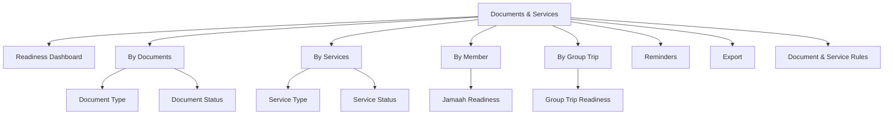
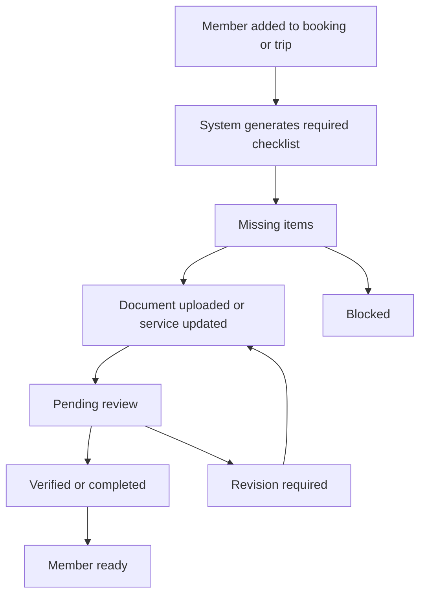
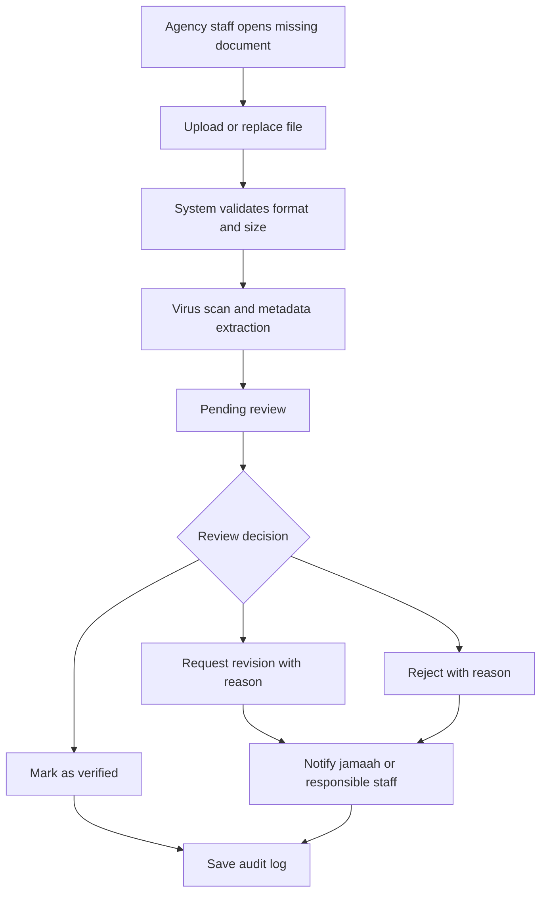
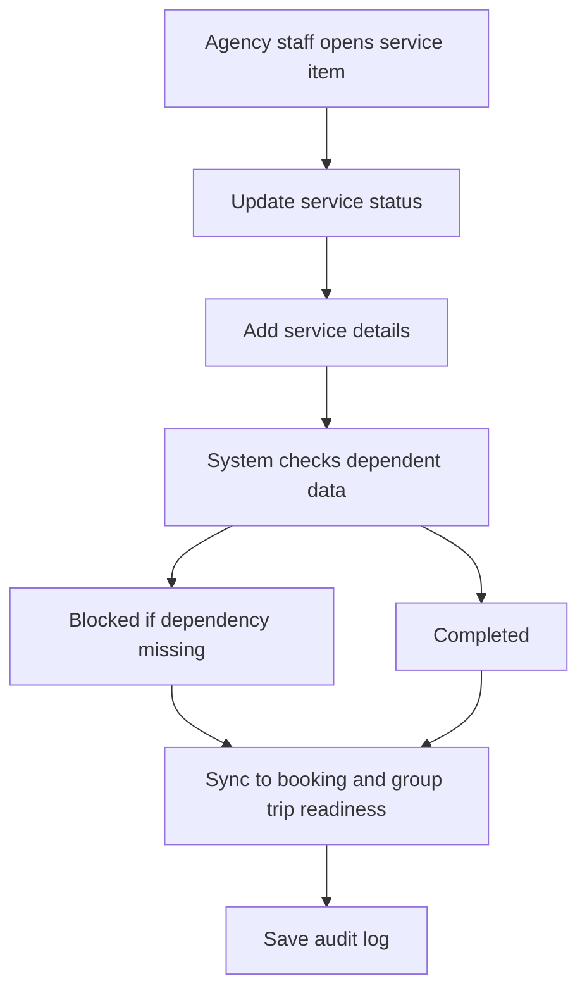
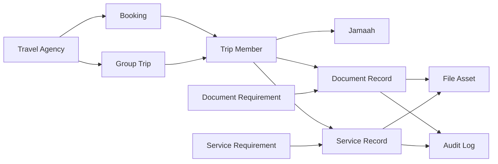

# TA PRD 09 - Documents & Services

| Field | Value |
|---|---|
| Product | UmrahHaji.com Travel Agency Portal - Documents & Services |
| Version | v1.0 |
| Platform | Responsive Web Platform |
| Scope | Travel Agency Portal / Agency Workspace |
| Status | Draft |
| Prepared by | Product / UI/UX Team |
| Last Updated | 9 June 2026 |

---

## 1. Product Summary

Documents & Services is an operational readiness workspace for Travel Agency staff to track whether every jamaah, family/group, booking, and group trip is ready from a document and service perspective.

This module consolidates document completion, travel document upload, service status, room allocation, ticket readiness, visa readiness, vaccination readiness, and reminder actions into one focused workspace.

The module does not replace Jamaah Management or Group Trip Management. It acts as the operational control layer that helps agency teams answer one practical question:

> "Which jamaah or group still needs action before departure?"

## 2. Relationship With Existing PRDs

| Module | Relationship |
|---|---|
| Master PRD - Travel Agency Portal | Defines Documents & Services as a P1 operational readiness module |
| TA PRD 03 - Team & Roles | Defines document permissions and sensitive-data access rules |
| TA PRD 05 - Booking Management | Booking provides the booking source, package, payment status, and early document summary |
| TA PRD 06 - Jamaah Management | Jamaah stores personal profile and reusable identity document data |
| TA PRD 07 - Group Trip Management | Group Trip consumes document and service readiness by trip member |
| TA PRD 08 - Mutawwif Assignment | Mutawwif can view limited readiness when assigned to a trip |
| Admin Panel PRD | Admin can monitor or assist only when platform support or compliance access is required |

## 3. Objective

Allow Travel Agencies to manage and monitor member-level travel readiness by collecting required documents, verifying document status, tracking required services, sending reminders, and identifying blocked departures.

## 4. Goals

1. Give agency staff a single workspace for document and service readiness.
2. Reduce missed documents before departure.
3. Make every required document and service visible by jamaah, family/group, booking, and group trip.
4. Support bulk updates for operational teams.
5. Keep sensitive document access permission-protected.
6. Reduce server load through strict upload size, compression, and storage rules.
7. Sync readiness state with Booking, Jamaah, and Group Trip modules.

## 5. Non-Goals

1. This module does not submit visa applications directly to government systems in Phase 1.
2. This module does not perform live airline, hotel, or train booking in Phase 1.
3. This module does not replace the Jamaah profile.
4. This module does not replace Group Trip member assignment.
5. This module does not manage platform-wide document type master data; default document/service types are managed by platform configuration.
6. This module does not process payments; payment clearance can be displayed as read-only if needed.

## 6. Users and Roles

| Role | Access Level |
|---|---|
| Agency Owner | Full access to all agency documents and service readiness |
| Agency Admin | Manage documents, services, reminders, and bulk actions |
| Operations Staff | Manage operational documents and services if permitted |
| Sales Staff | View limited readiness linked to bookings they handle |
| Finance Staff | View payment-related readiness only, no sensitive identity documents by default |
| Mutawwif | View limited readiness for assigned trip members only |
| Platform Admin | Support access only when permitted and audited |

## 7. Permission Rules

| Permission | Description |
|---|---|
| View Document Readiness | Can view document status without opening files |
| View Sensitive Documents | Can open/download IC, passport, visa, vaccination, and identity files |
| Manage Documents | Can upload, replace, reject, verify, and request revision |
| Manage Services | Can update visa, ticket, room, transport, kit, and other service statuses |
| Bulk Update | Can update multiple records at once |
| Send Reminders | Can send document/service reminder notifications |
| Export Readiness | Can export document and service readiness reports |
| Audit Access | Can view change logs and file access logs |

Rules:

1. Sensitive document files require explicit permission.
2. Users without sensitive document permission can see status but cannot open the file.
3. Download actions must be logged.
4. Rejected documents must require a reason.
5. Bulk status changes must require confirmation.
6. Platform Admin assistance must be visible in audit logs.

## 8. Data Ownership and Scope

Documents & Services follows agency-level data isolation.

| Data | Ownership |
|---|---|
| Jamaah profile documents | Owned by jamaah, managed by agency if invited/assigned |
| Booking documents | Owned by agency booking record |
| Group trip documents | Owned by agency group trip operational record |
| Service readiness | Owned by agency operational workflow |
| Uploaded files | Stored securely outside application server storage |
| Audit logs | Owned by platform and visible based on permission |

Travel Agency users can only access data connected to their own agency.

## 9. Key Definitions

| Term | Definition |
|---|---|
| Document Readiness | Completion and verification state of required travel documents |
| Service Readiness | Operational completion state of required travel services |
| Required Document | A document needed for a package, booking, or trip |
| Optional Document | Supporting document that is useful but does not block departure |
| Required Service | Service that must be completed before trip departure |
| Blocking Item | Missing or rejected document/service that prevents operational readiness |
| Family/Group | A grouped set of jamaah managed together under one booking/trip |
| Readiness Score | Calculated percentage of complete required documents and services |

## 10. Information Architecture

Documents & Services should appear as a dedicated menu in the Travel Agency Portal. It may also be deep-linked from Dashboard, Booking, Jamaah, and Group Trip pages.



## 11. Navigation Entry Points

| Entry Point | Behavior |
|---|---|
| Main menu | Opens Documents & Services dashboard |
| Dashboard pending documents card | Opens filtered list by pending/rejected documents |
| Dashboard service readiness card | Opens filtered list by incomplete services |
| Booking details | Opens readiness filtered to selected booking |
| Jamaah details | Opens readiness filtered to selected jamaah |
| Group Trip details | Opens readiness filtered to selected group trip |

## 12. Readiness Lifecycle

Readiness is calculated from required documents and services. Optional items can improve completeness visibility but must not block readiness unless configured as required.



## 13. Readiness Status Values

| Status | Meaning | Blocks Readiness |
|---|---|---|
| Not Required | Item is not needed for this package/trip | No |
| Missing | Required item has not been provided | Yes |
| Uploaded | File exists but has not been reviewed | Yes |
| Pending Review | Staff must verify the file/status | Yes |
| Need Revision | Submitted item is invalid or incomplete | Yes |
| Verified | Document has been accepted | No |
| Completed | Service has been completed | No |
| Expiring Soon | Document is valid but expiry is near | Warning |
| Expired | Document validity has passed | Yes |
| Waived | Requirement is waived with reason | No, if approved |

## 14. Readiness Calculation

Readiness Score is calculated per jamaah, family/group, booking, and group trip.

```text
Readiness Score = Completed Required Items / Total Required Items x 100
```

Rules:

1. Optional items are excluded from the main readiness score.
2. Waived required items count as complete only when approved by authorized staff.
3. Expired required documents count as incomplete.
4. Expiring Soon documents count as complete with warning.
5. A trip is Ready only if all required members meet the required threshold.
6. Default threshold should be 100% for required items.

## 15. Main Dashboard

The Documents & Services dashboard summarizes agency-wide readiness.

### 15.1 Summary Cards

| Card | Description |
|---|---|
| Total Members Tracked | Number of jamaah included in document/service tracking |
| Ready Members | Members with all required items complete |
| Pending Documents | Required documents missing, pending, rejected, or expired |
| Pending Services | Required services incomplete or blocked |
| Expiring Soon | Documents approaching expiry |
| Critical Departures | Trips departing soon with blocking items |

### 15.2 Recommended Filters

| Filter | Options |
|---|---|
| Group Trip | All trips, selected trip |
| Package | All packages, selected package |
| Booking | Booking ID or customer name |
| Family/Group | All, specific family/group |
| Jamaah | Name, email, phone, passport number |
| Document Status | Missing, Pending Review, Need Revision, Verified, Expired |
| Service Status | Not Started, In Progress, Completed, Blocked |
| Departure Date | All time, next 7 days, next 30 days, custom range |
| Priority | Critical, warning, normal |

### 15.3 Default Sorting

Default sorting should prioritize operational urgency:

1. Trips departing soonest.
2. Blocking items first.
3. Missing or rejected documents.
4. Expired or expiring soon documents.
5. Recently updated items.

## 16. By Documents View

By Documents view shows each member as a row and document types as columns. It is best for seeing which jamaah still lacks travel documents.

### 16.1 Table Columns

| Column | Description |
|---|---|
| Member | Jamaah name, email, phone, family/group marker |
| Booking | Booking reference and package |
| Group Trip | Assigned group trip |
| IC / Identity | Status and file action |
| Passport | Status, expiry, file action |
| Visa | Status, application ID, file action |
| Photo | Status and file action |
| Vaccination | Status and file action |
| Additional Documents | Medical, consent, guardian, or other custom document |
| Readiness | Member document readiness |
| Actions | View, upload, request revision, send reminder |

### 16.2 Document Row Behavior

1. Clicking the status opens document detail.
2. Clicking upload opens the upload modal.
3. Clicking view opens a protected preview if permission allows.
4. Missing required items are highlighted.
5. Expiring documents show warning badge and expiry date.
6. Horizontal scroll is allowed on desktop for wide tables.
7. Mobile view should collapse into member cards grouped by document type.

## 17. By Services View

By Services view shows each member as a row and operational services as columns. It is best for operations staff tracking readiness before departure.

### 17.1 Table Columns

| Column | Description |
|---|---|
| Member | Jamaah name, email, phone, family/group marker |
| Booking | Booking reference and package |
| Group Trip | Assigned group trip |
| Visa Processing | Service status and note |
| Flight E-ticket | Ticket status, class, ticket number |
| Train E-ticket | Ticket status and ticket number |
| Room Configuration | Room type, room number, sharing group |
| Hotel Allocation | Makkah/Madinah hotel allocation |
| Transport | Transport readiness |
| Insurance | Insurance status |
| Umrah Kit | Kit distribution status |
| Briefing | Mutawwif/trip briefing status |
| Readiness | Service readiness score |
| Actions | Update service, bulk update, send reminder |

### 17.2 Service Status Values

| Status | Meaning |
|---|---|
| Not Required | Service does not apply |
| Not Started | Service has not been arranged |
| In Progress | Service is being arranged |
| Pending Confirmation | Waiting for vendor, airline, hotel, or admin confirmation |
| Completed | Service is ready |
| Blocked | Service cannot proceed due to missing data, document, or payment |
| Cancelled | Service was cancelled and should no longer be counted |

## 18. Document Types

Default document types should be configurable by package/trip rules, but Phase 1 should include the following core types.

| Document Type | Required By Default | Source | Notes |
|---|---|---|---|
| IC / Identity Document | Yes for local jamaah | Jamaah profile | Front/back image may be required |
| Passport | Yes | Jamaah profile or booking | Must track expiry date |
| Passport Photo | Yes if required by visa | Jamaah profile or booking | Should follow visa photo guidelines |
| Visa Document | Yes when visa is included | Booking/trip operation | Can include visa application ID |
| Vaccination Certificate | Optional by default, required if package rules require it | Jamaah profile or booking | May depend on destination regulation |
| Flight E-ticket | Yes when flight included | Group Trip service | Can be uploaded per member or batch |
| Train E-ticket | Optional by default | Group Trip service | Required when train transport is included |
| Medical Declaration | Optional | Jamaah profile or booking | Useful for elderly or special needs |
| Guardian Consent | Conditional | Booking | Required for minors if applicable |
| Additional Supporting Document | Optional | Booking/trip | Custom agency-specific document |

### 18.1 Requirement Type Matrix

Each document or service requirement must be classified so readiness logic stays predictable.

| Requirement Type | Meaning | Counts Toward Readiness | Example |
|---|---|---:|---|
| Required | Must be completed for the member/trip | Yes | Passport, visa document, flight e-ticket |
| Optional | Nice to have, does not block readiness | No | Supporting document, extra note |
| Conditional | Required only when a condition is true | Yes when condition applies | Guardian consent for minors, train ticket when train is included |
| Waived | Requirement was removed by authorized user with reason | Counts as complete if approved | Visa waiver, document exception |
| Not Required | Requirement does not apply | No | Train ticket for package without train |

Rules:
- Package and Group Trip should generate the default requirement checklist.
- Agency staff may request a waiver only if they have permission.
- Waived items must store reason, approver, timestamp, and expiry if temporary.
- A requirement cannot be changed from Required to Optional after trip activation without impact review.

## 19. Service Types

Default service types are linked to Package and Group Trip setup.

| Service Type | Required When | Notes |
|---|---|---|
| Visa Processing | Package includes visa service | Can be blocked by missing passport/photo |
| Flight Ticket | Package includes flight | Can be updated per member |
| Train Ticket | Package includes train/inter-city rail | Optional unless selected in package/trip |
| Hotel Allocation | Package includes hotel | Tracks assigned hotel per city |
| Room Configuration | Room pricing/assignment exists | Tracks room type and room number |
| Transport | Package/trip includes transport | Airport, Makkah, Madinah, inter-city |
| Insurance | Package includes insurance | May require policy number |
| Umrah Kit | Agency provides kit | Tracks distributed/not distributed |
| Briefing | Trip requires briefing | Tracks briefing attendance |
| Special Request | Member has dietary, wheelchair, medical, or other request | Can be optional or required |

## 20. Document Upload Rules

Uploads must be controlled to prevent performance and storage issues.

### 20.1 File Type and Size Limits

| Upload Type | Allowed Formats | Max Size | Notes |
|---|---|---:|---|
| Profile image | JPG, JPEG, PNG, WEBP | 2 MB | Compress and crop before upload |
| IC / Identity image | JPG, JPEG, PNG, WEBP, PDF | 3 MB | Prefer image under 2 MB |
| Passport scan | JPG, JPEG, PNG, WEBP, PDF | 5 MB | Must be readable |
| Passport photo | JPG, JPEG, PNG, WEBP | 2 MB | Should be portrait image |
| Visa document | JPG, JPEG, PNG, WEBP, PDF | 5 MB | Store application ID if available |
| Vaccination document | JPG, JPEG, PNG, WEBP, PDF | 5 MB | Must support preview |
| E-ticket flight | PDF, JPG, JPEG, PNG, WEBP | 5 MB | PDF preferred |
| E-ticket train | PDF, JPG, JPEG, PNG, WEBP | 5 MB | PDF preferred |
| Medical/consent document | PDF, JPG, JPEG, PNG, WEBP | 5 MB | Sensitive document |
| Bulk ZIP upload | ZIP | 25 MB | Optional Phase 2 unless needed |

### 20.2 Server Load Rules

1. Image files should be compressed client-side before upload when possible.
2. Files must be uploaded directly to object storage through signed upload URLs.
3. Application server should store metadata only, not raw file blobs.
4. Thumbnails should be generated asynchronously.
5. Preview should use optimized preview URLs, not original files.
6. Large files must not be loaded inside list tables.
7. Files must be virus-scanned before being marked available.
8. Failed uploads should not create completed document records.
9. Duplicate uploads should warn staff before replacing an existing file.
10. Old file versions should be retained only based on retention policy.

### 20.3 Duplicate File and Expiry Rules

1. Duplicate detection should compare filename, size, checksum, document type, member, and booking/trip context.
2. If duplicate is detected, staff can keep existing, replace existing, or upload as new version if permitted.
3. Passport, visa, vaccination, insurance, and other expiry-based documents must store expiry date when available.
4. Expiry warning should be configurable by document type, with default warning at 6 months for passport and 30 days for short-term travel documents.
5. Expired required documents must block readiness unless waived.
6. Document preview must use optimized files; original file download requires explicit permission and audit log.

## 21. Document Review Flow



## 22. Service Update Flow



## 23. Dependency Rules

| Dependency | Rule |
|---|---|
| Visa Processing depends on Passport | Visa cannot be completed if passport is missing or expired |
| Visa Processing depends on Passport Photo | Visa cannot be completed if required photo is missing |
| Flight E-ticket depends on Flight Selection | Ticket service should only appear if package/trip includes flight |
| Train E-ticket depends on Train Selection | Ticket service should only appear if trip includes train |
| Room Configuration depends on Hotel Selection | Room assignment requires selected hotel and room rules |
| Briefing depends on Group Trip Assignment | Briefing service is linked to assigned group trip |
| Insurance depends on package inclusion | Insurance appears only if included in package/service setup |
| Payment Clearance depends on Finance | Payment readiness is read-only and sourced from billing/finance |

## 24. Upload / Update Document Form

| Field | Type | Required | Validation | Notes |
|---|---|---|---|---|
| Member | Read-only selector | Yes | Must belong to agency | Pre-filled from current context |
| Booking | Read-only selector | Conditional | Required for booking-specific document | Pre-filled if opened from booking |
| Group Trip | Read-only selector | Conditional | Required for trip-specific document | Pre-filled if opened from trip |
| Document Type | Dropdown | Yes | Must be allowed for package/trip | Passport, Visa, Photo, etc. |
| Requirement Type | Dropdown | Yes | Required, Optional, Conditional | Defaults from package/trip rules |
| File | Upload | Conditional | Format and size limits apply | Required unless only updating metadata |
| Document Number | Text | Conditional | Max 80 chars | Passport number, visa ID, etc. |
| Issue Date | Date | Optional | Must be valid date | Useful for passport/visa |
| Expiry Date | Date | Conditional | Must be after issue date | Required for passport/visa if available |
| Status | Dropdown | Yes | Valid status only | Missing, Pending, Verified, etc. |
| Review Note | Textarea | Conditional | Required when Need Revision or Rejected | Visible based on visibility setting |
| Visibility | Dropdown | Yes | Internal, Jamaah Visible, Agency Only | Default Agency Only for sensitive data |
| Notify Jamaah | Checkbox | Optional | Boolean | Sends update if allowed |

## 25. Service Update Form

| Field | Type | Required | Validation | Notes |
|---|---|---|---|---|
| Member | Read-only selector | Yes | Must belong to agency | Pre-filled |
| Booking | Read-only selector | Yes | Must belong to agency | Pre-filled |
| Group Trip | Read-only selector | Conditional | Required for trip service | Pre-filled when relevant |
| Service Type | Dropdown | Yes | Must be configured for package/trip | Visa, flight, room, transport, etc. |
| Status | Dropdown | Yes | Valid service status | Not Started, In Progress, Completed, Blocked |
| Service Reference | Text | Optional | Max 100 chars | Ticket number, insurance policy, room number |
| Assigned Vendor | Dropdown/text | Optional | Max 120 chars | Airline, train, hotel, transport vendor |
| Date / Time | Date/time | Optional | Valid date/time | Useful for ticket or appointment |
| Notes | Textarea | Optional | Max 500 chars | Internal operational note |
| Attachment | Upload | Optional | File limits apply | Useful for ticket, voucher, policy |
| Notify Jamaah | Checkbox | Optional | Boolean | Sends service update notification |

## 26. Bulk Status Update Form

| Field | Type | Required | Validation | Notes |
|---|---|---|---|---|
| Selected Members | Multi-select | Yes | At least 1 selected | From current table selection |
| Update Type | Dropdown | Yes | Document or Service | Determines next fields |
| Document/Service Type | Dropdown | Yes | Must apply to selected records | Example Passport, Visa, Flight Ticket |
| New Status | Dropdown | Yes | Valid transition only | Prevent invalid jumps if configured |
| Reason / Note | Textarea | Conditional | Required for rejection, waiver, blocked | Stored in audit log |
| Notify Affected Users | Checkbox | Optional | Boolean | Sends reminder/update |
| Confirmation | Checkbox | Yes | Must confirm | Prevent accidental mass changes |

## 27. Reminder Form

| Field | Type | Required | Validation | Notes |
|---|---|---|---|---|
| Recipient Type | Dropdown | Yes | Jamaah, Family PIC, Internal Staff | Defaults based on context |
| Recipients | Multi-select | Yes | At least 1 | Can include selected members |
| Reminder Reason | Dropdown | Yes | Missing document, rejected document, pending service, expiring soon | Used for template |
| Message | Textarea | Yes | Max 1000 chars | Template can be edited |
| Channel | Checkbox group | Yes | Email, WhatsApp, in-app | Based on notification settings |
| Send Now / Schedule | Radio | Yes | Valid schedule | Phase 1 can support Send Now only |

## 28. Waiver Rules

Waiver allows an agency to mark a required item as not blocking readiness.

Rules:

1. Waiver requires permission.
2. Waiver requires reason.
3. Waiver must be visible in audit log.
4. Waived item should show special badge.
5. Platform Admin may need visibility for compliance-sensitive waivers.
6. Waiver should not be used for expired passport or mandatory legal document unless platform policy allows it.

## 29. Notifications

| Event | Recipient | Channel |
|---|---|---|
| Document requested | Jamaah or Family PIC | Email, WhatsApp, in-app |
| Document rejected | Jamaah or Family PIC | Email, WhatsApp, in-app |
| Document verified | Internal staff, optional jamaah | In-app, optional email |
| Document expiring soon | Agency staff, jamaah | In-app, email, WhatsApp |
| Service completed | Agency staff, jamaah if customer-facing | In-app, optional email |
| Service blocked | Agency operations staff | In-app |
| Trip readiness critical | Agency owner/admin/operations | In-app, email |

Notification messages must avoid exposing sensitive document content.

## 30. Export

Export should help operations teams prepare departure checks.

### 30.1 Export Formats

| Format | Phase | Notes |
|---|---|---|
| CSV | Phase 1 | Good for operations spreadsheet |
| PDF | Phase 1 | Good for management summary |
| XLSX | Phase 2 | Useful for bulk operations |

### 30.2 Export Rules

1. Export must respect role permissions.
2. Sensitive document numbers should be masked unless user has permission.
3. File download links should not be included by default.
4. Export should include generated date, agency name, filters, and user who exported.
5. Export action must be audited.

## 31. Functional Requirements

| ID | Requirement | Priority |
|---|---|---|
| TA-DOC-001 | System must allow agency users to view only documents and services under their own agency. | P0 |
| TA-DOC-002 | System must provide a Documents & Services dashboard with readiness summary. | P0 |
| TA-DOC-003 | System must support filtering by trip, package, booking, jamaah, family/group, document status, service status, and departure date. | P0 |
| TA-DOC-004 | System must provide a By Documents view. | P0 |
| TA-DOC-005 | System must provide a By Services view. | P0 |
| TA-DOC-006 | System must support protected upload, preview, replace, and download actions for documents. | P0 |
| TA-DOC-007 | System must enforce upload format and max-size rules. | P0 |
| TA-DOC-008 | System must store files outside application server storage and keep metadata in the application database. | P0 |
| TA-DOC-009 | System must support document statuses: Missing, Uploaded, Pending Review, Need Revision, Verified, Expiring Soon, Expired, Waived. | P0 |
| TA-DOC-010 | System must support service statuses: Not Required, Not Started, In Progress, Pending Confirmation, Completed, Blocked, Cancelled. | P0 |
| TA-DOC-011 | System must calculate readiness score per member, booking, family/group, and group trip. | P0 |
| TA-DOC-012 | System must sync readiness status with Booking and Group Trip modules. | P0 |
| TA-DOC-013 | System must require a reason when rejecting documents, requesting revision, marking blocked, or waiving requirement. | P0 |
| TA-DOC-014 | System must support reminders for missing, rejected, pending, and expiring documents. | P1 |
| TA-DOC-015 | System must support bulk status update with confirmation. | P1 |
| TA-DOC-016 | System must protect sensitive document file access by permission. | P0 |
| TA-DOC-017 | System must log upload, preview, download, replacement, status change, reminder, export, and waiver actions. | P0 |
| TA-DOC-018 | System must support document expiry date warnings. | P1 |
| TA-DOC-019 | System must support member cards on mobile for wide document/service tables. | P1 |
| TA-DOC-020 | System must support export of readiness report based on user permission. | P1 |
| TA-DOC-021 | System must show blocked dependencies, such as visa blocked by missing passport. | P1 |
| TA-DOC-022 | System must show payment clearance as read-only when used as readiness signal. | P2 |
| TA-DOC-023 | System should support batch e-ticket upload mapping in Phase 2. | P2 |
| TA-DOC-024 | System should support OCR-assisted document metadata extraction in Phase 2. | P2 |

## 32. Business Rules

1. A member can have multiple document records across different booking/trip contexts.
2. Profile-level documents can be reused, but trip-specific documents must keep trip context.
3. A replaced document should not delete the old file immediately if retention policy requires history.
4. Staff cannot mark a missing required document as Verified without a file unless waiver permission is used.
5. Expired documents cannot be marked Verified.
6. Service completion can require supporting attachment if configured.
7. A cancelled member should be excluded from active readiness counts.
8. Group Trip readiness must update when member document or service status changes.
9. Sensitive fields should be masked in list views when permission is limited.
10. Mutawwif users must not download sensitive documents unless explicitly permitted.

## 33. Empty, Loading, and Error States

| State | Behavior |
|---|---|
| Empty dashboard | Show message that no booking or trip members are available yet |
| No filter result | Show reset filters action |
| Upload in progress | Show file name, progress, and cancel option |
| Upload too large | Show max file size and compression suggestion |
| Unsupported format | Show allowed formats |
| Virus scan failed | Block file, show upload failed status, notify staff |
| Permission denied | Show status-only view and explain access is restricted |
| Sync delayed | Show last synced timestamp |
| Export failed | Show retry option and keep filters |

## 34. Responsive Behavior

| Device | Behavior |
|---|---|
| Desktop | Full table with horizontal scroll for many document/service columns |
| Tablet | Condensed table with sticky member column and grouped columns |
| Mobile | Member-card layout grouped by Documents and Services |

Mobile rules:

1. Filters should collapse into filter drawer.
2. Each member card should show readiness score first.
3. Required missing items should appear above optional items.
4. Upload actions should remain reachable but not crowd the card.
5. Sensitive document preview should require permission confirmation.

## 35. Audit Log

Each sensitive or operational action must create audit history.

| Action | Audit Fields |
|---|---|
| Upload file | User, timestamp, member, document type, file metadata |
| Replace file | User, timestamp, old file reference, new file reference |
| Preview file | User, timestamp, file ID |
| Download file | User, timestamp, file ID, IP/device metadata if available |
| Change status | User, old status, new status, reason |
| Send reminder | User, recipient, channel, template, timestamp |
| Bulk update | User, affected record count, new status, reason |
| Export | User, filters, format, timestamp |
| Waive requirement | User, reason, affected item |

## 36. Security and Privacy

1. All document files must use private storage.
2. File access must use expiring signed URLs.
3. Sensitive documents should not be cached publicly.
4. File preview and download must require authentication.
5. Personally identifiable information must be masked based on permission.
6. Upload files must be scanned for malware.
7. Access logs must be retained based on platform policy.
8. User sessions should be checked before file preview/download.
9. Direct file URLs must not expose storage bucket paths.
10. Deleted/archived records should not immediately delete compliance-sensitive files unless retention policy allows it.

## 37. Data Model - Product Level



## 38. Data Fields - Document Record

| Field | Description |
|---|---|
| document_record_id | Unique document record ID |
| agency_id | Owning agency |
| jamaah_id | Linked jamaah |
| booking_id | Linked booking, if applicable |
| group_trip_id | Linked group trip, if applicable |
| document_type | Passport, visa, vaccination, etc. |
| requirement_type | Required, optional, conditional |
| status | Current document status |
| document_number | Passport number, visa ID, etc. |
| issue_date | Issue date if applicable |
| expiry_date | Expiry date if applicable |
| file_asset_id | Linked uploaded file |
| review_note | Reviewer note |
| visibility | Internal, jamaah visible, agency only |
| last_updated_by | User who last updated |
| last_updated_at | Timestamp |

## 39. Data Fields - Service Record

| Field | Description |
|---|---|
| service_record_id | Unique service record ID |
| agency_id | Owning agency |
| jamaah_id | Linked jamaah |
| booking_id | Linked booking |
| group_trip_id | Linked group trip |
| service_type | Visa, flight, room, transport, etc. |
| requirement_type | Required, optional, conditional |
| status | Current service status |
| service_reference | Ticket number, room number, policy number, etc. |
| assigned_vendor | Airline, hotel, transport provider |
| service_datetime | Related date/time |
| attachment_file_id | Optional supporting file |
| notes | Internal notes |
| last_updated_by | User who last updated |
| last_updated_at | Timestamp |

## 40. Acceptance Criteria

1. Agency users can open Documents & Services and only see their own agency records.
2. Dashboard shows document and service readiness summary.
3. By Documents view shows member-level document status by type.
4. By Services view shows member-level service status by type.
5. Upload form enforces allowed formats and max file sizes.
6. Oversized files are blocked before upload when possible.
7. Sensitive document preview/download is permission-protected.
8. Rejection, revision request, blocked status, and waiver require reason.
9. Readiness score updates when document/service status changes.
10. Group Trip readiness receives updated member readiness.
11. Reminder can be sent for selected missing/rejected/pending items.
12. Bulk update requires confirmation and creates audit log.
13. Export respects permissions and masks sensitive data when needed.
14. Mobile layout remains usable without wide-table overflow as primary interaction.

## 41. Recommended Phase Scope

### Phase 1

1. Documents & Services dashboard.
2. By Documents view.
3. By Services view.
4. Document upload, preview, replace, and status update.
5. Service status update.
6. Readiness score.
7. Reminder send now.
8. Export CSV/PDF summary.
9. Audit log.
10. Upload size and format enforcement.

### Phase 2

1. Bulk ZIP upload with member mapping.
2. OCR-assisted document metadata extraction.
3. Advanced document requirement builder.
4. Automated expiry reminder schedule.
5. Vendor/API integration for visa, airline, hotel, or train updates.
6. XLSX export.
7. Customer self-upload portal improvements.

## 42. Open Questions

1. Should Travel Agency staff be allowed to verify passport documents, or should passport verification remain a platform/admin-level action?
2. Should jamaah be able to self-upload all required documents from a customer portal in Phase 1?
3. Should room configuration live primarily in Group Trip, Booking, or Documents & Services?
4. Should payment clearance be included in readiness score or only shown as a separate warning?
5. Should rejected documents notify jamaah automatically, or require staff confirmation first?
6. Should document expiry thresholds be globally configured or agency-configurable?
