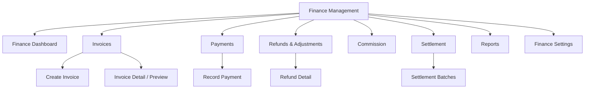
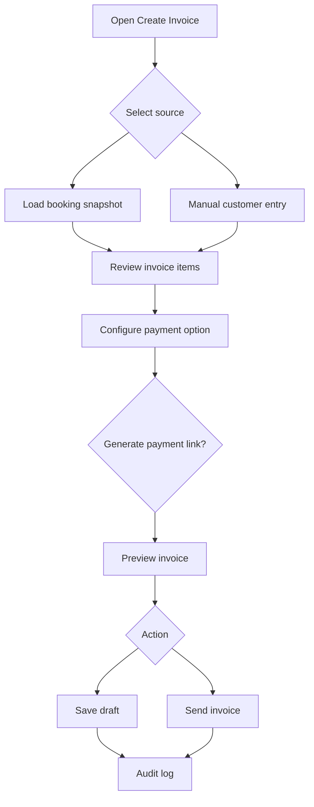
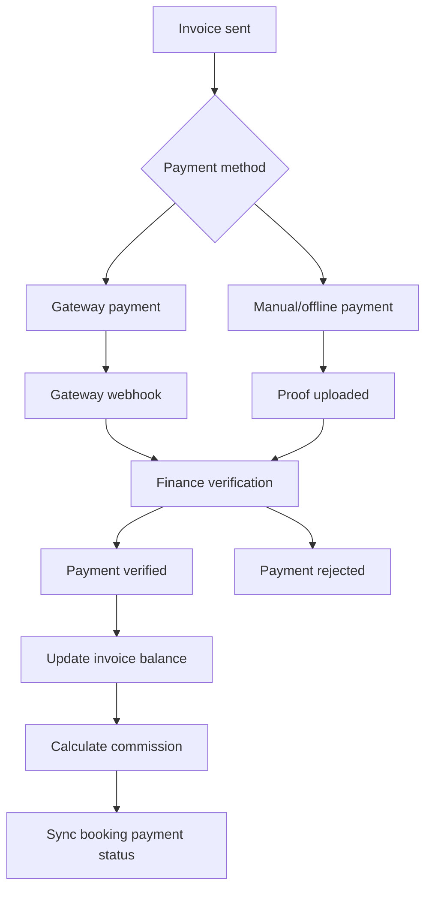
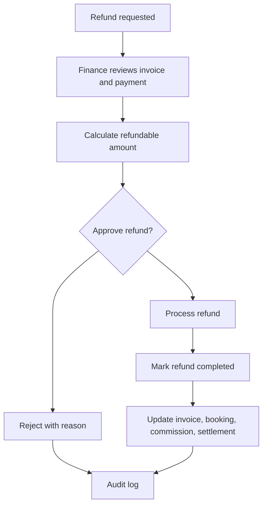
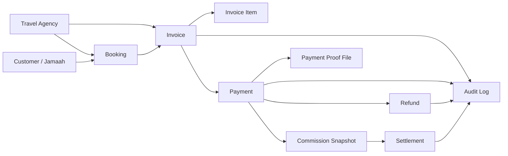

# TA PRD 10 - Finance Management

| Field | Value |
|---|---|
| Product | UmrahHaji.com Travel Agency Portal - Finance Management |
| Version | v1.0 |
| Platform | Responsive Web Platform |
| Scope | Travel Agency Portal / Agency Workspace |
| Status | Draft |
| Prepared by | Product / UI/UX Team |
| Last Updated | 9 June 2026 |

---

## 1. Product Summary

Finance Management allows Travel Agencies to monitor and manage their own invoices, payment collection, outstanding balances, refunds, commission references, settlement preparation, and finance reports.

The module gives Travel Agency finance staff a controlled workspace to answer:

1. Which customer invoices are paid, partial, overdue, or unpaid?
2. Which payments have been received or need verification?
3. Which bookings have outstanding balances before departure?
4. How much commission/platform fee is applied?
5. Which settlements are ready or pending?
6. Which refunds or adjustments need action?

This module is agency-scoped. Travel Agency users cannot see invoices, payments, commissions, refunds, or settlements from other agencies.

## 2. Relationship With Existing PRDs

| Module | Relationship |
|---|---|
| Master PRD - Travel Agency Portal | Defines Finance Management as P0 module for agency commercial operations |
| TA PRD 01 - Dashboard | Displays finance widgets and links to filtered finance pages |
| TA PRD 02 - Agency Profile & Verification Status | Provides bank and settlement information used by finance |
| TA PRD 03 - Team & Roles | Controls finance permissions, export, refund, and settlement visibility |
| TA PRD 04 - Package Management | Provides package price, commission snapshot, tax/service fee, and payment options |
| TA PRD 05 - Booking Management | Creates invoice/payment context and cancellation/refund references |
| TA PRD 06 - Jamaah Management | Shows read-only payment summary when permitted |
| TA PRD 07 - Group Trip Management | Uses payment clearance as operational readiness signal |
| Admin Panel Billing Management | Platform Admin monitors all agencies and platform commission at global level |

## 3. Objective

Allow Travel Agencies to manage their own finance operations from booking invoice generation through payment tracking, refund handling, settlement preparation, and finance reporting while keeping platform commission and audit rules consistent with the Admin Panel.

## 4. Goals

1. Provide a clear invoice and payment workspace for Travel Agencies.
2. Support invoice generation from booking and manual invoice creation when allowed.
3. Track paid, partial, overdue, refunded, and outstanding amounts.
4. Support manual/offline payment recording with proof upload.
5. Display platform commission or platform fee transparently.
6. Show settlement-ready amounts without requiring automated payout in Phase 1.
7. Support refund request and adjustment workflows.
8. Generate finance reports for agency operations.
9. Protect finance data with explicit permissions and audit logs.

## 5. Non-Goals

1. This module does not expose platform-wide finance data.
2. This module does not allow Travel Agency to edit platform commission rules.
3. This module does not execute automated bank payout in Phase 1.
4. This module does not replace Admin Panel Billing Management.
5. This module does not perform full accounting ledger or general ledger accounting in Phase 1.
6. This module does not allow deleting verified payment records.

## 6. Users and Roles

| Role | Access Level |
|---|---|
| Agency Owner | Full finance access, settings, refunds, exports, settlement view |
| Agency Admin | Manage finance if permission is granted |
| Finance Staff | Manage invoices, payments, refunds, reports, and settlement preparation |
| Sales Staff | Create booking invoices and view own booking payment status if permitted |
| Operations Staff | View payment clearance only, no finance management by default |
| Customer Service | View invoice/payment status and send reminders if permitted |
| Auditor | View finance data and audit logs, no mutation |
| Platform Admin | Support and oversight access from Admin Panel only, audited |

## 7. Permission Rules

| Permission | Description |
|---|---|
| View Finance Dashboard | Access finance summary widgets |
| View Invoices | View invoice list and invoice detail |
| Create Invoice | Create booking/manual/add-on invoice |
| Send Invoice | Finalize and send invoice to customer |
| Edit Draft Invoice | Edit invoice before it is sent |
| Void Invoice | Void invoice with reason |
| Record Payment | Record offline/manual payment |
| Verify Payment | Accept or reject payment proof |
| Manage Refunds | Create, review, approve, reject, and mark refund completed |
| View Commission | View platform fee/commission and agency commission references |
| View Settlement | View settlement-ready amount and settlement history |
| Manage Finance Settings | Edit invoice numbering, terms, reminders, tax, and payment methods |
| Export Finance Data | Export finance reports |
| View Audit Log | View finance activity history |

Rules:

1. Finance permissions must be separate from booking and operations permissions.
2. Refund approval should require Agency Owner, Finance Manager, or configured approval role.
3. Sensitive payment proof access must be permission-protected.
4. Finance export should require explicit export permission.
5. Critical finance actions may require recent authentication or MFA if enabled.

## 8. Data Ownership and Scope

| Data | Scope |
|---|---|
| Invoice | Agency-owned |
| Payment record | Agency-owned, linked to invoice/booking/customer |
| Payment proof | Agency-owned, sensitive file |
| Refund request | Agency-owned, platform visible if escalation is needed |
| Commission snapshot | Platform-calculated, agency-visible |
| Settlement record | Platform-generated or agency-visible, based on settlement process |
| Finance settings | Agency-level if configurable, platform-level defaults apply |

Travel Agency users can only see records where `agency_id` matches their agency.

## 9. Key Definitions

| Term | Definition |
|---|---|
| Invoice | Payment request issued to customer/jamaah/family/group |
| Booking Invoice | Invoice generated from a booking price snapshot |
| Manual Invoice | Invoice created manually without a booking source |
| Add-on Invoice | Invoice for additional service after booking |
| Adjustment Invoice | Invoice or credit note for correction, fee, penalty, or discount |
| Payment Record | Payment received through gateway or recorded manually |
| Payment Proof | Uploaded evidence for manual/offline payment |
| Outstanding Balance | Invoice total minus verified payment and approved adjustment |
| Platform Commission | Platform fee/commission calculated from payment or package rule |
| Settlement | Amount prepared to be paid or reconciled to the Travel Agency |
| Refund | Money returned or marked for return to customer |

## 10. Information Architecture



## 11. Navigation Entry Points

| Entry Point | Behavior |
|---|---|
| Finance menu | Opens Finance Dashboard |
| Dashboard finance widget | Opens filtered invoice/payment view |
| Booking details | Opens invoice/payment tab for selected booking |
| Jamaah details | Opens read-only payment summary if permitted |
| Package details | Opens revenue and booking-linked finance summary |
| Group Trip details | Opens payment clearance summary |
| Reports export | Opens finance report by selected filters |

## 12. Finance Dashboard

Finance Dashboard provides a high-level agency finance summary.

### 12.1 Summary Cards

| Card | Description |
|---|---|
| Total Revenue | Total verified collected amount in selected period |
| Invoiced Amount | Total invoice amount issued |
| Collected | Total verified payment amount |
| Outstanding | Total unpaid amount |
| Overdue | Outstanding amount past due date |
| Refund Pending | Refund requests requiring action |
| Platform Commission | Platform commission/fee from verified payments |
| Settlement Ready | Net amount ready for settlement preparation |

### 12.2 Dashboard Rules

1. Values must be filtered by agency.
2. Date range default should be current month.
3. Finance cards are hidden for users without finance permission.
4. Outstanding and overdue should exclude voided invoices.
5. Refunded amount should adjust revenue and commission where applicable.
6. Settlement Ready should only show if settlement view permission is granted.

## 13. Invoice Management

Invoice Management allows agency finance staff to create, send, view, print, download, void, and track invoices.

### 13.1 Invoice Types

| Invoice Type | Description |
|---|---|
| Booking Invoice | Generated from booking package, participants, room, add-ons, tax, and fees |
| Manual Invoice | Created manually for a customer or organization |
| Add-on Invoice | Created for extra service after booking |
| Adjustment Invoice | Created for correction, penalty, late fee, or extra charge |
| Credit Note | Negative adjustment used to reduce payable amount |

### 13.2 Invoice List Columns

| Column | Description |
|---|---|
| Invoice Number | Unique invoice reference |
| Customer / Jamaah | Customer, family/group, or booking owner |
| Booking / Package | Linked booking/package if available |
| Group Trip | Linked group trip if available |
| Invoice Total | Total invoice amount |
| Paid Amount | Verified payment amount |
| Outstanding | Remaining balance |
| Payment Type | Full, deposit, installment, manual |
| Due Date | Invoice or installment due date |
| Status | Draft, Sent, Partial, Paid, Overdue, Void, Refunded |
| Commission | Platform fee/commission snapshot |
| Actions | View, send, record payment, reminder, void, refund |

### 13.3 Invoice Status

| Status | Meaning |
|---|---|
| Draft | Invoice editable and not sent |
| Sent / Open | Invoice finalized and payable |
| Partially Paid | Some payment verified but balance remains |
| Paid | Outstanding balance is zero |
| Overdue | Balance remains after due date |
| Void | Invoice cancelled and no longer payable |
| Refunded | Fully refunded |
| Partially Refunded | Partially refunded |
| Uncollectible | Marked unlikely to be collected |

## 14. Create Invoice Flow



Rules:

1. Booking invoices must use booking price snapshot.
2. Sent invoices should not be edited silently.
3. Corrections after sending should use revision, void, adjustment, or credit note.
4. Invoice number must be unique per agency or platform configuration.
5. Invoice can be saved as draft before sending.
6. Payment link can be generated only for payable invoice.

### 14.1 Invoice Locking and Versioning Rules

| Invoice State | Editable Fields | Correction Method |
|---|---|---|
| Draft | All fields except generated audit fields | Direct edit |
| Sent / Open | Notes, reminders, payment link only | Revision, adjustment invoice, credit note, or void |
| Partially Paid | Notes, reminders, payment link only | Adjustment invoice, credit note, refund, or additional invoice |
| Paid | Read-only except receipt/notes | Credit note, refund, or reversal |
| Void | Read-only | Create new invoice if needed |

Rules:
- Sent, partially paid, paid, void, and refunded invoices must keep immutable invoice history.
- Invoice PDF/download must preserve the version shown to the customer at send time.
- Any financial correction must store reason, actor, timestamp, and affected amount.
- Customer-visible changes must trigger notification preview before sending.

## 15. Create Invoice Form

### 15.1 Invoice Details

| Field | Type | Required | Validation | Notes |
|---|---|---|---|---|
| Invoice Number | System/Text | Yes | Unique | Auto-generated by default |
| Source Type | Dropdown | Yes | Booking, Manual, Add-on, Adjustment | Determines item source |
| Travel Agency | Read-only | Yes | Current agency | Cannot be changed |
| Customer / Jamaah | Search/select | Yes | Must belong to agency context or manual entry | Supports family/group |
| Booking | Search/select | Conditional | Required for booking invoice | Loads booking snapshot |
| Package | Read-only/select | Conditional | Required if linked to booking/package | From booking/package |
| Currency | Dropdown | Yes | Supported currency | Default MYR |
| Issue Date | Date | Yes | Valid date | Defaults today |
| Due Date | Date | Yes | After issue date | From payment terms |
| Status | Dropdown | Yes | Draft, Sent/Open | Draft default |

### 15.2 Invoice Items

| Field | Type | Required | Validation | Notes |
|---|---|---|---|---|
| Item Type | Dropdown | Yes | Package, Add-on, Service, Fee, Discount, Custom | Determines source |
| Source | Dropdown/Text | Conditional | Existing item or manual | Optional for custom |
| Description | Text | Yes | Max 200 chars | Customer-visible |
| Quantity | Number | Yes | > 0 | Decimal allowed if configured |
| Unit Price | Currency | Yes | >= 0 except credit note | Currency based |
| Taxable | Toggle | Optional | Boolean | Uses tax setting |
| Total | System | Yes | Quantity x unit price | Read-only |

### 15.3 Invoice Summary

| Field | Type | Required | Validation | Notes |
|---|---|---|---|---|
| Subtotal | System | Yes | Sum of items | Read-only |
| Discount Type | Dropdown | Optional | Amount or percentage | Permission-based |
| Discount Amount | Currency/number | Optional | Cannot exceed subtotal | Audit if edited |
| Tax / SST | Toggle + number | Optional | Configured rate | Defaults from setting |
| Service Fee | Currency | Optional | >= 0 | May be platform or agency fee |
| Invoice Total | System | Yes | >= 0 | Read-only |
| Amount Due Now | System | Yes | Based on payment option | Read-only |

## 16. Payment Options

| Payment Type | Description |
|---|---|
| Full Payment | Customer pays full invoice amount |
| Deposit | Customer pays deposit first and balance later |
| Installment | Customer pays scheduled installments |
| Manual Payment | Staff records offline payment |
| Subscription | Recurring billing, optional and likely Phase 2 for TA portal |

Rules:

1. Payment type can be configured per package and overridden on invoice if permitted.
2. Deposit can be fixed amount or percentage.
3. Installment schedule must total invoice amount.
4. Payment due dates must not exceed departure constraints if booking-linked.
5. Overdue status is based on unpaid amount past due date.

## 17. Payment Management

Payment Management tracks gateway payments and manual/offline payments.

### 17.1 Payment List Columns

| Column | Description |
|---|---|
| Payment ID | Unique payment reference |
| Invoice | Linked invoice |
| Customer / Jamaah | Payer/customer |
| Booking / Package | Linked booking/package |
| Amount | Payment amount |
| Method | Bank transfer, FPX, e-wallet, card, cash, cheque, gateway |
| Reference | Gateway or manual reference |
| Verification Status | Pending, Verified, Rejected, Reversed |
| Payment Date | Date/time of payment |
| Proof | View proof if permitted |
| Actions | Verify, reject, view, receipt |

### 17.2 Payment Status

| Status | Meaning |
|---|---|
| Pending | Payment initiated or proof uploaded |
| Processing | Gateway/webhook verification pending |
| Verified | Payment accepted and applied to invoice |
| Rejected | Payment proof or gateway response rejected |
| Reversed | Payment reversed, chargeback, or correction |
| Refunded | Payment refunded |

## 18. Record Manual Payment Form

| Field | Type | Required | Validation | Notes |
|---|---|---|---|---|
| Invoice | Read-only | Yes | Existing invoice | From row action |
| Customer | Read-only | Yes | Linked customer | From invoice |
| Payment Date | Date/time | Yes | Cannot be future unless configured | Required |
| Payment Amount | Currency | Yes | > 0 and <= outstanding unless overpayment allowed | Required |
| Payment Method | Dropdown | Yes | Bank transfer, cash, cheque, e-wallet, card, manual | Required |
| Payment Reference | Text | Conditional | Max 100 chars | Required for bank/gateway |
| Received Bank Account | Dropdown | Conditional | Agency bank account | Optional Phase 1 |
| Payment Proof | Upload | Conditional | File rules apply | Required for bank transfer unless waived |
| Verification Status | Dropdown | Yes | Pending, Verified | Usually pending by default |
| Internal Note | Textarea | Optional | Max 500 chars | Audit visible |
| Notify Customer | Checkbox | Optional | Boolean | Sends receipt/update |

### 18.1 Payment Proof Upload Policy

| Upload Type | Allowed Formats | Max Size | Notes |
|---|---|---:|---|
| Payment proof image | JPG, JPEG, PNG, WEBP | 2 MB | Compress preview before upload |
| Payment proof PDF | PDF | 5 MB | Store original and preview if possible |
| Receipt attachment | PDF, JPG, JPEG, PNG, WEBP | 5 MB | Optional |

Server rules:

1. Uploads must use signed upload URLs and private storage.
2. Application server should store file metadata only.
3. Proof preview should be thumbnail/optimized preview.
4. Large original files should not load in payment tables.
5. Payment proof access must be logged.

## 19. Payment Link

Payment Link allows agency staff to share a secure payable link with customer/jamaah.

### 19.1 Payment Link Status

| Status | Meaning |
|---|---|
| Not Generated | No link exists |
| Generated | Link created but not sent |
| Sent | Link sent to customer |
| Opened | Customer opened payment page |
| Paid | Payment completed |
| Expired | Link expired |
| Cancelled | Link revoked |

Rules:

1. Payment link must reference invoice and payment reference.
2. Payment link should expire based on setting, recommended 24 to 72 hours.
3. Payment link amount should match Amount Due Now, not necessarily full invoice total.
4. Expired payment links can be regenerated if invoice is still payable.
5. Payment link activity should be logged.

## 20. Payment Flow



## 21. Commission and Platform Fee

Finance Management should display commission information transparently without allowing Travel Agency users to edit platform rules.

### 21.1 Commission Sources

| Source | Description |
|---|---|
| Package Commission | Commission configured in Package Management |
| Booking Commission Snapshot | Commission stored when booking is created |
| Invoice Commission Snapshot | Commission stored when invoice is issued |
| Platform Fee Rule | Platform fee based on percentage, fixed amount, or hybrid |
| Manual Adjustment | Admin-approved adjustment or correction |

### 21.2 Commission Calculation

```text
Gross Verified Payment
- Refund Amount
- Non-commissionable Items
= Commissionable Amount

Commissionable Amount x Commission Rate
or Fixed Commission Amount
= Platform Commission
```

### 21.3 Commission Status

| Status | Meaning |
|---|---|
| Pending | Invoice/payment not verified |
| Earned | Payment verified and commission recognized |
| Adjusted | Manual correction applied |
| Reversed | Payment refunded, voided, or reversed |
| Settled | Included in settlement/reconciliation |

Rules:

1. Commission rule changes should not alter historical snapshots.
2. Refund must reverse or adjust commission.
3. Agency can view commission but cannot edit platform commission rule.
4. Commission details should be visible only to permitted finance users.

## 22. Settlement Management

Settlement Management shows agency-level payout/reconciliation preparation.

Terminology:
- Settlement means the reconciliation amount expected between platform and Travel Agency.
- Payout means actual money disbursement.
- Disbursement means bank/gateway transfer execution.
- Phase 1 supports settlement preparation and manual confirmation, not automated payout/disbursement.

### 22.1 Phase 1 Settlement Approach

Phase 1 should support settlement preparation and manual confirmation:

1. System calculates settlement-ready amounts.
2. Finance staff can view settlement breakdown.
3. Platform/Admin Finance can mark settlement as prepared, pending, or completed.
4. Actual payout transfer can be performed manually outside the system.
5. Settlement record, proof, and reference are stored for audit.

This is the best Phase 1 solution because it gives operational clarity without forcing bank payout automation too early.

### 22.2 Phase 2 Settlement Approach

Phase 2 can introduce payout automation:

1. Payment gateway payout integration.
2. Bank transfer API integration.
3. Automated payout schedule.
4. Settlement reconciliation.
5. Failed payout retry.
6. Multi-currency settlement if needed.

### 22.3 Settlement Status

| Status | Meaning |
|---|---|
| Not Ready | Payment or bank data incomplete |
| Pending Calculation | Settlement amount is being calculated |
| Ready | Amount ready for settlement preparation |
| Prepared | Platform finance prepared payout/reconciliation |
| Processing | Payout/reconciliation in progress |
| Completed | Settlement completed |
| Failed | Settlement failed and needs action |
| On Hold | Settlement held due to compliance, refund, dispute, or missing bank data |

### 22.4 Settlement Data

| Field | Description |
|---|---|
| Settlement ID | Unique reference |
| Period | Settlement period |
| Gross Collected | Verified payments included |
| Refunds | Refund amount deducted |
| Platform Commission | Platform fee/commission deducted |
| Adjustments | Manual adjustments |
| Net Settlement | Amount expected for agency |
| Bank Account | Verified bank account reference |
| Status | Settlement status |
| Settlement Proof | Receipt/reference if completed |
| Notes | Internal finance notes |

## 23. Refund and Adjustment

Refunds are linked to invoice, payment, booking, and customer.

### 23.1 Refund Rules

1. Refund cannot exceed verified paid amount.
2. Refund requires reason.
3. Refund should adjust invoice, booking, payment, commission, and settlement.
4. Refund approval requires finance permission.
5. Refund completion can be manual in Phase 1.
6. Refund does not automatically remove jamaah from booking or group trip.
7. Cancellation-related refund should reference Booking cancellation workflow.

### 23.1.1 Adjustment, Credit Note, and Overpayment Rules

| Case | Recommended Handling | Notes |
|---|---|---|
| Customer underpaid | Keep invoice Partial / Overdue | Send reminder or create installment schedule |
| Customer overpaid | Record overpayment balance | Apply to future invoice or refund with approval |
| Price increase after invoice sent | Create adjustment invoice | Do not edit original invoice silently |
| Price decrease after invoice sent | Create credit note | Credit note reduces outstanding or creates refundable balance |
| Package cancellation | Follow booking cancellation and refund review | Finance does not remove trip/member assignment automatically |
| Manual payment error | Reverse payment record with reason | Do not delete payment record |

Rules:
- Overpayment must be visible in customer account and finance report.
- Credit note cannot exceed eligible invoice balance unless refund approval exists.
- Adjustment and credit note must affect commission and settlement calculation.

### 23.2 Refund Status

| Status | Meaning |
|---|---|
| Requested | Refund request created |
| Under Review | Finance review in progress |
| Approved | Refund approved |
| Rejected | Refund rejected with reason |
| Processing | Refund being processed |
| Completed | Refund completed |
| Cancelled | Refund request cancelled |

### 23.3 Refund Flow



## 24. Finance Reports

Finance Reports help Travel Agencies review revenue, collection, outstanding, refund, commission, and settlement performance.

### 24.1 Report Types

| Report | Description |
|---|---|
| Revenue Report | Invoiced and collected revenue by period |
| Collection Report | Payment collection performance |
| Outstanding Aging | Unpaid invoices grouped by due age |
| Package Revenue | Revenue by package |
| Group Trip Revenue | Revenue by group trip |
| Payment Method Distribution | Revenue by payment method |
| Refund Report | Refund requests and completed refunds |
| Commission Report | Platform commission/fee breakdown |
| Settlement Report | Settlement-ready and completed amounts |

### 24.2 Report Filters

| Filter | Options |
|---|---|
| Date Range | Today, this week, this month, last 12 months, custom |
| Package | All, selected package |
| Group Trip | All, selected trip |
| Payment Status | Paid, partial, overdue, refunded |
| Invoice Status | Draft, sent, paid, overdue, void |
| Payment Method | Bank, FPX, e-wallet, card, cash, cheque |
| Customer Type | Individual, family/group, corporate if supported |

## 25. Finance Settings

Finance settings are agency-level where allowed, with platform defaults as fallback.

### 25.1 Payment Configuration

| Field | Type | Required | Notes |
|---|---|---|---|
| Default Payment Terms | Number | Yes | Example 7, 14, 30, 60 days |
| Default Deposit Type | Dropdown | Optional | Amount or percentage |
| Default Deposit Amount | Currency/number | Optional | Based on deposit type |
| Reminder Schedule | Text/list | Optional | Example 7, 3, 1 days before due |
| Accepted Payment Methods | Multi-select | Yes | Based on agency/platform gateway |

### 25.2 Invoice Configuration

| Field | Type | Required | Notes |
|---|---|---|---|
| Invoice Prefix | Text | Yes | Example INV, STU-INV |
| Next Invoice Number | Number/read-only | Yes | Permission-based |
| Show Item Codes | Toggle | Optional | Useful for accounting |
| Default Notes | Textarea | Optional | Customer-visible |
| Default Terms & Conditions | Textarea | Optional | Customer-visible |
| Invoice Footer | Textarea | Optional | Optional |

### 25.3 Tax and Currency

| Field | Type | Required | Notes |
|---|---|---|---|
| Default Currency | Dropdown | Yes | Default MYR |
| Tax/SST Rate | Number | Optional | Example 6 percent |
| Include Tax in Displayed Prices | Toggle | Optional | Pricing display rule |
| Tax Registration Number | Text | Optional | Agency tax ID |

### 25.4 Notification Settings

| Field | Type | Required | Notes |
|---|---|---|---|
| Finance CC Emails | Email list | Optional | Agency finance recipients |
| Send Invoice Emails | Toggle | Optional | Auto-send invoice email |
| Send Payment Reminders | Toggle | Optional | Reminder automation |
| Send Receipt Emails | Toggle | Optional | Receipt after payment |
| WhatsApp Reminder | Toggle | Optional | If WhatsApp integration enabled |

## 26. Notifications

| Event | Recipient | Channel |
|---|---|---|
| Invoice sent | Customer/Jamaah, agency finance | Email, in-app |
| Payment link generated | Customer/Jamaah | Email, WhatsApp if enabled |
| Payment received | Customer/Jamaah, agency finance | Email, in-app |
| Payment proof rejected | Customer/Jamaah, agency finance | Email, in-app |
| Payment overdue | Customer/Jamaah, agency finance | Email, WhatsApp, in-app |
| Refund requested | Agency finance/owner | In-app, email |
| Refund completed | Customer/Jamaah, agency finance | Email, in-app |
| Settlement prepared | Agency finance/owner | In-app, email |
| Settlement completed | Agency finance/owner | In-app, email |

## 27. Audit Log

Finance actions must be auditable.

| Action | Audit Fields |
|---|---|
| Invoice created | User, timestamp, source, total |
| Invoice edited | User, timestamp, changed fields |
| Invoice sent | User, timestamp, recipient |
| Invoice voided | User, timestamp, reason |
| Payment link generated | User, timestamp, link reference |
| Payment recorded | User, timestamp, amount, method |
| Payment verified/rejected | User, timestamp, reason |
| Payment proof viewed/downloaded | User, timestamp, file ID |
| Refund requested/approved/rejected/completed | User, timestamp, amount, reason |
| Commission adjusted | User, timestamp, old/new amount, reason |
| Settlement status updated | User, timestamp, status |
| Finance settings changed | User, timestamp, changed fields |
| Export generated | User, timestamp, filters, format |

## 28. Security and Privacy

1. Finance data must be agency-isolated.
2. Payment proof files must be private and permission-protected.
3. Payment records cannot be hard-deleted after verification.
4. Sensitive bank and settlement data require explicit permission.
5. Export must mask sensitive data when the user lacks permission.
6. Critical finance actions should require recent authentication or MFA if enabled.
7. Payment link must use secure token and expiry.
8. Webhook events must be verified before updating payment records.
9. Manual payment must require proof or approved waiver.
10. All finance mutations must be logged.

## 29. Empty, Loading, and Error States

| State | Behavior |
|---|---|
| No invoices | Show create invoice action if permitted |
| No payments | Show empty payment list and link to invoices |
| No permission | Hide finance details or show permission message |
| Payment proof too large | Reject upload and show max size |
| Gateway webhook delayed | Show Processing status |
| Payment link expired | Allow regenerate if invoice payable |
| Duplicate payment reference | Warn finance staff |
| Refund exceeds paid amount | Block and show max refundable amount |
| Settlement on hold | Show hold reason |
| Export failed | Keep filters and allow retry |

## 30. Responsive Behavior

| Device | Behavior |
|---|---|
| Desktop | Full dashboard, tables, two-column create invoice layout |
| Tablet | Condensed tables, settings cards stack when needed |
| Mobile | Finance list becomes stacked cards; create invoice uses stepper |

Mobile rules:

1. Finance summary cards should appear before lists.
2. Table actions should move into action menu.
3. Invoice preview should open full-screen.
4. Payment proof preview should not auto-load large files.
5. Critical buttons such as Send Invoice and Record Payment should remain reachable.

## 31. Functional Requirements

| ID | Requirement | Priority |
|---|---|---|
| TA-FIN-001 | System must show only finance records owned by the current agency. | P0 |
| TA-FIN-002 | System must provide finance dashboard summary cards. | P0 |
| TA-FIN-003 | System must provide invoice list with search, filters, sorting, and pagination. | P0 |
| TA-FIN-004 | System must allow creating invoice from booking snapshot. | P0 |
| TA-FIN-005 | System must allow manual invoice creation if permission is granted. | P1 |
| TA-FIN-006 | System must support invoice statuses: Draft, Sent/Open, Partially Paid, Paid, Overdue, Void, Refunded, Partially Refunded, Uncollectible. | P0 |
| TA-FIN-007 | System must support payment types: Full Payment, Deposit, Installment, Manual Payment. | P0 |
| TA-FIN-008 | System must generate secure payment link if payment gateway is enabled. | P1 |
| TA-FIN-009 | System must allow manual payment recording with proof upload and audit trail. | P0 |
| TA-FIN-010 | System must enforce payment proof upload limits and private storage. | P0 |
| TA-FIN-011 | System must allow payment verification and rejection with reason. | P0 |
| TA-FIN-012 | System must update invoice balance after verified payment. | P0 |
| TA-FIN-013 | System must sync booking payment status after invoice/payment changes. | P0 |
| TA-FIN-014 | System must calculate platform commission/fee from payment or invoice snapshot. | P0 |
| TA-FIN-015 | System must prevent Travel Agency users from editing platform commission rules. | P0 |
| TA-FIN-016 | System must support refund request and refund status tracking. | P0 |
| TA-FIN-017 | System must reverse or adjust commission when refund is completed. | P0 |
| TA-FIN-018 | System must provide settlement-ready view for permitted users. | P1 |
| TA-FIN-019 | System must support manual settlement confirmation in Phase 1. | P1 |
| TA-FIN-020 | System must provide finance reports and exports based on permission. | P1 |
| TA-FIN-021 | System must provide finance settings for invoice, payment terms, tax, and notifications. | P1 |
| TA-FIN-022 | System must log all finance mutations and sensitive file access. | P0 |
| TA-FIN-023 | System should support automated payout/settlement integration in Phase 2. | P2 |
| TA-FIN-024 | System should support accounting export or integration in Phase 2. | P2 |

## 32. Business Rules

1. Invoice total must be calculated from item lines, discount, tax, service fee, and adjustment.
2. Booking invoice must preserve price snapshot.
3. Paid invoice cannot be edited directly.
4. Voided invoice cannot accept payment.
5. Payment cannot exceed outstanding balance unless overpayment is explicitly allowed.
6. Verified payment cannot be deleted.
7. Refund cannot exceed paid amount.
8. Refund completion must update invoice, booking, commission, and settlement.
9. Platform commission must be calculated from snapshot, not from latest package rule.
10. Settlement cannot be marked complete if agency bank data is missing or unverified unless manual override is approved.
11. Manual payment proof may be waived only by authorized finance user with reason.
12. Finance data export must respect permission and agency scope.

## 33. Data Model - Product Level



## 34. Acceptance Criteria

1. Agency users only see their own invoices, payments, refunds, commissions, and settlements.
2. Finance dashboard shows revenue, collected, outstanding, overdue, refund, commission, and settlement summaries.
3. Invoice can be generated from booking snapshot.
4. Manual invoice can be created only by permitted users.
5. Sent invoice cannot be silently edited.
6. Payment can be recorded manually with proof upload.
7. Payment proof upload enforces format and size limits.
8. Verified payment updates invoice balance and booking payment status.
9. Refund request requires reason and cannot exceed paid amount.
10. Completed refund adjusts invoice, booking, commission, and settlement.
11. Platform commission is visible but not editable by Travel Agency users.
12. Settlement-ready view exists for permitted users.
13. Phase 1 settlement can be manually confirmed with audit trail.
14. Finance reports can be exported only by users with export permission.
15. All finance actions are logged.

## 35. Recommended Phase Scope

### Phase 1

1. Finance dashboard.
2. Invoice list and invoice detail.
3. Create invoice from booking.
4. Manual invoice creation if allowed.
5. Manual payment recording with proof upload.
6. Payment verification.
7. Payment reminder.
8. Refund request and status tracking.
9. Platform commission visibility.
10. Settlement-ready view and manual settlement confirmation.
11. Finance reports and CSV/PDF export.
12. Finance settings.

### Phase 2

1. Automated payout/settlement.
2. Bank transfer API or gateway payout integration.
3. Accounting integration.
4. Automated reconciliation.
5. Advanced installment automation.
6. Multi-currency settlement.
7. Chargeback/dispute automation.
8. XLSX export and accounting-ready report templates.

## 36. Open Questions

1. Should Travel Agency be allowed to create manual invoice in Phase 1, or only booking-generated invoice?
2. Should payment verification be required for all manual payments or only bank transfer/cheque?
3. Should settlement approval remain Admin Panel only, or can Travel Agency confirm receipt from their portal?
4. Should invoice number sequence be agency-specific or platform-wide?
5. Should tax/SST settings be agency-editable or platform-controlled?
6. Should customer payment page be part of Phase 1 or only invoice/payment link sharing?
7. Should Finance Staff require MFA before refund and settlement actions?
