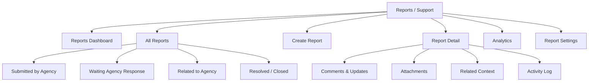
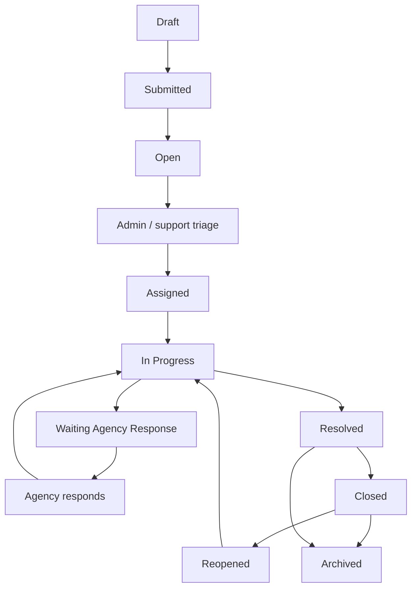
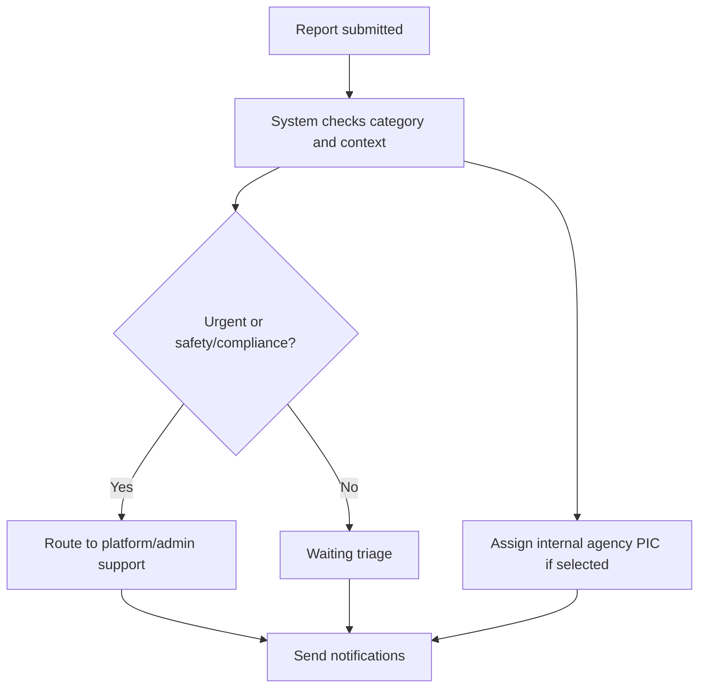
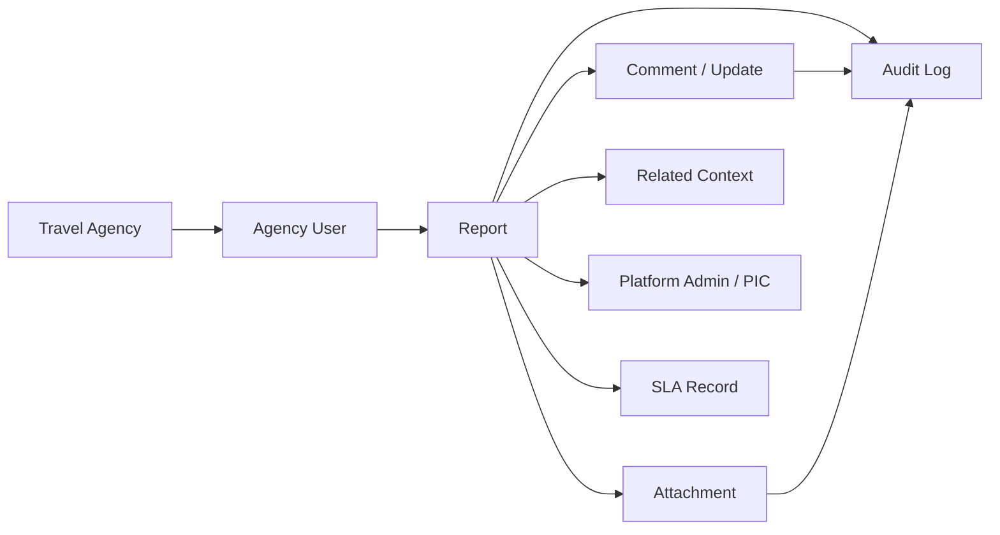

# TA PRD 11 - Reports / Support

| Field | Value |
|---|---|
| Product | UmrahHaji.com Travel Agency Portal - Reports / Support |
| Version | v1.0 |
| Platform | Responsive Web Platform |
| Scope | Travel Agency Portal / Agency Workspace |
| Status | Draft |
| Prepared by | Product / UI/UX Team |
| Last Updated | 9 June 2026 |

---

## 1. Product Summary

Reports / Support is a lightweight ticketing workspace for Travel Agencies to submit issues, track support cases, respond to platform/admin requests, and manage agency-related operational reports.

The module should cover many real cases without becoming too complex:

1. Travel Agency reports platform issue.
2. Travel Agency reports payment/document/service issue.
3. Travel Agency reports jamaah-related operational issue.
4. Travel Agency reports mutawwif-related issue.
5. Platform Admin requests agency clarification.
6. A jamaah/customer report is related to the Travel Agency and requires response.

Reports / Support is not a chat app. It is a structured issue record with status, category, priority, related context, attachments, comments, resolution, and audit trail.

## 2. Relationship With Existing PRDs

| Module | Relationship |
|---|---|
| Master PRD - Travel Agency Portal | Defines Reports / Support as P0 module |
| TA PRD 01 - Dashboard | Shows open, urgent, and waiting-response report summary |
| TA PRD 02 - Agency Profile & Verification Status | Provides agency identity and PIC contact data |
| TA PRD 03 - Team & Roles | Controls report permissions and internal assignment |
| TA PRD 04 - Package Management | Package can become report context |
| TA PRD 05 - Booking Management | Booking issue can be escalated into report |
| TA PRD 06 - Jamaah Management | Jamaah can be sender, reported party, or related person |
| TA PRD 07 - Group Trip Management | Group trip can be related context |
| TA PRD 08 - Mutawwif Assignment | Mutawwif issue can be reported or linked |
| TA PRD 09 - Documents & Services | Document/service issue can become report |
| TA PRD 10 - Finance Management | Payment, refund, commission, settlement issue can become report |
| Admin Panel Report Management | Platform Admin manages cross-platform triage, assignment, escalation, and resolution |

## 3. Objective

Allow Travel Agencies to submit, monitor, and respond to agency-related reports/support cases while keeping visibility, status flow, category, evidence, and resolution synchronized with Admin Panel Report Management.

## 4. Goals

1. Provide a simple support case workspace for Travel Agencies.
2. Allow agency staff to submit structured reports with evidence.
3. Support cases related to jamaah, mutawwif, booking, package, group trip, document, payment, compliance, and platform issues.
4. Allow agency users to respond when Admin requests clarification.
5. Allow internal agency assignment for follow-up.
6. Show report status and SLA expectations clearly.
7. Protect sensitive report data and attachments.
8. Keep audit trail for all report changes.

## 5. Non-Goals

1. This module does not replace Admin Panel Report Management.
2. This module does not expose reports from other agencies.
3. This module does not allow Travel Agency to assign Platform Admin PIC directly.
4. This module does not replace real-time chat in Phase 1.
5. This module does not create legal dispute workflows or formal claims processing in Phase 1.
6. This module does not automatically refund, suspend, or penalize users based only on a report.

## 6. Users and Roles

| Role | Access Level |
|---|---|
| Agency Owner | Full access to agency-related reports and escalation actions |
| Agency Admin | Manage reports if permission is granted |
| Operations Staff | Submit and handle operations, trip, document, mutawwif, and service reports |
| Sales / Booking Staff | Submit and view booking/customer-related reports |
| Finance Staff | Submit and handle payment, refund, commission, and settlement reports |
| Customer Service | Manage customer-facing support responses |
| Auditor | View reports and audit trail, no mutation |
| Platform Admin | Handles platform-side triage from Admin Panel |

## 7. Permission Rules

| Permission | Description |
|---|---|
| View Reports | View accessible agency-related reports |
| Create Report | Submit new report |
| Edit Own Draft Report | Edit report before submission |
| Add Comment | Add response/comment to report thread |
| Upload Attachment | Upload evidence files |
| View Sensitive Attachment | Open/download protected attachments |
| Assign Internal PIC | Assign report to agency staff |
| Update Agency Status | Update internal handling status |
| Mark Agency Response Complete | Mark that agency has responded to Admin request |
| Reopen Report | Reopen eligible resolved/closed report |
| Archive Report | Archive from agency active view |
| Export Reports | Export report list/summary |
| View Audit Log | View report activity history |

Rules:

1. Platform Admin assignment is controlled from Admin Panel.
2. Travel Agency can assign only internal agency PIC for its own follow-up.
3. Sensitive attachments require explicit permission.
4. Report visibility depends on sender, reported party, related agency, or assigned agency context.
5. Archived reports remain retained for audit.

## 8. Data Ownership and Visibility

| Report Relationship | Travel Agency Visibility |
|---|---|
| Agency submitted report | Visible to the submitting agency |
| Agency is reported party | Visible if Admin/platform policy allows response |
| Agency is related entity | Visible if report requires agency action or context |
| Jamaah report about agency service | Visible if assigned to agency response workflow |
| Platform internal report | Not visible unless explicitly shared |
| Mutawwif report involving agency trip | Visible if linked to agency trip and permitted |

Visibility rules:

1. Agency users can only see reports related to their agency.
2. Reports with sensitive compliance or safety content may show limited information.
3. Internal Admin notes are not visible to Travel Agency users.
4. Agency internal notes are visible only inside the agency unless shared.
5. Sender-visible comments are visible to report sender.
6. Reported-party-visible comments are visible to the reported party if configured.

## 9. Key Definitions

| Term | Definition |
|---|---|
| Report | Structured support/issue case |
| Sender | User or entity submitting the report |
| Reported Party | User/entity/module being reported |
| Related Context | Package, booking, group trip, jamaah, mutawwif, invoice, or document linked to the report |
| Platform PIC | Platform/Admin staff assigned from Admin Panel |
| Agency PIC | Agency staff assigned internally to respond/follow up |
| SLA | Expected response/resolution guideline |
| Waiting Agency Response | Report needs Travel Agency clarification or action |
| Resolution Note | Required note explaining how the report was resolved |

## 10. Information Architecture

## 11. Navigation Entry Points

| Entry Point | Behavior |
|---|---|
| Reports / Support menu | Opens report dashboard or list |
| Dashboard report widget | Opens filtered report list |
| Booking detail action | Create report with booking pre-filled |
| Jamaah detail action | Create report with jamaah pre-filled |
| Group Trip detail action | Create report with group trip pre-filled |
| Finance invoice/payment detail | Create payment/finance report with invoice pre-filled |
| Documents & Services | Create document/service report with member/document pre-filled |
| Notification center | Opens report detail when status changes or response is required |

## 12. Report Direction

Reports must support multiple directions without adding separate modules.

| Direction | Example |
|---|---|
| Agency to Platform | Agency reports platform bug, payment gateway issue, or master data problem |
| Agency to Admin Support | Agency requests assistance for package, booking, invoice, or document case |
| Agency about Jamaah | Jamaah violates terms, payment dispute, document issue, late attendance |
| Agency about Mutawwif | Mutawwif late, unavailable, poor communication, replacement needed |
| Jamaah about Agency | Customer complains about service, hotel, payment, communication |
| Mutawwif about Agency | Mutawwif reports briefing, schedule, allowance, or coordination issue |
| Platform to Agency | Admin requests clarification, document correction, compliance response |

## 13. Report Lifecycle

## 14. Status Values

| Status | Meaning | Agency Action |
|---|---|---|
| Draft | Report created but not submitted | Edit or submit |
| Submitted | Report submitted and being routed | View only until routed |
| Open | Report waiting for first action | Add information if needed |
| In Progress | Assigned party is handling the report | Monitor or add comment |
| Waiting Agency Response | Agency must provide clarification or action | Respond |
| Waiting Platform Response | Platform/Admin must respond | Monitor |
| Resolved | Resolution provided | Accept, reopen, or close if allowed |
| Closed | Case completed | View, reopen if allowed |
| Archived | Hidden from active operations | View by permission |

Rules:

1. New submitted reports should become Open unless saved as Draft.
2. Waiting Agency Response must show high visibility on Dashboard.
3. Resolved requires resolution note.
4. Closed reports can be reopened only within configured period.
5. Archived reports remain searchable by authorized users.

## 15. Priority and SLA

### 15.1 Priority Values

| Priority | Meaning | Suggested First Response |
|---|---|---|
| Normal | Non-urgent issue or question | Within 2 business days |
| Important | Operational issue that may affect customer/trip readiness | Within 1 business day |
| Urgent | Critical issue affecting departure, safety, payment, compliance, or active trip | Same day or immediate |

### 15.2 SLA Rules

1. SLA timers should be visible as guidance, not financial penalty in Phase 1.
2. SLA can be based on priority and category.
3. SLA pauses when waiting for agency response if configured.
4. SLA warnings should notify assigned PIC.
5. SLA breach should be visible in report detail and analytics.

## 16. Categories

| Category | Examples | Suggested Handler |
|---|---|---|
| Service | Hotel, transport, itinerary, mutawwif, customer handling | Operations / Support |
| Document | Passport, visa, vaccination, e-ticket, missing file | Operations / Document staff |
| Payment | Invoice, payment proof, refund, outstanding, commission | Finance |
| Compliance | Agency legal, policy, misconduct, terms violation | Owner / Compliance / Platform |
| Platform | Bug, login, performance, incorrect data, upload failure | Platform Support |
| Safety | Health, emergency, active trip risk, travel disruption | Owner / Operations / Platform |
| Booking | Booking correction, cancellation, passenger issue | Sales / Booking |
| Group Trip | Schedule, member readiness, room, flight, mutawwif | Operations |
| Other | General support | Support |

## 17. Reports Dashboard

### 17.1 Summary Cards

| Card | Description |
|---|---|
| Open Reports | Reports requiring first action |
| In Progress | Reports currently being handled |
| Waiting Agency Response | Reports needing agency reply/action |
| Urgent | Urgent priority reports |
| Resolved | Resolved in selected period |
| SLA Warning | Reports nearing or exceeding SLA |

### 17.2 Analytics Widgets

| Widget | Description |
|---|---|
| Reports by Status | Distribution by status |
| Reports by Priority | Normal, Important, Urgent |
| Reports by Category | Service, document, payment, platform, etc. |
| Report Trend | Created/resolved trend |
| Average Response Time | First response and resolution time |
| Top Issue Context | Booking/package/trip with many reports |

## 18. Reports List

### 18.1 Tabs

| Tab | Description |
|---|---|
| All Reports | All accessible agency-related reports |
| Submitted by Agency | Reports created by agency staff |
| Waiting Agency Response | Reports requiring agency action |
| Related to Agency | Reports where agency is related/reported party |
| Resolved / Closed | Completed cases |

### 18.2 Table Columns

| Column | Description |
|---|---|
| Report ID | Unique report number |
| Sender | Sender name, role, and organization |
| Reported / Related | Reported party or related entity |
| Subject & Message | Subject and short message preview |
| Context | Booking, package, group trip, jamaah, mutawwif, invoice, document |
| Attachments | Attachment count |
| Category | Report category |
| Priority | Normal, Important, Urgent |
| Status | Report status |
| Platform PIC | Platform/Admin assigned PIC if visible |
| Agency PIC | Internal agency assignee |
| Created | Created date/time |
| Actions | View, respond, assign internal PIC, reopen, archive |

### 18.3 Filters

| Filter | Options |
|---|---|
| Status | Draft, Open, In Progress, Waiting Response, Resolved, Closed, Archived |
| Priority | Normal, Important, Urgent |
| Category | Service, Document, Payment, Compliance, Platform, Safety, Booking, Group Trip, Other |
| Sender | Staff, jamaah, mutawwif, platform |
| Related Type | Jamaah, Travel Agency, Mutawwif, Package, Booking, Group Trip, Invoice, Document |
| Assigned Agency PIC | All, selected staff, unassigned |
| Date | Today, this week, this month, custom |

## 19. Report Detail

Report Detail should provide enough context to act without opening many modules.

### 19.1 Sections

| Section | Description |
|---|---|
| Report Summary | ID, status, priority, category, subject |
| Message / Description | Full report message |
| Sender | Sender name, role, email, organization |
| Reported Party | Reported person/entity if applicable |
| Related Context | Booking, package, group trip, jamaah, mutawwif, invoice, document |
| Attachments | Evidence files |
| Comments & Updates | Threaded status updates |
| Agency Internal Notes | Agency-only notes |
| Platform Visible Response | Response visible to Platform/Admin |
| Assigned PIC | Platform PIC and Agency PIC |
| SLA | Response/resolution target and status |
| Activity Log | Status and action history |

### 19.2 Detail Action Availability

| Status | Available Actions |
|---|---|
| Draft | Edit, submit, delete draft |
| Open | Add comment, assign internal PIC, upload attachment, archive local view |
| In Progress | Add comment, update agency internal status, upload attachment |
| Waiting Agency Response | Respond, upload attachment, mark response complete |
| Resolved | Accept resolution, reopen, close if allowed |
| Closed | Reopen if within allowed period |
| Archived | View only unless restore permission exists |

## 20. Create Report Form

| Field | Type | Required | Validation | Notes |
|---|---|---|---|---|
| Report Source | Dropdown | Yes | Manual, booking, jamaah, group trip, document, payment, mutawwif | Pre-filled from context |
| Sender | Read-only | Yes | Current user and agency | Auto-filled |
| Reported Party Type | Dropdown | Yes | Platform, Jamaah, Travel Agency, Mutawwif, Package, Booking, Group Trip, Invoice, Document, Other | Required |
| Reported Party | Search/select | Conditional | Required unless Platform/Other | Filtered by agency access |
| Related Context | Search/select | Optional | Must belong to agency | Booking, trip, package, etc. |
| Category | Dropdown | Yes | Active category | Default based on source |
| Priority | Dropdown | Yes | Normal, Important, Urgent | Default Normal |
| Subject | Text input | Yes | Max 160 chars | Clear summary |
| Description | Textarea | Yes | Max 3000 chars | Detailed issue |
| Attachments | Multi-upload | Optional | Upload policy applies | Evidence |
| Visibility | Dropdown | Yes | Platform Only, Agency Internal, Sender + Platform, Sender + Reported | Default Platform Only |
| Agency PIC | Staff selector | Optional | Active agency staff | Internal follow-up |
| Notify Platform | Toggle | Optional | Boolean | Default On for submitted reports |
| Save as Draft | Action | Optional | Draft only | Does not notify |
| Submit Report | Action | Yes | Required fields complete | Creates submitted report |

## 21. Add Comment / Response Form

| Field | Type | Required | Validation | Notes |
|---|---|---|---|---|
| Comment Type | Dropdown | Yes | Public response, Platform-visible, Agency internal note | Controls visibility |
| Message | Textarea | Yes | Max 2000 chars | Required |
| Attachments | Upload | Optional | Upload policy applies | Evidence |
| Update Status | Dropdown | Optional | Allowed status transitions only | Example mark agency response complete |
| Notify Related Parties | Toggle | Optional | Boolean | Based on visibility |

Rules:

1. Internal notes must not be visible outside agency.
2. Platform-visible comments are visible to Platform/Admin.
3. Public/sender-visible comments require permission.
4. Comments cannot be edited after configured time window unless permission allows it.

### 21.1 Comment Visibility Matrix

| Comment Type | Visible to Agency | Visible to Platform/Admin | Visible to Jamaah | Visible to Mutawwif | Notes |
|---|---:|---:|---:|---:|---|
| Agency Internal Note | Yes | No | No | No | For internal coordination only |
| Platform-visible Response | Yes | Yes | No | No | Used for platform support follow-up |
| Sender-visible Response | Yes | Yes if platform is involved | Yes if sender is jamaah | Yes if sender is mutawwif | Used when replying to report sender |
| Reported Party Response | Permission-based | Yes if platform is involved | If reported party is jamaah | If reported party is mutawwif | Requires careful visibility label |

Rules:
- The UI must show visibility label before submit.
- Sensitive evidence or private customer data must not be included in public/sender-visible comments unless necessary and permitted.
- Once a comment is sent to an external party, editing should be blocked; correction should be added as a new comment.

## 22. Assign Internal PIC Form

| Field | Type | Required | Validation | Notes |
|---|---|---|---|---|
| Agency PIC | Staff selector | Yes | Active agency staff | Internal owner |
| Department | Dropdown | Optional | Operations, Finance, Sales, CS, Owner, Other | Optional |
| Assignment Note | Textarea | Optional | Max 500 chars | Internal |
| Notify PIC | Toggle | Optional | Boolean | Default On |

## 23. Resolve / Reopen Forms

### 23.1 Accept Resolution / Close Form

| Field | Type | Required | Validation | Notes |
|---|---|---|---|---|
| Resolution Accepted | Checkbox | Yes | Must confirm | Confirms agency accepts resolution |
| Satisfaction Rating | Rating | Optional | 1-5 | Optional service feedback |
| Final Note | Textarea | Optional | Max 1000 chars | Visible based on setting |

### 23.2 Reopen Report Form

| Field | Type | Required | Validation | Notes |
|---|---|---|---|---|
| Reopen Reason | Dropdown | Yes | Issue not resolved, new evidence, wrong resolution, other | Required |
| Explanation | Textarea | Yes | Max 2000 chars | Required |
| Attachments | Upload | Optional | Upload policy applies | Optional evidence |
| Notify Platform | Toggle | Optional | Boolean | Default On |

## 24. Attachment Policy

Reports may include evidence, but upload limits must avoid server overload.

### 24.1 Supported Files

| Upload Type | Allowed Formats | Max Size | Notes |
|---|---|---:|---|
| Image evidence | JPG, JPEG, PNG, WEBP | 2 MB per file | Compress before upload |
| PDF evidence | PDF | 5 MB per file | Store original and preview |
| Video evidence | MP4, MOV, WEBM | 20 MB per file | Optional Phase 1; thumbnail async |
| Audio evidence | MP3, M4A, WAV | 10 MB per file | Optional |
| Other document | DOC, DOCX, XLS, XLSX | 5 MB per file | Optional and permission-based |

Recommended Phase 1 default:

1. Images and PDFs are supported.
2. Video/audio can be deferred to Phase 2 unless operationally required.
3. Maximum 5 attachments per report in Phase 1.

### 24.2 Server Load Rules

1. Upload through signed URLs to private object storage.
2. Application server stores metadata only.
3. Images should be compressed client-side.
4. Thumbnails/previews should be generated asynchronously.
5. Virus scan must complete before file becomes available.
6. List views must show attachment count only, not load files.
7. Preview/download actions must be permission-protected and audited.
8. Large media should not be embedded directly in report table or notification.

## 25. Notifications

| Event | Recipient | Channel |
|---|---|---|
| Report submitted | Sender, agency PIC, platform support | In-app, email optional |
| Report assigned internally | Agency PIC | In-app, email |
| Platform requests response | Agency Owner/Admin/PIC | In-app, email, WhatsApp if enabled |
| Comment added | Relevant visible parties | In-app, email |
| Status updated | Sender and relevant parties | In-app, email |
| SLA warning | Agency PIC and owner/admin | In-app, email |
| Report resolved | Sender and visible related party | In-app, email |
| Report reopened | Platform support and agency PIC | In-app, email |

Rules:

1. Notifications must respect visibility rules.
2. Sensitive details should not appear in notification body.
3. WhatsApp messages should be short and link to portal.
4. Repeated notifications should be rate-limited.

## 26. Report Routing

Reports should be routed based on category, source, and priority.

Routing rules:

1. Platform and compliance categories should route to Platform/Admin.
2. Payment/refund categories can notify agency finance and platform finance if escalation is enabled.
3. Document/service categories can notify operations/document staff.
4. Safety or active-trip urgent cases must notify owner/admin/operations.
5. If no rule matches, report remains Open and unassigned on platform side.

### 26.1 Duplicate and Merge Rules

Duplicate reports can happen when multiple jamaah or staff report the same flight, hotel, document, payment, or service issue.

Rules:
- System should warn staff when subject, related entity, category, and recent timestamp look similar.
- Authorized users can merge duplicate reports into a primary report.
- Merged reports keep their original report ID, sender, attachment, and audit trail.
- The primary report should show linked duplicate count and related senders.
- Closing the primary report may optionally close linked duplicates with the same resolution note.
- Merge action must be reversible only by permission and within a configured time window.

## 27. SLA and Escalation

| Trigger | Behavior |
|---|---|
| Urgent report created | Notify agency owner/admin and platform support |
| Waiting agency response > SLA | Notify agency PIC and owner/admin |
| No platform response > SLA | Show SLA warning to agency and platform queue |
| Active trip safety issue | Escalate to platform support immediately |
| Reopened report | Notify previous PIC and support queue |

Phase 1 should keep escalation simple:

1. Show SLA warnings.
2. Send notifications.
3. Allow manual escalation from report detail.
4. Avoid automated penalties.

## 28. Analytics

Analytics should help agency owners understand recurring issues.

| Metric | Description |
|---|---|
| Total Reports | Reports in selected period |
| Open Reports | Active unresolved reports |
| Waiting Agency Response | Cases needing agency action |
| Resolution Rate | Resolved / total reports |
| Average First Response | Time until first visible response |
| Average Resolution Time | Time until resolved |
| Reports by Category | Category distribution |
| Reports by Priority | Priority distribution |
| Reports by Context | Package/trip/booking issue distribution |
| SLA Warning Count | Cases nearing or exceeding SLA |

## 29. Export

| Export Type | Phase | Notes |
|---|---|---|
| CSV | Phase 1 | Report list by filter |
| PDF | Phase 1 | Management summary |
| XLSX | Phase 2 | Detailed operational export |

Export rules:

1. Export must respect agency scope.
2. Sensitive fields and attachments are excluded by default.
3. Export includes filters, date generated, and generated by.
4. Export action must be audited.

## 30. Functional Requirements

| ID | Requirement | Priority |
|---|---|---|
| TA-REP-001 | System must show only reports related to the current agency. | P0 |
| TA-REP-002 | System must provide Reports / Support dashboard summary. | P0 |
| TA-REP-003 | System must provide report list with tabs, filters, search, sorting, and pagination. | P0 |
| TA-REP-004 | System must allow agency users to create report if permission is granted. | P0 |
| TA-REP-005 | System must allow creating report from booking, jamaah, group trip, document, payment, package, or mutawwif context. | P0 |
| TA-REP-006 | System must support report categories: Service, Document, Payment, Compliance, Platform, Safety, Booking, Group Trip, Other. | P0 |
| TA-REP-007 | System must support priorities: Normal, Important, Urgent. | P0 |
| TA-REP-008 | System must support statuses: Draft, Submitted, Open, In Progress, Waiting Agency Response, Waiting Platform Response, Resolved, Closed, Archived. | P0 |
| TA-REP-009 | System must allow agency users to respond to reports where agency response is required. | P0 |
| TA-REP-010 | System must allow internal agency PIC assignment. | P1 |
| TA-REP-011 | System must keep Platform PIC assignment controlled from Admin Panel. | P0 |
| TA-REP-012 | System must support comments with visibility rules. | P0 |
| TA-REP-013 | System must support attachment upload with file size and format limits. | P0 |
| TA-REP-014 | System must store attachments in private storage and log preview/download actions. | P0 |
| TA-REP-015 | System must notify agency users when report status changes or response is required. | P0 |
| TA-REP-016 | System must show SLA warning for configured priorities/categories. | P1 |
| TA-REP-017 | System must require resolution note for resolved reports. | P0 |
| TA-REP-018 | System must allow report reopen within configured policy. | P1 |
| TA-REP-019 | System must provide report analytics. | P1 |
| TA-REP-020 | System must provide report export based on permission. | P1 |
| TA-REP-021 | System must audit report creation, status changes, comments, attachments, assignment, reopen, close, and export. | P0 |
| TA-REP-022 | System should support advanced auto-routing rules in Phase 2. | P2 |
| TA-REP-023 | System should support customer-facing report satisfaction survey in Phase 2. | P2 |

## 31. Business Rules

1. Agency users cannot see platform internal notes.
2. Agency users cannot change platform-side assigned PIC.
3. Reports related to active trip and safety should be prioritized.
4. Urgent priority should require clear reason.
5. Rejected/closed/reopened actions must keep history.
6. Resolved status requires resolution note.
7. Closed report can be reopened only within configured period.
8. Archived report remains retained for audit.
9. Attachments cannot be deleted from audit history after report submission; they may be hidden or removed from active display based on policy.
10. Sensitive reports can restrict visibility to owner/admin only.
11. Report list should not expose sensitive attachment content.
12. Agency internal notes should never be visible to jamaah or mutawwif.

## 32. Empty, Loading, and Error States

| State | Behavior |
|---|---|
| No reports | Show empty state with Create Report action if permitted |
| No filter results | Show reset filters action |
| No permission | Hide report details or show permission message |
| Upload too large | Show max size and allowed formats |
| Unsupported file | Reject upload and show accepted formats |
| Virus scan failed | Block attachment and show error |
| Report already closed | Disable comment unless reopen allowed |
| Network error while submitting | Preserve draft locally/server-side and retry |
| Duplicate report suspected | Warn and show similar reports |

## 33. Responsive Behavior

| Device | Behavior |
|---|---|
| Desktop | Dashboard cards, tabs, and report table |
| Tablet | Condensed table and stacked filters |
| Mobile | Report cards with status, priority, category, and action menu |

Mobile rules:

1. Filters should use drawer.
2. Report detail should be single-column.
3. Attachments should show count and compact preview.
4. Comment box should remain easy to access when response is required.
5. Critical status badges should be visible above the fold.

## 34. Data Model - Product Level

## 35. Report Record Fields

| Field | Description |
|---|---|
| report_id | Unique report ID |
| agency_id | Related agency |
| sender_user_id | Sender user |
| sender_role | Sender role |
| reported_party_type | Jamaah, Travel Agency, Mutawwif, Platform, etc. |
| reported_party_id | Related entity ID |
| related_context_type | Booking, package, trip, invoice, document, etc. |
| related_context_id | Related context ID |
| category | Report category |
| priority | Normal, Important, Urgent |
| status | Report status |
| subject | Report subject |
| description | Full issue description |
| platform_pic_id | Platform/Admin assigned PIC |
| agency_pic_id | Internal agency PIC |
| visibility | Visibility policy |
| sla_due_at | SLA target timestamp |
| resolution_note | Resolution note |
| created_at | Creation timestamp |
| updated_at | Last update timestamp |

## 36. Acceptance Criteria

1. Agency users can access only reports related to their agency.
2. Agency users can submit reports with category, priority, subject, description, related context, and attachments.
3. Report can be created from Booking, Jamaah, Group Trip, Documents & Services, Finance, Package, and Mutawwif contexts.
4. Reports list supports tabs, filters, search, and pagination.
5. Waiting Agency Response reports are clearly highlighted.
6. Agency users can add comments according to visibility permission.
7. Agency can assign internal PIC without changing Platform PIC.
8. Attachments enforce size, format, private storage, and audit rules.
9. Notifications are sent for submission, response request, status update, SLA warning, resolution, and reopen.
10. Resolved report requires resolution note.
11. Reopen requires reason.
12. Export respects agency scope and permission.
13. Activity log records all report changes.

## 37. Recommended Phase Scope

### Phase 1

1. Reports dashboard.
2. Reports list with tabs and filters.
3. Create report.
4. Report detail.
5. Comments/updates.
6. Attachment upload for images and PDFs.
7. Waiting Agency Response workflow.
8. Internal agency PIC assignment.
9. Basic SLA warning.
10. Notifications.
11. Export CSV/PDF summary.
12. Audit log.

### Phase 2

1. Advanced auto-routing rules.
2. Video/audio evidence support if needed.
3. Chat-style conversation mode.
4. Satisfaction survey after report resolution.
5. Advanced SLA configuration.
6. Knowledge base suggestion based on category.
7. Duplicate report detection with AI-assisted suggestion.
8. Report templates by category.

## 38. Open Questions

1. Should Travel Agency be allowed to report jamaah directly, or should jamaah-related cases always be linked to a booking/trip first?
2. Should customer-facing reports from jamaah be visible to Travel Agency automatically or only after Admin review?
3. Should urgent reports require Agency Owner notification in all cases?
4. Should report reopen window be 7 days, 14 days, or configurable?
5. Should agency internal PIC assignment be visible to Platform Admin?
6. Should report satisfaction survey be part of Phase 1 or Phase 2?
