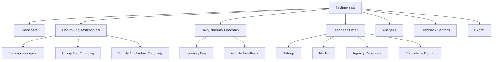
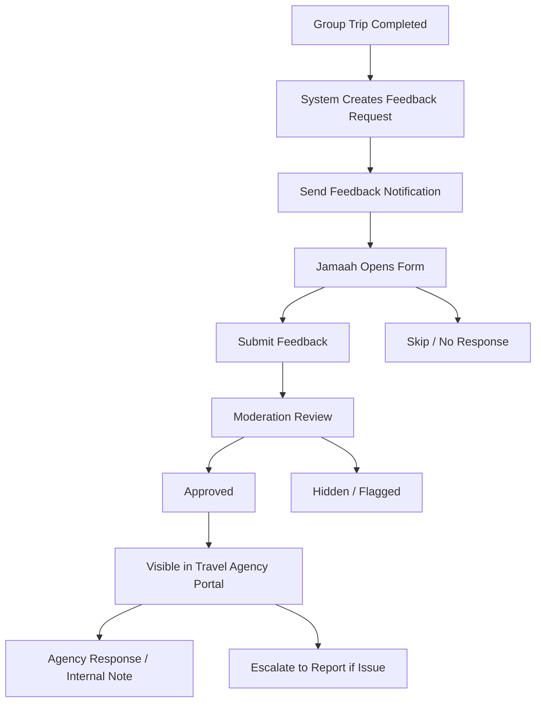
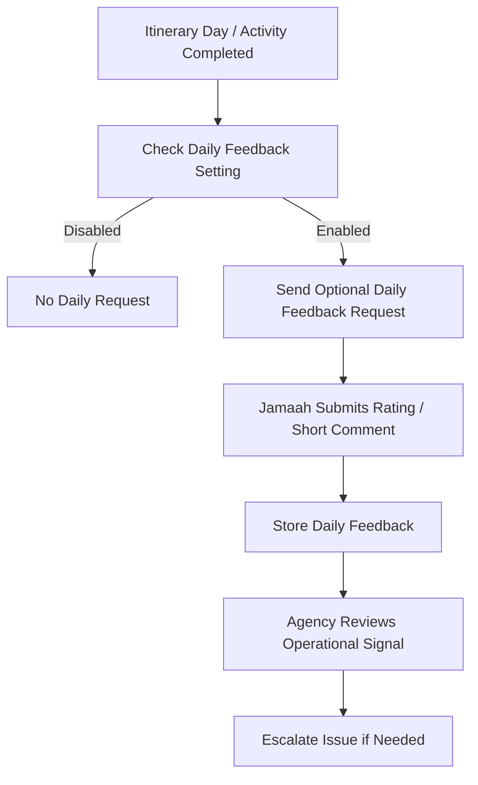
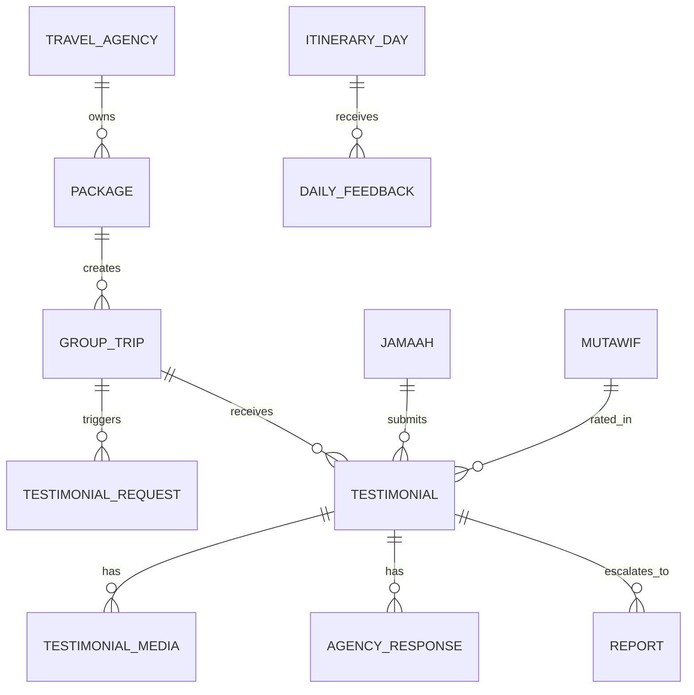

# TA PRD 12 - Testimonials

| Field | Value |
|---|---|
| Product | UmrahHaji.com Travel Agency Portal - Testimonials |
| Version | v1.0 |
| Platform | Responsive Web Platform |
| Scope | Travel Agency Portal / Agency Workspace |
| Status | Draft |
| Prepared by | Product / UI/UX Team |
| Last Updated | 9 June 2026 |

---

## 1. Product Summary

Testimonials is a feedback and review workspace for Travel Agencies to view, analyze, respond to, and escalate customer feedback related to their own packages, group trips, itinerary days, Travel Agency service, and assigned mutawwif.

The module supports two feedback layers:

1. End-of-trip testimonials, collected after a group trip is completed.
2. Daily itinerary feedback, collected optionally during the trip for itinerary day or activity experience.

End-of-trip feedback is the primary source for package quality, Travel Agency rating, mutawwif rating, recommendation rate, and marketing testimonial eligibility. Daily feedback is mainly an operational signal and should remain lightweight because forcing daily feedback can create survey fatigue during pilgrimage operations.

## 2. Relationship With Existing PRDs

| Module | Relationship |
|---|---|
| Master PRD - Travel Agency Portal | Defines Testimonials as a P1 module |
| TA PRD 01 - Dashboard | Shows testimonial summary, rating alerts, and recent low feedback |
| TA PRD 02 - Agency Profile & Verification Status | Agency rating may appear in agency profile after moderation |
| TA PRD 03 - Team & Roles | Controls access to view testimonials, respond, export, and escalate |
| TA PRD 04 - Package Management | Package detail can show approved testimonials and rating summaries |
| TA PRD 05 - Booking Management | Booking completion and trip completion trigger feedback requests |
| TA PRD 06 - Jamaah Management | Jamaah identity, family/group context, and participation history are linked |
| TA PRD 07 - Group Trip Management | Group trip completion triggers end-of-trip feedback request |
| TA PRD 08 - Mutawwif Assignment | Mutawwif rating and feedback are sourced from this module |
| TA PRD 09 - Documents & Services | Service-related feedback can be linked to document/service handling |
| TA PRD 10 - Finance Management | Tips/gratuity are not handled here in Phase 1; payment-related complaints are escalated to Finance or Reports |
| TA PRD 11 - Reports / Support | Low rating, complaint, or incident can be escalated into a report |
| Admin Panel Testimonial Management | Platform Admin moderates, audits, and controls public display rules |

## 3. Objective

Allow Travel Agencies to monitor customer experience, separate Travel Agency and mutawwif feedback fairly, respond to feedback where allowed, and improve service quality without exposing other agency data or overriding platform moderation.

## 4. Goals

1. Show end-of-trip testimonials grouped by package, group trip, jamaah, and family/group.
2. Show optional daily itinerary feedback grouped by itinerary day and activity.
3. Separate rating for Overall Trip, Travel Agency, and Mutawwif.
4. Support anonymous display while keeping internal audit references protected by permission.
5. Allow Travel Agencies to respond to feedback with controlled visibility.
6. Allow feedback escalation into Reports / Support when it contains a complaint, incident, or operational issue.
7. Show media attachments safely without overloading the server.
8. Provide analytics for rating, recommendation rate, sentiment, media submissions, and low-rating trends.
9. Keep public testimonial usage dependent on user consent and Admin moderation.

## 5. Non-Goals

1. This module does not allow Travel Agencies to edit customer feedback content.
2. This module does not allow Travel Agencies to delete negative reviews from analytics.
3. This module does not replace Admin Panel moderation.
4. This module does not expose testimonials from other Travel Agencies.
5. This module does not process tips, gratuity, payout, or mutawwif allowance in Phase 1.
6. This module does not force jamaah to submit feedback before accessing documents, bookings, or account features.
7. This module does not provide full public publishing workflow in Phase 1.
8. This module does not automatically penalize staff, mutawwif, or Travel Agency based only on one rating.

## 6. Users and Roles

| Role | Access Level |
|---|---|
| Agency Owner | Full view, export, response, escalation, and settings access |
| Agency Admin | Manage testimonials if permission is granted |
| Operations Staff | View trip and daily feedback, add internal notes, escalate issues |
| Customer Service | Respond to customer feedback and handle follow-up |
| Marketing Staff | View approved public-consent testimonials for campaign usage |
| Mutawwif Coordinator | View mutawwif-related ratings for agency-assigned trips |
| Auditor | View testimonials and audit logs, no mutation |
| Platform Admin | Moderates and audits from Admin Panel |

## 7. Permission Rules

| Permission | Description |
|---|---|
| View Testimonials | View accessible agency testimonials and feedback |
| View Anonymous Identity | Reveal internal identity behind anonymous feedback if allowed |
| View Media | Open/download testimonial media attachments |
| Add Agency Response | Respond to feedback if moderation rules allow |
| Add Internal Note | Add private agency note |
| Escalate to Report | Create linked report/support case |
| Export Testimonials | Export testimonial list and analytics |
| Manage Feedback Settings | Configure agency-level feedback preferences where allowed |
| View Audit Log | View activity history |

Rules:

1. Agency users can only access testimonials related to their own agency.
2. Anonymous feedback hides customer identity in standard views, but internal audit reference remains stored by the system.
3. Travel Agency response can be public only after moderation or policy approval.
4. Internal notes are not visible to jamaah, mutawwif, or other Travel Agencies.
5. Marketing users can only use feedback publicly when public display consent is true and moderation status is approved.
6. Low rating does not automatically create a penalty. It can trigger alert and escalation workflow.

## 8. Key Definitions

| Term | Definition |
|---|---|
| Feedback | Any rating or comment submitted by jamaah or trip participant |
| Testimonial | Feedback eligible for public or marketing use after consent and moderation |
| End-of-Trip Feedback | Feedback requested after group trip completion |
| Daily Feedback | Optional feedback for itinerary day or activity |
| Overall Trip Rating | General rating for the trip experience |
| Travel Agency Rating | Rating specifically for agency service and coordination |
| Mutawwif Rating | Rating specifically for assigned mutawwif guidance and service |
| Public Display Consent | User permission to display testimonial publicly |
| Agency Response | Reply from Travel Agency to customer feedback |
| Moderation Status | Platform review status: Pending Review, Approved, Hidden, Flagged, or Archived |

## 9. Information Architecture

## 10. Navigation Entry Points

| Entry Point | Behavior |
|---|---|
| Testimonials menu | Opens testimonial dashboard or list |
| Dashboard rating widget | Opens filtered testimonial list |
| Package detail | Opens testimonials linked to selected package |
| Group Trip detail | Opens end-trip and daily feedback for selected trip |
| Mutawwif assignment detail | Opens mutawwif rating summary |
| Jamaah detail | Opens feedback history submitted by selected jamaah |
| Reports / Support | Opens testimonial-related report when escalated |
| Notification center | Opens feedback detail for low rating, new comment, or moderation update |

## 11. Feedback Collection Policy

| Item | Recommendation | Reason |
|---|---|---|
| Create feedback request record | Mandatory | System needs tracking consistency after completed trip/day |
| Jamaah submits daily feedback | Optional | Prevents survey fatigue during active trip |
| Jamaah submits end-of-trip feedback | Strongly prompted, optional | Valuable but should remain voluntary |
| Rating if form is submitted | Required | Minimum useful signal for analytics |
| Written comment | Optional | Reduces friction for quick feedback |
| Media upload | Optional | Useful evidence/story, but server must be protected |
| Public display consent | Required for public use | Required before marketing/public display |
| Anonymous submission | Optional by setting | Encourages honest feedback while retaining internal audit |
| Tip/gratuity | Out of scope for Phase 1 | Must not be tied to positive feedback |

## 12. Testimonial vs Feedback vs Report

| Area | Feedback | Testimonial | Report / Issue |
|---|---|---|---|
| Purpose | Experience signal | Public or marketing review | Operational/support case |
| Timing | Daily or end-of-trip | Usually end-of-trip | Any time |
| Public Use | Not always | Requires consent and moderation | Not public |
| Owner Module | Testimonials | Testimonials | Reports / Support |
| Example | "Day 2 bus was late" | "The trip was well organized" | "Hotel room AC not working" |

Rule: Do not treat every feedback as a public testimonial. Feedback becomes a public testimonial only when the customer gives public display consent and the content passes moderation.

### 12.1 Public vs Internal Feedback Rule

| Data Type | Default Visibility | Can Be Public? | Notes |
|---|---|---:|---|
| Daily feedback | Internal to agency/platform | No by default | Operational signal, not marketing content |
| End-of-trip rating | Agency/platform analytics | Yes with consent and moderation | May contribute to public average if approved |
| Written feedback | Internal until moderated | Yes with consent and moderation | Must not expose sensitive details |
| Media upload | Private by default | Yes with explicit media consent | Faces/minors require stricter moderation |
| Agency response | Internal/customer-visible based on type | Yes only after moderation if public | Must not reveal private case data |

Rules:
- UI labels should distinguish Feedback from Public Testimonial.
- Low ratings remain visible internally even if hidden from public display.
- Public display must require consent, moderation approval, and no unresolved privacy concern.

## 13. Feedback Lifecycle

## 14. Daily Itinerary Feedback Flow

Rules:

1. Daily feedback is optional and must not block the next itinerary day.
2. Daily feedback should be short: rating plus optional comment.
3. Daily feedback should not be used for public display by default.
4. If daily feedback contains a complaint or incident, agency may escalate it into Reports / Support.
5. Maximum one daily feedback reminder should be sent per day.

## 15. End-of-Trip Feedback Structure

End-of-trip feedback should be separated into three rating targets:

1. Overall Trip.
2. Travel Agency.
3. Mutawwif.

This keeps analytics fair. A single general rating can hide the real issue: for example, a customer may love the mutawwif but dislike agency communication, or like the agency but complain about mutawwif punctuality.

Recommended form structure:

| Section | Required If Form Submitted | Notes |
|---|---:|---|
| Overall Trip Rating | Yes | 1-5 stars |
| Overall Trip Feedback | Optional | General trip comment |
| Travel Agency Rating | Yes | Service, communication, package delivery |
| Travel Agency Feedback | Optional | Specific agency feedback |
| Mutawwif Rating | Yes if mutawwif assigned | Guidance, punctuality, communication |
| Mutawwif Feedback | Optional | Specific guide feedback |
| General Testimonial | Optional | Public-facing story if consent is given |
| Recommend This Agency | Optional | Yes/No recommendation flag |
| Public Display Consent | Conditional | Required for public display |
| Anonymous Display | Optional | Hides customer identity in standard views |
| Media Upload | Optional | Images only in Phase 1 recommended |

### 15.1 Low Rating Handling

Low ratings should be treated as service quality signals, not automatically as public testimonials.

Rules:
- Rating 1-2 should create a Low Rating Alert.
- Agency should be prompted to respond internally or contact the customer within configured SLA, recommended 3 business days.
- If the comment describes an operational incident, safety issue, payment issue, or unresolved complaint, the agency can escalate it to Reports / Support.
- Low rating content should not be public by default unless customer consent exists and moderation approves it.
- Repeated low ratings linked to the same mutawwif, package, hotel, flight, or trip should appear in analytics.

## 16. Dashboard Requirements

The Testimonials Dashboard should provide a concise quality overview.

Recommended cards:

| Card | Description |
|---|---|
| Average Travel Agency Rating | Average agency-specific rating |
| Average Mutawwif Rating | Average rating for assigned mutawwif across agency trips |
| Total Feedback Received | Count of submitted end-trip and daily feedback |
| Recommendation Rate | Percentage of feedback recommending the agency |
| Low Rating Alerts | Count of rating <= 2 requiring review |
| Media Submissions | Count of feedback with media |
| Pending Response | Feedback waiting for agency response |
| Public-Eligible Testimonials | Approved feedback with public display consent |

Dashboard rules:

1. Only submitted feedback contributes to average rating.
2. Hidden, rejected, or spam feedback is excluded from public averages.
3. Internal analytics may still include hidden feedback for quality monitoring if permitted.
4. Daily feedback should be analyzed separately from end-of-trip feedback.

## 17. List View Requirements

### 17.1 End-of-Trip List

| Column | Description |
|---|---|
| Jamaah / Family | Submitter identity or family/group context |
| Package | Related package |
| Group Trip | Related group trip |
| Overall Rating | Overall trip rating |
| Travel Agency Rating | Agency-specific rating and comment preview |
| Mutawwif Rating | Mutawwif-specific rating and comment preview |
| Media | Attachment count |
| Recommend | Yes/No |
| Public Consent | Consent indicator |
| Moderation Status | Pending Review, Approved, Hidden, Flagged, Archived |
| Submitted At | Date/time |
| Actions | View Detail, Respond, Add Note, Escalate, Export |

### 17.2 Daily Feedback List

| Column | Description |
|---|---|
| Day / Activity | Itinerary day and activity snapshot |
| Jamaah / Family | Submitter identity or anonymous label |
| Rating | Daily rating |
| Feedback | Short comment preview |
| Media | Attachment count |
| Issue Flag | System or manual flag |
| Submitted At | Date/time |
| Actions | View Detail, Add Note, Escalate |

### 17.3 Filters

| Filter | Options |
|---|---|
| Feedback Type | End-of-Trip, Daily |
| Rating | 1, 2, 3, 4, 5 stars |
| Status | Pending Review, Approved, Hidden, Flagged, Archived |
| Package | Agency packages |
| Group Trip | Agency group trips |
| Mutawwif | Assigned mutawwif |
| Public Consent | Has Consent, No Consent |
| Recommendation | Yes, No |
| Media | With Media, Without Media |
| Date | All Time, Today, This Week, This Month, Custom Range |

## 18. Feedback Detail Requirements

Feedback Detail should show a complete but readable record.

Required sections:

1. Feedback summary.
2. Package and group trip context.
3. Submitter profile or anonymous display.
4. Overall Trip rating and comment.
5. Travel Agency rating and comment.
6. Mutawwif rating and comment.
7. Daily itinerary context if feedback type is Daily.
8. Uploaded media.
9. Public display consent and anonymous display setting.
10. Moderation status.
11. Agency response and internal notes.
12. Escalation/report link.
13. Activity log.

Rules:

1. Travel Agency can view moderation status but cannot approve its own public testimonial.
2. If feedback is anonymous, standard users see anonymous label.
3. Users with View Anonymous Identity permission can reveal identity for operational follow-up.
4. Original feedback text must remain immutable after submission except platform moderation actions.
5. Agency response should be stored separately from customer feedback.

### 18.1 Moderation Decision Tree

| Decision | Result | Rule |
|---|---|---|
| Approve for public display | Testimonial may appear publicly | Requires consent and no sensitive/private content |
| Approve internally only | Feedback stays visible in portal analytics | Used for useful feedback without public consent |
| Hide from public | Not shown publicly | Used for privacy, sensitive complaint, or unresolved issue |
| Flag for review/report | Creates moderation flag or report link | Used for safety, compliance, payment, harassment, or legal concern |
| Reject as spam/abuse | Excluded from public and standard analytics | Requires moderation reason |

Rules:
- Agency cannot self-approve public testimonial.
- Public testimonial text may be redacted only by platform moderation, with audit log.
- Customer identity must follow anonymous display preference unless operational follow-up permission is granted.

## 19. Agency Response Form

Agency response allows a Travel Agency to reply professionally without editing the original testimonial.

| Field | Type | Required | Validation | Notes |
|---|---|---:|---|---|
| Response Type | Select | Yes | Customer Reply, Internal Note, Public Reply Request | Public reply may require moderation |
| Response Message | Textarea | Yes | Max 1,000 chars | Must be professional and non-sensitive |
| Notify Customer | Checkbox | Optional | Boolean | Only for customer-visible response |
| Related Staff | Select | Optional | Agency team member | For internal follow-up |
| Follow-up Status | Select | Optional | No Follow-up, In Progress, Completed | Internal tracking |

Rules:

1. Customer Reply is visible to the feedback submitter if allowed.
2. Internal Note is visible only to agency users with permission.
3. Public Reply Request is sent to Admin moderation before public display.
4. Response cannot contain personal data, payment details, passport numbers, or private medical information.

## 20. Escalate to Report Form

Low rating, complaint, incident, or operational issue can be escalated into Reports / Support.

| Field | Type | Required | Validation | Notes |
|---|---|---:|---|---|
| Report Category | Select | Yes | Service, Document, Payment, Compliance, Platform, Safety, Other | Pre-filled if detected |
| Priority | Select | Yes | Normal, Important, Urgent | Default based on rating/category |
| Subject | Text Input | Yes | Max 120 chars | Pre-filled from feedback |
| Description | Textarea | Yes | Max 2,000 chars | Include context and requested action |
| Include Feedback Link | Checkbox | Yes | Boolean | Links report to testimonial |
| Include Media | Checkbox | Optional | Boolean | Copies media references, not duplicate files |
| Assigned Agency PIC | Select | Optional | Agency staff | Internal follow-up owner |

Rules:

1. Escalation creates a linked report without duplicating original testimonial records.
2. Media should be referenced by object ID, not physically copied, to reduce storage waste.
3. Sensitive feedback may be escalated only by users with proper permission.
4. Report status is managed in Reports / Support.

## 21. Feedback Settings

Feedback settings define how the Travel Agency wants to collect and respond to feedback within platform rules.

| Setting | Recommended Default | Notes |
|---|---|---|
| Enable End-of-Trip Feedback | On | Strongly prompted after trip completion |
| End-of-Trip Send Timing | 24 hours after trip completion | Prevents sending while customers are still traveling |
| End-of-Trip Reminder | 1 reminder after 3 days | Avoids spam |
| Enable Daily Feedback | Off by default, configurable | Use only for trips needing operational monitoring |
| Daily Feedback Frequency | Per selected day | Avoid daily overload |
| Daily Feedback Prompt | Short default prompt | Max 300 chars |
| Allow Anonymous Display | On | Identity retained internally |
| Allow Media Upload | On for images | Video recommended Phase 2 |
| Low Rating Alert Threshold | <= 2 stars | Notify agency owner/admin/CS |
| Public Testimonial Request | Off by default | Requires consent and Admin moderation |

## 22. Media Upload Policy

Media must be useful but should not burden the server. Store media in object storage, not the application server filesystem.

| Media Type | Allowed Format | Max Size | Max Count | Server Handling |
|---|---|---:|---:|---|
| Testimonial image | JPG, JPEG, PNG, WEBP | 2 MB/file | 5 per feedback | Compress, strip metadata, generate thumbnail |
| Daily feedback image | JPG, JPEG, PNG, WEBP | 2 MB/file | 3 per feedback | Compress and lazy-load |
| Video testimonial | MP4, MOV, WEBM | 20 MB/file | 1 per feedback | Phase 2 recommended; generate preview thumbnail |
| Attachment document | PDF | 5 MB/file | 3 per feedback | Only for evidence/report escalation |

Rules:

1. Use object storage with signed URLs.
2. List views must load thumbnails only.
3. Original files should load only in detail view or download action.
4. Uploaded images must be compressed before storage when possible.
5. Video upload should be disabled in Phase 1 unless infrastructure is ready.
6. All uploads must pass file type validation, size validation, and malware scanning.
7. Public display must never show media without user consent and moderation approval.

## 23. Status Model

### 23.1 Request Status

| Status | Meaning |
|---|---|
| Created | Feedback request record created |
| Sent | Notification sent |
| Opened | Jamaah opened the feedback link/form |
| Submitted | Feedback submitted |
| Skipped | Jamaah intentionally skipped |
| No Response | No submission after expiry |
| Expired | Feedback window closed |

### 23.2 Moderation Status

| Status | Meaning |
|---|---|
| Pending Review | Newly submitted or waiting Admin review |
| Approved | Approved for internal visibility, and public use if consent exists |
| Hidden | Hidden from standard views due to policy or privacy |
| Flagged | Needs review due to sensitive content, abuse, or complaint |
| Archived | Removed from active operational view but retained |

## 24. Functional Requirements

| ID | Requirement | Priority |
|---|---|---|
| TA-TES-001 | System shall show testimonial dashboard for the Travel Agency's own data only | P1 |
| TA-TES-002 | System shall support End-of-Trip and Daily feedback tabs | P1 |
| TA-TES-003 | System shall show end-of-trip feedback grouped by package and group trip | P1 |
| TA-TES-004 | System shall show daily feedback grouped by itinerary day and activity | P1 |
| TA-TES-005 | System shall separate Overall Trip, Travel Agency, and Mutawwif ratings | P1 |
| TA-TES-006 | System shall show recommendation flag and public display consent | P1 |
| TA-TES-007 | System shall support anonymous display based on user selection and permission | P1 |
| TA-TES-008 | System shall show moderation status controlled by Admin Panel | P1 |
| TA-TES-009 | System shall allow agency response if permission and moderation rules allow | P1 |
| TA-TES-010 | System shall support internal notes for agency users | P2 |
| TA-TES-011 | System shall allow escalation from feedback to Reports / Support | P1 |
| TA-TES-012 | System shall show media attachments using thumbnails in list and full view in detail | P1 |
| TA-TES-013 | System shall enforce media format, size, and count limits | P1 |
| TA-TES-014 | System shall show rating analytics and low-rating alerts | P1 |
| TA-TES-015 | System shall exclude hidden/rejected/spam feedback from public averages | P1 |
| TA-TES-016 | System shall keep original feedback immutable after submission | P1 |
| TA-TES-017 | System shall maintain audit log for response, escalation, export, and identity reveal | P1 |
| TA-TES-018 | System shall provide filters by rating, status, package, group trip, mutawwif, media, and date | P1 |
| TA-TES-019 | System shall allow export based on user permission | P2 |
| TA-TES-020 | System shall not expose testimonials from other Travel Agencies | P1 |
| TA-TES-021 | System shall notify agency users when low-rating feedback is received | P1 |
| TA-TES-022 | System shall keep daily feedback separate from end-of-trip rating calculations | P1 |

## 25. Business Rules

1. End-of-trip feedback request is created when group trip status changes to Completed.
2. Feedback submission is optional and must not block user access.
3. Rating is required only if user chooses to submit the feedback form.
4. Daily feedback request is sent only if enabled in itinerary or group trip feedback setting.
5. A jamaah should submit only one end-of-trip feedback per group trip participation.
6. A jamaah should submit at most one daily feedback per itinerary day unless edit window is enabled.
7. Travel Agency rating and Mutawwif rating must not be merged into one score.
8. Anonymous feedback still retains internal submitter reference for audit and abuse prevention.
9. Public display requires explicit consent and approved moderation status.
10. Travel Agency cannot approve, hide, or delete feedback for public display.
11. Agency response must be stored separately and may require moderation for public visibility.
12. Complaints, incidents, and low-rating feedback can be escalated into Reports / Support.

## 26. Analytics Requirements

| Metric | Description |
|---|---|
| Average Overall Trip Rating | Average of end-of-trip overall ratings |
| Average Travel Agency Rating | Average agency-specific rating |
| Average Mutawwif Rating | Average assigned mutawwif ratings |
| Recommendation Rate | Percentage recommending the agency |
| Daily Feedback Trend | Daily rating trend by itinerary day/activity |
| Low Rating Count | Count of ratings <= 2 |
| Response Rate | Percentage of feedback with agency response |
| Public Consent Rate | Percentage eligible for public display |
| Media Submission Rate | Percentage of feedback with media |
| Escalation Rate | Percentage escalated to Reports / Support |

Rules:

1. Daily feedback trend should be used for operations, not public package score by default.
2. Public-facing ratings should use moderated end-of-trip ratings.
3. Internal analytics may show daily and hidden feedback if permissions allow.
4. Analytics should support package, group trip, mutawwif, date range, and rating filters.

## 27. Notifications

| Event | Recipient | Channel | Notes |
|---|---|---|---|
| End-of-trip request sent | Jamaah | In-app, email, WhatsApp if enabled | Sent after trip completion |
| Daily feedback request sent | Jamaah | In-app or WhatsApp if enabled | Optional and limited |
| Low rating received | Agency Owner/Admin/CS | In-app, email | Trigger threshold <= 2 |
| Agency response added | Jamaah | In-app, email | Only if customer-visible |
| Feedback escalated to report | Agency PIC/Admin | In-app, email | Opens linked report |
| Moderation status changed | Agency Owner/Admin | In-app | If status affects visibility |

## 28. Data Model Summary

Core entities:

| Entity | Notes |
|---|---|
| Testimonial Request | Feedback request record created by system |
| Testimonial | End-of-trip submitted feedback |
| Daily Feedback | Itinerary day/activity feedback |
| Testimonial Media | Image/video/document attachments |
| Agency Response | Agency reply or internal note |
| Moderation Record | Admin-controlled moderation status |
| Testimonial Analytics Snapshot | Aggregated rating and feedback metrics |

## 29. Edge Cases

| Case | Expected Behavior |
|---|---|
| Jamaah does not submit feedback | Mark request as No Response; do not penalize |
| Jamaah submits daily feedback but no end-trip feedback | Daily remains operational feedback |
| Group trip is cancelled | Do not send normal end-trip request; optional cancellation feedback can be separate |
| Mutawwif changed mid-trip | Attribute rating to assigned mutawwif snapshot |
| Multiple mutawwif assigned | Rate primary mutawwif; optional additional ratings in Phase 2 |
| Anonymous feedback contains safety issue | Escalation can reveal identity only to authorized users |
| Feedback contains personal data | Flag for moderation and hide from public display |
| Feedback includes large media | Reject upload and show size guidance |
| Negative feedback with public consent | Still requires moderation; do not suppress from internal analytics |
| Duplicate feedback | Allow one response per feedback type/day/trip unless edit window is enabled |

## 30. Responsive Behavior

Desktop:

1. Use dashboard cards, filters, and table layout.
2. End Trip and Daily tabs can sit side by side.
3. Detail panel or modal can show full feedback and response.

Tablet:

1. Collapse filters into two rows or filter drawer.
2. Group package/trip cards with nested testimonial list.
3. Keep rating, status, and action buttons visible.

Mobile:

1. Use stacked cards instead of wide tables.
2. Show rating, feedback preview, submitter, package/trip, and status first.
3. Move filters into bottom sheet.
4. Media thumbnails should be lazy-loaded.
5. Daily feedback grouped by day should use accordion.

## 31. Acceptance Criteria

1. Travel Agency can view testimonial dashboard for its own agency only.
2. Travel Agency can switch between End-of-Trip and Daily feedback views.
3. End-of-trip feedback shows separate Overall Trip, Travel Agency, and Mutawwif ratings.
4. Daily feedback is connected to itinerary day/activity snapshot.
5. Anonymous feedback hides identity in standard views.
6. Public display consent is clearly visible.
7. Travel Agency cannot edit original customer feedback.
8. Travel Agency can add response or internal note based on permission.
9. Low-rating feedback can be escalated into Reports / Support.
10. Media upload rules are enforced and thumbnails are used in list views.
11. Hidden or rejected feedback is excluded from public averages.
12. Audit log records identity reveal, response, escalation, export, and settings changes.

## 32. Phase 1 Scope

1. Testimonials dashboard.
2. End-of-trip feedback list and detail.
3. Daily itinerary feedback list and detail if enabled.
4. Separate ratings for Overall Trip, Travel Agency, and Mutawwif.
5. Public consent and anonymous display indicators.
6. Moderation status view from Admin Panel.
7. Agency response and internal note.
8. Escalate to Reports / Support.
9. Image attachment support with compression and thumbnails.
10. Basic analytics and export.

## 33. Phase 2 Enhancements

1. Public testimonial publishing workflow for Travel Agency storefront.
2. Video testimonial upload and streaming optimization.
3. AI-assisted sentiment analysis and keyword extraction.
4. Automated testimonial campaign by package/season.
5. Multi-language translation for testimonials.
6. Custom feedback questions per package or trip.
7. Advanced mutawwif performance dashboard.
8. Public reply moderation workflow.
9. Reputation score combining ratings, response rate, and issue resolution.
10. Optional tip/gratuity flow if Finance and payout infrastructure are ready.

## 34. Open Questions

1. Should public testimonial approval be handled only by Platform Admin, or can trusted Travel Agencies request auto-approval later?
2. Should daily feedback be enabled by default for Hajj trips but disabled for Umrah trips?
3. Should customers be allowed to edit submitted feedback within a short window?
4. Should agency response be visible to the customer in Phase 1 or only internal?
5. Should public rating use only end-of-trip Travel Agency rating or also include package rating?
