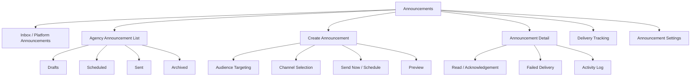
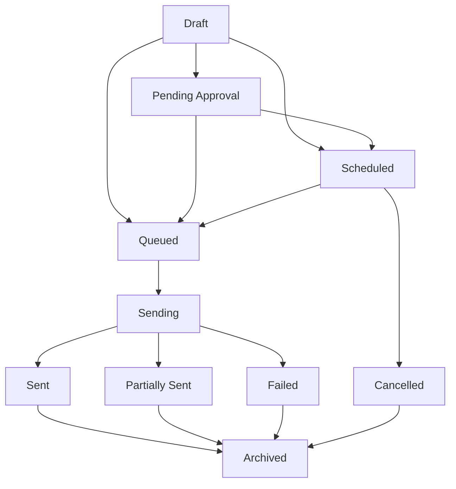
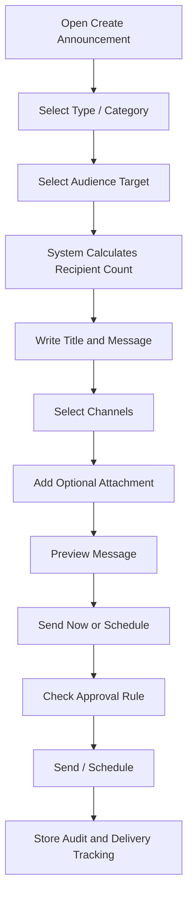
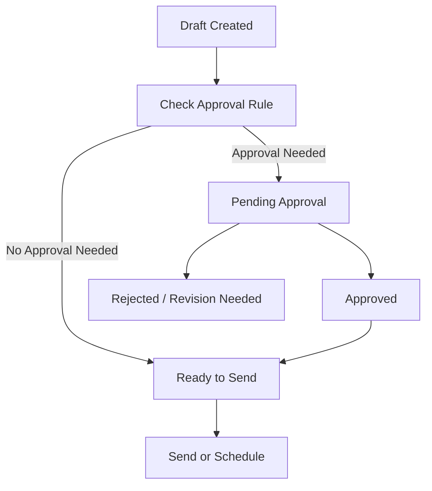
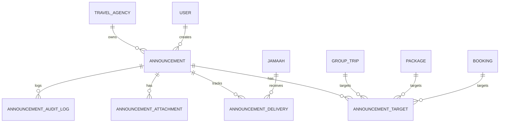

# TA PRD 13 - Announcements

| Field | Value |
|---|---|
| Product | UmrahHaji.com Travel Agency Portal - Announcements |
| Version | v1.0 |
| Platform | Responsive Web Platform |
| Scope | Travel Agency Portal / Agency Workspace |
| Status | Draft |
| Prepared by | Product / UI/UX Team |
| Last Updated | 9 June 2026 |

---

## 1. Product Summary

Announcements is a communication workspace for Travel Agencies to receive official platform announcements and send structured announcements to their own jamaah, booking participants, group trip members, and internal agency staff.

This module is not a chat feature. It is a controlled broadcast tool for important updates, reminders, operational notices, schedule changes, document reminders, payment reminders, trip preparation messages, and platform notices.

The module must support two communication directions:

1. Platform to Travel Agency: official announcements from UmrahHaji.com, read-only for Travel Agencies.
2. Travel Agency to Audience: agency-created announcements sent only to audiences within that agency's data scope.

## 2. Relationship With Existing PRDs

| Module | Relationship |
|---|---|
| Master PRD - Travel Agency Portal | Defines Announcements as a P1 communication module |
| TA PRD 01 - Dashboard | Shows latest announcements and action shortcuts |
| TA PRD 02 - Agency Profile & Verification Status | Platform can target agencies based on verification status |
| TA PRD 03 - Team & Roles | Controls create, approve, send, archive, and export permissions |
| TA PRD 04 - Package Management | Package announcements can target bookings for selected package |
| TA PRD 05 - Booking Management | Booking participants can receive booking/payment/departure announcements |
| TA PRD 06 - Jamaah Management | Jamaah and family/group data are used for audience targeting |
| TA PRD 07 - Group Trip Management | Group trip is the primary audience target for operational announcements |
| TA PRD 08 - Mutawwif Assignment | Assigned mutawwif can receive trip-related coordination announcements if enabled |
| TA PRD 09 - Documents & Services | Document/service reminders can be sent through announcements |
| TA PRD 10 - Finance Management | Invoice/payment reminders may link to finance records |
| TA PRD 11 - Reports / Support | Announcement delivery issues or disputes can be escalated to reports |
| TA PRD 12 - Testimonials | Feedback campaign reminders may be sent as controlled announcements |
| Admin Panel Announcement | Platform Admin owns official platform-wide announcements and policy notices |

## 3. Objective

Allow Travel Agencies to send clear, auditable, targeted announcements while preventing spam, protecting data privacy, and keeping platform-origin messages authoritative and uneditable.

## 4. Goals

1. Allow Travel Agencies to receive platform announcements.
2. Allow Travel Agencies to create and schedule agency announcements.
3. Support audience targeting by group trip, package bookings, booking participants, all agency jamaah, specific jamaah, family/group, and agency staff.
4. Support in-app, email, and WhatsApp delivery if enabled by settings.
5. Provide delivery, read, acknowledgement, and failure tracking.
6. Support draft, schedule, send now, archive, and cancel scheduled announcement.
7. Support attachments without overloading the server.
8. Keep announcement audit trail for compliance and dispute handling.
9. Prevent Travel Agencies from messaging audiences outside their own data scope.

## 5. Non-Goals

1. This module does not replace real-time chat.
2. This module does not allow Travel Agencies to edit platform announcements.
3. This module does not allow Travel Agencies to send announcements to other agencies.
4. This module does not provide marketing automation campaigns in Phase 1.
5. This module does not guarantee WhatsApp delivery when external provider delivery fails.
6. This module does not send unrestricted promotional blasts without platform rules.
7. This module does not expose private customer data in message content by default.
8. This module does not handle emergency incident management beyond announcement delivery and escalation links.

## 6. Users and Roles

| Role | Access Level |
|---|---|
| Agency Owner | Full access to create, approve, send, schedule, archive, and export |
| Agency Admin | Manage announcements if permission is granted |
| Operations Staff | Create and send group trip operational announcements |
| Customer Service | Create customer reminders and follow-up announcements |
| Sales / Booking Staff | Send package/booking-related announcements if allowed |
| Finance Staff | Create payment reminder announcements if allowed |
| Mutawwif Coordinator | Send coordination updates to assigned mutawwif and trip members if allowed |
| Auditor | View announcement history and audit logs only |
| Platform Admin | Creates official platform announcements from Admin Panel |

## 7. Permission Rules

| Permission | Description |
|---|---|
| View Announcements | View agency-accessible announcements |
| Create Announcement | Create draft announcement |
| Edit Draft Announcement | Edit unsent draft |
| Schedule Announcement | Schedule future delivery |
| Send Announcement | Send immediately |
| Approve Announcement | Approve announcement before send if agency approval is enabled |
| Cancel Scheduled Announcement | Cancel before delivery begins |
| Archive Announcement | Archive from active list |
| View Delivery Tracking | View delivery, read, acknowledgement, and failure status |
| Export Announcements | Export list and delivery summary |
| Manage Announcement Settings | Configure announcement defaults and approval rules |

Rules:

1. Platform announcements are read-only for Travel Agency users.
2. Sent announcements cannot be edited. A correction must be sent as a new announcement.
3. Scheduled announcements can be edited only before delivery queue starts.
4. Agency users can target only audiences belonging to their own agency.
5. Sensitive categories may require Agency Owner/Admin approval before sending.
6. All send, schedule, cancel, archive, and export actions must be logged.

## 8. Key Definitions

| Term | Definition |
|---|---|
| Platform Announcement | Official message created by UmrahHaji.com Admin Panel |
| Agency Announcement | Message created by Travel Agency inside its portal |
| Audience Target | Selected recipient group such as group trip, package booking, jamaah, family/group, or staff |
| Channel | Delivery method: in-app, email, WhatsApp |
| Delivery Status | Technical sending status per recipient/channel |
| Read Status | Whether recipient opened the announcement in-app |
| Acknowledgement | Recipient confirms they have read/understood the message |
| Scheduled Announcement | Announcement queued for future delivery |
| Sensitive Announcement | Compliance, safety, payment, or policy-related message requiring stricter rules |

## 9. Information Architecture

## 10. Announcement Types

| Type | Owner | Example | Editable by Travel Agency |
|---|---|---|---|
| Platform Notice | Platform Admin | System maintenance, policy update, verification reminder | No |
| Agency General Notice | Travel Agency | Office closure, customer service hours | Yes before send |
| Group Trip Update | Travel Agency | Briefing time, departure reminder, itinerary change | Yes before send |
| Booking Reminder | Travel Agency | Payment deadline, missing document reminder | Yes before send |
| Service Reminder | Travel Agency | Passport, visa, vaccination, photo submission | Yes before send |
| Finance Reminder | Travel Agency | Invoice due, deposit reminder, payment confirmation notice | Yes before send |
| Safety / Compliance Notice | Platform Admin or approved agency role | Safety protocol, travel advisory | Restricted |
| Feedback Request | System or Travel Agency | End-of-trip feedback reminder | Restricted by settings |

## 11. Audience Targeting

| Audience | Description | Notes |
|---|---|---|
| All Agency Staff | Internal users under the Travel Agency |
| All Agency Jamaah | All jamaah linked to the agency |
| Specific Jamaah | Selected jamaah records |
| Family / Group | Selected family/group booking members |
| Package Bookings | Customers booked under selected package |
| Booking Participants | Selected booking or booking group |
| Group Trip Members | All members assigned to selected group trip |
| Group Trip PIC / Family PIC | Main contact for trip or family/group |
| Assigned Mutawwif | Mutawwif assigned to selected trip, if enabled |
| Pending Document Members | Members missing selected documents/services |
| Pending Payment Members | Members with outstanding invoice/payment |

Targeting rules:

1. Audience count must be shown before sending.
2. The system must prevent selecting recipients outside agency scope.
3. Audience should be stored as a snapshot at send time.
4. If a jamaah is removed from a group after scheduling but before send, the system should revalidate audience eligibility.
5. For sensitive announcements, targeting should be explicit and not default to all jamaah.

## 12. Announcement Lifecycle

Rules:

1. Draft can be edited.
2. Pending Approval can be approved, rejected, or returned for revision.
3. Scheduled can be edited or cancelled before queue lock.
4. Queued and Sending cannot be edited.
5. Sent cannot be edited or recalled in Phase 1.
6. Partially Sent keeps recipient-level failure details.
7. Failed announcement can be retried only by creating a retry action or duplicate draft with same content.

## 13. Create Announcement Flow

## 14. List View Requirements

Recommended columns:

| Column | Description |
|---|---|
| Announcement Title | Title and short message preview |
| Type / Category | Platform, group trip, booking, document, finance, safety, general |
| Audience | Target summary and recipient count |
| Channels | In-app, email, WhatsApp |
| Status | Draft, Pending Approval, Scheduled, Sending, Sent, Partially Sent, Failed, Archived |
| Scheduled / Sent At | Date and time |
| Created By | User who created the announcement |
| Delivery Summary | Sent, failed, read, acknowledged counts |
| Actions | View, Edit Draft, Duplicate, Cancel, Archive, Export |

Filters:

| Filter | Options |
|---|---|
| Source | Platform, Agency, System |
| Status | Draft, Scheduled, Sent, Failed, Archived |
| Category | General, Trip, Booking, Document, Finance, Safety, Platform, Feedback |
| Audience | Staff, Jamaah, Group Trip, Package, Booking, Specific Members |
| Channel | In-app, Email, WhatsApp |
| Date | All Time, Today, This Week, This Month, Custom Range |
| Created By | Agency users |

## 15. Detail View Requirements

Announcement Detail should show:

1. Title, message, category, priority, and source.
2. Audience snapshot.
3. Linked context such as package, booking, group trip, invoice, document, or itinerary.
4. Delivery channels.
5. Sent/scheduled timestamp.
6. Recipient-level delivery status.
7. Read and acknowledgement status if enabled.
8. Attachments.
9. Creator and approver.
10. Activity log.
11. Actions available by status.

Detail rules:

1. Platform announcements show source badge and are read-only.
2. Sensitive announcement content should show only to permitted roles.
3. Recipient-level tracking must be permission-controlled.
4. Export should not expose phone/email data unless user has permission.

## 16. Create Announcement Form

| Field | Type | Required | Validation | Notes |
|---|---|---:|---|---|
| Announcement Type | Select | Yes | Platform source hidden for TA | Agency General, Group Trip, Booking, Document, Finance, Safety |
| Category | Select | Yes | Existing category list | Used for filters and approval rules |
| Priority | Select | Yes | Normal, Important, Urgent | Urgent may require approval |
| Title | Text Input | Yes | Max 120 chars | Clear and action-oriented |
| Message | Rich Text / Textarea | Yes | Max 2,000 chars | Avoid sensitive personal data |
| Audience Target | Multi-select | Yes | Agency-scoped only | Group trip, booking, package, jamaah, staff |
| Linked Context | Select | Optional | Package/booking/trip/invoice/document | Helps recipients understand context |
| Channels | Checkbox | Yes | At least one | In-app required by default |
| Require Acknowledgement | Checkbox | Optional | Boolean | Useful for briefing/compliance |
| Schedule Type | Radio | Yes | Send Now, Schedule Later | Schedule uses agency timezone |
| Schedule Date/Time | DateTime Picker | Conditional | Future date/time | Required if Schedule Later |
| Expiry Date | DateTime Picker | Optional | After sent date | Hide from active recipient feed after expiry |
| Attachment | Upload | Optional | See media policy | PDF/image only in Phase 1 |
| Save as Template | Checkbox | Optional | Boolean | Phase 2 recommended |

## 17. Message Content Guidelines

Announcements should be short, direct, and action-oriented.

Recommended structure:

1. What changed or what needs attention.
2. Who is affected.
3. What action is required.
4. Deadline or schedule if any.
5. Contact channel or support link.

Rules:

1. Do not include full passport numbers, IC numbers, payment card details, medical details, or private bank details.
2. Use links to secured detail pages instead of embedding sensitive data.
3. Urgent notices must be factual and avoid promotional language.
4. Promotional announcements must follow platform policy and opt-out rules.
5. Message should be readable in mobile notification preview.

## 18. Attachment Policy

Attachments must be useful and lightweight. Store files in object storage with signed URLs.

| Attachment Type | Allowed Format | Max Size | Max Count | Server Handling |
|---|---|---:|---:|---|
| Image | JPG, JPEG, PNG, WEBP | 2 MB/file | 3 per announcement | Compress, strip metadata, generate thumbnail |
| Document | PDF | 5 MB/file | 3 per announcement | Scan, store in object storage |
| Video | MP4, MOV, WEBM | Not allowed Phase 1 | 0 | Use external link or Phase 2 support |

Rules:

1. List view must not load full attachments.
2. Recipients should open attachments through signed URLs.
3. All files must pass file type, size, and malware validation.
4. Large media should be linked externally or handled in Phase 2.
5. Attachment names should be sanitized before storage.

## 19. Delivery Channels

| Channel | Phase 1 Behavior |
|---|---|
| In-App | Required default channel for all announcements |
| Email | Optional if recipient email exists and agency setting allows |
| WhatsApp | Optional if phone exists and provider setting allows |
| SMS | Phase 2 |
| Push Notification | Phase 2 because mobile app is not Phase 1 |

Delivery rules:

1. In-app record should always be created even if email/WhatsApp fails.
2. Failed channel delivery must not delete the announcement.
3. Retry should be recipient/channel-specific.
4. Message delivery should respect notification preferences and legal opt-out requirements.
5. Urgent operational notices may override non-critical preference only if platform policy allows.

### 19.1 Rate Limit, Quiet Hours, and Urgent Override

| Rule Area | Default Recommendation | Notes |
|---|---|---|
| Agency send limit | Configurable per day and per hour | Prevents accidental mass spam |
| Recipient duplicate limit | Do not send the same announcement to same recipient more than once | Retry failed channel only, not whole announcement |
| Quiet hours | 10:00 PM - 7:00 AM agency timezone | Applies to non-urgent email/WhatsApp |
| Urgent override | Allowed with permission and reason | Used for safety, schedule change, active-trip emergency |
| Promotional content | Respect opt-out and platform policy | Do not override quiet hours |

Rules:
- Urgent override must show a confirmation prompt and store reason.
- The system should warn when recipient count is high.
- Scheduled announcements must validate timezone and quiet hour rules.
- Repeated failed delivery should stop after configured retry count and show failure summary.

## 20. Delivery Tracking

Tracking should be useful but not too heavy.

Recommended tracking fields:

| Field | Description |
|---|---|
| Total Recipients | Number of targeted recipients |
| In-App Created | Number of in-app records created |
| Email Sent | Number of successful email sends |
| WhatsApp Sent | Number of successful WhatsApp sends |
| Failed | Delivery failures by channel |
| Opened | Recipient opened announcement detail |
| Acknowledged | Recipient clicked acknowledgement action |
| Last Delivery Attempt | Last retry timestamp |

Rules:

1. Read/open status is not the same as confirmed acknowledgement.
2. Acknowledgement is optional and must be explicitly enabled.
3. Recipient-level tracking should be hidden from roles without permission.
4. Export can include aggregated delivery metrics by default.

## 21. Platform Announcement Handling

Platform announcements are official messages from UmrahHaji.com.

Rules:

1. Travel Agencies cannot edit platform announcements.
2. Platform announcements can target all agencies, selected agencies, agency status groups, or agency roles.
3. Travel Agencies can archive platform announcements from their own view, but this does not delete the original.
4. Critical platform announcements may require acknowledgement.
5. Platform announcements should show source, published date, expiry, and related policy link if any.

## 22. Agency Announcement Approval

Agency can optionally enable internal approval before sending announcements.

Recommended approval triggers:

| Trigger | Approval Recommendation |
|---|---|
| Urgent priority | Require Agency Owner/Admin approval |
| Safety / Compliance category | Require approval |
| All Agency Jamaah audience | Require approval |
| Finance reminder to many recipients | Require approval |
| Contains attachment | Optional approval |
| Created by limited staff role | Require approval |
| Urgent override during quiet hours | Require approval |
| Large audience count | Require approval if above configured threshold |

Approval flow:

## 23. Functional Requirements

| ID | Requirement | Priority |
|---|---|---|
| TA-ANN-001 | System shall show platform announcements accessible to the Travel Agency | P1 |
| TA-ANN-002 | System shall prevent Travel Agencies from editing platform announcements | P1 |
| TA-ANN-003 | System shall allow agency users with permission to create announcement drafts | P1 |
| TA-ANN-004 | System shall support audience targeting within agency scope only | P1 |
| TA-ANN-005 | System shall show recipient count before sending | P1 |
| TA-ANN-006 | System shall support send now and schedule later | P1 |
| TA-ANN-007 | System shall support in-app, email, and WhatsApp channel selection if enabled | P1 |
| TA-ANN-008 | System shall always create in-app announcement record for targeted recipients | P1 |
| TA-ANN-009 | System shall support delivery tracking by channel | P1 |
| TA-ANN-010 | System shall support read tracking and optional acknowledgement tracking | P1 |
| TA-ANN-011 | System shall allow cancellation of scheduled announcement before queue lock | P1 |
| TA-ANN-012 | System shall prevent editing after announcement is queued or sent | P1 |
| TA-ANN-013 | System shall support attachment upload with size and format validation | P1 |
| TA-ANN-014 | System shall support approval workflow based on agency settings and rules | P2 |
| TA-ANN-015 | System shall support archive without deleting audit records | P1 |
| TA-ANN-016 | System shall link announcements to package, booking, group trip, invoice, document, or itinerary context | P1 |
| TA-ANN-017 | System shall protect sensitive recipient data in list and export views | P1 |
| TA-ANN-018 | System shall log create, edit, approve, send, cancel, retry, archive, and export actions | P1 |
| TA-ANN-019 | System shall allow duplicate/copy announcement as new draft | P2 |
| TA-ANN-020 | System shall support filters by source, status, category, audience, channel, and date | P1 |
| TA-ANN-021 | System shall prevent announcements to recipients outside agency scope | P1 |
| TA-ANN-022 | System shall support delivery retry for failed channel delivery | P2 |

## 24. Business Rules

1. Agency announcements can only target agency-owned or agency-linked recipients.
2. Audience snapshot is stored at send time.
3. Scheduled announcement must revalidate recipient eligibility before sending.
4. Sent announcements are immutable.
5. Correction must be sent as a new announcement.
6. Platform announcements are read-only and authoritative.
7. In-app delivery is required by default.
8. WhatsApp and email depend on recipient contact availability and settings.
9. Sensitive announcements must avoid exposing private personal data.
10. Recipient opt-out preferences must be respected for non-critical messages.
11. Critical platform notices may require acknowledgement.
12. Archive does not delete the announcement or audit trail.

## 25. Notification and Deep-Link Rules

| Event | Recipient | Deep Link |
|---|---|---|
| Platform announcement published | Target agency users | Announcement detail |
| Agency announcement sent | Target audience | Announcement detail |
| Group trip update | Group trip members | Group trip detail or itinerary |
| Document reminder | Target jamaah | Document/service detail |
| Payment reminder | Target jamaah/PIC | Invoice or payment detail |
| Feedback reminder | Target jamaah | Feedback form |
| Acknowledgement required | Target audience | Announcement detail with acknowledge button |
| Delivery failure | Sender/admin | Delivery tracking detail |

Rules:

1. Deep links should open the most relevant context.
2. Notification preview must not expose sensitive data.
3. Duplicate notifications for the same announcement/channel should be avoided.
4. Failed delivery notifications should be sent only to authorized agency users.

## 26. Data Model Summary

Core entities:

| Entity | Notes |
|---|---|
| Announcement | Message record with source, content, schedule, status |
| Announcement Target | Audience rule and target snapshot |
| Announcement Delivery | Per-recipient and per-channel delivery record |
| Announcement Attachment | Uploaded files linked to announcement |
| Announcement Approval | Approval request and decision |
| Announcement Audit Log | Immutable activity history |

## 27. Edge Cases

| Case | Expected Behavior |
|---|---|
| Recipient has no email | Skip email channel, keep in-app record, show channel failure/skip |
| Recipient has no phone | Skip WhatsApp channel, keep in-app record |
| WhatsApp provider fails | Mark channel failed and allow retry |
| Scheduled audience changes | Revalidate audience before queue starts |
| User tries to edit sent message | Block edit and suggest duplicate/correction |
| Platform announcement archived by agency | Hide from agency active view only |
| Attachment too large | Reject upload and show max size guidance |
| Target audience count is zero | Disable send button |
| Announcement contains sensitive data | Warn user and require confirmation/approval |
| Duplicate announcement created accidentally | Allow archive/cancel if not sent; sent item remains in audit |
| Group trip cancelled before scheduled send | Warn sender and require re-confirmation before sending |

## 28. Responsive Behavior

Desktop:

1. Use table list with filters, search, and delivery summary.
2. Create form can use two-column layout: content and settings.
3. Detail view can show recipient tracking table.

Tablet:

1. Collapse filters into filter drawer or two-row layout.
2. Delivery tracking can use compact summary cards.
3. Audience selector should remain searchable.

Mobile:

1. Use announcement cards instead of wide table.
2. Show title, status, audience, sent/scheduled date, and primary action first.
3. Move filters into bottom sheet.
4. Recipient tracking should show summary first, with detail drill-down.
5. Long messages should preserve readable spacing and line breaks.

## 29. Acceptance Criteria

1. Travel Agency can view platform announcements but cannot edit them.
2. Authorized agency user can create announcement draft.
3. Authorized agency user can target only agency-owned recipients.
4. Recipient count is displayed before sending.
5. User can send now or schedule future delivery.
6. System creates in-app records for targeted recipients.
7. Email and WhatsApp delivery follow settings and contact availability.
8. Delivery tracking shows sent, failed, read, and acknowledgement counts.
9. Sent announcement cannot be edited.
10. Scheduled announcement can be cancelled before queue lock.
11. Attachments follow file size and format rules.
12. Audit log records all important announcement actions.

## 30. Phase 1 Scope

1. Platform announcement inbox.
2. Agency announcement list.
3. Create draft announcement.
4. Audience targeting by group trip, booking, package, jamaah, family/group, and staff.
5. Send now and schedule later.
6. In-app delivery.
7. Email and WhatsApp delivery if integration is enabled.
8. Basic delivery and read tracking.
9. Optional acknowledgement.
10. Attachment upload for image and PDF.
11. Archive and cancel scheduled announcement.
12. Basic export.

## 31. Phase 2 Enhancements

1. Announcement templates.
2. Multi-language announcement translation.
3. Advanced approval workflow with multiple approvers.
4. Marketing campaign segmentation.
5. SMS delivery.
6. Push notification after mobile app launch.
7. Recurring announcements.
8. A/B testing for promotional messages.
9. Advanced analytics by audience and channel.
10. AI-assisted message rewrite and sensitive data warning.

## 32. Open Questions

1. Should Agency Owner approval be mandatory for all announcements to all jamaah?
2. Should Travel Agencies be allowed to send promotional announcements in Phase 1?
3. Should acknowledgement be available for jamaah only, or also for agency staff and mutawwif?
4. Should WhatsApp delivery require separate per-agency billing limits?
5. Should platform be able to pause agency announcement sending if spam or abuse is detected?
