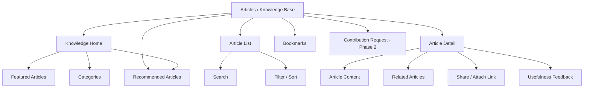
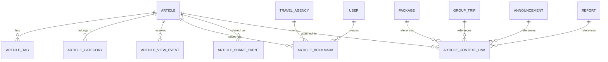

# TA PRD 14 - Articles / Knowledge Base

| Field | Value |
|---|---|
| Product | UmrahHaji.com Travel Agency Portal - Articles / Knowledge Base |
| Version | v1.0 |
| Platform | Responsive Web Platform |
| Scope | Travel Agency Portal / Agency Workspace |
| Status | Draft |
| Prepared by | Product / UI/UX Team |
| Last Updated | 9 June 2026 |

---

## 1. Product Summary

Articles / Knowledge Base is a curated content library for Travel Agency users to access official guidance, operational references, religious education, travel preparation content, customer service references, and platform usage guides.

For Travel Agency Portal, the module is primarily a read-only knowledge and reference workspace. Article creation, publishing, review, SEO management, and public content governance are owned by Admin Panel in Phase 1.

This module helps agency teams answer customer questions, prepare jamaah, understand platform workflows, and share approved educational content through packages, group trips, announcements, and support responses.

## 2. Relationship With Existing PRDs

| Module | Relationship |
|---|---|
| Master PRD - Travel Agency Portal | Defines Articles / Knowledge Base as a P2 module |
| TA PRD 01 - Dashboard | Can show featured, recent, or recommended articles |
| TA PRD 02 - Agency Profile & Verification Status | Verification guidance may link to knowledge articles |
| TA PRD 03 - Team & Roles | Controls article access, bookmarks, sharing, and contribution request permissions |
| TA PRD 04 - Package Management | Package preparation content can reference articles |
| TA PRD 05 - Booking Management | Booking detail can suggest payment, document, or departure preparation articles |
| TA PRD 06 - Jamaah Management | Jamaah profile/support context may link to educational content |
| TA PRD 07 - Group Trip Management | Group trip briefing can attach relevant preparation articles |
| TA PRD 08 - Mutawwif Assignment | Mutawwif guide references can link to religious or operational articles |
| TA PRD 09 - Documents & Services | Document and service help articles can support jamaah preparation |
| TA PRD 10 - Finance Management | Invoice/payment guidance can link to official help articles |
| TA PRD 11 - Reports / Support | Support responses may reference knowledge base articles |
| TA PRD 13 - Announcements | Agency may share approved article links inside announcements |
| Admin Panel Articles Management | Admin creates, edits, publishes, archives, and governs official article content |

## 3. Objective

Provide Travel Agencies with a trusted source of platform-approved knowledge that can be searched, read, bookmarked, shared, and referenced without giving agencies unrestricted publishing control in Phase 1.

## 4. Goals

1. Allow Travel Agency users to browse and search published articles.
2. Support categories, tags, featured articles, read time, and related content.
3. Help agency teams find operational, customer service, religious, document, payment, and trip preparation references.
4. Allow agency users to bookmark/save articles for internal use.
5. Allow agency users to share approved article links through announcements, support replies, package preparation, and group trip briefings.
6. Track article views, shares, bookmarks, and usefulness signals at an aggregated level.
7. Keep official content ownership under Admin Panel in Phase 1.
8. Provide optional article contribution/request workflow in Phase 2.

## 5. Non-Goals

1. This module does not allow Travel Agencies to publish official articles in Phase 1.
2. This module does not replace Announcements, which are short broadcast messages.
3. This module does not replace Reports / Support, which handles cases and disputes.
4. This module does not provide public blog SEO management to Travel Agency users in Phase 1.
5. This module does not allow agencies to edit platform official content.
6. This module does not support public comments in Phase 1.
7. This module does not provide paid content subscription in Phase 1.
8. This module does not expose draft, scheduled, archived, or internal Admin articles unless explicitly permitted.

## 6. Users and Roles

| Role | Access Level |
|---|---|
| Agency Owner | View, bookmark, share, export reference links, and request article contribution if enabled |
| Agency Admin | View, bookmark, share, and manage agency saved articles |
| Operations Staff | View and share operational/trip preparation articles |
| Customer Service | View and share support/help articles |
| Sales / Booking Staff | View and share package and booking preparation articles |
| Finance Staff | View finance/payment-related help articles |
| Mutawwif Coordinator | View religious, itinerary, mutawwif, and trip guidance articles |
| Marketing Staff | View and share approved public articles; submit contribution request if enabled |
| Auditor | View article access history if permission is granted |
| Platform Admin | Owns article content lifecycle from Admin Panel |

## 7. Permission Rules

| Permission | Description |
|---|---|
| View Articles | View published and accessible articles |
| Search Articles | Search by title, excerpt, category, tag, or keyword |
| Bookmark Article | Save article to agency/user bookmark list |
| Share Article Link | Copy/share approved article link |
| Attach Article to Announcement | Add article link to announcement if allowed |
| Attach Article to Package/Trip | Reference article in package or group trip preparation content |
| View Article Analytics | View limited agency-level article usage metrics |
| Request Article Contribution | Submit article idea/request in Phase 2 |
| Export Article Links | Export selected article links/references |

Rules:

1. Travel Agency users can view only published and accessible articles.
2. Platform-controlled articles cannot be edited by Travel Agency.
3. Internal Admin-only articles must not appear in Travel Agency Portal.
4. Sharing permission applies only to articles with shareable visibility.
5. Agency-specific bookmarks do not change public article content.
6. Contribution request does not publish content automatically.

## 8. Product Positioning

Articles / Knowledge Base is different from Announcements and Reports.

| Module | Purpose | User Behavior |
|---|---|---|
| Articles / Knowledge Base | Educational and reference content | User searches or reads voluntarily |
| Announcements | Short operational broadcast | User receives targeted message |
| Reports / Support | Issue or support case | User submits or tracks a case |
| Testimonials | Feedback and review content | User reviews service quality |

Rules:

1. Use Articles for reusable educational/reference content.
2. Use Announcements for timely notices and operational updates.
3. Use Reports / Support for issues requiring action or investigation.
4. Articles may be linked from announcements and support responses.

## 9. Key Definitions

| Term | Definition |
|---|---|
| Article | Published educational or reference content |
| Knowledge Base | Searchable library of official articles |
| Category | Primary content grouping such as Umrah Fiqh, Hajj Fiqh, Documents, Health, Platform Guide |
| Tag | Secondary keyword used for search and recommendation |
| Featured Article | Article highlighted by Admin |
| Related Article | Suggested article connected by category/tag/context |
| Bookmark | Article saved by user or agency |
| Shareable Link | Approved article URL that can be shared with jamaah or staff |
| Contribution Request | Agency request or draft idea submitted for Admin review in Phase 2 |

## 10. Information Architecture

## 11. Navigation Entry Points

| Entry Point | Behavior |
|---|---|
| Articles / Knowledge Base menu | Opens knowledge home or article list |
| Dashboard featured widget | Opens selected article |
| Package detail | Suggests related preparation articles |
| Group Trip detail | Suggests briefing and travel preparation articles |
| Jamaah detail | Suggests help articles based on missing document/payment/trip context |
| Documents & Services | Opens document/service guidance article |
| Finance detail | Opens payment/invoice explanation article |
| Reports / Support response | Allows staff to attach relevant article link |
| Announcement create | Allows staff to insert approved article link |

## 12. Content Categories

Recommended categories:

| Category | Description |
|---|---|
| Platform Guide | How to use UmrahHaji.com features |
| Agency Operations | Operational SOPs and workflow guidance |
| Booking & Package | Package, booking, passenger, and departure preparation |
| Documents & Visa | Passport, visa, vaccination, photo, document requirements |
| Payment & Finance | Invoice, payment terms, refund, commission, and receipt guidance |
| Umrah Fiqh | Umrah religious guidance and ritual education |
| Hajj Fiqh | Hajj religious guidance and ritual education |
| Haram & Madinah Info | Mosque, city, ziyarah, transport, and local guidance |
| Health & Safety | Travel health, emergency, elderly, medication, and safety tips |
| Mutawwif & Guidance | Mutawwif coordination and jamaah guidance references |
| FAQ | Frequently asked operational or customer questions |

Rules:

1. Category list is managed by Admin Panel.
2. Travel Agency can filter by active categories only.
3. Religious/fiqh content should be treated as official platform content and reviewed by qualified reviewer before publish.
4. Sensitive legal, medical, or religious guidance should show disclaimer or reviewer/source metadata.

## 13. Article Visibility Model

| Visibility | Travel Agency Access |
|---|---|
| Public Published | Visible and shareable |
| Agency Portal Published | Visible to Travel Agency users only |
| Role-Restricted Published | Visible only to permitted agency roles |
| Admin Internal | Not visible |
| Draft | Not visible |
| Scheduled | Not visible until publish date/time |
| Archived | Not visible in standard list |

Rules:

1. Travel Agency Portal should not expose draft or scheduled content.
2. Public articles may be shared with jamaah if shareable.
3. Internal agency-only articles may be shared only within agency portal.
4. Archived articles should show unavailable state if opened from old link.

## 14. Article List Requirements

Recommended list/card fields:

| Field | Description |
|---|---|
| Featured Image | Thumbnail generated by Admin content |
| Title | Article title |
| Excerpt | Short summary |
| Category | Primary category |
| Tags | Searchable labels |
| Author / Reviewer | Author name and optional reviewer for official content |
| Published Date | Date article became available |
| Updated Date | Last content update date |
| Read Time | Estimated read time |
| Featured Badge | Indicates highlighted content |
| Access Badge | Public, Agency Only, Role Restricted |
| Actions | View, Bookmark, Share, Attach Link |

Filters:

| Filter | Options |
|---|---|
| Category | Active categories |
| Tag | Active tags |
| Content Type | Article, FAQ, Guide, Checklist |
| Access | Public, Agency Only, Role Restricted |
| Featured | Featured, Not Featured |
| Date | Latest, Oldest, Custom Range |
| Read Time | Under 3 min, 3-7 min, Over 7 min |

Sort options:

1. Latest.
2. Most Viewed.
3. Most Shared.
4. Most Bookmarked.
5. Recommended.
6. Title A-Z.

## 15. Search Requirements

Search should support:

1. Title.
2. Excerpt.
3. Category.
4. Tags.
5. Article body keywords.
6. Author/reviewer.
7. Related context such as passport, visa, payment, departure, itinerary, umrah, hajj, mutawwif.

Search behavior:

1. Show empty state when no result is found.
2. Highlight matched terms in title/excerpt when possible.
3. Support typo-tolerant search in Phase 2.
4. Prioritize exact title/category/tag match.
5. Role-restricted articles must not appear if user lacks permission.

## 16. Article Detail Requirements

Article Detail should show:

1. Title.
2. Excerpt.
3. Category and tags.
4. Author and reviewer/source metadata if available.
5. Published date and updated date.
6. Read time.
7. Featured image.
8. Content body.
9. Related articles.
10. Bookmark action.
11. Share/copy link action.
12. Attach link to announcement/support/package/trip action if allowed.
13. Usefulness feedback: Helpful / Not Helpful.
14. Disclaimer if legal, medical, or religious guidance is present.

Rules:

1. Content must be rendered from sanitized HTML or structured content blocks.
2. Article detail should not expose unpublished revisions.
3. Shareable link should respect article visibility.
4. If article is role-restricted, link should require authenticated access.
5. Article should remain readable on mobile.

### 16.1 Disclaimer and Reviewer Metadata

| Content Type | Required Metadata | Disclaimer Rule |
|---|---|---|
| Religious / fiqh | Reviewer name, reviewer role, last reviewed date | State that article is educational guidance and may follow platform-approved reference |
| Health & safety | Reviewer/source, last reviewed date | State that content does not replace professional medical advice |
| Legal / compliance | Source/reviewer, jurisdiction if applicable | State that requirements may change and agency should verify current regulation |
| Platform guide | Product owner/update date | State that screens/features may change with platform updates |

Rules:
- High-sensitivity articles must show reviewer/source metadata on detail page.
- Outdated articles should show an update warning if last reviewed date exceeds configured threshold.
- Travel Agency users cannot remove disclaimers when sharing or attaching article links.

## 17. Bookmark and Saved Articles

Bookmarks help agency staff save useful references.

Bookmark scopes:

| Scope | Description |
|---|---|
| Personal Bookmark | Saved by individual user |
| Agency Bookmark | Saved for agency team if permission allows |
| Context Bookmark | Saved to package, group trip, or support case |

Rules:

1. Bookmark does not alter article content.
2. Agency bookmark requires permission.
3. Archived/unavailable article should remain in bookmark list with unavailable status.
4. Users can remove their own bookmarks.

## 18. Share and Attach Article Links

Travel Agency users can share approved articles instead of rewriting guidance manually.

Share destinations:

| Destination | Behavior |
|---|---|
| Announcement | Insert article link into announcement content |
| Package Preparation | Attach article to package guidance section |
| Group Trip Briefing | Attach article to group trip briefing/preparation section |
| Jamaah Support Response | Insert article link into support/report response |
| External Copy Link | Copy public URL only if article is public/shareable |

Rules:

1. Share action must respect article visibility.
2. Agency-only articles cannot be shared publicly.
3. Public link should not expose internal article ID if avoidable.
4. Share action should be logged for analytics.
5. If recipient lacks permission, link should show unavailable or login-required state.

### 18.1 Version Update Notice

When an article linked to a package, group trip, announcement, or support response is updated, the system should preserve context.

Rules:
- Shared article links should resolve to the latest published version unless a snapshot link is explicitly required.
- Package/trip/support records should store article ID, title, linked version, and linked timestamp.
- If a linked article receives a major update, users who attached it should see an update notice.
- Archived articles attached to historical records should remain visible as unavailable/archived, not disappear silently.
- Critical updates for legal, document, health, or fiqh content may trigger notification recommendation.

## 19. Contribution Request - Phase 2

In Phase 2, Travel Agency may request or propose an article topic. This is not direct publishing.

Recommended fields:

| Field | Type | Required | Validation | Notes |
|---|---|---:|---|---|
| Request Type | Select | Yes | New Article, Correction, Update, Translation Request | Defines review path |
| Suggested Title | Text Input | Yes | Max 150 chars | Short proposed title |
| Category | Select | Yes | Active category | Requested category |
| Problem / Reason | Textarea | Yes | Max 1,000 chars | Why this article is needed |
| Suggested Content / Notes | Textarea | Optional | Max 3,000 chars | Optional draft idea |
| Related Package/Trip | Select | Optional | Agency scoped | Context for request |
| Attachment | Upload | Optional | PDF/image limits | Supporting reference only |
| Priority | Select | Optional | Normal, Important | Urgent requires justification |

Rules:

1. Contribution request creates a review item for Admin Panel.
2. Request does not publish content.
3. Admin may approve, reject, merge, or request revision.
4. Religious/fiqh content must require qualified review before publish.

## 20. Media and Attachment Policy

Travel Agency users do not upload article media in Phase 1. Media is managed by Admin Panel. For Phase 2 contribution request attachments:

| File Type | Allowed Format | Max Size | Max Count | Server Handling |
|---|---|---:|---:|---|
| Reference image | JPG, JPEG, PNG, WEBP | 2 MB/file | 3 per request | Compress, strip metadata, generate thumbnail |
| Reference document | PDF | 5 MB/file | 3 per request | Scan and store in object storage |
| Video | Not allowed Phase 1/2 request MVP | 0 | 0 | Use external link if needed |

Rules:

1. Store files in object storage with signed URLs.
2. Do not store contribution attachments on the application server.
3. Validate file extension and MIME type.
4. Scan for malware.
5. Never load full media in article list.
6. Inline article images are owned and optimized by Admin Panel.

## 21. Article Analytics for Travel Agency

Travel Agency analytics should be limited and useful.

Recommended metrics:

| Metric | Description |
|---|---|
| Views by Agency Users | Number of article views by agency users |
| Shares from Agency | Count of article links shared by agency users |
| Bookmarks | Personal and agency bookmark counts |
| Helpful Rate | Helpful vs Not Helpful feedback |
| Top Categories | Most viewed categories for the agency |
| Top Articles | Most read articles by agency staff |
| Context Attachments | Number of times article is attached to announcement/package/trip/support |

Rules:

1. Travel Agency sees only its own usage metrics.
2. Platform-wide article analytics are controlled by Admin Panel.
3. Individual reader tracking should be permission-controlled.
4. Analytics should not expose other agencies' behavior.

## 22. Functional Requirements

| ID | Requirement | Priority |
|---|---|---|
| TA-ART-001 | System shall show published and accessible articles to Travel Agency users | P2 |
| TA-ART-002 | System shall hide draft, scheduled, archived, and Admin-internal articles | P1 |
| TA-ART-003 | System shall support search by title, excerpt, category, tag, and body keywords | P2 |
| TA-ART-004 | System shall support filters by category, tag, access, featured flag, date, and read time | P2 |
| TA-ART-005 | System shall show article detail with title, content, author/reviewer, category, tags, dates, and read time | P2 |
| TA-ART-006 | System shall show related articles on article detail | P2 |
| TA-ART-007 | System shall allow users to bookmark articles | P2 |
| TA-ART-008 | System shall support agency-level bookmarks if permission is granted | P2 |
| TA-ART-009 | System shall allow sharing article links based on article visibility | P2 |
| TA-ART-010 | System shall allow attaching article link to announcement, package, group trip, or support response if permitted | P2 |
| TA-ART-011 | System shall record view, share, bookmark, and helpful feedback events | P2 |
| TA-ART-012 | System shall prevent Travel Agency users from editing official article content | P1 |
| TA-ART-013 | System shall show disclaimers for sensitive legal, medical, or religious guidance when configured | P1 |
| TA-ART-014 | System shall show unavailable state for archived or restricted articles | P2 |
| TA-ART-015 | System shall support article contribution request in Phase 2 | P3 |
| TA-ART-016 | System shall enforce upload limits for contribution request attachments | P3 |
| TA-ART-017 | System shall respect role-based visibility for restricted articles | P1 |
| TA-ART-018 | System shall not expose other agency article analytics | P1 |
| TA-ART-019 | System shall render article content safely from sanitized content blocks or sanitized HTML | P1 |
| TA-ART-020 | System shall support mobile-friendly article reading experience | P2 |

## 23. Business Rules

1. Admin Panel owns article creation, editing, publishing, scheduling, archiving, and SEO metadata in Phase 1.
2. Travel Agency Portal consumes only published accessible content.
3. Travel Agency cannot edit official content.
4. Public articles can be shared externally if shareable flag is true.
5. Agency-only articles require login and agency permission.
6. Role-restricted articles require matching role permission.
7. Bookmarks and shares must not bypass visibility rules.
8. Religious/fiqh articles should display reviewer/source metadata when available.
9. Medical/legal guidance should display appropriate disclaimer.
10. Article contribution request is review-only and never auto-published.

## 24. Recommended Content Use Cases

| Use Case | Example |
|---|---|
| Jamaah preparation | What to prepare before Umrah departure |
| Document guidance | Passport validity, visa photo, vaccination document |
| Payment explanation | How deposit and installment terms work |
| Group trip briefing | Airport meeting point, luggage rules, itinerary overview |
| Mutawwif guidance | Role of mutawwif and how jamaah should coordinate |
| Religious education | Ihram, tawaf, sa'i, tahallul, hajj manasik |
| Health and safety | Medication, elderly support, heat management, emergency guidance |
| Support response | Link article when answering common questions |
| Agency training | Internal guide for package creation, booking handling, document process |

## 25. Notifications and Recommendations

| Event | Recipient | Behavior |
|---|---|---|
| New featured article published | Agency users if enabled | Show dashboard/widget notification |
| Article recommended for package/trip | Agency staff | Show suggestion in context |
| Article updated | Users who bookmarked/shared it | Optional notification if major update |
| Contribution request status changed | Request submitter | Phase 2 notification |

Rules:

1. Article notifications should be low-frequency.
2. Do not send every article publish event as push/email by default.
3. Contextual recommendations are preferred over broadcast notifications.
4. Agency users can manage article notification preference in Settings if enabled.

## 26. Data Model Summary

Core entities:

| Entity | Notes |
|---|---|
| Article | Published content owned by Admin Panel |
| Article Category | Primary grouping |
| Article Tag | Search/recommendation metadata |
| Article Bookmark | Saved article for user/agency/context |
| Article Share Event | Share or copy link tracking |
| Article Context Link | Link between article and announcement/package/trip/support |
| Article View Event | View analytics event |
| Contribution Request | Phase 2 request from Travel Agency |

## 27. Edge Cases

| Case | Expected Behavior |
|---|---|
| Article archived after being shared | Show unavailable state or redirect based on Admin setting |
| User lacks permission for article | Show access restricted state |
| Public link opened by unauthenticated user | Open public article only if public/shareable |
| Agency-only link opened externally | Require login and agency authorization |
| Bookmark article becomes unavailable | Keep bookmark with unavailable label |
| Search returns no result | Show empty state and suggested categories |
| Article has outdated content | Show updated date and allow correction request in Phase 2 |
| Article contains sensitive guidance | Show disclaimer and reviewer/source metadata |
| Contribution request attachment too large | Reject upload and show max size guidance |
| User tries to edit official article | Block and offer contribution/correction request if enabled |

## 28. Responsive Behavior

Desktop:

1. Use article grid/list with filters and search.
2. Article detail can use main content column with side panel for metadata, related articles, and actions.
3. Bookmark and share actions should remain visible.

Tablet:

1. Use two-column cards where space allows.
2. Collapse metadata into compact section.
3. Related articles can appear below article body.

Mobile:

1. Use single-column article cards.
2. Filters should open in bottom sheet.
3. Article body should use readable typography and spacing.
4. Long tables inside articles should be horizontally scrollable or converted into cards.
5. Share/bookmark actions should remain easy to access.

## 29. Acceptance Criteria

1. Travel Agency user can view published accessible articles.
2. Draft, scheduled, archived, and Admin-internal articles are hidden.
3. User can search and filter article list.
4. User can open article detail and read content clearly on desktop, tablet, and mobile.
5. User can bookmark articles based on permission.
6. User can share or attach only articles allowed by visibility rules.
7. Article link attached to announcement/package/trip/support respects access control.
8. Travel Agency cannot edit official article content.
9. Sensitive articles show configured disclaimer.
10. Agency can view only its own article usage analytics.
11. Contribution request, if enabled, does not publish content automatically.
12. Upload limits are enforced for contribution request attachments.

## 30. Phase 1 Scope

1. View published articles.
2. Search and filter articles.
3. Article detail reading experience.
4. Category and tag display.
5. Featured and related articles.
6. Bookmark articles.
7. Share/copy public article link.
8. Attach article link to announcement/support/package/trip where enabled.
9. Basic article usage analytics.
10. Access control for public, agency-only, and role-restricted content.

## 31. Phase 2 Enhancements

1. Article contribution request workflow.
2. Correction/update request workflow.
3. Multilingual article variants.
4. Agency-specific recommended reading lists.
5. Article templates for jamaah preparation.
6. Advanced recommendation engine.
7. Usefulness feedback analytics.
8. Public article contribution by verified agencies with review.
9. Article collections/playlists for group trip preparation.
10. AI-assisted article search and summarization.

## 32. Open Questions

1. Should Travel Agency users be allowed to share article links directly with jamaah in Phase 1?
2. Should public article URLs live under `/articles/{slug}` or a category-based route?
3. Should religious/fiqh articles always require visible reviewer/source metadata?
4. Should agency bookmarks be shared across all staff by default or personal by default?
5. Should article recommendations be driven by package category, group trip itinerary, or jamaah missing requirements first?
