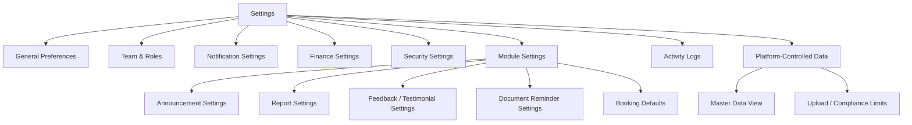
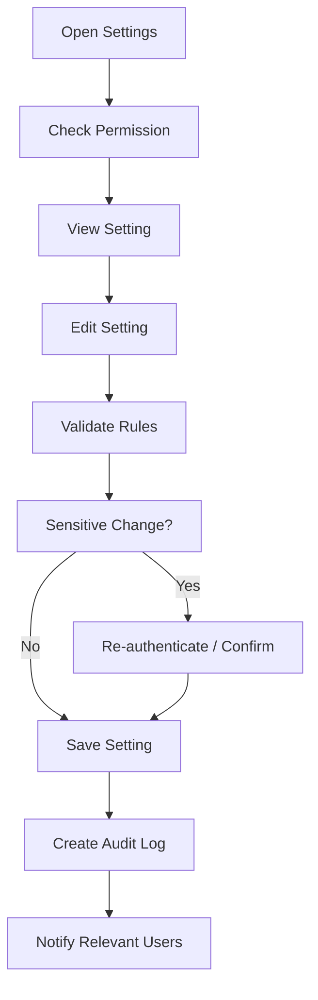
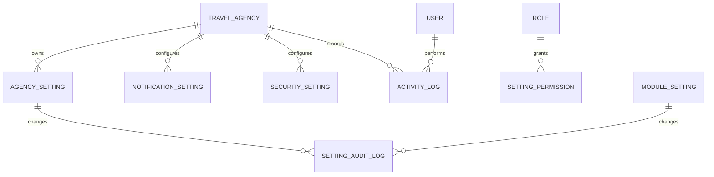

# TA PRD 15 - Settings

| Field | Value |
|---|---|
| Product | UmrahHaji.com Travel Agency Portal - Settings |
| Version | v1.0 |
| Platform | Responsive Web Platform |
| Scope | Travel Agency Portal / Agency Workspace |
| Status | Draft |
| Prepared by | Product / UI/UX Team |
| Last Updated | 9 June 2026 |

---

## 1. Product Summary

Settings is the agency-level configuration area for Travel Agency Portal. It allows authorized agency users to manage agency preferences, notification settings, security preferences, finance defaults, announcement defaults, report settings, activity logs, and selected module configurations that are not fully controlled by Platform Admin.

Settings must not become an uncontrolled catch-all module. It should clearly separate:

1. Agency-controlled settings, which Travel Agency can edit.
2. Platform-controlled settings, which Travel Agency can only view.
3. Permission-controlled settings, which require Agency Owner/Admin or specific role access.
4. Module-specific settings, which are linked from Settings but governed by the related module PRD.

## 2. Relationship With Existing PRDs

| Module | Relationship |
|---|---|
| Master PRD - Travel Agency Portal | Defines Settings as a P1 module |
| TA PRD 01 - Dashboard | Dashboard widgets and quick actions respect settings and permissions |
| TA PRD 02 - Agency Profile & Verification Status | Agency identity and verification data are linked but not fully editable here |
| TA PRD 03 - Team & Roles | Team members, roles, permissions, sessions, and security rules are managed here or linked from here |
| TA PRD 04 - Package Management | Package defaults, labels, and visibility rules may reference settings |
| TA PRD 05 - Booking Management | Booking defaults, cancellation terms, and notification behavior may reference settings |
| TA PRD 06 - Jamaah Management | Invitation defaults and notification preferences are linked |
| TA PRD 07 - Group Trip Management | Group trip defaults and notification behavior are linked |
| TA PRD 08 - Mutawwif Assignment | Assignment notification and approval behavior may reference settings |
| TA PRD 09 - Documents & Services | Document reminder and upload policy view may reference platform settings |
| TA PRD 10 - Finance Management | Invoice, tax, payment, reminder, and finance settings are linked and permission-controlled |
| TA PRD 11 - Reports / Support | Report categories, notification, and auto-assignment settings may be linked |
| TA PRD 12 - Testimonials | Feedback collection and low-rating alert settings may be linked |
| TA PRD 13 - Announcements | Announcement approval, channel, and delivery defaults may be linked |
| TA PRD 14 - Articles / Knowledge Base | Article notification and bookmark preferences may be linked |
| Admin Panel Settings | Platform Admin controls global settings, master data, compliance, payment gateway, and security policy |

## 3. Objective

Allow Travel Agencies to configure their workspace safely while preserving platform governance, security, auditability, and consistency across modules.

## 4. Goals

1. Provide a centralized place for agency preferences and module settings.
2. Clearly show which settings are editable by agency and which are platform-controlled.
3. Support role-based access for sensitive settings.
4. Provide notification preferences for agency staff and customer-facing events.
5. Support finance defaults if agency has permission.
6. Support security settings such as MFA requirement, session visibility, and password policy view.
7. Provide activity logs for key agency actions.
8. Support export and audit-friendly visibility.
9. Avoid duplication by linking to module-specific settings when detail belongs to another PRD.

## 5. Non-Goals

1. This module does not allow Travel Agency to override platform global policy.
2. This module does not replace Team & Roles PRD for detailed permission matrix.
3. This module does not replace Finance Management for detailed invoice/payment configuration.
4. This module does not allow Travel Agency to configure payment gateway credentials directly in Phase 1 unless platform policy allows.
5. This module does not expose other agencies' settings or logs.
6. This module does not provide developer/API settings in Phase 1.
7. This module does not allow disabling required security or compliance controls.
8. This module does not change verified legal agency data without re-verification workflow.

## 6. Users and Roles

| Role | Access Level |
|---|---|
| Agency Owner | Full access to agency settings, security, finance settings, team settings, and logs |
| Agency Admin | Manage settings based on granted permissions |
| Operations Staff | View operational defaults and manage limited module settings if allowed |
| Sales / Booking Staff | View booking/package defaults and notification preferences |
| Finance Staff | Manage finance settings if permission is granted |
| Customer Service | Manage support/announcement/customer notification defaults if allowed |
| Marketing Staff | Manage content/announcement/article preferences if allowed |
| Auditor | View settings and activity logs only |
| Platform Admin | Controls global policy and can view/support agency settings from Admin Panel |

## 7. Permission Rules

| Permission | Description |
|---|---|
| View Settings | View accessible settings |
| Manage General Settings | Edit agency preferences and workspace defaults |
| Manage Notification Settings | Edit agency notification preferences |
| Manage Finance Settings | Edit invoice, tax, payment, and reminder defaults if allowed |
| Manage Security Settings | Configure MFA/session/security preferences if allowed |
| Manage Team & Roles | Add/edit users, roles, and permissions |
| Manage Module Settings | Configure module-specific defaults |
| View Activity Logs | View agency activity history |
| Export Activity Logs | Export logs based on permission |
| View Platform-Controlled Settings | View read-only global/platform settings |

Rules:

1. Agency Owner has full settings access by default.
2. Agency Admin access depends on role permissions.
3. Finance and security settings require explicit permission.
4. Auditor can view but not mutate settings.
5. Platform-controlled settings must be read-only for Travel Agency.
6. Every settings mutation must create audit log entry.

## 8. Setting Ownership Model

| Ownership Type | Editable By Travel Agency | Example |
|---|---:|---|
| Agency-Controlled | Yes | Preferred timezone, default notification recipients, invoice notes |
| Permission-Controlled | Yes, if authorized | Finance settings, security preferences, role management |
| Platform-Controlled | No | Payment gateway provider, required MFA policy, upload max limits |
| Verification-Controlled | Limited | Legal agency name, license data, verified documents |
| Module-Controlled | Linked | Report settings, announcement settings, testimonial settings |

Rules:

1. Settings page must label read-only fields clearly.
2. If a setting is locked by platform policy, show reason.
3. If a setting requires verification, direct user to Agency Profile & Verification Status.
4. If a setting belongs to another module, Settings may deep-link to the module-specific settings page.

### 8.1 Settings Ownership Registry

This registry is the shared reference for module teams so settings are not duplicated or edited from the wrong place.

| Setting Area | Source / Owner | Editable In Settings | Related PRD | Rule |
|---|---|---:|---|---|
| Agency legal name, license, verified documents | Agency Profile + Admin verification | Limited | TA PRD 02 | Changes may trigger re-verification |
| Agency staff, roles, permissions | Team & Roles | Link / summary only | TA PRD 03 | Detailed role editing stays in Team & Roles |
| Package default terms | Package Management | Link / summary | TA PRD 04 | Package-specific values override global defaults |
| Booking default status/cancellation terms | Booking Management | Link / summary | TA PRD 05 | Booking snapshot preserves terms used at booking time |
| Document reminder timing | Documents & Services | Yes if permitted | TA PRD 09 | Must respect notification rate limits |
| Finance invoice/payment/tax settings | Finance Management | Yes if permitted | TA PRD 10 | Financial changes must be audited |
| Report routing/SLA/auto-assign | Reports / Support | Link / summary | TA PRD 11 | Operational rules stay in Reports module |
| Testimonial/feedback request settings | Testimonials | Link / summary | TA PRD 12 | Public moderation remains platform-controlled |
| Announcement approval/default channels | Announcements | Link / summary | TA PRD 13 | Delivery limits and quiet hours follow announcement rules |
| Article preferences/bookmarks | Articles / Knowledge Base | Limited | TA PRD 14 | Content publishing is Admin-controlled |
| Upload max limits and storage policy | Platform | No | Master PRD | Read-only platform policy |
| Payment gateway provider and settlement automation | Platform/Admin Finance | No by default | TA PRD 10 | Phase 1 supports manual settlement preparation |

Rules:
- Settings can show shortcuts and summaries, but each module remains the source for its own operational rules.
- If a setting affects historical records, the module must store snapshot/version history.
- If a setting affects customer communication, notification preview or approval may be required.

## 9. Information Architecture

## 10. Navigation Entry Points

| Entry Point | Behavior |
|---|---|
| Settings menu | Opens settings overview |
| Profile menu | Opens user/account settings |
| Dashboard warning | Opens related settings needing attention |
| Finance settings shortcut | Opens finance settings if permitted |
| Team & Roles menu | Opens team/role settings |
| Notification center | Opens notification preferences |
| Module settings link | Opens specific module setting section |
| Activity log shortcut | Opens filtered activity logs |

## 11. Settings Overview

Settings Overview should show grouped setting cards.

Recommended cards:

| Card | Description |
|---|---|
| General Preferences | Timezone, language, display preferences, default agency contact |
| Team & Roles | Users, roles, permissions, invitations |
| Notifications | Email, WhatsApp, in-app event preferences |
| Finance | Invoice defaults, payment terms, tax, reminders, accepted methods |
| Security | MFA, sessions, login alerts, password policy view |
| Module Settings | Announcement, Reports, Testimonials, Booking, Documents |
| Activity Logs | Recent settings and user actions |
| Platform-Controlled Data | Read-only master data, limits, compliance rules |

Rules:

1. Cards should show status summary and last updated timestamp.
2. Locked cards should show lock indicator and reason.
3. Hidden cards should not appear if user lacks view permission.

## 12. General Preferences

General Preferences configure agency workspace defaults.

| Field | Type | Required | Editable | Notes |
|---|---|---:|---:|---|
| Default Timezone | Select | Yes | Yes | Default from agency country |
| Default Language | Select | Yes | Yes | English/Malay/Indonesian if supported |
| Default Currency | Select | Yes | Limited | Usually MYR, platform-controlled options |
| Date Format | Select | Yes | Yes | Example: DD MMM YYYY |
| Time Format | Select | Yes | Yes | 12-hour or 24-hour |
| Default Country Code | Select | Yes | Yes | For phone input defaults |
| Agency Support Email | Email Input | Yes | Yes | Customer-facing if allowed |
| Agency Support Phone | Phone Input | Optional | Yes | Customer-facing if allowed |
| Default PIC | User Select | Optional | Yes | Used for notifications/escalations |
| Working Days | Multi-select | Optional | Yes | Used for SLA/reminders |
| Working Hours | Time Range | Optional | Yes | Used for support availability |

Rules:

1. Default timezone affects scheduling, reminders, and exports.
2. Currency options are controlled by platform.
3. Support contact should not override verified legal information.
4. Working hours do not block urgent notifications.

## 13. Team & Roles Linkage

Team and Roles may be displayed as a Settings section or linked to TA PRD 03.

Core actions:

1. View team members.
2. Invite agency user.
3. Assign role.
4. Edit role permissions.
5. Suspend/reactivate user.
6. View user sessions if enabled.
7. View invitation history.

Rules:

1. Detailed team and permission requirements follow TA PRD 03 - Team & Roles.
2. Settings should not duplicate the full permission matrix.
3. Changes to role permissions must be logged.
4. Agency Owner role cannot be removed if it would leave agency without owner.

## 14. Notification Settings

Notification Settings configure agency and customer-facing communication preferences.

### 14.1 Agency Staff Notification Preferences

| Event | Recommended Default | Channels |
|---|---|---|
| New booking | On | In-app, email |
| Booking status changed | On | In-app |
| Payment received | On for Finance/Admin | In-app, email |
| Overdue payment | On for Finance/Admin | In-app, email |
| Document submitted | On for Operations/CS | In-app |
| Missing document reminder | On | In-app, email/WhatsApp if enabled |
| Group trip schedule change | On | In-app, email |
| Mutawwif assignment changed | On | In-app |
| New report/support case | On | In-app, email |
| Low rating/testimonial alert | On for Owner/Admin/CS | In-app, email |
| Platform announcement | On | In-app, email if important |

### 14.2 Customer-Facing Notification Defaults

| Event | Recommended Default | Notes |
|---|---|---|
| Invitation sent | On | Email/WhatsApp based on available contact |
| Booking confirmation | On | In-app/email |
| Payment reminder | On | Based on Finance settings |
| Document reminder | On | Avoid sensitive details in preview |
| Group trip update | On | In-app and WhatsApp if enabled |
| Announcement sent | On | Based on announcement channel |
| Feedback request | On | End-of-trip strongly prompted, daily optional |

Rules:

1. In-app notification is default baseline.
2. Email and WhatsApp depend on integration and recipient contact availability.
3. Notification preview must not expose sensitive data.
4. User opt-out must be respected for non-critical messages.
5. Critical operational notices may follow platform policy.
6. Notification settings should not disable legally required notices.

## 15. Finance Settings Linkage

Finance settings detail belongs to TA PRD 10 - Finance Management. Settings may provide a summary and shortcut.

Common finance settings:

| Setting | Editable | Notes |
|---|---:|---|
| Invoice Prefix | Yes if permitted | Agency-specific numbering |
| Next Invoice Number | Limited | Must preserve uniqueness |
| Payment Terms | Yes if permitted | Default due days |
| Deposit Type | Yes if permitted | Amount or percentage |
| Default Deposit Amount | Yes if permitted | Used in package/booking |
| Tax Settings | Limited | Based on platform and country rules |
| Accepted Payment Methods | Limited | Must match enabled platform methods |
| Reminder Schedule | Yes if permitted | Example: 7, 3, 1 days before due |
| Default Invoice Notes | Yes if permitted | Customer-facing |
| Finance Notification Recipients | Yes if permitted | Finance/Admin users |

Rules:

1. Payment gateway provider and settlement rules are platform-controlled unless explicitly delegated.
2. Finance settings require Finance/Admin/Owner permission.
3. Changes to tax/payment settings must be logged.
4. Invoice number changes must prevent duplicates.

## 16. Security Settings

Security Settings protect agency workspace access.

| Setting | Editable | Notes |
|---|---:|---|
| MFA Requirement | Limited | Platform may force MFA for owner/admin |
| Password Policy | Read-only or limited | Platform-controlled minimums |
| Session Timeout | Limited | Cannot be weaker than platform minimum |
| Login Alerts | Yes | Notify owner/admin for suspicious login |
| Allowed Login Devices | Phase 2 | Device trust policy |
| Active Sessions | View/revoke if permitted | User/account level |
| IP Allowlist | Phase 2 | Enterprise feature |
| Account Lockout Policy | Read-only | Platform-controlled |
| Data Export Permission | Permission-controlled | Managed via Team & Roles |

Rules:

1. Platform minimum security policy cannot be weakened.
2. Agency may choose stricter settings if allowed.
3. Owner/Admin changes to security settings require audit log.
4. Sensitive actions may require re-authentication.
5. Session revocation should notify affected user.

## 17. Module Settings

Settings should link to module-specific settings without duplicating all details.

| Module Setting | Related PRD | Example |
|---|---|---|
| Booking Defaults | TA PRD 05 | Default booking status, cancellation terms |
| Document Reminder Settings | TA PRD 09 | Missing document reminder timing |
| Report Settings | TA PRD 11 | Category defaults, auto-assignment rules |
| Feedback/Testimonial Settings | TA PRD 12 | End-trip feedback timing, low rating alert |
| Announcement Settings | TA PRD 13 | Approval rules, default channels |
| Article Preferences | TA PRD 14 | Featured article notification, saved reading lists |

Rules:

1. Module-specific setting pages can be opened from Settings.
2. If user lacks permission, setting card should be hidden or read-only.
3. Platform-locked values should show lock reason.

## 18. Activity Logs

Activity Logs show audit records for agency actions.

Recommended columns:

| Column | Description |
|---|---|
| Date/Time | Action timestamp |
| User | Actor name, email, and role |
| Module | Related module |
| Action | Create, Update, Delete, Archive, Export, Login, Permission Change |
| Entity | Related record name/ID |
| Summary | Short readable description |
| IP / Device | If available and permitted |
| Status | Success, Failed, Reverted |
| Actions | View details, export if allowed |

Filters:

| Filter | Options |
|---|---|
| Module | All modules |
| Action Type | Create, Edit, Delete, Export, Login, Settings, Permission |
| User | Agency users |
| Date | All Time, Today, This Week, This Month, Custom Range |
| Status | Success, Failed |
| Sensitivity | Normal, Sensitive |

Rules:

1. Activity logs are read-only.
2. Sensitive logs require permission.
3. Export logs requires explicit permission.
4. Logs should not expose full sensitive payload values.
5. Old/new values for sensitive fields should be masked.

## 19. Platform-Controlled Data View

Travel Agency may need to see platform limits and master data, even if they cannot edit them.

Examples:

| Data | Editable by Travel Agency | Notes |
|---|---:|---|
| Upload file limits | No | Controlled by platform |
| Supported countries/cities | No | Master data |
| Supported airlines/hotels | No | Selected in Package/Trip flows |
| Payment gateway methods | No or limited | Platform-controlled |
| Commission rules | Limited | Depends on agreement |
| Required document types | No or limited | Platform-controlled |
| Security minimums | No | Platform-controlled |
| Notification provider availability | No | Platform-controlled |

Rules:

1. Show platform-controlled data as read-only.
2. Provide "request change" link only if Reports / Support supports it.
3. Do not allow local override that breaks package/trip/finance consistency.

## 20. Settings Change Flow

## 21. Functional Requirements

| ID | Requirement | Priority |
|---|---|---|
| TA-SET-001 | System shall show Settings overview based on user permissions | P1 |
| TA-SET-002 | System shall separate agency-controlled, platform-controlled, permission-controlled, and module-controlled settings | P1 |
| TA-SET-003 | System shall allow authorized users to edit general agency preferences | P1 |
| TA-SET-004 | System shall allow authorized users to manage notification settings | P1 |
| TA-SET-005 | System shall link Team & Roles settings to TA PRD 03 functionality | P1 |
| TA-SET-006 | System shall link Finance settings to TA PRD 10 functionality | P1 |
| TA-SET-007 | System shall allow authorized users to view and manage security settings where allowed | P1 |
| TA-SET-008 | System shall show platform-controlled settings as read-only with lock reason | P1 |
| TA-SET-009 | System shall create audit log for every settings mutation | P1 |
| TA-SET-010 | System shall require re-authentication or confirmation for sensitive changes | P1 |
| TA-SET-011 | System shall support activity log list with filters | P1 |
| TA-SET-012 | System shall support activity log export based on permission | P2 |
| TA-SET-013 | System shall mask sensitive values in logs | P1 |
| TA-SET-014 | System shall prevent Travel Agency from weakening platform security policy | P1 |
| TA-SET-015 | System shall prevent Travel Agency from overriding global platform master data | P1 |
| TA-SET-016 | System shall support module settings shortcuts for Announcements, Reports, Testimonials, Documents, and Booking | P1 |
| TA-SET-017 | System shall respect agency scope and never expose other agency settings | P1 |
| TA-SET-018 | System shall show last updated timestamp and actor for editable settings | P1 |
| TA-SET-019 | System shall notify relevant users for sensitive settings changes | P2 |
| TA-SET-020 | System shall provide unavailable/permission denied states for restricted settings | P1 |

## 22. Business Rules

1. Settings access is controlled by role permission.
2. Agency Owner must always retain full agency administration unless Platform Admin restricts the account.
3. Platform-controlled settings cannot be edited by Travel Agency.
4. Verified legal agency data changes may require re-verification.
5. Payment gateway, master data, upload max limits, and compliance rules are platform-controlled.
6. Finance and security changes require explicit permission.
7. Sensitive settings changes must be logged and may require re-authentication.
8. Settings changes should not retroactively alter historical booking, invoice, or trip records unless explicitly designed.
9. Module-specific settings should follow the related module PRD.
10. Activity logs are immutable from Travel Agency Portal.

## 23. Notification Rules

| Event | Recipient | Channel | Notes |
|---|---|---|---|
| Security setting changed | Agency Owner/Admin | In-app, email | Sensitive change |
| Finance setting changed | Agency Owner/Finance/Admin | In-app, email | Audit-sensitive |
| Role permission changed | Affected user and Owner/Admin | In-app, email | Based on TA PRD 03 |
| Notification setting changed | Actor and Owner/Admin if sensitive | In-app | Optional email |
| Platform policy changed | Agency Owner/Admin | In-app, email if important | Platform announcement may also be used |
| Activity log export performed | Agency Owner/Admin | In-app, email | Audit event |

Rules:

1. Notification preview must not expose sensitive values.
2. Security and finance changes should notify owner/admin.
3. Failed settings save should not trigger change notification.

## 24. Data Model Summary

Core entities:

| Entity | Notes |
|---|---|
| Agency Setting | General agency preferences |
| Notification Setting | Event/channel preferences |
| Security Setting | Security preferences and platform policy references |
| Finance Setting | Linked summary of finance defaults |
| Module Setting | Linked module-specific config |
| Activity Log | Immutable action history |
| Setting Audit Log | Before/after metadata for setting changes |

## 25. Edge Cases

| Case | Expected Behavior |
|---|---|
| User lacks permission | Show read-only or permission denied state |
| Platform locks setting | Show locked state and reason |
| User changes timezone | Future schedules use new timezone; existing scheduled items require confirmation |
| Invoice prefix duplicate risk | Block save and show validation error |
| Owner tries to remove own critical permission | Require confirmation or block if no other owner exists |
| Security setting weaker than platform minimum | Block save |
| Notification channel unavailable | Show disabled state and reason |
| Activity log export requested by unauthorized user | Block and log failed attempt |
| Verified agency data needs update | Redirect to Agency Profile verification change flow |
| Settings save fails | Keep previous value and show error state |

## 26. Responsive Behavior

Desktop:

1. Use sidebar/subsection navigation for settings categories.
2. Use grouped cards and tables for settings.
3. Activity logs can use table with filters.

Tablet:

1. Collapse settings navigation into tabs or dropdown.
2. Use two-column cards where possible.
3. Activity logs can use compact table or card mode.

Mobile:

1. Use single-column settings cards.
2. Move filters into bottom sheet.
3. Keep save/cancel actions sticky for long forms.
4. Use clear locked/read-only indicators.
5. Avoid showing dense activity log tables; use cards.

## 27. Acceptance Criteria

1. Authorized user can open Settings overview.
2. Settings page shows editable and locked settings clearly.
3. Unauthorized user cannot edit restricted settings.
4. Authorized user can update general preferences.
5. Authorized user can update notification settings.
6. Finance and security settings require correct permission.
7. Platform-controlled settings are read-only.
8. Sensitive changes create audit logs and may require confirmation.
9. Activity logs can be filtered.
10. Activity logs mask sensitive values.
11. Settings do not expose other agency data.
12. Module setting cards deep-link to the relevant module configuration.

## 28. Phase 1 Scope

1. Settings overview.
2. General preferences.
3. Notification settings.
4. Team & Roles shortcut/integration.
5. Finance settings shortcut/integration.
6. Security settings view and limited controls.
7. Module settings shortcuts.
8. Activity logs.
9. Read-only platform-controlled settings view.
10. Audit log for settings changes.

## 29. Phase 2 Enhancements

1. Advanced security controls such as IP allowlist and device trust.
2. API keys and webhook settings for enterprise agencies.
3. Advanced workflow approvals for settings changes.
4. Per-module custom templates.
5. Advanced notification routing by role and work schedule.
6. Custom branding/theme controls if platform allows.
7. Data retention preferences where legally allowed.
8. Automated settings change reports.
9. Multi-branch agency settings hierarchy.
10. Sandbox/test mode settings for training.

## 30. Open Questions

1. Should Settings be a single module page, or should Team & Roles and Finance remain separate top-level pages with Settings shortcuts?
2. Should Agency Owner be allowed to enforce MFA for all agency users even if platform does not require it?
3. Should Travel Agency be allowed to customize invoice prefix in Phase 1?
4. Should notification settings be agency-wide only, or support per-user overrides?
5. Should activity log retention be visible to Travel Agency, or controlled only by Platform Admin?
