# UmrahHaji.com Admin Panel - Product Requirements Document

Version: v1.0
Platform: Responsive Web Platform
Scope: Desktop Web, Tablet Web, Mobile Web
Status: Draft
Prepared by: Product / UI/UX Team
Last updated: 2 June 2026

> Phase 1 focuses on responsive web. Native Android and iOS applications are out of scope.


---

# Master PRD — UmrahHaji.com Admin Panel

## 1. Document Information

| Item | Description |
|---|---|
| Product Name | UmrahHaji.com Admin Panel |
| Document Type | Master PRD |
| Version | v1.0 |
| Prepared By | Product / UI/UX Team |
| Last Updated | 2 Juni 2026 |
| Status | Draft |
| Scope | Admin Panel / Back Office |

---

## 2. Product Overview

UmrahHaji.com Admin Panel is a responsive web-based platform that allows administrators to manage travel agencies, jamaah, mutawwif, packages, bookings, group trips, hotels, flights, itineraries, billing, commission, announcements, reports, and system settings.

The Admin Panel is designed as the operational back-office for UmrahHaji.com. It helps internal teams review travel agency applications, verify legal documents, manage operational data, track payments, monitor departures, and audit critical system actions.

This Master PRD serves as the parent document. Detailed requirements for each major module are documented separately in Module PRDs.

---

## 3. Goals & Objectives

1. Centralize travel agency management.
2. Support travel agency application review and verification workflows.
3. Manage jamaah data, documents, bookings, and payment records.
4. Manage packages, bookings, group trips, hotels, flights, mutawwif, and itineraries.
5. Track payments, billing, settlement, refund, and commission data.
6. Support approval, verification, notification, and audit workflows.
7. Provide responsive web access for desktop, tablet, and mobile browsers.
8. Protect sensitive data through role-based permissions.

---

## 4. Platform Scope

Phase 1 focuses on a responsive web platform. Native Android and iOS applications are out of scope.

| Platform | Scope |
|---|---|
| Desktop Web | In Scope |
| Tablet Web | In Scope |
| Mobile Web | In Scope |
| Android App | Out of Scope |
| iOS App | Out of Scope |

| Device | Width |
|---|---|
| Mobile | 320px - 767px |
| Tablet | 768px - 1023px |
| Desktop | 1024px+ |

### Portal & Design System Principle

Admin Panel and Travel Agency Portal will use the same design system to maintain visual consistency, component reuse, and development efficiency. However, each portal will have a separate navigation structure, permission model, user workflow, and data scope based on the role and operational needs of its users.

---

## 5. User Roles

| Role | Description |
|---|---|
| Super Admin | Full access to all modules and system settings |
| Admin | Manage operational modules based on assigned permissions |
| Finance Admin | Manage billing, payment, commission, settlement, and refund data |
| Operations Staff | Manage jamaah, group trips, hotels, flights, mutawwif, and itineraries |
| Compliance Officer | Review travel agency applications, legal documents, and compliance status |
| Support Staff | Handle reports, issues, complaints, and user support |
| Travel Agency Admin | Manage own agency data according to permission |
| Auditor / View Only | Read-only access to selected modules and audit logs |

Detailed permission matrix is handled in the relevant Module PRD and the Settings, Roles & Permissions PRD.

---

## 6. Admin Panel Navigation

```text
Dashboard
Travel Agency
- Applications / Pending Verification
- Travel Agency List
- Add Travel Agency
- Travel Agency Details
Jamaah
Mutawwif
Package
Booking
Group Trip
Flight
Hotel
Itinerary
Season Management
Finance Management
- Overview
- Payments
- Invoices
- Create Invoice
- Payment Verification
- Refund Requests
- Commission Summary
- Allowance Management
- Payout Preparation
- Finance Reports
- Finance Settings
Articles
Announcement
Testimonial
Reports
- Dashboard
- All Reports
- Analytics
- Settings
Settings
```

### 6.1 Admin Panel IA Overview Diagram

The diagrams below provide visual summaries of the Admin Panel navigation structure. The text navigation list remains the source of truth, while these diagrams help stakeholders quickly understand menu grouping and module placement.

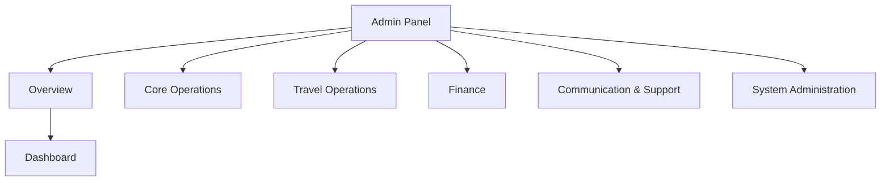

### 6.2 Core Operations Navigation Detail Diagram

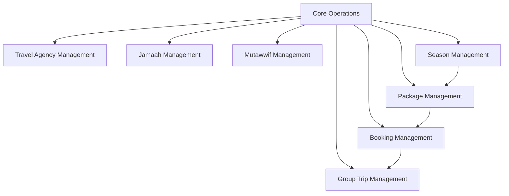

### 6.3 Travel Agency Navigation Detail Diagram

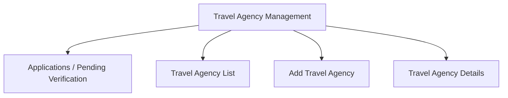

### 6.4 Travel Operations Navigation Detail Diagram

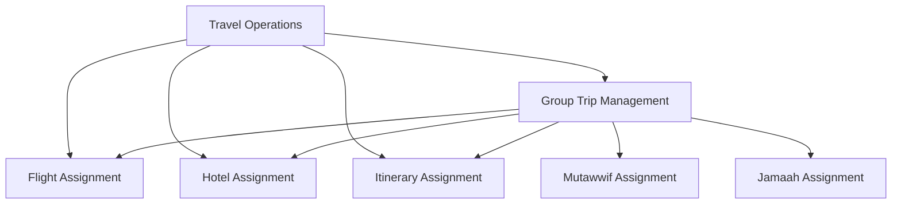

### 6.5 Finance, Support, and System Navigation Detail Diagram

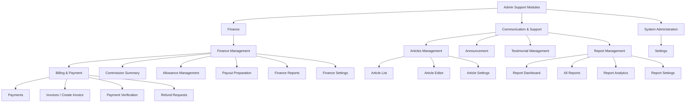

Navigation rules:

1. Sidebar menu visibility follows user role and permission.
2. Applications is a submenu under Travel Agency because it is the intake/review stage before an agency becomes active.
3. List pages are the primary entry point for each module.
4. Dashboard quick actions may deep-link into key workflows such as review application, add agency, add jamaah, create package, create booking, create group trip, or verify payment.

---

## 7. Module Summary

| Module | Purpose |
|---|---|
| Dashboard | Shows high-level platform metrics and operational summary |
| Travel Agency Management | Manage registered agencies, applications, documents, employees, and agency status |
| Jamaah Management | Manage jamaah profiles, documents, bookings, and payment records |
| Mutawwif Management | Manage mutawwif profiles, assignments, certifications, ratings, and service performance references |
| Package Management | Manage Umrah/Hajj packages, pricing, inclusions, and availability |
| Booking Management | Manage package bookings, participants, payment readiness, cancellation, refund, and allocation to group trips |
| Group Trip Management | Manage departure groups, jamaah allocation, mutawwif, hotel, flight, and itinerary |
| Flight Management | Manage flight records and passenger assignment |
| Hotel Management | Manage hotel data, room allocation, and group trip assignment |
| Itinerary Management | Manage travel schedules and activity plans |
| Season Management | Manage season types and date periods used by package schedules, seasonal pricing references, group trip snapshots, and reporting |
| Finance Management | Manage financial operations across invoice, payment, refund, commission, allowance, payout preparation, reporting, and finance settings. Billing & Payment, Commission, Allowance, Payout Preparation, and Finance Reports are treated as Finance submodules/sub-PRDs, not separate top-level modules. |
| Articles Management | Manage educational articles, content publishing, categories, tags, featured images, SEO metadata, and article performance |
| Announcement | Manage announcements to admins, agencies, jamaah, or specific groups |
| Testimonial Management | Manage daily itinerary feedback, end-of-trip testimonials, mutawwif trip reports, ratings, media, moderation, and public display consent |
| Report Management | Manage reports, complaints, issues, assignments, status resolution, and escalations involving Jamaah, Travel Agencies, Mutawwif, and platform operations |
| Settings | Manage roles, permissions, master data, notifications, and platform configuration |

---

## 8. Core Business Flow

```text
Travel Agency registered / created
↓
Travel Agency verified by Admin
↓
Travel Agency creates packages
↓
Season calendar is applied to package schedules
↓
Jamaah/customer creates booking or Admin/Travel Agency creates booking
↓
Payment and booking confirmation are tracked
↓
Invoice, payment, and platform commission are recorded
↓
Confirmed booking is allocated to group trip
↓
Hotel, flight, itinerary, and mutawwif assigned
↓
Operational readiness, billing, and commission tracked
↓
Trip completed
↓
End-of-trip testimonial and review analytics recorded
↓
Reports and commission summary finalized
```

### 8.1 High-Level Business Flow Diagram

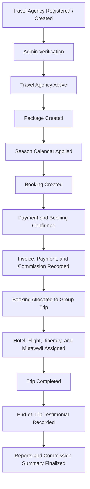

### 8.2 Admin Panel Module Relationship Diagram

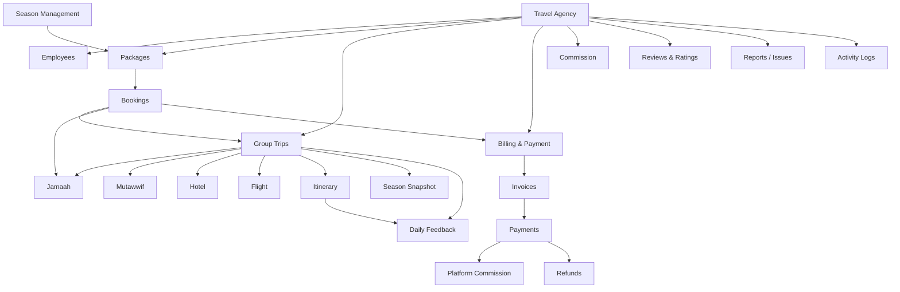

### 8.3 Core Entity Relationship Diagram

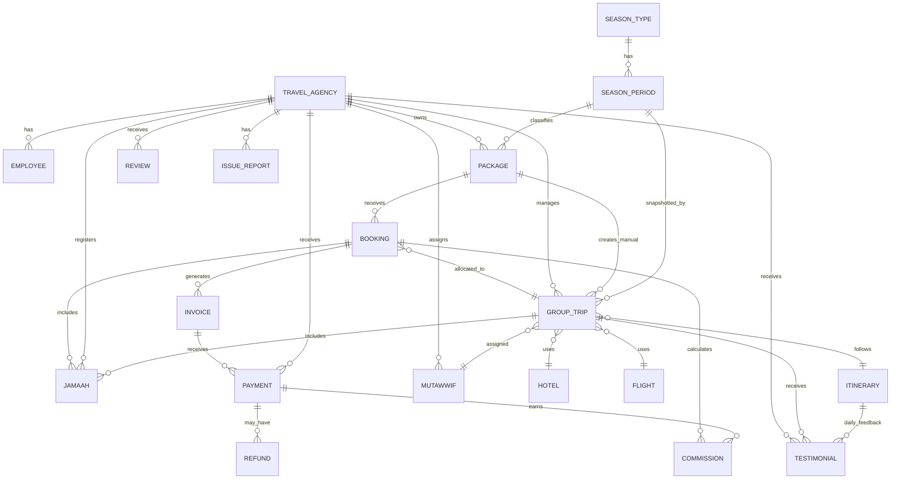

---

## 9. Global Status Rules

### Travel Agency Status

```text
Draft
Pending Verification
Need Revision
Active
Suspended
Rejected
Inactive
```

### Package Status

```text
Draft
Active
Inactive
Archived
```

### Booking Status

```text
Draft
Pending Review
Pending Payment
Partially Paid
Confirmed
Allocated
Cancelled
Refunded
Expired
Rejected
```

### Group Trip Status

```text
Draft
Active
Completed
Cancelled
Archived
```

### Payment Status

```text
Unpaid
Partial Paid
Paid
Refunded
Failed
```

Detailed status behavior per module is defined in each Module PRD.

---

## 10. Global UX Rules

1. All list pages must support search, filter, pagination, empty state, and error state.
2. All destructive actions must show confirmation modal.
3. Delete should be avoided where possible; archive or soft delete is preferred.
4. Status changes must be logged.
5. Sensitive financial data must be protected by permission.
6. Long tables should support horizontal scroll on desktop.
7. Mobile web should use stacked cards or responsive tables.
8. Empty states should include CTA only if the user has permission.
9. Error messages must clearly explain the issue and the next action.

---

## 11. Responsive Web Behavior

### Desktop Web

1. Sidebar navigation.
2. Table-based list pages.
3. Multi-column forms.
4. Advanced filters.
5. Bulk actions where applicable.
6. Side-by-side document preview and review panels where needed.

### Mobile Web

1. Collapsible navigation.
2. Card-based list layout.
3. Stacked form sections.
4. Simplified filters.
5. Sticky primary action button.
6. Horizontal scroll for complex tables if needed.
7. Full-screen document preview for uploaded files.

---

## 12. Global Permission Rules

1. User access is role-based.
2. Each module can have Create, Read, Update, Delete permissions.
3. Sensitive modules require additional permission.
4. Bank details require View Sensitive Data permission.
5. Approval actions require Approve / Reject permission.
6. Export actions require Export permission.
7. Role and permission changes must be logged.
8. Status changes require Manage Status permission.
9. Internal remarks require Internal Remarks Read permission.

---

## 13. Notification Rules

| Trigger | Recipient |
|---|---|
| Travel Agency application submitted | Super Admin / Admin |
| Application approved | Travel Agency PIC |
| Revision requested | Travel Agency PIC |
| Application rejected | Travel Agency PIC |
| Payment submitted | Finance Admin |
| Group trip updated | Related agency users |
| Issue report submitted | Support / Operations |
| Announcement published | Target audience |

Channels:

```text
Email
In-app notification
WhatsApp, future phase
SMS, future phase
```

---

## 14. Audit Log Rules

The system must log critical actions:

1. Login.
2. Create / update / delete record.
3. Status changes.
4. Approval / rejection.
5. Document upload / replacement.
6. Bank details viewed or edited.
7. Payment verification.
8. Commission release.
9. Role and permission update.
10. Internal remarks update.

Minimum log fields:

| Field | Description |
|---|---|
| Actor | User who performed action |
| Role | User role |
| Action | Activity performed |
| Module | Related module |
| Timestamp | Date and time |
| IP Address | IP address |
| Device | Device type |

---

## 15. Data Privacy & Security

1. Sensitive data must be restricted by permission.
2. Bank and payment data must not be visible to unauthorized roles.
3. Passport, identity, and uploaded documents require access control.
4. Document access must be logged.
5. Admin actions must be auditable.
6. Password and session settings must follow security policy.
7. Two-factor authentication can be supported in a future phase.
8. Session timeout is required for admin users.

### File Upload & Storage Policy

1. Each upload field must define allowed format, max file size, and optimization rule.
2. Profile/logo images should be limited to 2 MB and resized/compressed before storage.
3. Identity, legal, travel, and supporting documents should generally be limited to 5 MB per file unless a module explicitly requires otherwise.
4. Supported formats should be limited to JPG, JPEG, PNG, WEBP, and PDF unless the module requires another format.
5. System must reject files that exceed configured max size.
6. System should generate thumbnails/previews and avoid loading original files in list or card views.
7. Original files should be loaded only when user opens preview/download and has permission.
8. Uploaded files should be stored in object storage or equivalent file storage, not directly inside the application server filesystem.
9. Server must validate MIME type and file extension.
10. Uploaded files should be scanned for malware if scanning service is available.

---

## 16. MVP Scope

```text
Dashboard
Travel Agency Management
Jamaah Management
Package Management
Season Management
Group Trip Management
Mutawwif Management
Hotel & Flight
Itinerary
Finance Management
Report Management
Articles Management
Settings & Role Permission
```

MVP notes:

1. Travel Agency Applications review flow is included.
2. Manual legal document verification is included.
3. Role-based access control is required before production.
4. Payment tracking and verification are included.
5. Direct Jamaah assignment into Group Trip is supported for manual operations.
6. Full Booking Management is not required for Phase 1 MVP.
7. Season Management is included as Phase 1 master data for package schedules and seasonal pricing references.
8. Report Management is included as Phase 1 lightweight support and issue tracking.
9. Articles Management is included as Phase 1 lightweight content publishing for guidance and educational articles.
10. Finance Management is included as Phase 1 finance umbrella for manual invoice/payment tracking, refund visibility, commission summary, allowance records, payout preparation, and finance reports.
11. Advanced analytics and automation are not required for MVP.

Phase 2 Full Scope:

```text
Booking Management
Customer / public package booking flow
Travel Agency booking workspace
Admin-assisted booking creation
Booking payment, invoice, cancellation, and refund workflow
Billing & Payment Management with payment links, reminders, reports, settings, and commission calculation
Advanced Finance Management with allowance approval workflow, payout batches, settlement reporting, and reconciliation
Booking-to-group-trip allocation
Booking-based commission calculation
Advanced commission
Payout workflow
Advanced review analytics
Testimonial Management with daily feedback, end-of-trip feedback, mutawwif trip reports, moderation, and public display consent
WhatsApp automation
AI report summary
Advanced report automation and SLA analytics
Advanced article editorial workflow, multilingual articles, content calendar, and SEO integration
Advanced dashboard analytics
External provider integrations
Native mobile app
```

Phase 2 is intended to cover the full operational product scope beyond MVP. Booking Management should therefore be treated as a dedicated Phase 2 module, not merely as a future note inside Package or Group Trip.

---

## 17. Out of Scope

The following items are out of scope for Phase 1 MVP unless explicitly moved into Phase 2 implementation planning.

1. Native Android app in Phase 1.
2. Native iOS app in Phase 1.
3. Public marketplace SEO pages.
4. Advanced CRM automation.
5. AI-based travel recommendation.
6. Full accounting system.
7. Payroll system.
8. Offline mobile app support.
9. Real-time external flight/hotel provider integration in Phase 1.

---

## 18. Dependencies & Assumptions

1. Payment gateway will be integrated in Phase 2 or later implementation phase.
2. Travel Agency data may come from admin input or public application form.
3. Legal document verification is handled manually by admin in Phase 1.
4. WhatsApp notification requires third-party integration.
5. Role-based access control is required before production release.
6. Master data for countries, cities, airlines, hotel categories, and package types must be available.
7. Season types and season periods must be available before season-specific package pricing is published.
8. Report attachments require secure object storage or equivalent private file storage.
9. Uploaded documents require secure file storage.

---

## 19. Success Metrics

1. Admin can manage travel agency data from one panel.
2. Admin can verify agency applications.
3. Admin can track jamaah, booking, and group trip data.
4. Payment tracking errors are reduced.
5. Admin can audit critical actions.
6. Operational data can be accessed on desktop and mobile web.
7. Average time to review a complete agency application decreases.
8. Critical actions have complete audit logs.

---

## 20. Related Module PRDs

All Module PRDs should follow the standard Module PRD structure:

```text
1. Document Information
2. Module Overview
3. Objective
4. Scope
5. User Roles & Permissions
6. Navigation & Entry Point
7. Information Architecture
8. Main User Flow
9. List Page Requirements
10. Create / Add Page Requirements
11. Detail Page Requirements
12. Edit Page Requirements
13. Status Management
14. Approval / Review Flow
15. Field Specification
16. Validation Rules
17. Empty State
18. Error State
19. Notification Rules
20. Activity Log Requirements
21. Responsive Web Behavior
22. Security & Permission Notes
23. Acceptance Criteria
```

```text
PRD 01 — Travel Agency Management
PRD 02 — Jamaah Management
PRD 03 — Package Management
PRD 04 — Booking Management
PRD 05 — Group Trip Management
PRD 06 — Mutawwif Management
PRD 07 — Flight Management
PRD 08 — Hotel Management
PRD 09 — Itinerary Management
PRD 10 — Season Management
PRD 11 — Finance Management
PRD 11.1 — Billing & Payment
PRD 11.2 — Refund Management
PRD 11.3 — Commission Management
PRD 11.4 — Allowance Management
PRD 11.5 — Payout Preparation
PRD 11.6 — Finance Reports & Settings
PRD 12 — Testimonial Management
PRD 13 — Report Management
PRD 14 — Articles Management
PRD 15 — Review & Remarks
PRD 16 — Settings, Roles & Permissions
```


---

# Module PRD — Travel Agency Management

Version: 1.0  
Date: 2 Juni 2026  
Parent Document: Master PRD — UmrahHaji.com Admin Panel  
Scope: Travel Agency Management

---

## 1. Objective

Travel Agency Management memungkinkan Admin untuk meninjau pengajuan travel agency dari public website, memverifikasi dokumen legal, mengaktifkan agency, dan mengelola informasi agency secara menyeluruh setelah agency aktif.

Module ini mencakup:

1. Travel Agency Applications
2. Travel Agency List
3. Add Travel Agency
4. Travel Agency Details
5. Compliance and Legal Documents
6. Employees and Roles
7. Settlement / Bank Details
8. Commission, Reviews, Issue Reports, Activity Logs, Internal Remarks, and Settings

---

## 2. Scope

### In Scope

1. Review application dari public website.
2. Approve, reject, request revision, and reopen application.
3. Create or activate travel agency record.
4. Manage active travel agency profile.
5. Manage PIC, employees, roles, and permissions.
6. Verify SSM, MOTAC, Umrah/Ziarah Authorization, and PJH documents.
7. Manage settlement and payout information.
8. View agency-scoped jamaah, mutawwif, packages, group trips, hotels, flights, itineraries, commissions, reviews, reports, logs, and remarks.

### Out of Scope

1. Public website registration UX.
2. Native Android or iOS apps.
3. External SSM/MOTAC API verification in MVP.
4. Full commission engine if referral/agent rules are not finalized.

### Portal & Design System Principle

Admin Panel and Travel Agency Portal will use the same design system to maintain visual consistency, component reuse, and development efficiency. However, each portal will have a separate navigation structure, permission model, user workflow, and data scope based on the role and operational needs of its users.

---

## 3. User Roles & Permissions

| Role | Access |
|---|---|
| Super Admin | Full access, approve/reject/reopen, assign reviewer, manage status |
| Operations Admin | View/edit operational agency data based on permission |
| Finance Admin | View settlement/bank details and finance-related data |
| Compliance Officer | Verify legal documents and compliance status |
| Travel Agency Admin | Access own agency data only, no admin application workspace |
| Support Staff | View only or limited support access |
| Auditor | Read-only audit/report access |

Sensitive areas:

1. Bank details require View Sensitive Data permission.
2. Role management requires Roles Update permission.
3. Status changes require Manage Status permission.
4. Commission release requires Commission Release permission.
5. Internal remarks require Internal Remarks Read permission.

---

## 4. Navigation Entry Point

```text
Travel Agency Management
- Applications
- Travel Agency List
- Add Travel Agency
- Travel Agency Details
```

Applications is a submenu under Travel Agency Management because it represents the intake/review stage before a travel agency becomes active.

---

## 5. Travel Agency Applications

Travel Agency Applications is a review and verification workspace for Admin to manage incoming agency registration requests from the public website. Admin can inspect submitted agency data, verify legal documents, request revision, approve, reject, and track review history before the agency becomes active in the platform.

### Travel Agency List Requirements

Travel Agency List is the main list page for active and inactive travel agencies. Applications that are still under review are accessed from the Applications submenu.

### Travel Agency List Columns

| Column | Description |
|---|---|
| Travel Agency Name | Agency logo, name, and main email |
| Agency Type | Travel Agency, Tour Operator, Branch Office, Supplier |
| License Category | Inbound, Outbound, Ticketing, Umrah/Ziarah |
| Status | Active, Pending Verification, Need Revision, Suspended, Rejected, Inactive |
| PIC | PIC name and contact |
| Country / State | Agency location |
| Total Jamaah | Number of jamaah under agency |
| Active Packages | Number of active packages |
| Active Group Trips | Number of active group trips |
| License Expiry | License expiry date and warning state |
| Last Updated | Last modified date |
| Actions | View details, edit, suspend/reactivate, archive |

### Travel Agency List Filters

1. Status.
2. Agency Type.
3. License Category.
4. Country / State.
5. License Expiry Status.
6. Has Active Packages.
7. Has Active Group Trips.
8. Search by agency name, PIC, email, phone, SSM number, or MOTAC license number.

### Travel Agency List Actions

| Action | Description |
|---|---|
| View Details | Opens Travel Agency Details page |
| Edit | Opens edit agency form if user has update permission |
| Suspend | Suspends active agency with reason |
| Reactivate | Reactivates suspended or inactive agency if requirements are valid |
| Archive | Archives agency if allowed |
| Export | Exports selected or filtered data if user has export permission |

### Application List Columns

| Column | Description |
|---|---|
| Application ID | ID unik pengajuan |
| Travel Agency Name | Nama agency |
| PIC Name | Penanggung jawab agency |
| PIC Email | Email PIC |
| Phone Number | Nomor kontak |
| Country / State | Lokasi agency |
| Submitted Date | Tanggal submit application |
| Verification Status | Pending Verification, Need Revision, Approved, Rejected |
| Document Status | Complete, Incomplete, Need Revision |
| Assigned Reviewer | Admin yang menangani review |
| Actions | View, Review, Approve, Reject |

### Review Actions

1. Approve Application
2. Request Revision
3. Reject Application
4. Reopen Application by Super Admin
5. Assign Reviewer

### Application Flow

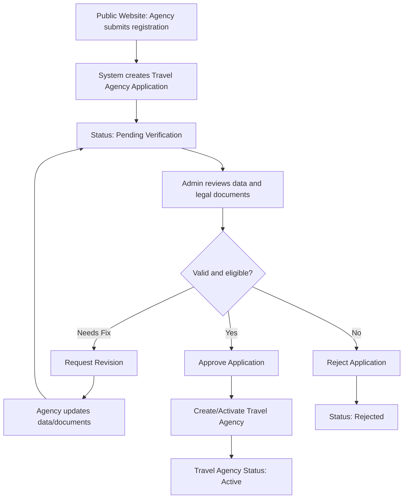

### Travel Agency Application Approval Flow

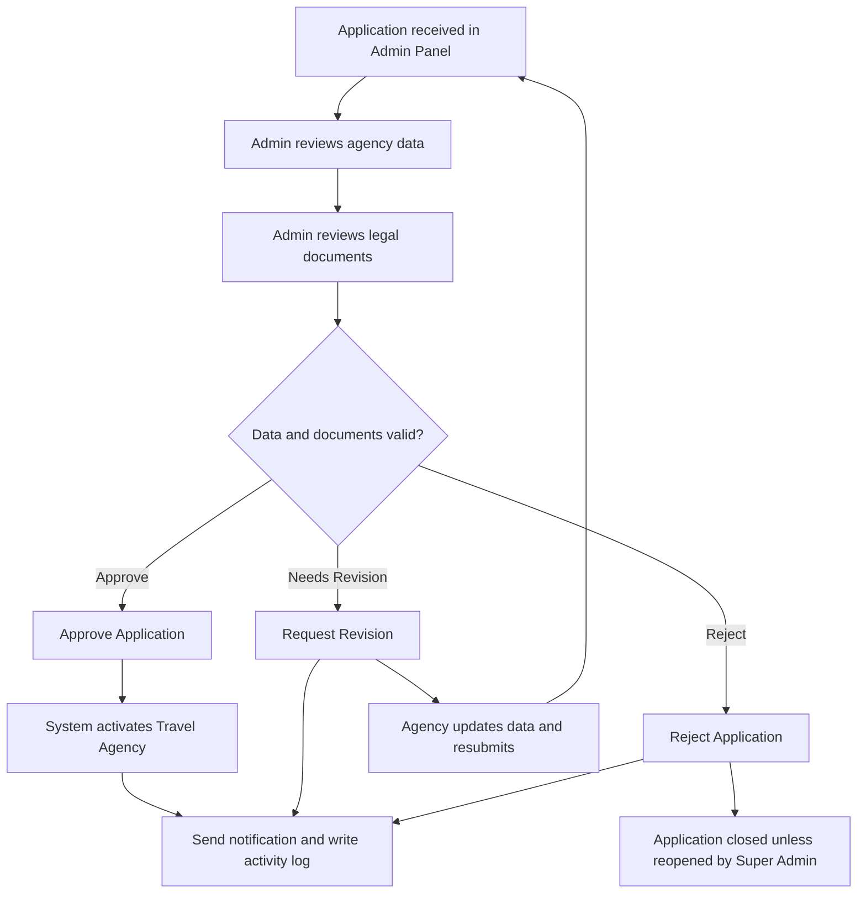

### Application Detail Review Form

Application Detail includes a review panel that allows Admin to make a decision after inspecting submitted data and documents.

Review panel fields:

| Field | Type | Required | Notes |
|---|---|---:|---|
| Review Decision | Select | Yes | Approve, Request Revision, Reject |
| Revision Category | Multi-select | Conditional | Required when decision is Request Revision |
| Rejection Reason | Long text | Conditional | Required when decision is Reject |
| Internal Note | Long text | Optional | Only visible to internal admins |
| Notify Agency PIC | Toggle | Yes | Default enabled |
| Assigned Reviewer | User select | Optional | Super Admin only, optional MVP |

Revision categories:

| Category | Example |
|---|---|
| Agency Information | Nama agency tidak sesuai dokumen |
| Legal Document | Dokumen blur, expired, atau salah upload |
| License Information | MOTAC number tidak valid |
| PIC Information | Data PIC tidak lengkap |
| Bank Details | Nama rekening tidak sesuai agency |
| Address | Alamat tidak lengkap |

### Document Review Flow

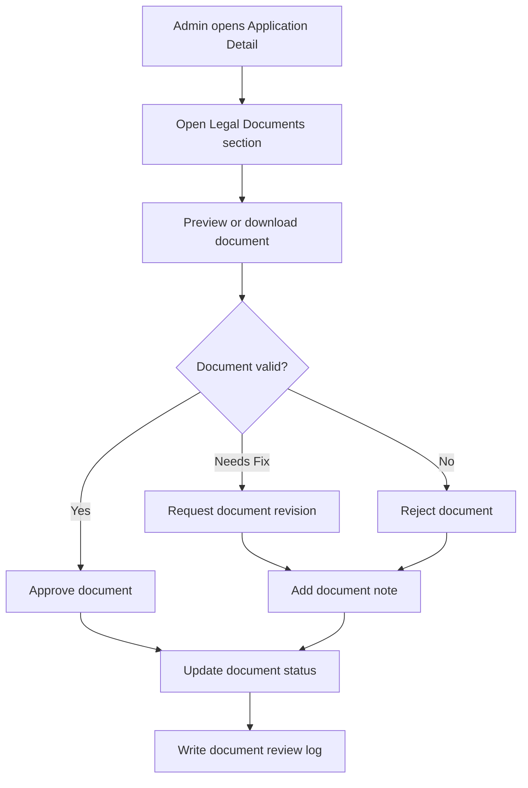

Document review fields:

| Field | Type | Required | Notes |
|---|---|---:|---|
| Document Decision | Select | Yes | Approve, Request Revision, Reject |
| Document Note | Long text | Conditional | Required for Request Revision or Reject |
| Expiry Date | Date | Conditional | Required for documents with validity period |
| Notify Agency PIC | Toggle | Yes | Default enabled when revision/reject |

---

## 6. Add Travel Agency

Add Travel Agency digunakan Admin untuk membuat agency secara internal atau melengkapi data agency hasil approval dari Travel Agency Applications. Field yang sama juga menjadi basis data submission dari public website, dengan beberapa field internal hanya terlihat untuk Admin.

### Form Structure

```text
Add Travel Agency

1. Travel Agency Information
   - Agency Logo
   - Travel Agency Name
   - Agency Type
   - Main Email
   - Main Phone Number
   - Website
   - SSM Registration Number
   - MOTAC License Number
   - License Category
   - License Validity Period
   - Office Type
   - Status

2. Social Media
   - Platform
   - URL / Contact Link
   - Public Display Toggle

3. Agency Address
   - Country
   - State / Province
   - City
   - Postal / ZIP Code
   - Street Address
   - Google Maps Link

4. PIC Information
   - PIC Full Name
   - Position
   - Email
   - Phone Number
   - Access Level
   - ID / Passport Number
   - Authorization Letter

5. Settlement / Bank Details
   - Account Holder Name
   - Travel Agency Registration Number
   - Finance Email
   - Finance Phone Number
   - Bank Country
   - Bank Name
   - Bank Account Number
   - Payout Currency
   - Tax / SST Number

6. Employees List
   - Employee Name
   - Position
   - Email
   - Phone Number
   - Country
   - Access

7. Legal Documents
   - SSM Certificate
   - MOTAC License
   - Umrah / Ziarah Authorization
   - PJH Certificate
   - Bank Statement / Proof of Account
   - Supporting Documents

8. Admin Notes & Verification
   - Internal Notes
   - Verification Status
   - Rejection / Revision Reason
```

### Travel Agency Information Fields

| Field | MVP | W/O | Type | Validation / Notes |
|---|---|---|---|---|
| Agency Logo | Yes | Optional | Image | Untuk branding agency. |
| Travel Agency Name | Yes | Required | Text | Nama resmi sesuai dokumen legal. |
| Agency Type | Yes | Required | Select | Travel Agency, Tour Operator, Branch Office, Supplier. |
| Main Email | Yes | Required | Email | Kontak utama untuk login atau komunikasi. |
| Main Phone Number | Yes | Required | Phone | Kontak utama agency. |
| Website | No | Optional | URL | Opsional. |
| SSM Registration Number | Yes | Required | Text | Menerima format baru 12 digit atau format lama. |
| MOTAC License Number | Yes | Required | Text | Nomor lisensi travel agency. |
| License Category | Yes | Required | Multi-select | Inbound, Outbound, Ticketing, Umrah/Ziarah. Outbound wajib jika menjual Umrah. |
| License Validity Period | Yes | Required | Date range | Start date dan expiry date. Memicu reminder dan auto-suspend saat kedaluwarsa. |
| Office Type | Yes | Required | Select | Head Office atau Branch. |
| Status | Yes | Required | Select | Draft, Pending Verification, Active, Suspended, Inactive. |

### License & Compliance Fields

| Field | MVP | W/O | Type | Validation / Notes |
|---|---|---|---|---|
| Umrah / Ziarah Authorization | Conditional | Conditional | Text + Document | Wajib jika agency menjual Umrah. |
| KPPU Status (Director) | No | Optional | Select + Date | Status dan tanggal penyelesaian jika relevan. |
| Bank Guarantee | No | Optional | Group | Provider, amount, start date, end date, status. |
| PJH License / Status | No | Conditional | Text + Document | Wajib untuk membuat atau menjual paket Haji. |
| Industry Association | No | Optional | Multi-select | MATTA, BUMITRA, MCTA, atau asosiasi lain. |
| TIN / Tax Number | No | Conditional | Text | Untuk kebutuhan tax dan billing. |
| SST Number | No | Conditional | Text | Wajib jika agency registered SST. |
| MSIC Code | No | Optional | Text | Kode aktivitas bisnis jika diperlukan. |

### Agency Address Fields

| Field | MVP | W/O | Type | Validation / Notes |
|---|---|---|---|---|
| Country | Yes | Required | Select | Default Malaysia jika market awal Malaysia. |
| State / Province | Yes | Required | Select | Negeri atau provinsi. |
| City | Yes | Required | Text | Kota. |
| Postal / ZIP Code | Yes | Required | Text | Kode pos. |
| Street Address | Yes | Required | Text | Alamat lengkap kantor. |
| Google Maps Link | No | Optional | URL | Membantu validasi lokasi kantor. |
| Business Premise License Number | No | Optional | Text | Digunakan jika dibutuhkan untuk compliance lokal. |

### Social Media Fields

| Field | MVP | W/O | Type | Notes |
|---|---|---|---|---|
| Platform | No | Optional | Select | WhatsApp, Instagram, Facebook, TikTok, YouTube. |
| URL / Contact Link | No | Optional | URL/Text | Link atau nomor kontak harus valid. |
| Is Publicly Displayed | No | Optional | Boolean | Menentukan apakah channel tampil di profil publik agency. |

### PIC Information Fields

PIC Information dipisahkan dari Employees List karena PIC menjadi penanggung jawab utama saat onboarding.

| Field | MVP | W/O | Type | Notes |
|---|---|---|---|---|
| PIC Full Name | Yes | Required | Text | Nama penanggung jawab utama. |
| PIC Position | Yes | Required | Text | Director, Manager, Operation Lead, atau jabatan lain. |
| PIC Email | Yes | Required | Email | Email untuk login dan notifikasi. |
| PIC Phone Number | Yes | Required | Phone | Kontak utama PIC. |
| PIC ID / Passport Number | No | Conditional | Text | Untuk KYC internal jika diperlukan. |
| PIC Authorization Letter | No | Optional | Document | Jika PIC bukan director atau owner. |
| Access Level | Yes | Required | Select | PIC, Admin, atau Staff untuk MVP. |

### Settlement / Bank Details Fields

| Field | MVP | W/O | Type | Notes |
|---|---|---|---|---|
| Account Holder Name | Yes | Required | Text | Nama pemilik rekening. |
| Travel Agency Registration Number | Yes | Required | Text | Sinkron dengan SSM Registration Number. |
| Finance Email | Yes | Required | Email | Email untuk billing dan settlement. |
| Finance Phone Number | No | Optional | Phone | Kontak finance. |
| Bank Country | Yes | Required | Select | Negara bank. |
| Bank Name | Yes | Required | Select/Text | Nama bank. |
| Bank Account Number | Yes | Required | Text | Nomor rekening bank. |
| Payout Currency | Yes | Required | Select | MYR, SAR, IDR, atau currency lain yang didukung. |
| Tax / SST Number | No | Conditional | Text | Dibutuhkan untuk tax/payment compliance jika berlaku. |
| Bank Statement / Proof of Account | No | Optional | Document | Untuk verifikasi rekening payout. |

### Employees List Fields

Minimal wajib ada satu employee dan salah satu employee wajib menjadi PIC.

| Field | MVP | W/O | Type | Notes |
|---|---|---|---|---|
| Employee Name | Yes | Required | Text | Nama employee. |
| Position | Yes | Required | Text | Jabatan. |
| Email | Yes | Required | Email | Email harus unik. |
| Phone Number | Yes | Required | Phone | Nomor telepon. |
| Country | No | Optional | Select | Negara. |
| Access Level | Yes | Required | Select | PIC, Admin, Staff, Finance, atau Operations. |

Access levels:

| Access | Description | MVP |
|---|---|---|
| PIC | Kontak utama dan perwakilan agency. | Yes |
| Admin | Mengelola operasional agency. | Yes |
| Staff | Akses operasional terbatas. | Yes |
| Operation Staff | Akses group trip, jamaah, hotel, flight, dan itinerary. | Phase 2 |
| Finance Staff | Akses data billing dan payment. | Phase 2 |
| Customer Service | Akses dukungan pelanggan. | Phase 2 |
| Marketing Staff | Akses kebutuhan campaign atau konten agency. | Phase 2 |

### Admin Notes & Verification Fields

| Field | MVP | W/O | Type | Notes |
|---|---|---|---|---|
| Internal Notes | Yes | Optional | Long text | Catatan internal admin/compliance, tidak tampil ke agency. |
| Verification Status | Yes | Required | Select | Draft, Pending Verification, Revision Required, Verified, Rejected, Suspended. |
| Rejection / Revision Reason | Yes | Conditional | Long text | Wajib jika status Rejected atau Revision Required. |
| Verified By | Yes | System | User reference | Terisi otomatis saat diverifikasi. |
| Verified At | Yes | System | Timestamp | Terisi otomatis saat diverifikasi. |

### MVP Field Minimum

1. Travel Agency Name
2. Agency Logo
3. Agency Type
4. Main Email
5. Main Phone Number
6. Office Type
7. Address
8. PIC Information
9. Employee minimal satu orang
10. SSM Registration Number
11. MOTAC License Number
12. License Category
13. License Validity Period
14. Umrah / Ziarah Authorization jika menjual Umrah
15. Required Legal Documents
16. Settlement / Bank Details
17. Payout Currency
18. Tax / SST Number jika berlaku
19. Verification Status
20. Status

### Edit Travel Agency Flow

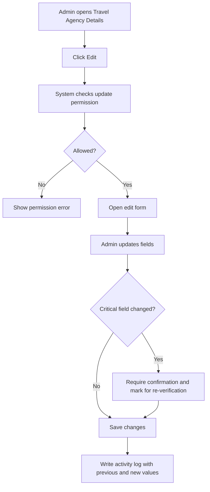

Fields that may trigger re-verification:

1. Travel Agency Name.
2. SSM Registration Number.
3. MOTAC License Number.
4. License Category.
5. License Validity Period.
6. Umrah / Ziarah Authorization.
7. PJH License / Status.
8. Settlement / Bank Details.
9. Legal Documents.

## 7. Travel Agency Details

Travel Agency Details is an agency-specific 360-degree view that allows Admin to view, monitor, verify, and manage all information related to a selected Travel Agency.

### Header

| Element | Description |
|---|---|
| Back Button | Return admin to previous page |
| Agency Logo | Display logo or placeholder |
| Travel Agency Name | Selected agency name |
| Agency Status | Active, Pending Verification, Need Revision, Suspended, Rejected, Inactive |
| Rating Summary | Average rating and total reviews |
| Edit Button | Visible only with update permission |

Header behavior:

1. Header remains consistent across all tabs.
2. Edit button is only visible to users with update permission.
3. Status badge must reflect current agency status.
4. Rating summary should be hidden if there is no rating data.

### Recommended 7-Tab Structure

| Tab | Contains | Notes |
|---|---|---|
| Profile | Agency info, social media, address, legal documents | Settlement summary may be shown only with permission, but detailed bank management belongs in Finance. |
| Users & Team | PIC, employees, invitation status, agency roles | Split from Profile because users/roles are managed frequently. |
| Jamaah & Mutawwif | Jamaah sub-tab and Mutawwif sub-tab | People and assignment data. |
| Packages & Group Trips | Packages sub-tab and Group Trips sub-tab | Product and departure data are tightly related. |
| Operations | Hotel, Flight, Itinerary | Travel components should be grouped to reduce tab clutter. |
| Finance | Settlement, billing/payment summary, commission | Sensitive and permission-based. |
| Quality & Logs | Review & Rating, Issue Reports, Activity Logs, Internal Remarks | Monitoring, quality, audit, and internal notes. |

### Data Scope Rule

All data displayed in Travel Agency Details must be scoped only to the selected Travel Agency. Admin must not see cross-agency data inside this page unless explicitly accessing a global module from the sidebar.

### Travel Agency Details Data Scope Diagram

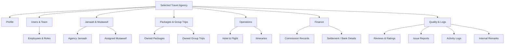

### Profile Tab

Purpose:

Displays core travel agency profile, public/contact information, address, and legal/compliance documents.

Sections:

1. Travel Agency Information.
2. Social Media.
3. Agency Address.
4. Legal Documents.
5. Compliance Summary.

Travel Agency Information fields:

| Field | Description |
|---|---|
| Travel Agency Name | Official name of the agency |
| Agency Type | Travel Agency, Tour Operator, Branch Office, or configured type |
| Main Phone Number | Main contact number |
| Main Email | Main agency email |
| Website | Official website URL |
| Status | Current agency status |
| License Number | Agency license number, if available |
| Rating | Average rating and total reviews |

Legal Document actions:

1. View document.
2. Download document.
3. Replace document.
4. Approve document.
5. Request document revision.
6. Reject document.
7. Add document review note.

What to reduce:

1. Do not put full employee/role management here; move it to Users & Team.
2. Do not expose full bank details here; move sensitive finance data to Finance.

### Users & Team Tab

Purpose:

Allows Admin to manage PIC, employees, invitation status, and agency-specific roles.

Recommended columns:

| Column | Description |
|---|---|
| Employee Name | Full name of employee |
| Position | Job position |
| Email | Employee email |
| Phone Number | Employee phone number |
| Country | Employee country |
| Access Role | PIC, Admin, Staff, Finance, Operations, Sales, Customer Support, Marketing |
| Status | Active, Pending, Inactive |
| Actions | View, edit, deactivate, resend invitation |

Rules:

1. A Travel Agency must have at least one PIC.
2. Employee email must be unique.
3. One employee can only have one primary access role at a time.
4. Pending employees are users who have been invited but have not activated their account.
5. Role management requires Roles Update permission.

Invite employee flow:

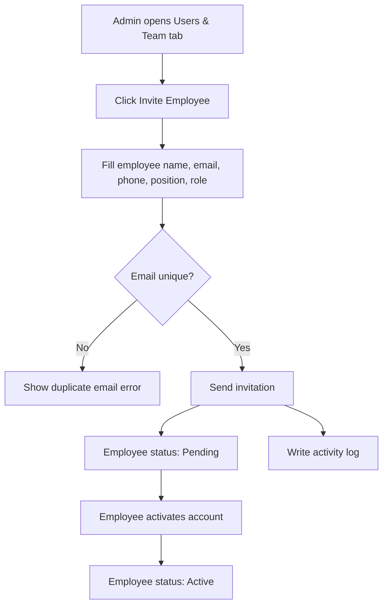

Invite employee fields:

| Field | Type | Required | Notes |
|---|---|---:|---|
| Employee Name | Text | Yes | Full name |
| Position | Text | Yes | Job position |
| Email | Email | Yes | Must be unique |
| Phone Number | Phone | Yes | Include country code if applicable |
| Country | Select | Optional | Employee country |
| Access Role | Select | Yes | PIC, Admin, Staff, Finance, Operations, Sales, Customer Support, Marketing |
| Send Invitation Email | Toggle | Yes | Default enabled |

Employee actions:

| Action | Description |
|---|---|
| Edit Role | Update employee primary role |
| Deactivate | Disable employee access |
| Reactivate | Restore employee access |
| Resend Invitation | Send invitation again for pending users |
| Transfer PIC | Assign another employee as PIC |

Default agency roles:

| Role | Description |
|---|---|
| PIC / Owner | Main agency representative |
| Admin | Manage agency operations |
| Operations Manager | Manage daily operations, group trips, jamaah, hotel, flight, and itinerary |
| Sales | Manage sales, inquiries, and booking-related tasks |
| Finance | Manage payment, commission, invoices, and financial records |
| Customer Support | Manage customer inquiries, complaints, and issue reports |
| Marketing | Manage promotion-related tasks |
| View Only | Read-only access |

### Jamaah & Mutawwif Tab

This tab contains two sub-tabs:

```text
1. Jamaah
2. Mutawwif
```

Jamaah sub-tab columns:

| Column | Description |
|---|---|
| Jamaah Name | Full name, email, and phone number |
| Gender | Male / Female |
| Country | Jamaah country |
| Package / Group Trip | Related package or group trip |
| Payment Status | Unpaid, Partial, Paid, Refunded |
| Join Date | Date jamaah was added |
| Status | Pending, Active, Inactive |
| Actions | View details, edit, remove from agency |

Jamaah filters:

1. Sort by newest / oldest.
2. Status.
3. Country.
4. Gender.
5. Date Created.
6. Search by name, email, or phone number.

Logic note:

Jamaah table must not use Experience & Rating because jamaah are customers, not service providers.

Mutawwif sub-tab columns:

| Column | Description |
|---|---|
| Mutawwif Name | Full name, email, and phone number |
| Gender | Male / Female |
| Job Type | Full-time, Part-time, Freelance |
| Country | Mutawwif country |
| Experience & Rating | Total trips handled and average rating |
| Total Jamaah Handled | Total jamaah handled by the mutawwif |
| Assigned Group Trips | Number of assigned group trips |
| Join Date | Date mutawwif was added |
| Status | Pending, Active, Inactive |
| Actions | View details, assign, unassign, edit |

### Packages & Group Trips Tab

This tab contains two sub-tabs:

```text
1. Packages
2. Group Trips
```

Packages sub-tab purpose:

Displays all packages owned or managed by the selected Travel Agency.

Packages columns:

| Column | Description |
|---|---|
| Package Name | Name of package |
| Package Type | Umrah, Hajj, Ziarah, or configured type |
| Duration | Package duration |
| Price | Package price |
| Total Bookings | Number of bookings |
| Active Group Trips | Number of active group trips using this package |
| Status | Draft, Active, Inactive, Archived |
| Date Created | Package creation date |
| Actions | View, edit, duplicate, archive |

Group Trips sub-tab purpose:

Displays group trips under the selected Travel Agency.

Group Trips columns:

| Column | Description |
|---|---|
| Group Name | Group trip name |
| Package Name | Related package |
| Mutawwif | Assigned mutawwif |
| Duration | Trip duration |
| Departure Date | Departure date |
| Return Date | Return date |
| Total Jamaah | Number of jamaah assigned |
| Available Seat | Remaining seat capacity |
| Hotel | Hotel assigned for Makkah / Madinah |
| Flight Info | Flight information |
| WAG Link | WhatsApp group link |
| Status | Draft, Active, Inactive, Completed, Cancelled |
| Date Created | Date group trip was created |
| Actions | View, edit, archive |

Logic notes:

1. Package is a core module because group trips, bookings, jamaah, commission, and reviews are often connected to package data.
2. Since this page is already scoped to one Travel Agency, global filters such as All Agency must not be displayed.

### Operations Tab

Purpose:

Groups operational travel components used by the selected Travel Agency.

Sub-tabs:

```text
1. Hotel
2. Flight
3. Itinerary
```

Hotel columns:

| Column | Description |
|---|---|
| Hotel Name | Hotel name |
| City | Hotel city |
| Hotel Type | Makkah / Madinah / Transit / Other |
| Check-in Date | Check-in date |
| Check-out Date | Check-out date |
| Room Allocation | Number of rooms or pax allocation |
| Related Group Trip | Linked group trip |
| Status | Active, Draft, Inactive |
| Actions | View details |

Flight columns:

| Column | Description |
|---|---|
| Airline | Airline name |
| Flight Number | Flight number |
| Departure Airport | Origin airport |
| Arrival Airport | Destination airport |
| Departure Date | Departure date |
| Return Date | Return date |
| Related Group Trip | Linked group trip |
| Status | Active, Draft, Inactive |
| Actions | View details |

Itinerary columns:

| Column | Description |
|---|---|
| Itinerary Name | Name of itinerary |
| Duration | Duration of itinerary |
| Total Activity | Total number of activities |
| Linked Group Trips | Number of group trips using this itinerary |
| Description | Short description |
| Status | Draft, Active, Inactive, Archived |
| Date Created | Date itinerary was created |
| Actions | View, edit, archive, delete |

Search placeholder:

```text
Search by itinerary name or description
```

### Finance Tab

Purpose:

Displays settlement, billing/payment summary, payout-sensitive information, and commission records related to the selected Travel Agency.

Sections:

1. Settlement / Bank Details.
2. Billing & Payment Summary.
3. Commission.

Security rules:

1. Bank details are sensitive information.
2. Only Super Admin, Finance Admin, or users with View Sensitive Data permission can view or edit settlement/bank details.
3. Commission release requires Commission Update or Release permission.

Commission summary cards:

| Card | Description |
|---|---|
| Total Commission | Total accumulated commission |
| This Month | Total commission records or amount this month |
| Pending | Commission pending release |
| Locked | Commission currently locked |
| Released | Commission already released |

Commission columns:

| Column | Description |
|---|---|
| Booking Details | Jamaah name, booking ID, date, pax count |
| Agent | Agent or referrer who generated booking |
| Package | Package name and price |
| Commission Breakdown | Commission amount, rate, and calculation |
| Source | WhatsApp, Facebook, Instagram, Direct Link, Manual |
| Status | Pending, Locked, Released, Cancelled |
| Actions | View details, release, lock, cancel |

Logic note:

Commission status must not be mixed with payout status. If payout is implemented separately, payout status should use Pending, Approved, Paid, Rejected.

Settlement details update flow:

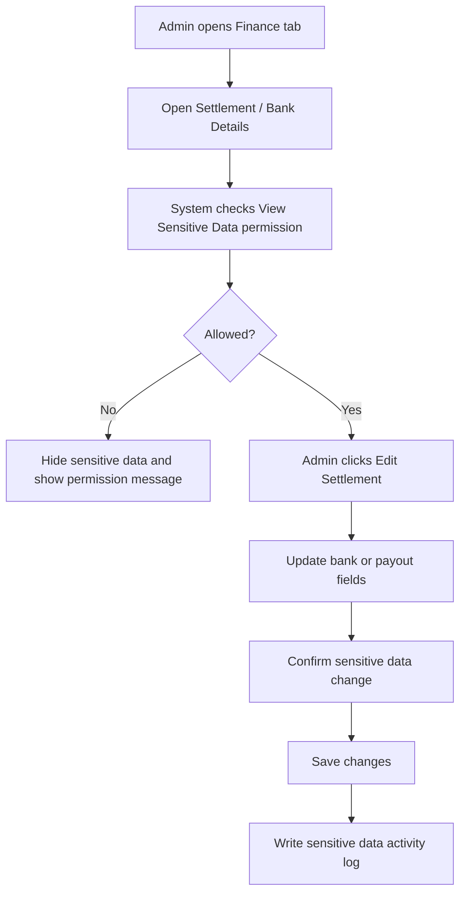

Commission action flow:

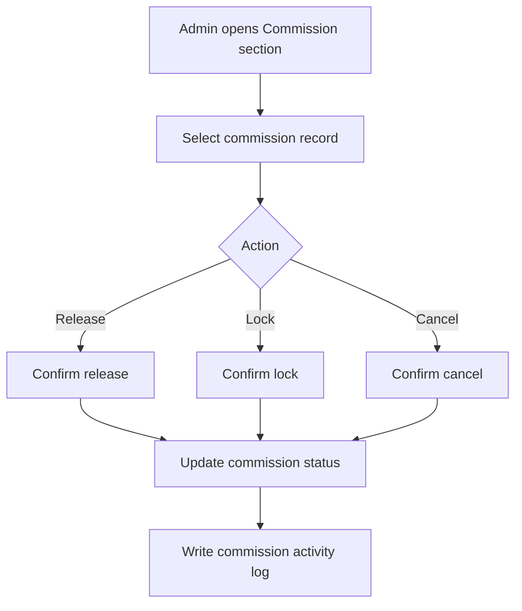

### Quality & Logs Tab

Purpose:

Groups quality monitoring, issue handling, internal remarks, and audit trail for the selected Travel Agency.

Sub-tabs:

```text
1. Review & Rating
2. Issue Reports
3. Activity Logs
4. Internal Remarks
```

Review & Rating columns:

| Column | Description |
|---|---|
| Jamaah / Family | Reviewer name or family group |
| Rating & Feedback | Star rating and written feedback |
| Tip | Optional tip given by jamaah |
| Date | Feedback date and time |
| Anonymous | Indicates if reviewer is anonymous |
| Actions | View details, archive |

MVP rating sources:

1. Agency rating.
2. Package rating.
3. Group trip rating.
4. Mutawwif rating.

Review moderation flow:

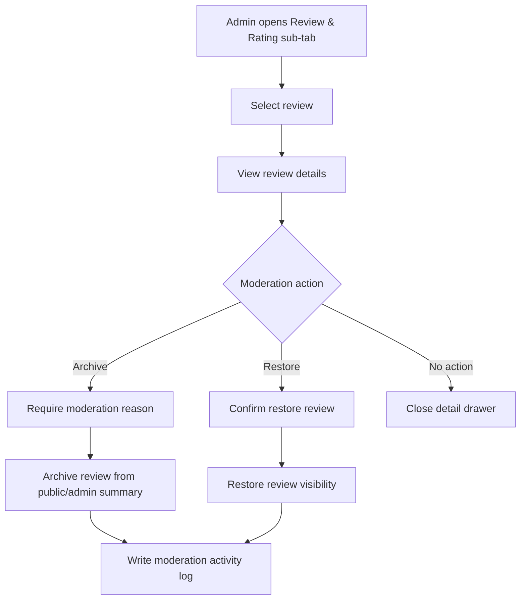

Review moderation fields:

| Field | Type | Required | Notes |
|---|---|---:|---|
| Action | Select | Yes | Archive or Restore |
| Reason | Long text | Conditional | Required when archiving review |
| Internal Note | Long text | Optional | Visible only to authorized Admin |

Issue Reports are owned by Report Management. The Travel Agency Details page only shows reports related to the selected Travel Agency so Admin can review agency quality and follow-up history without leaving the agency profile.

Issue Reports columns:

| Column | Description |
|---|---|
| Date & Time | Report creation time |
| Jamaah | Jamaah who submitted or is related to the report |
| Report | Short issue description |
| Rating | Related rating, if available |
| Category | Service, Compliance, Document, Payment, Platform, Safety, Other |
| PIC | Assigned person in charge |
| Priority | Normal, Important, Urgent |
| Status | Open, In Progress, Waiting Response, Resolved, Closed |
| Actions | View details, assign PIC, update status |

Issue Report handling flow:

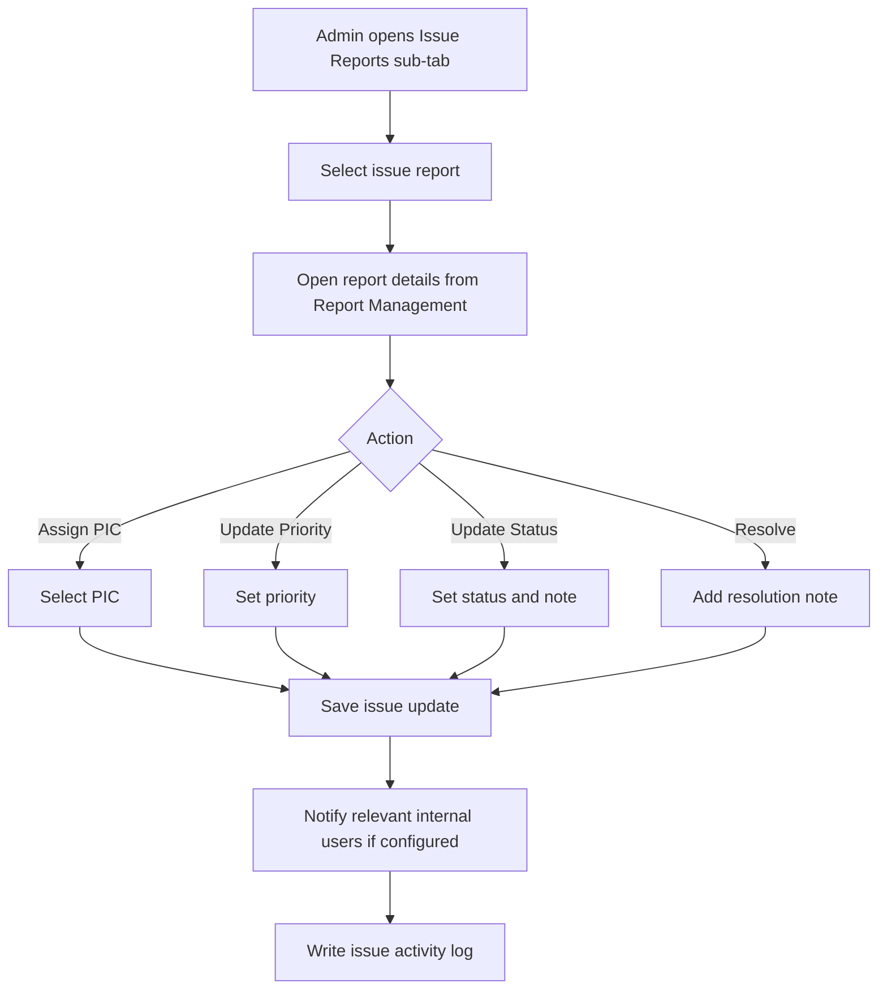

Issue Report update fields:

| Field | Type | Required | Notes |
|---|---|---:|---|
| PIC | User select | Conditional | Required when assigning or reassigning issue |
| Priority | Select | Yes | Normal, Important, Urgent |
| Status | Select | Yes | Open, In Progress, Waiting Response, Resolved, Closed |
| Resolution Note | Long text | Conditional | Required when status is Resolved or Closed |
| Internal Note | Long text | Optional | Internal handling note |

Activity Logs columns:

| Column | Description |
|---|---|
| Activity | Description of action |
| Actor | User who performed the action |
| Role | Actor role |
| Date & Time | Activity timestamp |
| IP Address | IP address used |
| Device | Desktop, Mobile, Tablet |
| Location | Location detected from IP, if available |

Internal Remarks columns:

| Column | Description |
|---|---|
| Date & Time | Remark creation date |
| Created By | Admin who created the remark |
| Title | Short title of the remark |
| Note | Remark content |
| Category | Operations, Finance, Service, Administration, Compliance |
| Priority | Low, Normal, High, Urgent |
| Visibility | Internal Only, Restricted Admins |
| Status | Open, In Progress, Resolved, Unresolved |
| Actions | View, edit, resolve, mark unresolved |

Add Internal Remark flow:

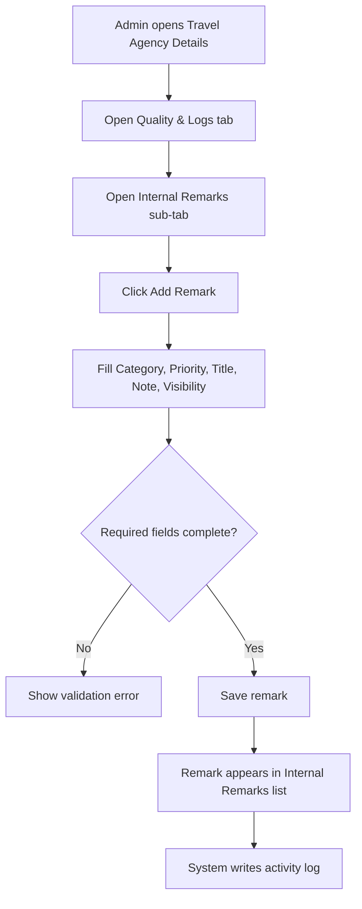

Add Internal Remark fields:

| Field | Type | Required | Validation | Notes |
|---|---|---:|---|---|
| Category | Select | Yes | Must select one category | Operations, Finance, Service, Administration, Compliance |
| Priority | Select | Yes | Must select one priority | Low, Normal, High, Urgent |
| Title | Text input | Yes | Max 120 characters | Short summary of the remark |
| Note | Long text | Yes | Max length follows product policy | Main internal remark content |
| Visibility | Select | Yes | Must select one option | Internal Only, Restricted Admins |

Internal Remark rules:

1. Internal remarks are never visible to Travel Agency users.
2. Visibility controls which internal roles can view the remark.
3. Finance-related remarks should default to Restricted Admins.
4. Add, edit, resolve, and mark unresolved actions must be logged.
5. Edit history should preserve previous and new values.

Quality & Logs rules:

1. The issue tab should be named Issue Reports or Complaints & Reports instead of only Reports.
2. Activity logs must use real system actions, not generic placeholder text.
3. Internal remarks are internal-only and must not be visible to Travel Agency users.
4. Internal remarks require Internal Remarks Read permission.
5. Adding or editing internal remarks requires Internal Remarks Update permission.
6. Review moderation requires Review Update permission.
7. Issue assignment and status update require Issue Report Update permission.

Export flow:

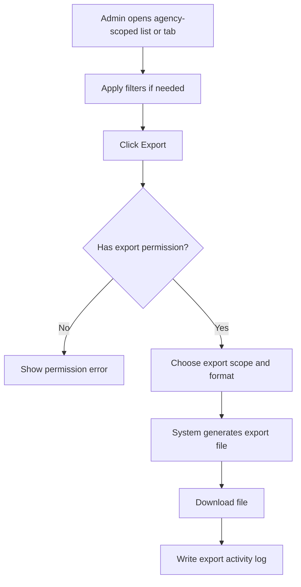

Export fields:

| Field | Type | Required | Notes |
|---|---|---:|---|
| Export Scope | Select | Yes | Current page, filtered result, or selected rows |
| Data Type | Select | Yes | Employees, jamaah, mutawwif, packages, group trips, finance summary, reviews, issue reports, activity logs |
| File Format | Select | Yes | CSV or XLSX |
| Include Sensitive Fields | Toggle | Conditional | Only visible for authorized roles |

### Tab Reduction Notes

1. Hotel, Flight, and Itinerary are grouped into Operations to reduce top-level tab clutter.
2. Commission and settlement/bank details are grouped into Finance because both are sensitive financial areas.
3. Review & Rating, Issue Reports, Activity Logs, and Internal Remarks are grouped into Quality & Logs because they support monitoring, quality, and audit workflows.
4. Settings is not a top-level MVP tab unless agency-level configuration becomes a frequent workflow. Role management lives under Users & Team; notification/security/regional settings can be added later if needed.

## 8. Status Management

| Status | Behavior |
|---|---|
| Pending Verification | Only Profile, Legal Documents, Application Review, Internal Remarks, and Activity Logs are available |
| Need Revision | Agency must revise data/documents before approval |
| Active | All authorized tabs/actions are available |
| Suspended | Data can be viewed, but operational actions are limited |
| Rejected | Only application-related data, remarks, and logs are available |
| Inactive | Data can be viewed, but operational creation actions are disabled |

Restricted actions for Suspended agencies may include:

1. Create package
2. Create group trip
3. Add jamaah
4. Assign mutawwif
5. Release commission
6. Publish package

### 8.1 Suspend / Reactivate Flow

```mermaid
flowchart TD
    A["Admin opens Travel Agency Details"] --> B["Click status action"]
    B --> C{"Action"}
    C -->|Suspend| D["Fill suspension reason and effective date"]
    C -->|Reactivate| E["System checks mandatory compliance data"]
    D --> F["Confirm suspend agency"]
    E --> G{"Eligible for reactivation?"}
    G -->|No| H["Show missing compliance requirement"]
    G -->|Yes| I["Fill reactivation reason"]
    F --> J["Update agency status to Suspended"]
    I --> K["Update agency status to Active"]
    J --> L["Notify agency PIC if enabled"]
    K --> L
    L --> M["Write status activity log"]
```

Suspend / Reactivate fields:

| Field | Type | Required | Notes |
|---|---|---:|---|
| Action | Select | Yes | Suspend or Reactivate |
| Reason | Long text | Yes | Required for both suspend and reactivate |
| Effective Date | Date picker | Conditional | Required for suspension if not effective immediately |
| Notify Agency PIC | Toggle | Yes | Default enabled |
| Internal Note | Long text | Optional | Internal-only context |

Suspend / Reactivate rules:

1. Suspension requires Travel Agency Status Update permission.
2. Reactivation is allowed only if mandatory legal and compliance data is valid.
3. Suspended agencies cannot create operational records listed above.
4. Reactivation restores allowed actions based on role and permission.
5. Previous status, new status, reason, actor, and timestamp must be logged.

### 8.2 Travel Agency Status Flow Diagram

```mermaid
flowchart TD
    A["Draft"] --> B["Pending Verification"]
    B --> C["Need Revision"]
    C --> B
    B --> D["Active"]
    B --> E["Rejected"]
    D --> F["Suspended"]
    F --> D
    D --> G["Inactive"]
    G --> D
    E --> H{"Reopened by Super Admin?"}
    H -->|Yes| B
    H -->|No| E
```

---

## 9. Form Fields & Legal Documents

Legal document handling uses two types of data:

1. Structured field/number for validation, search, expiry reminder, and reporting.
2. Uploaded document as evidence for manual verification by Compliance Officer.

| Legal Item | Structured Field / Number | Upload Document | MVP | W/O | Notes |
|---|---|---|---|---|---|
| SSM Registration | SSM Registration Number | SSM Certificate | Yes | Required | Nomor dan dokumen wajib untuk validasi entitas legal. |
| MOTAC License | MOTAC License Number + License Validity Period | MOTAC License file | Yes | Required | Nomor, masa berlaku, dan dokumen wajib untuk validasi lisensi travel agency. |
| Umrah / Ziarah Authorization | Authorization number/reference if available | Umrah / Ziarah Authorization file | Conditional | Conditional | Wajib jika agency menjual Umrah. |
| PJH License / Status | PJH License number/status if available | PJH Certificate | Conditional | Conditional | Wajib jika agency membuat atau menjual paket Haji. |
| Bank Account | Bank Account Number | Bank Statement / Proof of Account | No | Optional | Upload dapat diwajibkan jika payout verification dibutuhkan. |
| Tax / SST | Tax / SST Number | Tax Document | No | Conditional | Nomor wajib jika berlaku; dokumen pajak optional atau sesuai kebutuhan finance. |
| Business Premise | Business Premise License Number | Business Premise License | No | Optional | Digunakan jika compliance lokal membutuhkan validasi kantor fisik. |
| PIC Identity | PIC ID / Passport Number | Director / PIC ID Document | No | Optional | Untuk KYC internal jika diperlukan. |
| Insurance | Insurance Policy Number if available | Insurance Policy | No | Future | Dapat dipertimbangkan jika ada produk/aktivitas yang membutuhkan insurance. |
| Supporting Documents | - | Supporting Documents | No | Optional | Lampiran tambahan. |

### Legal Document Upload Policy

| Upload Type | Allowed Format | Max Size | Optimization Rule |
|---|---|---:|---|
| Agency Logo | JPG, JPEG, PNG, WEBP | 2 MB | Compress and resize to max 1024px on longest side |
| SSM Certificate | PDF, JPG, JPEG, PNG, WEBP | 5 MB | Compress PDF/image where possible and generate preview thumbnail |
| MOTAC License | PDF, JPG, JPEG, PNG, WEBP | 5 MB | Compress PDF/image where possible and generate preview thumbnail |
| Umrah / Ziarah Authorization | PDF, JPG, JPEG, PNG, WEBP | 5 MB | Compress PDF/image where possible and generate preview thumbnail |
| PJH Certificate | PDF, JPG, JPEG, PNG, WEBP | 5 MB | Compress PDF/image where possible and generate preview thumbnail |
| Bank Statement / Proof of Account | PDF, JPG, JPEG, PNG, WEBP | 5 MB | Sensitive file; restrict preview/download by permission |
| Tax Document | PDF, JPG, JPEG, PNG, WEBP | 5 MB | Compress PDF/image where possible |
| Business Premise License | PDF, JPG, JPEG, PNG, WEBP | 5 MB | Compress PDF/image where possible |
| PIC ID / Passport Document | PDF, JPG, JPEG, PNG, WEBP | 5 MB | Sensitive file; restrict preview/download by permission |
| Insurance Policy | PDF, JPG, JPEG, PNG, WEBP | 5 MB | Compress PDF/image where possible |
| Supporting Documents | PDF, JPG, JPEG, PNG, WEBP | 5 MB per file | Require document label and reason |

Upload performance and storage rules:

1. Upload must be rejected if file size exceeds the allowed max size.
2. System should compress uploaded images before storage when possible.
3. System should generate thumbnails/previews instead of loading original files in list or card views.
4. Original file access should be restricted and loaded only when Admin opens preview/download.
5. Files should be stored in object storage or equivalent file storage, not directly inside the application server filesystem.
6. Server should validate MIME type and file extension to prevent unsafe uploads.
7. System should scan uploaded files for malware if scanning service is available.
8. Sensitive files such as bank proof and identity documents require permission-based preview/download.

MVP mandatory rule:

1. SSM Registration Number dan upload SSM Certificate wajib.
2. MOTAC License Number, License Validity Period, dan upload MOTAC License wajib.
3. Umrah / Ziarah Authorization wajib hanya jika agency menjual Umrah.
4. PJH License / Status dan PJH Certificate wajib hanya jika agency membuat atau menjual paket Haji.
5. Bank Statement / Proof of Account dapat tetap optional di MVP, kecuali stakeholder memutuskan payout verification wajib sebelum settlement.

## 10. Validation Rules

1. Save as Draft can be done even if legal fields are incomplete.
2. Submit for Verification requires MVP minimum fields.
3. Active status requires mandatory legal fields and documents to be verified.
4. Umrah sellers require Outbound license category and Umrah / Ziarah Authorization.
5. Haji sellers require valid PJH License / Status.
6. SSM Registration Number must accept new 12-digit format and old format.
7. Employee email must be unique.
8. Agency must have at least one PIC.
9. Rejected or Revision Required must have reason.
10. Payout Currency is required before settlement.

---

## 11. Empty State

Examples:

```text
No travel agency applications found.
No legal documents have been uploaded yet.
No group trips found for this Travel Agency.
No commission records available.
```

Empty states may include CTA only if the admin has permission.

---

## 12. Error State

The system must show clear error messages when:

1. Data fails to load.
2. Admin does not have permission.
3. Required data is missing.
4. Uploaded document format is invalid.
5. Sensitive data is restricted.
6. Action cannot be completed due to agency status.

Example:

```text
You do not have permission to view settlement details.
```

---

## 13. Responsive Web Behavior

### Desktop Web

1. Use tab-based navigation.
2. Use data table layout for large datasets.
3. Show filters and search in table header.
4. Support horizontal scrolling for wide tables.
5. Allow document preview and review actions.
6. Use sticky action buttons where necessary.

### Mobile Web

1. Use stacked layout.
2. Convert tables into cards or horizontally scrollable tables.
3. Use collapsible filters.
4. Use horizontal scroll or dropdown for tabs.
5. Important actions must use confirmation modal.
6. Document preview should open in full-screen mode.

---

## 14. Activity Logs

The system must log critical actions:

1. View sensitive bank details.
2. Edit agency profile.
3. Upload or replace legal document.
4. Approve or reject document.
5. Approve or reject application.
6. Request revision.
7. Change agency status.
8. Add or edit employee.
9. Change user role.
10. Update permissions.
11. Release commission.
12. Add internal remark.
13. Edit internal remark.
14. Resolve or mark unresolved internal remark.
15. Resolve issue report.
16. Assign or reassign issue PIC.
17. Update issue priority or status.
18. Moderate review or rating.
19. Export agency-scoped data.
20. Suspend or reactivate agency.

Each log must include actor, role, action, previous value, new value, timestamp, IP address, and device.

---

## 15. Acceptance Criteria

1. Admin can view Travel Agency Applications.
2. Admin can approve, reject, request revision, and reopen application based on permission.
3. System creates or activates Travel Agency after approval.
4. Admin can view Travel Agency Details from Travel Agency List.
5. System displays selected agency name, logo, status, and rating in page header.
6. All data in Travel Agency Details is scoped to the selected agency.
7. Admin can view profile, employees, bank details, and legal documents based on permission.
8. Admin can view agency-scoped jamaah, mutawwif, packages, group trips, hotels, flights, itineraries, commissions, reviews, issue reports, activity logs, and internal remarks.
9. Sensitive bank details are only visible to authorized roles.
10. Operational tabs/actions are restricted based on agency status.
11. System records all critical actions in audit logs.
12. Page supports desktop, tablet, and mobile web layouts.
13. Admin can add internal remark with Category, Priority, Title, Note, and Visibility if they have permission.
14. Internal remarks are not visible to Travel Agency users.
15. Admin can invite employees, update roles, deactivate access, and transfer PIC based on permission.
16. Admin can update settlement details and perform commission actions based on finance permission.
17. Admin can assign PIC, update priority, change status, and resolve issue reports.
18. Admin can archive or restore reviews with moderation reason when required.
19. Admin can export agency-scoped data based on export permission.
20. Admin can suspend and reactivate agency with reason, compliance validation, notification option, and audit log.


---

# Module PRD - Jamaah Management

Version: 1.0  
Date: 2 Juni 2026  
Parent Document: Master PRD - UmrahHaji.com Admin Panel  
Scope: Jamaah Management

---

## 1. Objective

Jamaah Management memungkinkan Admin untuk melihat, mencari, memfilter, menambahkan, mengundang, dan mengelola data jamaah yang terdaftar di UmrahHaji.com.

Module ini berfokus pada tampilan awal Jamaah List, filter, email invitation, dan Add Jamaah flow, termasuk dua skenario utama:

1. Create new jamaah user.
2. Add from existing registered user.

Module ini tetap mengacu pada PRD utama, yang mendefinisikan Jamaah Management sebagai modul untuk profile jamaah, documents, booking history, travel information, dan payment tracking.

---

## 2. Scope

### In Scope

1. Jamaah List.
2. Search, filter, sort, pagination, and bulk selection.
3. Add Jamaah modal.
4. Create new jamaah user.
5. Add existing registered user as jamaah.
6. Send email invitation.
7. Resend invitation.
8. Basic Jamaah status management.
9. Basic duplicate detection by email, phone number, and passport number if available.
10. Jamaah Details initial view and permission-based edit behavior.
11. Activity logs for critical actions.
12. Responsive web behavior for desktop, tablet, and mobile web.

### Out of Scope

1. Native Android app.
2. Native iOS app.
3. Public website registration UX.
4. Full document verification workflow.
5. Full payment tracking workflow.
6. Full booking engine.
7. Bulk import from spreadsheet.
8. Advanced CRM automation.

Notes:

1. This PRD defines initial Jamaah Details data scope and permission-based edit rules. Deep workflow for Documents, Travel Information, Booking History, and Payment Tracking should be specified in a follow-up detail PRD or later section.
2. This PRD defines the foundation needed for the initial Jamaah List and Add Jamaah experience.

### Portal & Design System Principle

Admin Panel and Travel Agency Portal will use the same design system to maintain visual consistency, component reuse, and development efficiency. However, each portal will have a separate navigation structure, permission model, user workflow, and data scope based on the role and operational needs of its users.

---

## 3. User Roles & Permissions

| Role | Access |
|---|---|
| Super Admin | Full access to all jamaah records across platform |
| Admin | View, create, update, invite, and export based on permission |
| Operations Admin | Manage jamaah operational data, group assignment, and travel readiness |
| Finance Admin | View jamaah payment summary and payment status if permitted |
| Travel Agency Admin | Manage jamaah only under own travel agency |
| Support Staff | View jamaah and support invitation issues based on permission |
| View Only / Auditor | Read-only access |

Sensitive areas:

1. Passport number and identity documents require Sensitive Data permission.
2. Payment details require Payment Read permission.
3. Export requires Jamaah Export permission.
4. Add existing user requires User Lookup permission.
5. Status changes require Jamaah Status Update permission.

---

## 4. Navigation Entry Point

```text
Admin Panel
- Jamaah Management
  - Jamaah List
  - Add Jamaah
  - Jamaah Details
  - Payment Tracking
```

Related entry points:

1. Dashboard Quick Actions: Add Jamaah.
2. Travel Agency Details: Jamaah & Mutawwif tab.
3. Package Details: Assigned Jamaah.
4. Group Trip Details: Participants.
5. Payment & Billing: Payment record linked to jamaah.

---

## 5. Information Architecture

```text
Jamaah Management
- Jamaah List
  - Search
  - Filters
  - Sort
  - Bulk Actions
  - Row Actions
- Add Jamaah
  - Create New User
  - Add Existing User
  - Send Invitation
- Jamaah Details
  - Personal Information
  - Passport Information
  - Emergency Contact
  - Documents
  - Travel Information
  - Booking History
  - Payment Tracking
- Activity Logs
```

---

## 6. Design Review & Product Recommendations

### Keep From Current Design

1. Clear page title: Jamaah List.
2. Search by name, email, and phone number.
3. Primary Add Jamaah button.
4. Status badge for each jamaah.
5. Filter dropdowns for sort, status, country, gender, and date created.
6. Pagination with total count.
7. Row action menu.

### Improve

1. Replace `Experience & Rating` because jamaah are customers, not service providers.
2. Use `Trip / Booking Summary`, `Document Status`, or `Payment Status` instead.
3. Add `Travel Agency`, `Package`, and `Group Trip` filters because Jamaah data is operationally tied to those modules.
4. Add `Invitation Status` filter to distinguish Pending Invitation, Accepted, Expired, and Not Sent.
5. Use a secure activation link in invitation email instead of sending a temporary password.
6. Add duplicate detection before sending invitation.
7. Add row action for Resend Invitation when status is Pending Invitation or Expired.
8. Add empty state and error state.
9. For mobile web, convert wide table into card list or horizontal scroll table.

### Reduce / Avoid

1. Avoid `Banned`, `Rejected`, and `Suspended` as default Jamaah filters unless account safety moderation is included.
2. Avoid exposing passport or sensitive identity data in list page by default.
3. Avoid sending temporary passwords via email.
4. Avoid relying only on country flags; always show country name text.
5. Avoid too many default columns in the first screen. Use column customization for non-MVP fields.
6. Avoid turning Jamaah Profile into a general CV or professional profile.
7. Avoid Working Experience, Education, Certification, Awards, and broad Supporting Documents in Jamaah MVP unless there is a clear operational use case.

Recommended MVP list columns:

1. Jamaah Name.
2. Gender.
3. Country.
4. Travel Agency.
5. Package / Group Trip.
6. Payment Status.
7. Document Status.
8. Join Date.
9. Status.
10. Actions.

If the UI must stay close to the current design, replace `Experience & Rating` with `Trip & Payment Summary`.

---

## 7. Jamaah List

### Page Purpose

Jamaah List allows Admin to view, search, filter, invite, and manage all jamaah records based on access permission and travel agency scope.

### Data Scope Rule

1. Super Admin can view all jamaah.
2. Admin can view jamaah based on assigned permission.
3. Travel Agency Admin can only view jamaah under their own travel agency.
4. Group Trip-specific access must only show jamaah assigned to the selected group trip.

### Table Columns

| Column | Description |
|---|---|
| Checkbox | Select row for bulk action |
| Jamaah Name | Avatar, full name, email, and phone number |
| Gender | Male or Female |
| Country | Country name and optional flag |
| Travel Agency | Related travel agency |
| Package / Group Trip | Current package or group trip if assigned |
| Payment Status | Unpaid, Partial Paid, Paid, Overdue, Refunded |
| Document Status | Not Started, Incomplete, Pending Verification, Verified, Rejected |
| Join Date | Date jamaah was created or joined platform |
| Status | Draft, Invited, Active, Pending Document, Ready for Departure, Departed, Completed, Cancelled, Inactive |
| Actions | View details, edit, resend invitation, deactivate, remove from group trip |

Optional columns:

1. Passport Expiry.
2. Last Login.
3. Invitation Status.
4. Created By.
5. Last Updated.

### Search

Admin can search by:

1. Jamaah name.
2. Email.
3. Phone number.
4. Passport number if permission allows.
5. Travel agency name.
6. Package name.
7. Group trip name.

Search behavior:

1. Search should support partial match.
2. Search should ignore case.
3. Search result should preserve active filters.
4. Empty result should show clear empty state.

### Filters

| Filter | Options |
|---|---|
| Sort By | Newest, Oldest, Name A-Z, Name Z-A, Recently Updated |
| Status | Draft, Invited, Active, Pending Document, Ready for Departure, Departed, Completed, Cancelled, Inactive |
| Invitation Status | Not Sent, Pending, Accepted, Expired |
| Country | Country list from Master Data |
| Gender | Male, Female |
| Travel Agency | Travel agency list based on permission |
| Package | Package list based on selected travel agency |
| Group Trip | Group trip list based on selected package or agency |
| Payment Status | Unpaid, Partial Paid, Paid, Overdue, Refunded |
| Document Status | Not Started, Incomplete, Pending Verification, Verified, Rejected |
| Date Created | All Time, Today, This Week, This Month, This Year, Custom Range |

Filter behavior:

1. Filters can be combined.
2. Selected filters should be visible as chips.
3. Admin can clear individual filters or clear all filters.
4. Country, Travel Agency, Package, and Group Trip filters should support search inside dropdown.
5. Date filter supports preset range and custom range.

### Row Actions

| Action | Availability | Description |
|---|---|---|
| View Details | All roles with read permission | Opens Jamaah Details |
| Edit | Users with update permission | Opens edit form |
| Resend Invitation | Pending or Expired invitation | Sends new invitation link |
| Copy Invitation Link | Pending invitation and permitted roles | Copies secure activation link |
| Deactivate | Active jamaah and permitted roles | Marks jamaah inactive |
| Reactivate | Inactive jamaah and permitted roles | Restores jamaah access |
| Remove From Group Trip | If assigned to group trip | Removes assignment without deleting user |

### Bulk Actions

| Action | Description |
|---|---|
| Export Selected | Export selected jamaah if user has export permission |
| Send Invitation | Send invitation to selected jamaah without accepted account |
| Resend Invitation | Resend invitation to pending or expired records |
| Assign to Group Trip | Assign selected jamaah to group trip if eligible |
| Change Status | Bulk status update with confirmation and permission |

Bulk action rules:

1. Bulk actions require at least one selected row.
2. System must validate eligibility per selected jamaah.
3. Failed rows should be reported after bulk action completes.
4. Bulk actions must be recorded in activity logs.

---

## 8. Add Jamaah

Add Jamaah allows Admin to create a new jamaah user or link an existing registered user into the Jamaah Management context.

### Add Jamaah Entry Point

```text
Jamaah List
-> Click Add Jamaah
-> Add Jamaah modal opens
```

Recommended modal structure:

```text
Add Jamaah
- Source Selection
  - Create New User
  - Add Existing User
- Jamaah Identity
- Contact Information
- Assignment
- Invitation Settings
- Confirmation
```

### Add Jamaah Main Flow

```mermaid
flowchart TD
    A["Admin opens Jamaah List"] --> B["Click Add Jamaah"]
    B --> C["System opens Add Jamaah modal"]
    C --> D{"Choose source"}
    D -->|Create New User| E["Fill new jamaah form"]
    D -->|Add Existing User| F["Search existing user"]
    E --> G["System validates duplicate email, phone, passport"]
    F --> H["Admin selects existing user"]
    H --> I["System checks if user is already linked as jamaah"]
    G --> J{"Valid?"}
    I --> J
    J -->|No| K["Show validation or duplicate warning"]
    J -->|Yes| L["Set assignment and invitation settings"]
    L --> M["Save jamaah record"]
    M --> N{"Send invitation?"}
    N -->|Yes| O["Send secure invitation email"]
    N -->|No| P["Record saved as Draft or Active based on rule"]
    O --> Q["Status: Invited"]
    P --> R["Write activity log"]
    Q --> R
```

### Source Option Rules

| Source | Behavior |
|---|---|
| Create New User | Creates a new user account and jamaah profile |
| Add Existing User | Links existing registered user to jamaah profile or agency/group trip context |

Rules:

1. Existing user search requires User Lookup permission.
2. If email already exists, system should suggest Add Existing User instead of creating duplicate user.
3. If existing user already has jamaah profile, system should link existing profile instead of creating a duplicate.
4. If user is already assigned to the same group trip, system should block duplicate assignment.
5. If user is assigned to another active group trip with date conflict, system should show warning.

---

## 9. Add Jamaah Form Fields

### 9.1 Source Selection

| Field | Type | Required | Notes |
|---|---|---:|---|
| Add Method | Segmented control | Yes | Create New User or Add Existing User |

### 9.2 Create New User Fields

| Field | Type | Required | Validation | Notes |
|---|---|---:|---|---|
| Jamaah Name | Text input | Yes | Max 120 characters | Full legal or preferred name |
| Email | Email input | Yes | Valid email, unique unless linking existing user | Used for invitation |
| Country Code | Phone country selector | Yes | Must use valid country code | Default based on admin locale or selected country |
| Phone Number | Phone input | Yes | Numeric format, unique warning | Main contact number |
| Gender | Select | Recommended | Male or Female | Required if travel documents need gender early |
| Country | Select | Recommended | Master Data country | Useful for list filter |
| Travel Agency | Select | Conditional | Required for Travel Agency Admin; optional for Super Admin until assignment |
| Package | Select | Optional | Filtered by selected travel agency |
| Group Trip | Select | Optional | Filtered by selected package or travel agency |
| Send Invitation | Toggle | Yes | Default enabled | Sends activation email |
| Invitation Language | Select | Optional | Default system language | Bahasa Indonesia, English, Malay, Arabic if supported |

Minimum MVP fields from current design:

1. Jamaah Name.
2. Email.
3. Country Code.
4. Phone Number.
5. Send Invitation.

Recommended MVP additions:

1. Gender.
2. Country.
3. Travel Agency assignment.
4. Package or Group Trip assignment if known.

### 9.3 Add Existing User Fields

| Field | Type | Required | Validation | Notes |
|---|---|---:|---|---|
| Search Existing User | Search input | Yes | Search by name, email, phone | Requires User Lookup permission |
| Selected User | User selector | Yes | Must select one user | Shows name, email, phone, current roles |
| Travel Agency | Select | Conditional | Required when adding under agency scope | Scoped by permission |
| Package | Select | Optional | Filtered by agency |
| Group Trip | Select | Optional | Filtered by agency/package |
| Send Notification | Toggle | Yes | Default enabled | Notifies user that they were added |
| Add as Jamaah Role | Toggle | Conditional | Required if user does not already have Jamaah role | Adds jamaah access role |

Existing user matching logic:

1. Exact email match.
2. Exact phone match with country code.
3. Passport number match if passport data is available and permission allows.
4. Name match should only show as warning, not as duplicate blocker.

---

## 10. Email Invitation

### Purpose

Email invitation allows Admin to invite a jamaah to activate their UmrahHaji.com account after being added from the Admin Panel.

### Recommended Security Rule

The invitation email must not include a temporary password. The email should include a secure activation link where the jamaah creates their own password.

### Invitation Email Content

| Element | Requirement |
|---|---|
| Logo | UmrahHaji.com logo |
| Subject | You are invited to join UmrahHaji.com as a Jamaah |
| Greeting | Personal greeting using jamaah name |
| Body | Explain that admin has invited them to complete registration |
| CTA | Accept Invitation |
| Expiry Notice | Show invitation expiry period |
| Support Email | support@umrahhaji.com or configured support contact |
| Footer | UmrahHaji.com Team |

Suggested email copy:

```text
Subject: You are invited to join UmrahHaji.com as a Jamaah

Assalamu'alaikum [Jamaah Name],

You have been invited to join UmrahHaji.com as a Jamaah.

Please click the button below to complete your registration and activate your account.

[Accept Invitation]

This invitation link will expire in [X days].

If you need assistance, please contact [support email].

Wassalamu'alaikum,
UmrahHaji.com Team
```

### Invitation Status

| Status | Description |
|---|---|
| Not Sent | Jamaah record created without invitation |
| Pending | Invitation sent but not accepted |
| Accepted | Jamaah accepted invitation and activated account |
| Expired | Invitation token expired |
| Cancelled | Invitation cancelled by Admin |

### Invitation Flow

```mermaid
flowchart TD
    A["Admin adds jamaah"] --> B{"Send invitation enabled?"}
    B -->|No| C["Create jamaah without invitation"]
    B -->|Yes| D["Generate secure invitation token"]
    D --> E["Send invitation email"]
    E --> F["Invitation status: Pending"]
    F --> G{"Jamaah clicks Accept Invitation"}
    G -->|Before expiry| H["Open activation page"]
    G -->|After expiry| I["Show expired invitation page"]
    H --> J["Jamaah sets password and completes required fields"]
    J --> K["Account status: Active"]
    I --> L["Admin or system may resend invitation"]
```

### Resend Invitation Flow

```mermaid
flowchart TD
    A["Admin opens Jamaah row actions"] --> B["Click Resend Invitation"]
    B --> C{"Invitation can be resent?"}
    C -->|No| D["Show reason"]
    C -->|Yes| E["Generate new token"]
    E --> F["Invalidate previous pending token"]
    F --> G["Send new invitation email"]
    G --> H["Update invitation sent timestamp"]
    H --> I["Write activity log"]
```

Invitation rules:

1. Invitation token should expire based on configurable setting.
2. Resending invitation invalidates the previous token.
3. Invitation email must not expose internal admin data.
4. Invitation link should be single-use.
5. System should rate-limit resend action.
6. Accepted invitation cannot be resent unless account is reset by authorized admin.

---

## 11. Jamaah Status Management

| Status | Description |
|---|---|
| Draft | Data created but not complete or not invited |
| Invited | Invitation sent but not accepted |
| Active | Jamaah account is active |
| Pending Document | Required document is missing or pending verification |
| Ready for Departure | Required documents and payment are ready |
| Departed | Jamaah has departed |
| Completed | Trip completed |
| Cancelled | Jamaah booking or participation cancelled |
| Inactive | Jamaah is inactive but historical data remains |

### Status Flow

```mermaid
flowchart TD
    A["Draft"] --> B["Invited"]
    B --> C["Active"]
    C --> D["Pending Document"]
    D --> E["Ready for Departure"]
    E --> F["Departed"]
    F --> G["Completed"]
    C --> H["Cancelled"]
    D --> H
    E --> H
    C --> I["Inactive"]
    I --> C
    B --> J["Expired Invitation"]
    J --> B
```

Rules:

1. Jamaah can be Active after account activation or manual activation by authorized admin.
2. Ready for Departure requires required documents and payment readiness based on business rule.
3. Cancelled should preserve booking/payment history.
4. Inactive should disable login or operational assignment based on account policy.
5. Status changes must require reason for Cancelled and Inactive.

---

## 12. Jamaah Details - Initial Data Scope

Jamaah Details in Admin Panel should support permission-based editing. Admin can view jamaah data according to access scope and may edit operational fields required to support registration, document completion, package/group trip assignment, and travel readiness. Sensitive identity, document, bank, and account-related fields require additional permission, confirmation, and audit logs. Jamaah-facing self-service fields may be completed or updated by the Jamaah through the user portal when available.

The list and Add Jamaah flow must prepare data for these sections:

| Section | Purpose |
|---|---|
| Personal Information | Basic identity and contact data |
| Passport Information | Passport number, expiry, issuing country |
| Emergency Contact | Family or emergency contact |
| Documents | Passport, visa, vaccination, permit, supporting documents |
| Travel Information | Package, group trip, flight, hotel, room allocation |
| Booking History | Historical bookings and group trip participation |
| Payment Tracking | Package price, external paid, paid inside system, remaining balance |

Recommended Details tabs for future PRD:

```text
Jamaah Details
- Profile
- Documents
- Travel & Booking
- Payment Tracking
- Family / Emergency Contact
- Activity Logs
```

### 12.1 Admin Edit Policy

| Section / Field Group | Admin Panel Behavior | Notes |
|---|---|---|
| Personal Information | View and edit with permission | Full name, surname, place/date of birth, gender, marital status |
| Profile Photo | Upload/change with permission | Changes should be logged |
| Email | Edit with account permission | Email is tied to User Account login and invitation |
| Phone Number | Edit with permission | May require verification in future |
| IC / Passport ID | Masked by default, edit with sensitive permission | Requires confirmation and audit log |
| IC / Passport Images | View/upload/download with document permission | Front/back identity image must be treated as sensitive document |
| Address Details | View and edit with permission | Country, state/province, city, postal code, street address |
| Bank Details | Masked by default, edit only with finance/sensitive permission | Optional for MVP unless refund/payout is required |
| Family / Emergency Contact | View and edit with permission | Should be renamed or split if emergency contact is required |
| Skills / Talents | Optional, not recommended for Jamaah MVP | More relevant for Mutawwif, guide, volunteer, or community profile |
| Language | Optional | Useful for support/assignment but not mandatory for MVP |
| About Me | Optional | Not critical for admin operations |
| Package / Group Trip Assignment | View and edit with operational permission | Should live under Travel & Booking tab |
| Document Status | View and update with document permission | Deep verification workflow belongs to document detail PRD |
| Payment Status | View based on payment permission | Updates belong to Payment Tracking workflow |

### 12.2 Recommended MVP Field Priority

P0 fields:

1. Full Name.
2. Email.
3. Phone Number.
4. Gender.
5. Date of Birth.
6. Country.
7. Nationality / Identity Type.
8. Passport or IC Number if required for travel readiness.
9. Travel Agency.
10. Package / Group Trip.
11. Emergency Contact.
12. Document Status.
13. Payment Status.

P1 fields:

1. Profile Photo.
2. Address Details.
3. Passport / IC front and back images.
4. Marital Status.
5. Language.
6. Family members.
7. Medical Notes / Special Needs.
8. Room preference / family grouping.

Not recommended for MVP:

1. Skills or talents.
2. About Me.
3. Bank Details, unless refund or payout workflow is required in Phase 1.
4. Hobbies.
5. Working Experience.
6. Education.
7. Certifications unrelated to travel readiness.
8. Awards & Achievement.
9. General Supporting Documents such as CV, portfolio, article, lecture, or recommendation letter.

### 12.3 Additional Data Reanalysis

The current Additional Info design appears to be a general user profile or professional profile. Most of the fields are not required for Jamaah operations and should not be included in the Admin Panel Jamaah MVP.

### 12.3.1 Current Additional Data Assessment

| Current Section | Recommendation for Jamaah Profile | Reason |
|---|---|---|
| My Hobbies | Remove from Admin Panel MVP | Not needed for travel readiness, document completion, payment, or group trip operations |
| Working Experience | Move to User Profile, Mutawwif Profile, or Community Profile | More relevant for professional/service provider context |
| Education | Move to User Profile or Mutawwif Profile | Not required for jamaah operational management |
| Certification | Keep only if travel/health/compliance-related; otherwise move to User/Mutawwif Profile | Generic certificates are not needed for jamaah readiness |
| Awards & Achievement | Remove from Jamaah MVP | More relevant for public profile, scholar profile, or community profile |
| Supporting Document | Rewrite as Jamaah Travel Documents | Should only include operational documents such as passport, visa, vaccination, permit, insurance, consent letter |

### 12.3.2 Recommended Jamaah Additional Info

Instead of hobbies, working experience, education, certification, awards, and generic documents, Jamaah Additional Info should focus on travel readiness and support needs.

Recommended structure:

```text
Additional Info
- Emergency Contact
- Family / Mahram Grouping
- Medical & Special Needs
- Dietary Requirements
- Language Preference
- Room / Seating Preference
- Travel Documents
- Internal Notes
```

Recommended fields:

| Section | Field | Required | Notes |
|---|---|---:|---|
| Emergency Contact | Contact Name | Yes | Required before Ready for Departure |
| Emergency Contact | Relationship | Yes | Father, Mother, Spouse, Child, Sibling, Other |
| Emergency Contact | Phone Number | Yes | Include country code |
| Family / Mahram Grouping | Related Jamaah | Optional | Link to family member already in system |
| Family / Mahram Grouping | Relationship | Optional | Used for grouping and rooming |
| Medical & Special Needs | Medical Notes | Conditional | Required if jamaah has declared condition |
| Medical & Special Needs | Mobility Assistance | Optional | Wheelchair, elderly assistance, other |
| Medical & Special Needs | Medication Notes | Optional | Sensitive field |
| Dietary Requirements | Dietary Notes | Optional | Allergy, vegetarian, diabetic, other |
| Language Preference | Preferred Language | Optional | Malay, Indonesian, English, Arabic, other |
| Room / Seating Preference | Room Preference | Optional | Family room, same gender, elderly support |
| Travel Documents | Passport | Conditional | Required for travel readiness |
| Travel Documents | Visa | Conditional | Required based on destination/process |
| Travel Documents | Vaccination Document | Conditional | Required if policy applies |
| Travel Documents | Insurance Document | Optional | Based on package/business policy |
| Travel Documents | Consent Letter | Conditional | Required for minor or special cases |
| Internal Notes | Admin Notes | Optional | Internal-only support notes |

### 12.3.3 Data Ownership Decision

| Data Group | Owner Module |
|---|---|
| Login email, password, account status, role | User Management |
| Personal identity and contact | Jamaah Management with User Account dependency |
| Passport, visa, vaccination, travel documents | Jamaah Management |
| Emergency contact, family grouping, medical notes | Jamaah Management |
| Package, group trip, hotel, flight, itinerary | Jamaah / Group Trip Management |
| Payment status and payment records | Billing & Payment / Jamaah Payment Tracking |
| Hobbies, education, working experience, awards | General User Profile or future Community Profile |
| Certifications and skills | Mutawwif Profile, Staff Profile, or Community Profile unless travel-readiness related |

### 12.3.4 Revised Additional Info Flow

```mermaid
flowchart TD
    A["Admin opens Jamaah Details"] --> B["Open Additional Info"]
    B --> C["Review emergency, family, medical, preference, and document data"]
    C --> D{"Admin updates data?"}
    D -->|No| E["Close section"]
    D -->|Yes| F["System checks permission"]
    F --> G{"Sensitive data?"}
    G -->|Yes| H["Require sensitive permission and confirmation"]
    G -->|No| I["Save update"]
    H --> I
    I --> J["Recalculate travel readiness if related fields changed"]
    J --> K["Write activity log"]
```

Rules:

1. Additional Info should support travel operations, not general biography.
2. Hobbies, working experience, education, generic certifications, awards, and portfolio documents should not block jamaah registration or travel readiness.
3. Medical and medication notes are sensitive and require additional permission.
4. Emergency contact should be required before Ready for Departure.
5. Travel document completeness may affect Document Status and Ready for Departure.
6. User-facing self-service portal may allow jamaah to complete emergency contact, medical notes, language preference, and documents.

### 12.3.5 Emergency Contact Flow

```mermaid
flowchart TD
    A["Admin opens Additional Info"] --> B["Click Add Emergency Contact"]
    B --> C["Fill contact name, relationship, phone, and address if needed"]
    C --> D{"Required fields complete?"}
    D -->|No| E["Show validation error"]
    D -->|Yes| F["Save emergency contact"]
    F --> G["Update readiness checklist"]
    G --> H["Write activity log"]
```

Emergency Contact form:

| Field | Type | Required | Validation | Notes |
|---|---|---:|---|---|
| Contact Name | Text input | Yes | Max 120 characters | Emergency contact full name |
| Relationship | Select | Yes | Must select one option | Father, Mother, Spouse, Child, Sibling, Guardian, Other |
| Country Code | Phone country selector | Yes | Valid country code | Default follows jamaah phone country if available |
| Phone Number | Phone input | Yes | Valid phone format | Primary emergency number |
| Secondary Phone Number | Phone input | Optional | Valid phone format | Backup emergency number |
| Email | Email input | Optional | Valid email | Useful for notification/support |
| Address | Long text | Optional | Max length by policy | Emergency contact address |
| Is Primary Contact | Toggle | Yes | One primary contact only | Default enabled if first contact |

Rules:

1. At least one primary emergency contact is required before Ready for Departure.
2. Phone number is mandatory for emergency contact.
3. Only one emergency contact can be marked as primary.

### 12.3.6 Family / Mahram Grouping Flow

```mermaid
flowchart TD
    A["Admin opens Family / Mahram section"] --> B["Click Add Family / Mahram"]
    B --> C{"Related jamaah exists?"}
    C -->|Yes| D["Search and select existing jamaah"]
    C -->|No| E["Add manual family contact"]
    D --> F["Select relationship and grouping purpose"]
    E --> F
    F --> G{"Valid relationship?"}
    G -->|No| H["Show validation error"]
    G -->|Yes| I["Save family/mahram record"]
    I --> J["Update rooming/grouping context if needed"]
    J --> K["Write activity log"]
```

Family / Mahram form:

| Field | Type | Required | Validation | Notes |
|---|---|---:|---|---|
| Link Type | Select | Yes | Existing Jamaah or Manual Entry | Existing is preferred |
| Related Jamaah | User/Jamaah search | Conditional | Required if Existing Jamaah | Search by name, email, phone |
| Family Member Name | Text input | Conditional | Required if Manual Entry | For family member not in system |
| Relationship | Select | Yes | Must select one option | Spouse, Father, Mother, Child, Sibling, Guardian, Mahram, Other |
| Gender | Select | Optional | Male or Female | Useful for grouping |
| Phone Number | Phone input | Optional | Valid phone format | Required if manual contact is emergency backup |
| Grouping Purpose | Multi-select | Optional | Rooming, seating, mahram, family package | Supports operations |
| Notes | Long text | Optional | Internal only if flagged | Additional context |

Rules:

1. Existing jamaah cannot be linked twice with the same relationship context.
2. Mahram relationship should be flagged clearly if used for operational or compliance grouping.
3. Family grouping must not override group trip room allocation without confirmation.

### 12.3.7 Medical & Special Needs Flow

```mermaid
flowchart TD
    A["Admin opens Medical & Special Needs"] --> B["Click Add / Edit Medical Info"]
    B --> C["System checks sensitive data permission"]
    C --> D{"Allowed?"}
    D -->|No| E["Show permission error"]
    D -->|Yes| F["Fill medical, mobility, medication, and allergy data"]
    F --> G{"Sensitive fields updated?"}
    G -->|Yes| H["Require confirmation and reason"]
    G -->|No| I["Save medical info"]
    H --> I
    I --> J["Update special assistance flag"]
    J --> K["Write activity log"]
```

Medical & Special Needs form:

| Field | Type | Required | Validation | Notes |
|---|---|---:|---|---|
| Has Medical Condition | Toggle | Yes | Yes/No | If Yes, medical notes become required |
| Medical Notes | Long text | Conditional | Required if Has Medical Condition = Yes | Sensitive field |
| Mobility Assistance | Select | Optional | None, Wheelchair, Elderly Assistance, Other | Used by operations |
| Medication Notes | Long text | Optional | Sensitive field | Medication carried or schedule |
| Allergy Information | Long text | Optional | Sensitive field | Food/medicine allergy |
| Special Assistance Required | Toggle | Yes | Yes/No | Used for trip preparation |
| Assistance Notes | Long text | Conditional | Required if assistance is required | Operational instruction |
| Doctor / Clinic Contact | Text input | Optional | Max 120 characters | Optional reference |

Rules:

1. Medical, medication, and allergy data are sensitive.
2. Sensitive medical data must be masked or hidden from unauthorized users.
3. Special Assistance Required should be visible as an operational flag without exposing full medical notes.

### 12.3.8 Preferences Flow

```mermaid
flowchart TD
    A["Admin opens Preferences"] --> B["Edit dietary, language, room, or seating preference"]
    B --> C["Validate preference fields"]
    C --> D{"Valid?"}
    D -->|No| E["Show validation error"]
    D -->|Yes| F["Save preferences"]
    F --> G["Update operational notes for group trip if assigned"]
    G --> H["Write activity log"]
```

Dietary Requirements form:

| Field | Type | Required | Validation | Notes |
|---|---|---:|---|---|
| Dietary Requirement | Multi-select | Optional | Master Data options | No restriction, vegetarian, diabetic, allergy, other |
| Dietary Notes | Long text | Conditional | Required if Other or Allergy selected | May contain sensitive health info |

Language Preference form:

| Field | Type | Required | Validation | Notes |
|---|---|---:|---|---|
| Preferred Language | Select | Optional | Master Data language | Malay, Indonesian, English, Arabic, Other |
| Proficiency | Select | Optional | Basic, Conversational, Fluent, Native | Optional support context |
| Notes | Long text | Optional | Max length by policy | Operational note |

Room / Seating Preference form:

| Field | Type | Required | Validation | Notes |
|---|---|---:|---|---|
| Room Preference | Select | Optional | Master Data options | Family room, same gender, elderly support, no preference |
| Preferred Roommate / Family Group | Jamaah search | Optional | Must belong to same group trip if assigned | Used for room allocation |
| Seating Preference | Select | Optional | Aisle, window, near family, elderly support, no preference | Operational note only |
| Notes | Long text | Optional | Max length by policy | Does not guarantee allocation |

Rules:

1. Preferences are requests, not guaranteed allocations.
2. Roommate selection must respect group trip and room allocation rules.
3. Dietary allergy notes may be treated as sensitive data.

### 12.3.9 Travel Documents Flow

```mermaid
flowchart TD
    A["Admin opens Travel Documents"] --> B["Click Add Document"]
    B --> C["Select document type"]
    C --> D["Upload file and fill document metadata"]
    D --> E{"Required metadata complete?"}
    E -->|No| F["Show validation error"]
    E -->|Yes| G["Save document"]
    G --> H{"Document requires verification?"}
    H -->|Yes| I["Status: Pending Verification"]
    H -->|No| J["Status: Uploaded"]
    I --> K["Update Document Status"]
    J --> K
    K --> L["Recalculate travel readiness"]
    L --> M["Write activity log"]
```

Travel Document form:

| Field | Type | Required | Validation | Notes |
|---|---|---:|---|---|
| Document Type | Select | Yes | Must select one type | Passport, Visa, Vaccination, Insurance, Consent Letter, Other |
| Document Number | Text input | Conditional | Required for passport/visa if applicable | Masked for sensitive document types |
| Issuing Country | Select | Conditional | Required for passport | Master Data country |
| Issue Date | Date picker | Optional | Cannot be future date | Based on document type |
| Expiry Date | Date picker | Conditional | Required for passport/visa/insurance if applicable | Used for expiry warning |
| File Upload | File upload | Yes | See upload size and format policy below | Stored as sensitive document |
| Verification Status | Select | System/Conditional | Uploaded, Pending Verification, Verified, Rejected, Expired | System or authorized verifier |
| Review Note | Long text | Conditional | Required if rejected | Internal/compliance note |
| Visible to Jamaah | Toggle | Optional | Default based on document type | Whether jamaah can view uploaded document |

Upload size and format policy:

| Upload Type | Allowed Format | Max Size | Optimization Rule |
|---|---|---:|---|
| Profile Photo | JPG, JPEG, PNG, WEBP | 2 MB | Compress and resize to max 1024px on longest side |
| IC / Passport Image | JPG, JPEG, PNG, WEBP, PDF | 5 MB | Compress image and generate preview thumbnail |
| Passport Document | JPG, JPEG, PNG, WEBP, PDF | 5 MB | Compress image/PDF where possible |
| Visa Document | JPG, JPEG, PNG, WEBP, PDF | 5 MB | Compress image/PDF where possible |
| Vaccination Document | JPG, JPEG, PNG, WEBP, PDF | 5 MB | Compress image/PDF where possible |
| Insurance Document | PDF, JPG, JPEG, PNG, WEBP | 5 MB | Compress PDF/image where possible |
| Consent Letter | PDF, JPG, JPEG, PNG, WEBP | 5 MB | Compress PDF/image where possible |
| Other Supporting Travel Document | PDF, JPG, JPEG, PNG, WEBP | 5 MB | Require document type and reason |

Rules:

1. Passport is required before Ready for Departure if international travel requires passport.
2. Visa, vaccination, insurance, and consent letter are conditional based on package, destination, age, and policy.
3. Expired documents should block Ready for Departure when the document is mandatory.
4. Replacing or deleting a document must preserve history and audit logs.
5. Rejected document requires review note.
6. Upload should be rejected if file size exceeds the allowed max size.
7. System should compress uploaded images before storage when possible.
8. System should generate thumbnails/previews instead of loading original files in list or card views.
9. Original file access should be restricted and loaded only when Admin opens preview/download.
10. Files should be stored in object storage or equivalent file storage, not directly inside the application server filesystem.
11. Server should validate MIME type and file extension to prevent unsafe uploads.
12. System should scan uploaded files for malware if scanning service is available.

### 12.3.10 Internal Notes Flow

```mermaid
flowchart TD
    A["Admin opens Internal Notes"] --> B["Click Add Note"]
    B --> C["Fill category, priority, title, note, visibility"]
    C --> D{"Required fields complete?"}
    D -->|No| E["Show validation error"]
    D -->|Yes| F["Save note"]
    F --> G["Note appears in Internal Notes list"]
    G --> H["Write activity log"]
```

Internal Notes form:

| Field | Type | Required | Validation | Notes |
|---|---|---:|---|---|
| Category | Select | Yes | Must select one category | Operations, Document, Payment, Medical, Support, Other |
| Priority | Select | Yes | Low, Normal, High, Urgent | Used for follow-up |
| Title | Text input | Yes | Max 120 characters | Short summary |
| Note | Long text | Yes | Max length by policy | Internal-only note |
| Visibility | Select | Yes | Internal Only, Restricted Admins | Never visible to Jamaah |
| Follow-up Date | Date picker | Optional | Future date | Optional reminder context |

Rules:

1. Internal notes must never be visible to Jamaah users.
2. Medical-related internal notes require sensitive permission.
3. Restricted notes are visible only to authorized internal roles.

### 12.4 Jamaah Details Edit Flow

```mermaid
flowchart TD
    A["Admin opens Jamaah Details"] --> B["Click Edit"]
    B --> C["System checks update permission"]
    C --> D{"Allowed?"}
    D -->|No| E["Show permission error"]
    D -->|Yes| F["Enable editable fields based on permission"]
    F --> G["Admin updates fields"]
    G --> H{"Sensitive field changed?"}
    H -->|Yes| I["Require confirmation and reason"]
    H -->|No| J["Save changes"]
    I --> J
    J --> K["Validate data"]
    K --> L{"Valid?"}
    L -->|No| M["Show validation error"]
    L -->|Yes| N["Update jamaah record"]
    N --> O["Write activity log with previous and new values"]
```

### 12.5 Sensitive Field Rules

Sensitive fields include:

1. IC / Passport ID.
2. IC / Passport document images.
3. Date of birth.
4. Bank account details.
5. Payment-related fields.
6. Medical notes or special needs.
7. Account email if used for login.

Rules:

1. Sensitive fields should be masked by default where possible.
2. Viewing sensitive fields requires Sensitive Data permission.
3. Editing sensitive fields requires Update Sensitive Data permission.
4. Bank details require Finance or View Sensitive Data permission.
5. Sensitive field changes require confirmation.
6. Previous and new values must be recorded in audit logs, with masking policy applied for highly sensitive values.
7. Jamaah may be allowed to update self-service fields through their own portal when available.

---

## 13. Validation Rules

1. Jamaah Name is required for new user.
2. Email is required for invitation.
3. Phone Number is required for MVP based on current design.
4. Email must use valid format.
5. Phone number must use valid country code.
6. System must check duplicate email before creating new user.
7. System must check duplicate phone number and warn Admin.
8. Existing user cannot be added twice to the same travel agency/group trip context.
9. Travel Agency Admin can only add jamaah under their own agency.
10. Group Trip assignment must respect capacity if group trip is selected.
11. Ready for Departure cannot be assigned from list unless document and payment rules are satisfied.
12. Invitation cannot be sent if email is missing or invalid.
13. Email changes require account-level permission because email is tied to User Account login.
14. Sensitive identity, document, bank, payment, and medical fields require additional permission.
15. Sensitive field updates require confirmation and reason.
16. Bank Details should remain optional unless refund or payout workflow is enabled.
17. Skills/Talents and About Me should not block jamaah registration or travel readiness.
18. Hobbies, working experience, education, generic certifications, awards, and portfolio documents should not be required for Jamaah Profile.
19. Emergency Contact should be required before Ready for Departure.
20. Medical notes, medication notes, and special needs require sensitive permission.
21. Travel document completeness may update Document Status and travel readiness.

---

## 14. Empty State

Examples:

```text
No jamaah found.
No jamaah matches your filter.
No pending invitations found.
No existing user found with this email or phone number.
```

Empty state actions:

1. Add Jamaah if Admin has create permission.
2. Clear filters if active filters are causing no result.

---

## 15. Error State

The system must show clear error messages when:

1. Jamaah data fails to load.
2. Admin does not have permission.
3. Required form fields are missing.
4. Email already exists.
5. Phone number already exists.
6. Existing user cannot be linked due to duplicate assignment.
7. Invitation email fails to send.
8. Invitation token is expired or invalid.
9. Selected group trip is full.
10. Export fails.

Example messages:

```text
This email is already registered. You can add the existing user instead.
```

```text
Invitation could not be sent. Please try again or contact support.
```

---

## 16. Responsive Behavior

### Desktop Web

1. Use full table layout.
2. Search and Add Jamaah button appear in the page header.
3. Filters appear above table.
4. Pagination appears below table.
5. Wide table may use horizontal scroll.

### Tablet Web

1. Use condensed table.
2. Less important columns may be hidden.
3. Filters can wrap to multiple rows.
4. Add Jamaah modal should fit viewport with sticky footer actions.

### Mobile Web

1. Use card list or horizontally scrollable table.
2. Filters should open in a bottom sheet or collapsible panel.
3. Search should remain easy to access at top.
4. Add Jamaah modal should become full-screen.
5. Row actions should use bottom sheet menu.

---

## 17. Activity Logs

The system must log critical actions:

1. Create new jamaah.
2. Add existing user as jamaah.
3. Edit jamaah profile.
4. Send invitation.
5. Resend invitation.
6. Accept invitation.
7. Cancel invitation.
8. Change jamaah status.
9. Assign jamaah to travel agency.
10. Assign jamaah to package.
11. Assign jamaah to group trip.
12. Remove jamaah from group trip.
13. Export jamaah data.
14. View sensitive data if applicable.
15. Edit sensitive identity fields.
16. Upload, replace, or delete IC/passport images.
17. Edit bank details.
18. Edit medical notes or special needs.
19. Change account email.
20. Save jamaah details as draft.
21. Add or edit emergency contact.
22. Add or edit family/mahram grouping.
23. Add or edit dietary requirements.
24. Add or edit language preference.
25. Upload, replace, or delete travel documents.
26. Add or edit room/seating preference.
27. Add or edit internal notes.
28. Verify or reject travel document.
29. Replace expired travel document.
30. Update travel readiness based on additional info.

Each log must include actor, role, action, previous value, new value, timestamp, IP address, and device.

---

## 18. Acceptance Criteria

1. Admin can view Jamaah List based on permission and data scope.
2. Admin can search jamaah by name, email, phone number, passport number if permitted, travel agency, package, and group trip.
3. Admin can filter jamaah by status, invitation status, country, gender, travel agency, package, group trip, payment status, document status, and date created.
4. Admin can add jamaah as a new user.
5. Admin can add jamaah from an existing registered user.
6. System detects duplicate email and suggests adding existing user instead.
7. System prevents duplicate assignment to the same group trip.
8. Admin can send email invitation after adding jamaah.
9. Invitation email uses secure activation link and does not include temporary password.
10. Admin can resend invitation if invitation is pending or expired.
11. System tracks invitation status as Not Sent, Pending, Accepted, Expired, or Cancelled.
12. Admin can view row actions based on permission and jamaah status.
13. Bulk actions validate eligibility per selected jamaah.
14. Sensitive fields are hidden unless Admin has permission.
15. Jamaah status follows the defined status flow.
16. All critical actions are recorded in activity logs.
17. Jamaah List works on desktop, tablet, and mobile web.
18. Admin can view Jamaah Details according to permission and data scope.
19. Admin can edit non-sensitive operational fields with update permission.
20. Sensitive identity, document, bank, payment, medical, and account email fields require additional permission.
21. Sensitive field updates require confirmation, reason, and audit log.
22. Bank Details are optional in MVP unless refund or payout workflow is enabled.
23. Skills/Talents and About Me are optional and do not block registration, invitation, or travel readiness.
24. Hobbies, working experience, education, generic certifications, awards, and portfolio documents are excluded from Jamaah MVP unless a specific business use case is approved.
25. Additional Info for Jamaah focuses on emergency contact, family/mahram grouping, medical/special needs, dietary requirements, language preference, room/seating preference, travel documents, and internal notes.
26. Emergency Contact is required before Jamaah can become Ready for Departure.
27. Medical and medication notes are treated as sensitive data.
28. Admin can add and edit emergency contact with required name, relationship, and phone number.
29. Admin can add family/mahram grouping by linking existing jamaah or entering manual family contact.
30. Admin can add medical and special needs data only with sensitive data permission.
31. Admin can add dietary, language, room, and seating preferences as operational requests.
32. Admin can upload travel documents with document type, file, metadata, and verification status.
33. Mandatory expired or rejected travel documents prevent Ready for Departure.
34. Admin can add internal notes that are never visible to Jamaah users.
35. Additional Info updates can recalculate Document Status and travel readiness when relevant.

---

## 19. Open Questions

1. Should Travel Agency Admin be allowed to create jamaah without Super Admin approval?
2. Is phone number required for all countries, or only recommended?
3. Should gender be mandatory during Add Jamaah or only before document completion?
4. Should jamaah be assigned to Travel Agency at creation time, or can they exist as platform-level users first?
5. Should invitation expiry be 7 days, 14 days, or configurable by Settings?
6. Should existing users receive email notification or in-app notification only?
7. Should bulk import from spreadsheet be included in MVP or future phase?

---

## 20. Future Enhancements

1. Bulk import jamaah from CSV/XLSX.
2. Bulk document upload.
3. Family/group registration.
4. Duplicate merge tool.
5. Advanced document expiry reminders.
6. WhatsApp invitation.
7. Self-service jamaah profile completion.
8. Automated Ready for Departure checklist.
9. QR check-in for departure events.


---

# Module PRD - User Management / Access Management

Version: 1.0  
Date: 2 Juni 2026  
Parent Document: Master PRD - UmrahHaji.com Admin Panel  
Scope: User Management, Roles, Permissions, and Access Control

---

## 1. Objective

User Management memungkinkan Admin untuk mengelola akun pengguna, akses portal, role, permission, invitation, account status, password reset, session control, dan audit trail di UmrahHaji.com.

Module ini berbeda dari Jamaah Management. Jamaah Management mengelola data operasional jamaah seperti profile perjalanan, passport, dokumen, package, group trip, dan payment tracking. User Management mengelola akses sistem seperti login, role, permission, status akun, dan keamanan.

Core principle:

```text
User Account = access, authentication, role, permission
Jamaah Profile = operational jamaah data
Travel Agency Profile = operational agency data
```

A user account may be linked to one or more operational profiles, such as Jamaah Profile, Travel Agency Employee Profile, Admin Profile, or Mutawwif Profile.

---

## 2. Scope

### In Scope

1. User List.
2. Add / Invite User.
3. User Details.
4. Edit user access.
5. Role assignment.
6. Permission group assignment.
7. Portal access assignment.
8. Account activation.
9. Password reset flow.
10. Deactivate / reactivate account.
11. Lock / unlock account.
12. Revoke sessions.
13. Role & Permission Management.
14. Login history.
15. User activity logs.
16. Permission-based access and data scope.
17. Responsive web behavior for desktop, tablet, and mobile web.

### Out of Scope

1. Operational jamaah profile details.
2. Passport, documents, travel information, and payment tracking.
3. Travel agency legal/compliance document verification.
4. Native Android app.
5. Native iOS app.
6. External SSO integration in MVP.
7. Advanced identity provider integration.
8. Biometric authentication.
9. Public marketing website registration UX.

Notes:

1. Jamaah invitation from Jamaah Management may create or link a User Account, but operational jamaah data remains managed under Jamaah Management.
2. Travel Agency employee invitation may create or link a User Account, but agency profile and operational data remain managed under Travel Agency Management.

### Portal & Design System Principle

Admin Panel and Travel Agency Portal will use the same design system to maintain visual consistency, component reuse, and development efficiency. However, each portal will have a separate navigation structure, permission model, user workflow, and data scope based on the role and operational needs of its users.

---

## 3. User Types

| User Type | Description | Portal Access |
|---|---|---|
| Super Admin | Internal platform owner with full access | Admin Panel |
| Admin | Internal admin with assigned permissions | Admin Panel |
| Operations Staff | Internal staff for operational modules | Admin Panel |
| Finance Admin | Internal finance user | Admin Panel |
| Compliance Officer | Internal compliance and verification user | Admin Panel |
| Support Staff | Internal support user with limited access | Admin Panel |
| Auditor | Read-only audit/reporting user | Admin Panel |
| Travel Agency Owner / PIC | Main agency representative | Travel Agency Portal |
| Travel Agency Staff | Agency employee with assigned agency role | Travel Agency Portal |
| Jamaah User | Jamaah with activated account | Jamaah Portal / Public user area, if available |
| Mutawwif User | Mutawwif with portal access, if enabled | Mutawwif Portal, future phase |

User type rules:

1. A user can have access to one or more portals only if explicitly assigned.
2. A user must have at least one role or permission group for each accessible portal.
3. Portal access must be scoped by role and data ownership.
4. Operational profiles should not be deleted when user access is deactivated.

---

## 4. Navigation Entry Point

Recommended Admin Panel navigation:

```text
Settings
- User Management
  - User List
  - Invite User
  - Roles & Permissions
  - Login History
  - User Activity Logs
```

Alternative navigation if Access Management becomes a major module:

```text
Access Management
- Users
- Roles
- Permissions
- Portal Access
- Login History
- Activity Logs
```

Recommendation:

Use `Settings -> User Management` for MVP. Promote it to `Access Management` only if role and permission configuration becomes a frequent operational workflow.

---

## 5. Information Architecture

```text
User Management
- User List
  - Search
  - Filters
  - Bulk Actions
  - Row Actions
- Add / Invite User
  - Create New User
  - Invite Existing User
  - Assign Portal Access
  - Assign Role / Permission Group
- User Details
  - Profile
  - Portal Access
  - Roles & Permissions
  - Linked Profiles
  - Login & Security
  - Activity Logs
- Roles & Permissions
  - Role List
  - Create Role
  - Permission Matrix
  - Role Users
- Login History
- Activity Logs
```

---

## 6. Relationship With Other Modules

| Module | Relationship |
|---|---|
| Jamaah Management | May create/link User Account for jamaah portal activation |
| Travel Agency Management | May create/link User Account for agency PIC and employees |
| Mutawwif Management | May create/link User Account for mutawwif access, if enabled |
| Settings | Contains platform-level role, permission, and security configuration |
| Audit Logs | Records user access, role changes, and security actions |
| Announcement | Uses user roles and audience targeting |
| Articles Management | Uses Admin, Content Admin, Content Editor, Reviewer, and Author roles for content publishing access |

### User Account Relationship Diagram

```mermaid
flowchart TD
    U["User Account"]
    U --> A["Admin Profile"]
    U --> TAE["Travel Agency Employee Profile"]
    U --> J["Jamaah Profile"]
    U --> M["Mutawwif Profile"]
    U --> PA["Portal Access"]
    PA --> AP["Admin Panel"]
    PA --> TAP["Travel Agency Portal"]
    PA --> JP["Jamaah Portal"]
    U --> R["Roles"]
    R --> P["Permissions"]
    U --> L["Login History"]
    U --> AL["Activity Logs"]
```

Rules:

1. One User Account can be linked to multiple profiles if business rules allow.
2. Role and permission must be evaluated per portal.
3. Data scope must be derived from portal access, role, and linked operational profile.
4. Deactivating a User Account prevents login but does not delete linked operational records.

---

## 7. User List

### Page Purpose

User List allows authorized Admin to view, search, filter, invite, and manage user accounts across the platform.

### Table Columns

| Column | Description |
|---|---|
| Checkbox | Select row for bulk action |
| User | Avatar, full name, email, and phone number |
| User Type | Super Admin, Admin, Travel Agency User, Jamaah User, etc. |
| Portal Access | Admin Panel, Travel Agency Portal, Jamaah Portal |
| Role / Permission Group | Assigned role or permission group |
| Linked Profile | Admin Profile, Travel Agency, Jamaah, Mutawwif |
| Account Status | Invited, Active, Inactive, Locked, Suspended |
| Invitation Status | Not Sent, Pending, Accepted, Expired, Cancelled |
| Last Login | Last successful login timestamp |
| Date Created | Account creation date |
| Actions | View, edit, resend invitation, reset password, deactivate |

Optional columns:

1. MFA Status.
2. Login Provider.
3. Created By.
4. Last Updated.
5. Failed Login Count.

### Search

Admin can search by:

1. Name.
2. Email.
3. Phone number.
4. User ID.
5. Role.
6. Travel agency name.
7. Linked profile name.

Search behavior:

1. Search supports partial match.
2. Search ignores case.
3. Search preserves active filters.
4. Search result must respect the current admin's permission and data scope.

### Filters

| Filter | Options |
|---|---|
| Sort By | Newest, Oldest, Name A-Z, Name Z-A, Recently Active |
| User Type | Internal Admin, Travel Agency User, Jamaah User, Mutawwif User |
| Portal Access | Admin Panel, Travel Agency Portal, Jamaah Portal, Mutawwif Portal |
| Account Status | Invited, Active, Inactive, Locked, Suspended |
| Invitation Status | Not Sent, Pending, Accepted, Expired, Cancelled |
| Role | Role list |
| Permission Group | Permission group list |
| Travel Agency | Travel agency list based on permission |
| Last Login | All Time, Today, This Week, This Month, This Year, Never Logged In |
| Date Created | All Time, Today, This Week, This Month, This Year, Custom Range |

Filter behavior:

1. Filters can be combined.
2. Selected filters should appear as chips.
3. Admin can clear individual filters or clear all filters.
4. Role, Permission Group, and Travel Agency filters should support search inside dropdown.

### Row Actions

| Action | Availability | Description |
|---|---|---|
| View Details | Users with read permission | Opens User Details |
| Edit User | Users with update permission | Updates name, phone, role, portal access, or status |
| Resend Invitation | Pending or Expired invitation | Sends new invitation link |
| Reset Password | Active user and permitted roles | Sends password reset email |
| Lock Account | Active user | Prevents login temporarily |
| Unlock Account | Locked user | Restores login access |
| Deactivate | Active user | Disables user login |
| Reactivate | Inactive user | Restores account access |
| Revoke Sessions | Active user | Forces logout from all sessions |

### Bulk Actions

| Action | Description |
|---|---|
| Export Selected | Export selected users if permitted |
| Resend Invitations | Resend invitations to selected pending/expired users |
| Assign Role | Assign role to selected users if eligible |
| Deactivate Users | Deactivate selected users with reason |
| Revoke Sessions | Force logout selected users |

Bulk action rules:

1. Bulk actions require at least one selected row.
2. System must validate eligibility per selected user.
3. Failed rows should be reported after bulk action completes.
4. Bulk changes to role, permission, status, or sessions must be recorded in activity logs.

---

## 8. Add / Invite User

Add / Invite User allows authorized Admin to create a new user account, invite an existing user to another portal, or assign role and permission for system access.

### Add / Invite User Main Flow

```mermaid
flowchart TD
    A["Admin opens User Management"] --> B["Click Invite User"]
    B --> C["Fill identity and contact information"]
    C --> D["Select portal access"]
    D --> E["Assign role or permission group"]
    E --> F["Set linked profile if required"]
    F --> G["System validates duplicate email and scope"]
    G --> H{"Valid?"}
    H -->|No| I["Show validation or duplicate warning"]
    H -->|Yes| J["Create or update user access"]
    J --> K{"Send invitation?"}
    K -->|Yes| L["Send secure invitation email"]
    K -->|No| M["Save as inactive or active based on rule"]
    L --> N["Invitation status: Pending"]
    M --> O["Write activity log"]
    N --> O
```

### Add / Invite User Fields

| Field | Type | Required | Validation | Notes |
|---|---|---:|---|---|
| Full Name | Text input | Yes | Max 120 characters | User display name |
| Email | Email input | Yes | Valid and unique for new user | Primary login identity |
| Country Code | Phone country selector | Optional | Valid country code | Required if phone is mandatory by policy |
| Phone Number | Phone input | Optional | Numeric format | Useful for support and notifications |
| User Type | Select | Yes | Must select one type | Internal Admin, Travel Agency User, Jamaah User, etc. |
| Portal Access | Multi-select | Yes | At least one portal | Admin Panel, Travel Agency Portal, Jamaah Portal |
| Role | Select | Yes | Role must match selected portal | Example: Admin, Finance, Agency Staff |
| Permission Group | Select | Optional | Based on portal | Additional granular access |
| Linked Profile | Entity selector | Conditional | Required for agency/jamaah scoped users | Travel Agency, Jamaah, Mutawwif, Admin Profile |
| Send Invitation | Toggle | Yes | Default enabled | Sends activation email |
| Invitation Language | Select | Optional | Default system language | Bahasa Indonesia, English, Malay, Arabic if supported |
| Internal Note | Long text | Optional | Internal only | For admin context |

### Create New vs Existing User Rules

| Case | System Behavior |
|---|---|
| Email does not exist | Create new User Account |
| Email already exists | Show existing user and allow portal/role assignment if permitted |
| User already has selected portal access | Prevent duplicate portal assignment |
| User already linked to selected profile | Prevent duplicate profile link |
| User has conflicting role | Show warning and require confirmation |

Rules:

1. Email is the primary unique identifier for user account.
2. Phone can be used as secondary matching data.
3. Existing user assignment requires User Update permission.
4. Admin cannot assign a role higher than their own access level unless Super Admin.
5. Admin cannot grant permissions they do not have.

---

## 9. User Details

User Details provides a complete access and security view for a selected user account.

### Recommended Tabs

| Tab | Contains |
|---|---|
| Profile | Name, email, phone, user type, account status |
| Portal Access | Portal access, linked profile, data scope |
| Roles & Permissions | Assigned roles, permission groups, effective permissions |
| Linked Profiles | Related jamaah, travel agency employee, admin, or mutawwif profile |
| Login & Security | Last login, failed login count, MFA status, sessions, password reset |
| Activity Logs | User-related access and admin actions |

### Header

| Element | Description |
|---|---|
| User Avatar | Avatar or placeholder |
| Full Name | User display name |
| Email | Primary login email |
| User Type | Internal Admin, Travel Agency User, Jamaah User, etc. |
| Account Status | Invited, Active, Inactive, Locked, Suspended |
| Last Login | Last successful login timestamp |
| Actions | Edit, reset password, deactivate, revoke sessions |

### User Details Data Scope

1. Super Admin can view all user details.
2. Admin can view users based on assigned permission.
3. Travel Agency Admin can view only users under their travel agency if agency user management is enabled.
4. Sensitive security information must be restricted to authorized roles.

---

## 10. Roles & Permissions

Roles & Permissions allows authorized Admin to configure access for modules, actions, sensitive data, and portal-specific workflows.

### Permission Model

Recommended model:

```text
Portal Access
-> Role
-> Permission Group
-> Module Permission
-> Action Permission
-> Data Scope
```

### Core Permission Actions

| Code | Meaning |
|---|---|
| View | Can view records |
| Create | Can create records |
| Update | Can edit records |
| Delete / Archive | Can delete or archive records |
| Approve / Verify | Can approve, reject, verify, or request revision |
| Export | Can export data |
| Manage Status | Can change operational status |
| View Sensitive Data | Can view sensitive fields |
| Manage Roles | Can assign or modify roles |
| Manage Permissions | Can assign or modify permission groups |

### Role List

| Role | Portal | Description |
|---|---|---|
| Super Admin | Admin Panel | Full platform access |
| Admin | Admin Panel | Internal admin access based on permission |
| Operations Admin | Admin Panel | Operational module access |
| Finance Admin | Admin Panel | Billing, payment, settlement, commission access |
| Compliance Officer | Admin Panel | Legal and document verification access |
| Support Staff | Admin Panel | Customer support and issue handling access |
| Auditor | Admin Panel | Read-only audit/reporting access |
| Travel Agency Owner / PIC | Travel Agency Portal | Main agency administrator |
| Travel Agency Admin | Travel Agency Portal | Agency operations access |
| Travel Agency Staff | Travel Agency Portal | Limited agency access |
| Jamaah | Jamaah Portal | Own profile, booking, document, and payment access |

### Role Management Flow

```mermaid
flowchart TD
    A["Admin opens Roles & Permissions"] --> B["Select role"]
    B --> C["Review current permissions"]
    C --> D["Update module/action permissions"]
    D --> E{"Sensitive permission changed?"}
    E -->|Yes| F["Require confirmation"]
    E -->|No| G["Save changes"]
    F --> G
    G --> H["Recalculate effective permissions"]
    H --> I["Write role change activity log"]
```

Rules:

1. Only Super Admin or authorized Admin can create/edit roles.
2. Role and permission changes must be logged.
3. Sensitive permissions require confirmation.
4. Changing role permissions affects all users assigned to that role.
5. Built-in system roles should not be deleted.
6. Custom roles can be archived if no active user depends on them, or reassigned before archival.

---

## 11. Account Status Management

| Status | Description |
|---|---|
| Draft | User record created but not invited or activated |
| Invited | Invitation sent but not accepted |
| Active | User can log in |
| Inactive | User cannot log in, but record remains |
| Locked | User is blocked due to failed login or admin action |
| Suspended | User access is disabled due to policy, compliance, or investigation |
| Deleted / Archived | User is removed from active access list but retained for audit if required |

### Account Status Flow

```mermaid
flowchart TD
    A["Draft"] --> B["Invited"]
    B --> C["Active"]
    B --> D["Expired Invitation"]
    D --> B
    C --> E["Inactive"]
    E --> C
    C --> F["Locked"]
    F --> C
    C --> G["Suspended"]
    G --> C
    E --> H["Archived"]
```

Rules:

1. Deactivate, suspend, and archive require reason.
2. Locked account can be unlocked by authorized Admin.
3. Inactive, locked, and suspended users cannot log in.
4. Status changes must revoke active sessions if configured.
5. User status changes must not delete operational data.

---

## 12. Invitation & Activation

### Invitation Security Rule

Invitation email must use a secure single-use activation link. The system must not send temporary passwords by email.

### Invitation Flow

```mermaid
flowchart TD
    A["Admin invites user"] --> B["System generates secure token"]
    B --> C["Send invitation email"]
    C --> D["Invitation status: Pending"]
    D --> E{"User accepts before expiry?"}
    E -->|Yes| F["User sets password"]
    F --> G["User completes required activation step"]
    G --> H["Account status: Active"]
    E -->|No| I["Invitation status: Expired"]
    I --> J["Admin may resend invitation"]
```

### Invitation Email Content

| Element | Requirement |
|---|---|
| Subject | Invitation to join UmrahHaji.com |
| Greeting | Personal greeting using user's name |
| Portal Context | Explain which portal the user is invited to access |
| Role Context | Optional role or access description |
| CTA | Accept Invitation |
| Expiry Notice | Show invitation expiry period |
| Support Contact | Configured support email |
| Footer | UmrahHaji.com Team |

### Resend Invitation Rules

1. Resending invitation invalidates previous pending token.
2. Invitation token must expire based on configurable setting.
3. Accepted invitation cannot be resent unless account is reset by authorized Admin.
4. Resend action should be rate-limited.
5. Invitation actions must be logged.

---

## 13. Password Reset & Security

### Password Reset Flow

```mermaid
flowchart TD
    A["Admin opens User Details"] --> B["Click Reset Password"]
    B --> C["System checks permission"]
    C --> D{"Allowed?"}
    D -->|No| E["Show permission error"]
    D -->|Yes| F["Send password reset email"]
    F --> G["User opens reset link"]
    G --> H["User sets new password"]
    H --> I["System revokes old sessions if configured"]
    I --> J["Write security activity log"]
```

Security requirements:

1. Password reset link must be single-use.
2. Password reset link must expire.
3. Password value must never be visible to Admin.
4. Admin must not manually set or view user passwords.
5. Failed login attempts should be tracked.
6. Account can be auto-locked after configured failed attempts.
7. Revoke Sessions must force logout from all active sessions.
8. MFA status should be supported as future-ready field, even if not MVP.

---

## 14. Form Field Specification

### 14.1 Invite User Form

| Field | Type | Required | Validation | Notes |
|---|---|---:|---|---|
| Full Name | Text | Yes | Max 120 characters | User display name |
| Email | Email | Yes | Unique or existing user match | Login identity |
| Country Code | Select | Optional | Valid country code | Phone country code |
| Phone Number | Phone | Optional | Valid phone format | Optional for MVP unless policy requires |
| User Type | Select | Yes | Must match allowed types | Internal, Agency, Jamaah, etc. |
| Portal Access | Multi-select | Yes | At least one portal | Admin Panel, Travel Agency Portal, Jamaah Portal |
| Role | Select | Yes | Role must belong to selected portal | Primary access role |
| Permission Group | Select | Optional | Must belong to selected portal | Additional access group |
| Linked Profile | Entity selector | Conditional | Required for scoped user types | Agency, Jamaah, Mutawwif, Admin Profile |
| Send Invitation | Toggle | Yes | Default enabled | Sends activation email |
| Internal Note | Long text | Optional | Internal only | Not visible to invited user |

### 14.2 Role Form

| Field | Type | Required | Validation | Notes |
|---|---|---:|---|---|
| Role Name | Text | Yes | Unique per portal | Example: Finance Admin |
| Portal | Select | Yes | Must select one portal | Admin Panel, Travel Agency Portal, etc. |
| Description | Long text | Optional | Max length by policy | Role purpose |
| Permission Matrix | Checkbox group | Yes | At least one permission | Module/action permissions |
| Data Scope | Select | Yes | Global, agency-scoped, own-data only | Defines accessible records |
| Status | Select | Yes | Active or Inactive | Inactive roles cannot be newly assigned |

### 14.3 Deactivate / Suspend User Form

| Field | Type | Required | Validation | Notes |
|---|---|---:|---|---|
| Action | Select | Yes | Deactivate, Suspend, Lock | Action type |
| Reason | Long text | Yes | Required | Internal reason |
| Revoke Active Sessions | Toggle | Yes | Default enabled | Forces logout |
| Notify User | Toggle | Optional | Default based on action | Sends notification if enabled |
| Internal Note | Long text | Optional | Internal only | Extra context |

---

## 15. Validation Rules

1. Email is required and must be valid.
2. Email must be unique for new User Account.
3. Existing user must not be duplicated.
4. User must have at least one portal access to become Active.
5. User must have at least one role or permission group per portal.
6. Admin cannot assign role higher than their own access level unless Super Admin.
7. Admin cannot grant permission they do not have unless Super Admin.
8. Travel Agency user must be linked to a Travel Agency.
9. Jamaah user should be linked to Jamaah Profile if Jamaah Portal access is enabled.
10. Deactivate, suspend, lock, and archive actions require reason.
11. Role name must be unique per portal.
12. Built-in roles cannot be deleted.
13. Sensitive permission changes require confirmation.
14. Password cannot be set or viewed manually by Admin.

---

## 16. Empty State

Examples:

```text
No users found.
No users match your filters.
No roles have been created yet.
No login history available.
No activity logs available for this user.
```

Empty state actions:

1. Invite User if Admin has create permission.
2. Create Role if Admin has role management permission.
3. Clear Filters if active filters cause no result.

---

## 17. Error State

The system must show clear error messages when:

1. User data fails to load.
2. Admin does not have permission.
3. Required field is missing.
4. Email is already registered.
5. User already has selected portal access.
6. Role assignment is invalid.
7. Admin attempts to grant unauthorized permission.
8. Invitation email fails to send.
9. Password reset email fails to send.
10. Account status change is blocked.
11. Role cannot be archived because active users are assigned.

Example messages:

```text
This email is already registered. You can assign additional portal access to the existing user instead.
```

```text
You do not have permission to assign this role.
```

---

## 18. Responsive Behavior

### Desktop Web

1. Use full table layout for User List.
2. Use side drawer or page view for User Details.
3. Role permission matrix may use wide table with horizontal scroll.
4. Sticky action bar should be used for long role forms.

### Tablet Web

1. Use condensed table.
2. Hide non-critical columns by default.
3. Permission matrix may use accordion by module.
4. User Details tabs should support horizontal scroll.

### Mobile Web

1. Use card list or horizontally scrollable table.
2. Filters should open in bottom sheet or collapsible panel.
3. Invite User should open as full-screen modal.
4. Permission matrix should use grouped accordion layout.
5. Sensitive actions require confirmation modal.

---

## 19. Activity Logs

The system must log critical actions:

1. Create user.
2. Invite user.
3. Resend invitation.
4. Accept invitation.
5. Edit user profile.
6. Assign portal access.
7. Remove portal access.
8. Assign role.
9. Remove role.
10. Assign permission group.
11. Update role permissions.
12. Create role.
13. Archive role.
14. Reset password request.
15. Lock account.
16. Unlock account.
17. Deactivate user.
18. Reactivate user.
19. Suspend user.
20. Revoke sessions.
21. View sensitive security data.
22. Export user list.

Each log must include actor, actor role, target user, action, previous value, new value, timestamp, IP address, device, and portal context.

---

## 20. Acceptance Criteria

1. Admin can view User List based on permission.
2. Admin can search users by name, email, phone number, role, user type, and linked profile.
3. Admin can filter users by user type, portal access, account status, invitation status, role, permission group, travel agency, last login, and date created.
4. Admin can invite a new user with portal access and role assignment.
5. Admin can assign additional portal access to an existing user if permitted.
6. System prevents duplicate user account creation for the same email.
7. System prevents duplicate portal access assignment.
8. Admin cannot assign a role or permission they are not authorized to grant.
9. User invitation uses secure activation link and does not include temporary password.
10. Admin can resend invitation for pending or expired invitation.
11. Admin can reset password without seeing or setting the user's password.
12. Admin can deactivate, reactivate, lock, unlock, suspend, and revoke sessions based on permission.
13. Super Admin or authorized Admin can create and update roles.
14. Role and permission changes affect assigned users based on effective permission rules.
15. Built-in roles cannot be deleted.
16. Sensitive permission changes require confirmation.
17. Travel Agency users are scoped to their own travel agency.
18. Jamaah users are linked to Jamaah Profile when Jamaah Portal access is enabled.
19. All critical user, role, permission, and security actions are recorded in activity logs.
20. User Management works on desktop, tablet, and mobile web.

---

## 21. Open Questions

1. Should User Management include Travel Agency users in MVP, or should agency user management remain inside Travel Agency Management first?
2. Should Jamaah Portal access be enabled in Phase 1, or only prepare User Account linkage for future portal access?
3. Should MFA be required for Super Admin and Finance Admin in MVP?
4. What is the invitation expiry period: 7 days, 14 days, or configurable?
5. Should phone number be mandatory for all user types?
6. Should support staff be allowed to resend invitations and reset passwords?
7. Should custom roles be available in MVP, or only predefined roles?
8. Should user export include security fields such as last login and account status?

---

## 22. Future Enhancements

1. Multi-factor authentication.
2. Single Sign-On.
3. OAuth/social login for public users.
4. Advanced custom permission builder.
5. Approval workflow for sensitive role changes.
6. Role change comparison and diff view.
7. Device management.
8. IP allowlist for Admin Panel.
9. Suspicious login detection.
10. Automated access review.
11. User merge tool.
12. Self-service profile and password management.


---

# Module PRD - Mutawwif Management

Version: 1.0  
Date: 2 Juni 2026  
Parent Document: Master PRD - UmrahHaji.com Admin Panel  
Scope: Mutawwif Management

---

## 1. Objective

Mutawwif Management memungkinkan Admin untuk membuat, mengundang, memverifikasi, mengelola, dan menugaskan mutawwif sebagai pembimbing ibadah untuk group trip Umrah/Haji.

Mutawwif berbeda dari Jamaah. Jamaah adalah participant/customer, sedangkan Mutawwif adalah guide/service provider yang mendampingi jamaah, memberi bimbingan manasik, membantu pelaksanaan ritual, mendukung komunikasi, dan memastikan operasional group trip berjalan baik.

Module ini mencakup:

1. Mutawwif List.
2. Add / Create Mutawwif.
3. Create new mutawwif user.
4. Add from existing registered user.
5. Invite mutawwif by email.
6. Mutawwif Details.
7. Verification status.
8. Certifications and documents.
9. Experience and assigned trips.
10. Availability and assignment readiness.
11. Ratings and reviews.
12. Mutawwif trip reports and internal service observations.
13. Activity logs.

Research note:

1. Mutawwif is commonly understood as a guide who assists pilgrims during Umrah/Hajj and helps them perform rituals correctly.
2. Operationally, Mutawwif data should emphasize guiding capability, ritual knowledge, availability, language, certification, assignment history, and service quality.
3. Therefore, fields such as certifications, experience, languages, and assigned trips are relevant for Mutawwif, unlike Jamaah Profile where those fields are mostly unnecessary.

References:

1. UmrahDIY - Mutawwif overview: https://umrahdiy.com/mutawwif
2. UNIRAZAK - Mutawwif Umrah & Ziarah Management: https://staging2.unirazak.edu.my/tvet/mutawwif-umrah-ziarah-management/
3. Hajj and Umrah Planner - Mutawwif: https://hajjumrahplanner.com/mutawwif/
4. HRD Corp hospitality occupational reference mentioning Mutawwif responsibilities: https://hrdcorp.gov.my/download/75351/?tmstv=1752281832

---

## 2. Scope

### In Scope

1. Mutawwif List.
2. Search, filter, sort, pagination, and bulk selection.
3. Add Mutawwif by invitation.
4. Add Mutawwif with full personal/profile data.
5. Create new mutawwif user.
6. Add existing registered user as mutawwif.
7. Secure email invitation.
8. Resend invitation.
9. Mutawwif Details initial data scope.
10. Profile, contact, job type, country/location, languages, certifications, experience, documents, and assignment readiness.
11. Verification status management.
12. Availability and group trip assignment readiness.
13. Assigned trips, ratings, and reviews.
14. Payout-ready assignment and service history data.
15. Mutawwif trip report references from Testimonial Management.
16. Permission-based edit behavior.
17. Upload size and storage policy.
18. Activity logs.
19. Responsive web behavior for desktop, tablet, and mobile web.

### Out of Scope

1. Native Android app.
2. Native iOS app.
3. Mutawwif mobile app.
4. Public mutawwif registration website.
5. Payroll system.
6. Mutawwif payout execution.
7. Full commission/payout engine.
8. External certificate/license verification API in MVP.
9. Automated matching algorithm in MVP.
10. Real-time location tracking.

Notes:

1. Mutawwif payout execution is out of scope for Phase 1. However, Phase 1 must capture payout-ready data such as assignment history, role in trip, trip completion status, total jamaah handled, and service performance. This allows Finance to process payout manually outside the system in Phase 1 and enables semi-automated payout workflow in Phase 2.
2. Full assignment conflict logic belongs to Group Trip Management, but Mutawwif Management must expose availability and assignment status.
3. User Account creation/linking depends on User Management.

### Portal & Design System Principle

Admin Panel and Travel Agency Portal will use the same design system to maintain visual consistency, component reuse, and development efficiency. However, each portal will have a separate navigation structure, permission model, user workflow, and data scope based on the role and operational needs of its users.

---

## 3. Relationship With User Management

Mutawwif Management manages the operational Mutawwif Profile. User Management manages account access, login, password, role, permission, and portal access.

Core principle:

```text
User Account = access, authentication, role, permission
Mutawwif Profile = guide/service provider operational data
```

A Mutawwif Profile may be linked to a User Account if the mutawwif needs portal access.

Rules:

1. Add Mutawwif can create a new User Account or link an existing User Account.
2. Email is the primary identifier for User Account matching.
3. Mutawwif Profile should not be duplicated if an existing user already has a mutawwif profile.
4. Deactivating user login must not delete historical mutawwif assignment data.
5. Mutawwif verification and assignment readiness remain under Mutawwif Management.

---

## 4. User Roles & Permissions

| Role | Access |
|---|---|
| Super Admin | Full access to all mutawwif records |
| Admin | View, create, update, invite, verify, and export based on permission |
| Operations Admin | Manage mutawwif profile, availability, and assignment readiness |
| Compliance Officer | Verify certifications, identity, and documents |
| Travel Agency Admin | View/manage mutawwif assigned to or managed by own agency, based on permission |
| Support Staff | View and support invitation/profile issues based on permission |
| Auditor | Read-only access to mutawwif data and logs |

Sensitive areas:

1. Identity number and identity documents require Sensitive Data permission.
2. Bank/payout details require Finance or Sensitive Data permission.
3. Certification verification requires Compliance permission.
4. Assignment readiness update requires Mutawwif Status Update permission.
5. Impersonation/login-as requires special Super Admin permission and strong audit logging.
6. Export requires Mutawwif Export permission.

---

## 5. Navigation Entry Point

```text
Admin Panel
- Mutawwif Management
  - Mutawwif List
  - Add Mutawwif
  - Mutawwif Details
```

Related entry points:

1. Dashboard KPI: Total Mutawwif.
2. Dashboard Quick Action: Add Mutawwif.
3. Travel Agency Details: Jamaah & Mutawwif tab.
4. Group Trip Details: Mutawwif Assignment.
5. Testimonial Management: Mutawwif rating from Jamaah and Mutawwif Trip Reports.
6. Reviews & Rating: Mutawwif rating source.
7. Activity Logs.

---

## 6. Information Architecture

```text
Mutawwif Management
- Mutawwif List
  - Search
  - Filters
  - Sort
  - Bulk Actions
  - Row Actions
- Add Mutawwif
  - By Invitation
  - All Personal Data
  - Create New User
  - Add Existing User
- Mutawwif Details
  - Profile
  - Certifications & Documents
  - Experience
  - Availability
  - Assigned Trips
  - Ratings & Reviews
  - Finance / Payout, optional
  - Activity Logs
```

---

## 7. Design Review & Product Recommendations

### Keep From Current Design

1. Clear page title: Mutawwif List.
2. Search by name, email, and phone number.
3. Add Mutawwif primary action.
4. Dropdown option for `By Invitation` and `All Personal Data`.
5. Filters for status, job type, country, gender, and date created.
6. Pagination and total count.
7. Row action menu.

### Improve

1. Add `Verification Status` filter because mutawwif must be verified before assignment.
2. Add `Availability Status` filter to support group trip assignment.
3. Add `Travel Agency` filter if mutawwif can be agency-managed.
4. Add `Language` filter because language matching is important for jamaah guidance.
5. Add `Specialization` filter, such as Umrah, Hajj, Ziarah, Manasik, Arabic-speaking, elderly support.
6. Add `Assigned Trips` or `Total Trips` column for operational quality.
7. Add `Rating` column if review data is available.
8. Replace hard delete with Archive/Deactivate for historical assignment safety.
9. Use secure activation link in invitation email instead of temporary password.
10. Rename `All Personal Data` to `Create with Full Profile` for clearer product wording.

### Reduce / Avoid

1. Avoid hard delete if mutawwif has assigned trips, reviews, or payment history.
2. Avoid exposing sensitive identity or bank data in list view.
3. Avoid sending temporary passwords by email.
4. Avoid using `Banned` as a default operational status unless there is safety moderation workflow.
5. Avoid `Impersonate` as a normal row action for all admins. Use a restricted `Login As / View As` support tool only for Super Admin with reason, time limit, and audit log.

Recommended MVP list columns:

1. Full Name.
2. Email.
3. Phone Number.
4. Job Type.
5. Gender.
6. Country / Location.
7. Languages.
8. Verification Status.
9. Availability Status.
10. Assigned Trips / Total Trips.
11. Rating.
12. Created At.
13. Status.
14. Actions.

If the UI must stay close to the current screenshot, keep existing columns but add `Verification Status` and `Availability` as high-priority optional columns.

---

## 8. Mutawwif List

### Page Purpose

Mutawwif List allows Admin to view, search, filter, invite, verify, and manage mutawwif records based on permission and data scope.

### Data Scope Rule

1. Super Admin can view all mutawwif records.
2. Admin can view mutawwif records based on assigned permission.
3. Travel Agency Admin can view only mutawwif assigned to or managed by their agency.
4. Group Trip-specific access must only show mutawwif assigned or eligible for the selected group trip.

### Table Columns

| Column | Description |
|---|---|
| Checkbox | Select row for bulk action |
| Full Name | Avatar and full name |
| Email | Primary email, masked/truncated if needed |
| Phone Number | Phone number with country code |
| Job Type | Full Time, Part Time, Freelance, Seasonal, Volunteer, On-Demand |
| Gender | Male or Female |
| Country / Location | Country and operating location |
| Languages | Primary languages, optional in list |
| Verification Status | Draft, Pending Verification, Verified, Need Revision, Rejected |
| Availability Status | Available, Assigned, Unavailable, On Leave |
| Assigned Trips | Number of active/upcoming assigned group trips |
| Rating | Average rating and total reviews |
| Created At | Account/profile creation date |
| Status | Invited, Active, Inactive, Suspended, Archived |
| Actions | View, edit, resend invitation, verify, archive/deactivate |

### Search

Admin can search by:

1. Full name.
2. Email.
3. Phone number.
4. Identity/passport number if permitted.
5. Travel agency name.
6. Certification title.
7. Language.
8. Specialization.

Search behavior:

1. Search supports partial match.
2. Search ignores case.
3. Search result preserves active filters.
4. Search result must respect admin permission and data scope.

### Filters

| Filter | Options |
|---|---|
| Sort By | Newest, Oldest, Name A-Z, Name Z-A, Most Experienced, Highest Rated |
| Status | Invited, Active, Inactive, Suspended, Archived |
| Verification Status | Draft, Pending Verification, Verified, Need Revision, Rejected |
| Job Type | Full Time, Part Time, Freelance, Seasonal, Volunteer, On-Demand |
| Availability Status | Available, Assigned, Unavailable, On Leave |
| Country | Country list from Master Data |
| Location | City/state/region list if available |
| Gender | Male, Female |
| Language | Malay, Indonesian, English, Arabic, Other |
| Specialization | Umrah, Hajj, Ziarah, Manasik, Elderly Support, Family Group, Arabic-speaking |
| Travel Agency | Travel agency list based on permission |
| Date Created | All Time, Today, This Week, This Month, This Year, Custom Range |

Filter behavior:

1. Filters can be combined.
2. Selected filters should appear as chips.
3. Admin can clear individual filters or clear all filters.
4. Job Type, Country, Language, Specialization, and Travel Agency filters should support search inside dropdown.

### Row Actions

| Action | Availability | Description |
|---|---|---|
| View Details | Users with read permission | Opens Mutawwif Details |
| Edit | Users with update permission | Opens edit form |
| Resend Invitation | Pending or Expired invitation | Sends secure invitation link |
| Verify / Review | Pending Verification | Opens verification review |
| Deactivate | Active mutawwif | Disables operational assignment |
| Reactivate | Inactive mutawwif | Restores active status if verified |
| Archive | Mutawwif without active assignment | Removes from active list, preserves history |
| Login As / View As | Super Admin only | Restricted support action with reason, time limit, and audit log |

### Bulk Actions

| Action | Description |
|---|---|
| Export Selected | Export selected mutawwif if user has export permission |
| Send Invitation | Send invitation to selected draft/invitable mutawwif |
| Resend Invitation | Resend invitation to pending or expired invitations |
| Change Status | Bulk status update with confirmation and permission |
| Assign to Travel Agency | Assign selected mutawwif to an agency if eligible |

Bulk action rules:

1. Bulk actions require at least one selected row.
2. System must validate eligibility per selected mutawwif.
3. Failed rows should be reported after bulk action completes.
4. Bulk actions must be recorded in activity logs.

---

## 9. Add Mutawwif

Add Mutawwif allows Admin to create a mutawwif profile by invitation, create a full profile directly, or link an existing registered user as mutawwif.

### Add Method

| Method | Description | Recommended Use |
|---|---|---|
| By Invitation | Admin enters minimum contact/access data, system sends invitation for mutawwif to complete profile | Fast onboarding |
| Create with Full Profile | Admin fills personal, professional, document, and verification data directly | Back-office data entry or verified offline onboarding |
| Add Existing User | Admin searches registered user and links user to Mutawwif Profile | Avoid duplicate accounts |

### Add Mutawwif Main Flow

```mermaid
flowchart TD
    A["Admin opens Mutawwif List"] --> B["Click Add Mutawwif"]
    B --> C{"Choose add method"}
    C -->|By Invitation| D["Fill minimum invitation fields"]
    C -->|Create with Full Profile| E["Fill full mutawwif profile"]
    C -->|Add Existing User| F["Search existing user"]
    D --> G["System checks duplicate email and phone"]
    E --> G
    F --> H["Admin selects existing user"]
    H --> I["System checks if user already has Mutawwif Profile"]
    G --> J{"Valid?"}
    I --> J
    J -->|No| K["Show validation or duplicate warning"]
    J -->|Yes| L["Save mutawwif profile"]
    L --> M{"Send invitation?"}
    M -->|Yes| N["Send secure invitation email"]
    M -->|No| O["Save as Draft or Pending Verification"]
    N --> P["Invitation status: Pending"]
    O --> Q["Write activity log"]
    P --> Q
```

### Source Option Rules

| Source | Behavior |
|---|---|
| Create New User | Creates a new User Account and Mutawwif Profile |
| Add Existing User | Links existing User Account to a Mutawwif Profile |

Rules:

1. Existing user search requires User Lookup permission.
2. If email already exists, system should suggest Add Existing User instead of creating duplicate user.
3. If existing user already has Mutawwif Profile, system should open existing profile or block duplicate creation.
4. User can only be assigned to group trips after mutawwif status and verification rules are satisfied.
5. Mutawwif Profile may be created before user activates account, but assignment should require verified status unless explicitly overridden by Super Admin.

---

## 10. Add Mutawwif Form Fields

### 10.1 Add Method Selection

| Field | Type | Required | Notes |
|---|---|---:|---|
| Add Method | Dropdown or segmented control | Yes | By Invitation, Create with Full Profile, Add Existing User |

### 10.2 By Invitation Fields

| Field | Type | Required | Validation | Notes |
|---|---|---:|---|---|
| Full Name | Text input | Yes | Max 120 characters | Mutawwif name |
| Email | Email input | Yes | Valid email, unique unless linking existing user | Used for invitation |
| Country Code | Phone country selector | Yes | Valid country code | Default by admin locale |
| Phone Number | Phone input | Yes | Valid phone format | Main contact number |
| Job Type | Select | Recommended | Master Data job type | Full Time, Part Time, Freelance, Seasonal, Volunteer, On-Demand |
| Country | Select | Recommended | Master Data country | Operating country/location |
| Gender | Select | Optional | Male or Female | Useful for group assignment matching |
| Travel Agency | Select | Conditional | Required if agency-managed mutawwif | Scoped by permission |
| Send Invitation | Toggle | Yes | Default enabled | Sends activation email |
| Invitation Language | Select | Optional | Default system language | Bahasa Indonesia, English, Malay, Arabic if supported |

Minimum MVP fields from screenshot:

1. Full Name.
2. Email.
3. Phone Number.
4. Job Type.
5. Country.
6. Gender.
7. Send Invitation.

### 10.3 Create With Full Profile Fields

| Field | Type | Required | Validation | Notes |
|---|---|---:|---|---|
| Profile Photo | File upload | Optional | See upload policy | Useful for identification |
| Full Name | Text input | Yes | Max 120 characters | Legal/display name |
| Email | Email input | Yes | Valid email | User Account dependency |
| Country Code | Phone country selector | Yes | Valid country code | Phone country code |
| Phone Number | Phone input | Yes | Valid phone format | Main contact |
| Gender | Select | Recommended | Male or Female | Useful for assignment |
| Date of Birth | Date picker | Optional | Cannot be future date | Sensitive personal data |
| Nationality | Select | Optional | Master Data country | Travel/service context |
| Country | Select | Recommended | Master Data country | Operating country |
| City / Location | Select/Text | Optional | Master Data if available | Operating base |
| Job Type | Select | Yes | Master Data job type | Full Time, Part Time, Freelance, Seasonal, Volunteer, On-Demand |
| Specialization | Multi-select | Recommended | Master Data | Umrah, Hajj, Ziarah, Manasik, Elderly Support, Family Group |
| Languages | Multi-select | Recommended | Master Data languages | Malay, Indonesian, English, Arabic, Other |
| Experience Years | Number input | Optional | 0 or higher | Guide experience |
| Total Trips Handled | Number input | Optional | 0 or higher | Can also be system calculated |
| Biography / About | Long text | Optional | Max length by policy | Public/internal profile summary |
| Travel Agency | Select | Conditional | Required if agency-managed | Owning/managing agency |
| Availability Status | Select | Yes | Available, Unavailable, On Leave | Default Available for verified profile |
| Verification Status | Select | Yes | Draft, Pending Verification, Verified, Need Revision, Rejected | Default Draft/Pending |
| Send Invitation | Toggle | Yes | Default enabled | Invite user to activate account |

### 10.4 Add Existing User Fields

| Field | Type | Required | Validation | Notes |
|---|---|---:|---|---|
| Search Existing User | Search input | Yes | Search by name, email, phone | Requires User Lookup permission |
| Selected User | User selector | Yes | Must select one user | Shows name, email, phone, current roles |
| Add as Mutawwif Role | Toggle | Conditional | Required if user does not have Mutawwif role/profile | Creates/links mutawwif access |
| Job Type | Select | Yes | Master Data job type | Required for profile |
| Country / Location | Select/Text | Recommended | Master Data if available | Operating base |
| Travel Agency | Select | Conditional | Required if agency-managed | Scoped by permission |
| Send Notification | Toggle | Yes | Default enabled | Notifies user of mutawwif role/profile |

Existing user matching logic:

1. Exact email match.
2. Exact phone match with country code.
3. Identity/passport number match if identity data is available and permission allows.
4. Name match should only show as warning, not duplicate blocker.

---

## 11. Email Invitation

### Purpose

Email invitation allows Admin to invite a mutawwif to activate their account and complete their profile.

### Recommended Security Rule

The invitation email must not include a temporary password. The email should include a secure activation link where the mutawwif creates their own password.

### Invitation Email Content

| Element | Requirement |
|---|---|
| Logo | UmrahHaji.com logo |
| Subject | You are invited to join UmrahHaji.com as a Mutawwif |
| Greeting | Personal greeting using mutawwif name |
| Body | Explain that admin has invited them to complete registration |
| CTA | Accept Invitation |
| Expiry Notice | Show invitation expiry period |
| Support Email | support@umrahhaji.com or configured support contact |
| Footer | UmrahHaji.com Team |

Suggested email copy:

```text
Subject: You are invited to join UmrahHaji.com as a Mutawwif

Assalamu'alaikum [Mutawwif Name],

You have been invited to join UmrahHaji.com as a Mutawwif.

Please click the button below to complete your registration and activate your account.

[Accept Invitation]

This invitation link will expire in [X days].

If you need assistance, please contact [support email].

Wassalamu'alaikum,
UmrahHaji.com Team
```

### Invitation Flow

```mermaid
flowchart TD
    A["Admin creates or links Mutawwif Profile"] --> B{"Send invitation enabled?"}
    B -->|No| C["Save profile without invitation"]
    B -->|Yes| D["Generate secure invitation token"]
    D --> E["Send invitation email"]
    E --> F["Invitation status: Pending"]
    F --> G{"Mutawwif accepts invitation"}
    G -->|Before expiry| H["Open activation page"]
    G -->|After expiry| I["Show expired invitation page"]
    H --> J["Mutawwif sets password and completes required fields"]
    J --> K["Account status: Active"]
    I --> L["Admin may resend invitation"]
```

Invitation rules:

1. Invitation token should expire based on configurable setting.
2. Resending invitation invalidates previous pending token.
3. Invitation email must not expose internal admin data.
4. Invitation link should be single-use.
5. System should rate-limit resend action.
6. Accepted invitation cannot be resent unless account is reset by authorized admin.

---

## 12. Mutawwif Status & Verification

### Profile Status

| Status | Description |
|---|---|
| Draft | Profile created but not ready for verification |
| Invited | Invitation sent but not accepted |
| Active | Account/profile is active |
| Inactive | Profile cannot be assigned but remains visible |
| Suspended | Restricted due to operational/compliance reason |
| Archived | Hidden from active list, retained for history |

### Verification Status

| Status | Description |
|---|---|
| Not Submitted | Verification data not submitted |
| Pending Verification | Waiting for admin/compliance review |
| Need Revision | Mutawwif must update data/documents |
| Verified | Approved for assignment if other rules pass |
| Rejected | Verification rejected |

### Availability Status

| Status | Description |
|---|---|
| Available | Can be considered for assignment |
| Assigned | Assigned to active/upcoming group trip |
| Unavailable | Temporarily unavailable |
| On Leave | Not available for a date range |
| Conflict | Has schedule conflict for selected group trip |

### Verification Flow

```mermaid
flowchart TD
    A["Mutawwif profile created"] --> B["Admin or mutawwif submits verification data"]
    B --> C["Verification status: Pending Verification"]
    C --> D["Compliance/Admin reviews profile and documents"]
    D --> E{"Valid and complete?"}
    E -->|Yes| F["Set verification status: Verified"]
    E -->|Need Fix| G["Request revision with note"]
    E -->|No| H["Reject with reason"]
    G --> I["Mutawwif/Admin updates data"]
    I --> C
    F --> J["Mutawwif eligible for assignment if active and available"]
```

Assignment readiness rules:

1. Mutawwif must be Verified before assignment to group trip.
2. Mutawwif must be Active.
3. Mutawwif must be Available or explicitly assignable.
4. Schedule must not conflict with existing group trip assignment.
5. Required certifications/documents must be valid and not expired.
6. Super Admin override requires reason and audit log.

---

## 13. Mutawwif Details

Mutawwif Details provides a 360-degree view of a selected mutawwif profile.

Mutawwif Details may reuse the same base personal data structure as Jamaah Details for identity, contact, address, profile photo, and account-linked email. However, the additional data must be adapted for Mutawwif because mutawwif is a guide/service provider. Additional Info for Mutawwif should focus on experience, skills, languages, certifications, availability, and assignment readiness.

### Recommended Tabs

| Tab | Contains |
|---|---|
| Profile | Personal/contact info, address, profile photo, job type, country/location, bio |
| Documents | Identity/passport, authorization, profile photo, and supporting documents |
| Certifications | Mutawwif training, manasik, religious guidance, and related certificates |
| Professional Info | Experience, skills, specialization, languages, education, awards if relevant |
| Availability | Availability status, leave dates, schedule conflicts |
| Assigned Trips | Past, active, and upcoming group trips |
| Ratings & Reviews | Jamaah/travel agency feedback |
| Trip Reports | Mutawwif-submitted internal reports, TA coordination feedback, jamaah/group observations, and incidents |
| Payout Readiness | Assignment/service data required for future payout calculation |
| Activity Logs | Profile, verification, assignment, and access logs |

### Header

| Element | Description |
|---|---|
| Profile Photo | Avatar or placeholder |
| Full Name | Mutawwif display name |
| Job Type | Full Time, Part Time, etc. |
| Verification Status | Pending, Verified, Need Revision, Rejected |
| Availability Status | Available, Assigned, Unavailable, On Leave |
| Rating Summary | Average rating and total reviews |
| Edit Button | Visible only with update permission |

### Admin Edit Policy

| Section / Field Group | Admin Panel Behavior | Notes |
|---|---|---|
| Personal Information | View and edit with permission | Name, phone, gender, nationality |
| Email | Edit with account permission | Tied to User Account login |
| Identity Number | Masked by default, edit with sensitive permission | Requires confirmation and audit log |
| Profile Photo | Upload/change with permission | Upload policy applies |
| Job Type | View and edit with operational permission | Full time, part time, freelance, etc. |
| Languages | View and edit with permission | Used for assignment matching |
| Specialization | View and edit with permission | Used for assignment matching |
| Certifications | Upload/review/verify with compliance permission | Verification workflow applies |
| Availability | Edit with operations permission | Affects assignment readiness |
| Assigned Trips | View; assignment changes handled in Group Trip Management | Prevent cross-module conflict |
| Ratings & Reviews | View; moderation follows Review workflow | Do not allow normal edit of rating value |
| Trip Reports | View based on permission; created in Testimonial Management | Sensitive observations require restricted access |
| Payout Readiness | View assignment/service data only | Phase 1 does not execute payout |
| Bank/Payout Details | Out of scope for Phase 1 | Add in Phase 2 if semi-automated payout is introduced |

### Base Personal Data Sync With Jamaah/User Profile

The following fields should use the same data model and validation pattern as Jamaah Details where possible:

| Field Group | Owner / Source of Truth | Notes |
|---|---|---|
| Full Name | User Account / Mutawwif Profile | Should sync with user display name if account exists |
| Email | User Management | Login identity; account-level permission required to edit |
| Phone Number | User Account / Mutawwif Profile | Shared contact pattern with Jamaah |
| Profile Photo | Mutawwif Profile | Same upload policy as Jamaah profile photo |
| Gender | Mutawwif Profile | Used for assignment matching |
| Date of Birth | Mutawwif Profile | Sensitive personal data |
| Nationality / Identity Type | Mutawwif Profile | Same pattern as Jamaah identity data |
| Identity / Passport Number | Mutawwif Profile | Masked by default and requires sensitive permission |
| Address Details | Mutawwif Profile | Country, state/province, city, postal code, street address |
| Bank Details | Future Finance/Payout | Out of scope for Phase 1 |

Rules:

1. Email and password-related data must remain under User Management.
2. Identity and document fields must follow the same masking and sensitive permission rules as Jamaah Details.
3. Mutawwif-specific professional data must not overwrite general User Account data.
4. If the same user also has Jamaah Profile, operational data must remain separated by profile type.

### Base Profile Edit Flow

```mermaid
flowchart TD
    A["Admin opens Mutawwif Details"] --> B["Open Profile tab"]
    B --> C["Click Edit Profile"]
    C --> D["System checks update permission"]
    D --> E{"Allowed?"}
    E -->|No| F["Show permission error"]
    E -->|Yes| G["Enable editable profile fields"]
    G --> H["Admin updates personal/contact/job/location data"]
    H --> I{"Account-linked or sensitive field changed?"}
    I -->|Yes| J["Require additional permission, confirmation, and reason"]
    I -->|No| K["Save profile"]
    J --> K
    K --> L["Validate data"]
    L --> M{"Valid?"}
    M -->|No| N["Show validation error"]
    M -->|Yes| O["Update Mutawwif Profile and synced User Account fields if applicable"]
    O --> P["Write activity log"]
```

Base Profile form:

| Field | Type | Required | Validation | Notes |
|---|---|---:|---|---|
| Profile Photo | File upload | Optional | JPG, JPEG, PNG, WEBP, max 2 MB | Compress and resize to max 1024px |
| Full Name | Text input | Yes | Max 120 characters | Sync with User Account display name if linked |
| Email | Email input | Yes | Valid email; account permission required to edit | Login identity |
| Country Code | Phone country selector | Yes | Valid country code | Phone country code |
| Phone Number | Phone input | Yes | Valid phone format | Main contact |
| Gender | Select | Recommended | Male or Female | Used for assignment matching |
| Date of Birth | Date picker | Optional | Cannot be future date | Sensitive personal data |
| Nationality | Select | Optional | Master Data country | Useful for compliance |
| Identity Type | Select | Conditional | IC, Passport, National ID, Other | Required if identity number is entered |
| Identity / Passport Number | Text input | Conditional | Masked by default | Sensitive field |
| Job Type | Select | Yes | Master Data job type | Full Time, Part Time, Freelance, Seasonal, Volunteer, On-Demand |
| Operating Country | Select | Recommended | Master Data country | Operating country |
| Operating City / Region | Select/Text | Optional | Master Data if available | Makkah, Madinah, Jeddah, etc. if relevant |
| Bio / About | Long text | Optional | Max length by policy | Professional summary |

Address form:

| Field | Type | Required | Validation | Notes |
|---|---|---:|---|---|
| Country | Select | Optional | Master Data country | Address country |
| State / Province | Select/Text | Optional | Based on country | |
| City | Select/Text | Optional | Based on state/province | |
| Postal / ZIP Code | Text input | Optional | Max 20 characters | |
| Street Address | Long text | Optional | Max length by policy | |

Rules:

1. Email changes require account-level permission.
2. Identity number changes require sensitive data permission and reason.
3. Profile photo upload must follow upload policy.
4. Updating account-linked fields should not overwrite unrelated Jamaah Profile data if the same user also has Jamaah Profile.

### Mutawwif Additional Info Structure

Unlike Jamaah Additional Info, Mutawwif Additional Info should keep professional/service-provider data.

Recommended structure:

```text
Additional Info
- Work Experience
- Education
- Certifications
- Skills / Specializations
- Languages
- Awards & Achievements
- Supporting Documents
- Availability
- Internal Notes
```

Data assessment:

| Additional Data | Recommendation for Mutawwif Profile | Reason |
|---|---|---|
| Hobbies | Optional / Not MVP | Not needed for assignment readiness |
| Working Experience | Keep | Relevant to guide capability and trust |
| Education | Keep as optional | Useful if religious/Islamic studies or tourism-related |
| Certification | Keep | Core verification and quality signal |
| Awards & Achievement | Keep as optional | Useful for professional credibility, not required for MVP |
| Supporting Document | Keep but classify by document type | Should support verification, experience, or operational readiness |
| Skills / Talents | Keep as Specializations | Useful for matching group trip needs |
| Language | Keep | Important for jamaah support and communication |

Recommended MVP priority:

P0 fields:

1. Full Name.
2. Email.
3. Phone Number.
4. Job Type.
5. Gender.
6. Country / Location.
7. Languages.
8. Specialization.
9. Verification Status.
10. Availability Status.
11. Required identity/certification documents.

P1 fields:

1. Profile Photo.
2. Address Details.
3. Work Experience.
4. Education.
5. Awards & Achievements.
6. Supporting Documents.
7. About / Bio.

---

## 14. Certifications & Documents

### Document Types

| Document Type | Required | Notes |
|---|---:|---|
| Profile Photo | Optional | For identification |
| Identity / Passport Document | Conditional | Required if KYC/compliance policy applies |
| Mutawwif Training Certificate | Recommended | Relevant training or mutawwif course |
| Manasik / Religious Guidance Certificate | Optional | Useful for verification |
| Hajj / Umrah Experience Proof | Optional | Assignment/history evidence |
| Travel Agency Authorization Letter | Conditional | Required if managed by an agency and proof is needed |
| Background Check / Police Clearance | Future | If compliance requires |
| Supporting Document | Optional | Requires label and reason |

### Document Upload Policy

| Upload Type | Allowed Format | Max Size | Optimization Rule |
|---|---|---:|---|
| Profile Photo | JPG, JPEG, PNG, WEBP | 2 MB | Compress and resize to max 1024px on longest side |
| Identity / Passport Document | PDF, JPG, JPEG, PNG, WEBP | 5 MB | Sensitive file; restrict preview/download by permission |
| Certificate Document | PDF, JPG, JPEG, PNG, WEBP | 5 MB | Compress and generate preview thumbnail |
| Authorization Letter | PDF, JPG, JPEG, PNG, WEBP | 5 MB | Compress and generate preview thumbnail |
| Supporting Document | PDF, JPG, JPEG, PNG, WEBP | 5 MB per file | Require document label and reason |

Upload performance and storage rules:

1. Upload must be rejected if file size exceeds the allowed max size.
2. System should compress uploaded images before storage when possible.
3. System should generate thumbnails/previews instead of loading original files in list or card views.
4. Original file access should be restricted and loaded only when Admin opens preview/download.
5. Files should be stored in object storage or equivalent file storage, not directly inside the application server filesystem.
6. Server should validate MIME type and file extension to prevent unsafe uploads.
7. System should scan uploaded files for malware if scanning service is available.
8. Sensitive files such as identity/passport documents require permission-based preview/download.

### Add Document Flow

```mermaid
flowchart TD
    A["Admin opens Documents tab"] --> B["Click Add Document"]
    B --> C["Select document type"]
    C --> D["Upload file and fill metadata"]
    D --> E{"Required fields complete?"}
    E -->|No| F["Show validation error"]
    E -->|Yes| G{"File valid?"}
    G -->|No| H["Show format or size error"]
    G -->|Yes| I["Save document"]
    I --> J{"Requires verification?"}
    J -->|Yes| K["Document status: Pending Verification"]
    J -->|No| L["Document status: Uploaded"]
    K --> M["Update verification checklist"]
    L --> M
    M --> N["Write activity log"]
```

Document upload form:

| Field | Type | Required | Validation | Notes |
|---|---|---:|---|---|
| Document Type | Select | Yes | Must select one type | Identity, Passport, Authorization Letter, Experience Proof, Supporting Document |
| Document Label | Text input | Conditional | Required for Supporting Document | Short label for non-standard document |
| Document Number | Text input | Conditional | Required for identity/passport if applicable | Masked for sensitive document type |
| Issuer / Organization | Text input | Optional | Max 120 characters | Issuing body |
| Issue Date | Date picker | Optional | Cannot be future date | |
| Expiry Date | Date picker | Conditional | Required if document has validity period | Used for expiry warning |
| File Upload | File upload | Yes | Follow document upload policy | Stored as sensitive if identity-related |
| Reason / Purpose | Long text | Conditional | Required for Supporting Document | Explains why document is needed |
| Visible to Mutawwif | Toggle | Optional | Default based on document type | Whether mutawwif can view uploaded document |

### Add Certification Flow

```mermaid
flowchart TD
    A["Admin opens Certifications tab"] --> B["Click Add Certification"]
    B --> C["Fill certificate metadata"]
    C --> D["Upload certificate file if available"]
    D --> E{"Required fields complete?"}
    E -->|No| F["Show validation error"]
    E -->|Yes| G["Save certification"]
    G --> H{"Requires verification?"}
    H -->|Yes| I["Certification status: Pending Verification"]
    H -->|No| J["Certification status: Recorded"]
    I --> K["Update verification checklist"]
    J --> K
    K --> L["Write activity log"]
```

Certification form:

| Field | Type | Required | Validation | Notes |
|---|---|---:|---|---|
| Certificate Name | Text input | Yes | Max 120 characters | Mutawwif training, manasik, religious guidance, first aid, etc. |
| Certificate Type | Select | Yes | Master Data certificate type | Training, Religious Guidance, First Aid, Language, Other |
| Issuer / Institution | Text input | Yes | Max 120 characters | Training provider or institution |
| Certificate Number | Text input | Optional | Max 80 characters | If available |
| Issue Date | Date picker | Optional | Cannot be future date | |
| Expiry Date | Date picker | Optional | Must be after issue date | Required if certificate expires |
| Certificate File | File upload | Optional | PDF/JPG/JPEG/PNG/WEBP, max 5 MB | Compress and generate preview |
| Verification Status | Select/System | Yes | Recorded, Pending Verification, Verified, Rejected, Expired | Based on permission |
| Notes | Long text | Optional | Max length by policy | Internal/professional note |

### Document Verification Flow

```mermaid
flowchart TD
    A["Admin opens Certifications & Documents"] --> B["Preview document"]
    B --> C{"Document valid?"}
    C -->|Yes| D["Approve document"]
    C -->|Needs Fix| E["Request revision"]
    C -->|No| F["Reject document"]
    E --> G["Add revision note"]
    F --> H["Add rejection reason"]
    D --> I["Update document status"]
    G --> I
    H --> I
    I --> J["Recalculate verification status if needed"]
    J --> K["Write document review log"]
```

Document review fields:

| Field | Type | Required | Notes |
|---|---|---:|---|
| Document Decision | Select | Yes | Approve, Request Revision, Reject |
| Review Note | Long text | Conditional | Required for Request Revision or Reject |
| Expiry Date | Date picker | Conditional | Required if certificate/document has validity period |
| Internal Note | Long text | Optional | Internal compliance note |

---

## 15. Experience & Skills

Experience and skills are relevant for Mutawwif because they affect assignment suitability and service quality.

### Recommended Data

| Section | Field | Required | Notes |
|---|---|---:|---|
| Experience Summary | Experience Years | Optional | Number of years guiding |
| Experience Summary | Total Trips Handled | Optional/System | Can be calculated from assigned trip history |
| Experience Summary | Total Jamaah Handled | Optional/System | Can be calculated from group trip history |
| Work Experience | Organization | Optional | Travel agency, institution, or self-employed |
| Work Experience | Position / Role | Optional | Mutawwif, guide, lecturer, trainer |
| Work Experience | Start Date | Optional | Work history |
| Work Experience | End Date | Optional | Current if empty |
| Specialization | Specialization Tags | Recommended | Umrah, Hajj, Ziarah, Manasik, elderly support |
| Languages | Language | Recommended | Used for matching |
| Languages | Proficiency | Optional | Basic, conversational, fluent, native |
| Education | Institution | Optional | Islamic studies, tourism, hospitality, language, or relevant education |
| Education | Program / Major | Optional | Optional professional context |
| Certification | Certificate Name | Recommended | Mutawwif, manasik, religious guidance, first aid, language |
| Certification | Issuer | Recommended | Training provider or institution |
| Awards | Award Title | Optional | Professional credibility only |
| Supporting Document | Document Label | Optional | Must be categorized and justified |

### Add Experience Flow

```mermaid
flowchart TD
    A["Admin opens Experience tab"] --> B["Click Add Experience"]
    B --> C["Fill organization, role, dates, and notes"]
    C --> D{"Required fields complete?"}
    D -->|No| E["Show validation error"]
    D -->|Yes| F["Save experience"]
    F --> G["Update experience summary if needed"]
    G --> H["Write activity log"]
```

Experience form:

| Field | Type | Required | Validation | Notes |
|---|---|---:|---|---|
| Organization | Text input | Yes | Max 120 characters | Travel agency/institution |
| Role / Position | Text input | Yes | Max 120 characters | Mutawwif, guide, trainer, lecturer |
| Location | Text input | Optional | Max 120 characters | City/country |
| Employment Type | Select | Optional | Full Time, Part Time, Freelance, Volunteer | Optional |
| Start Date | Date picker | Optional | Cannot be future date | Experience start |
| End Date | Date picker | Optional | Must be after start date | Leave empty if current |
| Description | Long text | Optional | Max length by policy | Summary of responsibility |

### Add Skills / Specialization Flow

```mermaid
flowchart TD
    A["Admin opens Professional Info tab"] --> B["Click Add Skill / Specialization"]
    B --> C["Select specialization tags or add custom skill"]
    C --> D{"Valid skill?"}
    D -->|No| E["Show validation error"]
    D -->|Yes| F["Save skill/specialization"]
    F --> G["Update assignment matching data"]
    G --> H["Write activity log"]
```

Skills / Specialization form:

| Field | Type | Required | Validation | Notes |
|---|---|---:|---|---|
| Skill / Specialization | Multi-select | Yes | Master Data or approved custom value | Umrah, Hajj, Ziarah, Manasik, Elderly Support, Family Group, Arabic-speaking |
| Proficiency Level | Select | Optional | Basic, Intermediate, Advanced, Expert | Useful for assignment |
| Notes | Long text | Optional | Max length by policy | Internal/professional note |

### Add Language Flow

```mermaid
flowchart TD
    A["Admin opens Professional Info tab"] --> B["Click Add Language"]
    B --> C["Select language and proficiency"]
    C --> D{"Language already exists?"}
    D -->|Yes| E["Show duplicate language error"]
    D -->|No| F["Save language"]
    F --> G["Update assignment matching data"]
    G --> H["Write activity log"]
```

Language form:

| Field | Type | Required | Validation | Notes |
|---|---|---:|---|---|
| Language | Select | Yes | Master Data language | Malay, Indonesian, English, Arabic, Other |
| Speaking Proficiency | Select | Recommended | Basic, Conversational, Fluent, Native | Assignment matching |
| Reading Proficiency | Select | Optional | Basic, Conversational, Fluent, Native | Useful for religious guidance |
| Notes | Long text | Optional | Max length by policy | Optional context |

### Add Education Flow

```mermaid
flowchart TD
    A["Admin opens Professional Info tab"] --> B["Click Add Education"]
    B --> C["Fill institution, program, location, and dates"]
    C --> D{"Required fields complete?"}
    D -->|No| E["Show validation error"]
    D -->|Yes| F["Save education"]
    F --> G["Write activity log"]
```

Education form:

| Field | Type | Required | Validation | Notes |
|---|---|---:|---|---|
| Institution | Text input | Yes | Max 120 characters | School/university/training institution |
| Program / Major | Text input | Optional | Max 120 characters | Islamic studies, tourism, language, etc. |
| Education Level | Select | Optional | Master Data education level | Certificate, Diploma, Bachelor, Master, etc. |
| Location | Text input | Optional | Max 120 characters | City/country |
| Start Date | Date picker | Optional | Cannot be future date | |
| End Date | Date picker | Optional | Must be after start date | |
| Description | Long text | Optional | Max length by policy | Optional |

### Add Award / Achievement Flow

```mermaid
flowchart TD
    A["Admin opens Professional Info tab"] --> B["Click Add Award"]
    B --> C["Fill award title, issuer, date, and supporting document if any"]
    C --> D{"Required fields complete?"}
    D -->|No| E["Show validation error"]
    D -->|Yes| F["Save award"]
    F --> G["Write activity log"]
```

Award / Achievement form:

| Field | Type | Required | Validation | Notes |
|---|---|---:|---|---|
| Award Title | Text input | Yes | Max 120 characters | Award or achievement name |
| Issuer | Text input | Optional | Max 120 characters | Organization/institution |
| Issue Date | Date picker | Optional | Cannot be future date | |
| Description | Long text | Optional | Max length by policy | Optional |
| Supporting Document | File upload | Optional | Follow document upload policy | Certificate/proof if available |

Rules:

1. Working experience, education, awards, and supporting documents are relevant for Mutawwif but should not block account activation.
2. Certifications and required identity documents may affect verification status.
3. Languages and specializations should support assignment matching.
4. Supporting documents must have document label and category.
5. Admin should avoid storing unrelated portfolio documents unless they support verification or professional credibility.

---

## 16. Availability & Assignment Readiness

### Availability Flow

```mermaid
flowchart TD
    A["Admin opens Availability tab"] --> B["Update availability status or date range"]
    B --> C["System checks assigned trips"]
    C --> D{"Date conflict?"}
    D -->|Yes| E["Show conflict warning"]
    D -->|No| F["Save availability"]
    E --> G{"Override allowed?"}
    G -->|No| H["Cancel update"]
    G -->|Yes| I["Require override reason"]
    I --> F
    F --> J["Write activity log"]
```

Availability form:

| Field | Type | Required | Validation | Notes |
|---|---|---:|---|---|
| Availability Status | Select | Yes | Available, Unavailable, On Leave | Assignment readiness |
| Start Date | Date picker | Conditional | Required for On Leave/Unavailable date range | |
| End Date | Date picker | Conditional | Must be after start date | |
| Reason | Long text | Conditional | Required for Unavailable/On Leave | Internal/operational reason |
| Override Conflict | Toggle | Conditional | Super Admin only | Requires reason |

Rules:

1. Mutawwif cannot be assigned to overlapping group trips.
2. Verified + Active + Available is required for normal assignment.
3. On Leave should block assignment during leave date range.
4. Conflict override requires permission and audit log.

### Internal Notes Flow

```mermaid
flowchart TD
    A["Admin opens Activity Logs or Profile tab"] --> B["Open Internal Notes section"]
    B --> C["Click Add Note"]
    C --> D["Fill category, priority, title, note, and visibility"]
    D --> E{"Required fields complete?"}
    E -->|No| F["Show validation error"]
    E -->|Yes| G["Save internal note"]
    G --> H["Note appears in Internal Notes list"]
    H --> I["Write activity log"]
```

Internal Notes form:

| Field | Type | Required | Validation | Notes |
|---|---|---:|---|---|
| Category | Select | Yes | Must select one category | Operations, Verification, Assignment, Performance, Support, Other |
| Priority | Select | Yes | Low, Normal, High, Urgent | Follow-up priority |
| Title | Text input | Yes | Max 120 characters | Short summary |
| Note | Long text | Yes | Max length by policy | Internal-only content |
| Visibility | Select | Yes | Internal Only, Restricted Admins | Never visible to mutawwif |
| Follow-up Date | Date picker | Optional | Future date | Optional reminder context |

Rules:

1. Internal notes are never visible to Mutawwif users.
2. Restricted notes are visible only to authorized internal roles.
3. Performance or compliance notes may require restricted visibility.

---

## 17. Assigned Trips

Assigned Trips shows active, upcoming, and historical group trips linked to the mutawwif.

### Table Columns

| Column | Description |
|---|---|
| Group Trip | Group trip name |
| Travel Agency | Managing travel agency |
| Package | Related package |
| Departure Date | Departure date |
| Return Date | Return date |
| Total Jamaah | Number of assigned jamaah |
| Role in Trip | Lead Mutawwif, Assistant Mutawwif, Ziarah Guide, Support |
| Status | Draft, Active, Departed, Completed, Cancelled |
| Rating | Trip-specific mutawwif rating if available |
| Trip Report | Submitted, Not Submitted, Incident Reported |
| Actions | View group trip |

Assignment changes should be performed in Group Trip Management to preserve group trip workflow and capacity/status rules.

---

## 18. Payout Readiness

Phase 1 is payout-ready, not payout-execution. The system does not calculate, approve, or transfer mutawwif payout in Phase 1, but it must store the assignment and service data needed to support manual finance processing and future semi-automated payout.

### Phase 1 Payout-Ready Data

| Data | Source | Notes |
|---|---|---|
| Mutawwif ID | Mutawwif Profile | Unique mutawwif reference |
| Job Type | Mutawwif Profile | Full Time, Part Time, Freelance, Seasonal, Volunteer, On-Demand |
| Travel Agency Ownership | Mutawwif Profile / Travel Agency | Independent or agency-managed |
| Group Trip ID | Group Trip Assignment | Related trip |
| Role in Trip | Group Trip Assignment | Lead Mutawwif, Assistant Mutawwif, Ziarah Guide, Support |
| Assignment Date | Group Trip Assignment | Date assigned to trip |
| Departure Date | Group Trip | Trip departure |
| Return Date | Group Trip | Trip return |
| Trip Status | Group Trip | Draft, Active, Departed, Completed, Cancelled |
| Completion Status | Group Trip / Operations | Completed, Cancelled, No Show, Replaced |
| Total Jamaah Handled | Group Trip | Number of jamaah assigned to the trip/group |
| Rating / Review | Reviews | Service performance signal |
| Internal Notes | Admin / Operations | Context for future payout review |

### Phase 1 Rules

1. Mutawwif payout execution is not available in Phase 1.
2. Phase 1 must not require bank details, payout request, payout approval, tax document, or transfer proof.
3. Finance may process payout manually outside the system using exported or reviewed assignment history.
4. The system must preserve assignment history even if mutawwif is deactivated or archived.
5. Completed group trips should lock key payout-ready fields or require permission and reason to edit.
6. Payout-ready data must be structured so Phase 2 can generate payout records without major data migration.

### Future Payout Roadmap

```text
Phase 1: Payout-ready data
- Track mutawwif assignment and service history
- Finance can process payout manually outside the system

Phase 2: Semi-automated payout
- System generates payout records after trip completion
- Finance reviews and approves amount
- Finance performs manual transfer outside system
- Admin uploads payment proof and marks payout as Paid

Phase 3: Automated payout
- System calculates payout
- Finance approves
- Payment gateway or bank API sends payout
- Gateway/bank status updates payout automatically
```

### Phase 2 Semi-Automated Payout Flow

```mermaid
flowchart TD
    A["Group Trip Completed"] --> B["System generates payout record"]
    B --> C["Finance reviews amount"]
    C --> D{"Approve payout?"}
    D -->|No| E["Reject or request adjustment with reason"]
    D -->|Yes| F["Finance approves payout"]
    F --> G["Finance transfers manually outside system"]
    G --> H["Upload payment proof"]
    H --> I["Mark payout as Paid"]
    I --> J["Update mutawwif payout history"]
    J --> K["Write payout activity log"]
```

Phase 2 payout fields may include:

| Field | Type | Required | Notes |
|---|---|---:|---|
| Payout Record ID | System | Yes | Generated by system |
| Mutawwif | Reference | Yes | Linked mutawwif |
| Group Trip | Reference | Yes | Source trip |
| Role in Trip | Select/System | Yes | From assignment |
| Base Amount | Currency | Yes | Manual or rule-based |
| Adjustment Amount | Currency | Optional | Bonus/deduction |
| Final Amount | Currency | Yes | Calculated |
| Payout Status | Select | Yes | Draft, Pending Review, Approved, Paid, Rejected |
| Payment Proof | File upload | Conditional | Required when marked Paid |
| Finance Note | Long text | Optional | Internal note |

---

## 19. Trip Reports

Trip Reports show internal feedback submitted by the Mutawwif for assigned group trips. This is different from Jamaah ratings and reviews.

### Trip Report Types

| Type | Purpose |
|---|---|
| Daily Note | Optional operational note during trip |
| End Trip Report | Recommended report after trip completion |
| Incident Report | Mandatory when safety, medical, conflict, document, or serious operational issue occurs |

### Columns

| Column | Description |
|---|---|
| Group Trip | Related group trip |
| Travel Agency | Managing travel agency |
| Report Type | Daily Note, End Trip Report, Incident Report |
| TA Coordination Score | Internal Travel Agency coordination score |
| Jamaah / Group Readiness | Internal readiness or assistance signal |
| Incident | Yes/No |
| Visibility | Admin Only, Admin + Travel Agency, Admin + Support |
| Submitted Date | Report submission date |
| Actions | View report |

Rules:

1. Trip Reports are created and moderated in Testimonial Management.
2. Mutawwif Management displays report references and summaries only.
3. Jamaah/group observations are sensitive internal data and require permission.
4. Incident reports may be escalated to Report Management.
5. Trip Reports should not automatically affect public mutawwif rating.

---

## 20. Ratings & Reviews

Ratings and reviews help Admin evaluate service quality.

### Columns

| Column | Description |
|---|---|
| Reviewer | Jamaah or travel agency reviewer |
| Group Trip | Related group trip |
| Rating | Star rating |
| Feedback | Written feedback |
| Date | Feedback date |
| Status | Published, Archived, Flagged |
| Actions | View, archive, restore |

### Review Moderation Flow

```mermaid
flowchart TD
    A["Admin opens Ratings & Reviews tab"] --> B["Select review"]
    B --> C["View review details"]
    C --> D{"Moderation action"}
    D -->|Archive| E["Require moderation reason"]
    D -->|Restore| F["Confirm restore review"]
    D -->|No action| G["Close detail drawer"]
    E --> H["Archive review from summary if configured"]
    F --> I["Restore review visibility"]
    H --> J["Write moderation activity log"]
    I --> J
```

Review moderation form:

| Field | Type | Required | Notes |
|---|---|---:|---|
| Action | Select | Yes | Archive or Restore |
| Reason | Long text | Conditional | Required when archiving review |
| Internal Note | Long text | Optional | Visible only to authorized Admin |

Rules:

1. Admin should not edit rating values.
2. Review moderation should require Review Update permission.
3. Archived reviews should not affect public/summary display if business rule says so.
4. Review moderation must be logged.

---

## 21. Login As / Impersonation Policy

The screenshot shows `Impersonate` as a row action. This is useful for support but high risk.

Recommendation:

1. Do not expose Impersonate to normal Admin roles.
2. Rename to `Login As` or `View As` if needed.
3. Limit to Super Admin or authorized support role.
4. Require reason before starting session.
5. Use time-limited session.
6. Show visible banner while impersonating.
7. Block sensitive actions during impersonation if possible.
8. Log start time, end time, actor, target user, reason, IP address, and device.

---

## 22. Validation Rules

1. Full Name is required.
2. Email is required for invitation.
3. Phone Number is required for MVP based on current design.
4. Email must use valid format.
5. Phone number must use valid country code.
6. System must check duplicate email before creating new user.
7. System must check duplicate phone number and warn Admin.
8. Existing user cannot have duplicate Mutawwif Profile.
9. Job Type is required for Create with Full Profile.
10. Verification status cannot become Verified if required documents are missing or rejected.
11. Mutawwif cannot be assigned to group trip unless Verified, Active, and Available.
12. Mutawwif assignment must not conflict with existing assigned trip date range.
13. Sensitive identity, document, bank, and payout fields require additional permission.
14. Delete should be blocked if mutawwif has assigned trips, ratings, documents, or payment history; use Archive instead.
15. Invitation cannot be sent if email is missing or invalid.
16. Upload files must follow module upload policy.
17. Email changes require account-level permission because email is tied to User Account login.
18. Mutawwif Profile can reuse base personal data structure from Jamaah Details, but professional data must remain under Mutawwif Profile.
19. Languages and specializations should not contain duplicate entries.
20. Supporting documents must have a document label, category, and reason.
21. Identity/passport document metadata is required when uploading identity/passport document.
22. Certificate name, certificate type, and issuer are required when adding certification.
23. Internal notes require category, priority, title, note, and visibility.
24. Review archive action requires moderation reason.

---

## 23. Empty State

Examples:

```text
No mutawwif found.
No mutawwif matches your filters.
No pending invitations found.
No certifications have been uploaded yet.
No assigned trips found.
```

Empty state actions:

1. Add Mutawwif if Admin has create permission.
2. Clear filters if active filters cause no result.
3. Send invitation if mutawwif profile exists but account is not activated.

---

## 24. Error State

The system must show clear error messages when:

1. Mutawwif data fails to load.
2. Admin does not have permission.
3. Required form fields are missing.
4. Email already exists.
5. Existing user already has Mutawwif Profile.
6. Invitation email fails to send.
7. Invitation token is expired or invalid.
8. Document upload format or size is invalid.
9. Verification cannot be completed due to missing documents.
10. Assignment readiness cannot be set because required verification is incomplete.
11. Availability date conflicts with assigned trip.
12. Archive is blocked due to active assignment.

Example messages:

```text
This email is already registered. You can add the existing user as Mutawwif instead.
```

```text
Mutawwif cannot be assigned because verification is not complete.
```

---

## 25. Responsive Behavior

### Desktop Web

1. Use full table layout.
2. Search and Add Mutawwif button appear in the page header.
3. Filters appear above table.
4. Pagination appears below table.
5. Wide table may use horizontal scroll.
6. Details page may use tab layout.

### Tablet Web

1. Use condensed table.
2. Hide non-critical columns by default.
3. Filters can wrap to multiple rows.
4. Add Mutawwif modal should fit viewport with sticky footer actions.

### Mobile Web

1. Use card list or horizontally scrollable table.
2. Filters should open in bottom sheet or collapsible panel.
3. Search should remain easy to access at top.
4. Add Mutawwif should open as full-screen modal or page.
5. Row actions should use bottom sheet menu.
6. Document preview should open in full-screen mode.

---

## 26. Activity Logs

The system must log critical actions:

1. Create new mutawwif.
2. Add existing user as mutawwif.
3. Send invitation.
4. Resend invitation.
5. Accept invitation.
6. Edit mutawwif profile.
7. Change email or phone number.
8. Upload, replace, or delete profile photo.
9. Upload, replace, or delete identity document.
10. Upload, replace, or delete certification.
11. Approve, reject, or request revision for document.
12. Change verification status.
13. Change profile status.
14. Change availability.
15. Add or edit experience.
16. Add or edit language/specialization.
17. Assign or remove travel agency link.
18. Archive or reactivate mutawwif.
19. View sensitive data.
20. Export mutawwif data.
21. Start/end Login As or View As session.
22. Moderate review.
23. Update payout-ready assignment/service data.
24. Edit completed trip assignment data with reason.
25. Add or edit education.
26. Add or edit award/achievement.
27. Add or edit supporting document metadata.
28. Add or edit skills/specializations.
29. Sync account-linked personal data with User Management.
30. Add or edit base profile and address details.
31. Add or edit certification metadata.
32. Add or edit internal notes.
33. Archive or restore review.

Each log must include actor, role, action, previous value, new value, timestamp, IP address, device, and module context.

---

## 27. Acceptance Criteria

1. Admin can view Mutawwif List based on permission and data scope.
2. Admin can search mutawwif by name, email, phone number, certification, language, specialization, and travel agency.
3. Admin can filter mutawwif by status, verification status, job type, availability, country, gender, language, specialization, travel agency, and date created.
4. Admin can add mutawwif by invitation.
5. Admin can create mutawwif with full profile data.
6. Admin can add mutawwif from an existing registered user.
7. System detects duplicate email and suggests adding existing user instead.
8. System prevents duplicate Mutawwif Profile for the same user.
9. Invitation email uses secure activation link and does not include temporary password.
10. Admin can resend invitation if invitation is pending or expired.
11. Mutawwif verification supports Pending Verification, Need Revision, Verified, and Rejected.
12. Admin can upload and review certification/documents based on permission.
13. Upload fields define format, max size, compression, preview, and storage rules.
14. Mutawwif must be Verified, Active, and Available before normal group trip assignment.
15. System prevents assignment date conflicts.
16. Admin can view assigned trips, ratings, and reviews.
17. Admin cannot hard delete mutawwif with assigned trips, reviews, documents, or payment history.
18. Sensitive identity, document, bank, and payout data require additional permission.
19. Login As / View As is restricted to authorized roles, requires reason, and is fully logged.
20. All critical actions are recorded in activity logs.
21. Mutawwif Management works on desktop, tablet, and mobile web.
22. Phase 1 captures payout-ready data including assignment history, role in trip, trip completion status, total jamaah handled, ratings/reviews, and internal notes.
23. Phase 1 does not require bank details, payout request, payout approval, tax document, transfer proof, or payout execution.
24. Completed group trips preserve payout-ready data and require permission plus reason for key edits.
25. Payout-ready data structure can support Phase 2 semi-automated payout without major data migration.
26. Mutawwif Details uses the same base personal data pattern as Jamaah Details for identity, contact, address, profile photo, and account-linked email.
27. Mutawwif Additional Info keeps professional data such as working experience, education, certifications, skills/specializations, languages, awards, and supporting documents.
28. User Account fields such as email, password, account status, and portal access remain managed by User Management.
29. If the same user also has Jamaah Profile, Jamaah operational data and Mutawwif professional data remain separated by profile type.
30. Languages and specializations can be used for assignment matching.
31. Admin can edit base profile and address fields based on permission.
32. Admin can upload identity, authorization, certificate, and supporting documents with required metadata.
33. Admin can add certifications with certificate name, type, issuer, optional expiry date, and file.
34. Admin can add internal notes that are never visible to Mutawwif users.
35. Admin can archive or restore reviews with moderation reason when required.

---

## 28. Open Questions

1. Can mutawwif be independent, travel agency-managed, or both?
2. Should Travel Agency Admin be allowed to create mutawwif directly?
3. What documents are mandatory for mutawwif verification in MVP?
4. Should mutawwif portal access be enabled in Phase 1, or only prepare User Account linkage?
5. What payout model should Phase 2 use: fixed honorarium, role-based amount, per-jamaah amount, per-trip amount, or custom adjustment?
6. Should `Login As / View As` be included in MVP or restricted to support tooling later?
7. Should ratings be visible to Travel Agency users or only internal Admin?
8. Should mutawwif assignment be allowed before verification with Super Admin override?
9. Should certifications expire and trigger automatic warning?
10. Should matching by language/specialization be manual in MVP or automated later?

---

## 29. Future Enhancements

1. Mutawwif self-service portal.
2. Automated mutawwif matching for group trips.
3. Availability calendar.
4. Certification expiry reminders.
5. Background check workflow.
6. WhatsApp invitation.
7. Mutawwif mobile app.
8. Location/SOS support during trip.
9. Performance dashboard.
10. Advanced review analytics.
11. Commission/payout integration.
12. AI-assisted assignment recommendation.


---

# Module PRD - Package Management

Product: UmrahHaji.com Admin Panel
Module: Package Management
Scope: Admin Panel and Travel Agency package catalog
Platform: Responsive Web Platform
Status: Draft
Last Updated: 4 June 2026

---

## 1. Objective

Package Management allows Admin to view, monitor, review, export, create, and manage all Umrah/Hajj packages created by Travel Agencies.

Admin can create a package manually on behalf of a Travel Agency when the Travel Agency requests assistance or gives approval. Admin can also edit package data under specific rules, permission controls, and Travel Agency approval requirements.

Package is the sellable product. Booking is the customer reservation created from a package schedule. Group Trip is the actual departure operation created from confirmed booking allocation or from manual Admin/Travel Agency assistance.

---

## 2. Scope

### In Scope

1. Package List across Travel Agencies.
2. Package summary cards.
3. Search and filter package records.
4. Export package data.
5. Create package manually for a selected Travel Agency.
6. Edit package with approval rules.
7. Package details.
8. Package basic information.
9. Key features.
10. Package inclusions.
11. Itinerary planning and itinerary template selection.
12. Season reference and trip schedule setup.
13. Flight option setup.
14. Hotel option setup.
15. Room configuration and pricing.
16. Payment and promotional configuration.
17. Commission configuration.
18. Transport information.
19. Gallery and media.
20. Package status management.
21. Share link.
22. Activity logs and audit history.

### Out of Scope for Phase 1

1. Live hotel booking.
2. Live flight booking.
3. Real-time seat inventory.
4. Real-time room inventory.
5. Automated package purchase checkout.
6. Payment gateway settlement.
7. Automated commission payout.
8. Dynamic pricing engine.
9. AI package builder.
10. Supplier contract management.

---

## 3. Product Positioning

Package Management is a package catalog and sales configuration module.

It stores product-level package data such as price, schedule options, inclusions, hotels, flights, itinerary reference, promotional labels, and commission settings.

When a customer reserves a package, Booking Management references the published package version and stores a booking snapshot. When a real departure is prepared, Group Trip Management uses confirmed bookings or package data as the starting point and copies operational data into trip-specific snapshots.

### Package vs Booking vs Group Trip

| Area | Package | Booking | Group Trip |
| --- | --- | --- | --- |
| Purpose | Sellable product / offer | Customer reservation and payment record | Actual departure operation |
| Schedule | One or more available trip schedules | Selected package schedule snapshot | One confirmed departure schedule |
| Hotel | Package hotel option | Selected hotel/room pricing snapshot | Hotel assignment snapshot |
| Flight | Package flight option | Selected flight option snapshot | Flight assignment snapshot |
| Itinerary | Itinerary template/reference | Package itinerary reference | Dated itinerary snapshot |
| Price | Package pricing and commission | Booking price, payment, balance, cancellation/refund | Payment tracking and operational cost reference |
| Members | Not managed here | Booker and booking participants | Managed in Trip Members |

---

## 4. Relationship With Other Modules

```text
Travel Agency
↓
Package
├── Itinerary Template
├── Season Reference
├── Hotel Options
├── Flight Options
├── Room Pricing
├── Payment & Promotion
├── Commission
├── Gallery / Media
└── Booking
    └── Group Trip Allocation
```

### Relationship Diagram

```mermaid
flowchart TD
    TA["Travel Agency"] --> PKG["Package"]
    PKG --> ITN["Itinerary Template Reference"]
    PKG --> SEA["Season Reference"]
    PKG --> HOT["Package Hotel Options"]
    PKG --> FLT["Package Flight Options"]
    PKG --> ROOM["Room Pricing"]
    PKG --> PAY["Payment & Promotion"]
    PKG --> COM["Commission"]
    PKG --> MED["Gallery & Media"]
    PKG --> BKG["Booking"]
    BKG --> GT["Group Trip"]
    GT --> SNAP["Operational Snapshots"]
```

### Integration Table

| Module | Relationship |
| --- | --- |
| Travel Agency Management | Package belongs to one Travel Agency |
| Itinerary Management | Package selects itinerary template/version |
| Season Management | Package schedules can use active season types and periods as calendar and pricing references |
| Hotel Management | Package selects active hotel catalog records |
| Flight / Airline Management | Package selects active airline/flight catalog records |
| Booking Management | Booking references package version, selected schedule, price snapshot, and participant list |
| Group Trip Management | Group trip can be created from package schedule manually or from confirmed booking allocation |
| Jamaah Management | Jamaah may book/select package through Booking Management |
| Billing & Payment Management | Package price, deposit rule, payment terms, and commission rule become invoice/payment defaults |
| Commission | Package stores agent/public commission rules |
| Announcement | Package may be promoted in future |

---

## 5. Core Data Behavior

### Reference vs Snapshot

| Data | Package Behavior | Group Trip Behavior |
| --- | --- | --- |
| Travel Agency | Reference owner agency | Reference owner agency |
| Itinerary | Reference template/version | Copy into dated itinerary snapshot |
| Season | Reference active season type/period from Season Management | Copy into schedule, booking, group trip, and invoice snapshot |
| Hotel | Reference selected hotel option | Copy into hotel assignment snapshot |
| Flight | Reference selected flight/airline option | Copy into flight assignment snapshot |
| Room Pricing | Package-level pricing | Copied as booking/payment reference and group trip reference if needed |
| Promotion Label | Package display metadata | Optional copied display reference |
| Commission | Package-level commission rule | Used for downstream commission calculation |

### Rules

1. Package should store selected catalog IDs and package-specific overrides.
2. Package should not guarantee live hotel room or flight seat availability.
3. Group Trip should copy package defaults when created.
4. Updating package after group trip creation should not automatically update existing group trip snapshots.
5. Admin edit on behalf of Travel Agency must be logged.
6. Published package edits require stricter approval than draft package edits.
7. Customer-facing package display should clearly separate included, optional, excluded, and to-be-confirmed services.
8. Package terms should be versioned together with price and schedule because customers may book based on a specific published offer.

### Package Versioning

Package versioning is required because a published package can be shared, booked, edited, or used to create group trips.

| Version Type | Purpose |
| --- | --- |
| Draft Version | Editable working copy |
| Published Version | Customer/Travel Agency visible package offer |
| Pending Approval Version | Proposed Admin or Travel Agency change awaiting approval |
| Archived Version | Historical record preserved for audit |

### Versioning Rules

1. Publishing a package creates a published version.
2. Editing a published package should create a new draft or pending approval version instead of silently overwriting the active version.
3. Minor typo correction can update the current version only if permission allows and the activity log records the correction.
4. Price, commission, schedule, hotel, flight, itinerary, inclusion, cancellation, and payment term changes should create a new version.
5. Booking created from a package should reference the package version shown to the customer at booking time.
6. Group Trip created from a package or booking should reference the package version used at creation/allocation time.
7. Archived package versions remain viewable for audit but are not selectable for new group trips.

### Package Versioning Flow

```mermaid
flowchart TD
    A["Package Draft"] --> B["Submit / Publish"]
    B --> C["Published Version"]
    C --> D{"Major edit requested?"}
    D -->|No| E["Minor correction with activity log"]
    D -->|Yes| F["Create pending approval version"]
    F --> G{"TA/Admin approval complete?"}
    G -->|No| H["Keep current published version active"]
    G -->|Yes| I["Publish new version"]
    I --> J["Older version preserved for audit"]
```

---

## 6. User Roles & Permissions

| Role | Access |
| --- | --- |
| Super Admin | Full access to all packages |
| Admin / Operations | View and manage packages based on permission |
| Travel Agency Admin | Manage own packages in Travel Agency Portal |
| Travel Agency Staff | Limited package access based on role |
| Finance Admin | View pricing, payment, and commission sections if permitted |
| Auditor | Read-only package and activity log access |

### Permission Rules

1. Admin can view packages across Travel Agencies if global permission is granted.
2. Travel Agency users can only view packages owned by their agency.
3. Create package for Travel Agency requires `Package Create For Agency` permission.
4. Edit package owned by Travel Agency requires package edit permission and may require Travel Agency approval.
5. Pricing and commission edits require elevated permission.
6. Publish package requires `Package Publish` permission.
7. Archive package requires `Package Archive` permission.
8. Export requires `Package Export` permission.
9. Delete is allowed only for empty draft packages and should be restricted.
10. Share link generation requires package visibility permission.

---

## 7. Navigation Entry Point

Admin Panel navigation:

```text
Package Management
├── Package List
├── Create Package
├── Package Details
├── Edit Package
├── Export
└── Activity Logs
```

Related entry points:

1. Travel Agency Details -> Packages.
2. Group Trip Create -> Select Package.
3. Itinerary Details -> Used in Packages.
4. Hotel Details -> Used in Packages.
5. Flight Details -> Used in Packages.

---

## 8. Information Architecture

```text
Package Management
- Package List
  - Summary Cards
  - Search
  - Filters
  - Export
  - Create Package
  - Row Actions
- Create / Edit Package
  - Step 1: Basic Info & Package Details
    - Basic Package Information
    - Key Features
    - Package Inclusions
    - Itinerary Planning
  - Step 2: Accommodation & Transportation
    - Flight & Hotel Information
    - Season Reference
    - Trip Schedules
    - Airline / Flight Options
    - Hotel Selection
    - Room Configuration & Pricing
    - Payment & Promotional Configuration
    - Commission Configuration
    - Transport Information
  - Step 3: Gallery & Media
    - Thumbnail
    - Gallery Images
    - Brochure
    - Customer Preview
- Package Details
  - Overview
  - Schedule & Availability
  - Pricing
  - Hotel & Flight
  - Itinerary
  - Media
  - Usage in Group Trips
  - Activity Logs
```

### IA Diagram

```mermaid
flowchart TD
    PM["Package Management"] --> LIST["Package List"]
    PM --> CREATE["Create Package"]
    PM --> DETAIL["Package Details"]
    LIST --> SUMMARY["Summary Cards"]
    LIST --> FILTER["Search & Filters"]
    LIST --> EXPORT["Export"]
    LIST --> ACTION["Row Actions"]
    CREATE --> S1["Step 1: Basic Info & Package Details"]
    CREATE --> S2["Step 2: Accommodation & Transportation"]
    CREATE --> S3["Step 3: Gallery & Media"]
    S1 --> BASIC["Basic Info"]
    S1 --> FEATURES["Key Features"]
    S1 --> INCLUSIONS["Package Inclusions"]
    S1 --> ITIN["Itinerary Planning"]
    S2 --> SCHED["Trip Schedules"]
    S2 --> SEASON["Season Reference"]
    S2 --> FLIGHT["Flight Options"]
    S2 --> HOTEL["Hotel Selection"]
    S2 --> ROOM["Room Pricing"]
    S2 --> PAY["Payment & Promo"]
    S2 --> COMM["Commission"]
    S2 --> TRANSPORT["Transport"]
    S3 --> MEDIA["Media Uploads"]
```

---

## 9. Design Review and Recommended Improvements

### Keep

1. Summary cards: Total Packages, Published, Draft, Archived.
2. Search and filters above table.
3. Export and Create Package actions.
4. Package table with agency, category, hotel, flight, price, schedule, commission, status, and actions.
5. Multi-step Create Package flow.
6. Step status indicators: Complete, In Progress, Empty.
7. Key Features and Package Inclusions quick-add chips.
8. Itinerary template selection and editable itinerary planning.
9. Season reference and trip schedules.
10. Airline chips and add airline dropdown.
11. Room configuration and pricing table.
12. Payment, promotion, commission, and transport sections.

### Improve

1. Add `Travel Agency Approval Reference` when Admin creates or edits package on behalf of TA.
2. Add `Creation Source`: Travel Agency, Admin Assistance, Admin Correction.
3. Add `Edit Reason` for Admin edits.
4. Add `Published Edit Lock` behavior.
5. Add `Package Code` for unique reference.
6. Add `Visibility`: Internal, Public, Private Link, Hidden.
7. Add `Booking Availability`: Open, Closed, Coming Soon, Sold Out, On Request.
8. Add `Package Owner Scope`: Travel Agency-owned, Admin-created for agency.
9. Add warning when itinerary duration does not match schedule duration.
10. Add warning when hotel nights do not match package duration.
11. Add warning when flight route does not match selected destination.
12. Add `Used in Group Trips` count and lock risky edits.
13. Add `Price Last Updated` and `Updated By`.
14. Add media upload limits to protect server performance.
15. Add versioning for published packages.
16. Add package terms, cancellation/refund notes, and important disclaimers.
17. Add package readiness checklist before publish.
18. Add package-to-group-trip handoff rules.
19. Add schedule-level capacity/allotment field if Travel Agency wants to limit package seats before group trip creation.

### Reduce or Avoid

1. Avoid live inventory assumptions.
2. Avoid hard delete for packages used by group trips.
3. Avoid allowing Admin to silently edit TA-owned published package.
4. Avoid mixing member allocation into Package Management.
5. Avoid putting final operational e-ticket/passenger data inside Package Management.
6. Avoid editing published offer details without preserving previous published version.
7. Avoid showing package as available if all active schedules are disabled, expired, sold out, or on request only.

---

## 10. Package List

Package List allows Admin to view all packages created by Travel Agencies and packages created by Admin on behalf of Travel Agencies.

### Summary Cards

| Card | Description |
| --- | --- |
| Total Packages | Total packages visible to current user |
| Published | Packages visible/available according to visibility rules |
| Draft | Packages still being prepared |
| Archived | Packages no longer active but preserved |

### Recommended Table Columns

| Column | Description |
| --- | --- |
| Checkbox | Bulk selection |
| Package Name | Thumbnail, name, promo labels |
| Travel Agency | Owner agency and verification indicator |
| Category | Umrah, Hajj, Custom, plus package type badges |
| Hotel | Main Makkah/Madinah hotel summary |
| Flight | Airline and primary flight/airline summary |
| Price/Pax | Base package price per pax |
| Schedule | Main schedule or nearest schedule |
| Commission/Pax | Agent and public commission |
| Status | Draft, Published, Archived, etc. |
| Date Created | Created date |
| Actions | Edit, Share Link, Set Draft, Archive |

### Search

Search should support:

1. Package name.
2. Package code.
3. Travel Agency name.
4. Hotel name.
5. Airline name.
6. Flight number.
7. Category.
8. Promo label.
9. Schedule date.

### Filters

| Filter | Values |
| --- | --- |
| Category | Umrah, Hajj, Custom, Ziyarah, Other |
| Type | Economy, Standard, Premium, VIP, Family, Express, Custom |
| Status | Draft, Pending Approval, Published, Unpublished, Archived |
| Travel Agency | Active agency list |
| Hotel | Active hotel list |
| Flight | Active airline/flight list |
| Date Created | All Time, Today, This Week, This Month, This Year, Custom Range |
| Promo Label | Hot Deal, Best Offer, Low Season, Family Deal, etc. |
| Booking Availability | Open, Closed, Sold Out, Coming Soon, On Request |

### Row Actions

| Action | Rule |
| --- | --- |
| View Details | Opens package details |
| Edit | Requires permission and approval rules |
| Share Link | Available for published/private-link packages |
| Set Draft | Requires permission; not allowed if active bookings depend on it unless confirmed |
| Archive | Preferred over delete |
| Delete | Only empty draft and restricted |

### Bulk Actions

| Action | Rule |
| --- | --- |
| Export Selected | Requires export permission |
| Archive Selected | Draft/unpublished only unless Super Admin |
| Update Status | Restricted |
| Apply Label | Optional future enhancement |

---

## 11. Admin Create Package for Travel Agency

Admin can create package for a Travel Agency when the Travel Agency asks for help or gives approval.

### Admin Assistance Rule

Admin-created package on behalf of Travel Agency requires:

1. Selected Travel Agency.
2. Creation Source = Admin Assistance.
3. Request source.
4. Travel Agency PIC if available.
5. Approval reference or approval note.
6. Activity log entry.

### Create Package Flow

```mermaid
flowchart TD
    A["Admin opens Package List"] --> B["Click Create Package"]
    B --> C["Select Travel Agency"]
    C --> D["Select creation source"]
    D --> E{"Admin Assistance?"}
    E -->|Yes| F["Enter request source and approval reference"]
    E -->|No| G["Continue"]
    F --> H["Fill Step 1: Basic Info"]
    G --> H
    H --> I["Fill Step 2: Accommodation & Transportation"]
    I --> J["Fill Step 3: Gallery & Media"]
    J --> K{"Ready to publish?"}
    K -->|No| L["Save Draft"]
    K -->|Yes| M["Publish or submit for approval"]
```

### Creation Source Values

| Value | Meaning |
| --- | --- |
| Travel Agency | Created by Travel Agency user |
| Admin Assistance | Created by Admin for selected Travel Agency |
| Admin Correction | Created/updated by Admin for correction/compliance |

---

## 12. Admin Edit Package With TA Approval

Admin can edit a package created by Travel Agency only under controlled conditions.

### Edit Rules

| Package State | Admin Edit Rule |
| --- | --- |
| Draft | Admin can edit with permission; approval recommended if TA-owned |
| Pending Approval | Admin can edit review notes or requested fields |
| Published | Admin edits require Travel Agency approval unless compliance/emergency correction |
| Used in Group Trip | Risky fields require confirmation and should not affect existing group trip snapshots |
| Archived | Read-only except restore/archive metadata |

### Fields Requiring Approval

1. Package name.
2. Package description.
3. Price/pax.
4. Deposit configuration.
5. Commission.
6. Hotel selection.
7. Flight selection.
8. Schedule.
9. Itinerary.
10. Package inclusions.
11. Promotional labels.
12. Public visibility/share link.

### Fields Admin May Correct Without TA Approval

1. Typo correction that does not change offer meaning.
2. Compliance label.
3. Broken image or media replacement if approved policy allows.
4. Internal notes.
5. Archive due to policy violation, with reason.

### Admin Edit Approval Flow

```mermaid
flowchart TD
    A["Admin clicks Edit Package"] --> B{"Package owned by Travel Agency?"}
    B -->|No| C["Edit based on permission"]
    B -->|Yes| D{"Published or used?"}
    D -->|No| E["Edit draft with reason"]
    D -->|Yes| F["Enter edit reason and TA approval reference"]
    F --> G{"Approval complete?"}
    G -->|No| H["Save as pending approval / draft changes"]
    G -->|Yes| I["Apply changes"]
    C --> I
    E --> I
    I --> J["Activity log records before/after values"]
```

### Admin Edit Fields

| Field | Type | Required | Validation | Notes |
| --- | --- | --- | --- | --- |
| Edit Reason | Textarea/select | Yes | Max 500 chars | Required for Admin edit |
| Approval Source | Select | Conditional | Email, WhatsApp, call, ticket, other | Required for TA-owned published package |
| Travel Agency PIC | Select/text | Conditional | Max 150 chars | Approver |
| Approval Reference | Text/upload | Conditional | Max 500 chars or file | Required for major edit |
| Internal Note | Textarea | Optional | Max 1,000 chars | Admin-only |

### Approval Evidence Upload

| File Type | Max Size | Max Files | Notes |
| --- | --- | --- | --- |
| PDF | 2 MB | 3 | Email or formal request |
| JPG, JPEG, PNG | 2 MB | 3 | Screenshot proof |
| DOCX | 2 MB | 1 | Optional |

---

## 13. Create / Edit Package Wizard

The Create Package page uses a 3-step wizard:

1. Basic Info & Package Details.
2. Accommodation & Transportation.
3. Gallery & Media.

### Step Rules

1. User can jump to any step.
2. Each step shows status: Complete, In Progress, Empty.
3. Save Draft is available from every step.
4. Publish or Save & Continue validates current step.
5. Missing required fields should show inline validation.
6. Admin-created package for TA cannot publish without approval reference if required.

### Wizard Flow

```mermaid
flowchart TD
    S1["Step 1: Basic Info & Package Details"] --> S2["Step 2: Accommodation & Transportation"]
    S2 --> S3["Step 3: Gallery & Media"]
    S1 --> D["Save Draft"]
    S2 --> D
    S3 --> D
    S3 --> P["Publish / Submit for Approval"]
```

---

## 14. Step 1 - Basic Info & Package Details

### Basic Package Information

| Field | Type | Required | Validation | Notes |
| --- | --- | --- | --- | --- |
| Package Code | Auto/text | Yes | Unique | Example: PKG-UMR-2025-001 |
| Package Name | Text input | Yes | Max 150 chars | Example: Premium Umrah 2025 |
| Package Description | Textarea | Yes | Max 2,000 chars | Customer-facing |
| Package Category | Select | Yes | Umrah, Hajj, Custom, Ziyarah, Other | Required |
| Package Type | Select | Yes | Economy, Standard, Premium, VIP, Family, Express, Custom | Required |
| Travel Agency | Select | Yes | Active agency only | Owner agency |
| Visa Type | Select | Optional | Umrah Visa, Hajj Visa, Tourist Visa, Other | Package-specific |
| Visibility | Select | Yes | Internal, Public, Private Link, Hidden | Default Internal/Draft |
| Booking Availability | Select | Yes | Open, Closed, Coming Soon, Sold Out, On Request | Default Closed |
| Creation Source | Select | Yes | Travel Agency, Admin Assistance, Admin Correction | Audit |

### Key Features

Key Features describe selling points shown to customer.

| Feature Type | Examples |
| --- | --- |
| Guide | Mutawwif Guide, Spiritual Counselling |
| Support | 24/7 Support, Emergency Medical Support |
| Transport | Group Transport, Airport Transfers |
| Accommodation | Comfortable Accommodation |
| Meals | Halal Meals |
| Experience | Historical Tours, Shopping Assistance |
| Accessibility | Multi-language Support |

### Key Feature Rules

1. Admin can add custom feature.
2. Admin can quick-add default features.
3. Feature labels should be customer-facing.
4. Duplicate feature should be prevented.
5. Selected features can be removed before save.

### Package Inclusions

Package Inclusions define what is included in the package price.

| Inclusion Type | Examples |
| --- | --- |
| Travel | Flight Tickets, Transportation, Airport Assistance |
| Visa | Visa Processing |
| Hotel | Hotel Stay |
| Insurance | Travel Insurance |
| Support | Emergency Support, Guide Services |
| Meal | Daily Breakfast |
| Worship Item | Prayer Mat, Ihram Clothing, Zam-zam Water |
| Extra | City Tours, Laundry Service, Group Support |

### Inclusion Rules

1. Admin can add custom inclusion.
2. Admin can quick-add default inclusions.
3. Inclusion can be marked included, optional, excluded, or to be confirmed if needed.
4. Duplicate inclusion should be prevented.
5. Public display should only show customer-visible inclusions.

---

## 15. Itinerary Planning

Package can select an itinerary template and customize package-level itinerary display.

### Itinerary Behavior

1. Package references an active itinerary template/version.
2. Package can customize itinerary content at package level if allowed.
3. Group Trip created from package should copy itinerary into dated operational snapshot.
4. Editing package itinerary should not change original itinerary template.
5. Editing itinerary template should not automatically update package unless Admin/TA chooses update version.

### Itinerary Planning Flow

```mermaid
flowchart TD
    A["Admin selects itinerary template"] --> B["System loads template version"]
    B --> C{"Duration matches package nights?"}
    C -->|Yes| D["Apply template to package"]
    C -->|No| E["Show duration mismatch warning"]
    E --> F["Admin adjusts nights or accepts custom itinerary"]
    F --> D
    D --> G["Admin edits package-level days and activities if needed"]
    G --> H["Package stores itinerary reference/version"]
```

### Fields

| Field | Type | Required | Validation | Notes |
| --- | --- | --- | --- | --- |
| Makkah Nights | Number | Recommended | Min 0 | Used for package summary |
| Madinah Nights | Number | Recommended | Min 0 | Used for package summary |
| Itinerary Template | Select | Recommended | Active and available template | Stores template/version |
| Day Title / Focus | Select/text | Optional | Max 100 chars | Package copy |
| Location | Select/text | Optional | Max 100 chars | Package copy |
| Activity Name | Text | Optional | Max 150 chars | Package copy |
| Activity Time | Time | Optional | Valid time | Customer-facing if enabled |
| Activity Icon | Select | Optional | Master icon | Optional |
| Short Description | Textarea | Optional | Max 500 chars | Customer-facing |

---

## 16. Step 2 - Accommodation & Transportation

Step 2 configures season reference, schedule, flight, hotel, room pricing, payment, promotion, commission, and transport.

### Section Structure

1. Flight & Hotel Information.
2. Season Reference.
3. Trip Schedules.
4. Airline / Flight Options.
5. Hotel Selection.
6. Room Configuration & Pricing.
7. Payment & Promotional Configuration.
8. Commission Configuration.
9. Transport Information.

---

## 17. Seasons and Trip Schedules

Package can define multiple schedules and optionally group them by season. Season values should come from Season Management so package schedule, pricing, group trip, and billing records use the same calendar reference.

### Season Behavior

1. Package may use active Season Types such as Low Season, Medium Season, and High / Peak Season from Season Management.
2. Package schedule can auto-resolve season based on departure date.
3. Admin can manually override the resolved season with permission.
4. Each season can contain multiple trip schedules.
5. Each schedule defines departure and return dates.
6. Schedule can have flight status and hotel status.
7. Schedule can be used later to create a Group Trip.
8. Schedule can optionally store capacity/allotment before group trip exists.
9. Season-specific pricing can be configured manually in Package Management using the selected season reference.

### Schedule Flow

```mermaid
flowchart TD
    A["Admin adds trip schedule"] --> B["Enter departure and return date"]
    B --> C["System resolves season from Season Management"]
    C --> D{"Season found?"}
    D -->|No| E["Show Unclassified or manual selection"]
    D -->|Yes| F["Attach season type and period"]
    E --> G["Set flight and hotel status"]
    F --> G
    G --> H{"Schedule complete?"}
    H -->|No| I["Save as incomplete schedule"]
    H -->|Yes| J["Schedule available for group trip creation"]
```

### Schedule Fields

| Field | Type | Required | Validation | Notes |
| --- | --- | --- | --- | --- |
| Season Type | Select/auto | Optional | Active season type | From Season Management |
| Season Period | Select/auto | Optional | Active season period | Resolved by departure date |
| Season Override Reason | Textarea | Conditional | Max 300 chars | Required if manually overridden |
| Schedule Enabled | Toggle | Yes | Boolean | Default enabled |
| Departure Date | Date picker | Yes | Future/current date | Required for published schedule |
| Return Date | Date picker | Yes | After departure | Calculates duration |
| Duration | Auto | Yes | Days/nights | Auto-calculated |
| Flight Status | Select | Yes | Pending, Confirmed, Not Required | Schedule-level |
| Hotel Status | Select | Yes | Pending, Confirmed, Not Required | Schedule-level |
| Schedule Capacity | Number | Optional | Min 1 | Optional pre-trip allotment |
| Available Slots | Number/auto | Optional | 0 to capacity | If booking flow exists |
| Booking Cut-off Date | Date picker | Optional | Before departure date | Optional |
| Schedule Visibility | Select | Yes | Visible, Hidden, On Request | Controls public display |
| Date Created | Auto | Yes | Timestamp | Audit |
| Last Updated | Auto | Yes | Timestamp | Audit |

### Schedule Rules

1. Return date must be after departure date.
2. Published package must have at least one active schedule or availability = On Request.
3. Schedule used by group trip cannot be deleted; archive/disable instead.
4. Flight/hotel pending status should show warning before publish.
5. Schedule capacity is not the same as confirmed seat inventory.
6. Available slots should be treated as package sales control, not airline or hotel inventory.
7. Expired schedules should be hidden from public view unless Admin enables historical display.
8. If departure date changes, system should re-check season and ask confirmation before replacing selected season.
9. If the schedule spans more than one season period, system should keep departure-date season and show cross-season warning.
10. Published package price must not change automatically when Season Management is edited.

### Schedule to Group Trip Flow

```mermaid
flowchart TD
    A["Package has active schedule"] --> B["Admin or TA creates Group Trip"]
    B --> C["Select package version and schedule"]
    C --> D["System copies package defaults"]
    D --> E["Create group trip draft"]
    E --> F["Group Trip stores season, hotel, flight, itinerary snapshots"]
    F --> G["Package version remains unchanged"]
```

---

## 18. Flight Options

Package can define one or more airline/flight options.

### Flight Behavior

1. Admin can select active airlines/flights from Flight / Airline Management.
2. Package may show airline option even if exact flight number is pending.
3. Package flight option does not guarantee seat availability.
4. Group Trip should copy selected flight option into actual flight assignment snapshot.

### Airline Option Flow

```mermaid
flowchart TD
    A["Admin opens airline options"] --> B["Select existing airline"]
    B --> C["Configure departure flight"]
    C --> D{"Transit required?"}
    D -->|Yes| E["Add transit airport or segment"]
    D -->|No| F["Configure return flight"]
    E --> F
    F --> G["Save package flight option"]
```

### Flight Option Fields

| Field | Type | Required | Validation | Notes |
| --- | --- | --- | --- | --- |
| Airline | Select | Recommended | Active airline | Example: Malaysia Airlines |
| Airline Code | Auto/read-only | Optional | From airline catalog | Example: MH |
| Package Flight Status | Select | Yes | Pending, Confirmed, To Be Confirmed, Not Included | Package-level |
| Default Flight Class | Select | Optional | Economy, Business, First, Mixed | Package default |
| Departure Airport | Select | Recommended | Airport master | Example: KUL |
| Arrival Airport | Select | Recommended | Airport master | Example: JED |
| Add Transit Area | Toggle | Optional | Boolean | Shows transit fields |
| Transit Airport | Select | Conditional | Required if transit enabled | Example: DXB |
| Transit Duration | Duration | Conditional | Required if transit enabled | Example: 1h 30m |
| Return Departure Airport | Select | Recommended | Airport master | Example: JED |
| Return Arrival Airport | Select | Recommended | Airport master | Example: KUL |
| Baggage Notes | Textarea | Optional | Max 500 chars | Customer-visible if needed |

---

## 19. Hotel Selection

Package can define hotels for Makkah, Madinah, and optional other city segments.

### Hotel Behavior

1. Admin can select active hotels from Hotel Management catalog.
2. Package can define city segment, room defaults, nights, and customer-visible notes.
3. Package hotel option does not guarantee live room availability.
4. Group Trip should copy selected hotel data into hotel assignment snapshot.

### Fields

| Field | Type | Required | Validation | Notes |
| --- | --- | --- | --- | --- |
| Makkah Hotel | Select | Conditional | Active hotel | Required if Makkah nights > 0 |
| Madinah Hotel | Select | Conditional | Active hotel | Required if Madinah nights > 0 |
| Other Hotel | Select | Optional | Active hotel | Transit/other city |
| Hotel Status | Select | Yes | Pending, Confirmed, To Be Confirmed, Not Included | Package-level |
| Hotel Notes | Textarea | Optional | Max 500 chars | Customer-visible |

### Validation

1. Makkah hotel is recommended when Makkah nights > 0.
2. Madinah hotel is recommended when Madinah nights > 0.
3. Archived/inactive hotels cannot be selected for new package.
4. Published package with hotel inclusion should not have empty hotel selection unless status is To Be Confirmed.

---

## 20. Room Configuration and Pricing

Room Configuration and Pricing defines package price per room type and age category.

### Pricing Behavior

1. Package can enable/disable room types.
2. One room type can be marked as default.
3. Price can differ for adult, child, child without bed, and infant.
4. Discount can be applied per room type.
5. Base Price Package displayed to users is derived from default room type and selected pax category.

### Room Pricing Fields

| Field | Type | Required | Validation | Notes |
| --- | --- | --- | --- | --- |
| Room Type Enabled | Toggle | Yes | Boolean | Per room type |
| Room Type | Select/read-only | Yes | Single, Double, Triple, Quad, Quint, Infant | Configurable |
| Default Room Type | Radio | Yes | One default required | Used for base price |
| Adult Price | Currency | Conditional | >= 0 | Required if room type enabled |
| Child Price | Currency | Optional | >= 0 | Child < 12 years |
| Child Without Bed Price | Currency | Optional | >= 0 | Optional |
| Infant Price | Currency | Optional | >= 0 | Per infant/baby |
| Discount Enabled | Toggle | Optional | Boolean | Per row |
| Discount Type | Select | Conditional | Amount, Percentage | Required if discount enabled |
| Discount Amount | Currency/number | Conditional | >= 0 | Amount or percentage |
| Base Price Package | Auto | Yes | Derived | Displayed user-facing |

### Pricing Rules

1. Published package requires at least one enabled room type.
2. Published package requires one default room type.
3. Default room type must have adult price.
4. Discount percentage cannot exceed 100%.
5. Price should store currency, amount, and effective date.
6. Price changes on published package require approval and activity log.
7. Package used by active group trip should not update existing group trip payment references automatically.
8. Pricing may be configured globally for the package or overridden per season/schedule.
9. If schedule-level pricing is enabled, public display should show the price for the selected schedule.
10. Base price should clearly indicate whether it is adult price, child price, infant price, or default room/pax price.
11. Currency should be stored explicitly for every price.

### Pricing Dependency Rules

| Scenario | System Behavior |
| --- | --- |
| Price changed on Draft package | Update directly and log change |
| Price changed on Published package | Create new version or require approval |
| Price changed after Group Trip exists | Do not update existing group trip payment reference automatically |
| Season-specific price enabled | Require valid Season Management reference and schedule/season price mapping |
| Default room type disabled | Block save until another default is selected |
| Discount greater than price | Block save |
| Deposit greater than base price | Block publish |

---

## 21. Payment and Promotional Configuration

### Payment Options

| Field | Type | Required | Validation | Notes |
| --- | --- | --- | --- | --- |
| Full Payment | Toggle | Optional | Boolean | Allow full payment option |
| Deposit Payment | Toggle | Optional | Boolean | Allow deposit option |
| Deposit Type | Select | Conditional | Amount, Percentage | Required if deposit enabled |
| Deposit Amount | Currency/number | Conditional | > 0 | Per pax |
| Payment Notes | Textarea | Optional | Max 500 chars | Customer-visible if needed |

### Payment Rules

1. At least one payment option is required for published package if booking/payment is enabled.
2. Deposit amount cannot exceed package base price if type is amount.
3. Deposit percentage cannot exceed 100%.
4. Payment gateway integration is not part of Package Management; Billing & Payment Management owns payment link, gateway payment, invoice, and receipt behavior.
5. Package should store payment terms text if customer-facing booking/payment is enabled.
6. Refund and cancellation rules should be shown before customer booking in future customer-facing workflow.

### Promotional Labels

Package can select up to two promotional labels.

| Label | Meaning |
| --- | --- |
| Hot Deal | Highlighted offer |
| Best Offer | Recommended offer |
| Low Season | Low season price |
| Mid Season | Mid season package |
| High Season | High season package |
| Early Bird | Early registration offer |
| New | Newly published |
| Limited Time | Time-limited promotion |
| Family Deal | Family-focused package |

### Promotional Rules

1. Maximum two labels can be selected.
2. Labels should be customer-visible only when package visibility allows.
3. Expired labels should be removed automatically if expiry is configured in future phase.
4. Promotion labels should not imply a discount unless the actual discount/price rule exists.
5. Labels can be schedule-specific in future phase if needed.

### Package Terms and Cancellation

Package should include customer-facing terms so Travel Agency and Admin can keep the offer clear and auditable.

| Field | Type | Required | Validation | Notes |
| --- | --- | --- | --- | --- |
| Cancellation Policy | Textarea/select | Recommended | Max 2,000 chars | Customer-facing |
| Refund Policy | Textarea/select | Recommended | Max 2,000 chars | Customer-facing |
| Amendment Policy | Textarea/select | Optional | Max 1,000 chars | Date/name/package changes |
| Payment Due Date Rule | Text/select | Optional | Max 500 chars | Example: balance due 30 days before departure |
| Visa Disclaimer | Textarea | Optional | Max 1,000 chars | If visa processing is included |
| Flight Disclaimer | Textarea | Optional | Max 1,000 chars | If flight is pending/to be confirmed |
| Hotel Disclaimer | Textarea | Optional | Max 1,000 chars | If hotel may change to similar class |
| Package Exclusions | Repeater/chips | Recommended | No duplicate | Items not included |

### Terms Rules

1. Published package should clearly show cancellation/refund terms if booking is enabled.
2. If visa issuance affects cancellation/refund, package should show a specific visa-related disclaimer.
3. If hotel or flight is pending, public package display should show `To Be Confirmed` instead of implying confirmed services.
4. Changes to cancellation/refund/payment terms on published package should create a new version or require approval.
5. Package exclusions should be displayed near inclusions to reduce customer misunderstanding.

---

## 22. Commission Configuration

Commission configuration defines package-level commission per pax.

### Fields

| Field | Type | Required | Validation | Notes |
| --- | --- | --- | --- | --- |
| Commission Type | Select | Yes | Fixed Amount, Percentage, None | Default Fixed Amount |
| Agent Commission | Currency/number | Conditional | >= 0 | Per pax |
| Public Commission | Currency/number | Optional | >= 0 | Per pax |
| Commission Notes | Textarea | Optional | Max 500 chars | Internal |

### Rules

1. Commission can be configured per package.
2. Commission changes on published package require elevated permission.
3. Commission payout is not handled in Package Management; Billing & Payment / Commission modules calculate payment-based commission and settlement readiness.
4. Package stores commission rule for future payment/commission workflows.
5. Commission should not be visible to public users unless intentionally exposed.

---

## 23. Transport Information

Transport Information defines package-level transport inclusions.

### Fields

| Field | Type | Required | Validation | Notes |
| --- | --- | --- | --- | --- |
| Makkah Transport Type | Select | Optional | Bus, Van, Private Coach, Other | Package-level |
| Makkah Transport Status | Select | Optional | Pending, Confirmed, To Be Confirmed, Not Included | Status |
| Madinah Transport Type | Select | Optional | Bus, Van, Private Coach, Other | Package-level |
| Madinah Transport Status | Select | Optional | Pending, Confirmed, To Be Confirmed, Not Included | Status |
| Inter-city Transport Type | Select | Optional | Bus, Haramain Train, Private Coach, Other | Package-level |
| Inter-city Transport Status | Select | Optional | Pending, Confirmed, To Be Confirmed, Not Included | Status |
| Transport Notes | Textarea | Optional | Max 500 chars | Customer-visible/internal based on setting |

---

## 24. Step 3 - Gallery and Media

Gallery and Media defines customer-facing package visuals.

### Media Fields

| Field | Type | Required | Validation | Notes |
| --- | --- | --- | --- | --- |
| Thumbnail | Upload | Recommended | JPG, JPEG, PNG, WebP max 2 MB | Main package image |
| Gallery Images | Multi-upload | Optional | JPG, JPEG, PNG, WebP max 2 MB each, max 10 files | Customer gallery |
| Short Video | Upload/link | Optional | MP4 max 10 MB or external URL | Optional; avoid large upload |
| Brochure PDF | Upload | Optional | PDF max 5 MB | Customer download |
| Media Alt Text | Text | Optional | Max 150 chars | Accessibility/SEO |

### Server Load Rules

1. Compress images before storage.
2. Generate thumbnails for gallery.
3. Reject unsupported formats.
4. Reject files above max size.
5. Limit gallery image count.
6. Prefer external hosted video URL over direct video upload.
7. Virus/malware scan uploaded brochure before download availability.
8. Store optimized preview separately from original if needed.

### Media Review Rules

1. Media should belong to the package or selected catalog item and should not misrepresent hotel, airline, or itinerary.
2. If hotel images come from Hotel Management catalog, package should identify whether image is inherited from catalog or uploaded specifically for package.
3. If Travel Agency uploads media, Admin can review or hide media based on permission.
4. Archived/deleted media should remain referenced in audit logs but not shown publicly.

---

## 25. Package Details Page

Package Details allows Admin to inspect complete package data.

### Recommended Tabs

| Tab | Purpose |
| --- | --- |
| Overview | Package identity, agency, status, visibility |
| Pricing | Room pricing, payment, promotion, commission |
| Schedule | Seasons and trip schedules |
| Hotel & Flight | Accommodation and transportation options |
| Itinerary | Package itinerary reference and preview |
| Media | Thumbnail, gallery, brochure |
| Usage | Group trips created from package |
| Approval History | Admin/TA approval records |
| Activity Logs | Audit trail |
| Terms | Cancellation, refund, exclusions, disclaimers |
| Versions | Draft, published, pending approval, and archived versions |

### Overview Data

1. Package name.
2. Package code.
3. Travel Agency.
4. Category and type.
5. Description.
6. Price/pax.
7. Promo labels.
8. Status.
9. Visibility.
10. Booking availability.
11. Schedule summary.
12. Hotel summary.
13. Flight summary.
14. Commission summary.
15. Created by.
16. Last updated by.
17. Package version.
18. Terms status.
19. Readiness score.

---

## 26. Status Management

### Status Values

| Status | Meaning |
| --- | --- |
| Draft | Package is being prepared |
| Pending Approval | Waiting for Admin or TA approval |
| Published | Package is available according to visibility rules |
| Unpublished | Package is not publicly available |
| Archived | Package is hidden from active list but preserved |
| Rejected | Package submission rejected |
| Sold Out | Package has no available slot for active schedules |
| Expired | All schedules are in the past |

### Status Flow

```mermaid
flowchart TD
    D["Draft"] --> PA["Pending Approval"]
    D --> PUB["Published"]
    PA --> PUB
    PA --> R["Rejected"]
    PUB --> UN["Unpublished"]
    UN --> PUB
    PUB --> AR["Archived"]
    PUB --> SO["Sold Out"]
    PUB --> EX["Expired"]
    UN --> AR
    R --> D
```

### Publish Requirements

1. Package name is completed.
2. Travel Agency is selected.
3. Category and type are selected.
4. Price is configured.
5. At least one schedule exists or availability is On Request.
6. Package inclusions are defined.
7. Required media is uploaded if policy requires it.
8. Required approval reference is completed for Admin-created/edited TA package.
9. Terms and cancellation/refund policy are completed if customer booking is enabled.
10. Package has no blocking readiness warnings.

### Automatic Status Suggestions

| Condition | Suggested Status |
| --- | --- |
| All schedules are in the past | Expired |
| Active schedule capacity is full | Sold Out |
| Package is missing required publish data | Draft / Incomplete |
| TA approval is required but missing | Pending Approval |
| Package is hidden intentionally | Unpublished |

---

## 27. Share Link

Share Link allows Admin or Travel Agency to generate/open a package URL.

### Rules

1. Share link is available only for Published or Private Link packages.
2. Hidden/Internal packages should not expose public URL.
3. Share link action should be logged.
4. If package is archived, share link should show unavailable state.
5. Link may include package slug generated from package name.
6. Share link should point to a specific published package version.
7. If a newer version is published, old share link may redirect to latest version or preserve versioned view based on product decision.

### Share Link Fields

| Field | Type | Required | Validation | Notes |
| --- | --- | --- | --- | --- |
| Slug | Auto/text | Yes | Unique | Public URL path |
| Visibility | Select | Yes | Public, Private Link, Hidden | Controls access |
| Share Link | URL | Auto | Valid URL | Generated |
| Link Version Behavior | Select | Optional | Latest, Version Locked | Future-proofing |

---

## 28. Export

Export allows Admin to download package data.

### Export Types

| Export Type | Content |
| --- | --- |
| Package List CSV/XLSX | Table data and filters |
| Package Summary PDF | Package overview, pricing, schedule, inclusions |
| Internal Review PDF | Includes approval notes and internal metadata |

### Export Rules

1. Export requires permission.
2. Internal notes should not be included in public/customer export.
3. Commission should be hidden from customer export.
4. Export action should be logged.

---

## 29. Validation Rules

| Validation | Rule |
| --- | --- |
| Travel Agency | Required for every package |
| Package Name | Required and max 150 chars |
| Package Category | Required |
| Package Type | Required |
| Price | Required before publish |
| Default Room Type | Required before publish |
| Schedule | Required before publish unless On Request |
| Itinerary | Recommended before publish |
| Hotel | Required if package inclusion includes hotel stay unless To Be Confirmed |
| Flight | Required if package inclusion includes flight ticket unless To Be Confirmed |
| Commission | Required if commission enabled |
| Promo Label | Max two labels |
| Admin Assistance | Approval reference required before publish |
| Published Edit | Requires edit reason and possibly TA approval |
| Used Package | Cannot be hard-deleted |
| Package Terms | Required before publish if booking is enabled |
| Schedule Capacity | Must be >= booked/allocated count if booking exists |
| Version Approval | Required for major published package edits |
| Public Visibility | Requires published version |

---

## 30. Empty and Error States

### Empty State

#### Package List

Message:

```text
No package has been created yet.
```

CTA:

```text
Create Package
```

### Error States

| Error | System Behavior |
| --- | --- |
| Travel Agency missing | Block save/publish depending on state |
| Approval reference missing | Allow draft, block publish |
| Price missing | Block publish |
| No schedule | Block publish unless availability is On Request |
| Inactive hotel selected | Disable selection or show warning |
| Inactive flight selected | Disable selection or show warning |
| Itinerary duration mismatch | Show warning and allow controlled override |
| Duplicate promo labels | Prevent duplicate |
| File too large | Reject upload and show max size |
| Unsupported file type | Reject upload |
| Used by group trip | Block delete and suggest archive |

---

## 31. Notification Rules

| Event | Recipient | Channel | Notes |
| --- | --- | --- | --- |
| Admin creates package for TA | Travel Agency PIC | In-app/email optional | If notification module exists |
| Admin edit requires approval | Travel Agency PIC | In-app/email optional | Approval workflow |
| Package published | Travel Agency PIC/Admin | In-app optional | Audit visibility |
| Package archived | Travel Agency PIC/Admin | In-app optional | Important change |
| Package rejected | Travel Agency PIC | In-app/email optional | Include reason |

Phase 1 should keep notifications controlled and avoid notifying customers automatically unless package/public workflow is finalized.

---

## 32. Activity Log Requirements

| Action | Logged Data |
| --- | --- |
| Create package | Actor, Travel Agency, creation source |
| Admin assistance creation | Request source, approval reference |
| Edit package | Before/after values |
| Edit pricing | Old/new price, actor, approval |
| Edit commission | Old/new commission, actor |
| Update schedule | Old/new date |
| Update hotel | Old/new hotel |
| Update flight | Old/new airline/flight |
| Update itinerary | Old/new template version |
| Upload media | File metadata |
| Publish package | Actor and timestamp |
| Share link opened/copied | Actor and package |
| Export package | Export type and actor |
| Archive package | Reason and actor |

---

## 33. Responsive Web Behavior

### Desktop Web

1. Package List uses dense table layout.
2. Create Package wizard uses multi-column sections.
3. Pricing table can use horizontal scrolling if needed.
4. Sticky footer actions are recommended.

### Tablet Web

1. Filters may wrap into multiple rows.
2. Wizard sections stack where needed.
3. Pricing table should remain readable with horizontal scroll.
4. Media upload previews should fit screen width.

### Mobile Web

1. Package List should become card list or horizontal table.
2. Wizard steps stack vertically.
3. Room pricing should use expandable cards or horizontal scroll.
4. Large tables must not overflow without scroll.
5. Primary actions should remain accessible.

---

## 34. Security and Data Privacy

1. Admin must not edit TA-owned package without permission.
2. Major Admin edits require reason and approval reference.
3. Pricing and commission require elevated permission.
4. Media uploads must be validated.
5. Package share link must respect visibility.
6. Internal notes must not appear on public package page.
7. Activity logs must record actor, timestamp, and before/after data.
8. Archived packages should remain available for audit.

---

## 35. Form Field Specification Summary

### 35.1 Create / Edit Package Form

| Section | Field | Type | Required | Validation | Notes |
| --- | --- | --- | --- | --- | --- |
| Basic Info | Package Code | Auto/text | Yes | Unique | Auto recommended |
| Basic Info | Package Name | Text | Yes | Max 150 chars | Required |
| Basic Info | Description | Textarea | Yes | Max 2,000 chars | Customer-facing |
| Basic Info | Category | Select | Yes | Master data | Umrah/Hajj/etc |
| Basic Info | Type | Select | Yes | Master data | Economy/VIP/etc |
| Basic Info | Travel Agency | Select | Yes | Active agency | Owner |
| Basic Info | Visa Type | Select | Optional | Master data | Optional |
| Basic Info | Visibility | Select | Yes | Internal/Public/etc | Default internal |
| Approval | Creation Source | Select | Yes | Fixed values | Audit |
| Approval | Request Source | Select/text | Conditional | Required for Admin Assistance | Audit |
| Approval | Approval Reference | Text/upload | Conditional | Required before publish | TA approval |
| Features | Key Feature | Repeater/chips | Optional | No duplicate | Customer-facing |
| Inclusions | Inclusion | Repeater/chips | Recommended | No duplicate | Customer-facing |
| Itinerary | Itinerary Template | Select | Recommended | Active template | Stores version |
| Schedule | Season Type | Select/auto | Optional | Active season type | From Season Management |
| Schedule | Season Period | Select/auto | Optional | Active season period | Resolved by departure date |
| Schedule | Season Override Reason | Textarea | Conditional | Max 300 chars | Required if manual override |
| Schedule | Departure Date | Date | Conditional | Valid date | Required for schedule |
| Schedule | Return Date | Date | Conditional | After departure | Required for schedule |
| Flight | Airline | Select | Optional | Active airline | Package option |
| Flight | Airports | Select | Optional | Master airport | Route |
| Hotel | Makkah Hotel | Select | Conditional | Active hotel | If Makkah nights |
| Hotel | Madinah Hotel | Select | Conditional | Active hotel | If Madinah nights |
| Pricing | Room Type Prices | Table | Yes before publish | >= 0 | At least one room |
| Payment | Deposit Amount | Currency/number | Conditional | > 0 | If deposit enabled |
| Promotion | Labels | Multi-select | Optional | Max 2 | Customer-facing |
| Commission | Agent Commission | Currency/number | Optional | >= 0 | Internal |
| Media | Thumbnail | Upload | Recommended | Image max 2 MB | Optimized |
| Media | Gallery | Multi-upload | Optional | Image max 2 MB each, max 10 | Optimized |
| Media | Brochure | Upload | Optional | PDF max 5 MB | Download |

---

## 36. Acceptance Criteria

### Package List

1. Admin can view all packages based on permission.
2. Admin can search package by name, agency, hotel, flight, and schedule.
3. Admin can filter packages by category, type, status, agency, hotel, flight, and date.
4. Admin can export package list if permitted.
5. Admin can open row actions.

### Create Package

1. Admin can create package for a selected Travel Agency.
2. Admin assistance package requires request source and approval reference before publish.
3. Admin can save package as draft from any step.
4. Admin can configure basic info, features, inclusions, itinerary, schedule, flight, hotel, pricing, payment, promo, commission, transport, and media.
5. System prevents publishing incomplete package.

### Edit Package

1. Admin can edit package according to permission.
2. Published TA-owned package major edit requires approval reference.
3. Edit reason is required for Admin edits.
4. Package used by group trip cannot be hard-deleted.
5. Existing group trip snapshots are not automatically changed by package edits.

### Media and Upload

1. Image max size limits are enforced.
2. Brochure PDF max size is enforced.
3. Unsupported file types are rejected.
4. Gallery count limit is enforced.

### Integration

1. Package can reference active itinerary template/version.
2. Package schedule can reference or auto-resolve active season type and period from Season Management.
3. Package can select active hotel records.
4. Package can select active airline/flight records.
5. Group Trip can be created from package schedule.

---

## 37. Open Questions

1. Should Admin-created package require formal TA approve/reject workflow or approval reference is enough in Phase 1?
2. Should Travel Agency be notified automatically when Admin edits a package?
3. Should package publish require Admin approval for all Travel Agencies?
4. Should package support multiple currencies later?
5. Should commission be per package only or per schedule/season?
6. Should room pricing differ per season for all packages or only when enabled per package?
7. Should package support child age bands beyond current fields?
8. Should schedule capacity be stored in Package or only in Group Trip?
9. Should public share link be generated before publish?
10. Should package media be reviewed by Admin before public visibility?

---

## 38. Edge Case Matrix

This section captures important cases that should be handled before implementation.

### Ownership and Approval Cases

| Case | Expected Behavior |
| --- | --- |
| Admin creates package for Travel Agency without approval reference | Allow Save Draft, block Publish |
| Admin edits TA-owned draft package | Allow with edit reason and activity log |
| Admin edits TA-owned published package price | Require approval reference or create Pending Approval version |
| TA rejects Admin proposed edit | Keep current published version active and mark proposed version rejected |
| Admin makes compliance correction | Allow only with elevated permission and mandatory correction reason |
| Package owner Travel Agency becomes inactive | Keep package visible to Admin; hide from public/selection if policy requires |

### Package Version and Usage Cases

| Case | Expected Behavior |
| --- | --- |
| Package already used by Group Trip | Do not update group trip snapshots automatically |
| Package price changes after Group Trip creation | Existing group trip payment reference remains unchanged |
| Itinerary template updated | Package stays on selected version until user updates reference |
| Hotel catalog archived after package publish | Existing package can keep reference but shows warning for future publish/update |
| Flight catalog inactive after package publish | Existing package can keep reference but shows warning |
| Package archived | Cannot create new group trip from package |

### Schedule Cases

| Case | Expected Behavior |
| --- | --- |
| Schedule has missing return date | Save Draft only, block publish for that schedule |
| Return date before departure date | Block save for schedule |
| All schedules expired | Suggest Expired status |
| Schedule disabled | Hide from public and group trip creation |
| Schedule capacity is full | Suggest Sold Out for that schedule |
| Active schedule has pending flight/hotel status | Allow publish only with clear `To Be Confirmed` display or warning |

### Pricing and Payment Cases

| Case | Expected Behavior |
| --- | --- |
| No default room type | Block publish |
| Default room type disabled | Require another default room type |
| Deposit amount greater than base price | Block publish |
| Discount percentage greater than 100% | Block save |
| Commission changed on published package | Require elevated permission and approval log |
| Currency missing | Block publish |

### Customer Display Cases

| Case | Expected Behavior |
| --- | --- |
| Flight included but flight pending | Show `Flight To Be Confirmed` |
| Hotel included but hotel pending | Show `Hotel To Be Confirmed` |
| Visa included but visa disclaimer missing | Show warning before publish |
| Package has inclusions but no exclusions/terms | Allow draft, warn before publish |
| Share link opened for archived package | Show unavailable/archived state |
| Private link package shared | Accessible only by link if visibility allows |

### Media Cases

| Case | Expected Behavior |
| --- | --- |
| Image above max size | Reject upload |
| Unsupported media type | Reject upload |
| Gallery exceeds max files | Block additional upload |
| Video uploaded above max size | Reject upload and suggest external link |
| Brochure PDF above max size | Reject upload |
| Media removed from package | Remove public display, preserve audit metadata |

---

## 39. Package Readiness Checklist

Before publishing, system should calculate a readiness checklist.

| Area | Required for Publish | Warning Only |
| --- | --- | --- |
| Basic Info | Package name, category, type, Travel Agency | Package code auto-generated |
| Description | Customer-facing description | SEO/meta description |
| Pricing | Base price, default room type, currency | Child/infant pricing |
| Schedule | At least one active schedule or On Request | Multiple season schedules |
| Flight | Required if flight ticket included unless To Be Confirmed | Exact flight number |
| Hotel | Required if hotel stay included unless To Be Confirmed | Room details |
| Itinerary | Recommended active template/version | Custom activity detail |
| Terms | Required if booking/payment enabled | Detailed amendment policy |
| Media | Thumbnail recommended/required by policy | Gallery and brochure |
| Approval | Required for Admin Assistance or major Admin edit | Additional approval attachment |

### Readiness Flow

```mermaid
flowchart TD
    A["Admin clicks Publish"] --> B["System checks required fields"]
    B --> C{"Blocking issue exists?"}
    C -->|Yes| D["Show blocking validation list"]
    C -->|No| E{"Warning exists?"}
    E -->|Yes| F["Show warnings and require confirmation"]
    E -->|No| G["Publish package"]
    F --> G
```

---

## 40. Research Notes and References

The following references were used to align package logic with travel/Umrah operational expectations:

1. Nusuk allows pilgrims/travelers to plan and book elements such as eVisa, flights, accommodation, and transportation. This supports the PRD decision to model package components such as flight, hotel, transport, and itinerary as separate but related package sections.
2. Nusuk Hajj package information presents package services as structured combinations of accommodation, transportation, guidance/service support, and related service components. This supports explicit package inclusions, exclusions, service status, and customer-facing terms.
3. Tourism Malaysia/MOTAC references were used as context that travel agencies and tour/travel operating businesses are regulated entities, supporting the PRD requirement to preserve Travel Agency ownership, approval, and audit trails when Admin edits TA-owned package content.
4. IATA references were used only for flight-related package fields, reinforcing that airline/flight/airport codes and flight details should come from catalog/master data rather than free-form package text wherever possible.

Reference links:

1. Nusuk official platform: https://www.nusuk.sa/
2. Nusuk Hajj official information: https://hajj.nusuk.sa/
3. Ministry of Tourism, Arts and Culture Malaysia: https://www.motac.gov.my/
4. Tourism Malaysia: https://www.malaysia.travel/
5. IATA code search: https://www.iata.org/en/publications/directories/code-search/


---

# Module PRD - Booking Management

Product: UmrahHaji.com Admin Panel
Module: Booking Management
Scope: Admin Panel and Travel Agency booking operations
Platform: Responsive Web Platform
Status: Draft
Last Updated: 4 June 2026

---

## 1. Objective

Booking Management allows Admin to monitor, create, review, confirm, cancel, refund, and allocate package bookings across Travel Agencies.

Booking is the reservation and commercial record created when a customer, Jamaah, Travel Agency, or Admin selects a package schedule and registers one or more participants. It sits between Package Management, Billing & Payment Management, and Group Trip Management.

Package is the sellable offer. Booking is the customer reservation. Group Trip is the confirmed operational departure group.

---

## 2. Phase Position

Booking Management is part of Phase 2 full scope.

Phase 1 can still support direct Jamaah assignment into Group Trip for manual operations. However, once Phase 2 is implemented, booking should become the preferred entry point for package sales, customer registration, payment tracking, and allocation into group trips.

---

## 3. Scope

### In Scope for Phase 2

1. Booking List across Travel Agencies.
2. Booking Details.
3. Create booking manually by Admin on behalf of a selected Travel Agency.
4. Create booking manually by Travel Agency in Travel Agency Portal.
5. Receive booking from customer/public package flow when enabled.
6. Select package and package version.
7. Select package schedule.
8. Add existing Jamaah as booking participant.
9. Invite or create new Jamaah as booking participant.
10. Support individual booking.
11. Support family/group booking.
12. Store primary booker and participant relationships.
13. Store room type, pax type, and package price snapshot.
14. Track deposit, full payment, remaining balance, invoices, and payment status.
15. Track booking approval/review status.
16. Track cancellation and refund request.
17. Allocate confirmed booking participants into Group Trip.
18. Preserve booking snapshot even when package data changes later.
19. Notification to Travel Agency, Jamaah, Admin, and Finance roles.
20. Activity log and audit history.

### Out of Scope for Phase 2 Unless Integrated Separately

1. Live external airline booking.
2. Live external hotel room booking.
3. Real-time supplier inventory guarantee.
4. Automated government visa submission.
5. Full accounting ledger.
6. Automated commission payout unless Commission and Payout modules are enabled.

---

## 4. Product Positioning

### Package vs Booking vs Group Trip

| Area | Package | Booking | Group Trip |
| --- | --- | --- | --- |
| Purpose | Sellable offer | Customer reservation and payment record | Operational departure group |
| Owner | Travel Agency | Travel Agency, customer/Jamaah, or Admin-assisted | Travel Agency operations |
| Main Data | Package info, schedule options, pricing, inclusions | Booker, participants, selected package version, payment, cancellation | Mutawwif, hotel, flight, itinerary, room, documents, services |
| Timing | Before customer registers | When customer reserves package | After departure operation is prepared |
| Price | Offer price and rules | Price snapshot per participant | Reference only |
| Members | Not managed here | Booking participants | Trip members |
| Documents | Marketing/media terms only | Optional intake documents | Operational document readiness |
| Status | Draft, Published, Archived | Draft, Pending Payment, Confirmed, Cancelled, Refunded | Draft, Active, Completed, Cancelled |

### Key Principle

Booking should preserve the exact package version, price, room selection, schedule, terms, and participant list agreed at reservation time. Later edits to a package must not silently change existing bookings.

---

## 5. Relationship With Other Modules

```text
Travel Agency
↓
Package
↓
Booking
├── Primary Booker
├── Participants / Jamaah
├── Payment / Invoice
├── Cancellation / Refund
├── Commission Reference
└── Group Trip Allocation
```

### Relationship Diagram

```mermaid
flowchart TD
    TA["Travel Agency"] --> PKG["Package"]
    PKG --> VER["Published Package Version"]
    VER --> BKG["Booking"]
    BKG --> BOOKER["Primary Booker"]
    BKG --> PAX["Booking Participants"]
    PAX --> JAM["Jamaah Profiles"]
    BKG --> PAY["Billing & Payment"]
    BKG --> CAN["Cancellation / Refund"]
    BKG --> COM["Commission Reference"]
    BKG --> GT["Group Trip Allocation"]
    GT --> OPS["Trip Member Operations"]
```

### Integration Table

| Module | Relationship |
| --- | --- |
| Travel Agency Management | Booking belongs to one Travel Agency |
| Package Management | Booking references selected package version and schedule |
| Jamaah Management | Booking participants reference Jamaah profiles |
| User Management | New invited booker/Jamaah may create user account |
| Billing & Payment Management | Booking creates invoice, payment schedule, payment status, refund, and commission references |
| Commission | Booking can become commission calculation source |
| Group Trip Management | Confirmed booking participants can be allocated as trip members |
| Announcement / Notification | Booking status changes can trigger notifications |
| Reports | Booking metrics support conversion, cancellation, and revenue reports |

---

## 6. User Roles & Permissions

| Role | Access |
| --- | --- |
| Super Admin | Full booking access across all Travel Agencies |
| Admin / Operations | Create, review, edit, allocate, and cancel bookings based on permission |
| Finance Admin | Manage payment status, invoice, refund, and financial review |
| Travel Agency Admin | Manage own agency bookings in Travel Agency Portal |
| Travel Agency Staff | Limited own-agency booking access based on role |
| Support Staff | View booking and add support remarks if permitted |
| Auditor | Read-only booking and activity log access |

### Permission Rules

1. Admin can create booking for a Travel Agency only with selected agency context.
2. Admin edit on confirmed booking requires permission and activity log.
3. Travel Agency can only manage bookings under its own agency.
4. Finance fields are visible only to roles with payment permission.
5. Refund approval requires Finance Admin or Super Admin permission.
6. Allocation to Group Trip requires Operations permission.
7. Sensitive participant documents follow Jamaah and Group Trip document permission rules.

---

## 7. Navigation & Entry Point

```text
Admin Panel
└── Booking
    ├── Booking List
    ├── Create Booking
    ├── Booking Details
    ├── Payment & Invoice
    ├── Cancellation / Refund
    └── Allocation to Group Trip
```

### Module IA Diagram

```mermaid
flowchart TD
    BM["Booking Management"] --> LIST["Booking List"]
    BM --> CREATE["Create Booking"]
    BM --> DETAIL["Booking Details"]
    DETAIL --> INFO["Booking Information"]
    DETAIL --> PARTICIPANT["Participants"]
    DETAIL --> PAYMENT["Payment & Invoice"]
    DETAIL --> ALLOC["Group Trip Allocation"]
    DETAIL --> CANCEL["Cancellation / Refund"]
    DETAIL --> LOG["Activity Log"]
```

---

## 8. Main User Flow

### Admin-Assisted Booking Flow

```text
Admin opens Booking List
↓
Admin clicks Create Booking
↓
Admin selects Travel Agency
↓
Admin selects package version and schedule
↓
Admin adds existing Jamaah or invites new Jamaah
↓
Admin configures room type, pax type, and payment option
↓
System calculates booking total and deposit requirement
↓
System creates or prepares invoice reference in Billing & Payment Management
↓
Admin saves booking as draft or submits booking
↓
System creates booking record and activity log
```

### Booking Lifecycle Diagram

```mermaid
flowchart TD
    A["Draft Booking"] --> B["Submitted"]
    B --> C{"Requires review?"}
    C -->|Yes| D["Pending Review"]
    C -->|No| E["Pending Payment"]
    D --> F{"Approved?"}
    F -->|No| G["Rejected"]
    F -->|Yes| E
    E --> H{"Payment received?"}
    H -->|Deposit| I["Partially Paid"]
    H -->|Full payment| J["Confirmed"]
    I --> J
    J --> K["Allocated to Group Trip"]
    K --> L["Trip Operational Handling"]
```

---

## 9. Booking List Requirements

### Page Purpose

Booking List gives Admin a searchable and filterable view of all package bookings across Travel Agencies.

### Recommended Columns

| Column | Description |
| --- | --- |
| Booking ID | Unique booking reference |
| Primary Booker | Booker name, email, phone |
| Travel Agency | Agency owner |
| Package | Package name and category |
| Schedule | Departure and return date |
| Participants | Total pax and family/group count |
| Payment | Paid amount and remaining balance |
| Booking Status | Current booking lifecycle status |
| Allocation | Not allocated, partially allocated, allocated |
| Date Created | Booking creation date |
| Actions | View, edit, cancel, allocate, archive |

### Filters

| Filter | Options |
| --- | --- |
| Status | Draft, Pending Review, Pending Payment, Partially Paid, Confirmed, Allocated, Cancelled, Refunded, Expired, Rejected |
| Travel Agency | Active agency list |
| Package | Active and archived package search |
| Schedule | Date range |
| Payment Status | Unpaid, Deposit Paid, Partial, Paid, Overdue, Refunded |
| Allocation Status | Not Allocated, Partially Allocated, Allocated |
| Date Created | All Time, Today, This Week, This Month, Custom Range |

### List Actions

1. View Booking Details.
2. Edit Draft Booking.
3. Request or approve cancellation.
4. Create invoice/payment record.
5. Allocate to Group Trip.
6. Export selected bookings.
7. Archive closed booking.

---

## 10. Create Booking Requirements

### Entry Modes

| Mode | Description |
| --- | --- |
| New Booking from Package | Select Travel Agency, package, package version, and schedule |
| Existing Jamaah | Search existing Jamaah and add as participant |
| Invite New Jamaah | Enter name, email, and phone, then send invitation |
| Family/Group Booking | Create a group wrapper and assign members |
| Admin-Assisted Booking | Admin creates booking for a Travel Agency with approval log |

### Step Structure

```text
Step 1: Package & Schedule
Step 2: Booker & Participants
Step 3: Room & Pricing
Step 4: Payment & Invoice
Step 5: Review & Submit
```

### Create Booking Flow Diagram

```mermaid
flowchart TD
    A["Create Booking"] --> B["Select Travel Agency"]
    B --> C["Select Package Version"]
    C --> D["Select Schedule"]
    D --> E["Add Booker"]
    E --> F["Add Participants"]
    F --> G["Select Room and Pax Type"]
    G --> H["Calculate Price Snapshot"]
    H --> I["Set Payment Option"]
    I --> IA["Prepare Invoice Reference"]
    IA --> J{"Save as draft?"}
    J -->|Yes| K["Draft Booking"]
    J -->|No| L["Submitted Booking"]
```

---

## 11. Booking Details Requirements

### Recommended Tabs

| Tab | Purpose |
| --- | --- |
| Overview | Booking summary, status, agency, package, schedule |
| Participants | Booker, individual Jamaah, family/group members |
| Pricing | Room type, pax type, price snapshot, discounts |
| Payment & Invoice | Invoice, paid amount, remaining balance, proof, verification |
| Group Trip Allocation | Allocate participants to a group trip |
| Cancellation / Refund | Cancellation request, refund calculation, refund status |
| Remarks & History | Internal remarks, customer-facing notes, activity log |

### Booking Overview Data

| Field | Description |
| --- | --- |
| Booking ID | System-generated reference |
| Travel Agency | Owner agency |
| Source | Public website, Travel Agency Portal, Admin Panel |
| Package | Selected package name |
| Package Version | Published package version at booking time |
| Schedule | Departure and return date |
| Primary Booker | Booker profile |
| Total Participants | Adult, child, infant count |
| Booking Status | Current booking status |
| Payment Status | Current payment status |
| Allocation Status | Group trip allocation status |

---

## 12. Status Management

### Booking Statuses

| Status | Meaning |
| --- | --- |
| Draft | Booking created but not submitted |
| Pending Review | Booking needs Travel Agency/Admin review |
| Pending Payment | Booking approved but waiting for payment |
| Partially Paid | Deposit or partial payment received |
| Confirmed | Booking payment/approval is sufficient to confirm |
| Allocated | Booking participants allocated to Group Trip |
| Cancelled | Booking cancelled before trip completion |
| Refunded | Refund completed |
| Expired | Booking not paid before deadline |
| Rejected | Booking rejected by Travel Agency/Admin |

### Status Flow Diagram

```mermaid
flowchart TD
    D["Draft"] --> R["Pending Review"]
    R --> P["Pending Payment"]
    R --> RJ["Rejected"]
    P --> PP["Partially Paid"]
    P --> EX["Expired"]
    PP --> C["Confirmed"]
    P --> C
    C --> A["Allocated"]
    C --> X["Cancelled"]
    A --> X
    X --> RF["Refunded"]
```

---

## 13. Group Trip Allocation

### Purpose

Allocation converts confirmed booking participants into operational trip members. This is where booking participants become part of a specific Group Trip.

### Allocation Rules

1. Only confirmed or approved bookings can be allocated.
2. Admin must select an existing Group Trip under the same Travel Agency or create a new Group Trip from booking/package data.
3. Package version, schedule, hotel, flight, itinerary, and pricing snapshot should be visible during allocation.
4. Participant list can be allocated fully or partially.
5. Allocation creates trip member records in Group Trip Management.
6. Booking remains the commercial record, while Group Trip owns operational readiness.
7. Removing a member from Group Trip should not delete the original booking participant.

### Allocation Flow Diagram

```mermaid
flowchart TD
    A["Confirmed Booking"] --> B["Open Allocation"]
    B --> C{"Matching group trip exists?"}
    C -->|Yes| D["Select Group Trip"]
    C -->|No| E["Create Group Trip from Booking"]
    D --> F["Select Participants"]
    E --> F
    F --> G["Create Trip Members"]
    G --> H["Update Allocation Status"]
    H --> I["Continue operations in Group Trip"]
```

---

## 14. Cancellation & Refund

### Cancellation Rules

1. Cancellation must capture requester, reason, date, and approval status.
2. Cancellation policy should reference the package version active at booking time.
3. Refund calculation must separate refundable amount, penalty, admin fee, and already-paid amount.
4. Refund status should be handled by Finance Admin.
5. Cancelled booking should not automatically remove trip members without confirmation.
6. If booking is already allocated, Group Trip must show cancellation impact.

### Cancellation Flow Diagram

```mermaid
flowchart TD
    A["Cancellation Requested"] --> B["Review Booking and Payment"]
    B --> C["Calculate Refund / Penalty"]
    C --> D{"Approve cancellation?"}
    D -->|No| E["Keep Booking Active"]
    D -->|Yes| F["Booking Cancelled"]
    F --> G{"Refund required?"}
    G -->|No| H["Close Cancellation"]
    G -->|Yes| I["Create Refund Request"]
    I --> J["Finance Processes Refund"]
    J --> K["Refund Completed"]
```

---

## 15. Field Specification

### Booking Information

| Field | Type | Required | Validation | Notes |
| --- | --- | ---: | --- | --- |
| Booking ID | System generated | Yes | Unique | Read-only |
| Source | Select | Yes | Public, TA Portal, Admin Panel | Auto-filled where possible |
| Travel Agency | Search select | Yes | Active agency only | Required for Admin-assisted booking |
| Package | Search select | Yes | Published package only | Selectable by agency |
| Package Version | System reference | Yes | Published version | Locked after submission |
| Schedule | Select | Yes | Open booking availability | Departure-return pair |
| Primary Booker | User/Jamaah selector | Yes | Existing or invited user | Main contact |
| Booking Notes | Textarea | No | Max 1,000 chars | Internal or customer note based on visibility |

### Participant Fields

| Field | Type | Required | Validation | Notes |
| --- | --- | ---: | --- | --- |
| Participant Type | Select | Yes | Adult, Child, Infant | Impacts pricing |
| Jamaah Profile | Search select | Conditional | Existing active profile | Required for existing user |
| Full Name | Text input | Conditional | Max 100 chars | Required for invited/new user |
| Email | Email input | Conditional | Valid email | Required for invitation |
| Phone Number | Phone input | Conditional | Country code + number | Required for contact |
| Family/Group Name | Text input | No | Max 100 chars | For group wrapper |
| Relationship | Select | No | PIC, spouse, parent, child, sibling, friend, other | Useful for family/group |
| Room Group | Select/Input | No | Existing room group | Used for room planning |

### Pricing & Payment Fields

| Field | Type | Required | Validation | Notes |
| --- | --- | ---: | --- | --- |
| Room Type | Select | Yes | Enabled package room type | Single, double, triple, quad, quint |
| Pax Price | Currency | Yes | From package snapshot | Locked after confirmation unless permission |
| Discount | Currency/Percent | No | >= 0 | Requires permission |
| Total Amount | System calculated | Yes | Sum participant prices | Read-only |
| Payment Option | Select | Yes | Full payment, deposit payment | Based on package rule |
| Deposit Amount | Currency | Conditional | >= configured minimum | Required if deposit selected |
| Paid Amount | Currency | No | >= 0 | Usually from payment module |
| Remaining Balance | System calculated | Yes | Total - paid | Read-only |
| Payment Due Date | Date picker | No | Before departure | Used for expiry/overdue |

### Allocation Fields

| Field | Type | Required | Validation | Notes |
| --- | --- | ---: | --- | --- |
| Allocation Status | Select | Yes | Not Allocated, Partial, Allocated | System managed |
| Target Group Trip | Search select | Conditional | Same Travel Agency | Required for allocation |
| Participants to Allocate | Multi-select | Conditional | Confirmed participants only | Can be partial |
| Allocation Notes | Textarea | No | Max 500 chars | Internal |

### Cancellation & Refund Fields

| Field | Type | Required | Validation | Notes |
| --- | --- | ---: | --- | --- |
| Cancellation Requester | Select | Yes | Admin, TA, Jamaah, Customer | Required |
| Cancellation Reason | Select/Text | Yes | Max 500 chars | Required |
| Cancellation Date | Date picker | Yes | Cannot be future | Required |
| Refund Eligibility | Select | Yes | Eligible, Partial, Not Eligible | Based on policy |
| Refund Amount | Currency | Conditional | <= paid amount | Required if refund eligible |
| Penalty Amount | Currency | No | >= 0 | Optional |
| Refund Status | Select | Conditional | Pending, Processing, Paid, Rejected | Finance-owned |

---

## 16. Validation Rules

1. Booking cannot be submitted without Travel Agency, package version, schedule, primary booker, and at least one participant.
2. Booking cannot use archived package version for new reservation.
3. Booking cannot use closed, sold out, or expired schedule unless override permission is granted.
4. Confirmed booking must have valid payment approval or manual confirmation reason.
5. Allocation to Group Trip must match Travel Agency.
6. Allocation to Group Trip should match schedule unless Admin override is granted.
7. Participant cannot be duplicated in the same booking.
8. Participant can exist in multiple bookings only if schedules do not conflict or override is granted.
9. Price changes after booking confirmation require a new adjustment record.
10. Refund amount cannot exceed paid amount.

---

## 17. Edge Cases

| Case | Expected Behavior |
| --- | --- |
| Package edited after booking | Booking keeps original package version snapshot |
| Package archived after booking | Existing booking remains valid; new booking cannot select archived package |
| Schedule sold out during booking | System blocks submit and asks user to select another schedule |
| Payment deadline passed | Booking becomes Expired or Overdue based on policy |
| Booking partially paid | Booking can remain Partially Paid until confirmation policy is satisfied |
| Family/group partially cancelled | Only selected participants are cancelled; booking total recalculates with audit |
| Allocated participant cancelled | Group Trip shows cancellation impact and member status update |
| Group Trip cancelled | Related bookings are flagged for reallocation or cancellation/refund review |
| Duplicate participant detected | System warns based on email, phone, ID, or passport |
| Admin edits TA booking | System requires reason and logs action |

---

## 18. Notification Rules

| Event | Recipient | Channel | Notes |
| --- | --- | --- | --- |
| Booking created | Travel Agency Admin, primary booker | Email / in-app | Phase 2 |
| Payment due reminder | Primary booker | Email / WhatsApp if enabled | Optional automation |
| Payment verified | Primary booker, Travel Agency | Email / in-app | Finance event |
| Booking confirmed | Primary booker, Travel Agency | Email / in-app | Confirmation |
| Booking allocated to Group Trip | Travel Agency, participants | Email / in-app | Include trip reference |
| Cancellation requested | Travel Agency, Admin/Finance | In-app / email | Requires review |
| Refund completed | Primary booker, Finance | Email / in-app | Finance event |

---

## 19. Activity Log Requirements

System must log:

1. Booking created.
2. Booking submitted.
3. Package version selected.
4. Participant added or removed.
5. Price adjusted.
6. Payment status changed.
7. Booking status changed.
8. Cancellation requested, approved, rejected, or completed.
9. Refund status changed.
10. Booking allocated to Group Trip.
11. Admin override performed.

Each log should include timestamp, actor, role, old value, new value, and reason where applicable.

---

## 20. Responsive Web Behavior

### Desktop

1. Booking List uses table layout.
2. Booking Details uses tabs with summary cards.
3. Participant and payment data can use wide table with horizontal scroll.

### Tablet

1. Filters can wrap into multiple rows.
2. Booking details remain tab-based.
3. Participant table can use condensed columns.

### Mobile

1. Booking List should become stacked cards.
2. Filters should collapse into filter drawer.
3. Participant actions should use bottom sheet or full-screen modal.
4. Financial summary should remain visible before confirmation.

---

## 21. Acceptance Criteria

1. Admin can view bookings across Travel Agencies based on permission.
2. Admin can create booking for selected Travel Agency.
3. Admin can select package version and schedule.
4. Admin can add existing Jamaah or invite new Jamaah.
5. System preserves package version and price snapshot.
6. System can track booking, payment, cancellation, refund, and allocation status.
7. Confirmed booking participants can be allocated into Group Trip.
8. Group Trip can show members imported from booking.
9. Booking activity logs are created for critical actions.
10. Finance-only fields are protected by permission.


---

# Module PRD - Group Trip Management

Product: UmrahHaji.com Admin Panel
Module: Group Trip Management
Scope: Admin Panel and Travel Agency operational data
Platform: Responsive Web Platform
Status: Draft
Last Updated: 3 June 2026

---

## 1. Objective

Group Trip Management allows Admin to view, monitor, create, and manage departure groups from multiple Travel Agencies.

The module is the operational workspace where confirmed booking allocation or package planning becomes a real departure group. It synchronizes Travel Agency, Booking, Jamaah, Mutawwif, Season, Hotel, Flight, Itinerary, transport, documents, services, room allocation, and departure readiness.

Admin can also create a group trip manually for a specific Travel Agency when the Travel Agency requests operational assistance or approves Admin to create the trip on its behalf.

---

## 2. Scope

### In Scope

1. Group Trip List across Travel Agencies.
2. Group Trip Details.
3. Create Group Trip manually by Admin.
4. Create Group Trip from package reference if package data exists.
5. Create Group Trip from confirmed booking allocation if booking data exists.
6. Assign Travel Agency.
7. Assign Mutawwif.
8. Assign departure schedule.
9. Store season snapshot from package schedule or trip departure date.
10. Assign hotel from Hotel Management catalog.
11. Assign flight from Flight / Airline Management catalog.
12. Assign itinerary from Itinerary Management template.
13. Customize itinerary schedule for actual trip dates.
14. Manage transport information.
15. Manage trip members.
16. Import members from confirmed bookings.
17. Add individual Jamaah manually.
18. Add family/group members manually.
19. Track member documents by document type.
20. Track member services by operational service type.
21. Track visa application data.
22. Track e-ticket flight data.
23. Track e-ticket train data.
24. Track room configuration.
25. Manage WhatsApp group link.
26. Export group trip summary to PDF.
27. Status management.
28. Archive and audit history.

### Out of Scope for Phase 1

1. Live airline booking.
2. Live hotel booking.
3. Real-time seat inventory.
4. Real-time room inventory.
5. Automated visa submission to government systems.
6. Automated train ticket booking.
7. Automated WhatsApp group creation.
8. In-app chat.
9. Advanced operation task board.
10. Accounting settlement between Admin and Travel Agency.

---

## 3. Product Positioning

Group Trip Management is not only a master data module. It is an operational module.

Hotel Management, Flight Management, and Itinerary Management provide reusable catalogs/templates. Group Trip Management consumes those records and converts them into trip-specific assignments.

### Key Principle

Catalog data can change over time. A group trip should preserve a snapshot of the assigned hotel, flight, and itinerary at the time of assignment.

This prevents an existing trip from changing unexpectedly when Admin updates a hotel, flight, or itinerary template later.

---

## 4. Relationship With Other Modules

```text
Travel Agency
↓
Package
↓
Booking
↓
Group Trip
├── Jamaah / Trip Members
├── Mutawwif
├── Season Snapshot
├── Hotel Assignment
├── Flight Assignment
├── Itinerary Schedule
├── Transport Information
├── Documents
├── Services
├── Payment / Reporting references
└── Allowance / Payout references
```

### Module Relationship Diagram

```mermaid
flowchart TD
    TA["Travel Agency"] --> PKG["Package"]
    PKG --> BKG["Booking"]
    BKG --> GT["Group Trip"]
    PKG --> MGT["Manual Group Trip"]
    MGT --> GT
    TA --> GT
    GT --> JM["Jamaah / Trip Members"]
    GT --> MT["Mutawwif"]
    GT --> SEA["Season Snapshot"]
    GT --> HOT["Hotel Assignment Snapshot"]
    GT --> FLT["Flight Assignment Snapshot"]
    GT --> ITN["Itinerary Schedule Snapshot"]
    GT --> TRN["Transport Information"]
    GT --> DOC["Member Documents"]
    GT --> SVC["Member Services"]
    GT --> FIN["Finance References"]
    FIN --> ALW["Allowance"]
    FIN --> PO["Payout Preparation"]
```

### Integration Table

| Module | Relationship |
| --- | --- |
| Travel Agency Management | Group trip belongs to one Travel Agency |
| Package Management | Group trip may be created from package |
| Booking Management | Confirmed booking participants can be allocated into group trip members |
| Season Management | Group trip can inherit or resolve season snapshot from selected package schedule or trip departure date |
| Jamaah Management | Jamaah can be added as trip members |
| Mutawwif Management | Mutawwif can be assigned as trip guide |
| Hotel Management | Active hotels can be selected and snapshotted |
| Flight / Airline Management | Active flights can be selected and snapshotted |
| Itinerary Management | Itinerary template can be selected and converted into dated schedule |
| User Management | Permissions control access, editing, export, and impersonation |
| Finance Management | Payment, allowance, payout preparation, and finance report references may be shown, but finance logic is not owned by this module |
| Billing & Payment | Payment references may be shown as a Finance submodule, but payment logic is not owned by this module |
| Announcement / Notification | Future notifications may be sent to members or Travel Agency |
| Testimonial Management | End-of-trip testimonial request is triggered after trip completion; daily feedback references itinerary snapshots |

---

## 5. Core Data Behavior

### Source vs Snapshot

| Data Type | Source Module | Group Trip Behavior |
| --- | --- | --- |
| Travel Agency | Travel Agency Management | Reference only |
| Booking | Booking Management | Reference booking source and allocation status |
| Jamaah | Jamaah Management | Reference member profile with trip-specific status |
| Mutawwif | Mutawwif Management | Reference with trip-specific assignment |
| Season | Season Management / Package Schedule | Copy season type and period snapshot |
| Hotel | Hotel Management | Copy into hotel assignment snapshot |
| Flight | Flight / Airline Management | Copy into flight assignment snapshot |
| Itinerary | Itinerary Management | Copy template into trip schedule snapshot |
| Documents | Jamaah profile or trip upload | Stored as trip-specific document status |
| Services | Trip operations | Stored per member per trip |
| Room | Group Trip | Stored per member or family/group |
| Testimonials | Testimonial Management | Stored as daily feedback or end-of-trip testimonial linked to trip snapshot |

### Snapshot Rules

1. Group trip should store selected catalog record ID, booking reference when available, and copied snapshot data.
2. Snapshot should include human-readable display fields needed for export and customer/travel agency review.
3. Editing catalog data after assignment should not automatically update existing group trips.
4. Admin may manually refresh snapshot from latest catalog only with confirmation.
5. Completed group trip snapshots should be read-only except for audit correction permission.

---

## 6. User Roles & Permissions

### Roles

| Role | Access |
| --- | --- |
| Super Admin | Full access to all group trips across all Travel Agencies |
| Admin / Operations | Manage group trips based on assigned permission |
| Travel Agency Admin | Manage own agency group trips in Travel Agency Portal |
| Travel Agency Staff | Limited access to own agency group trips |
| Finance Admin | View payment-related summary only if enabled |
| Auditor | Read-only access and activity logs |

### Permission Rules

1. Admin can view group trips across Travel Agencies if permission allows global scope.
2. Travel Agency users can only view group trips belonging to their agency.
3. Create manual group trip on behalf of Travel Agency requires `Group Trip Create For Agency` permission.
4. Assign or change hotel requires `Group Trip Hotel Update` permission.
5. Assign or change flight requires `Group Trip Flight Update` permission.
6. Assign or edit itinerary requires `Group Trip Itinerary Update` permission.
7. Add or remove trip members requires `Group Trip Member Manage` permission.
8. Upload or verify member documents requires `Trip Document Manage` permission.
9. Update services such as visa, ticket, and room requires `Trip Service Manage` permission.
10. Export PDF requires `Group Trip Export` permission.
11. Delete should be restricted to Super Admin and should be blocked once trip has members or operational records.
12. Archive is preferred over delete.

---

## 7. Navigation Entry Point

Admin Panel navigation:

```text
Group Trip Management
├── Group Trip List
├── Create Group Trip
├── Group Trip Details
├── Trip Members
├── Documents
├── Services
└── Activity Logs
```

Related entry points:

1. Travel Agency Details -> Group Trips.
2. Package Details -> Create Group Trip.
3. Jamaah Details -> Booking / Trip History.
4. Mutawwif Details -> Assigned Trips.
5. Hotel Details -> Usage in Group Trips.
6. Flight Details -> Usage in Group Trips.
7. Itinerary Details -> Usage in Group Trips.

---

## 8. Information Architecture

```text
Group Trip Management
- Group Trip List
  - Search
  - Filter
  - Export to PDF
  - Create Group Trip
  - Bulk actions
- Create / Edit Group Trip
  - Group Trip Details
  - Flight Details
  - Hotel Details
  - Transport Information
  - Itinerary
  - Trip Members
- Group Trip Details
  - Overview
  - Members
  - Documents
  - Services
  - Flight
  - Hotel
  - Itinerary
  - Transport
  - Activity Logs
```

### IA Diagram

```mermaid
flowchart TD
    GTM["Group Trip Management"] --> LIST["Group Trip List"]
    GTM --> CREATE["Create Group Trip"]
    GTM --> DETAIL["Group Trip Details"]
    LIST --> FILTER["Search and Filters"]
    LIST --> EXPORT["Export to PDF"]
    LIST --> ACTIONS["Row and Bulk Actions"]
    CREATE --> BASIC["Group Trip Details"]
    CREATE --> FLIGHT["Flight Details"]
    CREATE --> HOTEL["Hotel Details"]
    CREATE --> TRANSPORT["Transport Information"]
    CREATE --> ITIN["Itinerary"]
    CREATE --> MEMBERS["Trip Members"]
    MEMBERS --> DOCS["By Documents"]
    MEMBERS --> SERVICES["By Services"]
    DETAIL --> LOGS["Activity Logs"]
```

---

## 9. Design Review and Recommended Improvements

The provided design direction is strong because it shows the real operational density of group trip management. However, several improvements are recommended before implementation.

### Keep

1. Group Trip List with agency, mutawwif, schedule, hotel, flight, status, WhatsApp group link, date created, and actions.
2. Export to PDF action.
3. Create Group Trip primary button.
4. Filters by status, agency, mutawwif, schedule, airport, hotel, and search.
5. Collapsible create/edit sections.
6. Itinerary template selector.
7. Trip Members with two tabs: By Documents and By Services.
8. Family/group grouping in Trip Members.

### Improve

1. Rename `Company` field to `Travel Agency`.
2. Rename duplicated `Flight Details` section for hotel selection to `Hotel Details`.
3. Add `Package Reference` field when group trip is created from a package.
4. Add `Creation Source`: From Package, Manual by Travel Agency, Manual by Admin Request.
5. Add `Travel Agency Approval Reference` for Admin-created manual trips.
6. Add `Capacity` and `Member Count` fields.
7. Add `Trip Code` for unique operational reference.
8. Add `Trip Type`: Umrah, Hajj, Custom, Ziyarah, Other.
9. Add `Departure City` and `Destination City`.
10. Add `Data Completeness` or `Readiness Score`.
11. Add `Document Completion` summary.
12. Add `Service Completion` summary.
13. Add validation if trip schedule does not match itinerary duration.
14. Add warnings when hotel nights do not match trip schedule.
15. Add warnings when departure and return flight dates do not match trip schedule.
16. Add `Locked After Departure` behavior.
17. Add audit log for every member, document, service, hotel, flight, and itinerary update.

### Reduce or Avoid

1. Avoid creating live inventory assumptions for hotel rooms or flight seats in Phase 1.
2. Avoid hard delete for trips with members.
3. Avoid editing completed trip data without explicit correction permission.
4. Avoid placing all member document and service fields in one giant unstructured form.
5. Avoid auto-notifying Jamaah before notification rules are finalized.

---

## 10. Group Trip List

Group Trip List allows Admin to monitor all departure groups across Travel Agencies.

### Goals

1. Provide cross-agency operational visibility.
2. Show key departure readiness information.
3. Help Admin find trips quickly by agency, schedule, mutawwif, hotel, flight, or status.
4. Allow export to PDF for operational review.
5. Provide safe action controls.

### Recommended Columns

| Column | Description |
| --- | --- |
| Checkbox | Bulk selection |
| Group Trip | Trip name, trip code, member count |
| Travel Agency | Agency name and verification indicator |
| Package | Package name if linked |
| Mutawwif | Assigned mutawwif name and contact |
| Schedule | Departure and return date, duration |
| Season | Season type and period snapshot |
| Hotel | Makkah and Madinah hotel summary |
| Flight | Airline and main outbound/return flight summary |
| Document Progress | Completion percentage or status |
| Service Progress | Completion percentage or status |
| Status | Draft, Pending Approval, Active, Departed, Completed, Cancelled, Archived |
| WAG Link | WhatsApp group link |
| Date Created | Created date |
| Actions | View, edit, export, archive |

### Search

Search should support:

1. Group trip name.
2. Trip code.
3. Travel Agency name.
4. Package name.
5. Mutawwif name.
6. Hotel name.
7. Airline name.
8. Flight number.
9. Airport code.
10. WhatsApp group link.

### Filters

| Filter | Values |
| --- | --- |
| Status | Draft, Pending Approval, Active, Departed, Completed, Cancelled, Archived |
| Travel Agency | Active agency list |
| Mutawwif | Assigned mutawwif list |
| Schedule | All Time, Today, This Week, This Month, This Year, Custom Range |
| Airport | Departure, Arrival, transit airport |
| Hotel | Makkah hotel, Madinah hotel, other |
| Trip Type | Umrah, Hajj, Custom, Ziyarah, Other |
| Creation Source | Package, Travel Agency Manual, Admin Manual |
| Document Status | Complete, Partial, Pending, Issue |
| Service Status | Complete, Partial, Pending, Issue |

### Row Actions

| Action | Rule |
| --- | --- |
| View Details | Opens group trip details |
| Edit | Allowed until trip is locked |
| Export PDF | Exports trip summary |
| Archive | Allowed if not active/departed unless Super Admin |
| Delete | Only for empty draft trips |
| Open WAG Link | Opens external WhatsApp group link |

### Bulk Actions

| Action | Rule |
| --- | --- |
| Export Selected | Allowed if user has export permission |
| Archive Selected | Only draft/inactive trips |
| Assign Mutawwif | Optional future enhancement |
| Update Status | Restricted, requires confirmation |

---

## 11. Create Group Trip

Create Group Trip allows Admin to create a departure group either from an existing package or manually on behalf of a Travel Agency.

### Creation Types

| Type | Description |
| --- | --- |
| From Package | Trip is created using package inclusions and default settings |
| Manual by Travel Agency | Created by Travel Agency in Travel Agency Portal |
| Manual by Admin Request | Created by Admin after Travel Agency requests/approves assistance |

### Admin Manual Creation Rule

Admin should be allowed to create group trip manually for a Travel Agency only when:

1. Admin selects a target Travel Agency.
2. Admin records request source.
3. Admin records approval evidence or approval note.
4. Admin records responsible Travel Agency PIC if available.
5. System logs that the group trip was created by Admin on behalf of the Travel Agency.

### Create Flow

```mermaid
flowchart TD
    A["Admin opens Group Trip List"] --> B["Click Create Group Trip"]
    B --> C["Select creation type"]
    C --> D{"Created from package?"}
    D -->|Yes| E["Select Travel Agency and package"]
    D -->|No| F["Select Travel Agency and request source"]
    F --> G["Enter Travel Agency approval reference"]
    E --> H["Load package defaults"]
    G --> H
    H --> I["Complete trip details"]
    I --> J["Assign flight, hotel, transport, and itinerary"]
    J --> K["Add trip members"]
    K --> L["Save as Draft or Save"]
```

### Recommended Create Sections

1. Group Trip Details.
2. Flight Details.
3. Hotel Details.
4. Transport Information.
5. Itinerary.
6. Trip Members.
7. Approval and Internal Notes.

---

## 12. Group Trip Details Section

### Purpose

Stores the core identity, ownership, schedule, and operational context of the group trip.

### Fields

| Field | Type | Required | Validation | Notes |
| --- | --- | --- | --- | --- |
| Group Trip Image | Image upload | Optional | JPG, JPEG, PNG, WebP, max 2 MB | Use optimized image |
| Trip Code | Auto-generated/text | Yes | Unique | Example: GT-UMR-2025-001 |
| Group Trip Name | Text input | Yes | Max 150 chars | Customer/operation visible |
| Trip Type | Select | Yes | Umrah, Hajj, Custom, Ziyarah, Other | Replaces ambiguous category |
| Travel Agency | Select | Yes | Active agency only | Previously shown as Company |
| Package Reference | Select | Conditional | Required if created from package | Optional for manual trip |
| Season Type | Auto/select | Optional | Active season or snapshot | From package schedule or departure date |
| Season Period | Auto/select | Optional | Active season period or snapshot | Snapshot stored on save |
| Season Override Reason | Textarea | Conditional | Max 300 chars | Required if manually changed |
| Creation Source | Select | Yes | Package, Travel Agency Manual, Admin Manual | Audit field |
| Request Source | Select/text | Conditional | Required for Admin Manual | Email, WhatsApp, call, ticket, internal note |
| Travel Agency PIC | Select/text | Conditional | Required for Admin Manual if available | Person approving request |
| Approval Reference | Text/file | Conditional | Required for Admin Manual | Approval note or attachment |
| Trip Schedule | Date range | Yes | Start date <= end date | Defines departure and return |
| Duration | Auto-calculated | Yes | Days and nights | Derived from date range |
| Departure City | Select | Recommended | Master city | Example: Kuala Lumpur |
| Destination Type | Select | Yes | Makkah, Madinah, Makkah + Madinah, Other | Operational context |
| Mutawwif | Select | Optional | Active mutawwif | Can be assigned later |
| Capacity | Number | Recommended | Min 1 | Used for member allocation |
| Status | Select | Yes | Valid status flow | Default Draft |
| WhatsApp Group Link | URL input | Optional | Valid URL | Label as WAG Link in list |
| Internal Notes | Textarea | Optional | Max 1,000 chars | Admin-only |

### Approval Evidence Upload

| File Type | Max Size | Max Files | Notes |
| --- | --- | --- | --- |
| PDF | 2 MB | 3 | Recommended for email/request proof |
| JPG, JPEG, PNG | 2 MB | 3 | Use compressed images |
| DOCX | 2 MB | 1 | Optional if request document exists |

Server load rule:

1. Compress images before upload.
2. Reject files above max size.
3. Store file metadata and optimized preview separately if needed.
4. Do not allow video upload for approval evidence.

---

## 13. Flight Details Section

### Purpose

Assigns outbound, return, and optional transit/connecting flight information for the group trip.

Flight data should be selected from Flight / Airline Management catalog when possible.

### Flight Assignment Behavior

1. Admin selects active and available flight records.
2. System copies selected flight into trip flight snapshot.
3. Admin enters actual flight date and trip-specific notes.
4. Return flight can be assigned separately.
5. Transit flight or transit airport can be added when applicable.
6. Flight assignment does not confirm seat inventory in Phase 1.

### Flight Assignment Flow

```mermaid
flowchart TD
    A["Admin opens Flight Details"] --> B["Select outbound airline and flight"]
    B --> C["Select route and airport"]
    C --> D{"Transit required?"}
    D -->|Yes| E["Add transit airport or connecting segment"]
    D -->|No| F["Continue"]
    E --> F
    F --> G["Select return airline and flight"]
    G --> H["Enter trip-specific dates and notes"]
    H --> I["System saves flight assignment snapshot"]
```

### Fields

| Field | Type | Required | Validation | Notes |
| --- | --- | --- | --- | --- |
| Outbound Airline | Select | Yes | Active airline | From Flight Management |
| Outbound Flight Number | Select/text | Recommended | Active flight catalog | Select from airline flights |
| Outbound Flight Class | Select | Optional | Economy, Business, First, Mixed | Trip-level default |
| Departure Airport | Select | Yes | Airport master data | Example: KUL |
| Arrival Airport | Select | Yes | Airport master data | Example: JED |
| Departure Date | Date picker | Yes | Within trip schedule | Trip-specific |
| Departure Time | Time picker | Recommended | Local timezone | Snapshot |
| Arrival Date | Date picker | Recommended | >= departure date | Snapshot |
| Arrival Time | Time picker | Recommended | Local timezone | Snapshot |
| Add Transit | Toggle | Optional | Boolean | Shows transit fields |
| Transit Airport | Select | Conditional | Required if transit enabled | Example: DXB |
| Transit Duration | Duration select | Conditional | Required if transit enabled | Example: 1h 50m |
| Return Airline | Select | Recommended | Active airline | Optional if not yet confirmed |
| Return Flight Number | Select/text | Recommended | Active flight catalog | Optional |
| Return Flight Class | Select | Optional | Economy, Business, First, Mixed | Trip-level default |
| Return Departure Airport | Select | Recommended | Airport master data | Example: JED |
| Return Arrival Airport | Select | Recommended | Airport master data | Example: KUL |
| Flight Notes | Textarea | Optional | Max 500 chars | Customer/operation visible |

---

## 14. Hotel Details Section

### Purpose

Assigns accommodation for Makkah, Madinah, and optional other city segments.

This section should be named `Hotel Details`, not `Flight Details`.

### Hotel Assignment Behavior

1. Admin selects active and available hotels from Hotel Management catalog.
2. System copies selected hotel into trip hotel snapshot.
3. Admin defines city segment, check-in/check-out, room type, meal plan, and notes.
4. Room allocation is handled in Trip Members by services.
5. Hotel assignment does not confirm live room inventory in Phase 1.

### Hotel Assignment Flow

```mermaid
flowchart TD
    A["Admin opens Hotel Details"] --> B["Select Makkah hotel"]
    B --> C["Enter Makkah nights and room defaults"]
    C --> D{"Madinah segment exists?"}
    D -->|Yes| E["Select Madinah hotel"]
    D -->|No| F["Continue"]
    E --> G["Enter Madinah nights and room defaults"]
    F --> H["Save hotel assignment snapshot"]
    G --> H
```

### Fields

| Field | Type | Required | Validation | Notes |
| --- | --- | --- | --- | --- |
| Makkah Hotel | Select | Conditional | Active hotel | Required if Makkah stay exists |
| Makkah Check-in Date | Date picker | Conditional | Within trip schedule | Optional for draft |
| Makkah Check-out Date | Date picker | Conditional | After check-in | Determines nights |
| Makkah Room Type Default | Select | Optional | From hotel room reference | Quad, Triple, Double |
| Makkah Meal Plan | Select | Optional | None, Breakfast, Half Board, Full Board | Trip-specific |
| Madinah Hotel | Select | Conditional | Active hotel | Required if Madinah stay exists |
| Madinah Check-in Date | Date picker | Conditional | Within trip schedule | Optional for draft |
| Madinah Check-out Date | Date picker | Conditional | After check-in | Determines nights |
| Madinah Room Type Default | Select | Optional | From hotel room reference | Quad, Triple, Double |
| Madinah Meal Plan | Select | Optional | None, Breakfast, Half Board, Full Board | Trip-specific |
| Other Hotel | Select | Optional | Active hotel | Transit/other city |
| Hotel Notes | Textarea | Optional | Max 500 chars | Customer/operation visible |

---

## 15. Transport Information Section

### Purpose

Stores ground transportation plan for the group trip.

### Fields

| Field | Type | Required | Validation | Notes |
| --- | --- | --- | --- | --- |
| Makkah Transport | Select | Optional | Bus, Van, Private Coach, Train, Other | Segment default |
| Madinah Transport | Select | Optional | Bus, Van, Private Coach, Train, Other | Segment default |
| Inter-city Transport | Select | Optional | Bus, Haramain Train, Private Coach, Other | Makkah-Madinah |
| Airport Transfer | Select | Optional | Included, Not Included, To Be Confirmed | Operational note |
| Transport Vendor | Text/select | Optional | Max 150 chars | Future vendor module |
| Transport Notes | Textarea | Optional | Max 500 chars | Internal or customer-visible |

### Recommended Improvement

Separate transport data from itinerary activities. Itinerary describes schedule and activities, while Transport Information stores operational service defaults.

---

## 16. Itinerary Section

### Purpose

Allows Admin to select an itinerary template and convert it into the actual group trip schedule.

### Itinerary Behavior

1. Admin selects an active itinerary template.
2. System generates trip itinerary days based on trip start date.
3. Template day titles, locations, activities, icons, and descriptions are copied into group trip snapshot.
4. Admin can edit actual date, time, location, and activity description for this group trip.
5. Editing a group trip itinerary does not modify the original template.
6. If trip duration and template duration do not match, system should warn Admin.

### Itinerary Template Selection Flow

```mermaid
flowchart TD
    A["Admin opens Itinerary section"] --> B["Select itinerary template"]
    B --> C["System reads template duration and days"]
    C --> D{"Duration matches trip schedule?"}
    D -->|Yes| E["Generate dated itinerary"]
    D -->|No| F["Show duration mismatch warning"]
    F --> G["Admin adjusts trip date or accepts custom schedule"]
    G --> E
    E --> H["Admin edits actual activities if needed"]
    H --> I["Save itinerary snapshot"]
```

### Template Selection Fields

| Field | Type | Required | Validation | Notes |
| --- | --- | --- | --- | --- |
| Itinerary Template | Select | Recommended | Active template | From Itinerary Management |
| Apply Template | Button/action | Conditional | Requires selected template | Copies template |
| Auto-generate Dates | Toggle | Recommended | Boolean | Based on trip start date |
| Local Timezone | Select | Yes | Timezone master data | Usually departure country |
| Destination Timezone | Select | Yes | Timezone master data | Saudi Arabia for Umrah/Hajj |

### Itinerary Day Fields

| Field | Type | Required | Validation | Notes |
| --- | --- | --- | --- | --- |
| Day Number | Auto | Yes | Sequential | Day 1, Day 2 |
| Date | Date picker | Yes | Within trip schedule | Generated from start date |
| Day Title / Focus | Select/text | Yes | Max 100 chars | Departure, Arrival, Umrah, Ziyarah |
| Location | Select/text | Recommended | Master location | Kuala Lumpur, Makkah, Madinah |
| Activities | Repeater | Optional | At least one recommended | See activity fields |

### Activity Fields

| Field | Type | Required | Validation | Notes |
| --- | --- | --- | --- | --- |
| Activity Name | Text input | Yes | Max 150 chars | Example: Departure from KLIA |
| Date | Date picker | Yes | Same as day or within trip | Can be auto-filled |
| Time | Time picker | Recommended | Local timezone | Should show timezone label |
| Icon | Select | Optional | Icon master data | Departure, Arrival, Bus, Umrah, Prayer |
| Short Description | Textarea | Optional | Max 500 chars | Customer visible |
| Internal Notes | Textarea | Optional | Max 500 chars | Admin only |

---

## 17. Trip Members Section

Trip Members manages the people assigned to the group trip and their departure readiness.

The section should support two primary tabs:

1. By Documents.
2. By Services.

### Member Structure

Members can be grouped as:

1. Family / Group.
2. Individual Jamaah.

Each family/group can have one PIC and multiple members.

### Member Actions

| Action | Description |
| --- | --- |
| Add Jamaah | Add existing or new Jamaah as trip member |
| Add Family / Group | Create a member group and add Jamaah under it |
| Remove Member | Remove member from trip if allowed |
| Set PIC | Mark one member as family/group PIC |
| Update Allocation Status | Track whether member is confirmed, waitlisted, cancelled, or removed |
| Bulk Update Documents | Update status for selected members |
| Bulk Update Services | Update service fields for selected members |

### Add Jamaah Modal Behavior

The Add Jamaah action opens a modal that supports two modes:

1. Search Existing Users.
2. Invite New User.

The modal should preserve selected users when Admin switches between modes, so Admin can select existing Jamaah and invite a new Jamaah in one workflow before confirming.

### Add Jamaah Modal Layout

| Area | Requirement |
| --- | --- |
| Modal Title | `Add Jamaah` |
| Mode Switcher | Segmented control with `Search Existing Users` and `Invite New User` |
| Close Action | X button closes modal after confirmation if selected users exist |
| Footer Actions | Cancel and Add Selected Users |
| Selected Users Summary | Shows selected users as removable chips |
| Primary CTA | Shows count, for example `Add Selected Users (3)` |

### Search Existing Users Mode

| Element | Requirement |
| --- | --- |
| Search Input | Search by Jamaah name, email, or phone number |
| Result Count | Shows total matching users, for example `Found 100 users` |
| Result List | Shows avatar, full name, email, phone, user status |
| Selection Control | Checkbox per user |
| Selected State | Selected rows should be visually highlighted |
| Status Badge | Active, Pending, Inactive, Suspended, Banned |
| Selected Chips | Shows selected names at bottom of modal |
| Remove Selected | Chip remove icon unselects the user |

### Invite New User Mode

| Element | Requirement |
| --- | --- |
| Jamaah Name | Required text field |
| Email | Required if invitation is sent |
| Phone Country Code | Required |
| Phone Number | Recommended |
| Send Invitation Button | Sends invitation and adds invited user to selected users |
| Selected Chips | Shows existing selected users and newly invited user |
| Footer CTA | Adds selected users to trip |

### Modal State Rules

1. Selected users must remain selected when Admin switches tabs.
2. User already assigned to the current group trip should be disabled or marked `Already Added`.
3. User selected more than once should be prevented.
4. Inactive, suspended, or banned users should not be selectable unless permission allows override.
5. If search returns no results, show empty state and suggest `Invite New User`.
6. `Add Selected Users` is disabled when selected user count is zero.
7. `Send Invitation & Add to Selected Users` is disabled until required invitation fields are valid.
8. Invited user should be created with pending/invited account status and pending trip allocation status.
9. Closing modal with selected users should show confirmation to prevent accidental loss.
10. Search result should be paginated or lazy-loaded if result count is large.

### Trip Member Flow

```mermaid
flowchart TD
    A["Admin opens Trip Members"] --> B["Choose Add Jamaah or Family / Group"]
    B --> C["Open Add Jamaah modal"]
    C --> D{"Mode selected"}
    D -->|Search Existing Users| E["Search and select existing Jamaah"]
    D -->|Invite New User| F["Enter invitation data"]
    F --> G["Send invitation and add to selected users"]
    E --> H["Selected users summary is updated"]
    G --> H
    H --> I["Click Add Selected Users"]
    I --> J["Assign members to individual or family group"]
    J --> K["Set allocation status"]
    K --> L["Track documents and services"]
```

---

## 18. Trip Members - By Documents Tab

### Purpose

The By Documents tab tracks member document readiness for the group trip.

This tab should focus only on document collection and verification, not operational service values.

### Recommended Columns

| Column | Description |
| --- | --- |
| Member | Name, email, phone, avatar, PIC badge |
| IC / ID | Status and view/upload action |
| Passport | Status and view/upload action |
| Photo | Status and view/upload action |
| Vaccination | Status and view/upload action |
| Visa Supporting Docs | Optional future/conditional |
| Notes | Document issue or remark |

### Document Status Values

| Status | Meaning |
| --- | --- |
| Not Required | Document is not required for this member/trip |
| Missing | No document uploaded |
| Pending Review | Uploaded but not verified |
| Confirmed | Verified and accepted |
| Rejected | Rejected and needs replacement |
| Expired | Document expired |

### Document Upload Specification

| Document | Allowed Formats | Max Size | Max Files | Notes |
| --- | --- | --- | --- | --- |
| IC / ID | JPG, JPEG, PNG, PDF | 2 MB | 2 | Front/back or one PDF |
| Passport | JPG, JPEG, PNG, PDF | 2 MB | 2 | Bio page preferred |
| Photo | JPG, JPEG, PNG, WebP | 1 MB | 1 | Compress and crop preview |
| Vaccination | JPG, JPEG, PNG, PDF | 2 MB | 3 | Certificate/proof |
| Visa Supporting Docs | JPG, JPEG, PNG, PDF | 2 MB | 5 | Conditional |
| Other Document | PDF, JPG, JPEG, PNG | 2 MB | 5 | Admin-defined |

Server load rules:

1. Do not allow video uploads in trip documents.
2. Compress image uploads where possible.
3. Generate thumbnails for image preview.
4. Store original file only when needed for verification.
5. Reject files exceeding max size.
6. Virus/malware scan should be applied before file becomes downloadable.

### By Documents Flow

```mermaid
flowchart TD
    A["Admin opens By Documents tab"] --> B["Filter members by document status"]
    B --> C["Select member document"]
    C --> D{"Document uploaded?"}
    D -->|No| E["Upload document or mark as missing"]
    D -->|Yes| F["View document"]
    F --> G["Set status: confirmed, rejected, expired, or pending"]
    E --> G
    G --> H["System updates document completion"]
    H --> I["Activity log is recorded"]
```

---

## 19. Trip Members - By Services Tab

### Purpose

The By Services tab tracks trip-specific services and operational assignments for each member.

This tab should not replace document management. It should track service execution such as visa, e-ticket, train ticket, room assignment, and optional services.

### Recommended Columns

| Column | Description |
| --- | --- |
| Member | Name, email, phone, avatar, PIC badge |
| Visa Application | Application ID and status |
| E-ticket Flight | Flight class, ticket number, upload/view ticket |
| E-ticket Train | Train ticket number, upload/view ticket |
| Room Configuration | Room type and room number |
| Optional Services | Add-on services if needed |
| Notes | Operational notes |

### Service Status Values

| Status | Meaning |
| --- | --- |
| Not Required | Service not needed |
| Pending | Service has not been completed |
| In Progress | Service is being processed |
| Confirmed | Service is completed/confirmed |
| Issue | Service has a problem |
| Cancelled | Service cancelled for member |

### By Services Flow

```mermaid
flowchart TD
    A["Admin opens By Services tab"] --> B["Filter members by service status"]
    B --> C["Update visa, ticket, train, or room field"]
    C --> D{"Attachment required?"}
    D -->|Yes| E["Upload service proof"]
    D -->|No| F["Save service data"]
    E --> F
    F --> G["System updates service completion"]
    G --> H["Activity log is recorded"]
```

---

## 20. Visa Application Service

### Fields

| Field | Type | Required | Validation | Notes |
| --- | --- | --- | --- | --- |
| Visa Required | Toggle | Yes | Boolean | Default based on trip type/nationality if available |
| Application ID | Text input | Optional | Max 50 chars | Example: SA001003 |
| Visa Status | Select | Yes | Service status values | Pending by default |
| Submission Date | Date picker | Optional | Valid date | Optional |
| Approval Date | Date picker | Optional | >= submission date | Optional |
| Expiry Date | Date picker | Optional | Future date if confirmed | Optional |
| Visa File | Upload | Optional | PDF/JPG/PNG max 2 MB | Per member |
| Remarks | Textarea | Optional | Max 500 chars | Admin note |

### Upload Rules

| File Type | Max Size | Max Files |
| --- | --- | --- |
| PDF | 2 MB | 1 |
| JPG, JPEG, PNG | 2 MB | 2 |

---

## 21. E-ticket Flight Service

### Fields

| Field | Type | Required | Validation | Notes |
| --- | --- | --- | --- | --- |
| Flight Ticket Required | Toggle | Yes | Boolean | Usually required |
| Flight Class | Select | Optional | Economy, Business, First, Mixed | Can inherit trip default |
| Outbound Ticket Number | Text input | Optional | Max 80 chars | Per member |
| Return Ticket Number | Text input | Optional | Max 80 chars | Per member |
| PNR / Booking Reference | Text input | Optional | Max 50 chars | If available |
| Ticket Status | Select | Yes | Service status values | Pending by default |
| Ticket File | Upload | Optional | PDF/JPG/PNG max 2 MB | E-ticket attachment |
| Remarks | Textarea | Optional | Max 500 chars | Admin note |

### Upload Rules

| File Type | Max Size | Max Files |
| --- | --- | --- |
| PDF | 2 MB | 2 |
| JPG, JPEG, PNG | 2 MB | 2 |

---

## 22. E-ticket Train Service

### Fields

| Field | Type | Required | Validation | Notes |
| --- | --- | --- | --- | --- |
| Train Ticket Required | Toggle | Optional | Boolean | Depends on transport selection |
| Train Provider | Select/text | Optional | Max 100 chars | Example: Haramain |
| Train Ticket Number | Text input | Optional | Max 80 chars | Per member |
| Train Route | Text/select | Optional | Max 100 chars | Example: Makkah to Madinah |
| Train Date | Date picker | Optional | Within trip schedule | Optional |
| Train Time | Time picker | Optional | Valid time | Optional |
| Train Status | Select | Yes | Service status values | Pending if required |
| Train Ticket File | Upload | Optional | PDF/JPG/PNG max 2 MB | Per member |
| Remarks | Textarea | Optional | Max 500 chars | Admin note |

### Upload Rules

| File Type | Max Size | Max Files |
| --- | --- | --- |
| PDF | 2 MB | 2 |
| JPG, JPEG, PNG | 2 MB | 2 |

---

## 23. Room Configuration Service

### Purpose

Room Configuration assigns members into room types and room numbers.

Room assignment is trip-specific and should not modify the Hotel Management catalog.

### Fields

| Field | Type | Required | Validation | Notes |
| --- | --- | --- | --- | --- |
| Room Required | Toggle | Yes | Boolean | Usually required |
| City Segment | Select | Recommended | Makkah, Madinah, Other | If multiple hotels |
| Hotel | Select/read-only | Recommended | From trip hotel assignment | Snapshot reference |
| Room Type | Select | Optional | Quad, Triple, Double, Twin, Single, Other | From hotel default or manual |
| Room Number | Text input | Optional | Max 30 chars | Example: 1205 |
| Room Group Name | Text input | Optional | Max 100 chars | Optional for family/group |
| Gender Rule | Select | Optional | Male, Female, Family, Mixed Allowed | Optional |
| Room Status | Select | Yes | Service status values | Pending by default |
| Remarks | Textarea | Optional | Max 500 chars | Admin note |

### Room Assignment Rules

1. One member can have one room assignment per city segment.
2. Family/group rooming should allow members to share same room number.
3. Room type capacity should warn if number of assigned members exceeds capacity.
4. Room allocation can be incomplete in Draft or Active status.
5. Completed trips should lock room assignment unless correction permission is granted.

### Room Assignment Flow

```mermaid
flowchart TD
    A["Admin opens room configuration"] --> B["Select member or family group"]
    B --> C["Choose city segment and hotel"]
    C --> D["Select room type"]
    D --> E["Enter room number"]
    E --> F{"Capacity exceeded?"}
    F -->|Yes| G["Show warning"]
    F -->|No| H["Save assignment"]
    G --> H
    H --> I["Update service completion"]
```

---

## 24. Add Jamaah to Trip

### Purpose

Admin can add Jamaah into a group trip using existing Jamaah records or by creating a minimal new Jamaah profile.

The Add Jamaah popup should follow the same pattern as Jamaah Management invitation flow, but with trip-specific behavior: selected users are added as Trip Members after Admin confirms the modal footer action.

### Add Jamaah Options

| Option | Description |
| --- | --- |
| Existing Jamaah | Search and select a registered Jamaah |
| New Jamaah | Create minimal profile and invite/complete later |
| From Family / Group | Add multiple members under a group |
| From Package Booking | If package booking exists, import selected booking members |

### Add Jamaah Popup Flow

```mermaid
flowchart TD
    A["Admin clicks Add Jamaah"] --> B["System opens Add Jamaah popup"]
    B --> C{"Selected mode"}
    C -->|Search Existing Users| D["Admin searches by name, email, or phone"]
    D --> E["System shows matching Jamaah users"]
    E --> F["Admin selects one or more users"]
    C -->|Invite New User| G["Admin enters name, email, and phone"]
    G --> H["Admin sends invitation"]
    H --> I["System creates invited Jamaah account"]
    I --> J["System adds invited user to selected users"]
    F --> K["Selected users summary is updated"]
    J --> K
    K --> L["Admin clicks Add Selected Users"]
    L --> M["System validates duplicates and status"]
    M --> N["System adds users as trip members"]
```

### Search Existing Users Requirements

| Requirement | Description |
| --- | --- |
| Search input | Supports name, email, and phone number |
| Result list | Displays avatar, name, email, phone, and status |
| Multi-select | Admin can select multiple users before adding |
| Selected count | Footer CTA reflects selected user count |
| Selected chips | Selected users are displayed as removable chips |
| Scrollable results | Result list should scroll inside modal |
| Status handling | Only eligible users can be selected |
| Already added handling | Users already in the trip should be disabled |

### Invite New User Requirements

| Requirement | Description |
| --- | --- |
| Required fields | Jamaah name and email are required for invitation |
| Phone fields | Country code and phone number should be supported |
| Invitation action | `Send Invitation & Add to Selected Users` creates or invites the user |
| Selected summary | Invited user appears in selected users after successful invitation |
| Duplicate email check | System prevents inviting email that already exists unless Admin selects existing user |
| Duplicate phone check | System warns if phone number already exists |
| Account status | New user status becomes Invited or Pending Activation |
| Trip allocation status | New trip member starts as Pending unless Admin changes it |

### Add Jamaah Popup States

| State | System Behavior |
| --- | --- |
| No selected users | Disable `Add Selected Users` |
| Search loading | Show loading state in result list |
| Search empty | Show empty result and CTA/suggestion to invite new user |
| User selected | Highlight row and show chip |
| User unselected | Remove highlight and chip |
| Duplicate user | Prevent selection and show warning |
| Invalid invitation form | Disable send invitation button |
| Invitation sent | Add invited user to selected users |
| Invitation failed | Show error and keep form values |
| Modal cancel with selections | Ask confirmation before closing |

### Minimal Add Jamaah Fields

| Field | Type | Required | Validation | Notes |
| --- | --- | --- | --- | --- |
| Full Name | Text input | Yes | Max 150 chars | Required |
| Email | Email input | Conditional | Valid email | Required if invitation is sent |
| Phone Number | Phone input | Recommended | Country code + number | Operational contact |
| Gender | Select | Optional | Male, Female | Helps room allocation |
| Date of Birth | Date picker | Optional | Valid date | Helps document validation |
| Nationality | Select | Optional | Country master | Helps visa requirement |
| Passport Number | Text input | Optional | Max 50 chars | Can be completed later |
| Allocation Status | Select | Yes | Confirmed, Pending, Waitlisted | Default Pending |
| Family / Group | Select | Optional | Existing group | Optional |
| Send Invitation | Toggle | Optional | Boolean | Uses Jamaah invitation flow |

### Add Selected Users Validation

1. At least one selected user is required.
2. Selected user must not already be an active member of the same group trip.
3. Selected user should not have overlapping active trip schedule unless Admin confirms override.
4. Selected user must be eligible by status.
5. New invited user must have a valid email.
6. If capacity is set, adding selected users should not exceed capacity unless override is allowed.
7. System should create trip member records only after final `Add Selected Users` confirmation.
8. System should log each added user individually.

---

## 25. Add Family / Group

### Purpose

Allows Admin to group members as family, friends, organization, or other group.

The Family / Group flow should support creating the group and assigning members in one modal. Admin can select existing Jamaah or add new Jamaah into the group before saving the family/group record.

### Create Family / Group With Members Modal

| Area | Requirement |
| --- | --- |
| Modal Title | `Create Family with Members` or `Create Group with Members` |
| Group Image | Optional image upload/change image |
| Group Identity | Group name and group type |
| Mode Switcher | `Search Existing Members` and `Add New Member` |
| Member List | Shows selected group members |
| Footer Actions | Cancel and Create Family / Group |
| Close Action | X button with confirmation if form has unsaved changes |

### Modal Modes

| Mode | Purpose |
| --- | --- |
| Search Existing Members | Search and select existing Jamaah users into the family/group |
| Add New Member | Create a minimal new Jamaah and add the new user into the family/group |

### Family / Group Flow

```mermaid
flowchart TD
    A["Admin clicks Family / Group"] --> B["System opens Create Family with Members modal"]
    B --> C["Admin enters group identity"]
    C --> D{"Member entry mode"}
    D -->|Search Existing Members| E["Search and select existing Jamaah"]
    D -->|Add New Member| F["Enter new member information"]
    F --> G["Add new member to family list"]
    E --> H["Add selected members to family list"]
    G --> I["Review family members"]
    H --> I
    I --> J["Set PIC, relationship, and allocation status"]
    J --> K["Create Family / Group"]
    K --> L["System adds group and members to Trip Members"]
```

### Search Existing Members Mode

| Element | Requirement |
| --- | --- |
| Search Input | Search by name, email, phone number, or ID/passport if available |
| Search Result | Shows avatar, name, email, phone, status, and add/select action |
| Multi-select | Admin can select multiple existing Jamaah |
| Selected State | Selected rows should be highlighted |
| Add to Family | Adds selected users into Family Members list |
| Already Added Handling | Existing family members should be disabled or marked as already added |
| Eligibility Status | Active users are selectable; inactive/suspended/banned users follow permission rule |

### Add New Member Mode

| Field | Type | Required | Validation | Notes |
| --- | --- | --- | --- | --- |
| Full Name | Text input | Yes | Max 150 chars | Required |
| Email | Email input | Conditional | Valid email | Required if invitation is sent |
| Phone Country Code | Select | Recommended | Country code | Example: +60 |
| Phone Number | Phone input | Recommended | Valid phone | Operational contact |
| Gender | Select | Optional | Male, Female | Useful for room allocation |
| Relationship | Select | Optional | Father, Mother, Spouse, Child, Friend, Relative, Other | Group context |
| Allocation Status | Select | Yes | Pending, Confirmed, Waitlisted | Default Pending |
| Send Invitation | Toggle | Optional | Boolean | Creates invited account if enabled |

### Family Members List

The Family Members list appears inside the modal and shows all members that will be added to the group.

| Column / Field | Requirement |
| --- | --- |
| Member | Avatar, name, email, phone |
| PIC | One member can be marked as PIC |
| Relationship | Relationship to group/family PIC |
| Allocation Status | Pending, Confirmed, Waitlisted, Cancelled |
| User Source | Existing User or Invited New User |
| Remove | Remove member from pending family/group list |

### Group Identity Fields

| Field | Type | Required | Validation | Notes |
| --- | --- | --- | --- | --- |
| Group Image | Upload | Optional | JPG, JPEG, PNG, WebP max 2 MB | Optimized image |
| Group Name | Text input | Yes | Max 120 chars | Example: Happy Friends |
| Group Type | Select | Optional | Family, Friends, Organization, Other | Optional |
| Default Rooming Preference | Select | Optional | Together, Separate by Gender, No Preference | Optional |
| Notes | Textarea | Optional | Max 500 chars | Internal |

### Upload Rules

| Upload Type | Allowed Format | Max Size | Max Files | Notes |
| --- | --- | --- | --- | --- |
| Group Image | JPG, JPEG, PNG, WebP | 2 MB | 1 | Compress image and create thumbnail |

Server load rules:

1. Do not allow video upload for group image.
2. Compress and resize group image before storage.
3. Generate thumbnail for list and modal preview.
4. Reject unsupported file types and files above max size.

### Validation Rules

1. Group name is required.
2. At least one member is required to create family/group.
3. A member cannot be added twice to the same family/group.
4. A member cannot belong to multiple active family/groups within the same group trip unless Admin confirms transfer.
5. Exactly one PIC is recommended, but the system may allow no PIC in Draft.
6. Only one PIC should be marked as primary PIC.
7. If group type is Family, relationship should be recommended.
8. If capacity is set at group trip level, creating family/group should respect capacity rules.
9. New member email must be unique if invitation is sent.
10. Removing a member from the modal should not delete their Jamaah profile.

### Empty and Error States

| State | System Behavior |
| --- | --- |
| No search result | Show empty state and suggest Add New Member |
| No family members | Disable Create Family / Group button |
| Duplicate member | Prevent adding and show warning |
| Invalid new member form | Disable Add New Member button |
| Group name missing | Show required field error |
| PIC removed | Ask Admin to select another PIC or continue without PIC in Draft |
| Invitation failed | Keep member form values and show error |
| Unsaved changes on close | Ask confirmation before closing modal |

### Fields

| Field | Type | Required | Validation | Notes |
| --- | --- | --- | --- | --- |
| Group Name | Text input | Yes | Max 120 chars | Example: Happy Friends |
| Group Type | Select | Optional | Family, Friends, Organization, Other | Optional |
| PIC Member | Select | Optional | Must be member in group | Can be set later |
| Default Rooming Preference | Select | Optional | Together, Separate by Gender, No Preference | Optional |
| Notes | Textarea | Optional | Max 500 chars | Internal |

---

## 26. Group Trip Details Page

Group Trip Details should provide a complete operational view after creation.

### Recommended Tabs

| Tab | Purpose |
| --- | --- |
| Overview | Trip identity, agency, schedule, readiness summary |
| Members | Trip members by documents and services |
| Flight | Flight assignment snapshot |
| Hotel | Hotel assignment snapshot |
| Itinerary | Trip schedule snapshot |
| Transport | Transport information |
| Documents | Aggregated document readiness |
| Services | Aggregated service readiness |
| Notes / Remarks | Internal remarks |
| Activity Logs | Audit trail |

### Overview Data

1. Trip name.
2. Trip code.
3. Travel Agency.
4. Package reference.
5. Creation source.
6. Approval reference if Admin manual creation.
7. Schedule.
8. Duration.
9. Member count.
10. Capacity.
11. Mutawwif.
12. Hotel summary.
13. Flight summary.
14. Itinerary summary.
15. Document completion.
16. Service completion.
17. Status.
18. WhatsApp group link.

---

## 27. Status Management

### Status Values

| Status | Meaning |
| --- | --- |
| Draft | Trip is being prepared |
| Pending Travel Agency Approval | Admin-created trip awaiting Travel Agency approval |
| Active | Trip is confirmed and operationally active |
| Departed | Trip has started |
| Completed | Trip is finished |
| Cancelled | Trip is cancelled |
| Archived | Trip is hidden from active list but preserved |

### Status Flow

```mermaid
flowchart TD
    D["Draft"] --> P["Pending Travel Agency Approval"]
    D --> A["Active"]
    P --> A
    P --> C["Cancelled"]
    A --> DEP["Departed"]
    DEP --> CMP["Completed"]
    A --> C
    C --> AR["Archived"]
    CMP --> AR
```

### Status Rules

1. Draft can be edited freely based on permission.
2. Pending Travel Agency Approval is required when Admin creates trip manually on behalf of Travel Agency and approval is not yet recorded.
3. Active requires required core fields to be complete.
4. Departed should lock critical planning fields unless correction permission exists.
5. Completed should lock operational data except remarks and audit correction.
6. Cancelled should preserve all members and attachments.
7. Archived should not appear in active selectors.

### Testimonial Trigger Rule

When group trip status changes to Completed, the system should create end-of-trip testimonial request records for eligible trip members if Testimonial Management is enabled. Submission by Jamaah remains optional, but request creation and notification delivery should be logged.

---

## 28. Readiness and Validation Rules

### Required for Active Status

1. Travel Agency selected.
2. Group trip name entered.
3. Trip schedule entered.
4. Trip type selected.
5. At least one member added or capacity set.
6. Hotel or accommodation plan added if required.
7. Flight or travel plan added if required.
8. Itinerary selected or manually created if required.
9. Admin manual creation approval reference completed if applicable.

### Validation Warnings

| Warning | Condition |
| --- | --- |
| Schedule mismatch | Itinerary template duration differs from trip schedule |
| Flight date mismatch | Flight date outside trip schedule |
| Hotel night mismatch | Hotel nights do not align with schedule |
| Missing mutawwif | No mutawwif assigned when trip type requires guide |
| Capacity exceeded | Member count exceeds capacity |
| Missing documents | Required member documents incomplete |
| Missing services | Visa, ticket, train, or room service incomplete |
| Inactive catalog item | Selected hotel/flight/itinerary source is inactive |
| Unapproved manual creation | Admin-created trip lacks Travel Agency approval |

### Readiness Score

System should optionally calculate readiness score based on:

1. Core trip details completion.
2. Flight assignment completion.
3. Hotel assignment completion.
4. Itinerary completion.
5. Member allocation completion.
6. Document completion.
7. Service completion.

---

## 29. Export to PDF

Export to PDF allows Admin to generate a group trip summary document.

### Export Content

1. Group trip overview.
2. Travel Agency information.
3. Schedule and duration.
4. Mutawwif assignment.
5. Hotel assignment.
6. Flight assignment.
7. Transport information.
8. Itinerary schedule.
9. Member summary.
10. Document completion summary.
11. Service completion summary.
12. Room allocation summary.
13. Notes if allowed.

### Export Rules

1. Export should not expose sensitive document files unless explicitly selected.
2. Export should not expose internal notes to Travel Agency/customer version.
3. Admin should be able to choose export type:
   - Internal Operations.
   - Travel Agency Summary.
   - Jamaah/Public Summary.
4. Export action should be logged.

---

## 30. Notification Rules

Phase 1 should keep notifications controlled and minimal.

| Event | Recipient | Channel | Notes |
| --- | --- | --- | --- |
| Admin creates trip for Travel Agency | Travel Agency PIC | In-app/email optional | If notification module exists |
| Trip requires approval | Travel Agency PIC | In-app/email optional | Approval flow |
| Trip status changed | Travel Agency PIC | In-app optional | Avoid jamaah auto-notify by default |
| Member document rejected | Travel Agency PIC / member | Future phase | Requires notification configuration |
| Flight/hotel/itinerary changed | Travel Agency PIC | Future phase | Useful but should be controlled |

---

## 31. Activity Log Requirements

Every important operation should be logged.

| Action | Logged Data |
| --- | --- |
| Create group trip | Creator, Travel Agency, creation source |
| Admin manual creation | Request source, approval reference |
| Update trip details | Before/after values |
| Assign mutawwif | Old/new mutawwif |
| Assign hotel | Catalog ID and snapshot data |
| Assign flight | Catalog ID and snapshot data |
| Apply itinerary template | Template ID and copied version |
| Edit itinerary activity | Before/after activity |
| Add member | Member ID, group ID |
| Remove member | Member ID and reason |
| Update document status | Member, document type, old/new status |
| Upload document | File metadata, uploader |
| Update service status | Member, service type, old/new status |
| Export PDF | Export type, user, timestamp |
| Archive trip | Reason and actor |

---

## 32. Error and Empty States

### Empty State

#### Group Trip List

Message:

```text
No group trip has been created yet.
```

CTA:

```text
Create Group Trip
```

#### Trip Members

Message:

```text
No trip members have been added yet.
```

CTA:

```text
Add Jamaah
Add Family / Group
```

### Error States

| Error | System Behavior |
| --- | --- |
| Travel Agency not selected | Block save as Active |
| Approval reference missing for Admin manual trip | Allow draft, block Active |
| Selected hotel inactive | Disable selection or show warning |
| Selected flight inactive | Disable selection or show warning |
| Itinerary template mismatch | Show warning and allow controlled override |
| File too large | Reject upload and show max size |
| Unsupported file type | Reject upload |
| Duplicate member | Warn and prevent duplicate active assignment |
| Member already in another active trip with overlapping schedule | Warn Admin |
| Capacity exceeded | Show warning; block or allow based on setting |
| WAG link invalid | Show URL validation error |

---

## 33. Responsive Web Behavior

### Desktop Web

1. Group Trip List uses dense table layout.
2. Trip Members can use horizontal scroll for document/service matrix.
3. Sticky action footer is recommended for Create/Edit forms.
4. Filters should remain visible above table.

### Tablet Web

1. Tables may use horizontal scroll.
2. Create/Edit sections stack into fewer columns.
3. Trip Members matrix should preserve columns with scroll.
4. Buttons should remain accessible.

### Mobile Web

1. Group Trip List may become card list or horizontal table.
2. Create/Edit form sections stack vertically.
3. Trip Members should use member cards with document/service accordion.
4. Avoid forcing wide service matrix on small screens without horizontal scroll.

---

## 34. Security and Data Privacy

1. Member document files are sensitive and require permission checks.
2. Admin should not access documents outside allowed scope.
3. Travel Agency users can only access their own trip members.
4. Upload files must be validated by type and size.
5. File download should require authorization.
6. Sensitive document URLs should not be public.
7. Export PDF should respect export type and permission.
8. Activity logs should preserve who changed what and when.
9. Hard delete should be avoided for operational data.
10. Completed trip data should be locked from casual edits.

---

## 35. Form Field Specification Summary

### 35.1 Create / Edit Group Trip Form

| Section | Field | Type | Required | Validation | Notes |
| --- | --- | --- | --- | --- | --- |
| Group Trip Details | Group Trip Image | Upload | Optional | JPG/PNG/WebP max 2 MB | Optimized image |
| Group Trip Details | Trip Code | Auto/text | Yes | Unique | Auto recommended |
| Group Trip Details | Group Trip Name | Text | Yes | Max 150 chars | Required |
| Group Trip Details | Trip Type | Select | Yes | Master data | Umrah/Hajj/custom |
| Group Trip Details | Travel Agency | Select | Yes | Active agency | Required |
| Group Trip Details | Package Reference | Select | Conditional | Active package | If from package |
| Group Trip Details | Season Type | Auto/select | Optional | Active season or snapshot | From package schedule or departure date |
| Group Trip Details | Season Period | Auto/select | Optional | Active season period or snapshot | Snapshot stored on save |
| Group Trip Details | Season Override Reason | Textarea | Conditional | Max 300 chars | Required if manually changed |
| Group Trip Details | Creation Source | Select | Yes | Fixed values | Audit |
| Group Trip Details | Request Source | Select/text | Conditional | Required for Admin Manual | Audit |
| Group Trip Details | Approval Reference | Text/upload | Conditional | Required for Admin Manual | Audit |
| Group Trip Details | Trip Schedule | Date range | Yes | Valid range | Required |
| Group Trip Details | Mutawwif | Select | Optional | Active mutawwif | Assignment |
| Group Trip Details | Capacity | Number | Optional | Min 1 | Member limit |
| Group Trip Details | Status | Select | Yes | Valid transition | Default Draft |
| Group Trip Details | WAG Link | URL | Optional | Valid URL | WhatsApp group |
| Flight Details | Outbound Airline | Select | Conditional | Active airline | Required if flight included |
| Flight Details | Outbound Flight | Select/text | Optional | Active flight | Catalog snapshot |
| Flight Details | Departure Airport | Select | Conditional | Airport master | Required if flight included |
| Flight Details | Arrival Airport | Select | Conditional | Airport master | Required if flight included |
| Flight Details | Return Flight | Select/text | Optional | Active flight | Optional |
| Hotel Details | Makkah Hotel | Select | Conditional | Active hotel | If Makkah stay |
| Hotel Details | Madinah Hotel | Select | Conditional | Active hotel | If Madinah stay |
| Transport | Inter-city Transport | Select | Optional | Master data | Bus/train/etc |
| Itinerary | Itinerary Template | Select | Optional | Active template | Recommended |
| Trip Members | Add Jamaah | Action | Optional | Existing/new user | Member management |

### 35.2 Trip Member Document Matrix

| Field | Type | Required | Validation | Notes |
| --- | --- | --- | --- | --- |
| Document Type | Fixed/select | Yes | IC, Passport, Photo, Vaccination, Other | Per trip |
| Document Status | Select | Yes | Status values | Per member |
| Upload File | Upload | Optional | See upload limits | Per document |
| Review Note | Textarea | Optional | Max 500 chars | Per document |
| Verified By | Auto | Optional | User ID | If confirmed/rejected |
| Verified At | Auto | Optional | Timestamp | If confirmed/rejected |

### 35.3 Trip Member Service Matrix

| Field | Type | Required | Validation | Notes |
| --- | --- | --- | --- | --- |
| Service Type | Fixed/select | Yes | Visa, Flight Ticket, Train Ticket, Room | Per trip |
| Service Status | Select | Yes | Status values | Per member |
| Reference Number | Text | Optional | Max 80 chars | Application/ticket/etc |
| Attachment | Upload | Optional | PDF/JPG/PNG max 2 MB | Proof |
| Notes | Textarea | Optional | Max 500 chars | Per service |
| Updated By | Auto | Optional | User ID | Audit |
| Updated At | Auto | Optional | Timestamp | Audit |

---

## 36. Acceptance Criteria

### Group Trip List

1. Admin can view group trips across Travel Agencies based on permission.
2. Travel Agency users can only view own group trips.
3. Admin can search by group name, agency, airline, hotel, mutawwif, and trip code.
4. Admin can filter by status, agency, mutawwif, schedule, airport, hotel, and creation source.
5. Admin can export group trip summary to PDF if permitted.

### Create Group Trip

1. Admin can create group trip from package or manually.
2. Admin manual creation requires Travel Agency selection and approval reference before Active status.
3. System saves group trip as Draft when required fields are incomplete.
4. System records creation source and actor.
5. System logs Admin-created trip on behalf of Travel Agency.

### Season, Hotel, Flight, and Itinerary Sync

1. Admin can inherit or resolve season from Season Management through package schedule or trip departure date.
2. Admin can select active hotel records from Hotel Management.
3. Admin can select active flight records from Flight / Airline Management.
4. Admin can select active itinerary template from Itinerary Management.
5. System stores trip-specific snapshots.
6. Updating source catalog or season master data does not automatically change existing group trip snapshots.
7. If trip date changes and season no longer matches, system shows a warning and asks Admin to confirm the new season snapshot.

### Trip Members

1. Admin can add existing Jamaah to group trip.
2. Admin can create minimal new Jamaah and assign to trip.
3. Admin can create family/group and assign members.
4. Admin can track members by documents.
5. Admin can track members by services.
6. Upload limits are enforced.
7. Document and service updates are logged.

### Status and Locking

1. Draft trip can be edited.
2. Active trip requires required core fields.
3. Departed and Completed trips lock critical fields.
4. Cancelled and archived trips preserve history.
5. Group trips with members cannot be hard-deleted by normal Admin.

---

## 37. Open Questions

1. Should Travel Agency approval be a formal approve/reject workflow or only an approval reference field in Phase 1?
2. Should Admin-created manual trips notify Travel Agency automatically?
3. Should WAG link be required before trip becomes Active?
4. Should member capacity be hard limit or warning only?
5. Should room allocation support gender-based auto-suggestion in Phase 1?
6. Should document requirements be configurable by trip type and nationality?
7. Should export PDF include member personal data by default or require explicit checkbox?
8. Should group trip be created only after package exists, or manual trip without package remains allowed?
9. Should overlapping active trip schedules block the same Jamaah from being added?
10. Should Travel Agency Portal have the same Trip Members matrix or a simplified version?


---

# Module PRD - Finance Management

Product: UmrahHaji.com Admin Panel
Module: Finance Management
Platform: Responsive Web Admin Panel
Document Type: Module Product Requirements Document
Status: Draft
Last Updated: 4 June 2026

---

## 1. Objective

Finance Management is the financial operations workspace for UmrahHaji.com Admin.

It allows Admin and Finance teams to monitor money-related activities across Travel Agencies, packages, bookings, group trips, jamaah payments, platform commission, refunds, allowances, payout preparation, and finance reports.

Finance Management should become the umbrella menu that contains Billing & Payment, Commission, Allowance, Refund, Payout Preparation, and Finance Reports.

### PRD Structure Recommendation

Finance Management should be reviewed as one parent PRD with several finance sub-PRDs/sections:

```text
PRD 11 — Finance Management
├── PRD 11.1 Billing & Payment
├── PRD 11.2 Refund Management
├── PRD 11.3 Commission Management
├── PRD 11.4 Allowance Management
├── PRD 11.5 Payout Preparation
└── PRD 11.6 Finance Reports & Settings
```

Billing & Payment and Allowance may still have detailed documents because their forms, status flows, and audit rules are long enough to deserve separate review. However, in the Admin Panel navigation, they should remain under Finance Management.

---

## 2. Product Positioning

Billing & Payment Management is focused on invoices and payments. Finance Management is broader.

| Area | Purpose |
|---|---|
| Billing & Payment | Invoices, payments, payment verification, receipts, outstanding balance |
| Commission | Platform commission, agent commission, public commission, earned/reversed/settled status |
| Refund | Refund request, refund review, approval, payment reversal, refund proof |
| Allowance | Operational money assigned to trip, mutawwif, travel agency, staff, transport, meal, or emergency needs |
| Payout Preparation | Prepare payout-ready data for mutawwif, travel agency settlement, agent commission, or operational claims |
| Finance Reports | Revenue, collection, outstanding, commission, allowance, payout, refund, and season performance |
| Finance Settings | Payment terms, invoice numbering, tax, currency, commission rules, allowance rules, payout rules |

### Recommended Navigation Rename

The current `Billing & Payment` menu should be renamed to `Finance Management` because allowance and payout preparation are now included in the financial scope.

```text
Finance Management
├── Overview
├── Payments
├── Invoices
├── Refund Requests
├── Commission Summary
├── Allowance Management
├── Payout Preparation
├── Finance Reports
└── Finance Settings
```

---

## 3. Scope

### In Scope for Phase 1

1. Finance overview dashboard.
2. Payment list and payment status monitoring.
3. Invoice list and manual invoice creation.
4. Manual payment record.
5. Payment proof upload and verification.
6. Refund request tracking.
7. Basic platform commission summary.
8. Manual allowance records.
9. Allowance approval status.
10. Allowance proof/receipt upload.
11. Payout-ready data view for mutawwif and commission.
12. Finance export.
13. Basic finance reports.
14. Finance activity log.
15. Role-based finance access.

### Out of Scope for Phase 1

1. Automated payment gateway settlement.
2. Automated bank reconciliation.
3. Automated payout execution.
4. Full accounting ledger.
5. Payroll.
6. Tax filing.
7. Supplier/vendor payment automation.
8. Multi-currency accounting ledger.
9. Advanced approval workflow with multiple approval levels.

### Phase 2 Enhancements

1. Payment gateway integration and settlement status.
2. Payment link automation.
3. Automated receipt.
4. Installment reminders.
5. Refund disbursement tracking.
6. Semi-automated payout workflow.
7. Travel Agency settlement report.
8. Mutawwif payout batch.
9. Agent commission payout.
10. Finance approval workflow.
11. Advanced reconciliation.
12. Accounting export.
13. Tax report.
14. Advanced finance analytics.

---

## 4. Finance Principles

1. Every financial action must be auditable.
2. Paid, settled, refunded, or approved records should not be silently edited.
3. Corrections require reason, role permission, and activity log.
4. Customer-facing invoice should not expose internal commission or platform fee details unless intentionally configured.
5. Internal finance records should be separated from public/customer records.
6. Allowance and payout should be tracked even if actual cash transfer happens manually outside the system in Phase 1.
7. Uploads must be size-limited and stored in object storage or equivalent private file storage.

---

## 5. Relationship With Other Modules

| Module | Relationship |
|---|---|
| Travel Agency Management | Finance records are scoped by Travel Agency |
| Package Management | Package price, deposit, commission, and season pricing become finance defaults |
| Booking Management | Booking can create invoice, outstanding balance, refund, and commission records |
| Group Trip Management | Group trip can create operational allowance and mutawwif payout references |
| Jamaah Management | Jamaah is bill-to customer and payment owner |
| Mutawwif Management | Mutawwif assignment creates payout-ready data and allowance references |
| Season Management | Season is used as pricing and reporting dimension |
| Billing & Payment Management | Owns invoice and payment record details |
| Report Management | Payment/allowance disputes can become finance reports/issues |
| Settings | Provides currency, tax, invoice prefix, payment terms, role permissions, and notification rules |

```mermaid
flowchart TD
    TA["Travel Agency"] --> PKG["Package"]
    PKG --> BKG["Booking"]
    BKG --> INV["Invoice"]
    INV --> PAY["Payment"]
    PAY --> COMM["Commission"]
    PAY --> REF["Refund"]
    PKG --> GT["Group Trip"]
    GT --> ALW["Allowance"]
    GT --> MUT["Mutawwif Assignment"]
    MUT --> PO["Payout Preparation"]
    COMM --> PO
    SEA["Season"] --> PKG
    SEA --> FREP["Finance Reports"]
    ALW --> FREP
    PAY --> FREP
    REF --> FREP
    PO --> FREP
```

---

## 6. User Roles & Permissions

| Role | Access |
|---|---|
| Super Admin | Full finance access |
| Finance Admin | Manage invoices, payments, refunds, commission, allowance, payout prep, settings, exports |
| Finance Staff | Record payments, review allowance, export reports based on permission |
| Operations Admin | View payment readiness, create allowance request, view trip finance summary |
| Travel Agency Admin | View own agency finance records if enabled |
| Support Staff | View payment/refund status and add remarks |
| Auditor | Read-only finance records and activity logs |

### Permission Keys

| Permission Key | Description |
|---|---|
| finance.view | View finance dashboard and summaries |
| finance.payment.view | View payment records |
| finance.payment.record | Record manual payment |
| finance.payment.verify | Verify payment proof |
| finance.invoice.create | Create invoice |
| finance.invoice.edit | Edit draft invoice |
| finance.refund.manage | Review and update refund request |
| finance.commission.view | View commission summary |
| finance.commission.adjust | Adjust commission with reason |
| finance.allowance.view | View allowance records |
| finance.allowance.create | Create allowance record/request |
| finance.allowance.approve | Approve or reject allowance |
| finance.allowance.mark_paid | Mark allowance as paid |
| finance.payout.view | View payout preparation |
| finance.payout.prepare | Prepare payout batch |
| finance.export | Export finance data |
| finance.settings.manage | Manage finance settings |

---

## 7. Information Architecture

```text
Finance Management
├── Overview
│   ├── Total Revenue
│   ├── Collected
│   ├── Outstanding
│   ├── Overdue
│   ├── Platform Commission
│   ├── Pending Refunds
│   ├── Pending Allowances
│   └── Payout Ready
├── Payments
├── Invoices
├── Refund Requests
├── Commission Summary
├── Allowance Management
├── Payout Preparation
├── Finance Reports
└── Finance Settings
```

```mermaid
flowchart TD
    FM["Finance Management"] --> OVR["Overview"]
    FM --> PAY["Payments"]
    FM --> INV["Invoices"]
    FM --> REF["Refund Requests"]
    FM --> COM["Commission Summary"]
    FM --> ALW["Allowance Management"]
    FM --> PO["Payout Preparation"]
    FM --> REP["Finance Reports"]
    FM --> SET["Finance Settings"]
```

---

## 8. Finance Overview

### Summary Cards

| Card | Description |
|---|---|
| Total Revenue | Total invoice amount or recognized revenue based on selected period |
| Collected | Verified payment amount |
| Outstanding | Invoice amount not yet collected |
| Overdue | Outstanding amount past due date |
| Collection Rate | Collected amount divided by total due amount |
| Platform Commission | Commission earned by platform |
| Pending Refunds | Refund requests waiting for action |
| Pending Allowances | Allowance requests waiting for approval or payment |
| Payout Ready | Commission or mutawwif payout records ready for manual processing |

### Filters

1. Date range.
2. Travel Agency.
3. Package.
4. Group Trip.
5. Season.
6. Payment status.
7. Finance category.

---

## 9. Payments

Payments are handled in detail by Billing & Payment Management. Finance Management should expose a unified view for monitoring.

### Payment Columns

| Column | Description |
|---|---|
| Payment ID / Invoice ID | Unique payment or invoice reference |
| Travel Agency | Related agency |
| Jamaah / Customer | Paying customer |
| Package / Booking | Related package or booking |
| Amount | Payment amount |
| Method | Bank Transfer, FPX, Card, E-wallet, Cash, Manual |
| Payment Status | Pending, Processing, Verified, Failed, Refunded |
| Verification Status | Unverified, Verified, Rejected |
| Commission | Platform commission from payment |
| Paid At | Payment date |
| Actions | View, Record Payment, Verify, Download Receipt |

### Payment Rules

1. Payment verification requires proof or gateway confirmation.
2. Manual payment requires payment date, method, amount, reference, and note.
3. Verified payment updates invoice progress.
4. Rejected proof must include rejection reason.
5. Overpayment should create credit or adjustment review.

---

## 10. Invoices

Invoices are customer-facing financial requests.

### Invoice Types

1. Package invoice.
2. Booking invoice.
3. Add-on/service invoice.
4. Manual/custom invoice.
5. Adjustment invoice.
6. Credit note in Phase 2.

### Invoice Status

| Status | Description |
|---|---|
| Draft | Created but not sent |
| Sent / Open | Sent to customer or ready for payment |
| Partially Paid | Some payment received |
| Paid | Fully paid |
| Overdue | Past due date with outstanding balance |
| Void | Cancelled and no longer payable |
| Refunded | Payment refunded partially or fully |

---

## 11. Refund Requests

Refund Requests track money that may need to be returned to customer or agency.

### Refund Flow

```mermaid
flowchart TD
    A["Refund request created"] --> B["Finance reviews request"]
    B --> C{"Decision"}
    C -->|Approve| D["Approved"]
    C -->|Reject| E["Rejected"]
    C -->|Need Info| F["Need More Information"]
    D --> G["Manual refund processed outside system"]
    G --> H["Upload refund proof"]
    H --> I["Mark Refunded"]
    E --> J["Notify requester"]
    F --> K["Requester submits information"]
    K --> B
```

### Refund Fields

| Field | Type | Required | Notes |
|---|---|---:|---|
| Refund Source | Dropdown | Yes | Invoice, Booking, Payment, Manual |
| Related Invoice | Search/select | Conditional | Required if invoice-based |
| Related Jamaah | Search/select | Conditional | Required if customer refund |
| Travel Agency | Search/select | Yes | Finance scope |
| Refund Amount | Currency input | Yes | Cannot exceed refundable balance unless override |
| Refund Reason | Dropdown | Yes | Cancellation, Overpayment, Service Issue, Duplicate Payment, Other |
| Description | Textarea | No | Max 1,000 chars |
| Status | Dropdown | Yes | Pending, Need Info, Approved, Rejected, Refunded |
| Refund Proof | Upload | Conditional | Required when marked Refunded |
| Finance Remark | Textarea | No | Internal note |

---

## 12. Commission Summary

Commission Summary tracks platform and agent earnings.

### Commission Types

| Type | Description |
|---|---|
| Platform Commission | Revenue earned by UmrahHaji.com |
| Agent Commission | Commission for internal or external agent |
| Public Commission | Public referral commission if enabled |
| Travel Agency Commission | Optional settlement-related commission |

### Commission Status

| Status | Description |
|---|---|
| Pending | Waiting for payment confirmation |
| Earned | Payment verified and commission recognized |
| Reversed | Commission reversed due to refund/cancellation |
| Settlement Ready | Ready for finance settlement |
| Settled | Marked as settled manually or through payout workflow |

### Rules

1. Commission should be calculated from package/booking/payment rules.
2. Commission should not be finalized until payment is verified.
3. Refund or cancellation can reverse commission.
4. Manual commission adjustment requires reason and permission.

---

## 13. Allowance Management

Allowance Management tracks operational funds issued or requested for trip-related needs.

### Use Cases

1. Meal allowance for group trip.
2. Transport allowance.
3. Mutawwif operational allowance.
4. Emergency trip allowance.
5. Staff cash advance.
6. Travel Agency operational support.
7. Miscellaneous approved trip expense.

### Allowance Types

| Type | Example |
|---|---|
| Meal | Food budget during group trip |
| Transport | Bus, train, local transport, emergency transport |
| Mutawwif | Guide operational allowance |
| Accommodation Support | Hotel-related operational support |
| Emergency | Unexpected trip issue |
| Staff Advance | Internal admin/staff cash advance |
| Travel Agency Support | Agency-requested operational support |
| Other | Custom |

### Allowance Status

| Status | Description |
|---|---|
| Draft | Created but not submitted |
| Pending Approval | Waiting for finance approval |
| Approved | Approved but not yet paid |
| Rejected | Not approved |
| Paid | Money issued manually |
| Settled | Proof/receipt submitted and accepted |
| Cancelled | Cancelled before payment |

### Allowance Flow

```mermaid
flowchart TD
    A["Admin creates allowance record"] --> B["Submit for approval"]
    B --> C["Finance reviews"]
    C --> D{"Decision"}
    D -->|Approve| E["Approved"]
    D -->|Reject| F["Rejected"]
    E --> G["Finance pays manually outside system"]
    G --> H["Mark as Paid"]
    H --> I["Upload proof or receipt"]
    I --> J["Mark as Settled"]
    F --> K["Record rejection reason"]
```

### Allowance List Columns

| Column | Description |
|---|---|
| Allowance ID | Unique record |
| Related Type | Group Trip, Mutawwif, Travel Agency, Staff, Manual |
| Related Record | Trip / Mutawwif / Agency / Staff name |
| Allowance Type | Meal, Transport, Mutawwif, Emergency, Other |
| Amount | Requested or approved amount |
| Currency | Default MYR unless configured |
| Requester | User who created/submitted |
| Approver | Finance user who approved/rejected |
| Status | Draft, Pending Approval, Approved, Paid, Settled, Rejected |
| Due / Needed Date | Date funds are needed |
| Proof | Receipt/proof status |
| Actions | View, Edit, Approve, Reject, Mark Paid, Settle |

### Allowance Form Fields

| Field | Type | Required | Validation | Notes |
|---|---|---:|---|---|
| Allowance Title | Text input | Yes | Max 120 chars | Short description |
| Related Type | Dropdown | Yes | Group Trip, Mutawwif, Travel Agency, Staff, Manual | Determines related lookup |
| Related Record | Search/select | Conditional | Required unless Manual | Linked context |
| Travel Agency | Search/select | Conditional | Required when agency-scoped |
| Group Trip | Search/select | Conditional | Required when trip-scoped |
| Mutawwif | Search/select | Conditional | Required when mutawwif-scoped |
| Allowance Type | Dropdown | Yes | Existing active type | Meal, Transport, etc. |
| Amount | Currency input | Yes | Greater than 0 | Requested amount |
| Currency | Dropdown | Yes | Default MYR | Configurable |
| Needed Date | Date picker | No | Valid date | When allowance is needed |
| Payment Method | Dropdown | No | Bank Transfer, Cash, E-wallet, Other | Phase 1 manual |
| Bank / Account Reference | Text input | No | Max 120 chars | Optional recipient/payment ref |
| Description | Textarea | No | Max 1,000 chars | Reason/use case |
| Priority | Dropdown | No | Normal, Important, Urgent | For review |
| Status | Dropdown | Yes | Based on flow | Permission-based |
| Finance Remark | Textarea | No | Max 1,000 chars | Internal note |

### Allowance Upload Rules

| Upload Type | Allowed Formats | Max Size | Max Count | Notes |
|---|---|---:|---:|---|
| Request Attachment | JPG, JPEG, PNG, WEBP, PDF | 5 MB/file | 5 | Supporting document before approval |
| Payment Proof | JPG, JPEG, PNG, WEBP, PDF | 5 MB/file | 3 | Required when marking Paid if configured |
| Settlement Receipt | JPG, JPEG, PNG, WEBP, PDF | 5 MB/file | 10 | Receipt or expense proof |

Rules:

1. Files must be stored in object storage or equivalent private file storage.
2. Original files should load only on preview/download.
3. Thumbnails should be generated for images.
4. MIME type and extension must be validated.
5. Uploads should be malware-scanned if available.

---

## 14. Payout Preparation

Payout Preparation is not automated payout execution in Phase 1.

It is a finance workspace to gather payout-ready records so Finance can process payment manually outside the system.

### Payout Sources

1. Mutawwif completed trip assignment.
2. Agent commission.
3. Public referral commission.
4. Travel Agency settlement.
5. Approved allowance.

### Payout Status

| Status | Description |
|---|---|
| Pending | Not ready or awaiting condition |
| Ready | Ready for Finance review |
| On Hold | Temporarily held |
| Prepared | Added to payout batch or manual payout list |
| Paid | Paid manually outside system |
| Cancelled | Cancelled or no longer payable |

### Phase 1 Rules

1. System prepares payout-ready data only.
2. Finance manually executes payout outside the platform.
3. Finance uploads proof or reference after payment.
4. Payout amount can be adjusted only with permission and reason.
5. Payout history must be auditable.

---

## 15. Finance Reports

### Phase 1 Reports

1. Revenue summary.
2. Collection summary.
3. Outstanding summary.
4. Overdue summary.
5. Platform commission summary.
6. Refund summary.
7. Allowance summary.
8. Payout-ready summary.
9. Travel Agency finance summary.
10. Package finance summary.
11. Season finance summary.

### Report Filters

1. Date range.
2. Travel Agency.
3. Package.
4. Group Trip.
5. Season.
6. Payment status.
7. Refund status.
8. Allowance status.
9. Payout status.

---

## 16. Finance Settings

### Settings Groups

| Group | Examples |
|---|---|
| Currency Settings | Default currency, exchange display rule |
| Invoice Settings | Prefix, numbering, default notes, terms |
| Payment Settings | Accepted methods, default terms, proof requirement |
| Tax Settings | Tax percentage, tax display rule, tax registration number |
| Commission Settings | Platform commission default, agent commission rules |
| Allowance Settings | Allowance types, approval requirement, proof requirement |
| Payout Settings | Payout batch rules, required bank fields, proof requirement |
| Notification Settings | Reminder, receipt, refund, allowance approval, payout status |

---

## 17. Activity Log Requirements

Finance activity logs must record:

1. Invoice created, sent, updated, voided.
2. Payment recorded, verified, rejected, corrected.
3. Refund requested, approved, rejected, marked refunded.
4. Commission calculated, adjusted, reversed, settled.
5. Allowance created, submitted, approved, rejected, paid, settled.
6. Payout prepared, held, marked paid, cancelled.
7. Finance setting changed.
8. Export generated.

Each log should include actor, timestamp, action, old value, new value, reason if required, and related record.

---

## 18. Notifications

| Event | Recipient | Channel |
|---|---|---|
| Invoice sent | Jamaah / customer | Email / WhatsApp in Phase 2 |
| Payment verified | Jamaah / customer, Travel Agency | Email / in-app |
| Payment rejected | Jamaah / customer, Travel Agency | Email / in-app |
| Refund status updated | Requester / customer | Email / in-app |
| Allowance submitted | Finance Admin | In-app |
| Allowance approved/rejected | Requester | In-app / email |
| Payout marked paid | Related user/agency if enabled | In-app / email |
| Overdue payment | Finance Admin / Travel Agency | In-app / email |

---

## 19. Security & Compliance

1. Finance records are sensitive and must follow role-based access.
2. Bank/account data should be masked where possible.
3. Export access should be restricted.
4. Payment proof and allowance receipt should be private files.
5. Every financial status change must be logged.
6. Amount correction requires reason.
7. Deleted finance records should be soft-deleted or voided, not removed permanently.
8. Customer-facing screens must not expose internal finance notes.
9. Platform commission and payout values must be hidden from unauthorized users.

---

## 20. Responsive Web Behavior

### Desktop

1. Dashboard cards and report charts use grid layout.
2. Finance lists use table view.
3. Long finance tables support horizontal scroll.
4. Forms use sectioned layout.

### Tablet

1. Summary cards wrap into 2-column layout.
2. Filters wrap or collapse.
3. Tables support horizontal scroll.

### Mobile

1. Finance list becomes stacked cards.
2. Filters collapse into drawer.
3. Finance details use single-column layout.
4. Primary action appears in sticky footer.
5. Sensitive amount fields remain readable and not clipped.

---

## 21. Acceptance Criteria

1. Admin can access Finance Management based on permission.
2. Finance dashboard shows revenue, collected, outstanding, commission, refund, allowance, and payout summaries.
3. Admin can monitor payments and invoices from Finance Management.
4. Finance can record manual payment.
5. Finance can verify or reject payment proof.
6. Finance can monitor refund requests.
7. Finance can view platform commission summary.
8. Admin/Operations can create allowance record if permission is granted.
9. Finance can approve, reject, mark paid, and settle allowance record.
10. Finance can upload allowance payment proof and settlement receipt within file limits.
11. Payout Preparation shows payout-ready data for mutawwif and commission without executing automated payout.
12. Finance can export finance records if permission is granted.
13. All finance status changes create activity logs.
14. Unauthorized users cannot view sensitive finance details.
15. The module is usable on desktop, tablet, and mobile web.

---

## 22. Open Questions

1. Should Finance Management replace Billing & Payment as the sidebar label immediately, or only after allowance is implemented?
2. Should Travel Agency Admin be allowed to create allowance requests, or only Admin/Operations?
3. What is the approval rule for allowance: single Finance approval or Super Admin approval above a threshold?
4. Should mutawwif payout be fixed per trip, per day, per jamaah, role-based, or custom?
5. Should allowance settlement require receipt before trip completion?
6. Should payout preparation include Travel Agency settlement in Phase 1 or Phase 2?


---

# Module PRD - Billing & Payment Management

Product: UmrahHaji.com Admin Panel
Module: Billing & Payment Management
Parent Module: Finance Management
Scope: Admin Panel, Travel Agency billing view, and customer/Jamaah payment records
Platform: Responsive Web Platform
Status: Draft
Last Updated: 4 June 2026

---

## 1. Objective

Billing & Payment Management allows Admin to monitor invoices, payment progress, outstanding balances, overdue installments, refunds, and platform commission across all Travel Agencies, customers, bookings, packages, and group trips.

Admin can create invoices manually, generate payment links, record manual payments, verify payment proof, print/download invoices, send invoice emails, monitor collection performance, and review platform commission per payment.

This module is the financial control layer for UmrahHaji.com. Booking Management owns the customer reservation. Billing & Payment Management owns invoice, payment, collection, refund, tax, receipt, and commission calculation records.

Billing & Payment Management should be treated as PRD 11.1 under Finance Management. It is a finance submodule focused on invoice and payment operations. Finance Management is the broader umbrella that also covers refund monitoring, commission summary, allowance, payout preparation, and finance reports.

---

## 2. Phase Position

Billing & Payment Management exists in Phase 1 as manual payment tracking and verification.

Phase 2 expands the module into a fuller billing workspace with payment gateway integration, payment links, automated receipts, reminder automation, invoice templates, refund workflow, commission calculation, payout preparation, and analytics.

---

## 3. Scope

### In Scope for Phase 1

1. Payment List across Travel Agencies.
2. Manual invoice creation.
3. Manual payment record.
4. Payment proof upload and verification.
5. Invoice status tracking.
6. Payment progress tracking.
7. Outstanding and overdue visibility.
8. Basic revenue summary.
9. Basic platform commission display.
10. Export invoice/payment list.
11. Print/download invoice PDF.
12. Activity logs.

### In Scope for Phase 2 Full Scope

1. Payment gateway integration.
2. Payment link generation.
3. Invoice email sending.
4. Automated payment reminders.
5. Installment schedule.
6. Subscription or recurring invoice support where needed.
7. Refund request and refund status workflow.
8. Credit note / invoice adjustment workflow.
9. Advanced commission calculation per invoice/payment.
10. Platform fee, gateway fee, tax, and net settlement calculation.
11. Travel Agency settlement and payout preparation.
12. Analytics & Reports dashboard.
13. Payment Settings.
14. Invoice template management.
15. Notification configuration.
16. Audit-ready finance logs.

### Out of Scope Unless Added to Finance Roadmap

1. Full accounting ledger.
2. Payroll.
3. Bank reconciliation automation.
4. Tax filing submission.
5. Supplier payment automation.
6. Automated Travel Agency payout execution without finance approval.

---

## 4. Product Positioning

### Booking vs Invoice vs Payment vs Commission

| Area | Booking | Invoice | Payment | Commission |
| --- | --- | --- | --- | --- |
| Purpose | Reservation and participant record | Amount requested from customer/Jamaah | Money received or attempted | Platform/agent revenue calculation |
| Owner Module | Booking Management | Finance / Billing & Payment | Finance / Billing & Payment | Finance / Commission |
| Created From | Package schedule, season, and participants | Booking, manual admin input, add-on/service | Invoice or manual payment record | Package/booking/payment rules |
| Editable Before Final | Yes, based on booking status | Draft invoice can be edited | Payment record can be corrected with permission | Rule can be configured before payout |
| Key Status | Pending Payment, Confirmed, Cancelled | Draft, Sent/Open, Paid, Void, Overdue | Pending, Processing, Verified, Failed, Refunded | Pending, Earned, Reversed, Settled |
| Financial Impact | Creates invoice reference | Creates receivable | Reduces outstanding balance | Creates platform earning / payable |

### Key Principle

Invoice and payment records must preserve an auditable financial trail. Once an invoice is sent/finalized or paid, major changes should be handled through revision, adjustment, credit note, void, or refund workflow instead of silently editing historical amounts.

---

## 5. Relationship With Other Modules

```text
Package
├── Season Snapshot
↓
Booking
↓
Invoice
├── Payment Records
├── Payment Link
├── Receipt
├── Refund / Adjustment
├── Platform Commission
└── Settlement / Payout Reference
```

### Relationship Diagram

```mermaid
flowchart TD
    PKG["Package"] --> BKG["Booking"]
    PKG --> SEA["Season Snapshot"]
    SEA --> INV["Invoice"]
    BKG --> INV["Invoice"]
    INV --> PAY["Payment Records"]
    INV --> LINK["Payment Link"]
    PAY --> REC["Receipt"]
    PAY --> COM["Platform Commission"]
    PAY --> FEE["Gateway / Service Fee"]
    PAY --> TAX["Tax Reference"]
    PAY --> REF["Refund / Adjustment"]
    COM --> SETTLE["Settlement / Payout Reference"]
    BKG --> GT["Group Trip"]
```

### Integration Table

| Module | Relationship |
| --- | --- |
| Booking Management | Booking can generate invoice and payment schedule |
| Package Management | Package price, deposit, payment terms, and commission become invoice defaults |
| Season Management | Season snapshot can be stored for invoice audit and reporting |
| Jamaah Management | Customer/Jamaah profile is used as bill-to contact |
| Travel Agency Management | Invoice belongs to a Travel Agency context |
| Group Trip Management | Payment readiness can affect operational readiness |
| Finance Management | Parent workspace that consolidates billing, commission, refunds, allowance, payout preparation, and finance reporting |
| Commission | Platform and agent commission are calculated from invoice/payment |
| Settings | Payment terms, tax, invoice prefix, reminder schedule, and notification settings |
| Announcement / Notification | Invoice, reminder, receipt, overdue, and refund notifications |

---

## 6. User Roles & Permissions

| Role | Access |
| --- | --- |
| Super Admin | Full access to all billing records |
| Finance Admin | Manage invoices, payments, refunds, commission, exports, settings |
| Admin / Operations | View invoice/payment status and create manual invoice if permitted |
| Travel Agency Admin | View own agency invoices/payments and create invoices in TA Portal if enabled |
| Travel Agency Staff | Limited own-agency billing access based on role |
| Support Staff | View invoice/payment status and add support remarks |
| Auditor | Read-only access to billing records and activity logs |

### Permission Rules

1. Only Finance Admin and Super Admin can verify payment, approve refund, edit paid invoice metadata, or adjust commission.
2. Admin can create manual invoice only if permission is granted.
3. Travel Agency can only view and manage billing records under its own agency.
4. Platform commission and gateway fee must be hidden from customer/Jamaah-facing invoice.
5. Paid, voided, refunded, and settled records require elevated permission for correction.
6. Every finance correction requires reason and audit log.

---

## 7. Navigation & Entry Point

```text
Admin Panel
└── Finance Management
    ├── Overview
    ├── Payments
    ├── Invoices
    ├── Create Invoice
    ├── Payment Verification
    ├── Refund Requests
    ├── Commission Summary
    ├── Finance Reports
    └── Finance Settings
```

### Module IA Diagram

```mermaid
flowchart TD
    FM["Finance Management"] --> BPM["Billing & Payment Management"]
    BPM --> PAYLIST["Payments"]
    BPM --> INVLIST["Invoices"]
    BPM --> CREATE["Create Invoice"]
    BPM --> VERIFY["Payment Verification"]
    BPM --> REFUND["Refund Requests"]
    BPM --> COMM["Commission Summary"]
    BPM --> REPORT["Analytics & Reports"]
    BPM --> SETTINGS["Settings"]
    INVLIST --> DETAIL["Invoice Detail / Preview"]
    PAYLIST --> RECORD["Record Payment"]
```

---

## 8. Main User Flow

### Invoice and Payment Flow

```text
Booking or Admin manual action creates invoice
↓
Invoice is saved as draft
↓
Admin reviews invoice items, tax, discount, and payment terms
↓
Invoice is sent/finalized
↓
Customer/Jamaah pays full, deposit, installment, or subscription amount
↓
System records payment or Admin records manual payment
↓
Finance verifies payment
↓
Invoice balance and booking payment status are updated
↓
Platform commission is calculated
↓
Receipt and notification are generated
```

### Invoice Lifecycle Diagram

```mermaid
flowchart TD
    A["Draft Invoice"] --> B["Sent / Open"]
    B --> C{"Payment received?"}
    C -->|No, due date passed| D["Overdue"]
    C -->|Partial| E["Partially Paid"]
    C -->|Full| F["Paid"]
    D --> E
    E --> F
    B --> G["Void"]
    D --> H["Uncollectible / Write-off"]
    F --> I{"Refund needed?"}
    I -->|Yes| J["Refund Requested"]
    J --> K["Refunded / Partially Refunded"]
```

---

## 9. Payments List Requirements

### Page Purpose

Payments List allows Admin to monitor all customer/Jamaah payment obligations, payment progress, overdue installments, invoice status, and platform commission across Travel Agencies.

### Summary Cards

| Card | Description |
| --- | --- |
| Total Revenue | Total invoiced amount within selected scope |
| Collected | Verified paid amount |
| Outstanding | Remaining unpaid amount |
| Collection Rate | Collected / total invoiced |
| Overdue Installments | Count of due unpaid installments |
| Platform Commission | Earned platform commission from verified payments |

### Recommended Columns

| Column | Description |
| --- | --- |
| Invoice | Invoice number with link to invoice preview/detail |
| Jamaah / Customer | Primary customer, email, participant count |
| Travel Agency | Agency owner |
| Booking | Booking reference if invoice came from booking |
| Package Name | Package name and duration |
| Season | Season type/period snapshot if invoice comes from package schedule |
| Amount & Payment Type | Invoice total, paid amount, full/deposit/installment/subscription |
| Payment Progress | Paid percentage, outstanding amount |
| Platform Commission | Platform fee/commission from this payment |
| Due Date | Invoice or installment due date |
| Status | Draft, Sent, Partially Paid, Paid, Overdue, Void, Refunded |
| Actions | View invoice, record payment, print/download, send reminder |

### Filters

| Filter | Options |
| --- | --- |
| Status | Draft, Sent/Open, Paid, Partially Paid, Overdue, Void, Refunded, Uncollectible |
| Payment Type | Full Payment, Deposit, Installment, Subscription, Manual |
| Travel Agency | Active agency list |
| Package | Package search |
| Season | Low Season, Medium Season, High / Peak Season, Custom, Unclassified |
| Payment Method | Bank Transfer, FPX, E-wallet, Card, Cash, Cheque, Manual |
| Date Range | All Time, Today, This Week, This Month, Last 12 Months, Custom Range |
| Commission Status | Pending, Earned, Reversed, Settled |

### Row Actions

1. View Invoice.
2. Record Payment.
3. Print Invoice.
4. Download PDF.
5. Send Invoice.
6. Send Reminder.
7. Void Invoice.
8. Create Refund Request.
9. View Activity Log.

---

## 10. Invoice Details / Preview Requirements

### Page Purpose

Invoice Preview allows Admin to review invoice content exactly as it will be sent to the customer/Jamaah.

### Invoice Header

| Field | Description |
| --- | --- |
| Invoice ID | Unique invoice number |
| Travel Agency | From / seller context |
| Issue Date | Invoice creation or issue date |
| Due Date | Payment due date |
| Currency | Default MYR unless configured otherwise |
| Status | Draft, Sent/Open, Paid, Overdue, Void, Refunded |

### Bill To Section

1. Customer/Jamaah name.
2. Email.
3. Phone number.
4. Billing address.
5. Booking reference.
6. Group/family name if applicable.

### Invoice Items

| Item Type | Example |
| --- | --- |
| Package | Umrah Standard |
| Add-on | Visa Processing Fee |
| Service | Emergency Support |
| Custom | Baby Seat / Manual Entry |
| Adjustment | Discount, penalty, correction |

### Invoice Summary

1. Subtotal.
2. Discount.
3. Tax / SST if enabled.
4. Service fee.
5. Gateway fee if passed to customer.
6. Invoice total.
7. Amount paid.
8. Amount due now.
9. Remaining balance.
10. Payment terms.

---

## 11. Create Invoice Requirements

### Entry Modes

| Mode | Description |
| --- | --- |
| From Booking | Generate invoice from booking price, participants, and payment terms |
| Manual Invoice | Admin creates invoice without booking source |
| From Template | Load saved invoice template |
| Add-on Invoice | Invoice extra services after booking |
| Adjustment Invoice | Invoice correction, penalty, or extra charge |

### Create Invoice Sections

```text
Invoice Details
Jamaah / Customer Information
Invoice Items
Payment Options
Invoice Summary
Template Management
Payment Link
Additional Notes
Reminders
Attachment
Quick Actions
```

### Create Invoice Flow Diagram

```mermaid
flowchart TD
    A["Create Invoice"] --> B{"Source type?"}
    B -->|Booking| C["Load Booking Snapshot"]
    B -->|Manual| D["Select Travel Agency and Customer"]
    B -->|Template| E["Load Template Items"]
    C --> F["Review Invoice Items"]
    D --> F
    E --> F
    F --> G["Configure Payment Type"]
    G --> H["Calculate Tax, Fee, Discount, Total"]
    H --> I{"Payment link enabled?"}
    I -->|Yes| J["Generate Payment Link Reference"]
    I -->|No| K["Manual Payment Instructions"]
    J --> L["Preview Invoice"]
    K --> L
    L --> M{"Action"}
    M -->|Save Draft| N["Draft Invoice"]
    M -->|Send Invoice| O["Sent / Open Invoice"]
```

---

## 12. Manual Payment Record

### Purpose

Record Payment is used when customer/Jamaah pays outside the gateway, such as bank transfer, cash, cheque, or admin-confirmed payment.

### Record Payment Fields

| Field | Type | Required | Validation | Notes |
| --- | --- | ---: | --- | --- |
| Invoice | System reference | Yes | Existing invoice | Read-only from row action |
| Payment Date | Date/time picker | Yes | Cannot be future unless scheduled | Required |
| Payment Amount | Currency | Yes | > 0 and <= outstanding unless overpayment allowed | Required |
| Payment Method | Select | Yes | Bank Transfer, FPX, E-wallet, Card, Cash, Cheque, Manual | Required |
| Payment Reference | Text input | Conditional | Max 100 chars | Required for bank/gateway |
| Upload Proof | File upload | Conditional | PDF/JPG/PNG/WEBP, max 5 MB | Required if proof policy enabled |
| Notes | Textarea | No | Max 500 chars | Internal |
| Verification Status | Select | Yes | Pending, Verified, Rejected | Finance-owned |

### Payment Proof Upload Policy

| Upload Type | Allowed Format | Max Size | Optimization Rule |
| --- | --- | ---: | --- |
| Payment proof image | JPG, JPEG, PNG, WEBP | 5 MB | Generate thumbnail, compress preview |
| Payment proof PDF | PDF | 5 MB | Store original, generate preview if possible |
| Invoice attachment | PDF, JPG, JPEG, PNG, WEBP | 5 MB/file | Limit attachment count by setting |

---

## 13. Payment Link Requirements

### Purpose

Payment link allows Admin or Travel Agency to share a secure payment page with customer/Jamaah.

### Rules

1. Payment link should reference invoice ID and payment reference.
2. Payment link should have expiry time, recommended 24 to 72 hours by configuration.
3. Link can be regenerated only for draft/open invoices.
4. Paid, voided, or refunded invoices cannot generate new payment link unless adjustment invoice is created.
5. Payment link status must be tracked: Not Generated, Generated, Sent, Opened, Paid, Expired, Cancelled.
6. Gateway response must update payment status through webhook or manual sync.
7. Payment link should support amount due now, not necessarily full invoice total, for deposit/installment flow.
8. For platform commission, gateway integration should support platform fee or post-payment commission calculation.

### Payment Link Flow Diagram

```mermaid
flowchart TD
    A["Open Invoice"] --> B["Generate Payment Link"]
    B --> C["Send Link to Customer"]
    C --> D{"Customer pays?"}
    D -->|Yes| E["Gateway Payment Success"]
    D -->|No, expired| F["Payment Link Expired"]
    E --> G["Create Payment Record"]
    G --> H["Update Invoice Balance"]
    H --> I["Calculate Commission"]
    I --> J["Send Receipt"]
```

---

## 14. Payment Types

| Payment Type | Description | Billing Behavior |
| --- | --- | --- |
| Full Payment | Customer pays full invoice amount | Invoice can be paid in one payment |
| Deposit | Customer pays deposit first, remaining balance later | Creates amount due now and remaining balance |
| Installment | Customer pays according to installment schedule | Creates due dates per installment |
| Subscription | Recurring monthly invoice/payment plan if enabled | Creates recurring invoice schedule |
| Manual | Admin records outside-system payment | Requires proof/reference and verification |

### Installment Rules

1. Installment schedule must sum to invoice total.
2. Each installment has due date, amount, paid amount, and status.
3. Overdue installment triggers alert and reminder.
4. Payment can be applied to oldest outstanding installment by default.
5. Admin can manually allocate payment to specific installment with permission.

---

## 15. Platform Commission Logic

### Purpose

Platform commission shows how much UmrahHaji.com earns from each verified payment.

### Commission Sources

| Source | Description |
| --- | --- |
| Package Commission | Commission rule configured in Package Management |
| Season Snapshot | Season context stored from package schedule for reporting; does not affect commission unless package rules define it |
| Booking Commission | Commission snapshot stored when booking is created |
| Manual Invoice Commission | Commission manually set on invoice |
| Platform Fee | Fixed or percentage fee charged by platform |
| Service Fee | Additional service charge if enabled |

### Commission Calculation

```text
Gross Payment
- Refund Amount
- Gateway Fee if absorbed by platform
- Tax if commission is calculated excluding tax
= Commissionable Amount

Commissionable Amount x Commission Rate
or Fixed Commission Amount
= Platform Commission
```

### Commission Status

| Status | Meaning |
| --- | --- |
| Pending | Invoice/payment not verified yet |
| Earned | Payment verified and commission recognized |
| Reversed | Payment refunded, voided, or cancelled |
| Adjusted | Manual correction with reason |
| Settled | Included in settlement/payout report |

### Commission Flow Diagram

```mermaid
flowchart TD
    A["Payment Verified"] --> B["Load Commission Rule Snapshot"]
    B --> C["Calculate Commissionable Amount"]
    C --> D["Calculate Platform Commission"]
    D --> E["Set Commission Status: Earned"]
    E --> F{"Refund or cancellation later?"}
    F -->|No| G["Ready for Report / Settlement"]
    F -->|Yes| H["Reverse or Adjust Commission"]
```

---

## 16. Refund, Void, and Adjustment

### Refund Rules

1. Refund is linked to invoice, payment, booking, and customer/Jamaah.
2. Refund cannot exceed paid amount.
3. Partial refund is supported.
4. Refund should reverse or adjust platform commission.
5. Refund approval requires Finance Admin or Super Admin permission.
6. Refund does not automatically delete booking or group trip member.
7. Booking and Group Trip should receive refund/cancellation impact status.

### Void Rules

1. Draft invoice can be deleted if no payment exists.
2. Sent/Open invoice should be voided, not deleted.
3. Paid invoice cannot be voided; use refund or credit note/adjustment.
4. Voided invoice remains searchable for audit.

### Adjustment Rules

1. Adjustment can add discount, penalty, correction, or additional charge.
2. Adjustment must preserve old amount, new amount, actor, reason, and timestamp.
3. Major adjustments after invoice is sent should create revised invoice or adjustment invoice.

### Refund Flow Diagram

```mermaid
flowchart TD
    A["Refund Requested"] --> B["Review Invoice and Payment"]
    B --> C["Calculate Refund Amount"]
    C --> D{"Approve refund?"}
    D -->|No| E["Refund Rejected"]
    D -->|Yes| F["Refund Processing"]
    F --> G["Refund Completed"]
    G --> H["Update Invoice Status"]
    H --> I["Reverse / Adjust Commission"]
    I --> J["Notify Customer and Travel Agency"]
```

---

## 17. Analytics & Reports

### Page Purpose

Analytics & Reports helps Admin and Finance understand billing performance, collection performance, outstanding risk, package revenue, customer type distribution, payment method distribution, and commission trends.

### Recommended Metrics

| Metric | Description |
| --- | --- |
| Total Revenue | Total invoiced amount |
| Collected Revenue | Verified paid amount |
| Monthly Revenue | Invoiced or collected revenue in selected month |
| Outstanding | Remaining balance |
| Overdue Amount | Past-due unpaid amount |
| Collection Rate | Collected / total invoiced |
| Average Transaction Value | Collected amount / paid invoice count |
| Period Transactions | Count of invoices/payments |
| Platform Commission | Earned commission |
| Refund Amount | Total refunded amount |
| Net Revenue | Collected - refunds - gateway fees if applicable |

### Recommended Charts

1. Revenue Trend.
2. Collection Trend.
3. Package Performance Analysis.
4. Customer Type Distribution.
5. Payment Method Distribution.
6. Outstanding Aging.
7. Platform Commission Trend.
8. Refund Trend.

---

## 18. Settings Requirements

### Payment Configuration

| Field | Type | Required | Notes |
| --- | --- | ---: | --- |
| Default Payment Terms | Number | Yes | Example: 30 or 60 days |
| Deposit Type | Select | Yes | Amount or Percentage |
| Default Deposit Amount | Currency/number | Conditional | Required if deposit enabled |
| Reminder Schedule | Text/list | No | Example: 7, 3, 1 days before due |
| Overdue Grace Period | Number | No | Days after due before overdue alert |

### Invoice Configuration

| Field | Type | Required | Notes |
| --- | --- | ---: | --- |
| Invoice Prefix | Text input | Yes | Example: INV |
| Next Invoice Number | System/read-only or editable | Yes | Permission required |
| Show Item Codes | Toggle | No | Optional |
| Default Notes | Textarea | No | Customer-facing |
| Default Terms & Conditions | Textarea | No | Customer-facing |

### Tax & Currency Settings

| Field | Type | Required | Notes |
| --- | --- | ---: | --- |
| Default Currency | Select | Yes | MYR by default |
| Default Tax Rate | Number | Conditional | Depends on applicable service tax setting |
| Tax Registration Number | Text input | Conditional | Required if registered |
| Include Tax in Displayed Prices | Toggle | No | Display behavior |

### Notification Settings

| Setting | Description |
| --- | --- |
| Send Invoice Emails | Automatically email invoices to customers |
| Send Payment Reminders | Send reminder before due date |
| Send Receipt Emails | Send receipt after payment received |
| CC Email Addresses | Finance/Admin recipients |

---

## 19. Field Specification

### Invoice Details

| Field | Type | Required | Validation | Notes |
| --- | --- | ---: | --- | --- |
| Invoice Number | System generated | Yes | Unique | Uses prefix/sequence |
| Travel Agency | Search select | Yes | Active agency | From/seller context |
| Currency | Select | Yes | Supported currency | MYR default |
| Invoice Status | Select | Yes | Draft, Sent/Open, Paid, Overdue, Void | System-managed after send |
| Issue Date | Date picker | Yes | Valid date | Required |
| Due Date | Date picker | Yes | >= issue date | Required |
| Payment Terms | Select | Yes | Manual, 7/14/30/60 days | Required |
| Booking Reference | Search select | Conditional | Existing booking | If generated from booking |

### Customer / Jamaah Information

| Field | Type | Required | Validation | Notes |
| --- | --- | ---: | --- | --- |
| Customer/Jamaah | Search select | Yes | Existing or manual entry | Primary bill-to |
| Customer Name | Text input | Yes | Max 100 chars | Required |
| Email | Email input | Yes | Valid email | Required for sending |
| Phone Number | Phone input | No | Country code + number | Optional |
| Address | Textarea | No | Max 300 chars | Invoice address |
| Participant Count | System | No | Numeric | From booking if available |

### Invoice Item

| Field | Type | Required | Validation | Notes |
| --- | --- | ---: | --- | --- |
| Type | Select | Yes | Package, Add-on, Service, Custom, Adjustment | Required |
| Source | Select/search | Conditional | Existing item or manual | Required except custom |
| Description | Text input | Yes | Max 150 chars | Customer-visible |
| Quantity | Number | Yes | > 0 | Required |
| Unit Price | Currency | Yes | >= 0 | Required |
| Taxable | Toggle | No | Boolean | Default from settings |
| Total | System calculated | Yes | Qty x unit price | Read-only |

### Invoice Summary

| Field | Type | Required | Validation | Notes |
| --- | --- | ---: | --- | --- |
| Subtotal | System calculated | Yes | Sum items | Read-only |
| Discount Type | Select | No | Amount or Percentage | Optional |
| Discount Amount | Currency/number | No | >= 0 | Optional |
| Tax Rate | Number | Conditional | >= 0 | Based on settings |
| Service Fee | Currency | No | >= 0 | Optional |
| Gateway Fee | Currency | No | >= 0 | Hidden from customer unless enabled |
| Invoice Total | System calculated | Yes | >= 0 | Read-only |
| Amount Due Now | System calculated | Yes | Based on payment type | Read-only |

---

## 20. Status Management

### Invoice Status

| Status | Meaning |
| --- | --- |
| Draft | Invoice editable and not sent |
| Sent / Open | Invoice finalized and awaiting payment |
| Partially Paid | Partial amount received |
| Paid | Fully paid |
| Overdue | Due date passed with outstanding balance |
| Void | Invoice cancelled and no longer payable |
| Uncollectible | Finance marks invoice as unlikely to be collected |
| Refunded | Fully refunded |
| Partially Refunded | Partially refunded |

### Payment Status

| Status | Meaning |
| --- | --- |
| Pending | Payment initiated or proof uploaded |
| Processing | Gateway/manual verification in progress |
| Verified | Payment accepted and applied |
| Rejected | Payment proof or gateway response rejected |
| Failed | Gateway payment failed |
| Refunded | Payment refunded |
| Reversed | Payment reversed/chargeback |

### Status Sync Rules

1. Verified payment reduces invoice outstanding balance.
2. Invoice becomes Paid only when remaining balance is zero.
3. Booking payment status updates from invoice/payment state.
4. Booking can become Confirmed when payment rule is satisfied.
5. Refund updates payment, invoice, booking, and commission status.
6. Overdue invoice triggers alert and optional reminder notification.

---

## 21. Error and Edge Cases

| Case | Expected Behavior |
| --- | --- |
| Duplicate payment reference | Block or warn before saving |
| Overpayment | Allow only with permission and mark excess as credit/refund-needed |
| Underpayment | Mark invoice as Partially Paid |
| Payment proof rejected | Payment remains unpaid and customer/TA can be notified |
| Payment gateway success but webhook delayed | Show Processing until verified by webhook/manual sync |
| Booking cancelled after payment | Start refund review and commission reversal |
| Invoice sent with wrong amount | Create adjustment/revision; do not silently overwrite |
| Paid invoice edited | Restrict edits to metadata or require adjustment workflow |
| Payment link expired | Allow regeneration only if invoice is still open |
| Currency mismatch | Block payment or require conversion rule |
| Tax disabled after invoice issued | Existing invoice keeps original tax snapshot |
| Commission rule changed after payment | Existing payment keeps commission snapshot |

---

## 22. Notification Rules

| Event | Recipient | Channel | Notes |
| --- | --- | --- | --- |
| Invoice sent | Customer/Jamaah, Travel Agency | Email / in-app | Include payment link if generated |
| Payment reminder | Customer/Jamaah | Email / WhatsApp if enabled | Based on reminder schedule |
| Payment received | Customer/Jamaah, Travel Agency | Email / in-app | Receipt |
| Payment proof rejected | Customer/Jamaah, Travel Agency | Email / in-app | Include reason |
| Invoice overdue | Customer/Jamaah, Travel Agency, Finance Admin | Email / in-app | Escalation optional |
| Refund requested | Finance Admin | In-app / email | Requires approval |
| Refund completed | Customer/Jamaah, Travel Agency | Email / in-app | Receipt/notice |
| Commission adjusted | Finance Admin, Super Admin | In-app | Audit-sensitive |

---

## 23. Activity Log Requirements

System must log:

1. Invoice created.
2. Invoice item added, edited, or deleted.
3. Invoice sent/finalized.
4. Payment link generated or regenerated.
5. Payment recorded.
6. Payment verified or rejected.
7. Invoice status changed.
8. Reminder sent.
9. Refund requested, approved, rejected, or completed.
10. Commission calculated, adjusted, reversed, or settled.
11. Settings changed.
12. Invoice exported, printed, or downloaded.

Each log must include timestamp, actor, role, old value, new value, reason, and source channel where applicable.

---

## 24. Responsive Web Behavior

### Desktop

1. Payments page uses table layout with summary cards.
2. Create Invoice can use two-column layout: main form and right-side action panels.
3. Analytics dashboard uses grid charts.

### Tablet

1. Filters wrap into multiple rows.
2. Create Invoice right-side panels stack below main form if space is limited.
3. Charts use two-column or single-column layout depending on width.

### Mobile

1. Payment List should become stacked cards.
2. Filters should open in drawer.
3. Invoice preview should use full-screen modal.
4. Create Invoice should become single-column stepper.
5. Tables should use horizontal scroll only where unavoidable.

---

## 25. Acceptance Criteria

1. Admin can view payment and invoice records across Travel Agencies based on permission.
2. Admin can create manual invoice.
3. Admin can create invoice from booking.
4. Admin can add package, add-on, service, custom, and adjustment invoice items.
5. System calculates subtotal, discount, tax, fee, total, paid amount, and outstanding amount.
6. Admin can generate or store payment link reference in Phase 2.
7. Admin can record manual payment and upload proof with file size limits.
8. Finance Admin can verify or reject payment.
9. Invoice status updates based on payment progress.
10. Booking payment status updates based on verified invoice/payment.
11. Platform commission is calculated from verified payment using stored rule snapshot.
12. Refund reverses or adjusts commission.
13. Analytics dashboard shows revenue, collection, outstanding, payment method, package performance, and commission metrics.
14. Payment settings control terms, invoice numbering, tax, reminders, and notification behavior.
15. Critical billing actions are logged for audit.


---

# Module PRD - Allowance Management

Product: UmrahHaji.com Admin Panel
Module: Allowance Management
Parent Module: Finance Management
Platform: Responsive Web Admin Panel
Document Type: Module Product Requirements Document
Status: Draft
Last Updated: 4 June 2026

---

## 1. Objective

Allowance Management allows Admin and Finance to record, approve, disburse, settle, and monitor operational allowances related to group trips, Travel Agencies, mutawwif assignments, and trip operations.

The module is designed for financial control of operational funds, not customer invoice collection. It helps Admin track where operational money is allocated, who receives it, what trip or assignment it belongs to, whether it has been paid, and whether supporting receipts or settlement proof have been submitted.

---

## 2. Product Positioning

Allowance Management should live under **Finance Management** because it is a finance-owned workflow.

It should not be mixed with customer payment tracking because the money direction is different.

| Area | Money Direction | Purpose | Owner |
|---|---|---|---|
| Invoice / Payment | Jamaah or customer pays platform/Travel Agency | Revenue collection | Billing & Payment |
| Refund | Platform/Travel Agency returns money to customer | Customer refund | Billing & Payment |
| Commission | Platform/agent earns commission | Revenue sharing | Finance / Commission |
| Allowance | Platform/Travel Agency gives operational funds to assigned party | Trip operations and expense control | Finance |
| Payout | Platform/Travel Agency pays earned amount to service provider | Compensation settlement | Finance / Future Payout |

### Key Principle

Allowance is **operational fund tracking**. It may include money given before or during a trip, such as meal budget, transport cash, mutawwif trip allowance, emergency fund, or operational advance.

Payout is **earned compensation settlement**. If Phase 2 introduces mutawwif payout automation, payout should be a separate workflow that can reference allowance records where needed.

---

## 3. Scope

### In Scope for Phase 1

1. Allowance list across Travel Agencies and group trips.
2. Create manual allowance record.
3. Link allowance to Travel Agency, Group Trip, Mutawwif, Package, or operational category.
4. Allowance type and expense category.
5. Requested amount, approved amount, disbursed amount, settled amount, and remaining balance.
6. Approval status.
7. Disbursement tracking.
8. Settlement/receipt upload.
9. Finance remarks and internal notes.
10. Basic export.
11. Activity log.
12. Attachment limits to avoid server load.

### In Scope for Phase 2

1. Travel Agency allowance request from portal.
2. Mutawwif allowance request or claim submission.
3. Multi-step approval workflow.
4. Budget allocation per group trip.
5. Reimbursement workflow.
6. Allowance settlement reminders.
7. Payout integration.
8. Bank transfer batch export.
9. Expense category analytics.
10. Advanced finance reports.

### Out of Scope Unless Added to Finance Roadmap

1. Full accounting ledger.
2. Payroll.
3. Automated bank transfer execution.
4. Bank reconciliation automation.
5. Tax filing.
6. Supplier payment automation.
7. Corporate card management.

---

## 4. Recommended Navigation

```text
Admin Panel
└── Finance Management
    ├── Overview
    ├── Payments
    ├── Invoices
    ├── Refund Requests
    ├── Commission Summary
    ├── Allowance Management
    ├── Payout Preparation
    ├── Finance Reports
    └── Finance Settings
```

Allowance Management should be documented as **PRD 11.4 — Allowance Management**, a sub-PRD under **PRD 11 — Finance Management**.

---

## 5. Relationship With Other Modules

| Module | Relationship |
|---|---|
| Finance Management | Parent finance workspace and shared settings/export pattern |
| Billing & Payment Management | Related finance submodule for invoices, customer payment tracking, and refund context |
| Group Trip Management | Allowance can be linked to a specific trip for operational budget tracking |
| Travel Agency Management | Allowance belongs to or is requested for a Travel Agency context |
| Mutawwif Management | Allowance can be linked to mutawwif assignment or trip support |
| Package Management | Package can provide budget assumptions or trip financial context |
| Booking Management | Phase 2 booking revenue may feed available operational budget |
| Report Management | Finance-related reports can reference allowance records |
| User Management | Provides Finance Admin, Operations, Approver, and Auditor permissions |
| Settings | Provides allowance categories, approval rules, currency, and attachment limits |

```mermaid
flowchart TD
    AM["Allowance Management"] --> FM["Finance Management"]
    AM --> BPM["Billing & Payment"]
    AM --> GT["Group Trip"]
    AM --> TA["Travel Agency"]
    AM --> MUT["Mutawwif"]
    AM --> PKG["Package"]
    AM --> REP["Report Management"]
    AM --> USER["User Management"]
    AM --> SET["Settings"]
    GT --> MUT
    GT --> TA
    PKG --> GT
```

---

## 6. User Roles & Permissions

| Role | Access |
|---|---|
| Super Admin | Full access to create, approve, disburse, settle, reject, archive, and configure allowance settings |
| Finance Admin | Manage allowance records, approvals, disbursements, settlement, export, and finance notes |
| Operations Admin | Create allowance request/record and view trip-related allowance status |
| Travel Agency Admin | Phase 2: request/view own agency allowance if portal access is enabled |
| Mutawwif | Phase 2: view assigned allowance or submit claim if enabled |
| Auditor | Read-only access to allowance records and activity logs |

### Permission Keys

| Permission Key | Description |
|---|---|
| allowance.view | View allowance list and details |
| allowance.create | Create allowance record |
| allowance.edit | Edit draft or permitted records |
| allowance.submit | Submit allowance for approval |
| allowance.approve | Approve or reject allowance |
| allowance.disburse | Record disbursement/payment |
| allowance.settle | Record settlement and receipt |
| allowance.archive | Archive allowance record |
| allowance.export | Export allowance data |
| allowance.settings.manage | Manage allowance settings |

### Permission Rules

1. Only Finance Admin and Super Admin can approve, reject, disburse, or settle allowance.
2. Operations Admin can create allowance request but cannot approve own request unless permission allows.
3. A user should not approve their own allowance request if maker-checker control is enabled.
4. Paid/disbursed allowance cannot be deleted; it can only be cancelled with reversal note or archived after closure.
5. Every status change must create an activity log.

---

## 7. Information Architecture

```text
Allowance Management
├── Dashboard Summary
│   ├── Total Allowance
│   ├── Pending Approval
│   ├── Approved
│   ├── Disbursed
│   ├── Settlement Pending
│   └── Overdue Settlement
├── Allowance List
│   ├── Search
│   ├── Filters
│   ├── Table
│   ├── Bulk Export
│   └── Row Actions
├── Create / Edit Allowance
│   ├── Basic Information
│   ├── Related Record
│   ├── Recipient
│   ├── Amount & Currency
│   ├── Approval
│   ├── Disbursement
│   ├── Settlement
│   └── Attachments
├── Allowance Details
│   ├── Summary
│   ├── Timeline
│   ├── Approval History
│   ├── Disbursement Proof
│   ├── Settlement Receipts
│   └── Activity Log
└── Settings
    ├── Allowance Types
    ├── Expense Categories
    ├── Approval Rules
    ├── Settlement Rules
    └── Upload Limits
```

```mermaid
flowchart TD
    AM["Allowance Management"] --> DASH["Dashboard Summary"]
    AM --> LIST["Allowance List"]
    AM --> FORM["Create / Edit Allowance"]
    AM --> DETAIL["Allowance Details"]
    AM --> SET["Settings"]
    FORM --> BASIC["Basic Information"]
    FORM --> LINK["Related Record"]
    FORM --> RECIP["Recipient"]
    FORM --> AMOUNT["Amount"]
    FORM --> APPR["Approval"]
    FORM --> DISB["Disbursement"]
    FORM --> SETTLE["Settlement"]
    DETAIL --> TIMELINE["Timeline"]
    DETAIL --> LOG["Activity Log"]
```

---

## 8. Allowance Types

Recommended initial allowance types:

| Type | Description | Settlement Required |
|---|---|---|
| Trip Operational Advance | Cash/fund given for general trip operations | Yes |
| Meal Allowance | Meal budget for jamaah, staff, or mutawwif | Yes |
| Transport Allowance | Local transport or transfer cost support | Yes |
| Mutawwif Trip Allowance | Operational allowance for mutawwif during assignment | Optional |
| Emergency Fund | Emergency trip support fund | Yes |
| Document Processing Allowance | Operational cost for document/visa handling | Optional |
| Reimbursement | Repayment for already-paid approved expense | Yes |
| Other | Custom finance-approved category | Based on configuration |

### Type Rules

1. Each allowance type can define whether settlement receipt is required.
2. Each type can define default approval requirement.
3. Finance can deactivate unused allowance types.
4. Existing records should keep historical type snapshot even if type is later renamed.

---

## 9. Status Model

### Statuses

| Status | Meaning |
|---|---|
| Draft | Record created but not submitted |
| Pending Approval | Waiting for Finance/Super Admin approval |
| Approved | Approved but not yet disbursed |
| Rejected | Request rejected |
| Disbursement Pending | Approved and waiting for payment/transfer |
| Disbursed | Money has been given/transferred |
| Settlement Pending | Receipt/settlement proof is required |
| Settled | Settlement proof submitted and accepted |
| Closed | Finance closed the record |
| Cancelled | Record cancelled before completion |
| Archived | Hidden from active list but retained |

### Status Flow

```mermaid
flowchart TD
    D["Draft"] --> PA["Pending Approval"]
    PA --> A["Approved"]
    PA --> R["Rejected"]
    A --> DP["Disbursement Pending"]
    DP --> DIS["Disbursed"]
    DIS --> SP["Settlement Pending"]
    SP --> ST["Settled"]
    ST --> C["Closed"]
    D --> CAN["Cancelled"]
    PA --> CAN
    A --> CAN
    C --> AR["Archived"]
    R --> AR
    CAN --> AR
```

### Status Rules

1. Draft can be edited by creator or Finance Admin.
2. Pending Approval can only be approved/rejected by authorized approver.
3. Approved amount can differ from requested amount.
4. Disbursed amount cannot exceed approved amount unless override permission is granted.
5. Settlement Pending is required if allowance type requires receipt/settlement.
6. Settled amount can be less than, equal to, or greater than disbursed amount, but variance must be explained.
7. Closed records cannot be edited except by correction workflow.

---

## 10. Dashboard Summary

| Card | Description |
|---|---|
| Total Allowance | Total approved/disbursed allowance value in selected period |
| Pending Approval | Count and amount waiting approval |
| Approved | Approved amount not yet disbursed |
| Disbursed | Total disbursed amount |
| Settlement Pending | Count and amount waiting settlement |
| Overdue Settlement | Settlement records past due date |

### Recommended Filters

1. Date range.
2. Travel Agency.
3. Group Trip.
4. Allowance type.
5. Status.
6. Recipient type.

---

## 11. Allowance List

### Search

Search should support:

1. Allowance number.
2. Travel Agency name.
3. Group Trip name.
4. Mutawwif name.
5. Recipient name.
6. Requester name.
7. Notes.

### Filters

| Filter | Options |
|---|---|
| Status | Draft, Pending Approval, Approved, Disbursed, Settlement Pending, Settled, Closed, Rejected |
| Type | Allowance type list |
| Expense Category | Meal, Transport, Accommodation, Emergency, Document, Mutawwif, Other |
| Travel Agency | All active agencies |
| Group Trip | Upcoming/active/completed trips |
| Recipient Type | Travel Agency, Mutawwif, Staff, Vendor, Other |
| Date Created | All Time, Today, This Week, This Month, Custom Range |
| Disbursement Date | All Time, Today, This Week, This Month, Custom Range |
| Settlement Due Date | All, Due Soon, Overdue |

### Table Columns

| Column | Description |
|---|---|
| Checkbox | Bulk select |
| Allowance No. | Generated allowance number |
| Type | Allowance type |
| Related Record | Travel Agency, group trip, package, or mutawwif assignment |
| Recipient | Receiver name and type |
| Requested Amount | Amount requested |
| Approved Amount | Amount approved |
| Disbursed Amount | Amount disbursed |
| Settlement Status | Not Required, Pending, Submitted, Accepted, Rejected |
| Status | Current allowance status |
| Created Date | Record creation date |
| Actions | View, Edit, Approve, Reject, Record Disbursement, Settle, Archive |

### Row Actions

| Action | Availability |
|---|---|
| View Details | All statuses |
| Edit | Draft, Pending Approval with permission |
| Submit for Approval | Draft |
| Approve | Pending Approval, approver permission |
| Reject | Pending Approval, approver permission |
| Record Disbursement | Approved or Disbursement Pending |
| Upload Settlement | Disbursed or Settlement Pending |
| Accept Settlement | Settlement Submitted |
| Reopen | Closed with permission |
| Archive | Closed, Rejected, Cancelled |

---

## 12. Create Allowance Form

### Basic Information

| Field | Type | Required | Validation | Notes |
|---|---|---:|---|---|
| Allowance Number | System | Yes | Auto-generated | Format configurable |
| Allowance Type | Dropdown | Yes | Active allowance type | Determines settlement rule |
| Expense Category | Dropdown | Yes | Active category | Meal, Transport, Emergency, etc. |
| Request Title | Text input | Yes | Max 120 chars | Short description |
| Description | Textarea | No | Max 1,000 chars | Operational context |
| Priority | Dropdown | No | Normal, Important, Urgent | Urgent may notify Finance |
| Currency | Dropdown | Yes | MYR default | Can support SAR if needed |

### Related Record

| Field | Type | Required | Validation | Notes |
|---|---|---:|---|---|
| Travel Agency | Search/dropdown | Conditional | Existing active agency | Required if related to agency/trip |
| Group Trip | Search/dropdown | Conditional | Existing group trip | Required for trip allowance |
| Package | Search/dropdown | No | Existing package | Auto-filled from group trip where possible |
| Mutawwif Assignment | Search/dropdown | No | Existing assignment | Useful for mutawwif allowance |
| Related Report | Search/dropdown | No | Existing report | If allowance is created from report case |

### Recipient

| Field | Type | Required | Validation | Notes |
|---|---|---:|---|---|
| Recipient Type | Dropdown | Yes | Travel Agency, Mutawwif, Staff, Vendor, Other | Determines recipient fields |
| Recipient | Search/dropdown | Conditional | Existing record | Required for known recipient |
| Recipient Name | Text input | Conditional | Max 120 chars | For Other/Vendor |
| Recipient Email | Email input | No | Valid email | Optional notification |
| Recipient Phone | Phone input | No | Valid phone | Optional WhatsApp/SMS |
| Bank Account Snapshot | Read-only/select | No | Existing bank detail | Sensitive permission required |

### Amount

| Field | Type | Required | Validation | Notes |
|---|---|---:|---|---|
| Requested Amount | Currency input | Yes | More than 0 | Amount requested |
| Approved Amount | Currency input | Conditional | More than 0, not greater than request unless override | Filled during approval |
| Disbursed Amount | Currency input | Conditional | More than 0, not greater than approved unless override | Filled during disbursement |
| Settlement Required | Toggle | Yes | Default from type | Can be overridden by Finance |
| Settlement Due Date | Date picker | Conditional | Future date | Required if settlement required |
| Budget Source | Dropdown | No | Platform, Travel Agency, Trip Budget, Other | Useful for reporting |

### Request Attachments

| Field | Type | Required | Validation | Notes |
|---|---|---:|---|---|
| Supporting Document | Upload | No | PDF/image limits | Quotation, request letter, prior approval |
| Internal Note | Textarea | No | Max 1,000 chars | Finance-only |

---

## 13. Approval Form

### Fields

| Field | Type | Required | Validation | Notes |
|---|---|---:|---|---|
| Decision | Radio | Yes | Approve, Reject, Need Revision | Approval outcome |
| Approved Amount | Currency input | Conditional | Required if Approve | Can differ from requested |
| Approval Note | Textarea | Conditional | Required for Reject/Need Revision | Internal or visible depending setting |
| Settlement Required | Toggle | Yes | Boolean | Defaults from type |
| Settlement Due Date | Date picker | Conditional | Required if settlement required | Used for overdue tracking |
| Notify Requester | Checkbox | No | Boolean | Send status notification |

### Approval Rules

1. Approval action requires `allowance.approve`.
2. Rejection must include a reason.
3. Approved amount must be stored as a snapshot.
4. Approval should record approver, timestamp, and note.
5. If amount exceeds configured threshold, Phase 2 can require second approval.

---

## 14. Disbursement Form

### Fields

| Field | Type | Required | Validation | Notes |
|---|---|---:|---|---|
| Disbursement Date | Date picker | Yes | Cannot be future unless scheduled disbursement is enabled | Actual payment date |
| Disbursement Amount | Currency input | Yes | More than 0 | Usually equal to approved amount |
| Payment Method | Dropdown | Yes | Bank Transfer, Cash, E-wallet, Cheque, Other | Manual record in Phase 1 |
| Payment Reference | Text input | Conditional | Max 100 chars | Bank ref/receipt no. |
| Paid From Account | Dropdown | No | Active finance account | Sensitive permission |
| Disbursement Proof | Upload | Conditional | PDF/image limits | Required for non-cash if configured |
| Finance Note | Textarea | No | Max 1,000 chars | Internal note |

### Disbursement Rules

1. Disbursement can only happen after approval.
2. Disbursement proof should be required for bank transfer.
3. Disbursed amount cannot exceed approved amount unless override permission is granted.
4. Once disbursed, record cannot be deleted.
5. If settlement is required, status becomes Settlement Pending.
6. If settlement is not required, status can become Closed after Finance confirmation.

---

## 15. Settlement Form

Settlement records actual spending and receipt submission.

### Fields

| Field | Type | Required | Validation | Notes |
|---|---|---:|---|---|
| Settlement Date | Date picker | Yes | Cannot be before disbursement date | Actual settlement date |
| Settled Amount | Currency input | Yes | More than or equal 0 | Actual used amount |
| Receipt / Proof | Upload | Conditional | PDF/image limits | Required if settlement required |
| Expense Breakdown | Repeating rows | No | At least one row if detailed settlement enabled | Category, amount, note |
| Variance Reason | Textarea | Conditional | Required if settled amount differs from disbursed amount | Explains remaining/excess |
| Return Amount | Currency input | Conditional | Auto-calculated if settled < disbursed | Money to return |
| Additional Claim Amount | Currency input | Conditional | Auto-calculated if settled > disbursed | May create reimbursement |
| Finance Review Decision | Radio | Yes | Accept, Reject, Need Revision | Finance settlement review |
| Finance Note | Textarea | Conditional | Required for Reject/Need Revision | Internal or visible |

### Expense Breakdown Row

| Field | Type | Required | Validation |
|---|---|---:|---|
| Expense Category | Dropdown | Yes | Active category |
| Date | Date picker | No | Within trip/allowance period if linked |
| Description | Text input | Yes | Max 150 chars |
| Amount | Currency input | Yes | More than 0 |
| Receipt | Upload | No | PDF/image limits |

### Settlement Rules

1. Settlement must be reviewed by Finance.
2. If settlement is accepted, status becomes Settled.
3. If no further action is needed, Finance can close the record.
4. If settled amount is lower than disbursed amount, system shows return amount.
5. If settled amount is higher than disbursed amount, system shows additional claim amount.
6. Additional claim should not automatically pay; Finance must approve separately.

---

## 16. Attachment & Upload Rules

Allowance attachments may contain sensitive finance documents, receipts, bank references, or personal data.

| Attachment Type | Allowed Format | Max Size | Max Count | Notes |
|---|---|---:|---:|---|
| Request support image | JPG, JPEG, PNG, WEBP | 3 MB/file | 5 | Compress and thumbnail |
| Request support PDF | PDF | 5 MB/file | 5 | Store in object storage |
| Disbursement proof image | JPG, JPEG, PNG, WEBP | 3 MB/file | 3 | Bank transfer screenshot/receipt |
| Disbursement proof PDF | PDF | 5 MB/file | 3 | Payment proof |
| Settlement receipt image | JPG, JPEG, PNG, WEBP | 3 MB/file | 10 | Compress and thumbnail |
| Settlement receipt PDF | PDF | 5 MB/file | 10 | Expense receipt bundle |

### Server Load Rules

1. Files must be stored in object storage or equivalent private file storage.
2. Files must not be stored directly in application server filesystem.
3. Image compression is required.
4. Thumbnails should be generated for images.
5. Original files should be lazy-loaded.
6. MIME type and file extension must be validated.
7. Upload should support progress and retry.
8. Malware scanning should be enabled if service is available.
9. Access must be permission-based because allowance files are finance-sensitive.

---

## 17. Main Workflows

### Create and Approve Allowance

```mermaid
flowchart TD
    A["Operations or Finance creates allowance"] --> B["Fill allowance details"]
    B --> C["Save Draft or Submit"]
    C -->|Save Draft| D["Draft"]
    C -->|Submit| E["Pending Approval"]
    E --> F["Finance reviews"]
    F --> G{"Decision"}
    G -->|Approve| H["Approved"]
    G -->|Reject| I["Rejected"]
    G -->|Need Revision| J["Return to Draft"]
```

### Disbursement Flow

```mermaid
flowchart TD
    A["Allowance Approved"] --> B["Finance records disbursement"]
    B --> C["Enter payment method and reference"]
    C --> D["Upload proof if required"]
    D --> E["System validates amount"]
    E --> F{"Settlement required?"}
    F -->|Yes| G["Settlement Pending"]
    F -->|No| H["Ready to Close"]
```

### Settlement Flow

```mermaid
flowchart TD
    A["Settlement Pending"] --> B["Recipient or Admin submits receipts"]
    B --> C["Enter settled amount and breakdown"]
    C --> D["Finance reviews"]
    D --> E{"Decision"}
    E -->|Accept| F["Settled"]
    E -->|Need Revision| G["Settlement Pending"]
    E -->|Reject| H["Settlement Rejected"]
    F --> I["Close Allowance"]
```

---

## 18. Details Page

### Sections

1. Allowance summary.
2. Related Travel Agency / Group Trip / Package / Mutawwif.
3. Recipient information.
4. Requested, approved, disbursed, settled, and variance amount.
5. Approval history.
6. Disbursement record.
7. Settlement and receipt list.
8. Finance notes.
9. Activity log.

### Detail Actions

| Action | Rule |
|---|---|
| Edit Draft | Draft only or Finance permission |
| Submit | Draft |
| Approve / Reject | Pending Approval |
| Record Disbursement | Approved |
| Submit Settlement | Disbursed / Settlement Pending |
| Accept Settlement | Settlement submitted |
| Close | Settled or no-settlement required |
| Reopen | Closed with elevated permission |
| Archive | Closed, Rejected, Cancelled |

---

## 19. Notifications

| Event | Recipient | Channel | Phase |
|---|---|---|---|
| Allowance submitted | Finance Admin | In-app / Email | Phase 1 |
| Allowance approved | Requester / Operations | In-app / Email | Phase 1 |
| Allowance rejected | Requester / Operations | In-app / Email | Phase 1 |
| Allowance disbursed | Requester / Recipient | In-app / Email | Phase 1 |
| Settlement due soon | Requester / Recipient / Finance | In-app / Email | Phase 2 |
| Settlement overdue | Finance Admin / Operations | In-app / Email | Phase 2 |
| Settlement accepted | Requester / Recipient | In-app / Email | Phase 1 |

WhatsApp notifications can be Phase 2 unless the platform notification module already supports it.

---

## 20. Analytics & Reports

### Phase 1 Metrics

1. Total allowance requested.
2. Total allowance approved.
3. Total allowance disbursed.
4. Total allowance settled.
5. Pending approval count.
6. Settlement pending count.
7. Overdue settlement count.
8. Allowance by Travel Agency.
9. Allowance by Group Trip.
10. Allowance by type/category.

### Phase 2 Metrics

1. Budget vs actual by group trip.
2. Average settlement delay.
3. Top expense categories.
4. Allowance variance trend.
5. Allowance by mutawwif assignment.
6. Reimbursement trend.
7. Outstanding unreturned amount.

---

## 21. Settings

### Allowance Type Settings

| Field | Type | Required | Validation |
|---|---|---:|---|
| Type Name | Text input | Yes | Unique, max 80 chars |
| Description | Textarea | No | Max 300 chars |
| Settlement Required Default | Toggle | Yes | Boolean |
| Approval Required | Toggle | Yes | Boolean |
| Status | Radio | Yes | Active, Inactive |

### Expense Category Settings

| Field | Type | Required | Validation |
|---|---|---:|---|
| Category Name | Text input | Yes | Unique, max 80 chars |
| Category Code | Text input | No | Unique if used |
| Description | Textarea | No | Max 300 chars |
| Status | Radio | Yes | Active, Inactive |

### Approval Rule Settings

| Field | Type | Required | Validation |
|---|---|---:|---|
| Approval Threshold | Currency input | No | More than 0 | Amount requiring approval |
| Multi-level Approval Threshold | Currency input | No | More than Approval Threshold | Phase 2 |
| Prevent Self Approval | Toggle | Yes | Boolean | Recommended enabled |
| Default Settlement Days | Number input | Yes | 1-90 days | Due date default |

### Numbering Settings

| Field | Type | Required | Validation |
|---|---|---:|---|
| Prefix | Text input | Yes | Max 10 chars | Example: ALW |
| Next Number | Number input | Yes | Positive integer |
| Reset Frequency | Dropdown | No | Never, Yearly, Monthly | Optional |

---

## 22. Empty States

### No Allowance Records

```text
No allowance records have been created yet.
Create an allowance record to track trip operational funds, mutawwif allowance, or reimbursement.
```

Primary action:

```text
Create Allowance
```

### No Settlement Pending

```text
No allowance settlement is pending.
All disbursed allowances are settled or do not require settlement.
```

### No Results After Filter

```text
No allowance records match your filters.
Try changing status, type, agency, trip, or date range.
```

---

## 23. Error States

| Error | Expected Behavior |
|---|---|
| Approved amount exceeds requested amount | Require override permission and reason |
| Disbursed amount exceeds approved amount | Block unless override permission and reason |
| Settlement due date missing | Show field-level error if settlement required |
| Receipt file too large | Reject and show max file size |
| Invalid file type | Reject and show supported formats |
| Missing rejection reason | Block reject action |
| Self approval blocked | Show maker-checker policy message |
| Record already closed | Disable edit and show closed state |
| Related group trip archived | Allow view but warn before new allowance creation |

---

## 24. Security & Privacy

1. Allowance data is finance-sensitive.
2. Bank account details must require sensitive finance permission.
3. Attachment access must be permission-based.
4. Every create, approve, reject, disburse, settle, close, reopen, and archive action must be logged.
5. Paid/disbursed records must be immutable except through correction workflow.
6. Finance notes must not be visible to Jamaah.
7. Travel Agency visibility must be limited to its own records if portal access is enabled.
8. Mutawwif visibility must be limited to records where they are the recipient or assigned party.

---

## 25. Responsive Web Behavior

### Desktop

1. List uses table view with horizontal scroll for finance columns.
2. Create/edit form can use stacked sections.
3. Amount summary should stay visible near top of details page.

### Tablet

1. Filters wrap to multiple rows.
2. Table supports horizontal scroll.
3. Detail sections remain collapsible.

### Mobile

1. List becomes stacked cards.
2. Finance amounts should be grouped in a compact summary.
3. Approval/disbursement actions should use bottom sticky action bar.
4. Upload controls must show file size and progress clearly.

---

## 26. Data Model Reference

### Allowance

| Field | Description |
|---|---|
| allowance_id | Unique allowance ID |
| allowance_no | Human-readable number |
| allowance_type_id | Allowance type |
| expense_category_id | Expense category |
| title | Request title |
| description | Description |
| priority | Normal, Important, Urgent |
| status | Current status |
| currency | Currency code |
| requested_amount | Amount requested |
| approved_amount | Amount approved |
| disbursed_amount | Amount disbursed |
| settled_amount | Actual settled amount |
| variance_amount | Difference between disbursed and settled |
| settlement_required | Boolean |
| settlement_due_date | Due date |
| travel_agency_id | Related agency |
| group_trip_id | Related trip |
| package_id | Related package |
| mutawwif_id | Related mutawwif |
| recipient_type | Agency, Mutawwif, Staff, Vendor, Other |
| recipient_id | Related recipient ID if system entity |
| recipient_name | Snapshot name |
| budget_source | Platform, Travel Agency, Trip Budget, Other |
| created_by | Creator |
| approved_by | Approver |
| disbursed_by | Finance user |
| settled_by | Finance user |
| created_at | Created timestamp |
| updated_at | Updated timestamp |

### Allowance Disbursement

| Field | Description |
|---|---|
| disbursement_id | Unique disbursement ID |
| allowance_id | Related allowance |
| disbursement_date | Payment date |
| amount | Disbursement amount |
| payment_method | Bank Transfer, Cash, E-wallet, Cheque, Other |
| payment_reference | Transfer/reference number |
| paid_from_account_id | Finance account reference |
| proof_file_id | Proof attachment |
| note | Finance note |
| created_by | Finance user |
| created_at | Timestamp |

### Allowance Settlement

| Field | Description |
|---|---|
| settlement_id | Unique settlement ID |
| allowance_id | Related allowance |
| settlement_date | Settlement date |
| settled_amount | Total actual amount |
| return_amount | Amount to return if underused |
| additional_claim_amount | Additional amount requested if overspent |
| status | Submitted, Accepted, Rejected, Need Revision |
| finance_note | Review note |
| reviewed_by | Finance reviewer |
| reviewed_at | Review timestamp |

### Settlement Item

| Field | Description |
|---|---|
| item_id | Unique item ID |
| settlement_id | Related settlement |
| expense_category_id | Expense category |
| expense_date | Expense date |
| description | Expense description |
| amount | Expense amount |
| receipt_file_id | Optional receipt |

---

## 27. Acceptance Criteria

1. Admin can view allowance list.
2. Admin can search and filter allowance records.
3. Operations Admin or Finance Admin can create allowance request.
4. Draft allowance can be saved with incomplete approval/disbursement data.
5. Submitted allowance becomes Pending Approval.
6. Finance Admin can approve or reject allowance.
7. Rejection requires reason.
8. Approved allowance can be disbursed.
9. Disbursement cannot exceed approved amount without override permission and reason.
10. Disbursed allowance requiring settlement becomes Settlement Pending.
11. Admin can upload settlement receipts within allowed file limits.
12. Finance can accept, reject, or request revision for settlement.
13. System calculates variance between disbursed and settled amount.
14. Closed records cannot be edited without reopen/correction permission.
15. All finance-sensitive actions are logged.
16. Attachment access follows permission.
17. Allowance can be linked to Travel Agency, Group Trip, Package, and Mutawwif where applicable.
18. Allowance dashboard shows pending approval, disbursed, settlement pending, and overdue settlement summary.
19. Export includes key allowance, status, amount, and related record fields.
20. UI is usable on desktop, tablet, and mobile web.

---

## 28. Open Questions

1. Should Phase 1 allow Travel Agency to request allowance from TA Portal, or only Admin can create records?
2. Should mutawwif allowance be treated as operational allowance or future payout item?
3. Should allowance support SAR in addition to MYR from Phase 1?
4. What approval threshold requires Super Admin approval?
5. Should settlement receipt be mandatory for all allowance types or only selected types?
6. Should unspent allowance create a receivable/return record in Phase 2?
7. Should overspent allowance create a reimbursement request automatically in Phase 2?

---

## 29. Future Enhancements

1. Multi-level finance approval.
2. Travel Agency Portal allowance request.
3. Mutawwif claim submission.
4. Reimbursement workflow.
5. Budget vs actual by group trip.
6. Bank transfer batch file export.
7. Payout integration.
8. Settlement reminders.
9. Receipt OCR.
10. Expense policy validation.
11. Finance dashboard by agency/trip/category.
12. Accounting integration.


---

# Module PRD - Flight / Airline Management

Version: 1.0  
Date: 3 Juni 2026  
Parent Document: Master PRD - UmrahHaji.com Admin Panel  
Scope: Flight / Airline Management

---

## 1. Objective

Flight / Airline Management memungkinkan Admin untuk membuat, mengelola, memverifikasi, dan mengarsipkan airline serta flight catalog yang nantinya dapat dipilih oleh Travel Agency saat membuat Package atau Group Trip.

Module ini bukan flight booking engine dan bukan live flight tracking system. Fokus utama module ini adalah menyediakan master data airline dan flight yang rapi, valid, mudah dipilih, dan siap digunakan dalam package/trip.

Module ini berfokus pada:

1. Airline List.
2. Flight List.
3. Add Airline.
4. Add Flight.
5. Airline Details.
6. Flight Details.
7. Airline code and logo.
8. Flight number and route.
9. Airport, terminal, and timezone data.
10. Transit / connection information.
11. Baggage and cabin class reference.
12. Availability for package selection.
13. Usage visibility by Package and Group Trip.
14. Activity logs and permission-based access.

Flight data harus membantu Travel Agency membuat package dengan cepat dan membantu customer memahami maskapai, flight number, rute, transit, jam keberangkatan/kedatangan, durasi, baggage reference, dan informasi perjalanan udara.

---

## 2. Scope

### In Scope

1. Airline List.
2. Flight List.
3. Search, filter, sort, pagination, row actions, and bulk actions.
4. Add Airline.
5. Edit Airline.
6. Airline Details.
7. Add Flight.
8. Edit Flight.
9. Flight Details.
10. Status management: Draft, Active, Inactive, Archived.
11. Airline profile: name, IATA code, ICAO code, country, logo.
12. Flight profile: airline, flight number, route, airport, terminal, timezone, duration.
13. One-way, round-trip, outbound, return, and transit segment reference.
14. Baggage allowance reference.
15. Cabin class reference.
16. Aircraft type reference.
17. Availability for package selection.
18. Usage tracking by Package and Group Trip.
19. Duplicate detection.
20. Upload size and storage policy.
21. Activity log for critical changes.
22. Responsive web behavior for desktop, tablet, and mobile web.

### Out of Scope

1. Native Android app.
2. Native iOS app.
3. Live flight booking.
4. Real-time flight status tracking.
5. Seat inventory.
6. Ticket issuance.
7. PNR management as a primary workflow.
8. Airline API integration in Phase 1.
9. GDS integration.
10. Fare/rate management.
11. Passenger manifest management as a primary module.
12. Flight delay notification automation.

Notes:

1. Airline and Flight data are catalog/master data in Phase 1.
2. Travel Agency can select available flights from the catalog when creating package.
3. Group Trip can copy selected flight data into trip flight assignment/snapshot.
4. Passenger manifest, PNR, ticketing deadline, and actual departure operation belong to Group Trip or Operations workflow.
5. Flight catalog does not guarantee seat availability unless an inventory/ticketing integration is added later.

### Portal & Design System Principle

Admin Panel and Travel Agency Portal will use the same design system to maintain visual consistency, component reuse, and development efficiency. However, each portal will have a separate navigation structure, permission model, user workflow, and data scope based on the role and operational needs of its users.

---

## 3. Aviation Data Principles

The product should use standard aviation identifiers where possible.

| Data | Product Use |
|---|---|
| IATA Airline Code | 2-character airline code commonly used in booking, tickets, and customer-facing flight numbers |
| ICAO Airline Code | 3-letter airline code used more in flight operations |
| IATA Airport Code | 3-letter airport/location identifier commonly shown to passengers |
| ICAO Airport Code | 4-letter airport/location indicator used in operations |
| Flight Number | Airline code + numeric designator, optionally with suffix if needed |
| Aircraft Type | Aircraft model/type reference, preferably aligned to standard aircraft type designator if used |

Product rules:

1. Customer-facing package should primarily show airline name, airline logo, IATA airline code, flight number, airport IATA code, departure/arrival city, and local time.
2. Admin/internal records may also store ICAO code and aircraft type.
3. Airport data should be managed as Master Data so it can be reused by Flight, Package, Group Trip, and Itinerary modules.
4. Timezone must be stored with airport/city, not only typed manually on each flight.
5. Codes should be validated where possible, but Phase 1 can allow manual entry with duplicate warning.

Research references:

1. IATA provides official airline and airport code search for assigned IATA codes.
2. IATA location codes are 3-letter identifiers used for commercial airline purposes.
3. IATA two-character airline designator eligibility references airline operational and schedule publication requirements.
4. ICAO Doc 8643 is the official aircraft type designator reference.

---

## 4. Relationship With Other Modules

Flight / Airline Management stores airline and flight catalog data. Package and Group Trip use flight data differently.

Core product principle:

```text
Airline Catalog
↓ has many
Flight Catalog
↓ selected while creating Package
Package Flight Option
↓ used while creating Group Trip
Group Trip Flight Assignment / Snapshot
```

The system must separate catalog data from operational assignment. Airline and flight records are reusable. A package flight option is a package-level offer. A group trip flight assignment is the actual flight plan for a real departure.

| Related Module | Relationship |
|---|---|
| Package Management | Travel Agency selects flight from catalog as package inclusion |
| Group Trip Management | Group trip uses selected flight for actual departure and manifest operation |
| Itinerary Management | Itinerary may reference departure, arrival, transit, and transfer activities |
| Jamaah Management | Jamaah may see assigned flight in travel information |
| Hotel Management | Flight arrival/departure may affect hotel check-in/check-out planning |
| Mutawwif Management | Mutawwif assignment may depend on flight schedule |
| Billing & Payment | Flight cost may be part of package cost, but pricing is not managed here in Phase 1 |

### Data Relationship Diagram

```mermaid
flowchart TD
    AC["Airline Catalog"] --> ALP["Airline Profile"]
    AC --> FL["Flight Catalog"]
    FL --> ROUTE["Route"]
    FL --> ORG["Origin Airport"]
    FL --> DST["Destination Airport"]
    FL --> SEG["Flight Segment"]
    FL --> BAG["Baggage Reference"]
    FL --> CAB["Cabin Class Reference"]
    FL --> PKG["Package Flight Option"]
    PKG --> GT["Group Trip"]
    GT --> SNAP["Flight Assignment Snapshot"]
    SNAP --> MAN["Passenger Manifest"]
```

### Flight Usage Model Diagram

```mermaid
flowchart TD
    A["Admin creates airline"] --> B["Admin creates flight under airline"]
    B --> C["Flight status: Draft"]
    C --> D["Complete route and schedule reference"]
    D --> E["Publish as Active"]
    E --> F["Travel Agency selects flight for package"]
    F --> G["Package stores flight option"]
    G --> H["Group Trip created from package"]
    H --> I["System copies flight data into assignment snapshot"]
    E --> J["Admin updates flight catalog"]
    J --> K["Existing group trip flight snapshots remain unchanged"]
```

### Airline, Flight, Package, and Group Trip Behavior

| Layer | Purpose | Editable By | Change Impact |
|---|---|---|---|
| Airline Catalog | Master airline profile | Admin / authorized user | Affects future flight records and selections |
| Flight Catalog | Reusable flight route/schedule reference | Admin / authorized user | Affects future package selections |
| Package Flight Option | Flight selected for a package offer | Package editor | Defines flight inclusion shown to customer |
| Group Trip Flight Assignment | Flight plan for a real departure | Group Trip operations users | Independent operational snapshot |

Rules:

1. One airline may have many flight catalog records.
2. A flight catalog record must belong to one airline.
3. Package may select one or more flight catalog records as outbound, return, or transit segments.
4. Group Trip should copy selected flight data into assignment snapshot.
5. Updating airline/flight catalog must not automatically change completed group trip assignments.
6. Flight catalog does not guarantee seat availability unless an inventory/ticketing module is added.

---

## 5. User Roles & Permissions

| Role | Access |
|---|---|
| Super Admin | Full access to all airline and flight records |
| Admin | View, create, update, archive, and export based on permission |
| Operations Admin | Manage flight catalog and group trip flight references |
| Travel Agency Admin | View selectable flights and use flights in package/trip based on permission |
| Content Admin | Manage airline logo and customer-facing flight notes |
| Finance Admin | View flight reference only if package cost review requires it |
| View Only / Auditor | Read-only access |

Sensitive actions:

1. Delete airline/flight requires Delete permission and should be allowed only if unused.
2. Archive airline/flight requires Archive permission.
3. Publish flight requires Flight Publish permission.
4. Manage airline logo requires Airline Media Update permission.
5. Export requires Flight Export permission.
6. Change package availability requires Flight Availability Update permission.

---

## 6. Navigation Entry Point

```text
Admin Panel
- Flight Management
  - Airline List
  - Flight List
  - Add Airline
  - Add Flight
  - Airline Details
  - Flight Details
```

Related entry points:

1. Dashboard Quick Actions: Add Flight.
2. Package Create/Edit: Select Flight.
3. Package Details: Flight Included.
4. Group Trip Details: Flight Assignment.
5. Itinerary Details: departure/arrival activity context.
6. Activity Logs: open changed airline/flight record.

---

## 7. Information Architecture

```text
Flight / Airline Management
- Airline List
  - Search
  - Filters
  - Row Actions
- Flight List
  - Search
  - Filters
  - Row Actions
  - Bulk Actions
- Add Airline
  - Airline Profile
  - Codes
  - Logo
  - Status & Visibility
- Add Flight
  - Flight Info
  - Route & Schedule
  - Transit / Connection
  - Baggage & Cabin
  - Availability & Visibility
- Airline Details
  - Overview
  - Flights
  - Usage
  - Activity Logs
- Flight Details
  - Overview
  - Route
  - Package Usage
  - Group Trip Usage
  - Activity Logs
```

### Module IA Diagram

```mermaid
flowchart TD
    FM["Flight / Airline Management"] --> AL["Airline List"]
    FM --> FL["Flight List"]
    FM --> AA["Add Airline"]
    FM --> AF["Add Flight"]
    FM --> AD["Airline Details"]
    FM --> FD["Flight Details"]
    AL --> ALF["Airline Search & Filter"]
    FL --> FLF["Flight Search & Filter"]
    AA --> AP["Airline Profile & Codes"]
    AF --> FI["Flight Info"]
    AF --> RT["Route & Schedule"]
    AF --> BAG["Baggage & Cabin"]
    AF --> VIS["Availability & Visibility"]
    AD --> ADF["Flights under Airline"]
    FD --> USE["Usage in Package / Group Trip"]
```

---

## 8. Design Review & Product Recommendations

Because the provided screenshot is hotel-oriented, Flight / Airline Management should follow the same layout pattern but with aviation-specific columns and logic.

### Recommended List Design

1. Provide separate tabs or segmented view: Airline List and Flight List.
2. Airline List should show airline logo, airline name, IATA code, ICAO code, country, total flights, status, and actions.
3. Flight List should show airline, flight number, route, departure time, arrival time, duration, transit, availability, status, and actions.
4. Search should support airline name, flight number, airport code, city, and route.
5. Row action should include View, Edit, Duplicate, Preview, Archive, and Delete only if unused.

### Improve

1. Use `Airline` as parent entity because each airline can have many flight numbers.
2. Use `Flight Catalog` as selectable record for Package.
3. Add `Available for Package` indicator.
4. Add `Route` column using airport codes, e.g. KUL → JED.
5. Add `Direction` field: Outbound, Return, Transit, Domestic, Other.
6. Add `Service Type`: Direct, Transit, Connecting.
7. Add `Transit Airport` and `Layover Duration` when applicable.
8. Add timezone-aware departure and arrival times.
9. Add baggage allowance reference, but avoid claiming guaranteed baggage if it depends on fare class.
10. Add `Customer Visible Notes` for package display.
11. Add `Used In` column/filter for package/group trip usage.
12. Add `Data Quality` or `Profile Completeness` indicator.

### Reduce / Avoid

1. Avoid mixing live flight tracking with catalog data in Phase 1.
2. Avoid storing passenger manifest in Flight Catalog.
3. Avoid claiming seat availability.
4. Avoid ticket issuance or PNR management in this module.
5. Avoid deleting flights used by package or group trip; use Archive.
6. Avoid free-text airport names when airport master data is available.

---

## 9. Airline List

### Page Purpose

Airline List allows Admin to manage airline master data that will be used by Flight Catalog.

### Table Columns

| Column | Description |
|---|---|
| Checkbox | Select row for bulk action |
| Logo | Optimized airline logo |
| Airline Name | Official airline name |
| IATA Code | 2-character airline code |
| ICAO Code | 3-letter airline code |
| Country | Airline country/region |
| Total Flights | Count of flight catalog records under airline |
| Available for Package | Whether airline's active flights can be selected |
| Status | Draft, Active, Inactive, Archived |
| Date Created | Date record was created |
| Actions | View, edit, duplicate, archive, delete if allowed |

### Airline Filters

| Filter | Values |
|---|---|
| Status | Draft, Active, Inactive, Archived |
| Country | Country list |
| Available for Package | Yes, No |
| Has Active Flights | Yes, No |
| Date Created | All Time, Today, This Week, This Month, This Year, Custom Range |

### Airline Row Actions

| Action | Availability | Description |
|---|---|---|
| View Details | Users with read permission | Opens Airline Details |
| Edit | Users with update permission | Opens edit form |
| Add Flight | Users with create flight permission | Creates flight under selected airline |
| Archive | Users with archive permission | Archives airline if rules allow |
| Delete | Draft and unused airline only | Permanently deletes record if allowed |

---

## 10. Flight List

### Page Purpose

Flight List allows Admin to view, search, filter, and manage flight catalog records across the platform based on permission and data scope.

### Data Scope Rule

1. Super Admin can view all airlines and flights.
2. Admin can view flights based on permission.
3. Travel Agency Admin can view flights that are Active and Available for Package.
4. Archived flights are hidden by default unless Archive filter is enabled.
5. Flight used in package or group trip cannot be hard-deleted.

### Table Columns

| Column | Description |
|---|---|
| Checkbox | Select row for bulk action |
| Airline | Airline logo and airline name |
| Flight Number | Example: MH150, SV841 |
| Route | Origin airport → destination airport |
| Direction | Outbound, Return, Transit, Domestic, Other |
| Departure | Local departure time and airport |
| Arrival | Local arrival time and airport |
| Duration | Estimated flight duration |
| Service Type | Direct, Transit, Connecting |
| Cabin Class | Economy, Premium Economy, Business, First, Mixed |
| Baggage | Reference baggage allowance |
| Available for Package | Whether Travel Agency can select this flight |
| Used In | Count of packages/group trips using the flight |
| Status | Draft, Active, Inactive, Archived |
| Date Created | Date record was created |
| Actions | View, edit, duplicate, archive, delete if allowed |

Recommended MVP columns:

1. Airline.
2. Flight Number.
3. Route.
4. Departure.
5. Arrival.
6. Duration.
7. Service Type.
8. Available for Package.
9. Status.
10. Actions.

### Search

Admin can search by:

1. Airline name.
2. IATA airline code.
3. ICAO airline code.
4. Flight number.
5. Origin airport code or city.
6. Destination airport code or city.
7. Route.

Search placeholder:

```text
Search by airline, flight number, airport, or route
```

### Filters

| Filter | Values |
|---|---|
| Status | Draft, Active, Inactive, Archived |
| Airline | Airline list |
| Origin Airport | Airport master data |
| Destination Airport | Airport master data |
| Route | Common route presets |
| Direction | Outbound, Return, Transit, Domestic, Other |
| Service Type | Direct, Transit, Connecting |
| Cabin Class | Economy, Premium Economy, Business, First, Mixed |
| Available for Package | Yes, No |
| Used In | Not Used, Used in Package, Used in Group Trip |
| Date Created | All Time, Today, This Week, This Month, This Year, Custom Range |

Filter behavior:

1. Filters can be combined.
2. Selected filters should appear as chips.
3. Admin can clear individual filters or clear all filters.
4. Airline, airport, route, and cabin class filters should support search inside dropdown.

### Row Actions

| Action | Availability | Description |
|---|---|---|
| View Details | Users with read permission | Opens Flight Details |
| Edit | Users with update permission | Opens edit form |
| Preview | Users with read permission | Opens customer-facing preview |
| Duplicate | Users with create permission | Creates a copy as Draft |
| Publish | Draft or Inactive flight | Makes flight selectable if validation passes |
| Archive | Users with archive permission | Archives flight from active catalog |
| Restore | Archived flight | Restores flight to Draft or Inactive |
| Delete | Draft and unused flight only | Permanently deletes record if allowed |

---

## 11. Add Airline

Add Airline allows Admin to create airline master data used by Flight Catalog.

### Add Airline Flow

```mermaid
flowchart TD
    A["Admin opens Airline List"] --> B["Click Add Airline"]
    B --> C["Fill airline profile"]
    C --> D["Enter IATA and ICAO codes"]
    D --> E["Upload logo"]
    E --> F["Set status and availability"]
    F --> G{"Save action"}
    G -->|Save as Draft| H["Save Draft"]
    G -->|Publish| I["Validate required data"]
    I --> J["Status: Active"]
    H --> K["Write activity log"]
    J --> K
```

### Airline Form Fields

| Field | Type | Required | Validation | Notes |
|---|---|---:|---|---|
| Airline Name | Text input | Yes | Max 150 characters | Official airline name |
| IATA Airline Code | Text input | Recommended | 2 alphanumeric characters | Example: MH, SV, GA |
| ICAO Airline Code | Text input | Optional | 3 letters | Example: MAS, SVA, GIA |
| Airline Country | Select | Optional | Master country | Country/region |
| Airline Website | URL input | Optional | Valid URL | Customer/admin reference |
| Airline Logo | Image upload | Recommended | SVG/PNG/WebP, max 512 KB | Used in list/package display |
| Customer Visible | Toggle | Optional | Boolean | Whether shown in package preview |
| Available for Package | Toggle | Optional | Boolean | Active airline with active flights |
| Status | Select | Yes | Draft, Active, Inactive | Default Draft |
| Internal Notes | Textarea | Optional | Max 1000 characters | Admin-only notes |

Airline rules:

1. Airline Name is required.
2. IATA Airline Code should be unique if entered.
3. ICAO Airline Code should be unique if entered.
4. Airline cannot be deleted if it has flight records.
5. Airline archive should not automatically archive all flights unless Admin confirms.
6. Flight cannot be Active if parent airline is Archived.

---

## 12. Add Flight

Add Flight allows Admin to create a flight catalog record under an airline.

### Main Add Flight Flow

```mermaid
flowchart TD
    A["Admin opens Flight List"] --> B["Click Add Flight"]
    B --> C["Select airline"]
    C --> D["Enter flight number"]
    D --> E["Fill origin and destination airports"]
    E --> F["Fill schedule reference"]
    F --> G["Add transit if applicable"]
    G --> H["Set baggage and cabin class"]
    H --> I["Set availability and visibility"]
    I --> J{"Save action"}
    J -->|Save as Draft| K["Save Draft"]
    J -->|Publish| L["Validate required data"]
    L --> M["Status: Active"]
    K --> N["Write activity log"]
    M --> N
```

### Flight Information Fields

| Field | Type | Required | Validation | Notes |
|---|---|---:|---|---|
| Airline | Select | Yes | Active airline | Parent airline |
| Flight Number | Text input | Yes | Airline code + 1-4 digits, optional suffix | Example: MH150, SV841 |
| Flight Direction | Select | Recommended | Outbound, Return, Transit, Domestic, Other | Package planning |
| Service Type | Select | Yes | Direct, Transit, Connecting | Route type |
| Flight Category | Select | Optional | International, Domestic, Charter, Other | Reference |
| Aircraft Type | Select/text | Optional | Master aircraft type | Example: A330, B777 |
| Cabin Class | Multi-select | Optional | Economy, Business, etc. | Availability reference |
| Customer Visible Notes | Textarea | Optional | Max 500 characters | Package preview |
| Internal Notes | Textarea | Optional | Max 1000 characters | Admin-only |

### Route and Schedule Fields

| Field | Type | Required | Validation | Notes |
|---|---|---:|---|---|
| Origin Airport | Select | Yes | Airport master data | Includes IATA/ICAO/timezone |
| Origin Terminal | Text input | Optional | Max 20 characters | Terminal if known |
| Destination Airport | Select | Yes | Airport master data | Includes IATA/ICAO/timezone |
| Destination Terminal | Text input | Optional | Max 20 characters | Terminal if known |
| Departure Time | Time picker | Recommended | Valid local time | Origin timezone |
| Arrival Time | Time picker | Recommended | Valid local time | Destination timezone |
| Departure Timezone | System display | Auto | From origin airport | Example: Asia/Kuala_Lumpur |
| Arrival Timezone | System display | Auto | From destination airport | Example: Asia/Riyadh |
| Estimated Duration | Duration input | Recommended | Positive duration | Example: 8h 45m |
| Operating Days | Multi-select | Optional | Mon-Sun | Optional schedule reference |
| Valid From | Date picker | Optional | Valid date | Seasonal validity |
| Valid Until | Date picker | Optional | After valid from | Seasonal validity |

### Transit / Connection Fields

| Field | Type | Required | Validation | Notes |
|---|---|---:|---|---|
| Has Transit | Toggle | Optional | Boolean | Shows transit section |
| Transit Airport | Select | Conditional | Required if transit | Airport master data |
| Layover Duration | Duration input | Conditional | Positive duration | Required if transit |
| Transit Notes | Textarea | Optional | Max 500 characters | Example: aircraft change, same terminal |
| Segment Count | Number input | Auto/Optional | 1-4 | For multi-leg reference |

### Baggage and Cabin Fields

| Field | Type | Required | Validation | Notes |
|---|---|---:|---|---|
| Checked Baggage | Text input | Optional | Max 80 characters | Example: 30 kg |
| Cabin Baggage | Text input | Optional | Max 80 characters | Example: 7 kg |
| Baggage Notes | Textarea | Optional | Max 500 characters | Fare-dependent disclaimer |
| Meal Included | Select | Optional | Yes, No, Unknown | Customer info |
| Seat Selection | Select | Optional | Included, Paid, Unknown | Customer info |

Baggage rules:

1. Baggage allowance is reference only unless confirmed by package fare/airline contract.
2. Package may override baggage allowance if fare class differs.
3. Customer-facing display should include disclaimer if baggage is not guaranteed.

---

## 13. Availability and Visibility

Availability determines whether Travel Agency can select the flight when creating a package.

### Fields

| Field | Type | Required | Validation | Notes |
|---|---|---:|---|---|
| Owner Scope | Select | Yes | Global, Travel Agency | Default Global for Admin catalog |
| Owner Agency | Select | Conditional | Required if agency-owned | Agency data scope |
| Visibility | Select | Yes | Internal, Available for Package, Hidden | Determines selection behavior |
| Available for Package | Toggle | Optional | Boolean | Requires Active status and required fields |
| Customer Visible | Toggle | Optional | Boolean | Whether shown in package preview |
| Data Verified | Toggle | Optional | Boolean | Admin verification marker |
| Verification Notes | Textarea | Optional | Max 500 characters | Internal notes |

Rules:

1. Flight must be Active before it can be Available for Package.
2. Flight must have airline, flight number, origin airport, destination airport, and service type before publish.
3. Customer Visible should require airline name and route data.
4. Agency-owned flights are visible only to that agency unless sharing is enabled.
5. Hidden flights should not appear in package flight selector.
6. Flight cannot be available if parent airline is Inactive or Archived.

### Availability Flow

```mermaid
flowchart TD
    A["Flight saved as Draft"] --> B["Admin completes required route data"]
    B --> C{"Ready for package selection?"}
    C -->|No| D["Keep Draft or Internal"]
    C -->|Yes| E["Set status Active"]
    E --> F["Enable Available for Package"]
    F --> G["Flight appears in Package flight selector"]
    G --> H["Travel Agency selects flight for package"]
```

---

## 14. Airline Details

Airline Details allows Admin to review airline profile, flights under the airline, usage, and activity logs.

### Recommended Tabs

| Tab | Purpose |
|---|---|
| Overview | Airline name, logo, code, country, status |
| Flights | Flight catalog records under this airline |
| Usage | Packages and group trips using airline flights |
| Activity Logs | Change history and audit records |

### Overview Fields

| Field | Description |
|---|---|
| Airline Name | Official airline name |
| IATA Code | 2-character code |
| ICAO Code | 3-letter code |
| Country | Airline country/region |
| Logo | Airline logo |
| Total Flights | Count of flight records |
| Active Flights | Count of active and available flights |
| Status | Draft, Active, Inactive, Archived |
| Created By | Admin/user who created record |
| Last Updated | Last update date and user |

---

## 15. Flight Details

Flight Details allows Admin to review flight profile, route, usage, and activity logs.

### Recommended Tabs

| Tab | Purpose |
|---|---|
| Overview | Airline, flight number, route, status, availability |
| Route & Schedule | Airport, terminal, timezone, duration |
| Transit | Transit/connection details if any |
| Baggage & Cabin | Baggage and cabin reference |
| Usage | Packages and group trips using this flight |
| Activity Logs | Change history and audit records |

### Usage Tab

| Field | Description |
|---|---|
| Usage Type | Package or Group Trip |
| Related Record | Package name or group trip name |
| Direction | Outbound, Return, Transit |
| Flight Date | Actual date if group trip |
| Usage Mode | Catalog reference or copied snapshot |
| Status | Active, Completed, Cancelled, Archived |
| Assigned Date | Date flight was linked |

Usage rules:

1. Package may reference active flight catalog.
2. Group Trip should use copied flight assignment snapshot.
3. Editing flight catalog should not automatically modify completed group trip flight data.
4. If sync is supported in future, Admin must review changes before applying them.

---

## 16. Edit Airline / Flight

Edit allows Admin to update catalog data based on permission and usage state.

### Edit Rules

| Condition | Behavior |
|---|---|
| Draft airline/flight | Editable without usage warning |
| Active but unused flight | Editable with normal confirmation |
| Active and used by package | Show impact warning |
| Used by active group trip snapshot | Catalog edit does not affect snapshot unless sync is applied |
| Archived airline/flight | Read-only until restored |
| Completed group trip assignment | Read-only in Group Trip history |

### Edit Flow

```mermaid
flowchart TD
    A["Admin opens flight details"] --> B["Click Edit"]
    B --> C{"Has update permission?"}
    C -->|No| D["Show access denied"]
    C -->|Yes| E{"Flight archived?"}
    E -->|Yes| F["Require restore before edit"]
    E -->|No| G{"Used by package or group trip?"}
    G -->|No| H["Open edit form"]
    G -->|Yes| I["Show impact warning"]
    I --> J{"Admin confirms?"}
    J -->|No| K["Cancel edit"]
    J -->|Yes| H
    H --> L["Admin updates data"]
    L --> M["Validate"]
    M --> N["Save changes"]
    N --> O["Write activity log"]
```

---

## 17. Status Management

### Status Definitions

| Status | Meaning |
|---|---|
| Draft | Airline/flight record is incomplete or not ready |
| Active | Airline/flight is valid and can be used if available flag is enabled |
| Inactive | Airline/flight is preserved but not selectable for new package |
| Archived | Airline/flight is hidden from active catalog and preserved for audit/history |

### Status Flow

```mermaid
flowchart TD
    D["Draft"] --> A["Active"]
    D --> I["Inactive"]
    A --> I
    I --> A
    A --> AR["Archived"]
    I --> AR
    AR --> I
```

Status rules:

1. Only Active flight with Available for Package enabled can be selected by Travel Agency.
2. Draft flight cannot be selected for package.
3. Archived flight is hidden by default.
4. Delete is only allowed for Draft flight that has never been used.
5. Status changes must be recorded in activity logs.
6. Flight cannot be Active if parent airline is Archived.

---

## 18. Assignment to Package and Group Trip

Flight assignment is initiated from Package Management or Group Trip Management, but Flight Management must support selection readiness and usage visibility.

### Assignment Flow

```mermaid
flowchart TD
    A["Travel Agency creates package"] --> B["Open flight selector"]
    B --> C["System shows Active flights available for package"]
    C --> D["Travel Agency selects outbound flight"]
    D --> E["Travel Agency selects return flight"]
    E --> F["Package stores flight option"]
    F --> G["Group Trip created from package"]
    G --> H["System copies flight data into assignment snapshot"]
    H --> I["Operations manage flight date, PNR, and passenger manifest"]
```

Rules:

1. Package may reference Active flight catalog records.
2. Package should define whether the flight is outbound, return, transit, or domestic segment.
3. Package should define whether flight is included, optional, or to be confirmed.
4. Group Trip should copy flight data into an assignment snapshot.
5. Snapshot can be edited for a specific departure without changing the original flight catalog.
6. Flight usage count should show number of related packages and group trips.
7. Inactive, Archived, Hidden, and unavailable flights cannot be assigned to new package/group trip.
8. Flight catalog does not validate seat availability in Phase 1.

### Package Flight Option Fields

| Field | Description |
|---|---|
| Flight | Selected flight catalog record |
| Segment Type | Outbound, Return, Transit, Domestic, Other |
| Included in Package | Yes, Optional, To Be Confirmed |
| Cabin Class | Selected cabin class |
| Baggage Reference | Package-level baggage note |
| Customer Visible Notes | Flight note shown in package |
| Display Order | Order of flight segments |

### Group Trip Flight Snapshot Fields

| Field | Description |
|---|---|
| Flight Snapshot | Copied flight profile at time of assignment |
| Flight Date | Actual flight date |
| Actual Departure Time | Actual departure date/time if different |
| Actual Arrival Time | Actual arrival date/time if different |
| PNR / Booking Reference | Optional external booking reference |
| Ticketing Deadline | Optional operations field |
| Passenger Manifest Status | Not Started, In Progress, Completed |
| Operations Notes | Internal group trip notes |

---

## 19. Form Field Specification

### 19.1 Add / Edit Airline Form

| Section | Field | Type | Required | Validation | Notes |
|---|---|---|---:|---|---|
| Airline | Airline Name | Text input | Yes | Max 150 chars | Official name |
| Airline | IATA Airline Code | Text input | Recommended | 2 alphanumeric chars | Customer-facing code |
| Airline | ICAO Airline Code | Text input | Optional | 3 letters | Operational code |
| Airline | Country | Select | Optional | Master country | Optional |
| Airline | Website | URL input | Optional | Valid URL | Reference |
| Media | Airline Logo | Image upload | Recommended | SVG/PNG/WebP, max 512 KB | Logo |
| Visibility | Available for Package | Toggle | Optional | Boolean | Requires active flights |
| Status | Status | Select | Yes | Draft, Active, Inactive | Default Draft |

### 19.2 Add / Edit Flight Form

| Section | Field | Type | Required | Validation | Notes |
|---|---|---|---:|---|---|
| Flight Info | Airline | Select | Yes | Active airline | Parent airline |
| Flight Info | Flight Number | Text input | Yes | Airline code + number | Example: SV841 |
| Flight Info | Direction | Select | Recommended | Outbound, Return, Transit, Domestic, Other | Package planning |
| Flight Info | Service Type | Select | Yes | Direct, Transit, Connecting | Route type |
| Flight Info | Aircraft Type | Select/text | Optional | Master aircraft type | Optional |
| Route | Origin Airport | Select | Yes | Airport master data | Origin |
| Route | Origin Terminal | Text input | Optional | Max 20 chars | Optional |
| Route | Destination Airport | Select | Yes | Airport master data | Destination |
| Route | Destination Terminal | Text input | Optional | Max 20 chars | Optional |
| Schedule | Departure Time | Time picker | Recommended | Valid local time | Origin timezone |
| Schedule | Arrival Time | Time picker | Recommended | Valid local time | Destination timezone |
| Schedule | Estimated Duration | Duration input | Recommended | Positive duration | Duration |
| Schedule | Operating Days | Multi-select | Optional | Mon-Sun | Optional |
| Schedule | Valid From | Date picker | Optional | Valid date | Seasonal |
| Schedule | Valid Until | Date picker | Optional | After valid from | Seasonal |
| Transit | Has Transit | Toggle | Optional | Boolean | Shows transit fields |
| Transit | Transit Airport | Select | Conditional | Required if transit | Airport data |
| Transit | Layover Duration | Duration input | Conditional | Positive duration | Required if transit |
| Baggage | Checked Baggage | Text input | Optional | Max 80 chars | Reference |
| Baggage | Cabin Baggage | Text input | Optional | Max 80 chars | Reference |
| Cabin | Cabin Class | Multi-select | Optional | Master data | Economy, Business, etc. |
| Visibility | Owner Scope | Select | Yes | Global, Travel Agency | Data scope |
| Visibility | Owner Agency | Select | Conditional | Required if agency-owned | Permission scoped |
| Visibility | Visibility | Select | Yes | Internal, Available for Package, Hidden | Selection behavior |
| Visibility | Available for Package | Toggle | Optional | Boolean | Requires Active |
| Visibility | Customer Visible | Toggle | Optional | Boolean | Package/customer preview |
| Status | Status | Select | Yes | Draft, Active, Inactive | Default Draft |

### 19.3 Upload and Storage Policy

| Upload Type | Format | Max Size | Max Count | Notes |
|---|---|---:|---:|---|
| Airline Logo | SVG, PNG, WebP | 512 KB | 1 | Compress/optimize |
| Future Supporting Document | PDF, JPG, PNG | 2 MB | 5 | Future phase only if needed |

Storage rules:

1. Logo should be optimized before storage.
2. Do not allow large airline media files in Phase 1.
3. Generate small logo thumbnail for list display.
4. Reject unsupported formats.
5. Avoid videos in Flight / Airline Management.

---

## 20. Validation Rules

1. Airline Name is required.
2. IATA Airline Code must be 2 alphanumeric characters if entered.
3. ICAO Airline Code must be 3 letters if entered.
4. Airline code should be unique if entered.
5. Airline cannot be deleted if it has flight records.
6. Flight must have Airline.
7. Flight Number is required.
8. Flight Number should be unique per airline and route if applicable.
9. Origin Airport and Destination Airport are required.
10. Origin and Destination cannot be the same for international route unless marked as special route.
11. Service Type is required.
12. Transit Airport is required if Has Transit is enabled.
13. Layover Duration is required if Has Transit is enabled.
14. Available for Package requires status Active.
15. Flight cannot be Active if parent airline is Archived.
16. Archived flight cannot be edited until restored.
17. Flight used by package/group trip cannot be deleted.
18. Valid Until must be after Valid From if both are entered.
19. Time values must use valid local time.
20. Customer Visible should require airline, flight number, and route.

---

## 21. Empty State

### Airline List Empty State

```text
No airline has been added yet.
Add an airline before creating flight records.
```

Primary action:

```text
Add Airline
```

### Flight List Empty State

```text
No flight has been added yet.
Add a flight so Travel Agency can select it for package creation.
```

Primary action:

```text
Add Flight
```

---

## 22. Error State

| Error | System Behavior |
|---|---|
| Failed to load airline/flight list | Show retry action |
| Failed to save airline/flight | Preserve form data and show error |
| Duplicate airline code detected | Show matching airline |
| Duplicate flight detected | Show matching flight records |
| Invalid airport route | Highlight origin/destination fields |
| Flight already used | Block delete and suggest archive |
| Parent airline inactive/archived | Block publish flight |
| Permission denied | Show access denied message |
| Flight unavailable for package | Hide or disable in package selector |

---

## 23. Notification Rules

Phase 1 notification scope is limited.

| Event | Recipient | Channel | Notes |
|---|---|---|---|
| Airline created | Admin who created | In-app optional | Activity confirmation |
| Flight published | Operations/Admin | In-app optional | Useful for package team |
| Flight archived | Admin / Auditor | In-app optional | Audit visibility |
| Flight used by package | Flight creator/Admin | Future phase | Optional |
| Group trip flight changed | Operations Admin / Travel Agency Admin | Future phase | Requires notification module |

Rules:

1. No automatic jamaah notification in Phase 1 unless Group Trip/Notification module supports it.
2. Critical changes should be logged even if no notification is sent.
3. Future participant notification must clearly show changed flight, segment, date/time, and affected trip.

---

## 24. Activity Log Requirements

The system must record activity logs for:

1. Create airline.
2. Edit airline.
3. Upload airline logo.
4. Change airline status.
5. Archive or restore airline.
6. Create flight.
7. Edit flight info.
8. Edit route and schedule.
9. Edit transit information.
10. Edit baggage/cabin information.
11. Change flight status.
12. Change availability for package.
13. Change customer visibility.
14. Change owner scope or owner agency.
15. Archive or restore flight.
16. Delete flight.
17. Select flight in package.
18. Create group trip flight snapshot.

Activity log fields:

| Field | Description |
|---|---|
| Action | Type of action performed |
| Actor | Admin/user who performed action |
| Timestamp | Date and time |
| Entity | Airline, flight, route, schedule, baggage, visibility |
| Old Value | Previous value for critical changes |
| New Value | Updated value |
| Source | Admin Panel or Travel Agency Portal |

---

## 25. Responsive Web Behavior

### Desktop Web

1. Use full table layout for Airline List and Flight List.
2. Flight route should be shown in compact airport-code format.
3. Wide columns may use horizontal scroll.
4. Add/Edit form may use two-column layout.
5. Route and transit sections should be visually grouped.

### Tablet Web

1. Filters should wrap into multiple rows.
2. Airline and flight forms should stack where needed.
3. Flight segment fields should remain readable.
4. Sticky save bar should remain usable.

### Mobile Web

1. Convert lists into cards or horizontal scroll table.
2. Filters should open in bottom sheet or full-screen drawer.
3. Route fields should stack vertically.
4. Flight segment preview should show airline, flight number, route, and time.
5. Sticky save bar must not cover content.

---

## 26. Security & Permission Notes

1. All list and detail data must follow role and data scope.
2. Agency-specific flights must not be visible to other agencies unless sharing is enabled.
3. Archive and delete actions require confirmation.
4. Delete should be disabled for flights used by package or group trip.
5. Internal notes must not appear in customer-facing package preview.
6. All critical changes must be logged.
7. Flight catalog should not imply booking confirmation or seat availability.
8. Customer-facing flight claims should be based on verified data when possible.

---

## 27. Acceptance Criteria

### Airline List

1. Admin can view Airline List based on permission.
2. Admin can create airline.
3. Admin can enter airline name, IATA code, ICAO code, country, and logo.
4. Admin can view flights under airline.
5. Admin cannot delete airline with existing flight records.

### Flight List

1. Admin can view Flight List based on permission.
2. Admin can search by airline, flight number, airport, or route.
3. Admin can filter by status, airline, origin, destination, route, direction, service type, cabin class, availability, used in, and date created.
4. Admin can paginate list results.
5. Admin can open row actions.
6. Admin cannot delete flight already used by package or group trip.
7. Admin can identify whether flight is available for package selection.

### Add Flight

1. Admin can create flight under an airline.
2. Admin can enter flight number, route, schedule, transit, baggage, and cabin information.
3. Admin can save as Draft.
4. Admin can publish valid flight as Active.
5. System blocks publish if required route data is missing.
6. System blocks publish if parent airline is Archived.

### Package and Group Trip Usage

1. Travel Agency can select only Active flights that are Available for Package.
2. Package can store outbound and return flight options.
3. Group Trip can copy flight data into assignment snapshot.
4. Flight catalog does not claim live seat availability.
5. Editing flight catalog does not automatically change existing group trip flight snapshot.

### Responsive

1. Airline List works on desktop, tablet, and mobile web.
2. Flight List works on desktop, tablet, and mobile web.
3. Add/Edit forms work on desktop, tablet, and mobile web.
4. Route and transit fields remain readable on mobile.

---

## 28. Open Questions

1. Should Travel Agency Admin be allowed to request a new airline/flight if it is not in Admin catalog?
2. Should Travel Agency Admin be allowed to create agency-specific flight records in Phase 1?
3. Should package support multiple flight options for the same package?
4. Should baggage allowance be stored in Flight Catalog or Package Flight Option?
5. Should flight schedule use operating days/validity season in Phase 1?
6. Should airport master data be completed before Flight Management is implemented?
7. Should GDS/API integration be planned for Phase 2 or later?

---

## 29. References

1. IATA Airline and Airport Code Search: https://www.iata.org/en/publications/directories/code-search
2. IATA Location Codes fact sheet: https://www.iata.org/en/iata-repository/pressroom/fact-sheets/fact-sheet-iata-location-codes/
3. IATA Designator Code Requirements: https://www.iata.org/contentassets/1277d04d575843dc80a3f613d4ee0a63/designator-code.pdf
4. ICAO Aircraft Type Designators Doc 8643: https://www.icao.int/publications/doc-8643-aircraft-type-designators


---

# Module PRD - Hotel Management

Version: 1.0  
Date: 3 Juni 2026  
Parent Document: Master PRD - UmrahHaji.com Admin Panel  
Scope: Hotel Management

---

## 1. Objective

Hotel Management memungkinkan Admin untuk membuat, mengelola, memverifikasi, dan mengarsipkan hotel catalog yang nantinya dapat dipilih oleh Travel Agency saat membuat Package atau Group Trip.

Module ini bukan booking engine. Fokus utama Hotel Management adalah menyediakan data hotel yang rapi, valid, mudah dibandingkan, dan siap dipakai dalam package/trip.

Module ini berfokus pada:

1. Hotel List.
2. Add Hotel.
3. Edit Hotel.
4. Hotel Details.
5. Hotel profile and location data.
6. Rating/classification and amenities.
7. Distance to mosque/landmark.
8. Room type reference.
9. Gallery management.
10. Availability for package selection.
11. Usage visibility by Package and Group Trip.
12. Activity logs and permission-based access.

Hotel data harus membantu Travel Agency membuat package dengan cepat dan membantu customer memahami kualitas akomodasi, lokasi, jarak ke masjid, fasilitas, room type, dan foto hotel.

---

## 2. Scope

### In Scope

1. Hotel List.
2. Search, filter, sort, pagination, row actions, and bulk actions.
3. Add Hotel.
4. Edit Hotel.
5. Hotel Details.
6. Status management: Draft, Active, Inactive, Archived.
7. Hotel profile: name, city, country, address, map coordinate.
8. Hotel classification/rating.
9. Distance to mosque/landmark.
10. Gallery and thumbnail.
11. Amenities and facilities.
12. Room type reference.
13. Meal/board option reference.
14. Accessibility and family-friendly information.
15. Availability for package selection.
16. Usage tracking by Package and Group Trip.
17. Duplicate detection.
18. Upload size and storage policy.
19. Activity log for critical changes.
20. Responsive web behavior for desktop, tablet, and mobile web.

### Out of Scope

1. Native Android app.
2. Native iOS app.
3. Hotel booking engine.
4. Real-time room inventory.
5. Contract/rate management.
6. Supplier extranet.
7. Payment to hotel supplier.
8. External hotel API integration in Phase 1.
9. Automatic hotel availability sync.
10. Review moderation engine.
11. Room allocation for specific jamaah.

Notes:

1. Hotel Management is a hotel catalog / master data module. It does not confirm hotel bookings.
2. Package Management may select hotels from this catalog.
3. Group Trip Management may copy selected hotel data into trip accommodation assignment or snapshot.
4. Room allocation and actual booking confirmation belong to Group Trip or Operations workflow.
5. Hotel gallery upload must be optimized to avoid unnecessary server load.

### Portal & Design System Principle

Admin Panel and Travel Agency Portal will use the same design system to maintain visual consistency, component reuse, and development efficiency. However, each portal will have a separate navigation structure, permission model, user workflow, and data scope based on the role and operational needs of its users.

---

## 3. Relationship With Other Modules

Hotel Management stores hotel catalog data. Package and Group Trip use hotel data differently.

Core product principle:

```text
Hotel Catalog
↓ selected while creating Package
Package Hotel Option
↓ used while creating Group Trip
Group Trip Hotel Assignment / Snapshot
```

The system must separate catalog data from operational assignment. A hotel catalog record is reusable. A package hotel option is a package-level offer. A group trip hotel assignment is the accommodation plan for a real departure.

| Related Module | Relationship |
|---|---|
| Package Management | Travel Agency selects hotel from catalog as package inclusion |
| Group Trip Management | Group trip uses selected hotel for actual departure accommodation assignment |
| Itinerary Management | Itinerary may reference hotel check-in, check-out, rest, and meeting activities |
| Jamaah Management | Jamaah may see assigned hotel in travel information |
| Billing & Payment | Hotel cost may be part of package cost, but pricing is not managed here in Phase 1 |
| Travel Agency Management | Hotel visibility may be global or agency-specific if enabled |
| Announcement / Notification | Future phase may notify jamaah about hotel changes |

### Data Relationship Diagram

```mermaid
flowchart TD
    HC["Hotel Catalog"] --> HP["Hotel Profile"]
    HC --> LOC["Location & Distance"]
    HC --> AMN["Amenities"]
    HC --> ROOM["Room Type Reference"]
    HC --> GAL["Gallery"]
    HC --> POL["Policies"]
    HC --> PKG["Package Hotel Option"]
    PKG --> GT["Group Trip"]
    GT --> SNAP["Hotel Assignment Snapshot"]
    SNAP --> STAY["Stay Period"]
    SNAP --> ALLOC["Room Allocation"]
```

### Hotel Usage Model Diagram

```mermaid
flowchart TD
    A["Admin creates hotel catalog"] --> B["Hotel status: Draft"]
    B --> C["Complete required hotel data"]
    C --> D["Publish as Active"]
    D --> E["Travel Agency selects hotel for package"]
    E --> F["Package stores hotel option"]
    F --> G["Group Trip created from package"]
    G --> H["System copies hotel data into trip assignment snapshot"]
    D --> I["Admin updates hotel catalog"]
    I --> J["Existing group trip hotel snapshots remain unchanged"]
```

### Catalog, Package, and Group Trip Behavior

| Layer | Purpose | Editable By | Change Impact |
|---|---|---|---|
| Hotel Catalog | Master hotel profile and reference data | Admin / authorized user | Affects future selections |
| Package Hotel Option | Hotel selected for a package offer | Package editor | Defines hotel inclusion shown to customer |
| Group Trip Hotel Assignment | Hotel plan for a real departure | Group Trip operations users | Independent operational snapshot |

Rules:

1. Package should store selected hotel ID and important package-specific fields such as room type, meal plan, nights, and included city.
2. Group Trip should copy selected hotel data into a hotel assignment snapshot at creation or assignment time.
3. Updating hotel catalog must not automatically change completed group trip assignments.
4. Future sync from catalog to package/trip must require manual review and confirmation.
5. Hotel catalog does not guarantee room availability unless an availability/inventory module is added.

---

## 4. User Roles & Permissions

| Role | Access |
|---|---|
| Super Admin | Full access to all hotel records |
| Admin | View, create, update, archive, and export based on permission |
| Operations Admin | Manage hotel catalog and group trip accommodation reference |
| Travel Agency Admin | View selectable hotels and use hotels in package/trip based on permission |
| Content Admin | Manage gallery, description, amenities, and customer-facing content |
| Finance Admin | View hotel reference only if package cost review requires it |
| View Only / Auditor | Read-only access |

Sensitive actions:

1. Delete hotel requires Delete permission and should be allowed only if unused.
2. Archive hotel requires Archive permission.
3. Publish hotel requires Hotel Publish permission.
4. Manage gallery requires Hotel Media Update permission.
5. Export requires Hotel Export permission.
6. Change customer-facing visibility requires Hotel Visibility Update permission.

---

## 5. Navigation Entry Point

```text
Admin Panel
- Hotel Management
  - Hotel List
  - Add Hotel
  - Hotel Details
  - Edit Hotel
```

Related entry points:

1. Dashboard Quick Actions: Add Hotel.
2. Package Create/Edit: Select Hotel.
3. Package Details: Hotel Included.
4. Group Trip Details: Hotel Assignment.
5. Itinerary Details: hotel-related activity context.
6. Activity Logs: open changed hotel record.

---

## 6. Information Architecture

```text
Hotel Management
- Hotel List
  - Search
  - Filters
  - Sort
  - Row Actions
  - Bulk Actions
- Add Hotel
  - Basic Information
  - Location & Distance
  - Rating & Classification
  - Room Types
  - Amenities & Facilities
  - Gallery
  - Policies
  - Availability & Visibility
- Hotel Details
  - Overview
  - Location
  - Rooms
  - Amenities
  - Gallery
  - Usage
  - Activity Logs
- Edit Hotel
  - Profile
  - Gallery
  - Amenities
  - Availability & Visibility
```

### Module IA Diagram

```mermaid
flowchart TD
    HM["Hotel Management"] --> LIST["Hotel List"]
    HM --> ADD["Add Hotel"]
    HM --> DETAIL["Hotel Details"]
    HM --> EDIT["Edit Hotel"]
    LIST --> SEARCH["Search & Filter"]
    LIST --> ACTION["Row Actions"]
    ADD --> BASIC["Basic Info"]
    ADD --> LOC["Location & Distance"]
    ADD --> ROOM["Room Types"]
    ADD --> AMN["Amenities"]
    ADD --> GAL["Gallery"]
    ADD --> VIS["Availability & Visibility"]
    DETAIL --> OVER["Overview"]
    DETAIL --> USAGE["Usage in Package / Group Trip"]
    DETAIL --> LOG["Activity Logs"]
```

---

## 7. Design Review & Product Recommendations

### Keep From Current Design

1. Clear page title: Hotel List.
2. Primary Add Hotel button.
3. Search by hotel name or location.
4. Filters for status, rating, city, distance, and date created.
5. Thumbnail column.
6. Hotel name, rating, city, distance to mosque, location, gallery count, date created, and actions.
7. Row action menu for Edit, Delete, and Archive.
8. Pagination and total count.

### Improve

1. Add `Available for Package` indicator because Travel Agency needs to know whether hotel can be selected.
2. Add `Owner Scope`: Global or Travel Agency-specific if agency hotel catalog is allowed.
3. Add `Hotel Category` or `Star Rating` as separate from customer rating if both are needed.
4. Rename `Distance to Mosque` to `Distance to Main Mosque / Landmark` and specify target: Masjid al-Haram or Masjid an-Nabawi.
5. Add `Walking / Shuttle` indicator because 500 m walking distance is operationally different from shuttle-only distance.
6. Add `Room Types` count or summary.
7. Add `Amenities` summary in detail page, not necessarily list page.
8. Add `Used In` column or filter for package/group trip usage.
9. Add `Last Updated` optional column for catalog maintenance.
10. Add `Data Quality` or `Profile Completeness` indicator for internal admin.
11. Add `Preview` action so Admin can review customer-facing hotel profile.
12. Replace placeholder thumbnails with real optimized hotel images before production.

### Reduce / Avoid

1. Avoid Delete for hotels used by package or group trip; use Archive instead.
2. Avoid storing oversized hotel images.
3. Avoid mixing room allocation or booking confirmation into Hotel Management.
4. Avoid using one generic `Rating` if it is unclear whether it means star classification or customer rating.
5. Avoid showing gallery count as the only media quality indicator; at least one primary image should be required before publishing.
6. Avoid claiming real-time availability unless inventory integration exists.

---

## 8. Hotel List

### Page Purpose

Hotel List allows Admin to view, search, filter, and manage hotel catalog records across the platform based on permission and data scope.

### Data Scope Rule

1. Super Admin can view all hotels.
2. Admin can view hotels based on permission.
3. Travel Agency Admin can view hotels that are global or assigned/visible to their agency.
4. Archived hotels are hidden by default unless Archive filter is enabled.
5. Hotel used in package or group trip cannot be hard-deleted.

### Table Columns

| Column | Description |
|---|---|
| Checkbox | Select row for bulk action |
| Thumbnail | Primary optimized hotel image |
| Hotel Name | Official hotel name |
| Star Rating / Classification | Hotel class, usually 1-5 stars if available |
| City | Makkah, Madinah, Jeddah, etc. |
| Distance to Main Mosque / Landmark | Distance to Masjid al-Haram, Masjid an-Nabawi, or configured landmark |
| Distance Mode | Walking, shuttle, driving, unknown |
| Location | Address summary |
| Gallery | Number of approved images |
| Room Types | Number or summary of room types |
| Available for Package | Whether travel agency can select the hotel |
| Used In | Count of packages/group trips using the hotel |
| Status | Draft, Active, Inactive, Archived |
| Date Created | Date record was created |
| Last Updated | Optional column |
| Actions | View, edit, duplicate, preview, archive, delete if allowed |

Recommended MVP columns:

1. Thumbnail.
2. Hotel Name.
3. Star Rating.
4. City.
5. Distance to Main Mosque / Landmark.
6. Location.
7. Gallery.
8. Available for Package.
9. Status.
10. Actions.

### Search

Admin can search by:

1. Hotel name.
2. City.
3. Address.
4. Landmark.
5. Room type.
6. Amenity.

Search placeholder:

```text
Search by hotel name, city, or location
```

### Filters

| Filter | Values |
|---|---|
| Status | Draft, Active, Inactive, Archived |
| Star Rating | 1 Star, 2 Star, 3 Star, 4 Star, 5 Star, Unrated |
| City | Makkah, Madinah, Jeddah, Riyadh, Other |
| Distance | 0-250 m, 251-500 m, 501 m-1 km, 1-2 km, 2 km+ |
| Distance Mode | Walking, Shuttle, Driving, Unknown |
| Available for Package | Yes, No |
| Room Type | Single, Double, Twin, Triple, Quad, Family, Suite |
| Amenities | Wi-Fi, Elevator, Restaurant, Shuttle, Laundry, Accessible Room, Haram View |
| Used In | Not Used, Used in Package, Used in Group Trip |
| Date Created | All Time, Today, This Week, This Month, This Year, Custom Range |

Filter behavior:

1. Filters can be combined.
2. Selected filters should appear as chips.
3. Admin can clear individual filters or clear all filters.
4. City, amenities, room type, and landmark filters should support search inside dropdown.

### Row Actions

| Action | Availability | Description |
|---|---|---|
| View Details | Users with read permission | Opens Hotel Details |
| Edit | Users with update permission | Opens edit form |
| Preview | Users with read permission | Opens customer-facing preview |
| Duplicate | Users with create permission | Creates a copy as Draft |
| Publish | Draft or Inactive hotel | Makes hotel selectable if validation passes |
| Archive | Users with archive permission | Archives hotel from active catalog |
| Restore | Archived hotel | Restores hotel to Draft or Inactive |
| Delete | Draft and unused hotel only | Permanently deletes record if allowed |

### Bulk Actions

| Action | Description |
|---|---|
| Export Selected | Export selected records |
| Change Status | Bulk status update with validation |
| Archive Selected | Archive selected unused hotels |
| Restore Selected | Restore archived hotels |
| Set Available for Package | Bulk availability update if validation passes |

Bulk action rules:

1. Bulk actions require at least one selected row.
2. System must validate each selected hotel.
3. Hotels used by package/group trip cannot be deleted.
4. Failed rows should be reported after bulk action completes.

---

## 9. Add Hotel

Add Hotel allows Admin to create a hotel catalog record that can later be selected by Travel Agency during package creation.

### Main Add Flow

```mermaid
flowchart TD
    A["Admin opens Hotel List"] --> B["Click Add Hotel"]
    B --> C["Fill Basic Information"]
    C --> D["Fill Location & Distance"]
    D --> E["Add Room Types"]
    E --> F["Select Amenities"]
    F --> G["Upload Gallery Images"]
    G --> H["Set Visibility and Availability"]
    H --> I{"Save action"}
    I -->|Save as Draft| J["Save Draft"]
    I -->|Publish| K["Validate required customer-facing data"]
    K --> L["Status: Active"]
    J --> M["Write activity log"]
    L --> M
```

### Basic Information Fields

| Field | Type | Required | Validation | Notes |
|---|---|---:|---|---|
| Hotel Name | Text input | Yes | Max 150 characters | Official hotel name |
| Hotel Chain / Brand | Text input | Optional | Max 120 characters | Example: Hilton, Swissotel |
| Star Rating / Classification | Select | Recommended | 1-5 stars, Unrated | Classification if known |
| Customer Rating | Decimal input | Optional | 0-5 | Only if sourced from internal reviews |
| Hotel Type | Select | Optional | Hotel, Apartment Hotel, Suite Hotel, Other | Master data |
| City | Select | Yes | Master data | Makkah, Madinah, Jeddah, etc. |
| Country | Select | Yes | Master data | Default Saudi Arabia |
| Short Description | Textarea | Optional | Max 500 characters | Customer-facing summary |
| Internal Notes | Textarea | Optional | Max 1000 characters | Admin-only notes |
| Status | Select | Yes | Draft, Active, Inactive | Default Draft |

### Location and Distance Fields

| Field | Type | Required | Validation | Notes |
|---|---|---:|---|---|
| Address Line | Text input | Yes | Max 255 characters | Full address |
| District / Area | Text input | Optional | Max 120 characters | Example: Ajyad, Misfalah, Markaziyah |
| Latitude | Decimal input | Recommended | Valid latitude | Used for map and distance |
| Longitude | Decimal input | Recommended | Valid longitude | Used for map and distance |
| Main Landmark | Select | Yes | Master landmark | Masjid al-Haram, Masjid an-Nabawi, Airport, Other |
| Distance Value | Number input | Recommended | Positive number | Example: 500 |
| Distance Unit | Select | Recommended | Meter, Kilometer | Default meter |
| Distance Mode | Select | Recommended | Walking, Shuttle, Driving, Unknown | Operationally important |
| Shuttle Available | Toggle | Optional | Boolean | Useful if distance is not walkable |
| Shuttle Notes | Textarea | Optional | Max 500 characters | Schedule/frequency if known |

Distance rules:

1. Distance target must be clear.
2. Makkah hotels should default landmark to Masjid al-Haram.
3. Madinah hotels should default landmark to Masjid an-Nabawi.
4. If latitude/longitude are available, system may calculate distance automatically in future.
5. Manual distance entry must be allowed in Phase 1.
6. Distance shown to customer should include mode if available.

---

## 10. Room Types and Facilities

Hotel Management should store reference room data to help Travel Agency select suitable hotel options for package creation.

### Room Type Fields

| Field | Type | Required | Validation | Notes |
|---|---|---:|---|---|
| Room Type Name | Select / text | Yes | Max 80 characters | Single, Double, Twin, Triple, Quad, Family, Suite |
| Max Occupancy | Number input | Recommended | 1-10 | Reference capacity |
| Bed Configuration | Text input | Optional | Max 120 characters | Example: 2 single beds, 1 king bed |
| Room Size | Number input | Optional | Positive number | Square meter if available |
| Bathroom Type | Select | Optional | Private, Shared, Unknown | Usually private for hotels |
| Room Amenities | Multi-select | Optional | Master amenity list | AC, Wi-Fi, TV, mini fridge |
| Notes | Textarea | Optional | Max 500 characters | Admin/internal notes |

Room type rules:

1. Room type data is reference only in Phase 1.
2. Room type does not represent real-time inventory.
3. Package may choose one or more room types from the hotel catalog.
4. Group Trip may use room type reference for room allocation later.

### Amenities and Facilities

Recommended amenity categories:

| Category | Examples |
|---|---|
| General | Wi-Fi, elevator, air conditioning, front desk, laundry |
| Food & Beverage | Restaurant, breakfast, buffet, room service |
| Transport | Shuttle to Haram/Nabawi, airport transfer, bus access |
| Accessibility | Accessible room, wheelchair access, elevator access |
| Family | Family room, connecting room, baby cot |
| Worship Support | Prayer room, qibla direction, prayer mat availability |
| Safety | CCTV, safe box, security, smoke detector |
| View / Location | Haram view, city view, near gate, near shopping area |

Amenities rules:

1. Amenities should come from controlled Master Data.
2. Admin can add custom amenity only if Master Data permission allows.
3. Customer-facing amenities should be marked as verified when possible.
4. Internal amenities should not appear in public/package preview.

---

## 11. Gallery and Media

Hotel gallery is important for Travel Agency and customer confidence. Images should be optimized and controlled.

### Gallery Fields

| Field | Type | Required | Validation | Notes |
|---|---|---:|---|---|
| Primary Image | Image upload | Required for publish | JPG, PNG, WebP, max 1 MB | Used as list thumbnail |
| Gallery Images | Multi-image upload | Optional | JPG, PNG, WebP, max 1 MB each | Max 20 images in Phase 1 |
| Image Category | Select | Optional | Exterior, Lobby, Room, Bathroom, Restaurant, View, Facility | Helps browsing |
| Alt Text | Text input | Recommended | Max 120 characters | Accessibility and SEO if public |
| Display Order | Drag handle | Optional | Sequential | Sort gallery |
| Visibility | Select | Optional | Internal, Customer Visible | Default Customer Visible |

Upload and storage rules:

1. Maximum image size: 1 MB per image.
2. Maximum gallery images in Phase 1: 20 images per hotel.
3. Supported formats: JPG, PNG, WebP.
4. System should generate optimized thumbnails.
5. System should reject oversized files before upload if possible.
6. System should compress images on upload.
7. System should not store duplicate images if hash matching is available.
8. Primary image is required before hotel can be Published/Active.
9. Avoid animated images and videos in Phase 1.

### Gallery Flow

```mermaid
flowchart TD
    A["Admin opens Gallery section"] --> B["Upload image"]
    B --> C{"Format and size valid?"}
    C -->|No| D["Show upload error"]
    C -->|Yes| E["Compress and generate thumbnail"]
    E --> F["Admin sets category and visibility"]
    F --> G["Admin sets primary image"]
    G --> H["Save gallery"]
    H --> I["Write activity log"]
```

---

## 12. Availability and Visibility

Availability determines whether Travel Agency can select the hotel when creating a package.

### Fields

| Field | Type | Required | Validation | Notes |
|---|---|---:|---|---|
| Owner Scope | Select | Yes | Global, Travel Agency | Default Global for Admin catalog |
| Owner Agency | Select | Conditional | Required if agency-owned | Agency data scope |
| Visibility | Select | Yes | Internal, Available for Package, Hidden | Determines selection behavior |
| Available for Package | Toggle | Optional | Boolean | Requires Active status and required fields |
| Customer Visible | Toggle | Optional | Boolean | Whether shown in package preview |
| Data Verified | Toggle | Optional | Boolean | Admin verification marker |
| Verification Notes | Textarea | Optional | Max 500 characters | Internal notes |

Rules:

1. Hotel must be Active before it can be Available for Package.
2. Hotel must have name, city, address, primary image, and at least one distance/landmark entry before publish.
3. Customer Visible should require primary image and customer-facing description.
4. Agency-owned hotels are visible only to that agency unless sharing is enabled.
5. Hidden hotels should not appear in package hotel selector.

### Availability Flow

```mermaid
flowchart TD
    A["Hotel saved as Draft"] --> B["Admin completes required fields"]
    B --> C{"Ready for package selection?"}
    C -->|No| D["Keep Draft or Internal"]
    C -->|Yes| E["Set status Active"]
    E --> F["Enable Available for Package"]
    F --> G["Hotel appears in Package hotel selector"]
    G --> H["Travel Agency selects hotel for package"]
```

---

## 13. Hotel Details

Hotel Details allows Admin to review hotel profile, media, facilities, usage, and activity logs.

### Recommended Tabs

| Tab | Purpose |
|---|---|
| Overview | Summary, status, rating, city, primary image, availability |
| Location | Address, map coordinates, distance to landmarks, shuttle notes |
| Rooms | Room type reference and capacity |
| Amenities | Facilities grouped by category |
| Gallery | Primary image and gallery images |
| Usage | Packages and group trips using this hotel |
| Activity Logs | Change history and audit records |

### Overview Fields

| Field | Description |
|---|---|
| Hotel Name | Official hotel name |
| Star Rating | Hotel classification |
| City / Country | Hotel location |
| Address | Full address |
| Distance to Main Mosque / Landmark | Distance value and mode |
| Available for Package | Yes or No |
| Customer Visible | Yes or No |
| Total Gallery Images | Count of approved images |
| Room Types | Count or summary |
| Status | Draft, Active, Inactive, Archived |
| Created By | Admin/user who created record |
| Last Updated | Last update date and user |

### Usage Tab

| Field | Description |
|---|---|
| Usage Type | Package or Group Trip |
| Related Record | Package name or group trip name |
| City Segment | Makkah, Madinah, Transit, Other |
| Room Type | Selected room type if available |
| Stay Period | Check-in and check-out if group trip |
| Usage Mode | Catalog reference or copied snapshot |
| Status | Active, Completed, Cancelled, Archived |
| Assigned Date | Date hotel was linked |

Usage rules:

1. Package may reference active hotel catalog.
2. Group Trip should use copied hotel assignment snapshot.
3. Editing hotel catalog should not automatically modify completed group trip accommodation data.
4. If sync is supported in future, Admin must review changes before applying them.

---

## 14. Edit Hotel

Edit Hotel allows Admin to update catalog data based on permission and usage state.

### Edit Rules

| Condition | Behavior |
|---|---|
| Draft hotel | Editable without usage warning |
| Active but unused hotel | Editable with normal confirmation |
| Active and used by package | Show impact warning |
| Used by active group trip snapshot | Catalog edit does not affect snapshot unless sync is applied |
| Archived hotel | Read-only until restored |
| Completed group trip assignment | Read-only in Group Trip history |

### Edit Flow

```mermaid
flowchart TD
    A["Admin opens hotel details"] --> B["Click Edit"]
    B --> C{"Has update permission?"}
    C -->|No| D["Show access denied"]
    C -->|Yes| E{"Hotel archived?"}
    E -->|Yes| F["Require restore before edit"]
    E -->|No| G{"Used by package or group trip?"}
    G -->|No| H["Open edit form"]
    G -->|Yes| I["Show impact warning"]
    I --> J{"Admin confirms?"}
    J -->|No| K["Cancel edit"]
    J -->|Yes| H
    H --> L["Admin updates data"]
    L --> M["Validate"]
    M --> N["Save changes"]
    N --> O["Write activity log"]
```

---

## 15. Status Management

### Status Definitions

| Status | Meaning |
|---|---|
| Draft | Hotel record is incomplete or not ready |
| Active | Hotel is valid and can be used if available flag is enabled |
| Inactive | Hotel is preserved but not selectable for new package |
| Archived | Hotel is hidden from active catalog and preserved for audit/history |

### Status Flow

```mermaid
flowchart TD
    D["Draft"] --> A["Active"]
    D --> I["Inactive"]
    A --> I
    I --> A
    A --> AR["Archived"]
    I --> AR
    AR --> I
```

Status rules:

1. Only Active hotel with Available for Package enabled can be selected by Travel Agency.
2. Draft hotel cannot be selected for package.
3. Archived hotel is hidden by default.
4. Delete is only allowed for Draft hotel that has never been used.
5. Status changes must be recorded in activity logs.

---

## 16. Assignment to Package and Group Trip

Hotel assignment is initiated from Package Management or Group Trip Management, but Hotel Management must support selection readiness and usage visibility.

### Assignment Flow

```mermaid
flowchart TD
    A["Travel Agency creates package"] --> B["Open hotel selector"]
    B --> C["System shows Active hotels available for package"]
    C --> D["Travel Agency selects hotel"]
    D --> E["Select city segment and room type"]
    E --> F["Package stores hotel option"]
    F --> G["Group Trip created from package"]
    G --> H["System copies hotel data into assignment snapshot"]
    H --> I["Operations manage stay period and room allocation"]
```

Rules:

1. Package may reference an Active hotel catalog record.
2. Package should define whether the hotel is for Makkah, Madinah, Transit, or Other city segment.
3. Package should define room type, meal plan, and nights if applicable.
4. Group Trip should copy hotel data into an assignment snapshot.
5. Snapshot can be edited for a specific departure without changing the original hotel catalog.
6. Hotel usage count should show number of related packages and group trips.
7. Inactive, Archived, Hidden, and unavailable hotels cannot be assigned to new package/group trip.
8. Hotel catalog does not validate room availability in Phase 1.

### Package Hotel Option Fields

| Field | Description |
|---|---|
| Hotel | Selected hotel catalog record |
| City Segment | Makkah, Madinah, Transit, Other |
| Room Type | Selected room type |
| Meal Plan | Room Only, Breakfast, Half Board, Full Board |
| Nights | Number of nights included |
| Customer Visible Name | Hotel name shown in package |
| Notes | Package-specific accommodation notes |

### Group Trip Hotel Snapshot Fields

| Field | Description |
|---|---|
| Hotel Snapshot | Copied hotel profile at time of assignment |
| Check-in Date | Actual check-in date |
| Check-out Date | Actual check-out date |
| Room Allocation Status | Not Started, In Progress, Completed |
| Booking Reference | Optional external booking reference |
| Operations Notes | Internal group trip notes |

---

## 17. Form Field Specification

### 17.1 Add / Edit Hotel Form

| Section | Field | Type | Required | Validation | Notes |
|---|---|---|---:|---|---|
| Basic Info | Hotel Name | Text input | Yes | Max 150 chars | Official name |
| Basic Info | Hotel Chain / Brand | Text input | Optional | Max 120 chars | Optional |
| Basic Info | Star Rating | Select | Recommended | 1-5, Unrated | Classification |
| Basic Info | Customer Rating | Decimal input | Optional | 0-5 | Internal/customer rating if available |
| Basic Info | Hotel Type | Select | Optional | Master data | Hotel, suite, apartment hotel |
| Basic Info | City | Select | Yes | Master data | Makkah, Madinah, etc. |
| Basic Info | Country | Select | Yes | Master data | Default Saudi Arabia |
| Basic Info | Short Description | Textarea | Optional | Max 500 chars | Customer-facing |
| Basic Info | Internal Notes | Textarea | Optional | Max 1000 chars | Admin only |
| Location | Address Line | Text input | Yes | Max 255 chars | Full address |
| Location | District / Area | Text input | Optional | Max 120 chars | Optional |
| Location | Latitude | Decimal input | Recommended | Valid latitude | Map |
| Location | Longitude | Decimal input | Recommended | Valid longitude | Map |
| Location | Main Landmark | Select | Yes | Master landmark | Haram/Nabawi/etc. |
| Location | Distance Value | Number input | Recommended | Positive number | Distance |
| Location | Distance Unit | Select | Recommended | m/km | Default meter |
| Location | Distance Mode | Select | Recommended | Walking/Shuttle/Driving/Unknown | Operational context |
| Rooms | Room Type | Select/text | Recommended | Max 80 chars | One or more |
| Rooms | Max Occupancy | Number input | Optional | 1-10 | Reference only |
| Rooms | Bed Configuration | Text input | Optional | Max 120 chars | Optional |
| Amenities | Amenities | Multi-select | Optional | Master data | Grouped facility list |
| Gallery | Primary Image | Image upload | Required for publish | JPG/PNG/WebP, max 1 MB | Thumbnail |
| Gallery | Gallery Images | Multi-upload | Optional | JPG/PNG/WebP, max 1 MB each | Max 20 images |
| Visibility | Owner Scope | Select | Yes | Global, Travel Agency | Data scope |
| Visibility | Owner Agency | Select | Conditional | Required for agency-owned | Permission scoped |
| Visibility | Visibility | Select | Yes | Internal, Available for Package, Hidden | Selection behavior |
| Visibility | Available for Package | Toggle | Optional | Boolean | Requires Active |
| Visibility | Customer Visible | Toggle | Optional | Boolean | Package/customer preview |
| Visibility | Data Verified | Toggle | Optional | Boolean | Internal marker |
| Status | Status | Select | Yes | Draft, Active, Inactive | Default Draft |

### 17.2 Upload and Storage Policy

| Upload Type | Format | Max Size | Max Count | Notes |
|---|---|---:|---:|---|
| Primary Image | JPG, PNG, WebP | 1 MB | 1 | Required before publish |
| Gallery Image | JPG, PNG, WebP | 1 MB each | 20 | Compress and generate thumbnail |
| Future Hotel Document | PDF, JPG, PNG | 2 MB | 5 | Future phase only if needed |

Storage rules:

1. Do not store original oversized images without compression.
2. Generate thumbnails for list and gallery preview.
3. Reject unsupported formats.
4. Reject files above max size.
5. Avoid videos in Phase 1.
6. Use lazy loading for gallery images in UI.
7. Store image metadata: category, alt text, visibility, order.

---

## 18. Validation Rules

1. Hotel Name is required.
2. City and Country are required.
3. Address Line is required.
4. Main Landmark is required.
5. Primary Image is required before hotel can be Active and Customer Visible.
6. Owner Scope is required.
7. Owner Agency is required when Owner Scope is Travel Agency.
8. Available for Package requires status Active.
9. Hidden hotel cannot be selected in package.
10. Archived hotel cannot be edited until restored.
11. Hotel used by package/group trip cannot be deleted.
12. Duplicate warning should be shown for same hotel name, city, and address.
13. Distance value must be positive if entered.
14. Latitude/longitude must be valid if entered.
15. Gallery image must follow format and size limits.
16. Customer Visible should require primary image and customer-facing description.

---

## 19. Empty State

### Hotel List Empty State

Display when no hotel exists.

Recommended message:

```text
No hotel has been added yet.
Add a hotel to make it available for package creation.
```

Primary action:

```text
Add Hotel
```

### Gallery Empty State

Recommended message:

```text
No hotel images have been uploaded yet.
Upload a primary image before publishing this hotel.
```

---

## 20. Error State

| Error | System Behavior |
|---|---|
| Failed to load hotel list | Show retry action |
| Failed to save hotel | Preserve form data and show error |
| Duplicate hotel detected | Show matching records and allow review |
| Invalid image upload | Show format/size guidance |
| Hotel already used | Block delete and suggest archive |
| Permission denied | Show access denied message |
| Invalid distance or coordinate | Highlight field and explain requirement |
| Hotel unavailable for package | Hide or disable in package selector |

---

## 21. Notification Rules

Phase 1 notification scope is limited.

| Event | Recipient | Channel | Notes |
|---|---|---|---|
| Hotel created | Admin who created | In-app optional | Activity confirmation |
| Hotel published | Operations/Admin | In-app optional | Useful for package team |
| Hotel archived | Admin / Auditor | In-app optional | Audit visibility |
| Hotel used by package | Hotel creator/Admin | Future phase | Optional |
| Group trip hotel changed | Operations Admin / Travel Agency Admin | Future phase | Requires notification module |

Rules:

1. No automatic jamaah notification in Phase 1 unless Group Trip/Notification module supports it.
2. Critical changes should be logged even if no notification is sent.
3. Future participant notification must clearly show changed hotel, city, check-in/check-out, and effective trip.

---

## 22. Activity Log Requirements

The system must record activity logs for:

1. Create hotel.
2. Edit hotel basic information.
3. Edit location and distance.
4. Add/edit/delete room type.
5. Add/edit/delete amenity.
6. Upload image.
7. Delete image.
8. Change primary image.
9. Change gallery visibility.
10. Change status.
11. Change availability for package.
12. Change customer visibility.
13. Change owner scope or owner agency.
14. Archive or restore hotel.
15. Delete hotel.
16. Select hotel in package.
17. Create group trip hotel snapshot.

Activity log fields:

| Field | Description |
|---|---|
| Action | Type of action performed |
| Actor | Admin/user who performed action |
| Timestamp | Date and time |
| Entity | Hotel, room type, gallery, amenity, visibility |
| Old Value | Previous value for critical changes |
| New Value | Updated value |
| Source | Admin Panel or Travel Agency Portal |

---

## 23. Responsive Web Behavior

### Desktop Web

1. Use full table layout for Hotel List.
2. Display thumbnail in list table.
3. Wide columns may use horizontal scroll.
4. Add/Edit form may use two-column layout.
5. Gallery manager can use grid layout.

### Tablet Web

1. Filters should wrap into multiple rows.
2. Hotel form sections should stack where needed.
3. Gallery grid should reduce column count.
4. Sticky save bar should remain usable.

### Mobile Web

1. Convert Hotel List into cards or horizontal scroll table.
2. Filters should open in bottom sheet or full-screen drawer.
3. Gallery manager should use single/two-column grid.
4. Form fields should stack vertically.
5. Sticky save bar must not cover content.
6. Long addresses should wrap cleanly.

---

## 24. Security & Permission Notes

1. All list and detail data must follow role and data scope.
2. Agency-specific hotels must not be visible to other agencies unless sharing is enabled.
3. Archive and delete actions require confirmation.
4. Delete should be disabled for hotels used by package or group trip.
5. Gallery uploads must validate file type and size.
6. Internal notes must not appear in customer-facing package preview.
7. All critical changes must be logged.
8. Customer-facing hotel claims should be based on verified data when possible.

---

## 25. Acceptance Criteria

### Hotel List

1. Admin can view Hotel List based on permission.
2. Admin can search by hotel name, city, or location.
3. Admin can filter by status, rating, city, distance, distance mode, availability, room type, amenities, used in, and date created.
4. Admin can paginate list results.
5. Admin can open row actions.
6. Admin cannot delete hotel already used by package or group trip.
7. Admin can identify whether hotel is available for package selection.

### Add Hotel

1. Admin can create hotel catalog record.
2. Admin can enter hotel name, city, address, rating, distance, and description.
3. Admin can upload primary image and gallery images within size limits.
4. Admin can add room type reference.
5. Admin can select amenities.
6. Admin can set availability and visibility.
7. Admin can save as Draft.
8. Admin can publish valid hotel as Active.
9. System blocks publish if required customer-facing data is missing.

### Edit and Status

1. Admin can edit hotel based on permission.
2. System shows warning if hotel is used by package or group trip.
3. Admin can archive hotel.
4. Admin can restore archived hotel if permitted.
5. System records activity logs for critical changes.
6. Editing hotel catalog does not automatically change existing group trip hotel snapshot.

### Package and Group Trip Usage

1. Travel Agency can select only Active hotels that are Available for Package.
2. Package can store selected hotel option and room type.
3. Group Trip can copy hotel data into assignment snapshot.
4. Hotel catalog does not claim real-time availability.

### Responsive

1. Hotel List works on desktop, tablet, and mobile web.
2. Add/Edit form works on desktop, tablet, and mobile web.
3. Gallery management remains usable on mobile.
4. Sticky actions do not overlap content.

---

## 26. Open Questions

1. Should Travel Agency Admin be allowed to request a new hotel if it is not in Admin catalog?
2. Should Travel Agency Admin be allowed to create agency-specific hotels in Phase 1?
3. Should hotel star rating be admin-entered, verified classification, or both?
4. Should customer rating be supported in Phase 1 or handled later through Reviews?
5. Should package hotel option store room price/cost in Package Management or Billing?
6. Should hotel availability calendar be introduced in a later phase?
7. Should map integration be included in Phase 1 or stored as coordinates only?

---

## 27. References

1. Schema.org Hotel type: https://schema.org/Hotel
2. Schema.org LodgingBusiness type: https://schema.org/LodgingBusiness
3. Google Business Profile hotel attributes and amenities guidance: https://support.google.com/business/
4. Saudi Ministry of Tourism hotel classification and accommodation standards should be used as regulatory reference when finalizing Saudi hotel classification rules.


---

# Module PRD - Itinerary Management

Version: 1.0  
Date: 3 Juni 2026  
Parent Document: Master PRD - UmrahHaji.com Admin Panel  
Scope: Itinerary Management

---

## 1. Objective

Itinerary Management memungkinkan Admin untuk membuat, mengelola, menggunakan ulang, dan mengarsipkan itinerary template untuk package dan group trip Umrah/Haji.

Module ini berfokus pada:

1. Itinerary List.
2. Create Itinerary Template.
3. Generate day schedule based on duration.
4. Manage day-by-day activities.
5. Manage local and destination time zone.
6. Configure feedback collection.
7. Reuse itinerary template for package or group trip.
8. Activity logs and permission-based access.

Itinerary dalam konteks UmrahHaji.com adalah operational travel schedule. Itinerary harus membantu Admin, travel agency, mutawwif, dan jamaah memahami urutan perjalanan, lokasi, waktu aktivitas, instruksi, dan konteks ibadah.

---

## 2. Scope

### In Scope

1. Itinerary List.
2. Search, filter, sort, pagination, and row actions.
3. Create Itinerary Template.
4. Edit Itinerary Template.
5. Archive and restore itinerary.
6. Template ownership and visibility.
7. Status management: Draft, Active, Inactive, Archived.
8. Template information: name, type, duration, description.
9. Auto-generate days based on duration.
10. Add, edit, reorder, collapse, expand, and delete days.
11. Add, edit, reorder, collapse, expand, and delete activities.
12. Activity icon selection.
13. Day title/focus selection.
14. Location selection.
15. Local and destination time zone settings.
16. Automatic time conversion helper.
17. Feedback collection settings.
18. Template usage by Package as reference.
19. Template usage by Group Trip as copied snapshot.
20. Template version tracking for future-safe updates.
21. Activity log for critical changes.
22. Responsive web behavior for desktop, tablet, and mobile web.

### Out of Scope

1. Native Android app.
2. Native iOS app.
3. Real-time GPS tracking.
4. Live itinerary change notification to jamaah mobile app.
5. Calendar sync integration.
6. Flight/hotel booking management.
7. Mutawwif assignment management.
8. Full package creation workflow.
9. Full group trip operation workflow.
10. Document upload for itinerary activities in Phase 1.

Notes:

1. Itinerary Template is reusable. Package may reference the template, while Group Trip should use a copied snapshot so historical trips do not change when the template is edited later.
2. Flight, Hotel, Mutawwif, and Jamaah assignments are managed in their own modules. Itinerary may reference them only as contextual information.
3. Upload attachment is not required in Phase 1 to reduce storage cost and server load. If future attachment support is added, files should use strict type and size limits.

### Portal & Design System Principle

Admin Panel and Travel Agency Portal will use the same design system to maintain visual consistency, component reuse, and development efficiency. However, each portal will have a separate navigation structure, permission model, user workflow, and data scope based on the role and operational needs of its users.

---

## 3. Relationship With Other Modules

Itinerary Management is a planning module. It stores reusable schedule templates and operational schedule data used by package and group trip workflows.

Core product principle:

```text
Itinerary Template
↓ selected while creating Package
Package Itinerary Reference
↓ used while creating Group Trip
Group Trip Itinerary Snapshot
```

The system must treat these layers differently. A template is a reusable planning asset. A package reference is a package-level default. A group trip snapshot is the operational schedule for a real departure and must be protected from unexpected template changes.

| Related Module | Relationship |
|---|---|
| Package Management | Package may select an itinerary template as part of package setup |
| Group Trip Management | Group trip may use a copied itinerary schedule for actual departure operation |
| Flight Management | Flight data may inform departure, arrival, transit, and transfer activities |
| Hotel Management | Hotel data may inform check-in, check-out, rest, and gathering activities |
| Mutawwif Management | Mutawwif may use itinerary details to guide jamaah |
| Jamaah Management | Jamaah may view itinerary as trip schedule if exposed in portal |
| Announcement / Notification | Future phase may notify participants when itinerary changes |
| Testimonial Management | Itinerary daily feedback settings create optional daily feedback requests and response summaries |

### Data Relationship Diagram

```mermaid
flowchart TD
    OWNER["Owner: Global or Travel Agency"] --> IT["Itinerary Template"]
    IT --> VER["Template Version"]
    IT --> VIS["Visibility & Availability"]
    IT --> DAY["Template Day"]
    DAY --> ACT["Template Activity"]
    IT --> TZ["Time Zone Settings"]
    IT --> FB["Feedback Settings"]
    IT --> PKG["Package Reference"]
    PKG --> GT["Group Trip"]
    GT --> SNAP["Group Trip Snapshot"]
    SNAP --> SDAY["Snapshot Day"]
    SDAY --> SACT["Snapshot Activity"]
```

### Template Usage Model Diagram

```mermaid
flowchart TD
    A["Admin or Travel Agency creates template"] --> B["Template status: Draft"]
    B --> C["Publish as Active"]
    C --> D["Package selects template as reference"]
    D --> E["Group Trip is created from package"]
    E --> F["System copies template into snapshot"]
    F --> G["Operations edits snapshot for actual departure"]
    C --> H["Template later updated"]
    H --> I["Existing group trip snapshots remain unchanged"]
```

### Template Ownership and Visibility

| Concept | Description | Rule |
|---|---|---|
| Global Template | Created by Super Admin/Admin for platform-wide reuse | Visible to permitted agencies and admins |
| Travel Agency Template | Created by or for a specific travel agency | Visible only within that agency scope |
| Private Draft | Incomplete template not ready for use | Visible only to creator/authorized admins |
| Shared Template | Agency template intentionally shared if product supports it | Requires explicit sharing permission |

Ownership rules:

1. Every itinerary template must have an owner scope: Global or Travel Agency.
2. Travel Agency Admin can only create or edit agency-owned templates if permission allows.
3. Global templates should be maintained by Admin/Super Admin.
4. Package and Group Trip selection must only show templates visible to the user and eligible by status.
5. Deleting a template must be blocked if any package reference or group trip snapshot exists.

### Template, Package, and Group Trip Behavior

| Layer | Purpose | Editable By | Change Impact |
|---|---|---|---|
| Itinerary Template | Reusable schedule blueprint | Admin / authorized Travel Agency Admin | Affects future package selections only |
| Package Itinerary Reference | Default itinerary for a package | Package editor | Points to selected template/version |
| Group Trip Snapshot | Operational schedule for a real departure | Group Trip operations users | Independent copy; does not change when template changes |

Rules:

1. Package should store selected itinerary template ID and template version ID.
2. Group Trip should store a copied itinerary snapshot generated from the package reference at creation time.
3. Updating a template must not automatically update existing group trip snapshots.
4. Future template sync, if implemented, must require manual review and confirmation.
5. Completed or cancelled group trip snapshots should be read-only except admin notes or correction fields with audit log.

---

## 4. User Roles & Permissions

| Role | Access |
|---|---|
| Super Admin | Full access to all itinerary records |
| Admin | View, create, update, archive, and export based on permission |
| Operations Admin | Manage itinerary templates and group trip schedule data |
| Travel Agency Admin | Manage itinerary templates under own agency if portal permission allows |
| Mutawwif Coordinator | View itinerary and suggest operational updates if permitted |
| Finance Admin | No default access unless itinerary visibility is needed for package review |
| View Only / Auditor | Read-only access |

Sensitive actions:

1. Delete itinerary requires Delete permission and should be avoided if already used by package or group trip.
2. Archive itinerary requires Archive permission.
3. Editing Active itinerary used by packages requires confirmation.
4. Editing group trip itinerary snapshot requires Group Trip Itinerary Update permission.
5. Export requires Itinerary Export permission.

---

## 5. Navigation Entry Point

```text
Admin Panel
- Itinerary Management
  - Itinerary List
  - Create Itinerary
  - Itinerary Details
  - Edit Itinerary
```

Related entry points:

1. Dashboard Quick Actions: Create Itinerary.
2. Package Details: Itinerary Included.
3. Group Trip Details: Itinerary tab.
4. Flight Details: Passenger movement context.
5. Hotel Details: Stay/check-in/check-out context.
6. Activity Logs: open changed itinerary record.

---

## 6. Information Architecture

```text
Itinerary Management
- Itinerary List
  - Search
  - Filters
  - Sort
  - Row Actions
  - Bulk Actions
- Create Itinerary
  - Template Info
  - Ownership & Visibility
  - Itinerary Schedule
  - Time Zone Settings
  - Feedback Settings
- Itinerary Details
  - Overview
  - Schedule
  - Usage
  - Feedback Summary
  - Activity Logs
- Edit Itinerary
  - Template Info
  - Ownership & Visibility
  - Schedule Builder
  - Time Zone Settings
  - Feedback Settings
```

### Module IA Diagram

```mermaid
flowchart TD
    ITM["Itinerary Management"] --> LIST["Itinerary List"]
    ITM --> CREATE["Create Itinerary"]
    ITM --> DETAILS["Itinerary Details"]
    ITM --> EDIT["Edit Itinerary"]
    LIST --> SEARCH["Search & Filter"]
    LIST --> ACTION["Row Actions"]
    CREATE --> INFO["Template Info"]
    CREATE --> OWN["Ownership & Visibility"]
    CREATE --> SCHED["Itinerary Schedule"]
    CREATE --> TZ["Time Zone Settings"]
    CREATE --> FB["Feedback Settings"]
    DETAILS --> OVER["Overview"]
    DETAILS --> DAYS["Schedule Days"]
    DETAILS --> USAGE["Usage in Package / Group Trip"]
    DETAILS --> LOG["Activity Logs"]
```

---

## 7. Design Review & Product Recommendations

### Keep From Current Design

1. Clear page title: Itinerary List.
2. Primary Add Itinerary button.
3. Filters for status, duration, time zone, feedback setting, and date created.
4. Table columns for name, duration, activity count, description, status, date created, and actions.
5. Status badges for Active, Inactive, and Draft.
6. Row action menu for Edit, Delete, and Archive.
7. Template Info section with duration and Generate Days action.
8. Day-based schedule builder.
9. Activity-level form with activity name, time, icon, and description.
10. Time zone explanation box.
11. Feedback settings section.

### Improve

1. Change search placeholder from `Search by flight name or number` to `Search by itinerary name, activity, or location`.
2. Rename `Total Activity` to `Total Activities`.
3. Rename `All Duration` filter to show both duration presets and type, because duration alone may not distinguish Umrah vs Haji.
4. Add `Type` filter: Umrah, Haji, Custom.
5. Add `Owner Scope` filter: Global, Travel Agency.
6. Add `Visibility` filter: Private Draft, Internal, Available for Package.
7. Add `Used In` filter: Not Used, Used in Package, Used in Group Trip.
8. Add `Last Updated` as optional column because itinerary templates may be maintained over time.
9. Add `Created By` or `Owner Agency` for multi-agency data scope.
10. Add `Version` or `Last Published Version` for audit clarity.
11. Add duplicate warning for same template name, type, duration, and owner.
12. Add preview action so Admin can review schedule before assigning it to package/group trip.
13. Add duplicate action because travel agencies will often clone a global template and adjust it.
14. Add confirmation when changing duration after days are already generated.
15. Use snapshot behavior when itinerary is attached to group trip to avoid unexpected historical changes.
16. Add timezone conversion preview per activity, not only at settings level.
17. Move Feedback Settings filter to secondary/advanced filters because operational users usually need status, type, duration, owner, and usage first.

### Reduce / Avoid

1. Avoid Delete for itinerary already used by package or group trip; use Archive instead.
2. Avoid requiring file upload in Phase 1.
3. Avoid too many activity icon options in MVP. Keep a controlled master list.
4. Avoid mixing package price, hotel booking, and flight assignment inside Itinerary Management.
5. Avoid automatic notifications in MVP unless Notification module is ready.
6. Avoid editing active group trip itinerary without audit log and confirmation.
7. Avoid editing a template and silently updating packages or active group trips.
8. Avoid allowing Travel Agency Admin to see or edit another agency's private templates.

---

## 8. Itinerary List

### Page Purpose

Itinerary List allows Admin to view, search, filter, and manage itinerary templates across the platform based on permission and data scope.

### Data Scope Rule

1. Super Admin can view all itinerary templates.
2. Admin can view itinerary templates based on assigned permission.
3. Travel Agency Admin can only view itinerary templates owned by their agency.
4. Shared/global templates are visible based on Global Template View permission.
5. Archived templates are hidden by default unless Archive filter is enabled.

### Table Columns

| Column | Description |
|---|---|
| Checkbox | Select row for bulk action |
| Itinerary Name | Template name |
| Type | Umrah, Haji, or Custom |
| Owner Scope | Global or Travel Agency |
| Owner Agency | Agency name if agency-owned |
| Visibility | Private Draft, Internal, Available for Package |
| Duration | Example: 7D / 5N, 16D / 14N |
| Total Activities | Count of all activities across all days |
| Description | Short template description |
| Status | Draft, Active, Inactive, Archived |
| Used In | Number of packages/group trips using the template |
| Version | Current published version or draft version |
| Date Created | Date record was created |
| Last Updated | Optional column |
| Actions | View, edit, duplicate, archive, delete if allowed |

Recommended MVP columns:

1. Itinerary Name.
2. Type.
3. Owner Scope / Owner Agency.
4. Duration.
5. Total Activities.
6. Status.
7. Used In.
8. Date Created.
9. Actions.

### Search

Admin can search by:

1. Itinerary name.
2. Description.
3. Activity name.
4. Location.
5. Created by.
6. Package or group trip name if linked.

Search placeholder:

```text
Search by itinerary name, activity, or location
```

### Filters

| Filter | Values |
|---|---|
| Status | Draft, Active, Inactive, Archived |
| Type | Umrah, Haji, Custom |
| Owner Scope | Global, Travel Agency |
| Owner Agency | Agency list based on permission |
| Visibility | Private Draft, Internal, Available for Package |
| Duration | 5D / 3N, 7D / 5N, 10D / 8N, 12D / 10N, 14D / 12N, 15D / 13N, 16D / 14N, Custom |
| Time Zone | Malaysia GMT+8, Saudi Arabia GMT+3, Indonesia GMT+7/8/9, UAE GMT+4, Custom |
| Feedback Settings | Feedback Enabled, Feedback Disabled, Anonymous Enabled, Anonymous Disabled, Custom Prompt Set, No Prompt Set |
| Used In | Not Used, Used in Package, Used in Group Trip |
| Version State | Draft Only, Published, Has Unpublished Changes |
| Date Created | All Time, Today, This Week, This Month, This Year, Custom Range |

Filter behavior:

1. Filters can be combined.
2. Selected filters should appear as chips.
3. Admin can clear individual filters or clear all filters.
4. Duration, Time Zone, Location, Owner Agency, and Day Title filters should support search inside dropdown.
5. Feedback Settings should be placed in advanced filters if screen space is limited.

### Row Actions

| Action | Availability | Description |
|---|---|---|
| View Details | Users with read permission | Opens Itinerary Details |
| Edit | Users with update permission | Opens edit page |
| Duplicate | Users with create permission | Creates a copy as Draft |
| Preview | Users with read permission | Opens itinerary preview |
| Publish | Draft or Inactive template | Makes template selectable if validation passes |
| Archive | Not actively used or allowed by permission | Archives itinerary from active list |
| Restore | Archived itinerary | Restores itinerary to Draft or Inactive |
| Delete | Draft and unused itinerary only | Permanently deletes record if allowed |

### Bulk Actions

| Action | Description |
|---|---|
| Export Selected | Export selected records |
| Change Status | Bulk status update with validation |
| Archive Selected | Archive selected unused itineraries |
| Restore Selected | Restore archived itineraries |

Bulk action rules:

1. Bulk actions require at least one selected row.
2. System must validate each selected itinerary.
3. Itinerary used by package/group trip cannot be deleted.
4. Failed rows should be reported after bulk action completes.

---

## 9. Create Itinerary

Create Itinerary allows Admin to create a reusable itinerary template by defining basic information, generating days, filling activities, setting time zone behavior, and configuring feedback.

### Main Create Flow

```mermaid
flowchart TD
    A["Admin opens Itinerary List"] --> B["Click Add Itinerary"]
    B --> C["Open Create Itinerary page"]
    C --> D["Fill Template Info"]
    D --> E["Enter duration"]
    E --> F["Click Generate Days"]
    F --> G["System creates day blocks"]
    G --> H["Admin fills day title and location"]
    H --> I["Admin adds activities"]
    I --> J["Configure time zone settings"]
    J --> K["Configure feedback settings"]
    K --> L{"Save action"}
    L -->|Save as Draft| M["Save Draft"]
    L -->|Save| N["Validate and save itinerary"]
    N --> O["Status: Active or Inactive based on selection"]
    M --> P["Write activity log"]
    O --> P
```

### Template Info

| Field | Type | Required | Validation | Notes |
|---|---|---:|---|---|
| Template Name | Text input | Yes | Max 120 characters | Example: Itinerary for Umrah A |
| Type | Select | Yes | Umrah, Haji, Custom | Screenshot label `For` should be renamed to Type |
| Duration Days | Number input | Yes | 1-60 days | Generates day blocks |
| Duration Nights | Number input | Optional | 0-60 nights | Can be auto-calculated or manually set |
| Description | Textarea | Optional | Max 500 characters | Short internal description |
| Owner Scope | Select | Yes | Global, Travel Agency | Determines data scope |
| Owner Agency | Select | Conditional | Permission-based | Required for agency-scoped template |
| Visibility | Select | Yes | Private Draft, Internal, Available for Package | Determines whether template can be selected |
| Available for Package | Toggle | Optional | Boolean | Enabled only when status is Active and visibility allows |
| Status | Select | Yes | Draft, Active, Inactive | Default Draft |
| Template Version | System generated | Auto | Incremented on publish | Example: v1, v2 |

### Ownership and Visibility Rules

| Rule | Description |
|---|---|
| Global Template | Can be created and maintained by Admin/Super Admin |
| Agency Template | Can be created by authorized Travel Agency Admin or Admin under a selected agency |
| Private Draft | Not selectable by package/group trip |
| Internal | Visible to internal users but not selectable by package unless enabled |
| Available for Package | Template is selectable when creating/editing package |
| Archived | Hidden from selection and normal list view |

Rules:

1. Owner Scope is required for every template.
2. Owner Agency is required when Owner Scope is Travel Agency.
3. Travel Agency Admin cannot create Global Template unless granted explicit permission.
4. A template must be Active and Available for Package before it can be selected in Package Management.
5. Group Trip cannot directly use an unpublished/private draft template.
6. If a template is duplicated from a Global Template by an agency, the new copy becomes an Agency Template in Draft status.
7. Visibility changes must be logged.
8. Availability changes must be logged.

### Generate Days Behavior

```mermaid
flowchart TD
    A["Admin enters duration days"] --> B["Click Generate Days"]
    B --> C{"Existing days available?"}
    C -->|No| D["Create new day blocks"]
    C -->|Yes| E["Show confirmation"]
    E --> F{"Admin confirms?"}
    F -->|No| G["Keep existing schedule"]
    F -->|Yes| H["Adjust day count"]
    H --> I["Preserve matching existing days"]
    I --> J["Add or remove extra days"]
    D --> K["Display schedule builder"]
    J --> K
```

Generate day rules:

1. If no day exists, system creates day blocks from Day 1 to Day N.
2. If days already exist and duration increases, system preserves existing days and appends new blank days.
3. If duration decreases, system warns Admin that extra days and activities may be removed.
4. Deleted days should not be recoverable after save unless revision history is implemented.
5. Day order must always be sequential after save.

---

## 10. Itinerary Schedule Builder

### Day Block Requirements

Each day represents a schedule container.

| Field | Type | Required | Validation | Notes |
|---|---|---:|---|---|
| Day Number | Auto label | Yes | System generated | Day 1, Day 2, Day 3 |
| Day Title / Focus | Select / text input | Yes | Master Data or custom | Departure, Arrival, Ihram, Umrah, Haram, Ziyarah, Rest |
| Location | Select / text input | Recommended | Master Data or custom | Malaysia, KLIA, Makkah, Madinah, Haram |
| Day Notes | Textarea | Optional | Max 500 characters | Internal or participant-facing notes |
| Visibility | Select | Optional | Internal, Participant Visible | Default Participant Visible |
| Sort Order | Drag handle | Yes | Sequential | Admin can reorder days |

Day actions:

1. Expand/collapse day.
2. Add activity.
3. Delete day.
4. Duplicate day.
5. Reorder day by drag handle.

### Activity Requirements

Each day may contain one or more activities.

| Field | Type | Required | Validation | Notes |
|---|---|---:|---|---|
| Activity Name | Text input | Yes | Max 120 characters | Example: Departure from KLIA 1 |
| Activity Time | Time picker | Recommended | Valid time | Uses local or destination time setting |
| Time Display Mode | Select | Optional | Local, Destination, Both | Default follows template setting |
| Activity Icon | Select | Optional | Master icon list | Departure, Arrival, Bus, Hotel, Umrah, Tawaf, Sai, Prayer |
| Location | Select / text input | Optional | Max 120 characters | Overrides day location if filled |
| Short Description | Textarea | Optional | Max 500 characters | Participant-facing summary |
| Instructions | Textarea | Optional | Max 1000 characters | Operational instructions |
| Visibility | Select | Optional | Internal, Participant Visible | Default Participant Visible |
| Sort Order | Drag handle | Yes | Sequential | Admin can reorder activities |

### Activity Icon Master List

Recommended MVP activity icons:

1. Departure.
2. Arrival.
3. Transit.
4. Bus / Transfer.
5. Hotel.
6. Ihram.
7. Umrah.
8. Tawaf.
9. Sa'i.
10. Tahallul.
11. Prayer.
12. Ziyarah.
13. Raudhah.
14. Mina.
15. Arafah.
16. Muzdalifah.
17. Jamrah.
18. Ifadah.
19. Tashreeq.
20. Wada.
21. Rest.
22. Briefing.

Icon rules:

1. Icons should come from controlled Master Data.
2. Admin should not upload custom icons in Phase 1.
3. Icon names should be searchable.
4. If no icon is selected, system should use a default schedule icon.

### Add Activity Flow

```mermaid
flowchart TD
    A["Admin opens day block"] --> B["Click Add Activity"]
    B --> C["System creates activity block"]
    C --> D["Admin fills activity name"]
    D --> E["Admin selects time"]
    E --> F["Admin selects icon"]
    F --> G["Admin fills description or instructions"]
    G --> H{"Save itinerary?"}
    H -->|No| I["Keep unsaved changes in form state"]
    H -->|Yes| J["Validate activity"]
    J --> K["Save activity order"]
    K --> L["Write activity log"]
```

---

## 11. Time Zone Settings

Time Zone Settings help Admin plan travel activities across origin and destination time zones.

### Fields

| Field | Type | Required | Validation | Notes |
|---|---|---:|---|---|
| Local Timezone | Select | Yes | IANA timezone + GMT offset | Example: Malaysia (Asia/Kuala_Lumpur) GMT+8 |
| Destination Timezone | Select | Yes | IANA timezone + GMT offset | Example: Saudi Arabia (Asia/Riyadh) GMT+3 |
| Auto Convert Times | Checkbox / toggle | Optional | Boolean | Converts local time to destination time |
| Time Difference Info | System display | Auto | Derived from timezone | Shows human-readable time difference |

Recommended timezone list:

1. Malaysia (Asia/Kuala_Lumpur) GMT+8.
2. Saudi Arabia (Asia/Riyadh) GMT+3.
3. Indonesia - Jakarta (Asia/Jakarta) GMT+7.
4. Indonesia - Makassar (Asia/Makassar) GMT+8.
5. Indonesia - Jayapura (Asia/Jayapura) GMT+9.
6. Singapore (Asia/Singapore) GMT+8.
7. United Arab Emirates (Asia/Dubai) GMT+4.
8. Qatar (Asia/Qatar) GMT+3.
9. Kuwait (Asia/Kuwait) GMT+3.
10. Oman (Asia/Muscat) GMT+4.

### Time Zone Conversion Flow

```mermaid
flowchart TD
    A["Admin selects local timezone"] --> B["Admin selects destination timezone"]
    B --> C{"Auto convert enabled?"}
    C -->|No| D["Store activity time as entered"]
    C -->|Yes| E["System calculates destination time"]
    E --> F["Show time difference helper"]
    F --> G["Display converted time preview per activity"]
    G --> H["Save timezone metadata"]
```

Conversion rules:

1. Store original entered time, source timezone, destination timezone, and converted time.
2. Do not overwrite original time silently.
3. If Admin changes timezone after activities exist, system must show confirmation.
4. DST-aware timezone handling should use IANA timezone identifiers, not only GMT text.
5. If timezone conversion fails, system must keep original time and show warning.

---

## 12. Feedback Settings

Feedback Settings allow Admin to configure whether participants can submit optional daily itinerary feedback. The settings live in Itinerary Management, while collected responses, moderation, analytics, and export are handled in Testimonial Management.

### Fields

| Field | Type | Required | Validation | Notes |
|---|---|---:|---|---|
| Enable Feedback Collection | Checkbox | Optional | Boolean | Default off |
| Anonymous Feedback | Checkbox | Optional | Boolean | Only available if feedback enabled |
| Feedback Prompt | Text input / textarea | Conditional | Max 300 characters | Required if custom prompt is enabled |
| Feedback Visibility | Select | Optional | Internal, Agency, Admin Only | Default Admin Only |
| Feedback Type | Select | Optional | Day-level, Activity-level | Default day-level |

Rules:

1. Anonymous Feedback can only be enabled if Feedback Collection is enabled.
2. Feedback Prompt is optional, but recommended if feedback is enabled.
3. Feedback collection belongs to itinerary usage. If template is copied to group trip, feedback settings should be copied too.
4. Daily feedback submission by Jamaah is optional and should not block itinerary access or next-day activities.
5. Feedback response collection, moderation, media, and reporting are handled in Testimonial Management.

---

## 13. Itinerary Details

Itinerary Details allows Admin to review the template, schedule, usage, and activity logs.

### Recommended Tabs

| Tab | Purpose |
|---|---|
| Overview | Template information, status, duration, owner, and summary |
| Schedule | Day-by-day itinerary schedule and activities |
| Usage | Packages and group trips using this itinerary |
| Feedback Summary | Feedback setting and daily feedback response summary from Testimonial Management |
| Activity Logs | Change history and audit records |

### Overview Fields

| Field | Description |
|---|---|
| Itinerary Name | Template name |
| Type | Umrah, Haji, Custom |
| Duration | Days and nights |
| Status | Draft, Active, Inactive, Archived |
| Owner Agency | Global or agency-specific owner |
| Total Days | Count of day blocks |
| Total Activities | Count of activities |
| Time Zone | Local and destination timezone |
| Feedback | Enabled or disabled |
| Created By | Admin/user who created record |
| Last Updated | Last update date and user |

### Usage Tab

| Field | Description |
|---|---|
| Usage Type | Package or Group Trip |
| Related Record | Package name or group trip name |
| Usage Mode | Template reference or copied snapshot |
| Status | Active, Completed, Cancelled, Archived |
| Assigned Date | Date itinerary was linked |
| Last Sync | If sync is supported |

Usage rules:

1. Package may reference active itinerary template.
2. Group Trip should use a copied snapshot for operational stability.
3. Editing template should not automatically modify completed group trip itinerary.
4. If sync is supported in future, Admin must review changes before applying them.

---

## 14. Edit Itinerary

Edit Itinerary allows Admin to update template data based on permission and usage state.

### Edit Rules

| Condition | Behavior |
|---|---|
| Draft itinerary | Editable without usage warning |
| Active but unused itinerary | Editable with normal confirmation |
| Active and used by package | Show impact warning |
| Used by active group trip snapshot | Template edit does not affect snapshot unless sync is applied |
| Archived itinerary | Read-only until restored |
| Completed group trip itinerary | Read-only except admin note if allowed |

### Edit Flow

```mermaid
flowchart TD
    A["Admin opens itinerary details"] --> B["Click Edit"]
    B --> C{"Has update permission?"}
    C -->|No| D["Show access denied"]
    C -->|Yes| E{"Itinerary archived?"}
    E -->|Yes| F["Require restore before edit"]
    E -->|No| G{"Used by package or group trip?"}
    G -->|No| H["Open edit form"]
    G -->|Yes| I["Show impact warning"]
    I --> J{"Admin confirms?"}
    J -->|No| K["Cancel edit"]
    J -->|Yes| H
    H --> L["Admin updates data"]
    L --> M["Validate"]
    M --> N["Save changes"]
    N --> O["Write activity log"]
```

---

## 15. Status Management

### Status Definitions

| Status | Meaning |
|---|---|
| Draft | Template is incomplete or not ready for use |
| Active | Template can be selected by package/group trip |
| Inactive | Template is preserved but not selectable for new usage |
| Archived | Template is hidden from active list and preserved for audit/history |

### Status Flow

```mermaid
flowchart TD
    D["Draft"] --> A["Active"]
    D --> I["Inactive"]
    A --> I
    I --> A
    A --> AR["Archived"]
    I --> AR
    AR --> I
```

Status rules:

1. Only Active itinerary can be selected for new package or group trip usage.
2. Draft itinerary cannot be assigned to package/group trip.
3. Archived itinerary is hidden by default.
4. Delete is only allowed for Draft itinerary that has never been used.
5. Status changes must be recorded in activity logs.

---

## 16. Versioning and Snapshot Rules

Itinerary templates need lightweight versioning because packages and group trips may depend on a specific schedule structure.

### Version Concepts

| Concept | Description |
|---|---|
| Draft Version | Editable unsaved/unpublished working version |
| Published Version | Active version that can be selected by package |
| Package Reference Version | Version selected by a package |
| Group Trip Snapshot Version | Copied version used by a specific departure |

Rules:

1. Publishing a template should create or update a Published Version.
2. Package should reference a specific Published Version, not only the template master record.
3. Group Trip should copy the referenced version into a snapshot at creation time.
4. Editing the template after publication creates unpublished changes or a new version, depending on implementation.
5. Existing package references may optionally be updated to a newer version by Admin confirmation.
6. Existing group trip snapshots must not be automatically updated.
7. Completed group trip snapshots must remain historically stable.

### Version and Snapshot Flow

```mermaid
flowchart TD
    A["Template Draft"] --> B["Publish Template"]
    B --> C["Published Version v1"]
    C --> D["Package references v1"]
    D --> E["Group Trip created"]
    E --> F["System copies v1 into snapshot"]
    C --> G["Admin edits template"]
    G --> H["Unpublished changes or Version v2"]
    H --> I{"Update existing package reference?"}
    I -->|No| J["Package keeps v1"]
    I -->|Yes| K["Package references v2"]
    F --> L["Snapshot remains unchanged"]
```

---

## 17. Assignment to Package and Group Trip

Itinerary assignment is initiated from Package Management or Group Trip Management, but Itinerary Management must support readiness and usage visibility.

### Assignment Flow

```mermaid
flowchart TD
    A["Admin opens Package or Group Trip"] --> B["Select itinerary"]
    B --> C["System shows Active itinerary templates"]
    C --> D["Admin chooses itinerary"]
    D --> E{"Assign to package or group trip?"}
    E -->|Package| F["Reference itinerary template"]
    E -->|Group Trip| G["Create itinerary snapshot"]
    F --> H["Save package itinerary reference"]
    G --> I["Save group trip schedule snapshot"]
    H --> J["Update itinerary usage"]
    I --> J
```

Rules:

1. Package may reference an Active itinerary template version.
2. Group Trip must copy itinerary into a snapshot when the trip is created.
3. Snapshot can be edited for a specific departure without changing the original template.
4. Template usage count should show number of related packages and group trips.
5. Inactive, Archived, Private Draft, and Internal-only itinerary cannot be assigned to new package/group trip.
6. If a package changes its itinerary reference, future group trips should use the new reference while existing group trip snapshots remain unchanged.
7. If a group trip departure date is set, snapshot days may be mapped to actual dates.
8. If departure date changes, system may recalculate actual dates while preserving day order and activity content.
9. Snapshot edit must be logged separately from template edit.

### Date Mapping Rules

Template itinerary does not store actual calendar dates by default. It stores relative schedule data:

```text
Day 1 + activity time
Day 2 + activity time
Day N + activity time
```

When a group trip has a departure date, the system can derive actual dates:

```text
Group Trip Departure Date + Day Offset = Actual Activity Date
```

Rules:

1. Template activities should not require actual dates.
2. Actual dates are calculated only when itinerary is attached to a group trip with a departure date.
3. Group trip snapshot should store both day number and derived date if needed.
4. If departure date changes, Admin must be warned that derived dates will shift.
5. Manual snapshot date overrides should require permission and activity log.

---

## 18. Form Field Specification

### 18.1 Create / Edit Itinerary Form

| Section | Field | Type | Required | Validation | Notes |
|---|---|---|---:|---|---|
| Template Info | Template Name | Text input | Yes | Max 120 chars | Unique within owner/type if possible |
| Template Info | Type | Select | Yes | Umrah, Haji, Custom | Rename from `For` |
| Template Info | Duration Days | Number input | Yes | 1-60 | Used to generate days |
| Template Info | Duration Nights | Number input | Optional | 0-60 | Can be derived |
| Template Info | Description | Textarea | Optional | Max 500 chars | Short description |
| Ownership | Owner Scope | Select | Yes | Global, Travel Agency | Determines data scope |
| Template Info | Owner Agency | Select | Conditional | Permission scoped | Required for agency template |
| Ownership | Visibility | Select | Yes | Private Draft, Internal, Available for Package | Determines selection availability |
| Ownership | Available for Package | Toggle | Optional | Boolean | Requires Active status |
| Versioning | Template Version | System label | Auto | System generated | Incremented on publish |
| Versioning | Based On Template | System label | Optional | Source template ID | Filled when duplicated |
| Template Info | Status | Select | Yes | Draft, Active, Inactive | Default Draft |
| Schedule | Day Title / Focus | Select/text | Yes | Max 80 chars | Per day |
| Schedule | Day Location | Select/text | Recommended | Max 120 chars | Per day |
| Schedule | Day Notes | Textarea | Optional | Max 500 chars | Optional |
| Activity | Activity Name | Text input | Yes | Max 120 chars | Per activity |
| Activity | Activity Time | Time picker | Recommended | Valid time | Time zone aware |
| Activity | Activity Icon | Select | Optional | Master list | Controlled icon set |
| Activity | Activity Location | Select/text | Optional | Max 120 chars | Overrides day location |
| Activity | Short Description | Textarea | Optional | Max 500 chars | Participant-facing |
| Activity | Instructions | Textarea | Optional | Max 1000 chars | Operational notes |
| Time Zone | Local Timezone | Select | Yes | IANA timezone | Source timezone |
| Time Zone | Destination Timezone | Select | Yes | IANA timezone | Destination timezone |
| Time Zone | Auto Convert Times | Checkbox | Optional | Boolean | Default enabled for cross-country trips |
| Feedback | Enable Feedback Collection | Checkbox | Optional | Boolean | Default off |
| Feedback | Anonymous Feedback | Checkbox | Optional | Boolean | Requires feedback enabled |
| Feedback | Feedback Prompt | Textarea | Conditional | Max 300 chars | Required if custom prompt used |

### 18.2 Upload and Storage Policy

There is no file upload requirement for Itinerary Management in Phase 1.

If attachment support is introduced in a future phase:

| Attachment Type | Format | Max Size | Notes |
|---|---|---:|---|
| Itinerary PDF | PDF | 2 MB | Optional export/import support |
| Activity Image | JPG, PNG, WebP | 1 MB | Must be compressed and resized |
| Supporting Document | PDF, JPG, PNG | 2 MB | Only if operationally required |

Storage rules for future uploads:

1. Do not store original large images without compression.
2. Generate thumbnail/preview for images.
3. Reject unsupported file types.
4. Scan files if virus scanning service is available.
5. Store only files needed for operational use.

---

## 19. Validation Rules

1. Template Name is required.
2. Type is required.
3. Duration Days is required and must be greater than 0.
4. Duration Days cannot exceed system limit.
5. Owner Scope is required.
6. Owner Agency is required when Owner Scope is Travel Agency.
7. Visibility is required.
8. Available for Package requires status Active.
9. At least one day is required before itinerary can become Active.
10. Each day must have Day Title / Focus.
11. Activity Name is required for every saved activity.
12. Activity time must use valid time format.
13. Local and destination timezone are required.
14. Feedback Prompt must not exceed max length.
15. Archived itinerary cannot be edited.
16. Active itinerary cannot be deleted if already used.
17. Duplicate template warning should be shown for same name, type, duration, and owner.
18. Reordering days must preserve sequential day numbering.
19. If duration is changed after schedule is generated, confirmation is required.
20. Group Trip snapshot must remain unchanged when the source template is edited.
21. Package reference must point to a valid Active template version.

---

## 20. Empty State

### Itinerary List Empty State

Display when no itinerary exists.

Recommended message:

```text
No itinerary has been created yet.
Create an itinerary template to start building travel schedules.
```

Primary action:

```text
Add Itinerary
```

### Schedule Empty State

Display when duration has not generated day blocks.

Recommended message:

```text
Enter duration and click Generate Days to create the schedule.
```

---

## 21. Error State

| Error | System Behavior |
|---|---|
| Failed to load itinerary list | Show retry action |
| Failed to save itinerary | Preserve form data and show error |
| Invalid duration | Highlight duration field |
| Failed to generate days | Keep existing schedule and show message |
| Timezone conversion failed | Keep original time and show warning |
| Permission denied | Show access denied message |
| Itinerary already used | Block delete and suggest archive |
| Duplicate itinerary name | Show warning and allow rename |
| Private template selected in package | Block selection and explain visibility issue |
| Source template changed after group trip snapshot exists | Keep snapshot unchanged and show usage impact |

---

## 22. Notification Rules

Phase 1 notification scope is limited.

| Event | Recipient | Channel | Notes |
|---|---|---|---|
| Itinerary created | Admin who created | In-app optional | Activity confirmation |
| Itinerary updated | Related Admin / Agency Admin | In-app optional | Only if notification module supports it |
| Itinerary archived | Admin / Auditor | In-app optional | Audit visibility |
| Group trip itinerary changed | Operations Admin / Mutawwif | Future phase | Requires notification module |

Rules:

1. No automatic jamaah notification in Phase 1 unless Group Trip/Notification module supports it.
2. Critical changes should be logged even if no notification is sent.
3. Future participant notification must clearly show changed day/activity and old/new value.

---

## 23. Activity Log Requirements

The system must record activity logs for:

1. Create itinerary.
2. Edit template info.
3. Generate days.
4. Add day.
5. Delete day.
6. Reorder day.
7. Add activity.
8. Edit activity.
9. Delete activity.
10. Reorder activity.
11. Change timezone settings.
12. Enable or disable feedback.
13. Change status.
14. Archive or restore itinerary.
15. Assign itinerary to package/group trip.
16. Publish template version.
17. Duplicate template.
18. Create group trip snapshot from template.
19. Change owner scope or visibility.

Activity log fields:

| Field | Description |
|---|---|
| Action | Type of action performed |
| Actor | Admin/user who performed action |
| Timestamp | Date and time |
| Entity | Itinerary, day, activity, timezone, feedback |
| Old Value | Previous value for critical changes |
| New Value | Updated value |
| Source | Admin Panel or Travel Agency Portal |

---

## 24. Responsive Web Behavior

### Desktop Web

1. Use full table layout for Itinerary List.
2. Schedule builder can use wide form rows.
3. Day and activity blocks can be expanded/collapsed.
4. Drag handles should be visible.
5. Horizontal scroll is allowed for wide tables.

### Tablet Web

1. Filters should wrap into multiple rows.
2. Schedule builder should stack some inputs.
3. Activity fields may use two-column layout.
4. Sticky save bar should remain usable.

### Mobile Web

1. Convert list table into cards or horizontal scroll table.
2. Filters should open in bottom sheet or full-screen drawer.
3. Day blocks should be full-width stacked cards.
4. Activity form fields should stack vertically.
5. Drag-and-drop may be replaced with move up/down buttons.
6. Sticky save bar must not cover form content.

---

## 25. Security & Permission Notes

1. All list and detail data must follow role and data scope.
2. Agency-specific itinerary must not be visible to other agencies unless shared/global permission exists.
3. Archive and delete actions require confirmation.
4. Delete should be disabled for itinerary used by package or group trip.
5. Editing active itinerary should require update permission and impact warning.
6. All critical changes must be logged.
7. Future participant visibility must not expose internal-only notes.

---

## 26. Acceptance Criteria

### Itinerary List

1. Admin can view Itinerary List based on permission.
2. Admin can search by itinerary name, activity, or location.
3. Admin can filter by status, type, owner scope, owner agency, visibility, duration, time zone, feedback settings, used in, and date created.
4. Admin can paginate list results.
5. Admin can open row actions.
6. Admin cannot delete itinerary already used by package or group trip.
7. Admin can identify whether itinerary is Global or Travel Agency owned.
8. Admin can identify whether itinerary is available for package selection.

### Create Itinerary

1. Admin can create itinerary template.
2. Admin can enter template name, type, duration, description, owner scope, and visibility.
3. Admin can generate days from duration.
4. Admin can add, edit, reorder, and delete days.
5. Admin can add, edit, reorder, and delete activities.
6. Admin can configure local and destination timezone.
7. Admin can enable or disable feedback.
8. Admin can save as Draft.
9. Admin can publish valid itinerary as Active.
10. Admin can make Active itinerary available for package selection.

### Edit and Status

1. Admin can edit itinerary based on permission.
2. System shows warning if itinerary is used by package or group trip.
3. Admin can archive itinerary.
4. Admin can restore archived itinerary if permitted.
5. System records activity logs for critical changes.
6. Editing template does not automatically change existing group trip snapshot.
7. Package reference can be updated to a newer template version only with confirmation.
8. Group trip snapshot is created as an independent copy.

### Responsive

1. Itinerary List works on desktop, tablet, and mobile web.
2. Create/Edit form works on desktop, tablet, and mobile web.
3. Schedule builder remains readable and usable on mobile.
4. Sticky actions do not overlap content.

---

## 27. Open Questions

1. Should Travel Agency Admin be allowed to create agency-specific itinerary templates in Phase 1?
2. Should global itinerary templates be provided by Super Admin as default examples?
3. Should itinerary feedback be collected per template or per group trip usage?
4. Should itinerary support participant-facing visibility per activity in Phase 1?
5. Should future notifications be triggered when group trip itinerary changes?
6. Should Package Management expose a manual update action when a newer template version is available?


---

# Module PRD - Season Management

## 1. Document Information

| Item | Description |
| --- | --- |
| Product | UmrahHaji.com Admin Panel |
| Module | Season Management |
| Document Type | Module Product Requirements Document |
| Version | v1.0 |
| Status | Draft |
| Prepared By | Product / UI/UX Team |
| Last Updated | 4 June 2026 |

---

## 2. Module Overview

Season Management allows Admin to define reusable season types and date periods used by Package Management, Group Trip Management, and pricing workflows.

In Phase 1, Season Management works as a master data module. It helps Admin and Travel Agency keep package schedules, seasonal labels, and season-based pricing references consistent across the platform.

Season Management does not automatically change package prices in Phase 1. Package pricing remains configured in Package Management, while Season Management provides the calendar reference and validation.

---

## 3. Objective

1. Allow Admin to create and manage season types such as Low Season, Medium Season, and High / Peak Season.
2. Allow Admin to define active date periods for each season type.
3. Prevent overlapping active season periods that can create pricing or schedule ambiguity.
4. Provide a reusable season calendar for package schedules.
5. Allow Package Management to resolve season automatically based on departure date.
6. Allow Group Trip and Billing to store season snapshots for historical accuracy.
7. Support audit logs, permission-based access, and responsive web behavior.

---

## 4. Scope

### In Scope

1. Season Management list page.
2. Season type creation and editing.
3. Season period creation and editing.
4. Season status management.
5. Period overlap validation.
6. Usage count and usage reference.
7. Season lookup for Package Management.
8. Season snapshot for Group Trip and Billing references.
9. Activity logs.
10. Responsive web behavior.

### Out of Scope

1. Automatic dynamic pricing engine.
2. Real-time hotel/flight price synchronization.
3. External calendar provider integration.
4. AI-based season recommendation.
5. Travel Agency-created private season calendar in Phase 1.
6. Native Android or iOS app behavior.

### Portal & Design System Principle

Admin Panel and Travel Agency Portal will use the same design system to maintain visual consistency, component reuse, and development efficiency. However, each portal will have a separate navigation structure, permission model, user workflow, and data scope based on the role and operational needs of its users.

---

## 5. Product Positioning

Season Management is a supporting master module, not a booking or finance module.

The module should answer these operational questions:

1. Which season type applies to a package departure date?
2. Which periods are considered Low, Medium, or High / Peak season?
3. Which Travel Agencies or packages are using a season period?
4. Can a season period be safely edited, archived, or disabled?
5. Will a date change create pricing or schedule ambiguity?

---

## 6. Relationship With Other Modules

```text
Season Management
├── Package Management
│   ├── Trip schedule season resolution
│   ├── Season-specific pricing reference
│   └── Promotional label reference
├── Group Trip Management
│   └── Season snapshot from selected package schedule
├── Billing & Payment Management
│   └── Invoice pricing snapshot and reporting dimension
└── Reports / Analytics
    └── Season-based package and revenue analysis
```

### Relationship Diagram

```mermaid
flowchart TD
    SM["Season Management"] --> ST["Season Type"]
    ST --> SP["Season Period"]
    SP --> PKG["Package Schedule"]
    PKG --> PRICE["Season Pricing Reference"]
    PKG --> GT["Group Trip Snapshot"]
    PRICE --> INV["Invoice Snapshot"]
    INV --> REPORT["Revenue / Performance Report"]
```

### Integration Table

| Module | Relationship |
| --- | --- |
| Package Management | Package schedules can select or auto-resolve season based on departure date |
| Group Trip Management | Group trip stores selected season type and period snapshot |
| Billing & Payment Management | Invoice stores package price and season snapshot for audit/reporting |
| Travel Agency Portal | Travel Agency can use active seasons when creating packages |
| Reports | Season can be used as a reporting dimension for packages, bookings, trips, and revenue |
| Settings / Master Data | Season may use country, city, package category, and package type master data |

---

## 7. User Roles & Permissions

| Role | Access |
| --- | --- |
| Super Admin | Full access to create, edit, archive, and manage season usage |
| Admin | View and manage seasons if granted permission |
| Operations Staff | View active seasons and usage references |
| Finance Admin | View season references for price and revenue analysis |
| Travel Agency Admin | View active platform seasons in Travel Agency Portal; cannot create global seasons in Phase 1 |
| Auditor / View Only | Read-only access to season configuration and activity logs |

### Permission Rules

1. Only Super Admin or authorized Admin can create season type.
2. Only Super Admin or authorized Admin can create or edit season period.
3. Finance Admin can view season references but cannot modify season configuration by default.
4. Travel Agency users can consume active season references but cannot modify platform season master data in Phase 1.
5. Editing season periods used by published packages requires elevated permission and confirmation.
6. Deleting used season records is not allowed; archive or deactivate instead.

---

## 8. Navigation & Entry Point

```text
Admin Panel
└── Season Management
    ├── Season Types & Periods
    ├── Add Season Type
    ├── Add Season Period
    └── Usage Reference
```

### Related Entry Points

1. Package Management -> Schedule & Season section.
2. Package Management -> Room Configuration & Pricing.
3. Group Trip Details -> Package and schedule summary.
4. Billing & Payment -> Invoice and reporting filters.
5. Reports -> Season performance analysis.
6. Settings -> Master Data, if season category settings are centralized later.

---

## 9. Information Architecture

```text
Season Management
├── Summary Cards
├── Season Types & Periods
│   ├── Season Type Row
│   └── Season Period Table
├── Add / Edit Season Type Modal
├── Add / Edit Season Period Modal
├── Usage Reference
└── Activity Logs
```

### Module IA Diagram

```mermaid
flowchart TD
    SM["Season Management"] --> CARDS["Summary Cards"]
    SM --> LIST["Season Types & Periods"]
    LIST --> TYPE["Season Type"]
    TYPE --> PERIOD["Season Periods"]
    SM --> ADDTYPE["Add Season Type"]
    TYPE --> ADDPERIOD["Add Season Period"]
    TYPE --> USAGE["Usage Reference"]
    SM --> LOG["Activity Logs"]
```

---

## 10. Main User Flow

```text
Admin opens Season Management
↓
Admin reviews season types and active periods
↓
Admin creates or edits season type
↓
Admin adds date periods under the season type
↓
System validates date range and overlap
↓
System saves active period
↓
Package Management can use the season for package schedules
```

### Main Flow Diagram

```mermaid
flowchart TD
    A["Admin opens Season Management"] --> B["Review season types"]
    B --> C["Add or edit season type"]
    C --> D["Add season period"]
    D --> E["Enter start and end date"]
    E --> F{"Date overlaps active period?"}
    F -->|Yes| G["Show warning and block active save"]
    F -->|No| H["Save period"]
    H --> I["Season available for package schedule"]
```

---

## 11. Season List Requirements

### Page Purpose

Season Management list allows Admin to view, search, filter, and manage season types and periods from one operational workspace.

### Summary Cards

| Card | Description |
| --- | --- |
| Total Season Types | Number of season type records |
| Active Seasons | Number of active season types |
| Total Periods | Number of configured season periods |
| Travel Agencies Using | Number of Travel Agencies using seasons in packages |

### Season Type Row

| Field | Description |
| --- | --- |
| Season Type Name | Low Season, Medium Season, High / Peak Season, Custom |
| Status | Active or Inactive |
| Period Count | Number of configured periods |
| Created Date | Season type creation date |
| Usage Count | Packages or Travel Agencies using this season |
| Actions | Add Period, Edit, Archive, View Usage |

### Season Period Table

| Column | Description |
| --- | --- |
| Period Name | Name of the season period |
| Start Date | Period start date |
| End Date | Period end date |
| Duration | Auto-calculated days |
| Status | Active, Inactive, Archived |
| Last Updated | Last modification date |
| Actions | Edit, Deactivate, Archive |

### Search

Admin can search by:

1. Season type name.
2. Period name.
3. Travel Agency name using the season.
4. Package name using the season.

### Filters

| Filter | Options |
| --- | --- |
| Status | Active, Inactive, Archived |
| Season Type | Low, Medium, High / Peak, Custom |
| Date Range | All Time, Today, This Week, This Month, This Year, Custom Range |
| Usage | Used, Not Used |
| Package Category | Umrah, Haji, Custom if available |

### Sorting

1. Newest.
2. Oldest.
3. Season Type A-Z.
4. Start Date.
5. End Date.
6. Usage Count.

---

## 12. Add / Edit Season Type

### Purpose

Season Type defines the reusable category used by package schedules and pricing references.

### Form Fields

| Field | Type | Required | Validation | Notes |
| --- | --- | --- | --- | --- |
| Season Type Name | Text input | Yes | Max 80 characters; unique active name | Example: Low Season |
| Description | Textarea | Optional | Max 500 characters | Internal explanation |
| Display Label | Text input | Optional | Max 40 characters | Customer-visible label if used |
| Color Tag | Color/select | Optional | Design-system color token | Helps UI distinction |
| Sort Order | Number | Optional | 1-99 | Controls display order |
| Status | Radio/select | Yes | Active, Inactive | Default Active |

### Season Type Rules

1. Season Type Name must be unique among non-archived records.
2. Inactive season type cannot be selected for new package schedule.
3. Season type used by package schedule cannot be deleted.
4. Archive is allowed only if no active package schedule uses the season type.
5. Display label should be short enough for package cards and filters.

---

## 13. Add / Edit Season Period

### Purpose

Season Period defines the actual date range under a season type.

### Form Fields

| Field | Type | Required | Validation | Notes |
| --- | --- | --- | --- | --- |
| Season Type | Read-only/select | Yes | Active season type | Preselected when adding from type row |
| Period Name | Text input | Yes | Max 100 characters | Example: Low - Summer |
| Start Date | Date picker | Yes | Valid date | Start of period |
| End Date | Date picker | Yes | Same or after start date | End of period |
| Duration | Auto | Yes | Auto-calculated | Number of days |
| Package Category Scope | Multi-select | Optional | Umrah, Haji, All | Default All |
| Country / Market Scope | Select | Optional | Active country | Default platform market |
| Notes | Textarea | Optional | Max 500 characters | Internal note |
| Status | Radio/select | Yes | Active, Inactive | Default Active |

### Period Validation Rules

1. End Date must be equal to or after Start Date.
2. Active season periods must not overlap within the same market and package category scope.
3. If a date overlap exists, system must block Active status and show the conflicting period.
4. Inactive periods may overlap for draft planning, but they cannot be used by package schedules.
5. Period name should be unique within the same season type and year.
6. A used period cannot be deleted; archive or deactivate instead.
7. Editing date range of used period requires confirmation and does not update existing snapshots automatically.

### Overlap Handling

```mermaid
flowchart TD
    A["Admin enters period dates"] --> B["System checks active periods"]
    B --> C{"Overlap found?"}
    C -->|No| D["Allow save"]
    C -->|Yes| E["Show conflicting season period"]
    E --> F{"Admin changes status to Inactive?"}
    F -->|Yes| G["Allow draft/inactive save"]
    F -->|No| H["Block active save"]
```

---

## 14. Season Resolution Logic

Season resolution determines which season applies to a package schedule.

### Resolution Method

| Scenario | System Behavior |
| --- | --- |
| Departure date matches one active season period | Apply that season type and period |
| Departure date does not match any period | Season is blank or Unclassified |
| Departure date matches multiple periods | Should not happen; system flags data conflict |
| Schedule spans multiple season periods | Use departure date as primary season, show cross-season warning |
| Season period is archived after package creation | Existing package/group trip keeps snapshot |

### Rules

1. Departure date is the default source for season resolution.
2. Return date is used only to show cross-season warning.
3. Package schedule stores season type ID and season period ID when resolved.
4. Group Trip stores season name and period snapshot when created.
5. Invoice stores season snapshot from package/booking to preserve historical pricing context.
6. Changing Season Management master data must not silently change published package prices.

---

## 15. Usage Reference

### Purpose

Usage Reference helps Admin understand which Travel Agencies, packages, schedules, group trips, or invoices are using a season type or period.

### Usage Table

| Column | Description |
| --- | --- |
| Usage Type | Package, Package Schedule, Group Trip, Invoice |
| Travel Agency | Agency using the season |
| Related Record | Package, schedule, group trip, or invoice name/number |
| Departure Date | Related departure date |
| Season Snapshot | Stored season label |
| Status | Current status of related record |
| Last Updated | Last change date |
| Actions | View related record |

### Rules

1. Used seasons cannot be hard-deleted.
2. Admin can still deactivate a used season for future use.
3. Existing package, group trip, and invoice snapshots must remain unchanged after season master edits.
4. Usage Reference should show warning if active package schedule references inactive or archived season.

---

## 16. Package Management Integration

### Package Schedule Behavior

1. Package schedule can select a season manually or auto-resolve from departure date.
2. Auto-resolved season should be editable only with permission.
3. Season-specific pricing can be configured in Package Management using season reference.
4. Season labels such as Low Season or High Season can be shown on package cards if enabled.
5. If schedule date changes, system should re-check season and show confirmation before replacing the old season reference.

### Package Pricing Behavior

1. Season Management does not calculate package price automatically in Phase 1.
2. Package Management may use season as a grouping for room pricing.
3. If the package has season-specific pricing, each enabled season/schedule should have a price mapping.
4. Existing bookings and invoices must keep their original price snapshot.

---

## 17. Group Trip Integration

1. Group Trip created from package schedule should inherit season type and period snapshot.
2. Manual Group Trip can resolve season from trip departure date.
3. Admin can view season in Group Trip details for operational and reporting context.
4. Group Trip season snapshot should not change automatically if Season Management is edited later.
5. If trip date changes, system should show a warning if season no longer matches.

---

## 18. Billing & Reporting Integration

1. Invoice generated from package/booking should store season snapshot.
2. Manual invoice may optionally select package schedule and season reference.
3. Payment reports can filter or group revenue by season.
4. Commission reports can optionally compare performance by season.
5. Customer-facing invoice does not need to show season unless configured.

---

## 19. Status Management

### Season Type Status

| Status | Meaning |
| --- | --- |
| Active | Can be used by new package schedules |
| Inactive | Hidden from new selection, existing references remain |
| Archived | Retained for history only |

### Season Period Status

| Status | Meaning |
| --- | --- |
| Active | Can be resolved and selected |
| Inactive | Stored but not selectable for new schedules |
| Archived | Historical reference only |

### Status Rules

1. Active season type can have active or inactive periods.
2. Inactive season type should disable all future selections under it.
3. Active period requires active season type.
4. Archived records remain visible in Usage Reference and Activity Logs.

---

## 20. Activity Log Requirements

System must record:

1. Season type created.
2. Season type updated.
3. Season type status changed.
4. Season period created.
5. Season period updated.
6. Season period status changed.
7. Overlap validation blocked save.
8. Season used by package schedule.
9. Season manually overridden in package schedule.
10. Used season archived or deactivated.

Activity log should include actor, timestamp, old value, new value, and affected related record if applicable.

---

## 21. Notification Rules

### Phase 1

1. In-app confirmation after season type or period is created.
2. Warning when active period overlaps existing active period.
3. Warning when editing season used by package schedule.
4. Warning when package schedule departure date no longer matches selected season.

### Future Phase

1. Notify Travel Agency when platform season calendar changes.
2. Notify package owner when active schedule has unresolved season.
3. Send weekly report for upcoming high/peak season departures.

---

## 22. Empty State

### No Season Type

```text
No season types have been added yet.
Create season types such as Low Season, Medium Season, or High / Peak Season to organize package schedules and pricing references.
```

Primary action:

```text
Add Season Type
```

### No Period Under Season Type

```text
No period has been added for this season type.
Add a date period so packages can use this season.
```

Primary action:

```text
Add Period
```

---

## 23. Error State

| Scenario | System Response |
| --- | --- |
| Date overlap detected | Show conflicting period and block active save |
| End date before start date | Show validation error |
| Duplicate season type name | Show uniqueness error |
| Delete used season | Block delete and suggest archive |
| Inactive season selected in package | Show warning and require new active season |
| Season conflict during schedule date update | Show confirm dialog and old/new season |

---

## 24. Responsive Web Behavior

### Desktop Web

1. Season types can display as expandable rows with nested period table.
2. Summary cards shown in one row where space allows.
3. Usage Reference can use a full table with horizontal scroll.

### Tablet Web

1. Summary cards can wrap into two columns.
2. Season period table may use horizontal scroll.
3. Add/Edit modals should fit viewport with vertical scroll.

### Mobile Web

1. Season type rows become stacked cards.
2. Period table becomes compact list cards.
3. Actions should be available from overflow menu.
4. Date picker must remain usable on small screens.

---

## 25. Security & Permission Notes

1. Season data is not sensitive personal data.
2. Season changes can affect pricing references, so create/edit/archive actions require permission.
3. All season changes must be audited.
4. Used season records must preserve historical references.
5. Finance-related users should not be able to alter season configuration unless explicitly granted.

---

## 26. Data Model Reference

### Season Type

| Field | Notes |
| --- | --- |
| id | Unique identifier |
| name | Season type name |
| display_label | Optional customer-visible label |
| description | Internal description |
| color_tag | UI display token |
| sort_order | Display order |
| status | Active, Inactive, Archived |
| created_by | Admin user |
| created_at | Timestamp |
| updated_at | Timestamp |

### Season Period

| Field | Notes |
| --- | --- |
| id | Unique identifier |
| season_type_id | Parent season type |
| period_name | Period name |
| start_date | Start date |
| end_date | End date |
| market_scope | Optional country/market |
| package_category_scope | Optional category |
| status | Active, Inactive, Archived |
| created_by | Admin user |
| created_at | Timestamp |
| updated_at | Timestamp |

### Snapshot Fields

| Field | Used In |
| --- | --- |
| season_type_id | Package schedule |
| season_period_id | Package schedule |
| season_type_name_snapshot | Group Trip, Booking, Invoice |
| season_period_name_snapshot | Group Trip, Booking, Invoice |
| season_start_date_snapshot | Group Trip, Booking, Invoice |
| season_end_date_snapshot | Group Trip, Booking, Invoice |

---

## 27. Acceptance Criteria

### Season Type

1. Admin can create active season type.
2. Admin cannot create duplicate active season type name.
3. Admin can edit season type metadata.
4. Admin can deactivate or archive season type based on usage rules.

### Season Period

1. Admin can add period under a season type.
2. System validates start and end date.
3. System blocks overlapping active periods in the same scope.
4. System allows inactive draft periods even if they overlap.
5. Used periods cannot be hard-deleted.

### Package Integration

1. Package schedule can resolve season from departure date.
2. Package schedule can store season reference.
3. Published package price does not change automatically when season master data changes.
4. Season-specific pricing can use season reference in Package Management.

### Group Trip and Billing Integration

1. Group Trip stores season snapshot when created from package schedule.
2. Invoice stores season snapshot when created from package/booking.
3. Reports can use season as filter or grouping dimension.

### Responsive

1. Season Management works on desktop, tablet, and mobile web.
2. Season period table remains readable with horizontal scroll or stacked cards.
3. Add/Edit modals remain usable on mobile.

---

## 28. Open Questions

1. Should Travel Agency be allowed to create private agency-specific seasons in Phase 2?
2. Should Season Management support Ramadan, school holiday, and Hajj permit windows as special event calendars?
3. Should season-specific pricing eventually support automatic price rules or only manual mapping?
4. Should season conflicts be validated globally or per market/package category only?

---

## 29. Future Enhancements

1. Travel Agency private season calendar.
2. Dynamic pricing rules by season.
3. Special event calendar such as Ramadan, school holiday, Hajj season, or public holidays.
4. Import/export season calendar.
5. Calendar view.
6. Season-based dashboard and revenue trend.
7. Automated alert when package schedule falls outside defined season.


---

# Module PRD - Testimonial Management

Product: UmrahHaji.com Admin Panel
Module: Testimonial Management
Scope: Admin Panel, Travel Agency Portal, and Jamaah feedback collection
Platform: Responsive Web Platform
Status: Draft
Last Updated: 4 June 2026

---

## 1. Objective

Testimonial Management allows Admin to monitor, review, moderate, export, and analyze feedback/testimonials submitted by Jamaah after daily itinerary activities and at the end of a trip. The module also supports internal trip reports and observations submitted by Mutawwif after or during a trip.

The module supports two feedback layers:

1. Daily feedback, collected from itinerary day/activity experience.
2. End-of-trip testimonial, collected after the trip is completed.
3. Mutawwif trip report and observation, collected from assigned Mutawwif for internal operational review.

Daily feedback is mainly for operational improvement. End-of-trip testimonial is mainly for overall package, Travel Agency, Mutawwif, and customer experience evaluation.

Mutawwif trip report is internal feedback. It should not be treated as public testimonial because it may include operational issues, Jamaah behavior, health concerns, incident notes, or Travel Agency coordination feedback.

---

## 2. Research-Based Recommendation

### Mandatory vs Optional

| Item | Recommendation | Reason |
| --- | --- | --- |
| System creates feedback request | Mandatory | Every completed itinerary day/trip should have a feedback opportunity for tracking consistency |
| Jamaah submits daily feedback | Optional | Daily feedback can create survey fatigue if forced too often |
| Jamaah submits end-of-trip feedback | Strongly prompted, optional | End-of-trip feedback is more complete but still should be voluntary |
| Rating field when user opens feedback form | Recommended required | If user chooses to submit, rating is the minimum useful signal |
| Written comment | Optional | Reduces friction and supports quick feedback |
| Media upload | Optional | Useful for testimonial proof/story, but not required |
| Public testimonial consent | Mandatory if displayed publicly | Needed before using the feedback for marketing/customer-facing display |
| Anonymous submission | Optional by setting | Useful for honest feedback, but must still be traceable internally for abuse control |
| Tip / gratuity | Optional and separated from review | Must not be tied to positive feedback or public review |
| Mutawwif trip report | Recommended after trip, mandatory if incident exists | Internal operational record from assigned guide |
| Mutawwif feedback to Travel Agency | Optional / recommended | Useful to improve coordination and agency readiness |
| Mutawwif observation for Jamaah/group | Optional, mandatory for incidents | Should be internal and privacy-controlled |

### Product Decision

Daily feedback should be optional and lightweight. End-of-trip feedback should be strongly prompted after trip completion, but not forced as a blocker to account access, booking completion, or document access.

Public testimonial display requires explicit consent. Admin may use feedback internally without public display as long as privacy rules and permissions are followed.

End-of-trip Jamaah feedback should be separated into Overall Trip, Travel Agency, and Mutawwif sections. This keeps the form simple while making the data actionable. A single general comment can still be provided at the end to reduce form fatigue.

---

## 3. Scope

### In Scope

1. Testimonial List across Travel Agencies.
2. End-of-trip testimonial view.
3. Daily itinerary feedback view.
4. Package-level rating summary.
5. Group Trip-level rating summary.
6. Travel Agency rating and feedback.
7. Mutawwif rating and feedback.
8. Itinerary day/activity feedback.
9. Jamaah/family/group feedback grouping.
10. Anonymous feedback handling.
11. Media attachment viewing and download.
12. Recommendation signal: Yes/No.
13. Moderation and archive flow.
14. Public display consent tracking.
15. Export to PDF.
16. Search and filters.
17. Feedback analytics summary.
18. Activity logs.
19. Mutawwif trip report.
20. Mutawwif feedback to Travel Agency.
21. Mutawwif Jamaah/group observation.
22. Incident notes from Mutawwif.

### Out of Scope for Phase 1

1. AI sentiment analysis.
2. AI auto-summary.
3. Auto-publishing testimonials to public website.
4. External Google review sync.
5. Incentivized review campaigns.
6. Automated compensation for reviews.

### Phase 2 Enhancements

1. Sentiment analysis.
2. Keyword/theme analysis.
3. AI summary per package/trip.
4. Public testimonial showcase workflow.
5. Travel Agency response workflow.
6. Mutawwif performance dashboard.
7. Advanced review analytics.
8. Complaint escalation from low rating.

---

## 4. Product Positioning

### Testimonial vs Feedback vs Report

| Area | Feedback | Testimonial | Report / Issue |
| --- | --- | --- | --- |
| Purpose | Operational improvement | Customer experience story / rating | Problem escalation |
| Timing | Daily or end-of-trip | Usually end-of-trip | Any time |
| Visibility | Internal by default | Internal or public with consent | Internal/support |
| Content | Rating, comment, quick signal | Rating, comment, recommendation, media | Issue type, severity, evidence |
| Owner Module | Testimonial Management | Testimonial Management | Report Management |

### Key Principle

Do not treat every feedback as a public testimonial. Feedback should become a public testimonial only when the Jamaah gives explicit consent and the content passes moderation.

Mutawwif submissions should be treated as internal operational reports. They can affect service quality tracking, Travel Agency coordination review, Jamaah assistance notes, and incident follow-up, but they should not be shown publicly.

---

## 5. Relationship With Other Modules

```text
Itinerary
↓
Daily Feedback

Group Trip Completed
↓
End-of-Trip Testimonial
├── Overall Trip Rating
├── Travel Agency Rating
├── Mutawwif Rating
├── Package / Trip Rating
├── Recommendation Signal
├── Media Attachments
└── Public Display Consent

Mutawwif Trip Report
├── Travel Agency Coordination Feedback
├── Jamaah / Group Observation
├── Incident Notes
└── Follow-up Recommendation
```

### Relationship Diagram

```mermaid
flowchart TD
    ITN["Itinerary Day / Activity"] --> DAILY["Daily Feedback"]
    GT["Group Trip"] --> ENDTRIP["End-of-Trip Testimonial"]
    PKG["Package"] --> ENDTRIP
    TA["Travel Agency"] --> ENDTRIP
    MUT["Mutawwif"] --> ENDTRIP
    MUT --> MTR["Mutawwif Trip Report"]
    JAM["Jamaah / Family Group"] --> DAILY
    JAM --> ENDTRIP
    DAILY --> TM["Testimonial Management"]
    ENDTRIP --> TM
    MTR --> TM
    TM --> MOD["Moderation"]
    TM --> CONSENT["Public Display Consent"]
    TM --> REPORT["Analytics / Reports"]
```

### Integration Table

| Module | Relationship |
| --- | --- |
| Itinerary Management | Daily feedback request can be configured per itinerary day/activity |
| Group Trip Management | End-of-trip testimonial is triggered by trip completion |
| Package Management | Package rating summary is calculated from related trip testimonials |
| Travel Agency Management | Travel Agency rating and testimonial summary are shown in agency details |
| Mutawwif Management | Mutawwif rating from Jamaah and Mutawwif-submitted trip reports are shown based on permission |
| Jamaah Management | Feedback submitter references Jamaah profile or family/group |
| Announcement / Notification | Feedback request reminders can be sent after day/trip completion |
| Reports | Aggregated testimonial analytics feed reports |
| Billing & Payment Management | Tip/gratuity, if enabled, is payment-related and must not be tied to review score |

---

## 6. User Roles & Permissions

| Role | Access |
| --- | --- |
| Super Admin | Full access to all testimonials and moderation |
| Admin / Operations | View, filter, archive, export, and moderate based on permission |
| Travel Agency Admin | View own agency testimonials and daily feedback in Travel Agency Portal |
| Travel Agency Staff | Limited view based on role |
| Mutawwif | View own feedback summary if enabled |
| Support Staff | View feedback and escalate issues |
| Auditor | Read-only testimonial and activity log access |

### Permission Rules

1. Admin can view testimonials across Travel Agencies only with global permission.
2. Travel Agency can only view testimonials related to its own trips.
3. Mutawwif can only view feedback related to assigned trips if permission is enabled.
4. Anonymous feedback hides public identity, but internal audit retains submitter reference.
5. Public display approval requires moderation permission.
6. Download media requires media access permission.
7. Archive/delete requires elevated permission.

---

## 7. Navigation & Entry Point

```text
Admin Panel
└── Testimonial
    ├── Testimonial List
    ├── End-of-Trip Testimonials
    ├── Daily Feedback
    ├── Mutawwif Trip Reports
    ├── Moderation Queue
    ├── Media Review
    ├── Analytics
    └── Settings
```

### Module IA Diagram

```mermaid
flowchart TD
    TM["Testimonial Management"] --> LIST["Testimonial List"]
    TM --> END["End-of-Trip Testimonials"]
    TM --> DAILY["Daily Feedback"]
    TM --> MTR["Mutawwif Trip Reports"]
    TM --> MOD["Moderation Queue"]
    TM --> MEDIA["Media Review"]
    TM --> ANALYTICS["Analytics"]
    TM --> SETTINGS["Settings"]
    LIST --> DETAIL["Testimonial Details"]
    DETAIL --> CONSENT["Consent & Visibility"]
    DETAIL --> HISTORY["Activity History"]
```

---

## 8. Main User Flow

### Daily Feedback Flow

```text
Group Trip itinerary day is completed
↓
System checks daily feedback setting from itinerary snapshot
↓
System sends optional daily feedback request
↓
Jamaah may submit rating, short feedback, tip, and optional media
↓
System stores response as daily feedback
↓
Admin/Travel Agency reviews operational feedback
```

### End-of-Trip Testimonial Flow

```text
Group Trip is completed
↓
System sends end-of-trip feedback request to participants
↓
Jamaah may submit overall trip, Travel Agency, and Mutawwif rating
↓
Jamaah may add section-specific comments, general testimonial, recommendation signal, and media
↓
Jamaah chooses public display consent
↓
System stores testimonial for moderation
↓
Admin reviews, archives, or approves for internal/public visibility
```

### Mutawwif Trip Report Flow

```text
Group Trip is departed or completed
↓
System allows assigned Mutawwif to submit trip report
↓
Mutawwif reviews Travel Agency coordination, Jamaah/group behavior, assistance needs, and incidents
↓
Mutawwif submits internal report
↓
System stores report as internal operational feedback
↓
Admin / Travel Agency reviews report based on permission
↓
Incident or low-readiness notes can be escalated to Report Management
```

### Collection Flow Diagram

```mermaid
flowchart TD
    A["Trip / Itinerary Event Completed"] --> B{"Feedback type"}
    B -->|Daily| C["Send Optional Daily Feedback Request"]
    B -->|End Trip| D["Send End-of-Trip Testimonial Request"]
    C --> E{"Jamaah submits?"}
    D --> E
    E -->|No| F["Mark as No Response"]
    E -->|Yes| G["Store Rating / Comment / Media"]
    G --> H{"Public consent given?"}
    H -->|No| I["Internal Feedback Only"]
    H -->|Yes| J["Moderation Queue"]
    J --> K{"Approved?"}
    K -->|Yes| L["Eligible for Public Testimonial"]
    K -->|No| M["Internal / Archived"]
```

### Mutawwif Report Flow Diagram

```mermaid
flowchart TD
    A["Assigned Mutawwif"] --> B["Open Trip Report"]
    B --> C["Submit Travel Agency Coordination Feedback"]
    C --> D["Submit Jamaah / Group Observation"]
    D --> E{"Incident or follow-up needed?"}
    E -->|No| F["Save Internal Trip Report"]
    E -->|Yes| G["Create Follow-up / Escalation"]
    F --> H["Admin / TA Review Based on Permission"]
    G --> H
```

---

## 9. Testimonial List Requirements

### Page Purpose

Testimonial List gives Admin an overview of testimonial and feedback data grouped by package, Travel Agency, group trip, and feedback type.

### Top-Level Filters

| Filter | Options |
| --- | --- |
| Rating | All, 5, 4, 3, 2, 1 |
| Status | All, Pending Review, Approved, Internal Only, Archived, Rejected |
| Travel Agency | Active agency list |
| Departure Date | All Time, Today, This Week, This Month, Custom Range |
| Feedback Type | End Trip, Daily |
| Public Consent | All, Consent Given, Internal Only |
| Recommendation | All, Yes, No |

### Search

Search by:

1. Package name.
2. Group trip name.
3. Jamaah name.
4. Family/group name.
5. Travel Agency.
6. Mutawwif.

### Recommended Grouping

```text
Package
└── Group Trip
    ├── End Trip tab
    └── Daily tab
        └── Day / Activity
            └── Jamaah / Family responses
```

### Recommended Columns - End Trip

| Column | Description |
| --- | --- |
| Jamaah / Family | Submitter name, relationship, email, phone, anonymous badge |
| Travel Agency | Rating and written feedback |
| Mutawwif | Rating and written feedback |
| Overall Trip | Overall rating and optional general testimonial |
| Media | Count of uploaded media |
| To Recommend | Yes/No recommendation signal |
| Consent | Public display consent status |
| Date | Submitted date/time |
| Actions | Details, approve, archive |

### Recommended Columns - Daily

| Column | Description |
| --- | --- |
| Jamaah / Family | Submitter details |
| Rating & Feedback | Daily rating and comment |
| Tip | Optional tip/gratuity summary if enabled |
| Media | Uploaded media count |
| Date | Submitted date/time |
| Actions | Details, archive |

---

## 10. End-of-Trip Testimonial Form

### Purpose

End-of-trip testimonial collects overall experience after the group trip is completed.

The form should separate feedback targets while keeping the user experience lightweight. The recommended structure is:

```text
Overall Trip Experience
Travel Agency Experience
Mutawwif Experience
Optional General Testimonial
Consent & Media
```

### Recommended Fields

| Field | Type | Required | Validation | Notes |
| --- | --- | ---: | --- | --- |
| Group Trip | System reference | Yes | Completed trip | Auto-filled |
| Package | System reference | Yes | Related package | Auto-filled |
| Overall Trip Rating | Rating 1-5 | Yes if form submitted | 1 to 5 | Main trip/package rating |
| Overall Trip Feedback | Textarea | Optional | Max 1,000 chars | General trip feedback |
| Travel Agency Rating | Rating 1-5 | Yes if form submitted | 1 to 5 | Core rating |
| Travel Agency Feedback | Textarea | Optional | Max 1,000 chars | Written testimonial |
| Mutawwif Rating | Rating 1-5 | Yes if mutawwif assigned and form submitted | 1 to 5 | Service/guide rating |
| Mutawwif Feedback | Textarea | Optional | Max 1,000 chars | Service feedback |
| Recommend This Trip/Agency | Select | Optional | Yes, No, Not Sure | Useful summary signal |
| General Testimonial | Textarea | Optional | Max 1,000 chars | Public-facing story if consent is given |
| Submit Anonymously | Checkbox | Optional | Boolean | Internal identity still logged |
| Public Display Consent | Checkbox | Conditional | Required for public display | Not required for internal feedback |
| Media Upload | File upload | Optional | See upload policy | Photos/videos |

### End-of-Trip Feedback Rules

1. Overall Trip Rating should be the primary package/group trip rating.
2. Travel Agency Rating should measure admin support, package accuracy, communication, logistics, hotel/flight coordination, and customer service.
3. Mutawwif Rating should measure guidance, communication, punctuality, empathy, knowledge, and support during ibadah/trip.
4. Section comments are optional to reduce friction.
5. General Testimonial is optional and should be used for public display only with consent.
6. If there is no assigned Mutawwif, the Mutawwif section should be hidden.
7. If multiple Mutawwif are assigned, user may rate primary Mutawwif and optionally add feedback for additional Mutawwif.

### Public Consent Copy Requirement

Consent copy should clearly state:

1. Feedback may be used for internal service improvement.
2. Public display is optional.
3. If public display is selected, name/avatar/media may be shown based on selected visibility.
4. User can choose anonymous public display if supported.

---

## 11. Daily Feedback Form

### Purpose

Daily feedback captures low-friction responses for itinerary day/activity experience.

### Recommended Fields

| Field | Type | Required | Validation | Notes |
| --- | --- | ---: | --- | --- |
| Group Trip | System reference | Yes | Active/completed day | Auto-filled |
| Itinerary Day | System reference | Yes | Day/activity snapshot | Auto-filled |
| Activity | System reference | Optional | Existing activity | Optional if feedback is per day |
| Daily Rating | Rating 1-5 | Yes if form submitted | 1 to 5 | Minimum useful signal |
| Daily Feedback | Textarea | Optional | Max 500 chars | Keep lightweight |
| Tip Amount | Currency | Optional | >= 0 | Payment handled separately |
| Tip Payment Method | Select | Conditional | Bank Transfer, Cash, E-wallet, Card | If tip enabled |
| Submit Anonymously | Checkbox | Optional | Boolean | Depends on settings |
| Media Upload | File upload | Optional | See upload policy | Optional |

### Daily Feedback Rules

1. Daily feedback must not block the next itinerary day.
2. Form should be short, ideally rating plus optional comment.
3. Daily feedback should not require public display consent by default because it is operational feedback.
4. If daily feedback is later used publicly, explicit consent is required.
5. Tip/gratuity must not be conditional on rating or recommendation.

---

## 12. Mutawwif Trip Report Form

### Purpose

Mutawwif Trip Report collects internal operational feedback from assigned Mutawwif. It helps Admin and Travel Agency understand trip execution quality, Jamaah needs, Travel Agency coordination, and incidents from the guide's perspective.

This report is not a public testimonial and should not be shown to Jamaah by default.

### Report Timing

| Timing | Recommendation | Notes |
| --- | --- | --- |
| During trip | Optional | Useful for daily operational notes or incidents |
| End of trip | Recommended | Main trip report after completion |
| Incident occurred | Mandatory | Required if safety, medical, conflict, document, or serious operational issue occurred |

### Recommended Fields

| Field | Type | Required | Validation | Notes |
| --- | --- | ---: | --- | --- |
| Group Trip | System reference | Yes | Assigned trip | Auto-filled |
| Mutawwif | System reference | Yes | Assigned mutawwif | Auto-filled |
| Report Type | Select | Yes | Daily Note, End Trip Report, Incident Report | Required |
| Report Date | Date/time | Yes | Valid date | Auto-filled |
| Travel Agency Coordination Rating | Rating 1-5 | Optional | 1 to 5 | Internal |
| Travel Agency Coordination Notes | Textarea | Optional | Max 1,000 chars | Communication, readiness, PIC support |
| Jamaah / Group Readiness Rating | Rating 1-5 | Optional | 1 to 5 | Internal |
| Jamaah / Group Observation | Textarea | Optional | Max 1,500 chars | Behavior, discipline, assistance needs |
| Special Assistance Needed | Multi-select | Optional | Elderly, wheelchair, medical, language, family, child, other | Internal |
| Incident Occurred | Toggle | Yes | Boolean | Required |
| Incident Category | Select | Conditional | Medical, Safety, Lost Item, Document, Conflict, Schedule, Other | Required if incident occurred |
| Incident Notes | Textarea | Conditional | Max 2,000 chars | Required if incident occurred |
| Follow-up Required | Toggle | Yes | Boolean | Required |
| Follow-up Recommendation | Textarea | Conditional | Max 1,000 chars | Required if follow-up needed |
| Visibility | Select | Yes | Admin Only, Admin + Travel Agency, Admin + Support | Default Admin Only |
| Attachment | File upload | Optional | PDF/JPG/PNG/WEBP max 5 MB/file | Incident evidence if needed |

### Mutawwif Report Rules

1. Mutawwif can submit report only for assigned trip.
2. Incident report should be mandatory when incident occurred.
3. Jamaah/group observation must be treated as sensitive internal data.
4. Medical or safety notes should be visible only to authorized roles.
5. Travel Agency can view coordination feedback only if visibility allows.
6. Mutawwif report should not affect public rating automatically.
7. Admin can convert severe report into issue/report case.
8. Mutawwif can edit report within configured edit window unless it has been reviewed or escalated.

---

## 13. Testimonial Details

### Details Modal / Page Sections

| Section | Purpose |
| --- | --- |
| Trip & Package Summary | Package, Travel Agency, group trip, schedule |
| Submitter Summary | Jamaah/family, anonymous flag, contact metadata |
| Feedback Direction | Jamaah to platform/TA/mutawwif, or Mutawwif to TA/Jamaah/group |
| Travel Agency Feedback | Rating and comment |
| Mutawwif Feedback | Rating and comment |
| Mutawwif Trip Report | Internal report, observations, incidents, and follow-up |
| Daily Feedback Context | Itinerary day/activity for daily entries |
| Media | Uploaded photos/videos and download actions |
| Consent & Visibility | Public display, anonymous display, internal-only |
| Moderation | Status, reason, reviewer |
| Activity Log | History of actions |

### Actions

1. Approve for internal use.
2. Approve for public display if consent exists.
3. Mark internal only.
4. Archive.
5. Reject public display.
6. Download media.
7. Export testimonial.
8. Escalate to report/support issue.

---

## 14. Moderation and Visibility

### Moderation Status

| Status | Meaning |
| --- | --- |
| Pending Review | New feedback awaiting review |
| Approved Internal | Approved for internal analytics only |
| Approved Public | Approved for public display with consent |
| Internal Only | No public consent or sensitive content |
| Rejected Public | Not suitable for public display |
| Archived | Hidden from active list but retained for audit |
| Escalated | Converted or linked to report/support issue |

### Visibility Rules

1. Internal feedback can be used for analytics based on permission.
2. Public testimonial requires explicit consent.
3. Anonymous public display must hide name, email, phone, and identifiable profile details.
4. Media with identifiable people should require public media consent before display.
5. Sensitive medical, passport, payment, or private family information must not be displayed publicly.
6. Admin should be able to archive but not hard-delete by default.

### Moderation Flow Diagram

```mermaid
flowchart TD
    A["Feedback Submitted"] --> B["Pending Review"]
    B --> C{"Public consent?"}
    C -->|No| D["Internal Only"]
    C -->|Yes| E["Moderation Review"]
    E --> F{"Content suitable?"}
    F -->|Yes| G["Approved Public"]
    F -->|No| H["Rejected Public / Internal Only"]
    B --> I{"Low rating or issue?"}
    I -->|Yes| J["Escalate to Report Management"]
```

---

## 15. Rating Calculation

### Aggregation Levels

| Level | Source |
| --- | --- |
| Package rating | End-of-trip overall ratings from completed trips |
| Group Trip rating | End-of-trip ratings from trip participants |
| Travel Agency rating | Travel Agency rating from end-of-trip testimonials |
| Mutawwif rating | Mutawwif rating from assigned trip testimonials |
| Itinerary day rating | Daily feedback per day/activity |
| Travel Agency coordination score | Mutawwif internal report, not public rating |
| Jamaah/group readiness score | Mutawwif internal report, not public rating |

### Calculation Rules

1. Only submitted feedback contributes to average rating.
2. No-response should not count as zero.
3. Archived fraudulent/spam feedback should be excluded from public average.
4. Internal-only feedback may be included in internal analytics but excluded from public testimonial display.
5. Anonymous feedback may contribute to averages unless rejected.
6. Daily feedback should not directly replace end-of-trip rating.
7. Mutawwif trip report should not affect public Travel Agency or Jamaah rating automatically.

---

## 16. Media Upload Policy

| Upload Type | Allowed Format | Max Size | Max Count | Optimization Rule |
| --- | --- | ---: | ---: | --- |
| Testimonial image | JPG, JPEG, PNG, WEBP | 5 MB/file | 5 per response | Compress, generate thumbnail, lazy-load original |
| Testimonial video | MP4, MOV, WEBM | 25 MB/file | 1 per response | Store in object storage, generate preview thumbnail |
| Mutawwif report attachment | PDF, JPG, JPEG, PNG, WEBP | 5 MB/file | 5 per report | Store privately with restricted access |
| Export PDF | PDF | System generated | 1 per export | Generated on demand |

### Media Rules

1. Uploaded media must be stored in object storage or equivalent, not application server filesystem.
2. List pages must load thumbnails only.
3. Original media loads only in detail view with permission.
4. Public media display requires public media consent.
5. System should validate MIME type and extension.
6. System should scan files for malware if scanning service is available.

---

## 17. Settings

### Feedback Collection Settings

| Setting | Recommended Default | Notes |
| --- | --- | --- |
| Enable Daily Feedback | On if itinerary feedback is needed | Optional for Jamaah |
| Enable End-of-Trip Feedback | On | Strongly prompted, optional response |
| Daily Feedback Frequency | Per day | Can be changed to selected days only |
| Daily Feedback Prompt | Short default prompt | Max 300 chars |
| End Trip Feedback Prompt | Default prompt | Max 500 chars |
| Anonymous Submission | Enabled | Internal identity retained |
| Public Consent Option | Enabled | Required for public display |
| Media Upload | Enabled with limits | Optional |
| Low Rating Escalation | Enabled for rating <= 2 | Creates support/report queue |
| Reminder Schedule | 1 day and 3 days after trip | Avoid too many reminders |
| Enable Mutawwif Trip Report | On | Recommended |
| Require Mutawwif Report After Trip | Optional | Recommended for operational quality |
| Require Incident Report | On | Mandatory when incident is marked |
| Mutawwif Report Visibility | Admin Only | Can allow Admin + TA |

### Reminder Rules

1. Maximum one daily feedback reminder per day.
2. Maximum two end-of-trip reminders.
3. Stop reminders after submission.
4. Do not send reminder if user opted out.
5. Do not offer incentives for positive reviews.

---

## 18. Export Requirements

### Export to PDF

Admin can export:

1. Package testimonial summary.
2. Group Trip testimonial summary.
3. Daily feedback per itinerary day.
4. End-of-trip feedback list.
5. Mutawwif feedback summary.
6. Travel Agency feedback summary.
7. Mutawwif trip report summary.
8. Incident and follow-up summary.

### Export Rules

1. Export must respect permission and privacy rules.
2. Anonymous entries should remain anonymous in export unless internal audit export permission is granted.
3. Personal contact details should be hidden by default in public/shareable exports.
4. Media export should use links or thumbnails to avoid huge PDF size.

---

## 19. Notification Rules

| Event | Recipient | Channel | Notes |
| --- | --- | --- | --- |
| Daily itinerary day completed | Jamaah | In-app / email / WhatsApp if enabled | Optional feedback request |
| Trip completed | Jamaah | In-app / email / WhatsApp if enabled | End-of-trip request |
| Low rating submitted | Admin / Travel Agency support | In-app | Escalation |
| Mutawwif trip report submitted | Admin / Operations | In-app | Internal |
| Mutawwif incident report submitted | Admin / Support / Travel Agency if visible | In-app / email | Priority alert |
| Public testimonial approved | Travel Agency / Admin | In-app | Optional |
| Feedback archived | Auditor / Admin | In-app | Audit visibility |

---

## 20. Activity Log Requirements

System must log:

1. Feedback request created.
2. Feedback request sent.
3. Feedback submitted.
4. Feedback edited by submitter if allowed.
5. Moderation status changed.
6. Public consent changed.
7. Media downloaded.
8. Feedback archived.
9. Feedback escalated to report/support issue.
10. Export generated.
11. Mutawwif trip report submitted.
12. Mutawwif incident report escalated.

Each log should include timestamp, actor, role, entity type, entity ID, old value, new value, and reason where applicable.

---

## 21. Privacy, Compliance, and Anti-Manipulation Rules

1. Testimonials must reflect genuine trip experience.
2. Do not offer payment, discounts, free services, or benefits in exchange for positive reviews.
3. Do not suppress negative feedback from internal analytics.
4. Public display must require consent.
5. Public testimonial content should not expose private identity, passport, medical, payment, or contact details.
6. Admin must be able to mark suspicious/fake feedback for review.
7. If Travel Agency responds to feedback in Phase 2, response must be moderated.
8. User should be able to request removal of public testimonial display where policy allows.
9. Mutawwif trip reports are internal records and should not be displayed publicly.
10. Mutawwif observations about Jamaah must be protected as sensitive operational data.

---

## 22. Edge Cases

| Case | Expected Behavior |
| --- | --- |
| Jamaah does not submit feedback | Mark as No Response; do not penalize |
| Jamaah submits daily feedback but no end-trip feedback | Daily remains operational feedback only |
| End-trip testimonial has no public consent | Keep internal only |
| Anonymous feedback submitted | Hide identity in standard views; retain internal reference for audit |
| Low rating with complaint | Escalate to Report Management |
| Media contains private documents | Reject public display and mark internal/sensitive |
| Group trip cancelled | Do not send normal end-trip testimonial; optional cancellation feedback can be separate |
| Mutawwif changed mid-trip | Attribute feedback to assigned mutawwif snapshot by day/trip |
| Mutawwif submits incident report | Create support/report escalation and restrict sensitive fields |
| Mutawwif gives low TA coordination score | Show internally and optionally to TA based on visibility |
| Mutawwif observation mentions medical issue | Restrict to authorized roles only |
| Package changed after trip | Rating remains tied to package/trip snapshot |
| Duplicate feedback from same Jamaah | Allow one response per feedback type/day/trip unless update window is enabled |

---

## 23. Responsive Web Behavior

### Desktop

1. Use expandable grouped table by package and group trip.
2. End Trip and Daily tabs can be shown side by side under the selected package/trip.
3. Details modal can be wide with media preview.

### Tablet

1. Filters wrap into multiple rows.
2. Grouped table remains expandable.
3. Details modal can become full-screen.

### Mobile

1. Testimonial list should become stacked cards.
2. Filters should use drawer.
3. Daily feedback grouped by day should use accordion.
4. Media preview should use carousel.

---

## 24. Acceptance Criteria

1. Admin can view testimonial list across Travel Agencies based on permission.
2. Admin can switch between End Trip and Daily feedback views.
3. Daily feedback is connected to itinerary day/activity snapshot.
4. End-of-trip testimonial is connected to completed group trip, package, Travel Agency, Mutawwif, and Jamaah.
5. Jamaah feedback submission remains optional.
6. Rating is required only if the user chooses to submit the form.
7. Public display requires explicit consent.
8. Anonymous feedback hides identity in standard views.
9. Admin can moderate, approve, archive, or escalate feedback.
10. Low rating can trigger support/report escalation.
11. Media upload follows max size and optimization policy.
12. Export to PDF respects privacy and permission rules.
13. Aggregated ratings update package, Travel Agency, Mutawwif, and trip summaries.
14. Critical actions are logged.
15. Assigned Mutawwif can submit internal trip report based on permission.
16. Mutawwif incident report can be escalated to Report Management.
17. Mutawwif observations are protected by visibility and privacy rules.


---

# Module PRD - Report Management

Product: UmrahHaji.com Admin Panel
Module: Report Management
Scope: Admin Panel report, complaint, issue, and escalation workspace
Platform: Responsive Web Platform
Status: Draft
Last Updated: 4 June 2026

---

## 1. Objective

Report Management allows Admin and Support teams to monitor, triage, assign, resolve, and audit reports submitted by or about Jamaah, Travel Agencies, Mutawwif, and platform operations.

The module acts as the central case workspace for complaints, service issues, document issues, payment concerns, compliance concerns, operational incidents, and platform problems.

The goal is to cover many report cases without making the product too complex. Report Management should behave like a lightweight ticketing system with clear sender, reported party, category, priority, status, assignee, attachments, internal notes, and resolution tracking.

---

## 2. Scope

### In Scope

1. Reports dashboard summary.
2. All Reports list.
3. Role-based report tabs:
   - Jamaah Reports.
   - Travel Agency Reports.
   - Mutawwif Reports.
   - Platform / Admin Reports.
4. Report details modal/page.
5. Assign and reassign PIC.
6. Update status and priority.
7. Add internal notes and resolution notes.
8. Archive report.
9. Reopen report.
10. Attachment review and download.
11. Email and WhatsApp notification settings.
12. Basic analytics.
13. Auto-assignment settings.
14. Activity log and audit trail.
15. Responsive web behavior.

### Out of Scope for Phase 1

1. Full customer support chat.
2. SLA billing penalties.
3. AI report summary.
4. Public knowledge base.
5. External helpdesk integration.
6. Automated legal dispute workflow.
7. Advanced sentiment analysis.
8. Native Android or iOS app behavior.

---

## 3. Product Positioning

Report Management is the operational issue center.

It should not replace:

1. Testimonial Management, which handles feedback, ratings, reviews, and public display consent.
2. Mutawwif Trip Report, which is an internal operational report submitted by Mutawwif.
3. Billing & Payment Management, which owns invoices, payments, refunds, and commission records.
4. Travel Agency Management, Jamaah Management, and Mutawwif Management, which own profile data.

Report Management receives escalations from those modules when an issue needs follow-up, assignment, evidence, status tracking, or resolution history.

---

## 4. Report Concept

### Sender vs Reported Party

| Concept | Meaning |
| --- | --- |
| Sender | User or role submitting the report |
| Reported Party | User, role, agency, mutawwif, jamaah, or platform area being reported |
| Related Entity | Optional operational context such as package, group trip, booking, invoice, hotel, or flight |
| Assigned PIC | Internal Admin/Support/Operations/Finance/Compliance person handling the report |

### Supported Sender Roles

1. Jamaah.
2. Travel Agency Admin / Staff.
3. Mutawwif.
4. Platform Admin / Staff.

### Supported Reported Party Types

1. Jamaah.
2. Travel Agency.
3. Travel Agency Staff.
4. Mutawwif.
5. Platform / Admin Team.
6. Package.
7. Group Trip.
8. Hotel or flight reference, if issue is operational.

### Report Direction Examples

| Sender | Reported Party | Example |
| --- | --- | --- |
| Jamaah | Travel Agency | Package inclusion not delivered |
| Jamaah | Mutawwif | Guide late or unclear instruction |
| Travel Agency | Jamaah | Jamaah violates trip terms |
| Travel Agency | Platform | Package data display issue |
| Mutawwif | Travel Agency | Poor coordination or missing manifest |
| Mutawwif | Jamaah / Group | Repeated lateness or safety concern |
| Admin | Travel Agency | Compliance follow-up |
| Admin | Platform | Internal operational issue |

---

## 5. Relationship With Other Modules

```text
Report Management
├── Jamaah Management
├── Travel Agency Management
├── Mutawwif Management
├── Group Trip Management
├── Package Management
├── Booking Management
├── Billing & Payment Management
├── Testimonial Management
└── Notification / Announcement
```

### Relationship Diagram

```mermaid
flowchart TD
    RM["Report Management"] --> JAM["Jamaah"]
    RM --> TA["Travel Agency"]
    RM --> MUT["Mutawwif"]
    RM --> GT["Group Trip"]
    RM --> PKG["Package"]
    RM --> BKG["Booking"]
    RM --> BILL["Billing & Payment"]
    TM["Testimonial Management"] --> RM
    MTR["Mutawwif Trip Report"] --> RM
    RM --> NOTIF["Notification"]
    RM --> AUDIT["Activity Logs"]
```

### Integration Table

| Module | Relationship |
| --- | --- |
| Jamaah Management | Shows reports submitted by or about the Jamaah |
| Travel Agency Management | Shows reports submitted by or about the Travel Agency |
| Mutawwif Management | Shows reports submitted by or about the Mutawwif |
| Group Trip Management | Provides trip, member, document, service, and operational context |
| Package Management | Provides package context for package-related issues |
| Booking Management | Provides booking context in Phase 2 |
| Billing & Payment Management | Provides invoice/payment context for payment-related reports |
| Testimonial Management | Low rating with complaint or incident may be escalated to Report Management |
| User Management | Controls sender identity, assignee, role, and permission |
| Notification / Announcement | Sends report status updates and assignment notifications |

---

## 6. User Roles & Permissions

| Role | Access |
| --- | --- |
| Super Admin | Full access to all reports, settings, assignment, archive, and analytics |
| Admin | View, assign, update, resolve reports based on permission |
| Support Staff | Handle service, platform, document, and general reports |
| Operations Staff | Handle group trip, hotel, flight, mutawwif, and jamaah operational reports |
| Finance Admin | Handle payment, refund, commission, and invoice-related reports |
| Compliance Officer | Handle compliance, safety, legal, and policy reports |
| Travel Agency Admin | View and respond to reports involving own agency if enabled |
| Mutawwif | Submit and view own submitted reports if enabled |
| Jamaah | Submit and view own reports from customer-facing area if enabled |
| Auditor / View Only | Read-only access to selected reports and audit logs |

### Permission Rules

1. Sensitive reports require restricted access.
2. Payment reports require Finance or elevated permission.
3. Compliance and safety reports require Compliance or elevated permission.
4. Travel Agency users can only access reports involving their own agency.
5. Jamaah and Mutawwif can only access reports they submitted or are allowed to respond to.
6. Internal notes are never visible to Jamaah, Travel Agency, or Mutawwif unless explicitly marked external.
7. Archive, reopen, and delete-like actions require elevated permission.

---

## 7. Navigation & Entry Point

```text
Admin Panel
└── Reports
    ├── Dashboard
    ├── All Reports
    ├── Analytics
    └── Settings
```

### Related Entry Points

1. Travel Agency Details -> Quality & Logs -> Issue Reports.
2. Jamaah Details -> Reports.
3. Mutawwif Details -> Reports / Trip Reports.
4. Group Trip Details -> Trip Members / Documents / Services issue.
5. Billing & Payment -> Invoice or payment issue.
6. Testimonial Management -> Escalate low rating or complaint.
7. Notification -> New report assigned.

---

## 8. Information Architecture

```text
Report Management
├── Dashboard
│   ├── Summary Cards
│   ├── Reports by Status
│   ├── Reports by Priority
│   ├── Reports by Category
│   └── Top Performing PICs
├── All Reports
│   ├── All Reports Tab
│   ├── Jamaah Reports Tab
│   ├── Travel Agency Reports Tab
│   ├── Mutawwif Reports Tab
│   ├── Search & Filter
│   └── Report Table
├── Report Details
│   ├── Core Report Info
│   ├── Sender / Reported Party
│   ├── Related Context
│   ├── Attachments
│   ├── Assignment
│   ├── Notes & Updates
│   └── Activity Log
├── Analytics
└── Settings
```

### IA Diagram

```mermaid
flowchart TD
    RM["Report Management"] --> DASH["Dashboard"]
    RM --> LIST["All Reports"]
    RM --> DETAILS["Report Details"]
    RM --> ANALYTICS["Analytics"]
    RM --> SETTINGS["Settings"]
    LIST --> ALL["All Reports"]
    LIST --> JAM["Jamaah Reports"]
    LIST --> TA["Travel Agency Reports"]
    LIST --> MUT["Mutawwif Reports"]
    DETAILS --> ASSIGN["Assignment"]
    DETAILS --> NOTES["Notes & Updates"]
    DETAILS --> LOG["Activity Log"]
```

---

## 9. Main User Flow

```text
Report is submitted or escalated
↓
System creates report record
↓
System assigns status Open and priority
↓
System auto-assigns PIC if rule matches, otherwise Unassigned
↓
Admin reviews report details and related context
↓
Admin assigns/reassigns PIC
↓
PIC investigates and updates status
↓
PIC resolves report with resolution note
↓
System sends status notification
↓
Report can be closed, reopened, or archived
```

### Main Flow Diagram

```mermaid
flowchart TD
    A["Report submitted or escalated"] --> B["Create report record"]
    B --> C["Set status Open"]
    C --> D{"Auto-assign rule matches?"}
    D -->|Yes| E["Assign PIC"]
    D -->|No| F["Keep Unassigned"]
    E --> G["Admin/PIC reviews report"]
    F --> G
    G --> H["Investigate and update"]
    H --> I{"Resolved?"}
    I -->|No| H
    I -->|Yes| J["Add resolution note"]
    J --> K["Notify relevant parties"]
    K --> L["Close or archive"]
```

---

## 10. Report Dashboard

### Summary Cards

| Card | Description |
| --- | --- |
| Open | Reports waiting for first action |
| In Progress | Reports currently handled |
| Resolved | Reports resolved within selected period |
| Urgent | Reports with urgent priority |
| Unassigned | Reports without PIC |

### Dashboard Metrics

1. Total Reports.
2. Resolution Rate.
3. Average Response Time.
4. Average Resolution Time.
5. Satisfaction Score, if post-resolution feedback is enabled.
6. Reports by Status.
7. Reports by Priority.
8. Reports by Category.
9. Report Trends.
10. Top Performing PICs.

### Dashboard Rules

1. Dashboard data follows role and permission scope.
2. Finance users should see payment-related reports if permitted.
3. Travel Agency users should only see own-agency report analytics if exposed in TA Portal.
4. Satisfaction score is optional and should not block Phase 1.

---

## 11. All Reports List

### Page Purpose

All Reports allows Admin to view, search, filter, triage, assign, and update report cases across the platform.

### Tabs

| Tab | Purpose |
| --- | --- |
| All Reports | Shows all accessible reports |
| Jamaah Reports | Reports submitted by or about Jamaah |
| Travel Agency Reports | Reports submitted by or about Travel Agencies |
| Mutawwif Reports | Reports submitted by or about Mutawwif |

### Recommended Columns

| Column | Description |
| --- | --- |
| Report ID | Unique report number |
| Sender | Reporter name, email, and role |
| Reported | Reported party name and role/entity |
| Related Context | Optional group trip, package, booking, invoice, or service context |
| Subject & Message | Short subject and message preview |
| Attachments | Count and indicator |
| Category | Service, Compliance, Document, Payment, Platform, Safety, Other |
| Priority | Normal, Important, Urgent |
| Status | Open, In Progress, Waiting Response, Resolved, Closed |
| Assigned PIC | Admin/staff responsible |
| Created | Created date/time |
| Actions | View Details, Assign/Reassign, Edit, Mark Resolved, Close, Reopen, Archive |

### Search

Admin can search by:

1. Report ID.
2. Sender name, email, or phone.
3. Reported party name.
4. Travel Agency name.
5. Group trip name.
6. Package name.
7. Subject or message keyword.

### Filters

| Filter | Options |
| --- | --- |
| Status | Open, In Progress, Waiting Response, Resolved, Closed, Archived |
| Priority | Normal, Important, Urgent |
| Category | Service, Compliance, Document, Payment, Platform, Safety, Other |
| Sender Role | Jamaah, Travel Agency, Mutawwif, Admin |
| Reported Type | Jamaah, Travel Agency, Mutawwif, Platform, Package, Group Trip |
| Assigned PIC | Admin/staff list, Unassigned |
| Date | All Time, Today, This Week, This Month, Custom Range |
| Travel Agency | Active agency list |
| Group Trip | Group trip search |

### Row Actions

1. View Details.
2. Assign PIC.
3. Reassign PIC.
4. Edit Report.
5. Mark as Resolved.
6. Close Report.
7. Reopen.
8. Archive Report.

### Simplification Rule

Do not create too many list variants. Use the same table structure for all tabs, but allow a few context columns to change:

1. Jamaah tab emphasizes Jamaah and Travel Agency context.
2. Travel Agency tab emphasizes agency, package, payment, and compliance context.
3. Mutawwif tab emphasizes group trip, package, and reported party context.

---

## 12. Report Details

### Purpose

Report Details allows Admin to inspect report content, evidence, sender, reported party, related context, assignment, status notification, timestamps, and action history.

### Sections

1. Report summary.
2. Subject and message.
3. Attachments.
4. Sender information.
5. Reported party information.
6. Related Travel Agency.
7. Related group trip.
8. Related package.
9. Related invoice/payment, if applicable.
10. Assigned PIC.
11. Status notification.
12. Notes and resolution.
13. Activity log.

### Core Fields

| Field | Description |
| --- | --- |
| Report Number | Unique report ID |
| Status | Current status |
| Priority | Normal, Important, Urgent |
| Category | Report category |
| Subject | Report subject |
| Message / Description | Full report detail |
| Sender | User who submitted report |
| Reported Party | Target of report |
| Related Company | Rename to Related Travel Agency |
| Group Name | Related group trip if available |
| Package | Related package if available |
| Created At | Report creation timestamp |
| Last Updated | Last update timestamp |

### Detail Actions by Status

| Status | Available Actions |
| --- | --- |
| Open | Assign PIC, Edit Report, Archive |
| In Progress | Reassign PIC, Add Note, Mark Resolved, Archive |
| Waiting Response | Add Note, Send Reminder, Mark Resolved, Archive |
| Resolved | Close Report, Reopen, Archive |
| Closed | Reopen, Archive |
| Archived | View only unless restored by authorized admin |

---

## 13. Create Report / Escalate Report

### Creation Sources

| Source | Description |
| --- | --- |
| Manual Admin Entry | Admin creates report from Admin Panel |
| Jamaah Submission | Jamaah submits complaint/issue from customer-facing area |
| Travel Agency Submission | Travel Agency submits issue from TA Portal |
| Mutawwif Submission | Mutawwif submits issue or incident |
| Testimonial Escalation | Low rating or complaint escalated from Testimonial Management |
| Mutawwif Trip Report Escalation | Incident or follow-up escalated from Mutawwif Trip Report |
| System Generated | Future automation creates report from defined trigger |

### Create Report Fields

| Field | Type | Required | Validation | Notes |
| --- | --- | --- | --- | --- |
| Creation Source | Select/auto | Yes | Valid source | Auto when escalated |
| Sender Type | Select | Yes | Jamaah, Travel Agency, Mutawwif, Admin | Required |
| Sender | Search/select | Yes | Existing user/entity | Who submitted |
| Reported Party Type | Select | Yes | Jamaah, Travel Agency, Mutawwif, Platform, Package, Group Trip | Required |
| Reported Party | Search/select | Conditional | Required unless Platform | Target of report |
| Related Travel Agency | Select/auto | Recommended | Active agency | Context |
| Related Group Trip | Search/select | Optional | Active/historical trip | Context |
| Related Package | Search/select | Optional | Existing package | Context |
| Related Booking | Search/select | Optional | Existing booking | Phase 2 context |
| Related Invoice/Payment | Search/select | Optional | Existing invoice/payment | Payment context |
| Category | Select | Yes | Service, Compliance, Document, Payment, Platform, Safety, Other | Required |
| Priority | Select | Yes | Normal, Important, Urgent | Default Normal |
| Subject | Text input | Yes | Max 150 chars | Short issue summary |
| Message / Description | Textarea | Yes | Max 3,000 chars | Full detail |
| Visibility | Select | Yes | Internal Only, Sender Visible, Sender + Reported Visible | Default Internal Only for admin-created |
| Attachments | Multi-upload | Optional | Follow upload policy | Evidence |

### Create Rules

1. Sender and reported party can be different roles.
2. Sender and reported party can be the same only for self-reporting or support request.
3. Platform issue does not require reported user.
4. Payment category should recommend invoice/payment reference.
5. Group trip issue should recommend group trip reference.
6. Compliance and safety reports should default to Important or Urgent.
7. Internal Only reports should not notify external parties.

---

## 14. Assignment Flow

### Assignment Rules

1. New report may be unassigned.
2. Urgent report can be auto-assigned to Platform Admin or configured team.
3. Payment category can be assigned to Finance.
4. Compliance or safety category can be assigned to Compliance/Operations.
5. Travel Agency reports may be left unassigned for Admin triage if the issue belongs to agency handling.
6. Reassignment requires reason.

### Assignment Flow Diagram

```mermaid
flowchart TD
    A["New report created"] --> B{"Auto-assignment enabled?"}
    B -->|No| C["Set Unassigned"]
    B -->|Yes| D{"Rule matched?"}
    D -->|No| C
    D -->|Yes| E["Assign PIC/team"]
    C --> F["Admin manually assigns"]
    E --> G["Notify assigned PIC"]
    F --> G
    G --> H["PIC starts handling"]
```

### Assign / Reassign Fields

| Field | Type | Required | Validation | Notes |
| --- | --- | --- | --- | --- |
| Assigned PIC | Select | Yes | Active admin/staff | Role-filtered |
| Assigned Team | Select | Optional | Support, Operations, Finance, Compliance | Optional |
| Assignment Reason | Textarea | Conditional | Max 500 chars | Required for reassignment |
| Notify PIC | Toggle | Optional | Boolean | Default On |

---

## 15. Status Flow

### Status Definitions

| Status | Meaning |
| --- | --- |
| Open | Report submitted and waiting for action |
| In Progress | Assigned PIC is handling the report |
| Waiting Response | Waiting for sender, reported party, or internal team response |
| Resolved | PIC has provided resolution |
| Closed | Resolution accepted or case closed by Admin |
| Archived | Hidden from active operations but retained for audit |

### Status Flow Diagram

```mermaid
flowchart TD
    OPEN["Open"] --> PROG["In Progress"]
    OPEN --> ARCH["Archived"]
    PROG --> WAIT["Waiting Response"]
    WAIT --> PROG
    PROG --> RES["Resolved"]
    WAIT --> RES
    RES --> CLOSE["Closed"]
    RES --> OPEN2["Reopened"]
    CLOSE --> OPEN2
    OPEN2 --> PROG
```

### Status Rules

1. Report starts as Open.
2. Report can move to In Progress when assigned or when PIC starts handling.
3. Waiting Response should identify who the system is waiting for.
4. Resolved requires resolution note.
5. Closed is final operational state but can be reopened with reason.
6. Archived reports remain searchable by authorized users.

---

## 16. Priority and Category Rules

### Priority

| Priority | Meaning | Suggested Response |
| --- | --- | --- |
| Normal | General inquiry, minor issue, non-urgent feedback | Handle during normal support queue |
| Important | Operational impact, repeated issue, document/payment concern | Prioritize within current working day |
| Urgent | Safety, compliance, imminent departure risk, payment blockage, serious complaint | Immediate escalation |

### Category

| Category | Example |
| --- | --- |
| Service | Hotel, transport, mutawwif, itinerary, or support service issue |
| Compliance | Policy violation, contract issue, regulation concern |
| Document | Passport, visa, vaccination, permit, missing file |
| Payment | Invoice, refund, commission, deposit, outstanding payment |
| Platform | App/web bug, incorrect package data, access issue |
| Safety | Medical, safety, lost item, emergency, risky behavior |
| Other | Issue that does not fit existing categories |

### Default Routing

| Category | Suggested Team |
| --- | --- |
| Service | Support / Operations |
| Compliance | Compliance Officer |
| Document | Operations |
| Payment | Finance |
| Platform | Platform Admin / Technical Support |
| Safety | Operations + Compliance |
| Other | Support |

---

## 17. Notes, Comments, and Resolution

### Notes Types

| Note Type | Visibility | Use Case |
| --- | --- | --- |
| Internal Note | Admin only | Investigation, internal coordination |
| Sender Update | Sender visible | Update to report submitter |
| Reported Party Update | Reported party visible | Ask for clarification or response |
| Resolution Note | Visible based on report visibility | Final explanation |

### Resolution Fields

| Field | Type | Required | Validation | Notes |
| --- | --- | --- | --- | --- |
| Resolution Type | Select | Yes | Resolved, No Action Needed, Duplicate, Invalid, Escalated | Required |
| Resolution Note | Textarea | Yes | Max 2,000 chars | Required |
| Follow-up Required | Toggle | Optional | Boolean | If additional task exists |
| Follow-up Owner | Select | Conditional | Active user/team | Required if follow-up |
| Notify Sender | Toggle | Optional | Boolean | Default based on visibility |
| Notify Reported Party | Toggle | Optional | Boolean | Default Off for sensitive cases |

---

## 18. Attachment Policy

Reports may include evidence attachments. Upload limits must avoid unnecessary server load.

### Supported Files

| File Type | Format | Max Size | Max Count | Notes |
| --- | --- | --- | --- | --- |
| Image | JPG, JPEG, PNG, WEBP | 3 MB per file | 5 files | Compress and generate thumbnail |
| PDF | PDF | 5 MB per file | 5 files | For document proof |
| Video | MP4, WEBM | 20 MB per file | 2 files | Optional; store in object storage |

### Upload Rules

1. Total attachments per report should not exceed 25 MB in Phase 1.
2. Store files in object storage or equivalent, not application server filesystem.
3. Generate thumbnails for images and videos.
4. Validate file extension and MIME type.
5. Scan files for malware if scanning service is available.
6. Video upload can be disabled in settings if storage cost becomes a concern.
7. External users should see only attachments they are allowed to access.

---

## 19. Notification Rules

### Events

| Event | Recipient | Channel |
| --- | --- | --- |
| New report submitted | Admin / Support queue | In-app, email optional |
| Report assigned | Assigned PIC | In-app, email |
| Status updated | Sender and permitted related party | Email / WhatsApp based on setting |
| Comment added | Relevant visible parties | Email / WhatsApp based on setting |
| SLA warning | Assigned PIC / Admin | In-app, email |
| Report resolved | Sender and permitted related party | Email / WhatsApp based on setting |
| Report reopened | Assigned PIC / Admin | In-app, email |

### Notification Rules

1. Internal Only reports do not notify external parties.
2. WhatsApp should only be sent to users with verified phone numbers.
3. Email should be default fallback.
4. Sensitive compliance/safety reports should notify internal roles only unless Admin chooses otherwise.
5. Notification message should not expose sensitive internal notes.

---

## 20. Auto-Assignment Settings

### Purpose

Auto-assignment reduces manual triage for common report cases while keeping Phase 1 logic simple.

### Configuration

| Setting | Description |
| --- | --- |
| Enable Auto Assignment | Master toggle |
| Urgent Reports | Auto-assign to configured Admin/team |
| Important Reports | Optional auto-assignment |
| Reports for Platform | Auto-assign to Platform Admin / Technical Support |
| Payment Reports | Auto-assign to Finance |
| Compliance Reports | Auto-assign to Compliance |
| Travel Agency Reports | Manual or assign to Support |
| Mutawwif Reports | Manual or assign to Operations |

### Rules

1. If multiple rules match, priority rule wins over category rule.
2. If PIC is inactive, report remains Unassigned.
3. System must log auto-assignment reason.
4. Auto-assignment is optional for Phase 1 and can be disabled.

---

## 21. Analytics

### Analytics Metrics

1. Total Reports.
2. Resolution Rate.
3. Average First Response Time.
4. Average Resolution Time.
5. Reports by Status.
6. Reports by Priority.
7. Reports by Category.
8. Reports by Sender Role.
9. Reports by Reported Party Type.
10. Reports by Travel Agency.
11. Top Reported Issues.
12. Top Performing PICs.

### Phase 1 Recommendation

Keep analytics simple. Required Phase 1 charts:

1. Reports by Status.
2. Reports by Priority.
3. Reports by Category.
4. Created vs Resolved trend.
5. PIC workload summary.

Advanced satisfaction and SLA analytics can be Phase 2.

---

## 22. Settings

### General Settings

| Setting | Default | Notes |
| --- | --- | --- |
| Enable Report Management | On | Controls module availability |
| Allow Jamaah Report Submission | On | Customer-facing depends on portal scope |
| Allow Travel Agency Report Submission | On | TA Portal |
| Allow Mutawwif Report Submission | On | Mutawwif portal/app if available |
| Allow Anonymous Report | Off | Not recommended for Phase 1 |
| Enable Video Attachment | Optional | Can be Off to control storage |
| Require Resolution Note | On | Recommended |
| Require Reopen Reason | On | Recommended |

### Notification Settings

1. Email enabled.
2. WhatsApp enabled if integration exists.
3. New report submitted.
4. Report assigned.
5. Status updated.
6. SLA warning.
7. Report resolved.
8. Comment added.

---

## 23. Data Model Reference

### Report

| Field | Notes |
| --- | --- |
| id | Unique identifier |
| report_number | Human-readable ID |
| creation_source | Manual, Jamaah, Travel Agency, Mutawwif, Testimonial, Trip Report, System |
| sender_type | Jamaah, Travel Agency, Mutawwif, Admin |
| sender_id | Sender record |
| reported_party_type | Jamaah, Travel Agency, Mutawwif, Platform, Package, Group Trip |
| reported_party_id | Nullable for platform reports |
| category | Service, Compliance, Document, Payment, Platform, Safety, Other |
| priority | Normal, Important, Urgent |
| status | Open, In Progress, Waiting Response, Resolved, Closed, Archived |
| subject | Short issue |
| description | Full issue |
| visibility | Internal Only, Sender Visible, Sender + Reported Visible |
| assigned_pic_id | Nullable |
| assigned_team | Optional |
| related_agency_id | Optional |
| related_group_trip_id | Optional |
| related_package_id | Optional |
| related_booking_id | Optional |
| related_invoice_id | Optional |
| created_at | Timestamp |
| updated_at | Timestamp |
| resolved_at | Timestamp |
| closed_at | Timestamp |

### Report Attachment

| Field | Notes |
| --- | --- |
| id | Unique identifier |
| report_id | Parent report |
| file_name | Original file name |
| file_type | Image, PDF, Video |
| file_size | Size in bytes |
| storage_url | Object storage URL |
| thumbnail_url | Optional |
| visibility | Internal Only or External Visible |
| uploaded_by | User |
| uploaded_at | Timestamp |

### Report Update

| Field | Notes |
| --- | --- |
| id | Unique identifier |
| report_id | Parent report |
| update_type | Status Change, Assignment, Note, Resolution, Reopen, Archive |
| note | Optional text |
| visibility | Internal, Sender Visible, Reported Party Visible |
| actor_id | User |
| created_at | Timestamp |

---

## 24. Empty States

### No Reports

```text
No reports have been submitted yet.
Reports from Jamaah, Travel Agency, Mutawwif, and Admin will appear here when available.
```

### No Unassigned Reports

```text
All reports are assigned.
Great. New unassigned reports will appear here for triage.
```

### No Reports After Filter

```text
No reports match the selected filters.
Try changing status, priority, category, sender, or date range.
```

---

## 25. Error States

| Scenario | System Response |
| --- | --- |
| Attachment too large | Reject upload and show size limit |
| Unsupported file type | Reject upload and show allowed formats |
| Missing resolution note | Block resolve action |
| Assign to inactive PIC | Block assignment |
| Unauthorized user opens report | Show access denied |
| External notification fails | Keep report update and show notification failure log |
| Duplicate report suspected | Show possible duplicate warning, allow continue |

---

## 26. Responsive Web Behavior

### Desktop Web

1. Use full table with horizontal scroll if needed.
2. Summary cards can display in a single row.
3. Report details can open as modal or detail page.
4. Analytics can use two-column chart layout.

### Tablet Web

1. Summary cards wrap into two columns.
2. Report table can scroll horizontally.
3. Detail modal should use full-height layout.

### Mobile Web

1. Report list should become stacked report cards.
2. Filters should collapse into filter drawer.
3. Report details should open as full-screen sheet.
4. Attachment previews should stack vertically.
5. Primary actions should remain reachable at bottom.

---

## 27. Security & Privacy

1. Reports may contain sensitive personal, financial, medical, or compliance information.
2. Role-based access is mandatory.
3. Internal notes must be hidden from external users.
4. Attachments must use private storage access.
5. Download actions should be logged.
6. Sensitive reports should be excluded from broad exports unless user has permission.
7. Medical/safety details should be limited to authorized operations/support roles.
8. Archive does not delete data.

---

## 28. Activity Log Requirements

System must log:

1. Report created.
2. Report viewed by Admin.
3. Report assigned.
4. Report reassigned.
5. Status changed.
6. Priority changed.
7. Category changed.
8. Attachment uploaded.
9. Attachment downloaded.
10. Internal note added.
11. External update sent.
12. Resolution added.
13. Report closed.
14. Report reopened.
15. Report archived.
16. Notification failed.

---

## 29. Acceptance Criteria

### Report List

1. Admin can view reports based on permission.
2. Admin can filter reports by status, priority, category, sender, assignee, and date.
3. Admin can search report by ID, user, agency, package, group trip, or subject.
4. Admin can switch between All, Jamaah, Travel Agency, and Mutawwif report tabs.

### Report Details

1. Admin can open report details.
2. Admin can see sender, reported party, category, priority, status, related context, and attachments.
3. Admin can assign or reassign PIC.
4. Admin can update status.
5. Admin cannot resolve report without resolution note.

### Attachments

1. System validates file size and type.
2. System rejects unsupported uploads.
3. System stores attachments securely.
4. Authorized users can view/download allowed attachments.

### Status & Assignment

1. New report starts as Open.
2. Report can be moved to In Progress.
3. Report can be marked Resolved with resolution note.
4. Resolved or Closed report can be reopened with reason.
5. Archived reports are removed from active list but retained for audit.

### Integration

1. Reports can link to Jamaah, Travel Agency, Mutawwif, Group Trip, Package, Booking, or Billing records when available.
2. Testimonial escalation can create a report.
3. Mutawwif incident report can create a report.
4. Related module detail pages can show linked reports.

---

## 30. Open Questions

1. Should Jamaah be allowed to report another Jamaah directly, or only report through Travel Agency/Admin?
2. Should Travel Agency be allowed to close reports involving their own agency, or only respond?
3. Should Mutawwif be able to view reports submitted about them?
4. Should urgent safety reports trigger WhatsApp immediately in Phase 1?
5. Should report satisfaction score be included in Phase 1 or Phase 2?

---

## 31. Future Enhancements

1. SLA policy per category and priority.
2. AI report summary.
3. Duplicate report detection.
4. Public support portal.
5. Knowledge base article suggestion.
6. Advanced dispute workflow.
7. External helpdesk integration.
8. Automated escalation to Travel Agency PIC.
9. Report satisfaction survey.
10. Bulk assignment.


---

# Module PRD - Articles Management

Product: UmrahHaji.com Admin Panel
Module: Articles Management
Platform: Responsive Web Admin Panel
Document Type: Module Product Requirements Document
Status: Draft

---

## 1. Objective

Articles Management allows Admin to create, edit, schedule, publish, archive, and monitor educational articles for UmrahHaji.com.

The module is intended to support public-facing content such as Umrah/Hajj guidance, fiqh education, travel preparation, practical tips, Haram/Madinah information, visa/document guidance, health tips, and platform knowledge content.

The module should work like a lightweight CMS. It should be powerful enough for content operations, but not overly complex for Phase 1.

---

## 2. Scope

### In Scope for Phase 1

1. Article list.
2. Search and filters.
3. Table and card/list view toggle.
4. Create article.
5. Edit article.
6. Preview article.
7. Save as Draft.
8. Publish now.
9. Schedule publish.
10. Archive article.
11. Restore archived article.
12. Featured article toggle.
13. Category and tags.
14. Author selection.
15. Featured image upload or image URL.
16. Basic rich text editor.
17. Basic SEO metadata.
18. Read time, word count, and view count.
19. Article status and audit log.
20. Upload limit rules to avoid server load.

### Out of Scope for Phase 1

1. Full editorial approval workflow with multi-level reviewer.
2. Comment section moderation.
3. Paid article subscription.
4. AI content generation.
5. Multilingual article translation workflow.
6. Advanced SEO scoring.
7. Google Search Console integration.
8. External CMS integration.
9. Public article recommendation engine.
10. Article A/B testing.

### Phase 2 Enhancements

1. Submit for Review and approval workflow.
2. Article revision comparison.
3. Multilingual article variants.
4. Author contributor portal.
5. Advanced article analytics.
6. Related article automation.
7. Content campaign planning.
8. Public comments and moderation.
9. Article feedback from readers.
10. SEO indexing and sitemap management integration.

---

## 3. Product Positioning

Articles Management is different from Announcement.

| Module | Purpose | Audience Behavior |
|---|---|---|
| Articles Management | Educational and informational content library | User reads content voluntarily |
| Announcement | Broadcast updates, operational notices, alerts, or important messages | User is notified or targeted |
| Testimonial Management | Feedback, reviews, and experience content from jamaah/mutawwif | Admin moderates submitted feedback |
| Report Management | Complaints, issues, and operational cases | Admin investigates and resolves |

Articles should be treated as curated platform content. Announcement should remain short and action-oriented.

---

## 4. Reference Considerations

The Articles module follows common CMS patterns:

1. Content should support `Draft`, `Scheduled`, `Published`, `Archived`, and optionally `Pending Review` in Phase 2.
2. Each article should have a clear title, summary/excerpt, author, category, tags, content body, featured image, publication date, and status.
3. Public articles should have unique, concise SEO title and meta description.
4. Rich media upload must be controlled through file type, size limit, compression, and object storage.
5. Article content should be saved as structured content blocks or sanitized HTML, not arbitrary unsafe HTML.

---

## 5. User Roles & Permissions

| Role | Permission |
|---|---|
| Super Admin | Full access to create, edit, publish, archive, delete, and manage settings |
| Content Admin | Create, edit, publish, schedule, archive, and manage article content |
| Content Editor | Create, edit, preview, and save drafts; publish only if permission is granted |
| Reviewer | View, comment, and approve/reject in Phase 2 |
| Read-only Admin | View article list, details, and analytics only |

### Permission Keys

| Permission Key | Description |
|---|---|
| article.view | View article list and detail |
| article.create | Create article |
| article.edit | Edit article |
| article.publish | Publish article now or scheduled |
| article.archive | Archive article |
| article.delete | Hard delete article if allowed |
| article.feature | Mark article as featured |
| article.analytics.view | View views and performance metrics |
| article.settings.manage | Manage categories, tags, and content settings |

---

## 6. Navigation & Entry Point

```text
Admin Panel
└── Articles
    ├── Article List
    ├── Create Article
    ├── Article Details / Edit Article
    ├── Categories
    ├── Tags
    └── Settings
```

### Recommended Placement

Articles should be placed under a top-level menu named `Articles` or under a broader menu named `Communications`.

Recommended Phase 1 structure:

```text
Communications
├── Articles
├── Announcement
├── Testimonial
└── Reports
```

If the sidebar must stay simple, Articles can be a top-level item because content creation is a frequent admin task.

---

## 7. Information Architecture

```text
Articles Management
├── Dashboard Summary
│   ├── Total Articles
│   ├── Published
│   ├── Drafts
│   ├── Scheduled
│   └── Total Views
├── Article List
│   ├── Search
│   ├── Filters
│   ├── Table View
│   ├── Card View
│   └── Row Actions
├── Article Editor
│   ├── Basic Information
│   ├── Article Content
│   ├── Featured Image
│   ├── SEO Metadata
│   ├── Author & Category
│   ├── Tags
│   ├── Publish Settings
│   └── Metrics Preview
├── Article Details
│   ├── Content Preview
│   ├── Metadata
│   ├── Analytics
│   ├── Revision History
│   └── Activity Log
└── Settings
    ├── Categories
    ├── Tags
    ├── Authors
    └── Upload Rules
```

```mermaid
flowchart TD
    AM["Articles Management"] --> DASH["Dashboard Summary"]
    AM --> LIST["Article List"]
    AM --> EDIT["Article Editor"]
    AM --> DETAIL["Article Details"]
    AM --> SET["Settings"]
    LIST --> SEARCH["Search and Filters"]
    LIST --> VIEW["Table or Card View"]
    LIST --> ACTION["Row Actions"]
    EDIT --> BASIC["Basic Information"]
    EDIT --> CONTENT["Rich Text Content"]
    EDIT --> MEDIA["Featured Image and Media"]
    EDIT --> SEO["SEO Metadata"]
    EDIT --> PUBLISH["Publish Settings"]
    DETAIL --> PREVIEW["Preview"]
    DETAIL --> ANALYTICS["Analytics"]
    DETAIL --> LOG["Activity Log"]
```

---

## 8. Relationship With Other Modules

| Module | Relationship |
|---|---|
| User Management | Provides admin, editor, reviewer, and author users |
| Announcement | Admin may link an article inside announcement content |
| Package Management | Future phase may link articles to package tips or preparation content |
| Group Trip Management | Future phase may recommend articles to trip members before departure |
| Itinerary Management | Future phase may attach educational articles to activities or rituals |
| Testimonial Management | Public testimonials may link to related articles in Phase 2 |
| Report Management | Articles may be referenced in support responses or FAQ-style resolutions |
| Settings | Provides master data for categories, tags, languages, and upload rules |

```mermaid
flowchart LR
    AM["Articles Management"] --> USER["User Management"]
    AM --> ANN["Announcement"]
    AM --> PKG["Package Management"]
    AM --> GT["Group Trip Management"]
    AM --> ITIN["Itinerary Management"]
    AM --> REP["Report Management"]
    AM --> SET["Settings"]
```

---

## 9. Article Status Model

### Statuses

| Status | Meaning |
|---|---|
| Draft | Article is being prepared and not visible publicly |
| Scheduled | Article is approved to be published at a future date/time |
| Published | Article is visible to public users |
| Archived | Article is hidden from public listing but retained for records |
| Deleted | Soft-deleted record, visible only to authorized Admin if supported |
| Pending Review | Phase 2 only, waiting for reviewer approval |

### Status Flow

```mermaid
flowchart TD
    D["Draft"] --> P["Published"]
    D --> S["Scheduled"]
    S --> P
    P --> A["Archived"]
    A --> D
    D --> DEL["Deleted"]
    A --> DEL
    D --> PR["Pending Review - Phase 2"]
    PR --> P
    PR --> D
```

### Rules

1. Draft articles are not visible publicly.
2. Published articles must have title, excerpt, content, category, author, featured image, and publish date.
3. Scheduled articles must have a future publish date/time.
4. Archived articles should not appear in public article listing.
5. Archived articles can be restored to Draft or Published based on permission.
6. Deleted should be soft-delete by default.
7. Hard delete should be restricted to Super Admin and disabled if article has compliance or audit requirements.

---

## 10. Dashboard Summary

The dashboard summary helps Admin understand article volume and content performance.

### Cards

| Card | Description |
|---|---|
| Total Articles | Count of all non-deleted articles |
| Published | Count of published articles |
| Drafts | Count of draft articles |
| Scheduled | Count of scheduled articles |
| Total Views | Sum of public article views |
| Featured Articles | Count of featured articles |

### Recommended Improvement From Screenshot

The screenshot shows Total Articles, Published, Drafts, and Total Views. Add `Scheduled` if scheduled publishing is supported.

If the layout is too crowded, keep 4 cards:

1. Total Articles.
2. Published.
3. Drafts + Scheduled combined.
4. Total Views.

---

## 11. Article List

### Objective

Article List allows Admin to search, filter, review, and manage content records.

### Search

Search should support:

1. Article title.
2. Slug.
3. Excerpt.
4. Author name.
5. Category.
6. Tag.

### Filters

| Filter | Options |
|---|---|
| Status | All, Draft, Scheduled, Published, Archived |
| Category | All categories |
| Author | All authors |
| Featured | All, Featured, Not Featured |
| Published Date | All Time, Today, This Week, This Month, This Year, Custom Range |
| Updated Date | All Time, Today, This Week, This Month, This Year, Custom Range |
| Language | Phase 2 if multilingual is supported |

### Sort Options

1. Newest.
2. Oldest.
3. Most viewed.
4. Least viewed.
5. Title A-Z.
6. Title Z-A.
7. Recently updated.
8. Featured first.

### Table Columns

| Column | Description |
|---|---|
| Checkbox | Bulk select |
| Article | Thumbnail, featured indicator, title, and excerpt |
| Author | Author name |
| Category | Primary category |
| Status | Draft, Scheduled, Published, Archived |
| Published Date | Date/time published or scheduled |
| Updated Date | Last updated date |
| Views | Total views |
| Actions | View, Edit, Preview, Duplicate, Archive, Delete |

### Row Actions

| Action | Rule |
|---|---|
| View Details | Opens article detail |
| Edit | Opens article editor |
| Preview | Opens public-style preview |
| Duplicate | Creates a Draft copy |
| Publish | Only shown for Draft if article passes validation |
| Unpublish | Moves Published article to Draft or Archived |
| Archive | Hides from public listing |
| Restore | Restores Archived article |
| Delete | Soft delete, permission-based |

### Bulk Actions

1. Publish selected.
2. Archive selected.
3. Restore selected.
4. Delete selected.
5. Change category.
6. Add tags.
7. Remove tags.

Bulk publish must validate each selected article. Invalid articles should be skipped and shown in an error summary.

---

## 12. Article Editor

### Objective

The Article Editor allows Admin to create or update content using a structured form and rich text editor.

### Recommended Editor Structure

```text
Create / Edit Article
├── Top Actions
│   ├── Preview
│   ├── Save Draft
│   └── Publish / Schedule
├── Main Column
│   ├── Basic Information
│   ├── Article Content
│   ├── Featured Image
│   ├── Inline Media
│   └── Tags
└── Side Panel
    ├── Publish Settings
    ├── Author & Category
    ├── SEO Settings
    └── Article Metrics
```

### Main Column vs Side Panel

| Area | Should Contain |
|---|---|
| Main Column | Title, slug, excerpt, rich text content, featured image, tags |
| Side Panel | Status, publish date, featured toggle, author, category, SEO title, meta description, read time |

This keeps the editor scannable and avoids making the form feel too long.

---

## 13. Article Form Fields

### Basic Information

| Field | Type | Required | Validation | Notes |
|---|---|---:|---|---|
| Article Title | Text input | Yes | Max 120 chars | Main visible title |
| Slug | Text input | Yes | Lowercase, URL-safe, unique | Auto-generated from title, editable |
| Excerpt | Textarea | Yes | Max 300 chars | Used in list, cards, and metadata fallback |
| Content Language | Dropdown | No | Existing language | Phase 2 if multilingual is added |
| Content Type | Dropdown | No | Article, Guide, FAQ, News, Practical Tips | Useful for display grouping |

### Article Content

| Field | Type | Required | Validation | Notes |
|---|---|---:|---|---|
| Article Content | Rich text editor | Yes | Min 300 chars for publish | Draft may save shorter content |
| Headings | Editor control | No | H2/H3 recommended | H1 should be reserved for title |
| Inline Image | Upload or URL | No | See upload rules | Inserted into body |
| Quote / Callout | Editor block | No | Text only | Useful for religious notes or reminders |
| Related Link | Link field | No | Valid URL or internal article | Used for references |

### Author & Category

| Field | Type | Required | Validation | Notes |
|---|---|---:|---|---|
| Author | Search/dropdown | Yes | Existing Admin/Author user | Can display name and title |
| Author Title | Text input | No | Max 80 chars | Example: Ustaz, Dr., Travel Expert |
| Primary Category | Dropdown | Yes | Existing active category | One primary category |
| Secondary Categories | Multi-select | No | Existing active categories | Max 3 |
| Tags | Multi-select / chip input | No | Max 10 tags | Existing or new tags based on permission |

### Publish Settings

| Field | Type | Required | Validation | Notes |
|---|---|---:|---|---|
| Status | Dropdown | Yes | Draft, Scheduled, Published, Archived | Based on permission |
| Publish Date | Date/time picker | Conditional | Required for Scheduled/Published | Future date required for Scheduled |
| Featured Article | Toggle | No | Boolean | Featured in public page |
| Visibility | Dropdown | Yes | Public, Private, Internal Only | Phase 1 default Public |
| Allow Indexing | Toggle | No | Boolean | Controls SEO index flag if implemented |

### SEO Settings

| Field | Type | Required | Validation | Notes |
|---|---|---:|---|---|
| SEO Title | Text input | No | Recommended 40-70 chars | Defaults from article title |
| Meta Description | Textarea | No | Recommended 120-160 chars | Defaults from excerpt |
| Canonical URL | Text input | No | Valid URL | Phase 2 or advanced setting |
| Open Graph Title | Text input | No | Max 120 chars | Defaults from title |
| Open Graph Description | Textarea | No | Max 300 chars | Defaults from excerpt |
| Open Graph Image | Upload or URL | No | See upload rules | Defaults from featured image |

### Metrics Fields

These fields are mostly system-generated.

| Field | Source | Editable |
|---|---|---|
| Word Count | System calculated | No |
| Character Count | System calculated | No |
| Estimated Read Time | System calculated or manually overridden | Optional |
| Total Views | System tracked | No |
| Last Viewed At | System tracked | No |
| Created By | System | No |
| Updated By | System | No |

---

## 14. Featured Image & Media Rules

### Featured Image

| Field | Requirement |
|---|---|
| Required for Publish | Yes |
| Allowed Formats | JPG, JPEG, PNG, WEBP |
| Max File Size | 3 MB |
| Recommended Dimension | 1200 x 630 px for article hero and social preview |
| Minimum Dimension | 800 x 450 px |
| Compression | Required before storage |
| Thumbnail | System generates small thumbnail |
| Storage | Object storage or equivalent private/public media storage |

### Inline Images

| Field | Requirement |
|---|---|
| Allowed Formats | JPG, JPEG, PNG, WEBP |
| Max File Size | 2 MB per image |
| Max Count | 10 images per article |
| Compression | Required |
| Alt Text | Required for published inline images |

### Video

Video upload should not be included in Phase 1 article editor unless there is a strong content requirement.

Recommended Phase 1 approach:

1. Allow embedded video URL from approved providers only.
2. Do not upload videos directly to application server.
3. Validate URL and provider.

### Attachment / Document

PDF attachment is optional and should be limited.

| Field | Requirement |
|---|---|
| Allowed Formats | PDF |
| Max File Size | 5 MB per file |
| Max Count | 3 files per article |
| Use Case | Downloadable guide, checklist, regulation reference |

### Server Load Rules

1. Uploads must not be stored directly inside the app server filesystem.
2. Images must be compressed before permanent storage.
3. The system must generate thumbnails for article list and preview.
4. Original media should be lazy-loaded on public pages.
5. Server must validate MIME type and file extension.
6. Uploads should be malware-scanned if scanning service is available.
7. Admin should see upload progress, error message, and file size warning.

---

## 15. Content Categories

Recommended initial categories:

| Category | Example Topics |
|---|---|
| Umrah Fiqh | Ihram, tawaf, sai, tahallul, miqat, umrah rules |
| Hajj Fiqh | Hajj types, manasik, wukuf, mina, muzdalifah, jamrah |
| Haramain Info | Makkah, Madinah, mosque etiquette, ziyarah locations |
| Practical Tips | Packing, health, travel readiness, safety |
| Documents & Visa | Passport, visa, vaccination, travel documents |
| Travel Guide | Flights, hotels, transportation, travel flow |
| Platform Guide | How to use UmrahHaji.com features |
| News & Updates | Policy updates, travel alerts, operational news |

### Category Rules

1. Category name must be unique.
2. Category can be active or inactive.
3. Inactive category cannot be selected for new articles.
4. Existing published articles may retain inactive category until reassigned.
5. Category slug must be unique.

---

## 16. Tags

Tags help users find related content.

Example tags:

```text
Umrah
Hajj
Ihram
Tawaf
Sai
Makkah
Madinah
Ziyarah
Health
Visa
Passport
Travel Tips
First Timer
Family
Elderly
Women
```

### Tag Rules

1. Max 10 tags per article.
2. Tag name must be unique.
3. Tags should be normalized to avoid duplicates such as `Umrah`, `umrah`, and `UMRAH`.
4. Tag creation may be restricted to Content Admin.

---

## 17. Create Article Flow

```mermaid
flowchart TD
    A["Admin opens Articles Management"] --> B["Click Add Article"]
    B --> C["Fill Basic Information"]
    C --> D["Write Article Content"]
    D --> E["Upload Featured Image"]
    E --> F["Select Author, Category, and Tags"]
    F --> G["Review SEO and Publish Settings"]
    G --> H{"Action"}
    H -->|Save Draft| I["Save as Draft"]
    H -->|Preview| J["Open Article Preview"]
    H -->|Publish Now| K["Validate Required Fields"]
    H -->|Schedule| L["Validate Future Publish Date"]
    K --> M{"Valid?"}
    M -->|Yes| N["Publish Article"]
    M -->|No| O["Show Validation Errors"]
    L --> P{"Valid?"}
    P -->|Yes| Q["Set Status Scheduled"]
    P -->|No| O
    N --> R["Article Visible Publicly"]
    Q --> S["System Publishes at Scheduled Time"]
```

### Flow Rules

1. Save Draft should allow incomplete content.
2. Publish Now must validate all required fields.
3. Schedule must validate future date/time.
4. Preview should work for draft and scheduled article.
5. All save, publish, schedule, archive, restore, and delete actions must be logged.

---

## 18. Edit Article Flow

```mermaid
flowchart TD
    A["Admin opens Article List"] --> B["Select Edit"]
    B --> C["System opens Article Editor"]
    C --> D["Admin updates content or settings"]
    D --> E{"Current Status"}
    E -->|Draft| F["Save Draft or Publish"]
    E -->|Scheduled| G["Update Schedule or Publish Now"]
    E -->|Published| H["Save Update"]
    E -->|Archived| I["Restore before edit if required"]
    H --> J["System updates public article"]
    F --> K["System saves status"]
    G --> K
    I --> K
```

### Published Article Edit Rules

1. Editing a Published article should update the public content after save.
2. If approval workflow is enabled in Phase 2, editing a Published article may create an unpublished revision.
3. Phase 1 can use direct update with audit log.
4. Admin should be warned before changing slug of a Published article.

---

## 19. Preview Flow

```mermaid
flowchart TD
    A["Admin clicks Preview"] --> B["System validates preview-safe content"]
    B --> C["Open public-style preview"]
    C --> D["Show title, image, author, date, category, content, tags"]
    D --> E["Admin returns to editor"]
```

### Preview Requirements

1. Preview should not require article to be published.
2. Preview URL should be protected and expire if shared.
3. Preview must show desktop and mobile responsive layout.
4. Preview must show how title, excerpt, featured image, and content will appear.

---

## 20. Scheduled Publish Flow

```mermaid
flowchart TD
    A["Admin selects Scheduled status"] --> B["Admin sets future publish date and time"]
    B --> C["System validates required fields"]
    C --> D{"Valid?"}
    D -->|No| E["Show validation errors"]
    D -->|Yes| F["Article status becomes Scheduled"]
    F --> G["Background job checks scheduled articles"]
    G --> H{"Publish time reached?"}
    H -->|No| G
    H -->|Yes| I["System publishes article"]
    I --> J["System logs auto-publish event"]
```

### Scheduled Publish Rules

1. Publish date must be future date/time.
2. Timezone should follow platform timezone setting.
3. Scheduled articles should be editable before publish time.
4. If scheduled job fails, article should remain Scheduled and show error log.

---

## 21. Archive & Restore Flow

```mermaid
flowchart TD
    A["Admin selects Archive"] --> B["System asks confirmation"]
    B --> C{"Confirm?"}
    C -->|No| D["Cancel"]
    C -->|Yes| E["Set status Archived"]
    E --> F["Remove from public listing"]
    F --> G["Log archive action"]
    G --> H["Admin can restore"]
    H --> I["Restore to Draft or Published"]
```

### Archive Rules

1. Archive is preferred over hard delete.
2. Archived article should preserve views, audit log, and publish history.
3. Restoring to Published requires validation of required fields.
4. Hard delete should be restricted and optional.

---

## 22. SEO & Public Display Requirements

### SEO Requirements

1. SEO title should be unique, descriptive, and concise.
2. Meta description should summarize the article clearly.
3. Slug should be readable, lowercase, and stable after publish.
4. Each article should have one primary H1 from the article title.
5. Article body should use H2/H3 headings.
6. Featured image should have alt text.
7. System should generate Open Graph metadata from title, excerpt, and featured image.
8. Public article page should expose published date and updated date.
9. If article is archived, public page should return a proper unavailable state or redirect based on product decision.

### SEO Field Defaults

| Field | Default |
|---|---|
| SEO Title | Article Title |
| Meta Description | Excerpt |
| Open Graph Title | Article Title |
| Open Graph Description | Excerpt |
| Open Graph Image | Featured Image |
| Canonical URL | Generated public article URL |

---

## 23. Article Details

Article Details provides read-only summary and operational history.

### Sections

1. Article preview.
2. Metadata summary.
3. Publication status.
4. Author and category.
5. Tags.
6. SEO metadata.
7. Media summary.
8. Analytics.
9. Revision history.
10. Activity log.

### Detail Actions

1. Edit article.
2. Preview.
3. Duplicate.
4. Publish.
5. Schedule.
6. Archive.
7. Restore.
8. Delete.

---

## 24. Article Analytics

### Phase 1 Metrics

| Metric | Description |
|---|---|
| Total Views | Number of article page views |
| Unique Views | Optional if analytics supports visitor/session tracking |
| Published Articles | Count of published articles |
| Draft Articles | Count of drafts |
| Top Articles | Most viewed articles |
| Category Performance | Views grouped by category |
| Recent Views | Last 7/30/90 days if available |

### Phase 2 Metrics

1. Average read time.
2. Scroll depth.
3. Click-through to packages.
4. Search ranking data.
5. Article conversion to inquiry or booking.
6. Reader feedback rating.
7. Related article engagement.

---

## 25. Settings

### Category Settings

| Field | Type | Required | Validation |
|---|---|---:|---|
| Category Name | Text input | Yes | Unique, max 80 chars |
| Category Slug | Text input | Yes | URL-safe, unique |
| Description | Textarea | No | Max 300 chars |
| Status | Radio | Yes | Active, Inactive |

### Tag Settings

| Field | Type | Required | Validation |
|---|---|---:|---|
| Tag Name | Text input | Yes | Unique, max 50 chars |
| Tag Slug | Text input | Yes | URL-safe, unique |
| Status | Radio | Yes | Active, Inactive |

### Upload Settings

| Setting | Default |
|---|---|
| Featured image max size | 3 MB |
| Inline image max size | 2 MB |
| Max inline images per article | 10 |
| PDF attachment max size | 5 MB |
| Max PDF attachments per article | 3 |
| Allowed image formats | JPG, JPEG, PNG, WEBP |
| Image compression | Enabled |

### Publish Settings

| Setting | Default |
|---|---|
| Allow scheduled publishing | Enabled |
| Require featured image before publish | Enabled |
| Require excerpt before publish | Enabled |
| Require category before publish | Enabled |
| Allow editor to publish | Permission-based |
| Allow slug change after publish | Super Admin only or warning required |

---

## 26. Validation Rules

### Draft Save

Draft save requires:

1. Article Title, or system may save as `Untitled Draft`.
2. No required image.
3. No required category.
4. No required excerpt.

### Publish

Publish requires:

1. Article Title.
2. Unique slug.
3. Excerpt.
4. Article Content.
5. Featured Image.
6. Author.
7. Primary Category.
8. Publish date.

### Schedule

Schedule requires all publish requirements plus:

1. Future publish date/time.
2. Valid timezone.

---

## 27. Empty States

### No Articles

Message:

```text
No articles have been created yet.
Create your first article to publish guidance, tips, or educational content.
```

Primary action:

```text
Add Article
```

### No Search Results

Message:

```text
No articles match your search or filters.
Try changing the keyword, status, category, or date range.
```

### No Categories

Message:

```text
No active categories are available.
Create at least one category before publishing articles.
```

---

## 28. Error States

| Error | Expected Behavior |
|---|---|
| Duplicate slug | Show inline error and suggest available slug |
| Missing publish field | Show field-level errors |
| Invalid image format | Reject upload and show allowed formats |
| File too large | Reject upload and show max size |
| Schedule date in past | Show validation error |
| Publish job failed | Keep status Scheduled and show system error log |
| Permission denied | Disable action or show permission error |
| Unsafe HTML detected | Sanitize content and show warning |

---

## 29. Security & Compliance

1. Rich text content must be sanitized before saving or rendering.
2. Unsafe HTML, script tags, iframe from unapproved sources, and inline event handlers must be blocked.
3. Image upload must validate MIME type, extension, and file size.
4. Uploaded media should be stored in object storage.
5. Public article URL should not expose internal IDs if avoidable.
6. Admin actions must be logged.
7. Only authorized users can publish, archive, or delete articles.
8. Private/internal articles must not be accessible from public routes.

---

## 30. Responsive Web Behavior

### Desktop

1. Article list uses table view by default.
2. Editor uses two-column layout: main editor and right settings panel.
3. Filters appear inline above table.

### Tablet

1. Table can scroll horizontally.
2. Editor side panel may stack below content or become sticky drawer.
3. Filters can wrap to multiple rows.

### Mobile

1. Article list should become cards.
2. Filters should collapse into filter drawer.
3. Editor should use single-column layout.
4. Top action buttons should stay accessible at bottom sticky bar.
5. Rich text toolbar should be compact and scrollable horizontally.

---

## 31. Data Model Reference

### Article

| Field | Description |
|---|---|
| article_id | Unique article ID |
| title | Article title |
| slug | Unique URL slug |
| excerpt | Short summary |
| content | Sanitized HTML or structured content JSON |
| status | Draft, Scheduled, Published, Archived, Deleted |
| visibility | Public, Private, Internal Only |
| author_id | Linked author user |
| primary_category_id | Primary category |
| secondary_category_ids | Optional categories |
| featured_image_id | Featured image media |
| is_featured | Featured toggle |
| publish_at | Scheduled or published date/time |
| published_at | Actual publish date/time |
| archived_at | Archive date/time |
| view_count | Total views |
| read_time_minutes | Estimated read time |
| seo_title | SEO title |
| meta_description | Meta description |
| og_title | Open Graph title |
| og_description | Open Graph description |
| og_image_id | Open Graph image |
| canonical_url | Optional canonical URL |
| created_by | Admin user |
| updated_by | Admin user |
| created_at | Created timestamp |
| updated_at | Updated timestamp |

### Article Category

| Field | Description |
|---|---|
| category_id | Unique category ID |
| name | Category name |
| slug | Category slug |
| description | Category description |
| status | Active or Inactive |
| sort_order | Display order |

### Article Tag

| Field | Description |
|---|---|
| tag_id | Unique tag ID |
| name | Tag name |
| slug | Tag slug |
| status | Active or Inactive |

### Article Media

| Field | Description |
|---|---|
| media_id | Unique media ID |
| article_id | Related article |
| file_url | Stored file URL |
| file_type | Image, PDF, Embed |
| mime_type | MIME type |
| file_size | File size |
| alt_text | Required for images |
| caption | Optional caption |
| uploaded_by | Admin user |
| uploaded_at | Upload timestamp |

### Article Activity Log

| Field | Description |
|---|---|
| log_id | Unique log ID |
| article_id | Related article |
| action | Created, Updated, Published, Scheduled, Archived, Restored, Deleted |
| actor_id | Admin user |
| old_value | Optional before value |
| new_value | Optional after value |
| created_at | Log timestamp |

---

## 32. Acceptance Criteria

1. Admin can view article summary cards.
2. Admin can search articles by title, slug, excerpt, author, category, or tag.
3. Admin can filter articles by status, category, author, featured flag, and date.
4. Admin can create a draft article with minimal data.
5. Admin can publish an article only when all publish-required fields are valid.
6. Admin can schedule an article with future publish date/time.
7. System automatically publishes scheduled articles when time is reached.
8. Admin can upload featured image within allowed format and size.
9. System rejects oversized or invalid media uploads.
10. System stores media outside the application server filesystem.
11. Admin can preview draft, scheduled, and published articles.
12. Admin can archive and restore articles.
13. Admin can duplicate an article as Draft.
14. Admin can manage article category and tags based on permission.
15. System tracks article views.
16. System calculates word count and estimated read time.
17. System records activity logs for create, update, publish, schedule, archive, restore, and delete.
18. Article editor is usable on desktop, tablet, and mobile web.
19. Published article has SEO title, meta description fallback, Open Graph metadata, and featured image.
20. Unauthorized users cannot publish, archive, delete, or manage settings.

---

## 33. Suggested UI Improvements From Screenshot

1. Rename `All Categori` to `All Category` or `All Categories`.
2. Add `Scheduled` count card if scheduled publishing is supported.
3. Add `Updated Date` column because content may be revised after publish.
4. Show `Featured` indicator as a small star near title.
5. Show short excerpt under title, but limit to 1-2 lines.
6. Add `Preview` action in row menu.
7. Add `Duplicate` action for faster content creation.
8. Keep table view as default for Admin, card view optional.
9. Show upload guidelines under image field.
10. Move SEO metadata into a collapsible side panel so the main editor remains focused.

---

## 34. Open Questions

1. Should public users be able to view Articles in Phase 1, or should Phase 1 only prepare content from Admin?
2. Should authors be selected only from Admin users, or can external scholars/contributors be stored as author profiles?
3. Should religious/fiqh articles require reviewer approval before publish?
4. Should Article Management support Malay, Indonesian, English, and Arabic variants in Phase 2?
5. Should published article URL use `/articles/{slug}` or category-based URL such as `/articles/umrah-fiqh/{slug}`?
6. Should archived public articles redirect to category page, show unavailable page, or remain accessible by direct link?

---

## 35. Future Enhancements

1. Editorial review workflow.
2. Version comparison.
3. Multilingual content variants.
4. Contributor author profiles.
5. Related article recommendation.
6. Reader feedback.
7. Article comments.
8. SEO sitemap integration.
9. Content calendar.
10. Article-to-package conversion tracking.
11. AI-assisted summary and excerpt.
12. Rich structured content blocks.

