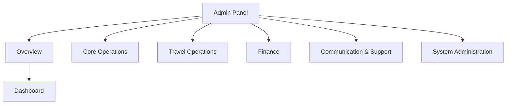
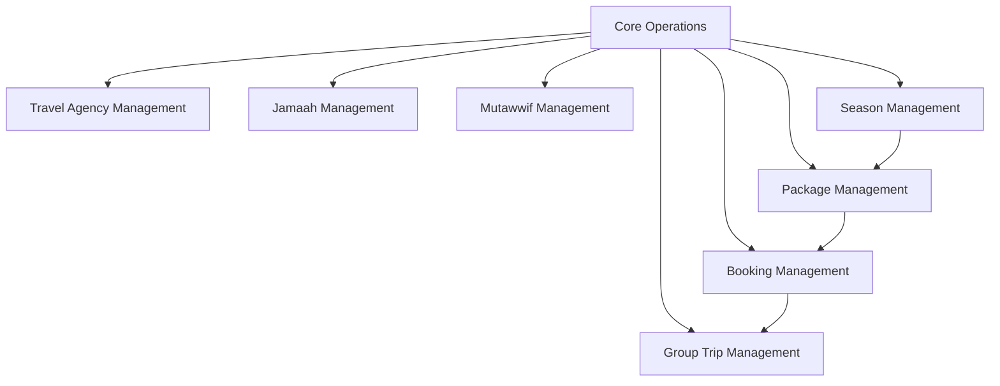
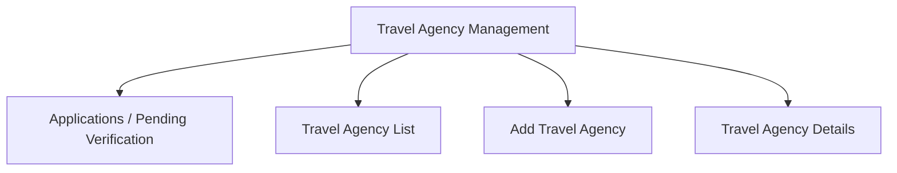
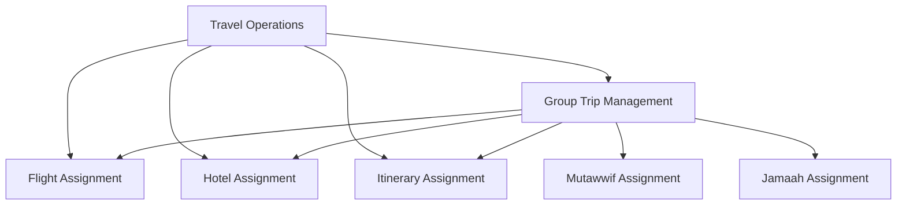
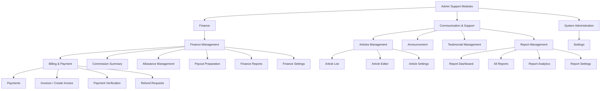
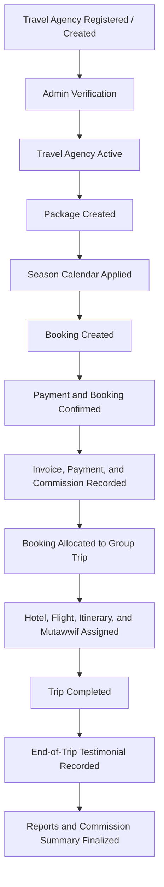
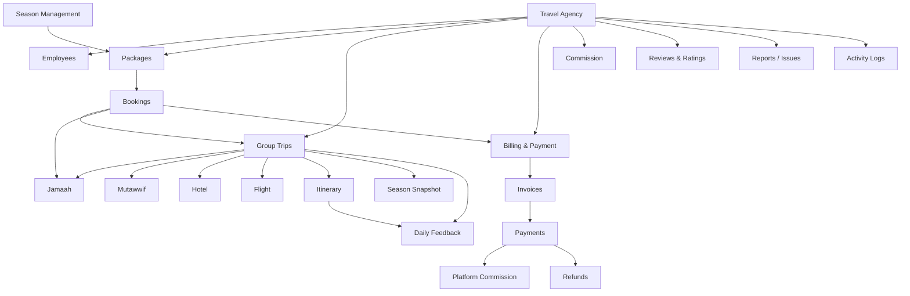
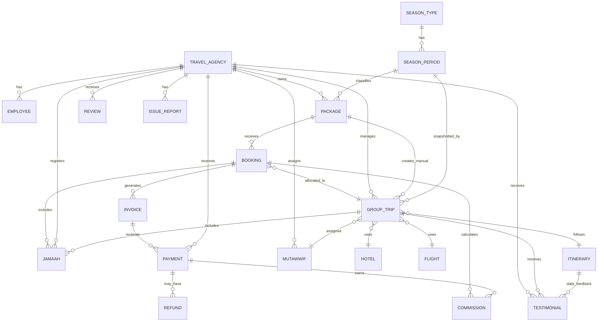

# UmrahHaji.com Admin Panel - Master Product Requirements Document

Version: v1.0
Platform: Responsive Web Platform
Scope: Admin Panel / Back Office
Status: Draft
Prepared by: Product / UI/UX Team
Last updated: 2 June 2026

> Phase 1 focuses on responsive web. Native Android and iOS applications are out of scope.


---

# Master PRD — UmrahHaji.com Admin Panel

## 1. Document Information

| Item | Description |
|---|---|
| Product Name | UmrahHaji.com Admin Panel |
| Document Type | Master PRD |
| Version | v1.0 |
| Prepared By | Product / UI/UX Team |
| Last Updated | 2 Juni 2026 |
| Status | Draft |
| Scope | Admin Panel / Back Office |

---

## 2. Product Overview

UmrahHaji.com Admin Panel is a responsive web-based platform that allows administrators to manage travel agencies, jamaah, mutawwif, packages, bookings, group trips, hotels, flights, itineraries, billing, commission, announcements, reports, and system settings.

The Admin Panel is designed as the operational back-office for UmrahHaji.com. It helps internal teams review travel agency applications, verify legal documents, manage operational data, track payments, monitor departures, and audit critical system actions.

This Master PRD serves as the parent document. Detailed requirements for each major module are documented separately in Module PRDs.

---

## 3. Goals & Objectives

1. Centralize travel agency management.
2. Support travel agency application review and verification workflows.
3. Manage jamaah data, documents, bookings, and payment records.
4. Manage packages, bookings, group trips, hotels, flights, mutawwif, and itineraries.
5. Track payments, billing, settlement, refund, and commission data.
6. Support approval, verification, notification, and audit workflows.
7. Provide responsive web access for desktop, tablet, and mobile browsers.
8. Protect sensitive data through role-based permissions.

---

## 4. Platform Scope

Phase 1 focuses on a responsive web platform. Native Android and iOS applications are out of scope.

| Platform | Scope |
|---|---|
| Desktop Web | In Scope |
| Tablet Web | In Scope |
| Mobile Web | In Scope |
| Android App | Out of Scope |
| iOS App | Out of Scope |

| Device | Width |
|---|---|
| Mobile | 320px - 767px |
| Tablet | 768px - 1023px |
| Desktop | 1024px+ |

### Portal & Design System Principle

Admin Panel and Travel Agency Portal will use the same design system to maintain visual consistency, component reuse, and development efficiency. However, each portal will have a separate navigation structure, permission model, user workflow, and data scope based on the role and operational needs of its users.

---

## 5. User Roles

| Role | Description |
|---|---|
| Super Admin | Full access to all modules and system settings |
| Admin | Manage operational modules based on assigned permissions |
| Finance Admin | Manage billing, payment, commission, settlement, and refund data |
| Operations Staff | Manage jamaah, group trips, hotels, flights, mutawwif, and itineraries |
| Compliance Officer | Review travel agency applications, legal documents, and compliance status |
| Support Staff | Handle reports, issues, complaints, and user support |
| Travel Agency Admin | Manage own agency data according to permission |
| Auditor / View Only | Read-only access to selected modules and audit logs |

Detailed permission matrix is handled in the relevant Module PRD and the Settings, Roles & Permissions PRD.

---

## 6. Admin Panel Navigation

```text
Dashboard
Travel Agency
- Applications / Pending Verification
- Travel Agency List
- Add Travel Agency
- Travel Agency Details
Jamaah
Mutawwif
Package
Booking
Group Trip
Flight
Hotel
Itinerary
Season Management
Finance Management
- Overview
- Payments
- Invoices
- Create Invoice
- Payment Verification
- Refund Requests
- Commission Summary
- Allowance Management
- Payout Preparation
- Finance Reports
- Finance Settings
Articles
Announcement
Testimonial
Reports
- Dashboard
- All Reports
- Analytics
- Settings
Settings
```

### 6.1 Admin Panel IA Overview Diagram

The diagrams below provide visual summaries of the Admin Panel navigation structure. The text navigation list remains the source of truth, while these diagrams help stakeholders quickly understand menu grouping and module placement.



### 6.2 Core Operations Navigation Detail Diagram



### 6.3 Travel Agency Navigation Detail Diagram



### 6.4 Travel Operations Navigation Detail Diagram



### 6.5 Finance, Support, and System Navigation Detail Diagram



Navigation rules:

1. Sidebar menu visibility follows user role and permission.
2. Applications is a submenu under Travel Agency because it is the intake/review stage before an agency becomes active.
3. List pages are the primary entry point for each module.
4. Dashboard quick actions may deep-link into key workflows such as review application, add agency, add jamaah, create package, create booking, create group trip, or verify payment.

---

## 7. Module Summary

| Module | Purpose |
|---|---|
| Dashboard | Shows high-level platform metrics and operational summary |
| Travel Agency Management | Manage registered agencies, applications, documents, employees, and agency status |
| Jamaah Management | Manage jamaah profiles, documents, bookings, and payment records |
| Mutawwif Management | Manage mutawwif profiles, assignments, certifications, ratings, and service performance references |
| Package Management | Manage Umrah/Hajj packages, pricing, inclusions, and availability |
| Booking Management | Manage package bookings, participants, payment readiness, cancellation, refund, and allocation to group trips |
| Group Trip Management | Manage departure groups, jamaah allocation, mutawwif, hotel, flight, and itinerary |
| Flight Management | Manage flight records and passenger assignment |
| Hotel Management | Manage hotel data, room allocation, and group trip assignment |
| Itinerary Management | Manage travel schedules and activity plans |
| Season Management | Manage season types and date periods used by package schedules, seasonal pricing references, group trip snapshots, and reporting |
| Finance Management | Manage financial operations across invoice, payment, refund, commission, allowance, payout preparation, reporting, and finance settings. Billing & Payment, Commission, Allowance, Payout Preparation, and Finance Reports are treated as Finance submodules/sub-PRDs, not separate top-level modules. |
| Articles Management | Manage educational articles, content publishing, categories, tags, featured images, SEO metadata, and article performance |
| Announcement | Manage announcements to admins, agencies, jamaah, or specific groups |
| Testimonial Management | Manage daily itinerary feedback, end-of-trip testimonials, mutawwif trip reports, ratings, media, moderation, and public display consent |
| Report Management | Manage reports, complaints, issues, assignments, status resolution, and escalations involving Jamaah, Travel Agencies, Mutawwif, and platform operations |
| Settings | Manage roles, permissions, master data, notifications, and platform configuration |

---

## 8. Core Business Flow

```text
Travel Agency registered / created
↓
Travel Agency verified by Admin
↓
Travel Agency creates packages
↓
Season calendar is applied to package schedules
↓
Jamaah/customer creates booking or Admin/Travel Agency creates booking
↓
Payment and booking confirmation are tracked
↓
Invoice, payment, and platform commission are recorded
↓
Confirmed booking is allocated to group trip
↓
Hotel, flight, itinerary, and mutawwif assigned
↓
Operational readiness, billing, and commission tracked
↓
Trip completed
↓
End-of-trip testimonial and review analytics recorded
↓
Reports and commission summary finalized
```

### 8.1 High-Level Business Flow Diagram



### 8.2 Admin Panel Module Relationship Diagram



### 8.3 Core Entity Relationship Diagram



---

## 9. Global Status Rules

### Travel Agency Status

```text
Draft
Pending Verification
Need Revision
Active
Suspended
Rejected
Inactive
```

### Package Status

```text
Draft
Active
Inactive
Archived
```

### Booking Status

```text
Draft
Pending Review
Pending Payment
Partially Paid
Confirmed
Allocated
Cancelled
Refunded
Expired
Rejected
```

### Group Trip Status

```text
Draft
Active
Completed
Cancelled
Archived
```

### Payment Status

```text
Unpaid
Partial Paid
Paid
Refunded
Failed
```

Detailed status behavior per module is defined in each Module PRD.

---

## 10. Global UX Rules

1. All list pages must support search, filter, pagination, empty state, and error state.
2. All destructive actions must show confirmation modal.
3. Delete should be avoided where possible; archive or soft delete is preferred.
4. Status changes must be logged.
5. Sensitive financial data must be protected by permission.
6. Long tables should support horizontal scroll on desktop.
7. Mobile web should use stacked cards or responsive tables.
8. Empty states should include CTA only if the user has permission.
9. Error messages must clearly explain the issue and the next action.

---

## 11. Responsive Web Behavior

### Desktop Web

1. Sidebar navigation.
2. Table-based list pages.
3. Multi-column forms.
4. Advanced filters.
5. Bulk actions where applicable.
6. Side-by-side document preview and review panels where needed.

### Mobile Web

1. Collapsible navigation.
2. Card-based list layout.
3. Stacked form sections.
4. Simplified filters.
5. Sticky primary action button.
6. Horizontal scroll for complex tables if needed.
7. Full-screen document preview for uploaded files.

---

## 12. Global Permission Rules

1. User access is role-based.
2. Each module can have Create, Read, Update, Delete permissions.
3. Sensitive modules require additional permission.
4. Bank details require View Sensitive Data permission.
5. Approval actions require Approve / Reject permission.
6. Export actions require Export permission.
7. Role and permission changes must be logged.
8. Status changes require Manage Status permission.
9. Internal remarks require Internal Remarks Read permission.

---

## 13. Notification Rules

| Trigger | Recipient |
|---|---|
| Travel Agency application submitted | Super Admin / Admin |
| Application approved | Travel Agency PIC |
| Revision requested | Travel Agency PIC |
| Application rejected | Travel Agency PIC |
| Payment submitted | Finance Admin |
| Group trip updated | Related agency users |
| Issue report submitted | Support / Operations |
| Announcement published | Target audience |

Channels:

```text
Email
In-app notification
WhatsApp, future phase
SMS, future phase
```

---

## 14. Audit Log Rules

The system must log critical actions:

1. Login.
2. Create / update / delete record.
3. Status changes.
4. Approval / rejection.
5. Document upload / replacement.
6. Bank details viewed or edited.
7. Payment verification.
8. Commission release.
9. Role and permission update.
10. Internal remarks update.

Minimum log fields:

| Field | Description |
|---|---|
| Actor | User who performed action |
| Role | User role |
| Action | Activity performed |
| Module | Related module |
| Timestamp | Date and time |
| IP Address | IP address |
| Device | Device type |

---

## 15. Data Privacy & Security

1. Sensitive data must be restricted by permission.
2. Bank and payment data must not be visible to unauthorized roles.
3. Passport, identity, and uploaded documents require access control.
4. Document access must be logged.
5. Admin actions must be auditable.
6. Password and session settings must follow security policy.
7. Two-factor authentication can be supported in a future phase.
8. Session timeout is required for admin users.

### File Upload & Storage Policy

1. Each upload field must define allowed format, max file size, and optimization rule.
2. Profile/logo images should be limited to 2 MB and resized/compressed before storage.
3. Identity, legal, travel, and supporting documents should generally be limited to 5 MB per file unless a module explicitly requires otherwise.
4. Supported formats should be limited to JPG, JPEG, PNG, WEBP, and PDF unless the module requires another format.
5. System must reject files that exceed configured max size.
6. System should generate thumbnails/previews and avoid loading original files in list or card views.
7. Original files should be loaded only when user opens preview/download and has permission.
8. Uploaded files should be stored in object storage or equivalent file storage, not directly inside the application server filesystem.
9. Server must validate MIME type and file extension.
10. Uploaded files should be scanned for malware if scanning service is available.

---

## 16. MVP Scope

```text
Dashboard
Travel Agency Management
Jamaah Management
Package Management
Season Management
Group Trip Management
Mutawwif Management
Hotel & Flight
Itinerary
Finance Management
Report Management
Articles Management
Settings & Role Permission
```

MVP notes:

1. Travel Agency Applications review flow is included.
2. Manual legal document verification is included.
3. Role-based access control is required before production.
4. Payment tracking and verification are included.
5. Direct Jamaah assignment into Group Trip is supported for manual operations.
6. Full Booking Management is not required for Phase 1 MVP.
7. Season Management is included as Phase 1 master data for package schedules and seasonal pricing references.
8. Report Management is included as Phase 1 lightweight support and issue tracking.
9. Articles Management is included as Phase 1 lightweight content publishing for guidance and educational articles.
10. Finance Management is included as Phase 1 finance umbrella for manual invoice/payment tracking, refund visibility, commission summary, allowance records, payout preparation, and finance reports.
11. Advanced analytics and automation are not required for MVP.

Phase 2 Full Scope:

```text
Booking Management
Customer / public package booking flow
Travel Agency booking workspace
Admin-assisted booking creation
Booking payment, invoice, cancellation, and refund workflow
Billing & Payment Management with payment links, reminders, reports, settings, and commission calculation
Advanced Finance Management with allowance approval workflow, payout batches, settlement reporting, and reconciliation
Booking-to-group-trip allocation
Booking-based commission calculation
Advanced commission
Payout workflow
Advanced review analytics
Testimonial Management with daily feedback, end-of-trip feedback, mutawwif trip reports, moderation, and public display consent
WhatsApp automation
AI report summary
Advanced report automation and SLA analytics
Advanced article editorial workflow, multilingual articles, content calendar, and SEO integration
Advanced dashboard analytics
External provider integrations
Native mobile app
```

Phase 2 is intended to cover the full operational product scope beyond MVP. Booking Management should therefore be treated as a dedicated Phase 2 module, not merely as a future note inside Package or Group Trip.

---

## 17. Out of Scope

The following items are out of scope for Phase 1 MVP unless explicitly moved into Phase 2 implementation planning.

1. Native Android app in Phase 1.
2. Native iOS app in Phase 1.
3. Public marketplace SEO pages.
4. Advanced CRM automation.
5. AI-based travel recommendation.
6. Full accounting system.
7. Payroll system.
8. Offline mobile app support.
9. Real-time external flight/hotel provider integration in Phase 1.

---

## 18. Dependencies & Assumptions

1. Payment gateway will be integrated in Phase 2 or later implementation phase.
2. Travel Agency data may come from admin input or public application form.
3. Legal document verification is handled manually by admin in Phase 1.
4. WhatsApp notification requires third-party integration.
5. Role-based access control is required before production release.
6. Master data for countries, cities, airlines, hotel categories, and package types must be available.
7. Season types and season periods must be available before season-specific package pricing is published.
8. Report attachments require secure object storage or equivalent private file storage.
9. Uploaded documents require secure file storage.

---

## 19. Success Metrics

1. Admin can manage travel agency data from one panel.
2. Admin can verify agency applications.
3. Admin can track jamaah, booking, and group trip data.
4. Payment tracking errors are reduced.
5. Admin can audit critical actions.
6. Operational data can be accessed on desktop and mobile web.
7. Average time to review a complete agency application decreases.
8. Critical actions have complete audit logs.

---

## 20. Related Module PRDs

All Module PRDs should follow the standard Module PRD structure:

```text
1. Document Information
2. Module Overview
3. Objective
4. Scope
5. User Roles & Permissions
6. Navigation & Entry Point
7. Information Architecture
8. Main User Flow
9. List Page Requirements
10. Create / Add Page Requirements
11. Detail Page Requirements
12. Edit Page Requirements
13. Status Management
14. Approval / Review Flow
15. Field Specification
16. Validation Rules
17. Empty State
18. Error State
19. Notification Rules
20. Activity Log Requirements
21. Responsive Web Behavior
22. Security & Permission Notes
23. Acceptance Criteria
```

```text
PRD 01 — Travel Agency Management
PRD 02 — Jamaah Management
PRD 03 — Package Management
PRD 04 — Booking Management
PRD 05 — Group Trip Management
PRD 06 — Mutawwif Management
PRD 07 — Flight Management
PRD 08 — Hotel Management
PRD 09 — Itinerary Management
PRD 10 — Season Management
PRD 11 — Finance Management
PRD 11.1 — Billing & Payment
PRD 11.2 — Refund Management
PRD 11.3 — Commission Management
PRD 11.4 — Allowance Management
PRD 11.5 — Payout Preparation
PRD 11.6 — Finance Reports & Settings
PRD 12 — Testimonial Management
PRD 13 — Report Management
PRD 14 — Articles Management
PRD 15 — Review & Remarks
PRD 16 — Settings, Roles & Permissions
```
