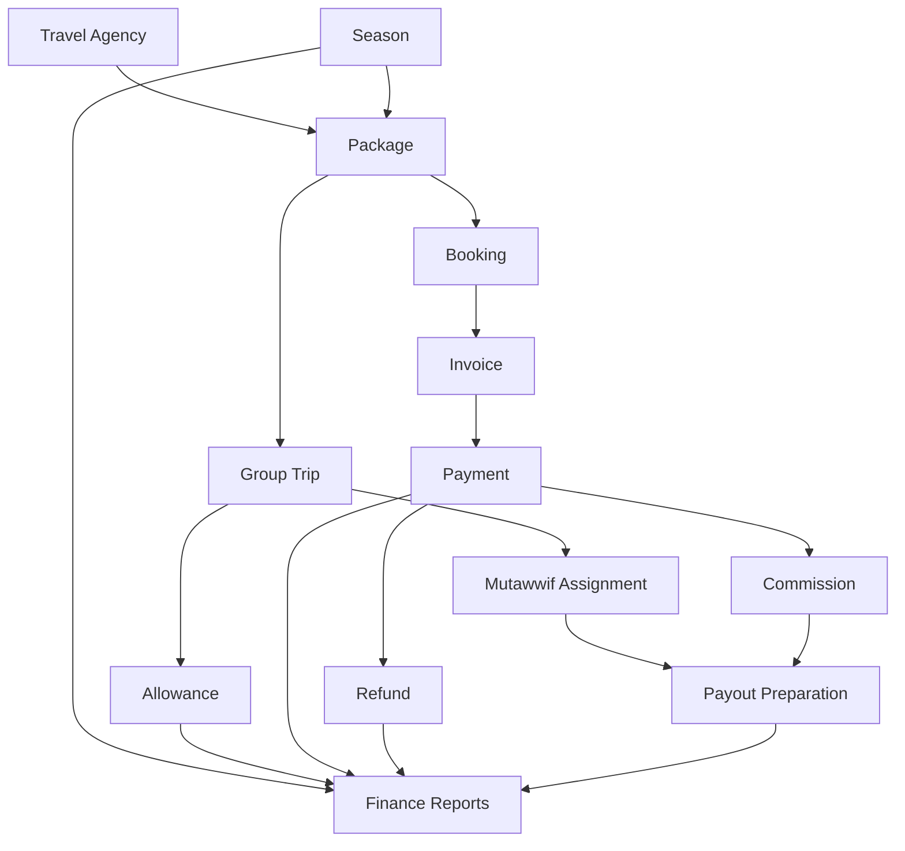
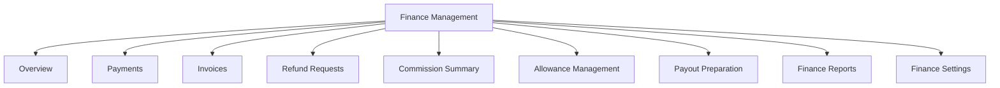
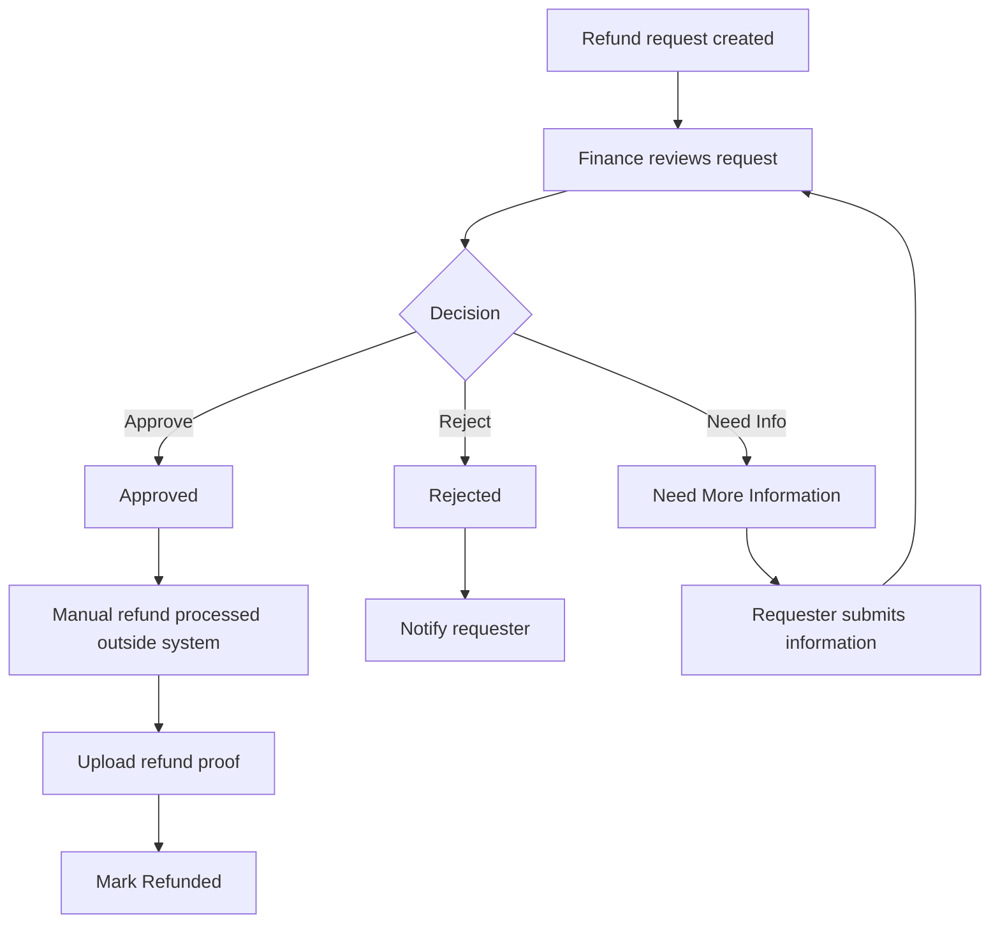
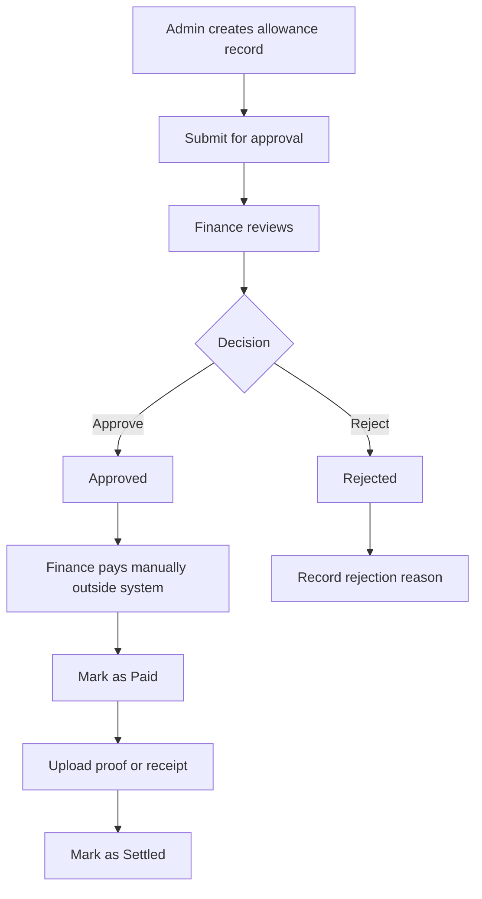

# Finance Management - Module Product Requirements Document

Version: v1.0
Platform: Responsive Web Platform
Scope: Invoice, Payment, Refund, Commission, Allowance, Payout Preparation, and Finance Reports
Status: Draft
Prepared by: Product / UI/UX Team
Last updated: 2 June 2026

> Phase 1 focuses on responsive web. Native Android and iOS applications are out of scope.


---

# Module PRD - Finance Management

Product: UmrahHaji.com Admin Panel
Module: Finance Management
Platform: Responsive Web Admin Panel
Document Type: Module Product Requirements Document
Status: Draft
Last Updated: 4 June 2026

---

## 1. Objective

Finance Management is the financial operations workspace for UmrahHaji.com Admin.

It allows Admin and Finance teams to monitor money-related activities across Travel Agencies, packages, bookings, group trips, jamaah payments, platform commission, refunds, allowances, payout preparation, and finance reports.

Finance Management should become the umbrella menu that contains Billing & Payment, Commission, Allowance, Refund, Payout Preparation, and Finance Reports.

### PRD Structure Recommendation

Finance Management should be reviewed as one parent PRD with several finance sub-PRDs/sections:

```text
PRD 11 — Finance Management
├── PRD 11.1 Billing & Payment
├── PRD 11.2 Refund Management
├── PRD 11.3 Commission Management
├── PRD 11.4 Allowance Management
├── PRD 11.5 Payout Preparation
└── PRD 11.6 Finance Reports & Settings
```

Billing & Payment and Allowance may still have detailed documents because their forms, status flows, and audit rules are long enough to deserve separate review. However, in the Admin Panel navigation, they should remain under Finance Management.

---

## 2. Product Positioning

Billing & Payment Management is focused on invoices and payments. Finance Management is broader.

| Area | Purpose |
|---|---|
| Billing & Payment | Invoices, payments, payment verification, receipts, outstanding balance |
| Commission | Platform commission, agent commission, public commission, earned/reversed/settled status |
| Refund | Refund request, refund review, approval, payment reversal, refund proof |
| Allowance | Operational money assigned to trip, mutawwif, travel agency, staff, transport, meal, or emergency needs |
| Payout Preparation | Prepare payout-ready data for mutawwif, travel agency settlement, agent commission, or operational claims |
| Finance Reports | Revenue, collection, outstanding, commission, allowance, payout, refund, and season performance |
| Finance Settings | Payment terms, invoice numbering, tax, currency, commission rules, allowance rules, payout rules |

### Recommended Navigation Rename

The current `Billing & Payment` menu should be renamed to `Finance Management` because allowance and payout preparation are now included in the financial scope.

```text
Finance Management
├── Overview
├── Payments
├── Invoices
├── Refund Requests
├── Commission Summary
├── Allowance Management
├── Payout Preparation
├── Finance Reports
└── Finance Settings
```

---

## 3. Scope

### In Scope for Phase 1

1. Finance overview dashboard.
2. Payment list and payment status monitoring.
3. Invoice list and manual invoice creation.
4. Manual payment record.
5. Payment proof upload and verification.
6. Refund request tracking.
7. Basic platform commission summary.
8. Manual allowance records.
9. Allowance approval status.
10. Allowance proof/receipt upload.
11. Payout-ready data view for mutawwif and commission.
12. Finance export.
13. Basic finance reports.
14. Finance activity log.
15. Role-based finance access.

### Out of Scope for Phase 1

1. Automated payment gateway settlement.
2. Automated bank reconciliation.
3. Automated payout execution.
4. Full accounting ledger.
5. Payroll.
6. Tax filing.
7. Supplier/vendor payment automation.
8. Multi-currency accounting ledger.
9. Advanced approval workflow with multiple approval levels.

### Phase 2 Enhancements

1. Payment gateway integration and settlement status.
2. Payment link automation.
3. Automated receipt.
4. Installment reminders.
5. Refund disbursement tracking.
6. Semi-automated payout workflow.
7. Travel Agency settlement report.
8. Mutawwif payout batch.
9. Agent commission payout.
10. Finance approval workflow.
11. Advanced reconciliation.
12. Accounting export.
13. Tax report.
14. Advanced finance analytics.

---

## 4. Finance Principles

1. Every financial action must be auditable.
2. Paid, settled, refunded, or approved records should not be silently edited.
3. Corrections require reason, role permission, and activity log.
4. Customer-facing invoice should not expose internal commission or platform fee details unless intentionally configured.
5. Internal finance records should be separated from public/customer records.
6. Allowance and payout should be tracked even if actual cash transfer happens manually outside the system in Phase 1.
7. Uploads must be size-limited and stored in object storage or equivalent private file storage.

---

## 5. Relationship With Other Modules

| Module | Relationship |
|---|---|
| Travel Agency Management | Finance records are scoped by Travel Agency |
| Package Management | Package price, deposit, commission, and season pricing become finance defaults |
| Booking Management | Booking can create invoice, outstanding balance, refund, and commission records |
| Group Trip Management | Group trip can create operational allowance and mutawwif payout references |
| Jamaah Management | Jamaah is bill-to customer and payment owner |
| Mutawwif Management | Mutawwif assignment creates payout-ready data and allowance references |
| Season Management | Season is used as pricing and reporting dimension |
| Billing & Payment Management | Owns invoice and payment record details |
| Report Management | Payment/allowance disputes can become finance reports/issues |
| Settings | Provides currency, tax, invoice prefix, payment terms, role permissions, and notification rules |



---

## 6. User Roles & Permissions

| Role | Access |
|---|---|
| Super Admin | Full finance access |
| Finance Admin | Manage invoices, payments, refunds, commission, allowance, payout prep, settings, exports |
| Finance Staff | Record payments, review allowance, export reports based on permission |
| Operations Admin | View payment readiness, create allowance request, view trip finance summary |
| Travel Agency Admin | View own agency finance records if enabled |
| Support Staff | View payment/refund status and add remarks |
| Auditor | Read-only finance records and activity logs |

### Permission Keys

| Permission Key | Description |
|---|---|
| finance.view | View finance dashboard and summaries |
| finance.payment.view | View payment records |
| finance.payment.record | Record manual payment |
| finance.payment.verify | Verify payment proof |
| finance.invoice.create | Create invoice |
| finance.invoice.edit | Edit draft invoice |
| finance.refund.manage | Review and update refund request |
| finance.commission.view | View commission summary |
| finance.commission.adjust | Adjust commission with reason |
| finance.allowance.view | View allowance records |
| finance.allowance.create | Create allowance record/request |
| finance.allowance.approve | Approve or reject allowance |
| finance.allowance.mark_paid | Mark allowance as paid |
| finance.payout.view | View payout preparation |
| finance.payout.prepare | Prepare payout batch |
| finance.export | Export finance data |
| finance.settings.manage | Manage finance settings |

---

## 7. Information Architecture

```text
Finance Management
├── Overview
│   ├── Total Revenue
│   ├── Collected
│   ├── Outstanding
│   ├── Overdue
│   ├── Platform Commission
│   ├── Pending Refunds
│   ├── Pending Allowances
│   └── Payout Ready
├── Payments
├── Invoices
├── Refund Requests
├── Commission Summary
├── Allowance Management
├── Payout Preparation
├── Finance Reports
└── Finance Settings
```



---

## 8. Finance Overview

### Summary Cards

| Card | Description |
|---|---|
| Total Revenue | Total invoice amount or recognized revenue based on selected period |
| Collected | Verified payment amount |
| Outstanding | Invoice amount not yet collected |
| Overdue | Outstanding amount past due date |
| Collection Rate | Collected amount divided by total due amount |
| Platform Commission | Commission earned by platform |
| Pending Refunds | Refund requests waiting for action |
| Pending Allowances | Allowance requests waiting for approval or payment |
| Payout Ready | Commission or mutawwif payout records ready for manual processing |

### Filters

1. Date range.
2. Travel Agency.
3. Package.
4. Group Trip.
5. Season.
6. Payment status.
7. Finance category.

---

## 9. Payments

Payments are handled in detail by Billing & Payment Management. Finance Management should expose a unified view for monitoring.

### Payment Columns

| Column | Description |
|---|---|
| Payment ID / Invoice ID | Unique payment or invoice reference |
| Travel Agency | Related agency |
| Jamaah / Customer | Paying customer |
| Package / Booking | Related package or booking |
| Amount | Payment amount |
| Method | Bank Transfer, FPX, Card, E-wallet, Cash, Manual |
| Payment Status | Pending, Processing, Verified, Failed, Refunded |
| Verification Status | Unverified, Verified, Rejected |
| Commission | Platform commission from payment |
| Paid At | Payment date |
| Actions | View, Record Payment, Verify, Download Receipt |

### Payment Rules

1. Payment verification requires proof or gateway confirmation.
2. Manual payment requires payment date, method, amount, reference, and note.
3. Verified payment updates invoice progress.
4. Rejected proof must include rejection reason.
5. Overpayment should create credit or adjustment review.

---

## 10. Invoices

Invoices are customer-facing financial requests.

### Invoice Types

1. Package invoice.
2. Booking invoice.
3. Add-on/service invoice.
4. Manual/custom invoice.
5. Adjustment invoice.
6. Credit note in Phase 2.

### Invoice Status

| Status | Description |
|---|---|
| Draft | Created but not sent |
| Sent / Open | Sent to customer or ready for payment |
| Partially Paid | Some payment received |
| Paid | Fully paid |
| Overdue | Past due date with outstanding balance |
| Void | Cancelled and no longer payable |
| Refunded | Payment refunded partially or fully |

---

## 11. Refund Requests

Refund Requests track money that may need to be returned to customer or agency.

### Refund Flow



### Refund Fields

| Field | Type | Required | Notes |
|---|---|---:|---|
| Refund Source | Dropdown | Yes | Invoice, Booking, Payment, Manual |
| Related Invoice | Search/select | Conditional | Required if invoice-based |
| Related Jamaah | Search/select | Conditional | Required if customer refund |
| Travel Agency | Search/select | Yes | Finance scope |
| Refund Amount | Currency input | Yes | Cannot exceed refundable balance unless override |
| Refund Reason | Dropdown | Yes | Cancellation, Overpayment, Service Issue, Duplicate Payment, Other |
| Description | Textarea | No | Max 1,000 chars |
| Status | Dropdown | Yes | Pending, Need Info, Approved, Rejected, Refunded |
| Refund Proof | Upload | Conditional | Required when marked Refunded |
| Finance Remark | Textarea | No | Internal note |

---

## 12. Commission Summary

Commission Summary tracks platform and agent earnings.

### Commission Types

| Type | Description |
|---|---|
| Platform Commission | Revenue earned by UmrahHaji.com |
| Agent Commission | Commission for internal or external agent |
| Public Commission | Public referral commission if enabled |
| Travel Agency Commission | Optional settlement-related commission |

### Commission Status

| Status | Description |
|---|---|
| Pending | Waiting for payment confirmation |
| Earned | Payment verified and commission recognized |
| Reversed | Commission reversed due to refund/cancellation |
| Settlement Ready | Ready for finance settlement |
| Settled | Marked as settled manually or through payout workflow |

### Rules

1. Commission should be calculated from package/booking/payment rules.
2. Commission should not be finalized until payment is verified.
3. Refund or cancellation can reverse commission.
4. Manual commission adjustment requires reason and permission.

---

## 13. Allowance Management

Allowance Management tracks operational funds issued or requested for trip-related needs.

### Use Cases

1. Meal allowance for group trip.
2. Transport allowance.
3. Mutawwif operational allowance.
4. Emergency trip allowance.
5. Staff cash advance.
6. Travel Agency operational support.
7. Miscellaneous approved trip expense.

### Allowance Types

| Type | Example |
|---|---|
| Meal | Food budget during group trip |
| Transport | Bus, train, local transport, emergency transport |
| Mutawwif | Guide operational allowance |
| Accommodation Support | Hotel-related operational support |
| Emergency | Unexpected trip issue |
| Staff Advance | Internal admin/staff cash advance |
| Travel Agency Support | Agency-requested operational support |
| Other | Custom |

### Allowance Status

| Status | Description |
|---|---|
| Draft | Created but not submitted |
| Pending Approval | Waiting for finance approval |
| Approved | Approved but not yet paid |
| Rejected | Not approved |
| Paid | Money issued manually |
| Settled | Proof/receipt submitted and accepted |
| Cancelled | Cancelled before payment |

### Allowance Flow



### Allowance List Columns

| Column | Description |
|---|---|
| Allowance ID | Unique record |
| Related Type | Group Trip, Mutawwif, Travel Agency, Staff, Manual |
| Related Record | Trip / Mutawwif / Agency / Staff name |
| Allowance Type | Meal, Transport, Mutawwif, Emergency, Other |
| Amount | Requested or approved amount |
| Currency | Default MYR unless configured |
| Requester | User who created/submitted |
| Approver | Finance user who approved/rejected |
| Status | Draft, Pending Approval, Approved, Paid, Settled, Rejected |
| Due / Needed Date | Date funds are needed |
| Proof | Receipt/proof status |
| Actions | View, Edit, Approve, Reject, Mark Paid, Settle |

### Allowance Form Fields

| Field | Type | Required | Validation | Notes |
|---|---|---:|---|---|
| Allowance Title | Text input | Yes | Max 120 chars | Short description |
| Related Type | Dropdown | Yes | Group Trip, Mutawwif, Travel Agency, Staff, Manual | Determines related lookup |
| Related Record | Search/select | Conditional | Required unless Manual | Linked context |
| Travel Agency | Search/select | Conditional | Required when agency-scoped |
| Group Trip | Search/select | Conditional | Required when trip-scoped |
| Mutawwif | Search/select | Conditional | Required when mutawwif-scoped |
| Allowance Type | Dropdown | Yes | Existing active type | Meal, Transport, etc. |
| Amount | Currency input | Yes | Greater than 0 | Requested amount |
| Currency | Dropdown | Yes | Default MYR | Configurable |
| Needed Date | Date picker | No | Valid date | When allowance is needed |
| Payment Method | Dropdown | No | Bank Transfer, Cash, E-wallet, Other | Phase 1 manual |
| Bank / Account Reference | Text input | No | Max 120 chars | Optional recipient/payment ref |
| Description | Textarea | No | Max 1,000 chars | Reason/use case |
| Priority | Dropdown | No | Normal, Important, Urgent | For review |
| Status | Dropdown | Yes | Based on flow | Permission-based |
| Finance Remark | Textarea | No | Max 1,000 chars | Internal note |

### Allowance Upload Rules

| Upload Type | Allowed Formats | Max Size | Max Count | Notes |
|---|---|---:|---:|---|
| Request Attachment | JPG, JPEG, PNG, WEBP, PDF | 5 MB/file | 5 | Supporting document before approval |
| Payment Proof | JPG, JPEG, PNG, WEBP, PDF | 5 MB/file | 3 | Required when marking Paid if configured |
| Settlement Receipt | JPG, JPEG, PNG, WEBP, PDF | 5 MB/file | 10 | Receipt or expense proof |

Rules:

1. Files must be stored in object storage or equivalent private file storage.
2. Original files should load only on preview/download.
3. Thumbnails should be generated for images.
4. MIME type and extension must be validated.
5. Uploads should be malware-scanned if available.

---

## 14. Payout Preparation

Payout Preparation is not automated payout execution in Phase 1.

It is a finance workspace to gather payout-ready records so Finance can process payment manually outside the system.

### Payout Sources

1. Mutawwif completed trip assignment.
2. Agent commission.
3. Public referral commission.
4. Travel Agency settlement.
5. Approved allowance.

### Payout Status

| Status | Description |
|---|---|
| Pending | Not ready or awaiting condition |
| Ready | Ready for Finance review |
| On Hold | Temporarily held |
| Prepared | Added to payout batch or manual payout list |
| Paid | Paid manually outside system |
| Cancelled | Cancelled or no longer payable |

### Phase 1 Rules

1. System prepares payout-ready data only.
2. Finance manually executes payout outside the platform.
3. Finance uploads proof or reference after payment.
4. Payout amount can be adjusted only with permission and reason.
5. Payout history must be auditable.

---

## 15. Finance Reports

### Phase 1 Reports

1. Revenue summary.
2. Collection summary.
3. Outstanding summary.
4. Overdue summary.
5. Platform commission summary.
6. Refund summary.
7. Allowance summary.
8. Payout-ready summary.
9. Travel Agency finance summary.
10. Package finance summary.
11. Season finance summary.

### Report Filters

1. Date range.
2. Travel Agency.
3. Package.
4. Group Trip.
5. Season.
6. Payment status.
7. Refund status.
8. Allowance status.
9. Payout status.

---

## 16. Finance Settings

### Settings Groups

| Group | Examples |
|---|---|
| Currency Settings | Default currency, exchange display rule |
| Invoice Settings | Prefix, numbering, default notes, terms |
| Payment Settings | Accepted methods, default terms, proof requirement |
| Tax Settings | Tax percentage, tax display rule, tax registration number |
| Commission Settings | Platform commission default, agent commission rules |
| Allowance Settings | Allowance types, approval requirement, proof requirement |
| Payout Settings | Payout batch rules, required bank fields, proof requirement |
| Notification Settings | Reminder, receipt, refund, allowance approval, payout status |

---

## 17. Activity Log Requirements

Finance activity logs must record:

1. Invoice created, sent, updated, voided.
2. Payment recorded, verified, rejected, corrected.
3. Refund requested, approved, rejected, marked refunded.
4. Commission calculated, adjusted, reversed, settled.
5. Allowance created, submitted, approved, rejected, paid, settled.
6. Payout prepared, held, marked paid, cancelled.
7. Finance setting changed.
8. Export generated.

Each log should include actor, timestamp, action, old value, new value, reason if required, and related record.

---

## 18. Notifications

| Event | Recipient | Channel |
|---|---|---|
| Invoice sent | Jamaah / customer | Email / WhatsApp in Phase 2 |
| Payment verified | Jamaah / customer, Travel Agency | Email / in-app |
| Payment rejected | Jamaah / customer, Travel Agency | Email / in-app |
| Refund status updated | Requester / customer | Email / in-app |
| Allowance submitted | Finance Admin | In-app |
| Allowance approved/rejected | Requester | In-app / email |
| Payout marked paid | Related user/agency if enabled | In-app / email |
| Overdue payment | Finance Admin / Travel Agency | In-app / email |

---

## 19. Security & Compliance

1. Finance records are sensitive and must follow role-based access.
2. Bank/account data should be masked where possible.
3. Export access should be restricted.
4. Payment proof and allowance receipt should be private files.
5. Every financial status change must be logged.
6. Amount correction requires reason.
7. Deleted finance records should be soft-deleted or voided, not removed permanently.
8. Customer-facing screens must not expose internal finance notes.
9. Platform commission and payout values must be hidden from unauthorized users.

---

## 20. Responsive Web Behavior

### Desktop

1. Dashboard cards and report charts use grid layout.
2. Finance lists use table view.
3. Long finance tables support horizontal scroll.
4. Forms use sectioned layout.

### Tablet

1. Summary cards wrap into 2-column layout.
2. Filters wrap or collapse.
3. Tables support horizontal scroll.

### Mobile

1. Finance list becomes stacked cards.
2. Filters collapse into drawer.
3. Finance details use single-column layout.
4. Primary action appears in sticky footer.
5. Sensitive amount fields remain readable and not clipped.

---

## 21. Acceptance Criteria

1. Admin can access Finance Management based on permission.
2. Finance dashboard shows revenue, collected, outstanding, commission, refund, allowance, and payout summaries.
3. Admin can monitor payments and invoices from Finance Management.
4. Finance can record manual payment.
5. Finance can verify or reject payment proof.
6. Finance can monitor refund requests.
7. Finance can view platform commission summary.
8. Admin/Operations can create allowance record if permission is granted.
9. Finance can approve, reject, mark paid, and settle allowance record.
10. Finance can upload allowance payment proof and settlement receipt within file limits.
11. Payout Preparation shows payout-ready data for mutawwif and commission without executing automated payout.
12. Finance can export finance records if permission is granted.
13. All finance status changes create activity logs.
14. Unauthorized users cannot view sensitive finance details.
15. The module is usable on desktop, tablet, and mobile web.

---

## 22. Open Questions

1. Should Finance Management replace Billing & Payment as the sidebar label immediately, or only after allowance is implemented?
2. Should Travel Agency Admin be allowed to create allowance requests, or only Admin/Operations?
3. What is the approval rule for allowance: single Finance approval or Super Admin approval above a threshold?
4. Should mutawwif payout be fixed per trip, per day, per jamaah, role-based, or custom?
5. Should allowance settlement require receipt before trip completion?
6. Should payout preparation include Travel Agency settlement in Phase 1 or Phase 2?
