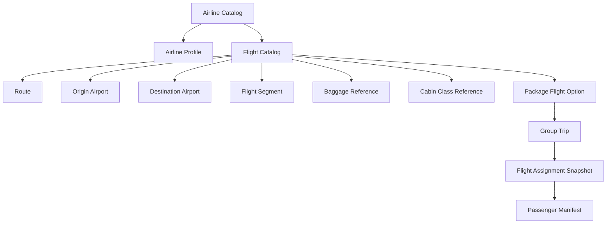
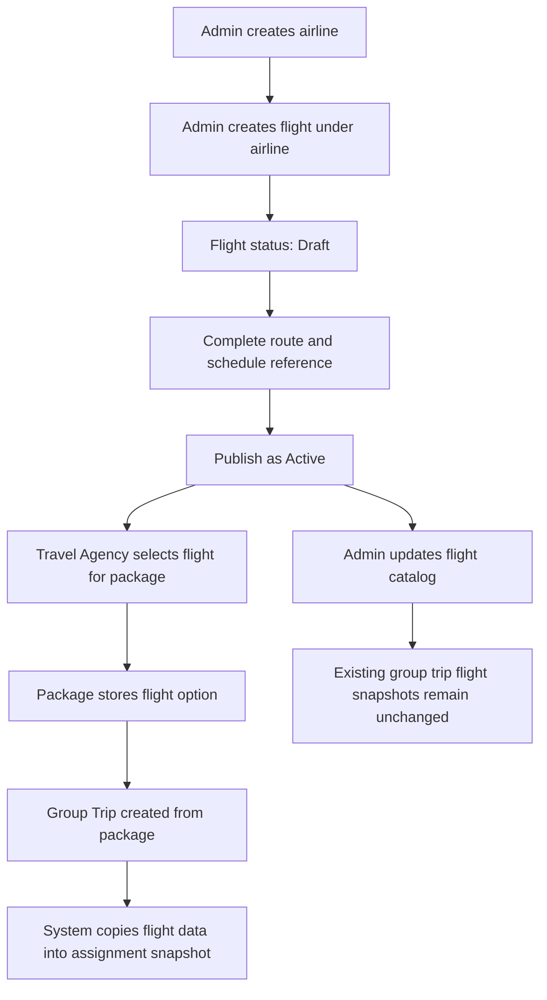
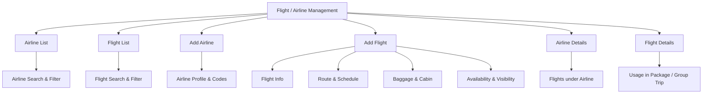
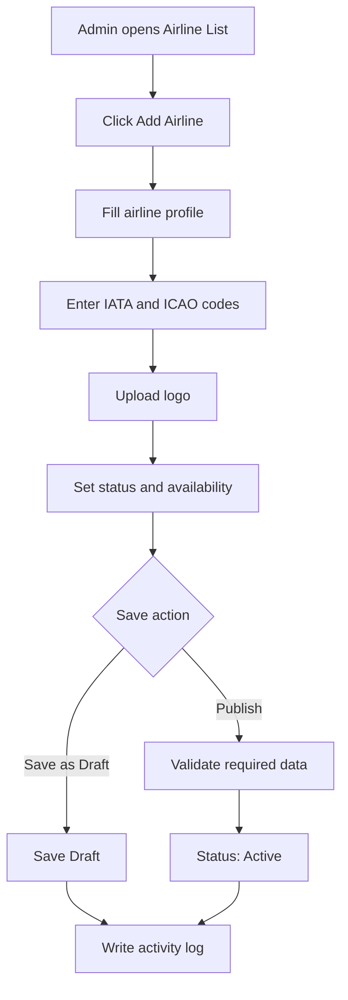
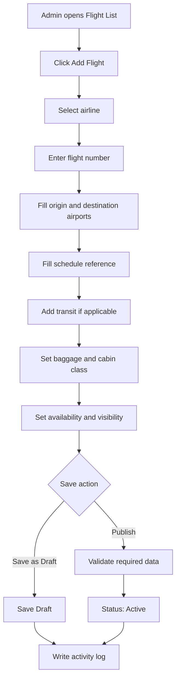
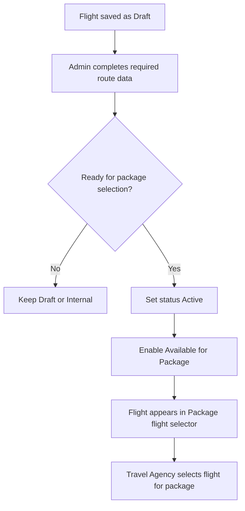
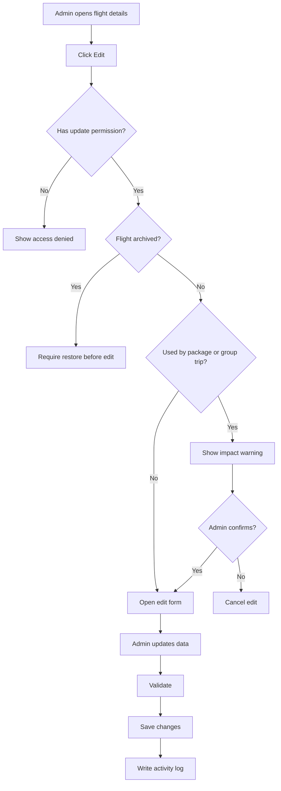
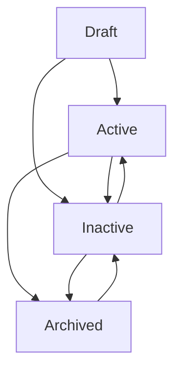
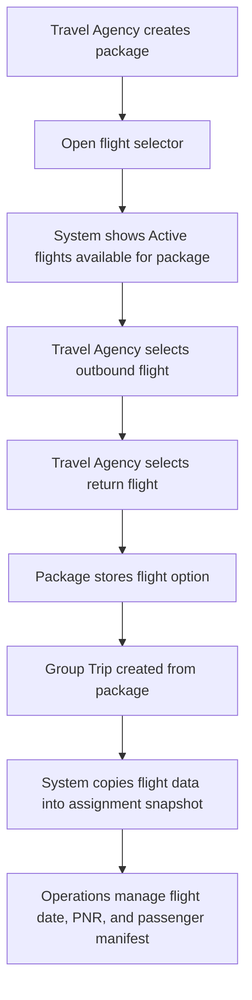

# Flight / Airline Management - Module Product Requirements Document

Version: v1.0
Platform: Responsive Web Platform
Scope: Flight / Airline Management
Status: Draft
Prepared by: Product / UI/UX Team
Last updated: 2 June 2026

> Phase 1 focuses on responsive web. Native Android and iOS applications are out of scope.


---

# Module PRD - Flight / Airline Management

Version: 1.0  
Date: 3 Juni 2026  
Parent Document: Master PRD - UmrahHaji.com Admin Panel  
Scope: Flight / Airline Management

---

## 1. Objective

Flight / Airline Management memungkinkan Admin untuk membuat, mengelola, memverifikasi, dan mengarsipkan airline serta flight catalog yang nantinya dapat dipilih oleh Travel Agency saat membuat Package atau Group Trip.

Module ini bukan flight booking engine dan bukan live flight tracking system. Fokus utama module ini adalah menyediakan master data airline dan flight yang rapi, valid, mudah dipilih, dan siap digunakan dalam package/trip.

Module ini berfokus pada:

1. Airline List.
2. Flight List.
3. Add Airline.
4. Add Flight.
5. Airline Details.
6. Flight Details.
7. Airline code and logo.
8. Flight number and route.
9. Airport, terminal, and timezone data.
10. Transit / connection information.
11. Baggage and cabin class reference.
12. Availability for package selection.
13. Usage visibility by Package and Group Trip.
14. Activity logs and permission-based access.

Flight data harus membantu Travel Agency membuat package dengan cepat dan membantu customer memahami maskapai, flight number, rute, transit, jam keberangkatan/kedatangan, durasi, baggage reference, dan informasi perjalanan udara.

---

## 2. Scope

### In Scope

1. Airline List.
2. Flight List.
3. Search, filter, sort, pagination, row actions, and bulk actions.
4. Add Airline.
5. Edit Airline.
6. Airline Details.
7. Add Flight.
8. Edit Flight.
9. Flight Details.
10. Status management: Draft, Active, Inactive, Archived.
11. Airline profile: name, IATA code, ICAO code, country, logo.
12. Flight profile: airline, flight number, route, airport, terminal, timezone, duration.
13. One-way, round-trip, outbound, return, and transit segment reference.
14. Baggage allowance reference.
15. Cabin class reference.
16. Aircraft type reference.
17. Availability for package selection.
18. Usage tracking by Package and Group Trip.
19. Duplicate detection.
20. Upload size and storage policy.
21. Activity log for critical changes.
22. Responsive web behavior for desktop, tablet, and mobile web.

### Out of Scope

1. Native Android app.
2. Native iOS app.
3. Live flight booking.
4. Real-time flight status tracking.
5. Seat inventory.
6. Ticket issuance.
7. PNR management as a primary workflow.
8. Airline API integration in Phase 1.
9. GDS integration.
10. Fare/rate management.
11. Passenger manifest management as a primary module.
12. Flight delay notification automation.

Notes:

1. Airline and Flight data are catalog/master data in Phase 1.
2. Travel Agency can select available flights from the catalog when creating package.
3. Group Trip can copy selected flight data into trip flight assignment/snapshot.
4. Passenger manifest, PNR, ticketing deadline, and actual departure operation belong to Group Trip or Operations workflow.
5. Flight catalog does not guarantee seat availability unless an inventory/ticketing integration is added later.

### Portal & Design System Principle

Admin Panel and Travel Agency Portal will use the same design system to maintain visual consistency, component reuse, and development efficiency. However, each portal will have a separate navigation structure, permission model, user workflow, and data scope based on the role and operational needs of its users.

---

## 3. Aviation Data Principles

The product should use standard aviation identifiers where possible.

| Data | Product Use |
|---|---|
| IATA Airline Code | 2-character airline code commonly used in booking, tickets, and customer-facing flight numbers |
| ICAO Airline Code | 3-letter airline code used more in flight operations |
| IATA Airport Code | 3-letter airport/location identifier commonly shown to passengers |
| ICAO Airport Code | 4-letter airport/location indicator used in operations |
| Flight Number | Airline code + numeric designator, optionally with suffix if needed |
| Aircraft Type | Aircraft model/type reference, preferably aligned to standard aircraft type designator if used |

Product rules:

1. Customer-facing package should primarily show airline name, airline logo, IATA airline code, flight number, airport IATA code, departure/arrival city, and local time.
2. Admin/internal records may also store ICAO code and aircraft type.
3. Airport data should be managed as Master Data so it can be reused by Flight, Package, Group Trip, and Itinerary modules.
4. Timezone must be stored with airport/city, not only typed manually on each flight.
5. Codes should be validated where possible, but Phase 1 can allow manual entry with duplicate warning.

Research references:

1. IATA provides official airline and airport code search for assigned IATA codes.
2. IATA location codes are 3-letter identifiers used for commercial airline purposes.
3. IATA two-character airline designator eligibility references airline operational and schedule publication requirements.
4. ICAO Doc 8643 is the official aircraft type designator reference.

---

## 4. Relationship With Other Modules

Flight / Airline Management stores airline and flight catalog data. Package and Group Trip use flight data differently.

Core product principle:

```text
Airline Catalog
↓ has many
Flight Catalog
↓ selected while creating Package
Package Flight Option
↓ used while creating Group Trip
Group Trip Flight Assignment / Snapshot
```

The system must separate catalog data from operational assignment. Airline and flight records are reusable. A package flight option is a package-level offer. A group trip flight assignment is the actual flight plan for a real departure.

| Related Module | Relationship |
|---|---|
| Package Management | Travel Agency selects flight from catalog as package inclusion |
| Group Trip Management | Group trip uses selected flight for actual departure and manifest operation |
| Itinerary Management | Itinerary may reference departure, arrival, transit, and transfer activities |
| Jamaah Management | Jamaah may see assigned flight in travel information |
| Hotel Management | Flight arrival/departure may affect hotel check-in/check-out planning |
| Mutawwif Management | Mutawwif assignment may depend on flight schedule |
| Billing & Payment | Flight cost may be part of package cost, but pricing is not managed here in Phase 1 |

### Data Relationship Diagram



### Flight Usage Model Diagram



### Airline, Flight, Package, and Group Trip Behavior

| Layer | Purpose | Editable By | Change Impact |
|---|---|---|---|
| Airline Catalog | Master airline profile | Admin / authorized user | Affects future flight records and selections |
| Flight Catalog | Reusable flight route/schedule reference | Admin / authorized user | Affects future package selections |
| Package Flight Option | Flight selected for a package offer | Package editor | Defines flight inclusion shown to customer |
| Group Trip Flight Assignment | Flight plan for a real departure | Group Trip operations users | Independent operational snapshot |

Rules:

1. One airline may have many flight catalog records.
2. A flight catalog record must belong to one airline.
3. Package may select one or more flight catalog records as outbound, return, or transit segments.
4. Group Trip should copy selected flight data into assignment snapshot.
5. Updating airline/flight catalog must not automatically change completed group trip assignments.
6. Flight catalog does not guarantee seat availability unless an inventory/ticketing module is added.

---

## 5. User Roles & Permissions

| Role | Access |
|---|---|
| Super Admin | Full access to all airline and flight records |
| Admin | View, create, update, archive, and export based on permission |
| Operations Admin | Manage flight catalog and group trip flight references |
| Travel Agency Admin | View selectable flights and use flights in package/trip based on permission |
| Content Admin | Manage airline logo and customer-facing flight notes |
| Finance Admin | View flight reference only if package cost review requires it |
| View Only / Auditor | Read-only access |

Sensitive actions:

1. Delete airline/flight requires Delete permission and should be allowed only if unused.
2. Archive airline/flight requires Archive permission.
3. Publish flight requires Flight Publish permission.
4. Manage airline logo requires Airline Media Update permission.
5. Export requires Flight Export permission.
6. Change package availability requires Flight Availability Update permission.

---

## 6. Navigation Entry Point

```text
Admin Panel
- Flight Management
  - Airline List
  - Flight List
  - Add Airline
  - Add Flight
  - Airline Details
  - Flight Details
```

Related entry points:

1. Dashboard Quick Actions: Add Flight.
2. Package Create/Edit: Select Flight.
3. Package Details: Flight Included.
4. Group Trip Details: Flight Assignment.
5. Itinerary Details: departure/arrival activity context.
6. Activity Logs: open changed airline/flight record.

---

## 7. Information Architecture

```text
Flight / Airline Management
- Airline List
  - Search
  - Filters
  - Row Actions
- Flight List
  - Search
  - Filters
  - Row Actions
  - Bulk Actions
- Add Airline
  - Airline Profile
  - Codes
  - Logo
  - Status & Visibility
- Add Flight
  - Flight Info
  - Route & Schedule
  - Transit / Connection
  - Baggage & Cabin
  - Availability & Visibility
- Airline Details
  - Overview
  - Flights
  - Usage
  - Activity Logs
- Flight Details
  - Overview
  - Route
  - Package Usage
  - Group Trip Usage
  - Activity Logs
```

### Module IA Diagram



---

## 8. Design Review & Product Recommendations

Because the provided screenshot is hotel-oriented, Flight / Airline Management should follow the same layout pattern but with aviation-specific columns and logic.

### Recommended List Design

1. Provide separate tabs or segmented view: Airline List and Flight List.
2. Airline List should show airline logo, airline name, IATA code, ICAO code, country, total flights, status, and actions.
3. Flight List should show airline, flight number, route, departure time, arrival time, duration, transit, availability, status, and actions.
4. Search should support airline name, flight number, airport code, city, and route.
5. Row action should include View, Edit, Duplicate, Preview, Archive, and Delete only if unused.

### Improve

1. Use `Airline` as parent entity because each airline can have many flight numbers.
2. Use `Flight Catalog` as selectable record for Package.
3. Add `Available for Package` indicator.
4. Add `Route` column using airport codes, e.g. KUL → JED.
5. Add `Direction` field: Outbound, Return, Transit, Domestic, Other.
6. Add `Service Type`: Direct, Transit, Connecting.
7. Add `Transit Airport` and `Layover Duration` when applicable.
8. Add timezone-aware departure and arrival times.
9. Add baggage allowance reference, but avoid claiming guaranteed baggage if it depends on fare class.
10. Add `Customer Visible Notes` for package display.
11. Add `Used In` column/filter for package/group trip usage.
12. Add `Data Quality` or `Profile Completeness` indicator.

### Reduce / Avoid

1. Avoid mixing live flight tracking with catalog data in Phase 1.
2. Avoid storing passenger manifest in Flight Catalog.
3. Avoid claiming seat availability.
4. Avoid ticket issuance or PNR management in this module.
5. Avoid deleting flights used by package or group trip; use Archive.
6. Avoid free-text airport names when airport master data is available.

---

## 9. Airline List

### Page Purpose

Airline List allows Admin to manage airline master data that will be used by Flight Catalog.

### Table Columns

| Column | Description |
|---|---|
| Checkbox | Select row for bulk action |
| Logo | Optimized airline logo |
| Airline Name | Official airline name |
| IATA Code | 2-character airline code |
| ICAO Code | 3-letter airline code |
| Country | Airline country/region |
| Total Flights | Count of flight catalog records under airline |
| Available for Package | Whether airline's active flights can be selected |
| Status | Draft, Active, Inactive, Archived |
| Date Created | Date record was created |
| Actions | View, edit, duplicate, archive, delete if allowed |

### Airline Filters

| Filter | Values |
|---|---|
| Status | Draft, Active, Inactive, Archived |
| Country | Country list |
| Available for Package | Yes, No |
| Has Active Flights | Yes, No |
| Date Created | All Time, Today, This Week, This Month, This Year, Custom Range |

### Airline Row Actions

| Action | Availability | Description |
|---|---|---|
| View Details | Users with read permission | Opens Airline Details |
| Edit | Users with update permission | Opens edit form |
| Add Flight | Users with create flight permission | Creates flight under selected airline |
| Archive | Users with archive permission | Archives airline if rules allow |
| Delete | Draft and unused airline only | Permanently deletes record if allowed |

---

## 10. Flight List

### Page Purpose

Flight List allows Admin to view, search, filter, and manage flight catalog records across the platform based on permission and data scope.

### Data Scope Rule

1. Super Admin can view all airlines and flights.
2. Admin can view flights based on permission.
3. Travel Agency Admin can view flights that are Active and Available for Package.
4. Archived flights are hidden by default unless Archive filter is enabled.
5. Flight used in package or group trip cannot be hard-deleted.

### Table Columns

| Column | Description |
|---|---|
| Checkbox | Select row for bulk action |
| Airline | Airline logo and airline name |
| Flight Number | Example: MH150, SV841 |
| Route | Origin airport → destination airport |
| Direction | Outbound, Return, Transit, Domestic, Other |
| Departure | Local departure time and airport |
| Arrival | Local arrival time and airport |
| Duration | Estimated flight duration |
| Service Type | Direct, Transit, Connecting |
| Cabin Class | Economy, Premium Economy, Business, First, Mixed |
| Baggage | Reference baggage allowance |
| Available for Package | Whether Travel Agency can select this flight |
| Used In | Count of packages/group trips using the flight |
| Status | Draft, Active, Inactive, Archived |
| Date Created | Date record was created |
| Actions | View, edit, duplicate, archive, delete if allowed |

Recommended MVP columns:

1. Airline.
2. Flight Number.
3. Route.
4. Departure.
5. Arrival.
6. Duration.
7. Service Type.
8. Available for Package.
9. Status.
10. Actions.

### Search

Admin can search by:

1. Airline name.
2. IATA airline code.
3. ICAO airline code.
4. Flight number.
5. Origin airport code or city.
6. Destination airport code or city.
7. Route.

Search placeholder:

```text
Search by airline, flight number, airport, or route
```

### Filters

| Filter | Values |
|---|---|
| Status | Draft, Active, Inactive, Archived |
| Airline | Airline list |
| Origin Airport | Airport master data |
| Destination Airport | Airport master data |
| Route | Common route presets |
| Direction | Outbound, Return, Transit, Domestic, Other |
| Service Type | Direct, Transit, Connecting |
| Cabin Class | Economy, Premium Economy, Business, First, Mixed |
| Available for Package | Yes, No |
| Used In | Not Used, Used in Package, Used in Group Trip |
| Date Created | All Time, Today, This Week, This Month, This Year, Custom Range |

Filter behavior:

1. Filters can be combined.
2. Selected filters should appear as chips.
3. Admin can clear individual filters or clear all filters.
4. Airline, airport, route, and cabin class filters should support search inside dropdown.

### Row Actions

| Action | Availability | Description |
|---|---|---|
| View Details | Users with read permission | Opens Flight Details |
| Edit | Users with update permission | Opens edit form |
| Preview | Users with read permission | Opens customer-facing preview |
| Duplicate | Users with create permission | Creates a copy as Draft |
| Publish | Draft or Inactive flight | Makes flight selectable if validation passes |
| Archive | Users with archive permission | Archives flight from active catalog |
| Restore | Archived flight | Restores flight to Draft or Inactive |
| Delete | Draft and unused flight only | Permanently deletes record if allowed |

---

## 11. Add Airline

Add Airline allows Admin to create airline master data used by Flight Catalog.

### Add Airline Flow



### Airline Form Fields

| Field | Type | Required | Validation | Notes |
|---|---|---:|---|---|
| Airline Name | Text input | Yes | Max 150 characters | Official airline name |
| IATA Airline Code | Text input | Recommended | 2 alphanumeric characters | Example: MH, SV, GA |
| ICAO Airline Code | Text input | Optional | 3 letters | Example: MAS, SVA, GIA |
| Airline Country | Select | Optional | Master country | Country/region |
| Airline Website | URL input | Optional | Valid URL | Customer/admin reference |
| Airline Logo | Image upload | Recommended | SVG/PNG/WebP, max 512 KB | Used in list/package display |
| Customer Visible | Toggle | Optional | Boolean | Whether shown in package preview |
| Available for Package | Toggle | Optional | Boolean | Active airline with active flights |
| Status | Select | Yes | Draft, Active, Inactive | Default Draft |
| Internal Notes | Textarea | Optional | Max 1000 characters | Admin-only notes |

Airline rules:

1. Airline Name is required.
2. IATA Airline Code should be unique if entered.
3. ICAO Airline Code should be unique if entered.
4. Airline cannot be deleted if it has flight records.
5. Airline archive should not automatically archive all flights unless Admin confirms.
6. Flight cannot be Active if parent airline is Archived.

---

## 12. Add Flight

Add Flight allows Admin to create a flight catalog record under an airline.

### Main Add Flight Flow



### Flight Information Fields

| Field | Type | Required | Validation | Notes |
|---|---|---:|---|---|
| Airline | Select | Yes | Active airline | Parent airline |
| Flight Number | Text input | Yes | Airline code + 1-4 digits, optional suffix | Example: MH150, SV841 |
| Flight Direction | Select | Recommended | Outbound, Return, Transit, Domestic, Other | Package planning |
| Service Type | Select | Yes | Direct, Transit, Connecting | Route type |
| Flight Category | Select | Optional | International, Domestic, Charter, Other | Reference |
| Aircraft Type | Select/text | Optional | Master aircraft type | Example: A330, B777 |
| Cabin Class | Multi-select | Optional | Economy, Business, etc. | Availability reference |
| Customer Visible Notes | Textarea | Optional | Max 500 characters | Package preview |
| Internal Notes | Textarea | Optional | Max 1000 characters | Admin-only |

### Route and Schedule Fields

| Field | Type | Required | Validation | Notes |
|---|---|---:|---|---|
| Origin Airport | Select | Yes | Airport master data | Includes IATA/ICAO/timezone |
| Origin Terminal | Text input | Optional | Max 20 characters | Terminal if known |
| Destination Airport | Select | Yes | Airport master data | Includes IATA/ICAO/timezone |
| Destination Terminal | Text input | Optional | Max 20 characters | Terminal if known |
| Departure Time | Time picker | Recommended | Valid local time | Origin timezone |
| Arrival Time | Time picker | Recommended | Valid local time | Destination timezone |
| Departure Timezone | System display | Auto | From origin airport | Example: Asia/Kuala_Lumpur |
| Arrival Timezone | System display | Auto | From destination airport | Example: Asia/Riyadh |
| Estimated Duration | Duration input | Recommended | Positive duration | Example: 8h 45m |
| Operating Days | Multi-select | Optional | Mon-Sun | Optional schedule reference |
| Valid From | Date picker | Optional | Valid date | Seasonal validity |
| Valid Until | Date picker | Optional | After valid from | Seasonal validity |

### Transit / Connection Fields

| Field | Type | Required | Validation | Notes |
|---|---|---:|---|---|
| Has Transit | Toggle | Optional | Boolean | Shows transit section |
| Transit Airport | Select | Conditional | Required if transit | Airport master data |
| Layover Duration | Duration input | Conditional | Positive duration | Required if transit |
| Transit Notes | Textarea | Optional | Max 500 characters | Example: aircraft change, same terminal |
| Segment Count | Number input | Auto/Optional | 1-4 | For multi-leg reference |

### Baggage and Cabin Fields

| Field | Type | Required | Validation | Notes |
|---|---|---:|---|---|
| Checked Baggage | Text input | Optional | Max 80 characters | Example: 30 kg |
| Cabin Baggage | Text input | Optional | Max 80 characters | Example: 7 kg |
| Baggage Notes | Textarea | Optional | Max 500 characters | Fare-dependent disclaimer |
| Meal Included | Select | Optional | Yes, No, Unknown | Customer info |
| Seat Selection | Select | Optional | Included, Paid, Unknown | Customer info |

Baggage rules:

1. Baggage allowance is reference only unless confirmed by package fare/airline contract.
2. Package may override baggage allowance if fare class differs.
3. Customer-facing display should include disclaimer if baggage is not guaranteed.

---

## 13. Availability and Visibility

Availability determines whether Travel Agency can select the flight when creating a package.

### Fields

| Field | Type | Required | Validation | Notes |
|---|---|---:|---|---|
| Owner Scope | Select | Yes | Global, Travel Agency | Default Global for Admin catalog |
| Owner Agency | Select | Conditional | Required if agency-owned | Agency data scope |
| Visibility | Select | Yes | Internal, Available for Package, Hidden | Determines selection behavior |
| Available for Package | Toggle | Optional | Boolean | Requires Active status and required fields |
| Customer Visible | Toggle | Optional | Boolean | Whether shown in package preview |
| Data Verified | Toggle | Optional | Boolean | Admin verification marker |
| Verification Notes | Textarea | Optional | Max 500 characters | Internal notes |

Rules:

1. Flight must be Active before it can be Available for Package.
2. Flight must have airline, flight number, origin airport, destination airport, and service type before publish.
3. Customer Visible should require airline name and route data.
4. Agency-owned flights are visible only to that agency unless sharing is enabled.
5. Hidden flights should not appear in package flight selector.
6. Flight cannot be available if parent airline is Inactive or Archived.

### Availability Flow



---

## 14. Airline Details

Airline Details allows Admin to review airline profile, flights under the airline, usage, and activity logs.

### Recommended Tabs

| Tab | Purpose |
|---|---|
| Overview | Airline name, logo, code, country, status |
| Flights | Flight catalog records under this airline |
| Usage | Packages and group trips using airline flights |
| Activity Logs | Change history and audit records |

### Overview Fields

| Field | Description |
|---|---|
| Airline Name | Official airline name |
| IATA Code | 2-character code |
| ICAO Code | 3-letter code |
| Country | Airline country/region |
| Logo | Airline logo |
| Total Flights | Count of flight records |
| Active Flights | Count of active and available flights |
| Status | Draft, Active, Inactive, Archived |
| Created By | Admin/user who created record |
| Last Updated | Last update date and user |

---

## 15. Flight Details

Flight Details allows Admin to review flight profile, route, usage, and activity logs.

### Recommended Tabs

| Tab | Purpose |
|---|---|
| Overview | Airline, flight number, route, status, availability |
| Route & Schedule | Airport, terminal, timezone, duration |
| Transit | Transit/connection details if any |
| Baggage & Cabin | Baggage and cabin reference |
| Usage | Packages and group trips using this flight |
| Activity Logs | Change history and audit records |

### Usage Tab

| Field | Description |
|---|---|
| Usage Type | Package or Group Trip |
| Related Record | Package name or group trip name |
| Direction | Outbound, Return, Transit |
| Flight Date | Actual date if group trip |
| Usage Mode | Catalog reference or copied snapshot |
| Status | Active, Completed, Cancelled, Archived |
| Assigned Date | Date flight was linked |

Usage rules:

1. Package may reference active flight catalog.
2. Group Trip should use copied flight assignment snapshot.
3. Editing flight catalog should not automatically modify completed group trip flight data.
4. If sync is supported in future, Admin must review changes before applying them.

---

## 16. Edit Airline / Flight

Edit allows Admin to update catalog data based on permission and usage state.

### Edit Rules

| Condition | Behavior |
|---|---|
| Draft airline/flight | Editable without usage warning |
| Active but unused flight | Editable with normal confirmation |
| Active and used by package | Show impact warning |
| Used by active group trip snapshot | Catalog edit does not affect snapshot unless sync is applied |
| Archived airline/flight | Read-only until restored |
| Completed group trip assignment | Read-only in Group Trip history |

### Edit Flow



---

## 17. Status Management

### Status Definitions

| Status | Meaning |
|---|---|
| Draft | Airline/flight record is incomplete or not ready |
| Active | Airline/flight is valid and can be used if available flag is enabled |
| Inactive | Airline/flight is preserved but not selectable for new package |
| Archived | Airline/flight is hidden from active catalog and preserved for audit/history |

### Status Flow



Status rules:

1. Only Active flight with Available for Package enabled can be selected by Travel Agency.
2. Draft flight cannot be selected for package.
3. Archived flight is hidden by default.
4. Delete is only allowed for Draft flight that has never been used.
5. Status changes must be recorded in activity logs.
6. Flight cannot be Active if parent airline is Archived.

---

## 18. Assignment to Package and Group Trip

Flight assignment is initiated from Package Management or Group Trip Management, but Flight Management must support selection readiness and usage visibility.

### Assignment Flow



Rules:

1. Package may reference Active flight catalog records.
2. Package should define whether the flight is outbound, return, transit, or domestic segment.
3. Package should define whether flight is included, optional, or to be confirmed.
4. Group Trip should copy flight data into an assignment snapshot.
5. Snapshot can be edited for a specific departure without changing the original flight catalog.
6. Flight usage count should show number of related packages and group trips.
7. Inactive, Archived, Hidden, and unavailable flights cannot be assigned to new package/group trip.
8. Flight catalog does not validate seat availability in Phase 1.

### Package Flight Option Fields

| Field | Description |
|---|---|
| Flight | Selected flight catalog record |
| Segment Type | Outbound, Return, Transit, Domestic, Other |
| Included in Package | Yes, Optional, To Be Confirmed |
| Cabin Class | Selected cabin class |
| Baggage Reference | Package-level baggage note |
| Customer Visible Notes | Flight note shown in package |
| Display Order | Order of flight segments |

### Group Trip Flight Snapshot Fields

| Field | Description |
|---|---|
| Flight Snapshot | Copied flight profile at time of assignment |
| Flight Date | Actual flight date |
| Actual Departure Time | Actual departure date/time if different |
| Actual Arrival Time | Actual arrival date/time if different |
| PNR / Booking Reference | Optional external booking reference |
| Ticketing Deadline | Optional operations field |
| Passenger Manifest Status | Not Started, In Progress, Completed |
| Operations Notes | Internal group trip notes |

---

## 19. Form Field Specification

### 19.1 Add / Edit Airline Form

| Section | Field | Type | Required | Validation | Notes |
|---|---|---|---:|---|---|
| Airline | Airline Name | Text input | Yes | Max 150 chars | Official name |
| Airline | IATA Airline Code | Text input | Recommended | 2 alphanumeric chars | Customer-facing code |
| Airline | ICAO Airline Code | Text input | Optional | 3 letters | Operational code |
| Airline | Country | Select | Optional | Master country | Optional |
| Airline | Website | URL input | Optional | Valid URL | Reference |
| Media | Airline Logo | Image upload | Recommended | SVG/PNG/WebP, max 512 KB | Logo |
| Visibility | Available for Package | Toggle | Optional | Boolean | Requires active flights |
| Status | Status | Select | Yes | Draft, Active, Inactive | Default Draft |

### 19.2 Add / Edit Flight Form

| Section | Field | Type | Required | Validation | Notes |
|---|---|---|---:|---|---|
| Flight Info | Airline | Select | Yes | Active airline | Parent airline |
| Flight Info | Flight Number | Text input | Yes | Airline code + number | Example: SV841 |
| Flight Info | Direction | Select | Recommended | Outbound, Return, Transit, Domestic, Other | Package planning |
| Flight Info | Service Type | Select | Yes | Direct, Transit, Connecting | Route type |
| Flight Info | Aircraft Type | Select/text | Optional | Master aircraft type | Optional |
| Route | Origin Airport | Select | Yes | Airport master data | Origin |
| Route | Origin Terminal | Text input | Optional | Max 20 chars | Optional |
| Route | Destination Airport | Select | Yes | Airport master data | Destination |
| Route | Destination Terminal | Text input | Optional | Max 20 chars | Optional |
| Schedule | Departure Time | Time picker | Recommended | Valid local time | Origin timezone |
| Schedule | Arrival Time | Time picker | Recommended | Valid local time | Destination timezone |
| Schedule | Estimated Duration | Duration input | Recommended | Positive duration | Duration |
| Schedule | Operating Days | Multi-select | Optional | Mon-Sun | Optional |
| Schedule | Valid From | Date picker | Optional | Valid date | Seasonal |
| Schedule | Valid Until | Date picker | Optional | After valid from | Seasonal |
| Transit | Has Transit | Toggle | Optional | Boolean | Shows transit fields |
| Transit | Transit Airport | Select | Conditional | Required if transit | Airport data |
| Transit | Layover Duration | Duration input | Conditional | Positive duration | Required if transit |
| Baggage | Checked Baggage | Text input | Optional | Max 80 chars | Reference |
| Baggage | Cabin Baggage | Text input | Optional | Max 80 chars | Reference |
| Cabin | Cabin Class | Multi-select | Optional | Master data | Economy, Business, etc. |
| Visibility | Owner Scope | Select | Yes | Global, Travel Agency | Data scope |
| Visibility | Owner Agency | Select | Conditional | Required if agency-owned | Permission scoped |
| Visibility | Visibility | Select | Yes | Internal, Available for Package, Hidden | Selection behavior |
| Visibility | Available for Package | Toggle | Optional | Boolean | Requires Active |
| Visibility | Customer Visible | Toggle | Optional | Boolean | Package/customer preview |
| Status | Status | Select | Yes | Draft, Active, Inactive | Default Draft |

### 19.3 Upload and Storage Policy

| Upload Type | Format | Max Size | Max Count | Notes |
|---|---|---:|---:|---|
| Airline Logo | SVG, PNG, WebP | 512 KB | 1 | Compress/optimize |
| Future Supporting Document | PDF, JPG, PNG | 2 MB | 5 | Future phase only if needed |

Storage rules:

1. Logo should be optimized before storage.
2. Do not allow large airline media files in Phase 1.
3. Generate small logo thumbnail for list display.
4. Reject unsupported formats.
5. Avoid videos in Flight / Airline Management.

---

## 20. Validation Rules

1. Airline Name is required.
2. IATA Airline Code must be 2 alphanumeric characters if entered.
3. ICAO Airline Code must be 3 letters if entered.
4. Airline code should be unique if entered.
5. Airline cannot be deleted if it has flight records.
6. Flight must have Airline.
7. Flight Number is required.
8. Flight Number should be unique per airline and route if applicable.
9. Origin Airport and Destination Airport are required.
10. Origin and Destination cannot be the same for international route unless marked as special route.
11. Service Type is required.
12. Transit Airport is required if Has Transit is enabled.
13. Layover Duration is required if Has Transit is enabled.
14. Available for Package requires status Active.
15. Flight cannot be Active if parent airline is Archived.
16. Archived flight cannot be edited until restored.
17. Flight used by package/group trip cannot be deleted.
18. Valid Until must be after Valid From if both are entered.
19. Time values must use valid local time.
20. Customer Visible should require airline, flight number, and route.

---

## 21. Empty State

### Airline List Empty State

```text
No airline has been added yet.
Add an airline before creating flight records.
```

Primary action:

```text
Add Airline
```

### Flight List Empty State

```text
No flight has been added yet.
Add a flight so Travel Agency can select it for package creation.
```

Primary action:

```text
Add Flight
```

---

## 22. Error State

| Error | System Behavior |
|---|---|
| Failed to load airline/flight list | Show retry action |
| Failed to save airline/flight | Preserve form data and show error |
| Duplicate airline code detected | Show matching airline |
| Duplicate flight detected | Show matching flight records |
| Invalid airport route | Highlight origin/destination fields |
| Flight already used | Block delete and suggest archive |
| Parent airline inactive/archived | Block publish flight |
| Permission denied | Show access denied message |
| Flight unavailable for package | Hide or disable in package selector |

---

## 23. Notification Rules

Phase 1 notification scope is limited.

| Event | Recipient | Channel | Notes |
|---|---|---|---|
| Airline created | Admin who created | In-app optional | Activity confirmation |
| Flight published | Operations/Admin | In-app optional | Useful for package team |
| Flight archived | Admin / Auditor | In-app optional | Audit visibility |
| Flight used by package | Flight creator/Admin | Future phase | Optional |
| Group trip flight changed | Operations Admin / Travel Agency Admin | Future phase | Requires notification module |

Rules:

1. No automatic jamaah notification in Phase 1 unless Group Trip/Notification module supports it.
2. Critical changes should be logged even if no notification is sent.
3. Future participant notification must clearly show changed flight, segment, date/time, and affected trip.

---

## 24. Activity Log Requirements

The system must record activity logs for:

1. Create airline.
2. Edit airline.
3. Upload airline logo.
4. Change airline status.
5. Archive or restore airline.
6. Create flight.
7. Edit flight info.
8. Edit route and schedule.
9. Edit transit information.
10. Edit baggage/cabin information.
11. Change flight status.
12. Change availability for package.
13. Change customer visibility.
14. Change owner scope or owner agency.
15. Archive or restore flight.
16. Delete flight.
17. Select flight in package.
18. Create group trip flight snapshot.

Activity log fields:

| Field | Description |
|---|---|
| Action | Type of action performed |
| Actor | Admin/user who performed action |
| Timestamp | Date and time |
| Entity | Airline, flight, route, schedule, baggage, visibility |
| Old Value | Previous value for critical changes |
| New Value | Updated value |
| Source | Admin Panel or Travel Agency Portal |

---

## 25. Responsive Web Behavior

### Desktop Web

1. Use full table layout for Airline List and Flight List.
2. Flight route should be shown in compact airport-code format.
3. Wide columns may use horizontal scroll.
4. Add/Edit form may use two-column layout.
5. Route and transit sections should be visually grouped.

### Tablet Web

1. Filters should wrap into multiple rows.
2. Airline and flight forms should stack where needed.
3. Flight segment fields should remain readable.
4. Sticky save bar should remain usable.

### Mobile Web

1. Convert lists into cards or horizontal scroll table.
2. Filters should open in bottom sheet or full-screen drawer.
3. Route fields should stack vertically.
4. Flight segment preview should show airline, flight number, route, and time.
5. Sticky save bar must not cover content.

---

## 26. Security & Permission Notes

1. All list and detail data must follow role and data scope.
2. Agency-specific flights must not be visible to other agencies unless sharing is enabled.
3. Archive and delete actions require confirmation.
4. Delete should be disabled for flights used by package or group trip.
5. Internal notes must not appear in customer-facing package preview.
6. All critical changes must be logged.
7. Flight catalog should not imply booking confirmation or seat availability.
8. Customer-facing flight claims should be based on verified data when possible.

---

## 27. Acceptance Criteria

### Airline List

1. Admin can view Airline List based on permission.
2. Admin can create airline.
3. Admin can enter airline name, IATA code, ICAO code, country, and logo.
4. Admin can view flights under airline.
5. Admin cannot delete airline with existing flight records.

### Flight List

1. Admin can view Flight List based on permission.
2. Admin can search by airline, flight number, airport, or route.
3. Admin can filter by status, airline, origin, destination, route, direction, service type, cabin class, availability, used in, and date created.
4. Admin can paginate list results.
5. Admin can open row actions.
6. Admin cannot delete flight already used by package or group trip.
7. Admin can identify whether flight is available for package selection.

### Add Flight

1. Admin can create flight under an airline.
2. Admin can enter flight number, route, schedule, transit, baggage, and cabin information.
3. Admin can save as Draft.
4. Admin can publish valid flight as Active.
5. System blocks publish if required route data is missing.
6. System blocks publish if parent airline is Archived.

### Package and Group Trip Usage

1. Travel Agency can select only Active flights that are Available for Package.
2. Package can store outbound and return flight options.
3. Group Trip can copy flight data into assignment snapshot.
4. Flight catalog does not claim live seat availability.
5. Editing flight catalog does not automatically change existing group trip flight snapshot.

### Responsive

1. Airline List works on desktop, tablet, and mobile web.
2. Flight List works on desktop, tablet, and mobile web.
3. Add/Edit forms work on desktop, tablet, and mobile web.
4. Route and transit fields remain readable on mobile.

---

## 28. Open Questions

1. Should Travel Agency Admin be allowed to request a new airline/flight if it is not in Admin catalog?
2. Should Travel Agency Admin be allowed to create agency-specific flight records in Phase 1?
3. Should package support multiple flight options for the same package?
4. Should baggage allowance be stored in Flight Catalog or Package Flight Option?
5. Should flight schedule use operating days/validity season in Phase 1?
6. Should airport master data be completed before Flight Management is implemented?
7. Should GDS/API integration be planned for Phase 2 or later?

---

## 29. References

1. IATA Airline and Airport Code Search: https://www.iata.org/en/publications/directories/code-search
2. IATA Location Codes fact sheet: https://www.iata.org/en/iata-repository/pressroom/fact-sheets/fact-sheet-iata-location-codes/
3. IATA Designator Code Requirements: https://www.iata.org/contentassets/1277d04d575843dc80a3f613d4ee0a63/designator-code.pdf
4. ICAO Aircraft Type Designators Doc 8643: https://www.icao.int/publications/doc-8643-aircraft-type-designators

