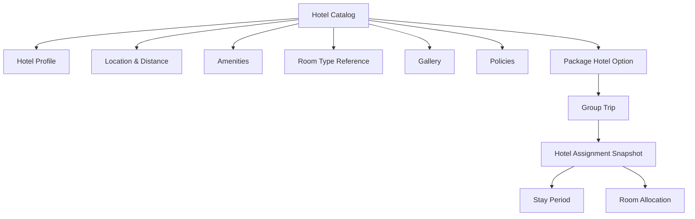
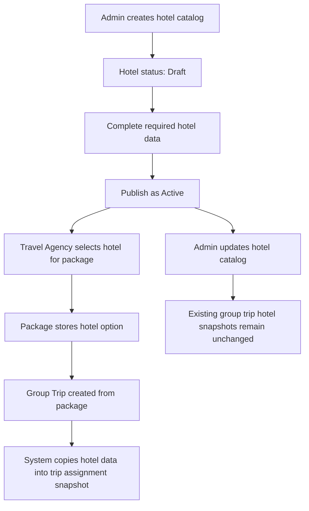
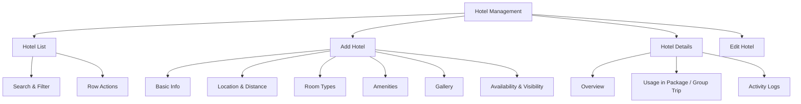
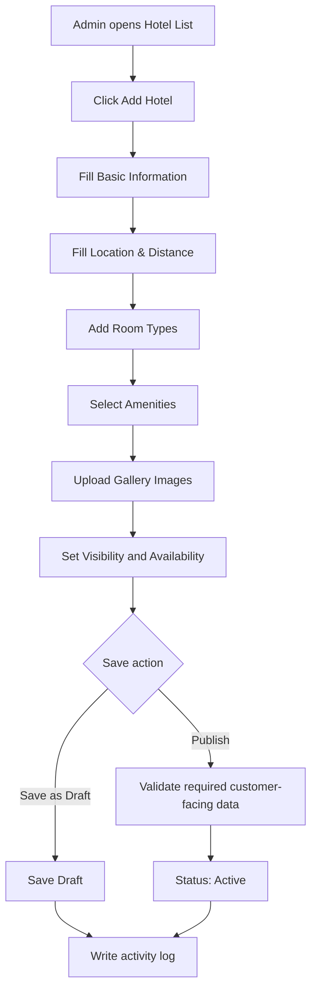
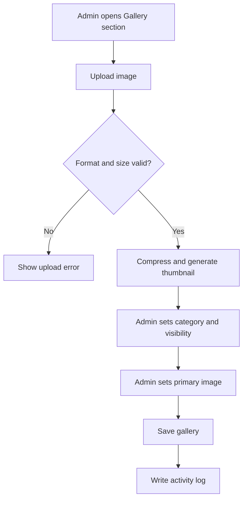
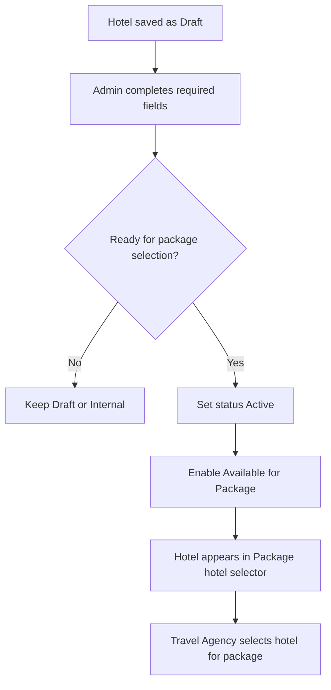
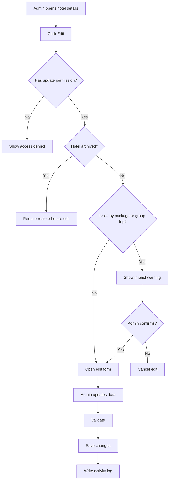
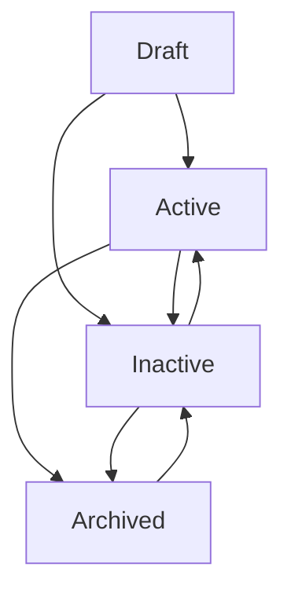
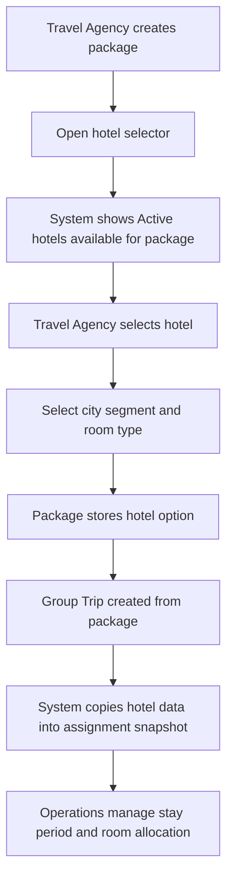

# Hotel Management - Module Product Requirements Document

Version: v1.0
Platform: Responsive Web Platform
Scope: Hotel Management
Status: Draft
Prepared by: Product / UI/UX Team
Last updated: 2 June 2026

> Phase 1 focuses on responsive web. Native Android and iOS applications are out of scope.


---

# Module PRD - Hotel Management

Version: 1.0  
Date: 3 Juni 2026  
Parent Document: Master PRD - UmrahHaji.com Admin Panel  
Scope: Hotel Management

---

## 1. Objective

Hotel Management memungkinkan Admin untuk membuat, mengelola, memverifikasi, dan mengarsipkan hotel catalog yang nantinya dapat dipilih oleh Travel Agency saat membuat Package atau Group Trip.

Module ini bukan booking engine. Fokus utama Hotel Management adalah menyediakan data hotel yang rapi, valid, mudah dibandingkan, dan siap dipakai dalam package/trip.

Module ini berfokus pada:

1. Hotel List.
2. Add Hotel.
3. Edit Hotel.
4. Hotel Details.
5. Hotel profile and location data.
6. Rating/classification and amenities.
7. Distance to mosque/landmark.
8. Room type reference.
9. Gallery management.
10. Availability for package selection.
11. Usage visibility by Package and Group Trip.
12. Activity logs and permission-based access.

Hotel data harus membantu Travel Agency membuat package dengan cepat dan membantu customer memahami kualitas akomodasi, lokasi, jarak ke masjid, fasilitas, room type, dan foto hotel.

---

## 2. Scope

### In Scope

1. Hotel List.
2. Search, filter, sort, pagination, row actions, and bulk actions.
3. Add Hotel.
4. Edit Hotel.
5. Hotel Details.
6. Status management: Draft, Active, Inactive, Archived.
7. Hotel profile: name, city, country, address, map coordinate.
8. Hotel classification/rating.
9. Distance to mosque/landmark.
10. Gallery and thumbnail.
11. Amenities and facilities.
12. Room type reference.
13. Meal/board option reference.
14. Accessibility and family-friendly information.
15. Availability for package selection.
16. Usage tracking by Package and Group Trip.
17. Duplicate detection.
18. Upload size and storage policy.
19. Activity log for critical changes.
20. Responsive web behavior for desktop, tablet, and mobile web.

### Out of Scope

1. Native Android app.
2. Native iOS app.
3. Hotel booking engine.
4. Real-time room inventory.
5. Contract/rate management.
6. Supplier extranet.
7. Payment to hotel supplier.
8. External hotel API integration in Phase 1.
9. Automatic hotel availability sync.
10. Review moderation engine.
11. Room allocation for specific jamaah.

Notes:

1. Hotel Management is a hotel catalog / master data module. It does not confirm hotel bookings.
2. Package Management may select hotels from this catalog.
3. Group Trip Management may copy selected hotel data into trip accommodation assignment or snapshot.
4. Room allocation and actual booking confirmation belong to Group Trip or Operations workflow.
5. Hotel gallery upload must be optimized to avoid unnecessary server load.

### Portal & Design System Principle

Admin Panel and Travel Agency Portal will use the same design system to maintain visual consistency, component reuse, and development efficiency. However, each portal will have a separate navigation structure, permission model, user workflow, and data scope based on the role and operational needs of its users.

---

## 3. Relationship With Other Modules

Hotel Management stores hotel catalog data. Package and Group Trip use hotel data differently.

Core product principle:

```text
Hotel Catalog
↓ selected while creating Package
Package Hotel Option
↓ used while creating Group Trip
Group Trip Hotel Assignment / Snapshot
```

The system must separate catalog data from operational assignment. A hotel catalog record is reusable. A package hotel option is a package-level offer. A group trip hotel assignment is the accommodation plan for a real departure.

| Related Module | Relationship |
|---|---|
| Package Management | Travel Agency selects hotel from catalog as package inclusion |
| Group Trip Management | Group trip uses selected hotel for actual departure accommodation assignment |
| Itinerary Management | Itinerary may reference hotel check-in, check-out, rest, and meeting activities |
| Jamaah Management | Jamaah may see assigned hotel in travel information |
| Billing & Payment | Hotel cost may be part of package cost, but pricing is not managed here in Phase 1 |
| Travel Agency Management | Hotel visibility may be global or agency-specific if enabled |
| Announcement / Notification | Future phase may notify jamaah about hotel changes |

### Data Relationship Diagram



### Hotel Usage Model Diagram



### Catalog, Package, and Group Trip Behavior

| Layer | Purpose | Editable By | Change Impact |
|---|---|---|---|
| Hotel Catalog | Master hotel profile and reference data | Admin / authorized user | Affects future selections |
| Package Hotel Option | Hotel selected for a package offer | Package editor | Defines hotel inclusion shown to customer |
| Group Trip Hotel Assignment | Hotel plan for a real departure | Group Trip operations users | Independent operational snapshot |

Rules:

1. Package should store selected hotel ID and important package-specific fields such as room type, meal plan, nights, and included city.
2. Group Trip should copy selected hotel data into a hotel assignment snapshot at creation or assignment time.
3. Updating hotel catalog must not automatically change completed group trip assignments.
4. Future sync from catalog to package/trip must require manual review and confirmation.
5. Hotel catalog does not guarantee room availability unless an availability/inventory module is added.

---

## 4. User Roles & Permissions

| Role | Access |
|---|---|
| Super Admin | Full access to all hotel records |
| Admin | View, create, update, archive, and export based on permission |
| Operations Admin | Manage hotel catalog and group trip accommodation reference |
| Travel Agency Admin | View selectable hotels and use hotels in package/trip based on permission |
| Content Admin | Manage gallery, description, amenities, and customer-facing content |
| Finance Admin | View hotel reference only if package cost review requires it |
| View Only / Auditor | Read-only access |

Sensitive actions:

1. Delete hotel requires Delete permission and should be allowed only if unused.
2. Archive hotel requires Archive permission.
3. Publish hotel requires Hotel Publish permission.
4. Manage gallery requires Hotel Media Update permission.
5. Export requires Hotel Export permission.
6. Change customer-facing visibility requires Hotel Visibility Update permission.

---

## 5. Navigation Entry Point

```text
Admin Panel
- Hotel Management
  - Hotel List
  - Add Hotel
  - Hotel Details
  - Edit Hotel
```

Related entry points:

1. Dashboard Quick Actions: Add Hotel.
2. Package Create/Edit: Select Hotel.
3. Package Details: Hotel Included.
4. Group Trip Details: Hotel Assignment.
5. Itinerary Details: hotel-related activity context.
6. Activity Logs: open changed hotel record.

---

## 6. Information Architecture

```text
Hotel Management
- Hotel List
  - Search
  - Filters
  - Sort
  - Row Actions
  - Bulk Actions
- Add Hotel
  - Basic Information
  - Location & Distance
  - Rating & Classification
  - Room Types
  - Amenities & Facilities
  - Gallery
  - Policies
  - Availability & Visibility
- Hotel Details
  - Overview
  - Location
  - Rooms
  - Amenities
  - Gallery
  - Usage
  - Activity Logs
- Edit Hotel
  - Profile
  - Gallery
  - Amenities
  - Availability & Visibility
```

### Module IA Diagram



---

## 7. Design Review & Product Recommendations

### Keep From Current Design

1. Clear page title: Hotel List.
2. Primary Add Hotel button.
3. Search by hotel name or location.
4. Filters for status, rating, city, distance, and date created.
5. Thumbnail column.
6. Hotel name, rating, city, distance to mosque, location, gallery count, date created, and actions.
7. Row action menu for Edit, Delete, and Archive.
8. Pagination and total count.

### Improve

1. Add `Available for Package` indicator because Travel Agency needs to know whether hotel can be selected.
2. Add `Owner Scope`: Global or Travel Agency-specific if agency hotel catalog is allowed.
3. Add `Hotel Category` or `Star Rating` as separate from customer rating if both are needed.
4. Rename `Distance to Mosque` to `Distance to Main Mosque / Landmark` and specify target: Masjid al-Haram or Masjid an-Nabawi.
5. Add `Walking / Shuttle` indicator because 500 m walking distance is operationally different from shuttle-only distance.
6. Add `Room Types` count or summary.
7. Add `Amenities` summary in detail page, not necessarily list page.
8. Add `Used In` column or filter for package/group trip usage.
9. Add `Last Updated` optional column for catalog maintenance.
10. Add `Data Quality` or `Profile Completeness` indicator for internal admin.
11. Add `Preview` action so Admin can review customer-facing hotel profile.
12. Replace placeholder thumbnails with real optimized hotel images before production.

### Reduce / Avoid

1. Avoid Delete for hotels used by package or group trip; use Archive instead.
2. Avoid storing oversized hotel images.
3. Avoid mixing room allocation or booking confirmation into Hotel Management.
4. Avoid using one generic `Rating` if it is unclear whether it means star classification or customer rating.
5. Avoid showing gallery count as the only media quality indicator; at least one primary image should be required before publishing.
6. Avoid claiming real-time availability unless inventory integration exists.

---

## 8. Hotel List

### Page Purpose

Hotel List allows Admin to view, search, filter, and manage hotel catalog records across the platform based on permission and data scope.

### Data Scope Rule

1. Super Admin can view all hotels.
2. Admin can view hotels based on permission.
3. Travel Agency Admin can view hotels that are global or assigned/visible to their agency.
4. Archived hotels are hidden by default unless Archive filter is enabled.
5. Hotel used in package or group trip cannot be hard-deleted.

### Table Columns

| Column | Description |
|---|---|
| Checkbox | Select row for bulk action |
| Thumbnail | Primary optimized hotel image |
| Hotel Name | Official hotel name |
| Star Rating / Classification | Hotel class, usually 1-5 stars if available |
| City | Makkah, Madinah, Jeddah, etc. |
| Distance to Main Mosque / Landmark | Distance to Masjid al-Haram, Masjid an-Nabawi, or configured landmark |
| Distance Mode | Walking, shuttle, driving, unknown |
| Location | Address summary |
| Gallery | Number of approved images |
| Room Types | Number or summary of room types |
| Available for Package | Whether travel agency can select the hotel |
| Used In | Count of packages/group trips using the hotel |
| Status | Draft, Active, Inactive, Archived |
| Date Created | Date record was created |
| Last Updated | Optional column |
| Actions | View, edit, duplicate, preview, archive, delete if allowed |

Recommended MVP columns:

1. Thumbnail.
2. Hotel Name.
3. Star Rating.
4. City.
5. Distance to Main Mosque / Landmark.
6. Location.
7. Gallery.
8. Available for Package.
9. Status.
10. Actions.

### Search

Admin can search by:

1. Hotel name.
2. City.
3. Address.
4. Landmark.
5. Room type.
6. Amenity.

Search placeholder:

```text
Search by hotel name, city, or location
```

### Filters

| Filter | Values |
|---|---|
| Status | Draft, Active, Inactive, Archived |
| Star Rating | 1 Star, 2 Star, 3 Star, 4 Star, 5 Star, Unrated |
| City | Makkah, Madinah, Jeddah, Riyadh, Other |
| Distance | 0-250 m, 251-500 m, 501 m-1 km, 1-2 km, 2 km+ |
| Distance Mode | Walking, Shuttle, Driving, Unknown |
| Available for Package | Yes, No |
| Room Type | Single, Double, Twin, Triple, Quad, Family, Suite |
| Amenities | Wi-Fi, Elevator, Restaurant, Shuttle, Laundry, Accessible Room, Haram View |
| Used In | Not Used, Used in Package, Used in Group Trip |
| Date Created | All Time, Today, This Week, This Month, This Year, Custom Range |

Filter behavior:

1. Filters can be combined.
2. Selected filters should appear as chips.
3. Admin can clear individual filters or clear all filters.
4. City, amenities, room type, and landmark filters should support search inside dropdown.

### Row Actions

| Action | Availability | Description |
|---|---|---|
| View Details | Users with read permission | Opens Hotel Details |
| Edit | Users with update permission | Opens edit form |
| Preview | Users with read permission | Opens customer-facing preview |
| Duplicate | Users with create permission | Creates a copy as Draft |
| Publish | Draft or Inactive hotel | Makes hotel selectable if validation passes |
| Archive | Users with archive permission | Archives hotel from active catalog |
| Restore | Archived hotel | Restores hotel to Draft or Inactive |
| Delete | Draft and unused hotel only | Permanently deletes record if allowed |

### Bulk Actions

| Action | Description |
|---|---|
| Export Selected | Export selected records |
| Change Status | Bulk status update with validation |
| Archive Selected | Archive selected unused hotels |
| Restore Selected | Restore archived hotels |
| Set Available for Package | Bulk availability update if validation passes |

Bulk action rules:

1. Bulk actions require at least one selected row.
2. System must validate each selected hotel.
3. Hotels used by package/group trip cannot be deleted.
4. Failed rows should be reported after bulk action completes.

---

## 9. Add Hotel

Add Hotel allows Admin to create a hotel catalog record that can later be selected by Travel Agency during package creation.

### Main Add Flow



### Basic Information Fields

| Field | Type | Required | Validation | Notes |
|---|---|---:|---|---|
| Hotel Name | Text input | Yes | Max 150 characters | Official hotel name |
| Hotel Chain / Brand | Text input | Optional | Max 120 characters | Example: Hilton, Swissotel |
| Star Rating / Classification | Select | Recommended | 1-5 stars, Unrated | Classification if known |
| Customer Rating | Decimal input | Optional | 0-5 | Only if sourced from internal reviews |
| Hotel Type | Select | Optional | Hotel, Apartment Hotel, Suite Hotel, Other | Master data |
| City | Select | Yes | Master data | Makkah, Madinah, Jeddah, etc. |
| Country | Select | Yes | Master data | Default Saudi Arabia |
| Short Description | Textarea | Optional | Max 500 characters | Customer-facing summary |
| Internal Notes | Textarea | Optional | Max 1000 characters | Admin-only notes |
| Status | Select | Yes | Draft, Active, Inactive | Default Draft |

### Location and Distance Fields

| Field | Type | Required | Validation | Notes |
|---|---|---:|---|---|
| Address Line | Text input | Yes | Max 255 characters | Full address |
| District / Area | Text input | Optional | Max 120 characters | Example: Ajyad, Misfalah, Markaziyah |
| Latitude | Decimal input | Recommended | Valid latitude | Used for map and distance |
| Longitude | Decimal input | Recommended | Valid longitude | Used for map and distance |
| Main Landmark | Select | Yes | Master landmark | Masjid al-Haram, Masjid an-Nabawi, Airport, Other |
| Distance Value | Number input | Recommended | Positive number | Example: 500 |
| Distance Unit | Select | Recommended | Meter, Kilometer | Default meter |
| Distance Mode | Select | Recommended | Walking, Shuttle, Driving, Unknown | Operationally important |
| Shuttle Available | Toggle | Optional | Boolean | Useful if distance is not walkable |
| Shuttle Notes | Textarea | Optional | Max 500 characters | Schedule/frequency if known |

Distance rules:

1. Distance target must be clear.
2. Makkah hotels should default landmark to Masjid al-Haram.
3. Madinah hotels should default landmark to Masjid an-Nabawi.
4. If latitude/longitude are available, system may calculate distance automatically in future.
5. Manual distance entry must be allowed in Phase 1.
6. Distance shown to customer should include mode if available.

---

## 10. Room Types and Facilities

Hotel Management should store reference room data to help Travel Agency select suitable hotel options for package creation.

### Room Type Fields

| Field | Type | Required | Validation | Notes |
|---|---|---:|---|---|
| Room Type Name | Select / text | Yes | Max 80 characters | Single, Double, Twin, Triple, Quad, Family, Suite |
| Max Occupancy | Number input | Recommended | 1-10 | Reference capacity |
| Bed Configuration | Text input | Optional | Max 120 characters | Example: 2 single beds, 1 king bed |
| Room Size | Number input | Optional | Positive number | Square meter if available |
| Bathroom Type | Select | Optional | Private, Shared, Unknown | Usually private for hotels |
| Room Amenities | Multi-select | Optional | Master amenity list | AC, Wi-Fi, TV, mini fridge |
| Notes | Textarea | Optional | Max 500 characters | Admin/internal notes |

Room type rules:

1. Room type data is reference only in Phase 1.
2. Room type does not represent real-time inventory.
3. Package may choose one or more room types from the hotel catalog.
4. Group Trip may use room type reference for room allocation later.

### Amenities and Facilities

Recommended amenity categories:

| Category | Examples |
|---|---|
| General | Wi-Fi, elevator, air conditioning, front desk, laundry |
| Food & Beverage | Restaurant, breakfast, buffet, room service |
| Transport | Shuttle to Haram/Nabawi, airport transfer, bus access |
| Accessibility | Accessible room, wheelchair access, elevator access |
| Family | Family room, connecting room, baby cot |
| Worship Support | Prayer room, qibla direction, prayer mat availability |
| Safety | CCTV, safe box, security, smoke detector |
| View / Location | Haram view, city view, near gate, near shopping area |

Amenities rules:

1. Amenities should come from controlled Master Data.
2. Admin can add custom amenity only if Master Data permission allows.
3. Customer-facing amenities should be marked as verified when possible.
4. Internal amenities should not appear in public/package preview.

---

## 11. Gallery and Media

Hotel gallery is important for Travel Agency and customer confidence. Images should be optimized and controlled.

### Gallery Fields

| Field | Type | Required | Validation | Notes |
|---|---|---:|---|---|
| Primary Image | Image upload | Required for publish | JPG, PNG, WebP, max 1 MB | Used as list thumbnail |
| Gallery Images | Multi-image upload | Optional | JPG, PNG, WebP, max 1 MB each | Max 20 images in Phase 1 |
| Image Category | Select | Optional | Exterior, Lobby, Room, Bathroom, Restaurant, View, Facility | Helps browsing |
| Alt Text | Text input | Recommended | Max 120 characters | Accessibility and SEO if public |
| Display Order | Drag handle | Optional | Sequential | Sort gallery |
| Visibility | Select | Optional | Internal, Customer Visible | Default Customer Visible |

Upload and storage rules:

1. Maximum image size: 1 MB per image.
2. Maximum gallery images in Phase 1: 20 images per hotel.
3. Supported formats: JPG, PNG, WebP.
4. System should generate optimized thumbnails.
5. System should reject oversized files before upload if possible.
6. System should compress images on upload.
7. System should not store duplicate images if hash matching is available.
8. Primary image is required before hotel can be Published/Active.
9. Avoid animated images and videos in Phase 1.

### Gallery Flow



---

## 12. Availability and Visibility

Availability determines whether Travel Agency can select the hotel when creating a package.

### Fields

| Field | Type | Required | Validation | Notes |
|---|---|---:|---|---|
| Owner Scope | Select | Yes | Global, Travel Agency | Default Global for Admin catalog |
| Owner Agency | Select | Conditional | Required if agency-owned | Agency data scope |
| Visibility | Select | Yes | Internal, Available for Package, Hidden | Determines selection behavior |
| Available for Package | Toggle | Optional | Boolean | Requires Active status and required fields |
| Customer Visible | Toggle | Optional | Boolean | Whether shown in package preview |
| Data Verified | Toggle | Optional | Boolean | Admin verification marker |
| Verification Notes | Textarea | Optional | Max 500 characters | Internal notes |

Rules:

1. Hotel must be Active before it can be Available for Package.
2. Hotel must have name, city, address, primary image, and at least one distance/landmark entry before publish.
3. Customer Visible should require primary image and customer-facing description.
4. Agency-owned hotels are visible only to that agency unless sharing is enabled.
5. Hidden hotels should not appear in package hotel selector.

### Availability Flow



---

## 13. Hotel Details

Hotel Details allows Admin to review hotel profile, media, facilities, usage, and activity logs.

### Recommended Tabs

| Tab | Purpose |
|---|---|
| Overview | Summary, status, rating, city, primary image, availability |
| Location | Address, map coordinates, distance to landmarks, shuttle notes |
| Rooms | Room type reference and capacity |
| Amenities | Facilities grouped by category |
| Gallery | Primary image and gallery images |
| Usage | Packages and group trips using this hotel |
| Activity Logs | Change history and audit records |

### Overview Fields

| Field | Description |
|---|---|
| Hotel Name | Official hotel name |
| Star Rating | Hotel classification |
| City / Country | Hotel location |
| Address | Full address |
| Distance to Main Mosque / Landmark | Distance value and mode |
| Available for Package | Yes or No |
| Customer Visible | Yes or No |
| Total Gallery Images | Count of approved images |
| Room Types | Count or summary |
| Status | Draft, Active, Inactive, Archived |
| Created By | Admin/user who created record |
| Last Updated | Last update date and user |

### Usage Tab

| Field | Description |
|---|---|
| Usage Type | Package or Group Trip |
| Related Record | Package name or group trip name |
| City Segment | Makkah, Madinah, Transit, Other |
| Room Type | Selected room type if available |
| Stay Period | Check-in and check-out if group trip |
| Usage Mode | Catalog reference or copied snapshot |
| Status | Active, Completed, Cancelled, Archived |
| Assigned Date | Date hotel was linked |

Usage rules:

1. Package may reference active hotel catalog.
2. Group Trip should use copied hotel assignment snapshot.
3. Editing hotel catalog should not automatically modify completed group trip accommodation data.
4. If sync is supported in future, Admin must review changes before applying them.

---

## 14. Edit Hotel

Edit Hotel allows Admin to update catalog data based on permission and usage state.

### Edit Rules

| Condition | Behavior |
|---|---|
| Draft hotel | Editable without usage warning |
| Active but unused hotel | Editable with normal confirmation |
| Active and used by package | Show impact warning |
| Used by active group trip snapshot | Catalog edit does not affect snapshot unless sync is applied |
| Archived hotel | Read-only until restored |
| Completed group trip assignment | Read-only in Group Trip history |

### Edit Flow



---

## 15. Status Management

### Status Definitions

| Status | Meaning |
|---|---|
| Draft | Hotel record is incomplete or not ready |
| Active | Hotel is valid and can be used if available flag is enabled |
| Inactive | Hotel is preserved but not selectable for new package |
| Archived | Hotel is hidden from active catalog and preserved for audit/history |

### Status Flow



Status rules:

1. Only Active hotel with Available for Package enabled can be selected by Travel Agency.
2. Draft hotel cannot be selected for package.
3. Archived hotel is hidden by default.
4. Delete is only allowed for Draft hotel that has never been used.
5. Status changes must be recorded in activity logs.

---

## 16. Assignment to Package and Group Trip

Hotel assignment is initiated from Package Management or Group Trip Management, but Hotel Management must support selection readiness and usage visibility.

### Assignment Flow



Rules:

1. Package may reference an Active hotel catalog record.
2. Package should define whether the hotel is for Makkah, Madinah, Transit, or Other city segment.
3. Package should define room type, meal plan, and nights if applicable.
4. Group Trip should copy hotel data into an assignment snapshot.
5. Snapshot can be edited for a specific departure without changing the original hotel catalog.
6. Hotel usage count should show number of related packages and group trips.
7. Inactive, Archived, Hidden, and unavailable hotels cannot be assigned to new package/group trip.
8. Hotel catalog does not validate room availability in Phase 1.

### Package Hotel Option Fields

| Field | Description |
|---|---|
| Hotel | Selected hotel catalog record |
| City Segment | Makkah, Madinah, Transit, Other |
| Room Type | Selected room type |
| Meal Plan | Room Only, Breakfast, Half Board, Full Board |
| Nights | Number of nights included |
| Customer Visible Name | Hotel name shown in package |
| Notes | Package-specific accommodation notes |

### Group Trip Hotel Snapshot Fields

| Field | Description |
|---|---|
| Hotel Snapshot | Copied hotel profile at time of assignment |
| Check-in Date | Actual check-in date |
| Check-out Date | Actual check-out date |
| Room Allocation Status | Not Started, In Progress, Completed |
| Booking Reference | Optional external booking reference |
| Operations Notes | Internal group trip notes |

---

## 17. Form Field Specification

### 17.1 Add / Edit Hotel Form

| Section | Field | Type | Required | Validation | Notes |
|---|---|---|---:|---|---|
| Basic Info | Hotel Name | Text input | Yes | Max 150 chars | Official name |
| Basic Info | Hotel Chain / Brand | Text input | Optional | Max 120 chars | Optional |
| Basic Info | Star Rating | Select | Recommended | 1-5, Unrated | Classification |
| Basic Info | Customer Rating | Decimal input | Optional | 0-5 | Internal/customer rating if available |
| Basic Info | Hotel Type | Select | Optional | Master data | Hotel, suite, apartment hotel |
| Basic Info | City | Select | Yes | Master data | Makkah, Madinah, etc. |
| Basic Info | Country | Select | Yes | Master data | Default Saudi Arabia |
| Basic Info | Short Description | Textarea | Optional | Max 500 chars | Customer-facing |
| Basic Info | Internal Notes | Textarea | Optional | Max 1000 chars | Admin only |
| Location | Address Line | Text input | Yes | Max 255 chars | Full address |
| Location | District / Area | Text input | Optional | Max 120 chars | Optional |
| Location | Latitude | Decimal input | Recommended | Valid latitude | Map |
| Location | Longitude | Decimal input | Recommended | Valid longitude | Map |
| Location | Main Landmark | Select | Yes | Master landmark | Haram/Nabawi/etc. |
| Location | Distance Value | Number input | Recommended | Positive number | Distance |
| Location | Distance Unit | Select | Recommended | m/km | Default meter |
| Location | Distance Mode | Select | Recommended | Walking/Shuttle/Driving/Unknown | Operational context |
| Rooms | Room Type | Select/text | Recommended | Max 80 chars | One or more |
| Rooms | Max Occupancy | Number input | Optional | 1-10 | Reference only |
| Rooms | Bed Configuration | Text input | Optional | Max 120 chars | Optional |
| Amenities | Amenities | Multi-select | Optional | Master data | Grouped facility list |
| Gallery | Primary Image | Image upload | Required for publish | JPG/PNG/WebP, max 1 MB | Thumbnail |
| Gallery | Gallery Images | Multi-upload | Optional | JPG/PNG/WebP, max 1 MB each | Max 20 images |
| Visibility | Owner Scope | Select | Yes | Global, Travel Agency | Data scope |
| Visibility | Owner Agency | Select | Conditional | Required for agency-owned | Permission scoped |
| Visibility | Visibility | Select | Yes | Internal, Available for Package, Hidden | Selection behavior |
| Visibility | Available for Package | Toggle | Optional | Boolean | Requires Active |
| Visibility | Customer Visible | Toggle | Optional | Boolean | Package/customer preview |
| Visibility | Data Verified | Toggle | Optional | Boolean | Internal marker |
| Status | Status | Select | Yes | Draft, Active, Inactive | Default Draft |

### 17.2 Upload and Storage Policy

| Upload Type | Format | Max Size | Max Count | Notes |
|---|---|---:|---:|---|
| Primary Image | JPG, PNG, WebP | 1 MB | 1 | Required before publish |
| Gallery Image | JPG, PNG, WebP | 1 MB each | 20 | Compress and generate thumbnail |
| Future Hotel Document | PDF, JPG, PNG | 2 MB | 5 | Future phase only if needed |

Storage rules:

1. Do not store original oversized images without compression.
2. Generate thumbnails for list and gallery preview.
3. Reject unsupported formats.
4. Reject files above max size.
5. Avoid videos in Phase 1.
6. Use lazy loading for gallery images in UI.
7. Store image metadata: category, alt text, visibility, order.

---

## 18. Validation Rules

1. Hotel Name is required.
2. City and Country are required.
3. Address Line is required.
4. Main Landmark is required.
5. Primary Image is required before hotel can be Active and Customer Visible.
6. Owner Scope is required.
7. Owner Agency is required when Owner Scope is Travel Agency.
8. Available for Package requires status Active.
9. Hidden hotel cannot be selected in package.
10. Archived hotel cannot be edited until restored.
11. Hotel used by package/group trip cannot be deleted.
12. Duplicate warning should be shown for same hotel name, city, and address.
13. Distance value must be positive if entered.
14. Latitude/longitude must be valid if entered.
15. Gallery image must follow format and size limits.
16. Customer Visible should require primary image and customer-facing description.

---

## 19. Empty State

### Hotel List Empty State

Display when no hotel exists.

Recommended message:

```text
No hotel has been added yet.
Add a hotel to make it available for package creation.
```

Primary action:

```text
Add Hotel
```

### Gallery Empty State

Recommended message:

```text
No hotel images have been uploaded yet.
Upload a primary image before publishing this hotel.
```

---

## 20. Error State

| Error | System Behavior |
|---|---|
| Failed to load hotel list | Show retry action |
| Failed to save hotel | Preserve form data and show error |
| Duplicate hotel detected | Show matching records and allow review |
| Invalid image upload | Show format/size guidance |
| Hotel already used | Block delete and suggest archive |
| Permission denied | Show access denied message |
| Invalid distance or coordinate | Highlight field and explain requirement |
| Hotel unavailable for package | Hide or disable in package selector |

---

## 21. Notification Rules

Phase 1 notification scope is limited.

| Event | Recipient | Channel | Notes |
|---|---|---|---|
| Hotel created | Admin who created | In-app optional | Activity confirmation |
| Hotel published | Operations/Admin | In-app optional | Useful for package team |
| Hotel archived | Admin / Auditor | In-app optional | Audit visibility |
| Hotel used by package | Hotel creator/Admin | Future phase | Optional |
| Group trip hotel changed | Operations Admin / Travel Agency Admin | Future phase | Requires notification module |

Rules:

1. No automatic jamaah notification in Phase 1 unless Group Trip/Notification module supports it.
2. Critical changes should be logged even if no notification is sent.
3. Future participant notification must clearly show changed hotel, city, check-in/check-out, and effective trip.

---

## 22. Activity Log Requirements

The system must record activity logs for:

1. Create hotel.
2. Edit hotel basic information.
3. Edit location and distance.
4. Add/edit/delete room type.
5. Add/edit/delete amenity.
6. Upload image.
7. Delete image.
8. Change primary image.
9. Change gallery visibility.
10. Change status.
11. Change availability for package.
12. Change customer visibility.
13. Change owner scope or owner agency.
14. Archive or restore hotel.
15. Delete hotel.
16. Select hotel in package.
17. Create group trip hotel snapshot.

Activity log fields:

| Field | Description |
|---|---|
| Action | Type of action performed |
| Actor | Admin/user who performed action |
| Timestamp | Date and time |
| Entity | Hotel, room type, gallery, amenity, visibility |
| Old Value | Previous value for critical changes |
| New Value | Updated value |
| Source | Admin Panel or Travel Agency Portal |

---

## 23. Responsive Web Behavior

### Desktop Web

1. Use full table layout for Hotel List.
2. Display thumbnail in list table.
3. Wide columns may use horizontal scroll.
4. Add/Edit form may use two-column layout.
5. Gallery manager can use grid layout.

### Tablet Web

1. Filters should wrap into multiple rows.
2. Hotel form sections should stack where needed.
3. Gallery grid should reduce column count.
4. Sticky save bar should remain usable.

### Mobile Web

1. Convert Hotel List into cards or horizontal scroll table.
2. Filters should open in bottom sheet or full-screen drawer.
3. Gallery manager should use single/two-column grid.
4. Form fields should stack vertically.
5. Sticky save bar must not cover content.
6. Long addresses should wrap cleanly.

---

## 24. Security & Permission Notes

1. All list and detail data must follow role and data scope.
2. Agency-specific hotels must not be visible to other agencies unless sharing is enabled.
3. Archive and delete actions require confirmation.
4. Delete should be disabled for hotels used by package or group trip.
5. Gallery uploads must validate file type and size.
6. Internal notes must not appear in customer-facing package preview.
7. All critical changes must be logged.
8. Customer-facing hotel claims should be based on verified data when possible.

---

## 25. Acceptance Criteria

### Hotel List

1. Admin can view Hotel List based on permission.
2. Admin can search by hotel name, city, or location.
3. Admin can filter by status, rating, city, distance, distance mode, availability, room type, amenities, used in, and date created.
4. Admin can paginate list results.
5. Admin can open row actions.
6. Admin cannot delete hotel already used by package or group trip.
7. Admin can identify whether hotel is available for package selection.

### Add Hotel

1. Admin can create hotel catalog record.
2. Admin can enter hotel name, city, address, rating, distance, and description.
3. Admin can upload primary image and gallery images within size limits.
4. Admin can add room type reference.
5. Admin can select amenities.
6. Admin can set availability and visibility.
7. Admin can save as Draft.
8. Admin can publish valid hotel as Active.
9. System blocks publish if required customer-facing data is missing.

### Edit and Status

1. Admin can edit hotel based on permission.
2. System shows warning if hotel is used by package or group trip.
3. Admin can archive hotel.
4. Admin can restore archived hotel if permitted.
5. System records activity logs for critical changes.
6. Editing hotel catalog does not automatically change existing group trip hotel snapshot.

### Package and Group Trip Usage

1. Travel Agency can select only Active hotels that are Available for Package.
2. Package can store selected hotel option and room type.
3. Group Trip can copy hotel data into assignment snapshot.
4. Hotel catalog does not claim real-time availability.

### Responsive

1. Hotel List works on desktop, tablet, and mobile web.
2. Add/Edit form works on desktop, tablet, and mobile web.
3. Gallery management remains usable on mobile.
4. Sticky actions do not overlap content.

---

## 26. Open Questions

1. Should Travel Agency Admin be allowed to request a new hotel if it is not in Admin catalog?
2. Should Travel Agency Admin be allowed to create agency-specific hotels in Phase 1?
3. Should hotel star rating be admin-entered, verified classification, or both?
4. Should customer rating be supported in Phase 1 or handled later through Reviews?
5. Should package hotel option store room price/cost in Package Management or Billing?
6. Should hotel availability calendar be introduced in a later phase?
7. Should map integration be included in Phase 1 or stored as coordinates only?

---

## 27. References

1. Schema.org Hotel type: https://schema.org/Hotel
2. Schema.org LodgingBusiness type: https://schema.org/LodgingBusiness
3. Google Business Profile hotel attributes and amenities guidance: https://support.google.com/business/
4. Saudi Ministry of Tourism hotel classification and accommodation standards should be used as regulatory reference when finalizing Saudi hotel classification rules.

