# Jamaah Management - Module Product Requirements Document

Version: v1.0
Platform: Responsive Web Platform
Scope: Jamaah Management
Status: Draft
Prepared by: Product / UI/UX Team
Last updated: 2 June 2026

> Phase 1 focuses on responsive web. Native Android and iOS applications are out of scope.


---

# Module PRD - Jamaah Management

Version: 1.0  
Date: 2 Juni 2026  
Parent Document: Master PRD - UmrahHaji.com Admin Panel  
Scope: Jamaah Management

---

## 1. Objective

Jamaah Management memungkinkan Admin untuk melihat, mencari, memfilter, menambahkan, mengundang, dan mengelola data jamaah yang terdaftar di UmrahHaji.com.

Module ini berfokus pada tampilan awal Jamaah List, filter, email invitation, dan Add Jamaah flow, termasuk dua skenario utama:

1. Create new jamaah user.
2. Add from existing registered user.

Module ini tetap mengacu pada PRD utama, yang mendefinisikan Jamaah Management sebagai modul untuk profile jamaah, documents, booking history, travel information, dan payment tracking.

---

## 2. Scope

### In Scope

1. Jamaah List.
2. Search, filter, sort, pagination, and bulk selection.
3. Add Jamaah modal.
4. Create new jamaah user.
5. Add existing registered user as jamaah.
6. Send email invitation.
7. Resend invitation.
8. Basic Jamaah status management.
9. Basic duplicate detection by email, phone number, and passport number if available.
10. Jamaah Details initial view and permission-based edit behavior.
11. Activity logs for critical actions.
12. Responsive web behavior for desktop, tablet, and mobile web.

### Out of Scope

1. Native Android app.
2. Native iOS app.
3. Public website registration UX.
4. Full document verification workflow.
5. Full payment tracking workflow.
6. Full booking engine.
7. Bulk import from spreadsheet.
8. Advanced CRM automation.

Notes:

1. This PRD defines initial Jamaah Details data scope and permission-based edit rules. Deep workflow for Documents, Travel Information, Booking History, and Payment Tracking should be specified in a follow-up detail PRD or later section.
2. This PRD defines the foundation needed for the initial Jamaah List and Add Jamaah experience.

### Portal & Design System Principle

Admin Panel and Travel Agency Portal will use the same design system to maintain visual consistency, component reuse, and development efficiency. However, each portal will have a separate navigation structure, permission model, user workflow, and data scope based on the role and operational needs of its users.

---

## 3. User Roles & Permissions

| Role | Access |
|---|---|
| Super Admin | Full access to all jamaah records across platform |
| Admin | View, create, update, invite, and export based on permission |
| Operations Admin | Manage jamaah operational data, group assignment, and travel readiness |
| Finance Admin | View jamaah payment summary and payment status if permitted |
| Travel Agency Admin | Manage jamaah only under own travel agency |
| Support Staff | View jamaah and support invitation issues based on permission |
| View Only / Auditor | Read-only access |

Sensitive areas:

1. Passport number and identity documents require Sensitive Data permission.
2. Payment details require Payment Read permission.
3. Export requires Jamaah Export permission.
4. Add existing user requires User Lookup permission.
5. Status changes require Jamaah Status Update permission.

---

## 4. Navigation Entry Point

```text
Admin Panel
- Jamaah Management
  - Jamaah List
  - Add Jamaah
  - Jamaah Details
  - Payment Tracking
```

Related entry points:

1. Dashboard Quick Actions: Add Jamaah.
2. Travel Agency Details: Jamaah & Mutawwif tab.
3. Package Details: Assigned Jamaah.
4. Group Trip Details: Participants.
5. Payment & Billing: Payment record linked to jamaah.

---

## 5. Information Architecture

```text
Jamaah Management
- Jamaah List
  - Search
  - Filters
  - Sort
  - Bulk Actions
  - Row Actions
- Add Jamaah
  - Create New User
  - Add Existing User
  - Send Invitation
- Jamaah Details
  - Personal Information
  - Passport Information
  - Emergency Contact
  - Documents
  - Travel Information
  - Booking History
  - Payment Tracking
- Activity Logs
```

---

## 6. Design Review & Product Recommendations

### Keep From Current Design

1. Clear page title: Jamaah List.
2. Search by name, email, and phone number.
3. Primary Add Jamaah button.
4. Status badge for each jamaah.
5. Filter dropdowns for sort, status, country, gender, and date created.
6. Pagination with total count.
7. Row action menu.

### Improve

1. Replace `Experience & Rating` because jamaah are customers, not service providers.
2. Use `Trip / Booking Summary`, `Document Status`, or `Payment Status` instead.
3. Add `Travel Agency`, `Package`, and `Group Trip` filters because Jamaah data is operationally tied to those modules.
4. Add `Invitation Status` filter to distinguish Pending Invitation, Accepted, Expired, and Not Sent.
5. Use a secure activation link in invitation email instead of sending a temporary password.
6. Add duplicate detection before sending invitation.
7. Add row action for Resend Invitation when status is Pending Invitation or Expired.
8. Add empty state and error state.
9. For mobile web, convert wide table into card list or horizontal scroll table.

### Reduce / Avoid

1. Avoid `Banned`, `Rejected`, and `Suspended` as default Jamaah filters unless account safety moderation is included.
2. Avoid exposing passport or sensitive identity data in list page by default.
3. Avoid sending temporary passwords via email.
4. Avoid relying only on country flags; always show country name text.
5. Avoid too many default columns in the first screen. Use column customization for non-MVP fields.
6. Avoid turning Jamaah Profile into a general CV or professional profile.
7. Avoid Working Experience, Education, Certification, Awards, and broad Supporting Documents in Jamaah MVP unless there is a clear operational use case.

Recommended MVP list columns:

1. Jamaah Name.
2. Gender.
3. Country.
4. Travel Agency.
5. Package / Group Trip.
6. Payment Status.
7. Document Status.
8. Join Date.
9. Status.
10. Actions.

If the UI must stay close to the current design, replace `Experience & Rating` with `Trip & Payment Summary`.

---

## 7. Jamaah List

### Page Purpose

Jamaah List allows Admin to view, search, filter, invite, and manage all jamaah records based on access permission and travel agency scope.

### Data Scope Rule

1. Super Admin can view all jamaah.
2. Admin can view jamaah based on assigned permission.
3. Travel Agency Admin can only view jamaah under their own travel agency.
4. Group Trip-specific access must only show jamaah assigned to the selected group trip.

### Table Columns

| Column | Description |
|---|---|
| Checkbox | Select row for bulk action |
| Jamaah Name | Avatar, full name, email, and phone number |
| Gender | Male or Female |
| Country | Country name and optional flag |
| Travel Agency | Related travel agency |
| Package / Group Trip | Current package or group trip if assigned |
| Payment Status | Unpaid, Partial Paid, Paid, Overdue, Refunded |
| Document Status | Not Started, Incomplete, Pending Verification, Verified, Rejected |
| Join Date | Date jamaah was created or joined platform |
| Status | Draft, Invited, Active, Pending Document, Ready for Departure, Departed, Completed, Cancelled, Inactive |
| Actions | View details, edit, resend invitation, deactivate, remove from group trip |

Optional columns:

1. Passport Expiry.
2. Last Login.
3. Invitation Status.
4. Created By.
5. Last Updated.

### Search

Admin can search by:

1. Jamaah name.
2. Email.
3. Phone number.
4. Passport number if permission allows.
5. Travel agency name.
6. Package name.
7. Group trip name.

Search behavior:

1. Search should support partial match.
2. Search should ignore case.
3. Search result should preserve active filters.
4. Empty result should show clear empty state.

### Filters

| Filter | Options |
|---|---|
| Sort By | Newest, Oldest, Name A-Z, Name Z-A, Recently Updated |
| Status | Draft, Invited, Active, Pending Document, Ready for Departure, Departed, Completed, Cancelled, Inactive |
| Invitation Status | Not Sent, Pending, Accepted, Expired |
| Country | Country list from Master Data |
| Gender | Male, Female |
| Travel Agency | Travel agency list based on permission |
| Package | Package list based on selected travel agency |
| Group Trip | Group trip list based on selected package or agency |
| Payment Status | Unpaid, Partial Paid, Paid, Overdue, Refunded |
| Document Status | Not Started, Incomplete, Pending Verification, Verified, Rejected |
| Date Created | All Time, Today, This Week, This Month, This Year, Custom Range |

Filter behavior:

1. Filters can be combined.
2. Selected filters should be visible as chips.
3. Admin can clear individual filters or clear all filters.
4. Country, Travel Agency, Package, and Group Trip filters should support search inside dropdown.
5. Date filter supports preset range and custom range.

### Row Actions

| Action | Availability | Description |
|---|---|---|
| View Details | All roles with read permission | Opens Jamaah Details |
| Edit | Users with update permission | Opens edit form |
| Resend Invitation | Pending or Expired invitation | Sends new invitation link |
| Copy Invitation Link | Pending invitation and permitted roles | Copies secure activation link |
| Deactivate | Active jamaah and permitted roles | Marks jamaah inactive |
| Reactivate | Inactive jamaah and permitted roles | Restores jamaah access |
| Remove From Group Trip | If assigned to group trip | Removes assignment without deleting user |

### Bulk Actions

| Action | Description |
|---|---|
| Export Selected | Export selected jamaah if user has export permission |
| Send Invitation | Send invitation to selected jamaah without accepted account |
| Resend Invitation | Resend invitation to pending or expired records |
| Assign to Group Trip | Assign selected jamaah to group trip if eligible |
| Change Status | Bulk status update with confirmation and permission |

Bulk action rules:

1. Bulk actions require at least one selected row.
2. System must validate eligibility per selected jamaah.
3. Failed rows should be reported after bulk action completes.
4. Bulk actions must be recorded in activity logs.

---

## 8. Add Jamaah

Add Jamaah allows Admin to create a new jamaah user or link an existing registered user into the Jamaah Management context.

### Add Jamaah Entry Point

```text
Jamaah List
-> Click Add Jamaah
-> Add Jamaah modal opens
```

Recommended modal structure:

```text
Add Jamaah
- Source Selection
  - Create New User
  - Add Existing User
- Jamaah Identity
- Contact Information
- Assignment
- Invitation Settings
- Confirmation
```

### Add Jamaah Main Flow

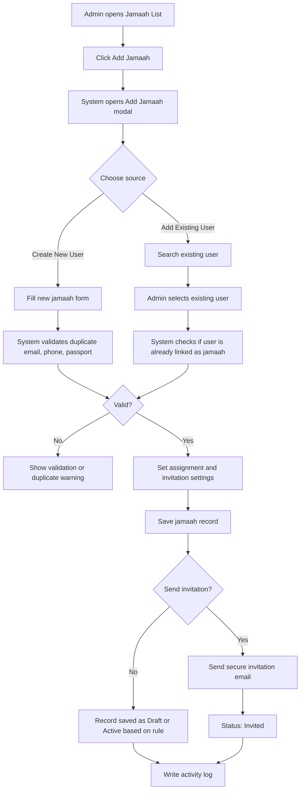

### Source Option Rules

| Source | Behavior |
|---|---|
| Create New User | Creates a new user account and jamaah profile |
| Add Existing User | Links existing registered user to jamaah profile or agency/group trip context |

Rules:

1. Existing user search requires User Lookup permission.
2. If email already exists, system should suggest Add Existing User instead of creating duplicate user.
3. If existing user already has jamaah profile, system should link existing profile instead of creating a duplicate.
4. If user is already assigned to the same group trip, system should block duplicate assignment.
5. If user is assigned to another active group trip with date conflict, system should show warning.

---

## 9. Add Jamaah Form Fields

### 9.1 Source Selection

| Field | Type | Required | Notes |
|---|---|---:|---|
| Add Method | Segmented control | Yes | Create New User or Add Existing User |

### 9.2 Create New User Fields

| Field | Type | Required | Validation | Notes |
|---|---|---:|---|---|
| Jamaah Name | Text input | Yes | Max 120 characters | Full legal or preferred name |
| Email | Email input | Yes | Valid email, unique unless linking existing user | Used for invitation |
| Country Code | Phone country selector | Yes | Must use valid country code | Default based on admin locale or selected country |
| Phone Number | Phone input | Yes | Numeric format, unique warning | Main contact number |
| Gender | Select | Recommended | Male or Female | Required if travel documents need gender early |
| Country | Select | Recommended | Master Data country | Useful for list filter |
| Travel Agency | Select | Conditional | Required for Travel Agency Admin; optional for Super Admin until assignment |
| Package | Select | Optional | Filtered by selected travel agency |
| Group Trip | Select | Optional | Filtered by selected package or travel agency |
| Send Invitation | Toggle | Yes | Default enabled | Sends activation email |
| Invitation Language | Select | Optional | Default system language | Bahasa Indonesia, English, Malay, Arabic if supported |

Minimum MVP fields from current design:

1. Jamaah Name.
2. Email.
3. Country Code.
4. Phone Number.
5. Send Invitation.

Recommended MVP additions:

1. Gender.
2. Country.
3. Travel Agency assignment.
4. Package or Group Trip assignment if known.

### 9.3 Add Existing User Fields

| Field | Type | Required | Validation | Notes |
|---|---|---:|---|---|
| Search Existing User | Search input | Yes | Search by name, email, phone | Requires User Lookup permission |
| Selected User | User selector | Yes | Must select one user | Shows name, email, phone, current roles |
| Travel Agency | Select | Conditional | Required when adding under agency scope | Scoped by permission |
| Package | Select | Optional | Filtered by agency |
| Group Trip | Select | Optional | Filtered by agency/package |
| Send Notification | Toggle | Yes | Default enabled | Notifies user that they were added |
| Add as Jamaah Role | Toggle | Conditional | Required if user does not already have Jamaah role | Adds jamaah access role |

Existing user matching logic:

1. Exact email match.
2. Exact phone match with country code.
3. Passport number match if passport data is available and permission allows.
4. Name match should only show as warning, not as duplicate blocker.

---

## 10. Email Invitation

### Purpose

Email invitation allows Admin to invite a jamaah to activate their UmrahHaji.com account after being added from the Admin Panel.

### Recommended Security Rule

The invitation email must not include a temporary password. The email should include a secure activation link where the jamaah creates their own password.

### Invitation Email Content

| Element | Requirement |
|---|---|
| Logo | UmrahHaji.com logo |
| Subject | You are invited to join UmrahHaji.com as a Jamaah |
| Greeting | Personal greeting using jamaah name |
| Body | Explain that admin has invited them to complete registration |
| CTA | Accept Invitation |
| Expiry Notice | Show invitation expiry period |
| Support Email | support@umrahhaji.com or configured support contact |
| Footer | UmrahHaji.com Team |

Suggested email copy:

```text
Subject: You are invited to join UmrahHaji.com as a Jamaah

Assalamu'alaikum [Jamaah Name],

You have been invited to join UmrahHaji.com as a Jamaah.

Please click the button below to complete your registration and activate your account.

[Accept Invitation]

This invitation link will expire in [X days].

If you need assistance, please contact [support email].

Wassalamu'alaikum,
UmrahHaji.com Team
```

### Invitation Status

| Status | Description |
|---|---|
| Not Sent | Jamaah record created without invitation |
| Pending | Invitation sent but not accepted |
| Accepted | Jamaah accepted invitation and activated account |
| Expired | Invitation token expired |
| Cancelled | Invitation cancelled by Admin |

### Invitation Flow

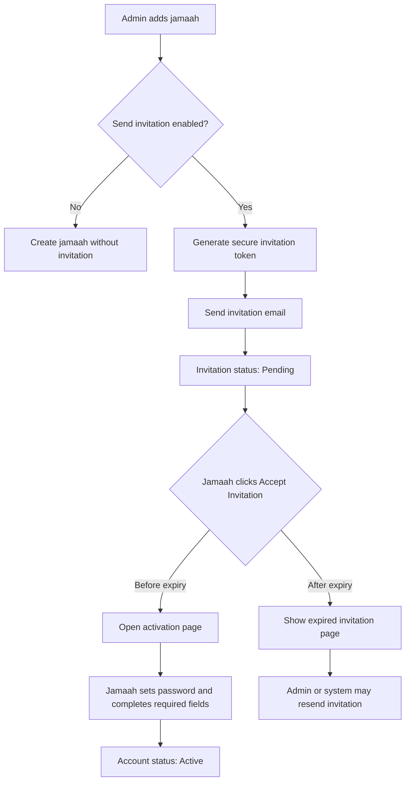

### Resend Invitation Flow

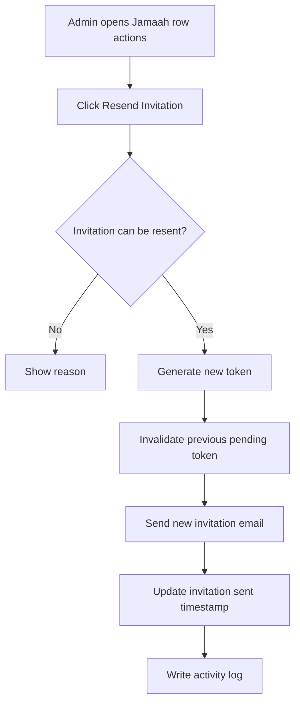

Invitation rules:

1. Invitation token should expire based on configurable setting.
2. Resending invitation invalidates the previous token.
3. Invitation email must not expose internal admin data.
4. Invitation link should be single-use.
5. System should rate-limit resend action.
6. Accepted invitation cannot be resent unless account is reset by authorized admin.

---

## 11. Jamaah Status Management

| Status | Description |
|---|---|
| Draft | Data created but not complete or not invited |
| Invited | Invitation sent but not accepted |
| Active | Jamaah account is active |
| Pending Document | Required document is missing or pending verification |
| Ready for Departure | Required documents and payment are ready |
| Departed | Jamaah has departed |
| Completed | Trip completed |
| Cancelled | Jamaah booking or participation cancelled |
| Inactive | Jamaah is inactive but historical data remains |

### Status Flow

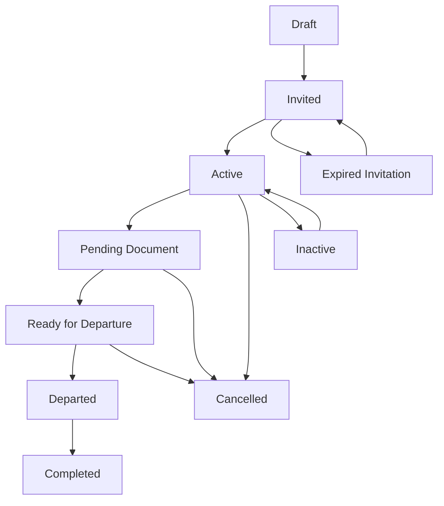

Rules:

1. Jamaah can be Active after account activation or manual activation by authorized admin.
2. Ready for Departure requires required documents and payment readiness based on business rule.
3. Cancelled should preserve booking/payment history.
4. Inactive should disable login or operational assignment based on account policy.
5. Status changes must require reason for Cancelled and Inactive.

---

## 12. Jamaah Details - Initial Data Scope

Jamaah Details in Admin Panel should support permission-based editing. Admin can view jamaah data according to access scope and may edit operational fields required to support registration, document completion, package/group trip assignment, and travel readiness. Sensitive identity, document, bank, and account-related fields require additional permission, confirmation, and audit logs. Jamaah-facing self-service fields may be completed or updated by the Jamaah through the user portal when available.

The list and Add Jamaah flow must prepare data for these sections:

| Section | Purpose |
|---|---|
| Personal Information | Basic identity and contact data |
| Passport Information | Passport number, expiry, issuing country |
| Emergency Contact | Family or emergency contact |
| Documents | Passport, visa, vaccination, permit, supporting documents |
| Travel Information | Package, group trip, flight, hotel, room allocation |
| Booking History | Historical bookings and group trip participation |
| Payment Tracking | Package price, external paid, paid inside system, remaining balance |

Recommended Details tabs for future PRD:

```text
Jamaah Details
- Profile
- Documents
- Travel & Booking
- Payment Tracking
- Family / Emergency Contact
- Activity Logs
```

### 12.1 Admin Edit Policy

| Section / Field Group | Admin Panel Behavior | Notes |
|---|---|---|
| Personal Information | View and edit with permission | Full name, surname, place/date of birth, gender, marital status |
| Profile Photo | Upload/change with permission | Changes should be logged |
| Email | Edit with account permission | Email is tied to User Account login and invitation |
| Phone Number | Edit with permission | May require verification in future |
| IC / Passport ID | Masked by default, edit with sensitive permission | Requires confirmation and audit log |
| IC / Passport Images | View/upload/download with document permission | Front/back identity image must be treated as sensitive document |
| Address Details | View and edit with permission | Country, state/province, city, postal code, street address |
| Bank Details | Masked by default, edit only with finance/sensitive permission | Optional for MVP unless refund/payout is required |
| Family / Emergency Contact | View and edit with permission | Should be renamed or split if emergency contact is required |
| Skills / Talents | Optional, not recommended for Jamaah MVP | More relevant for Mutawwif, guide, volunteer, or community profile |
| Language | Optional | Useful for support/assignment but not mandatory for MVP |
| About Me | Optional | Not critical for admin operations |
| Package / Group Trip Assignment | View and edit with operational permission | Should live under Travel & Booking tab |
| Document Status | View and update with document permission | Deep verification workflow belongs to document detail PRD |
| Payment Status | View based on payment permission | Updates belong to Payment Tracking workflow |

### 12.2 Recommended MVP Field Priority

P0 fields:

1. Full Name.
2. Email.
3. Phone Number.
4. Gender.
5. Date of Birth.
6. Country.
7. Nationality / Identity Type.
8. Passport or IC Number if required for travel readiness.
9. Travel Agency.
10. Package / Group Trip.
11. Emergency Contact.
12. Document Status.
13. Payment Status.

P1 fields:

1. Profile Photo.
2. Address Details.
3. Passport / IC front and back images.
4. Marital Status.
5. Language.
6. Family members.
7. Medical Notes / Special Needs.
8. Room preference / family grouping.

Not recommended for MVP:

1. Skills or talents.
2. About Me.
3. Bank Details, unless refund or payout workflow is required in Phase 1.
4. Hobbies.
5. Working Experience.
6. Education.
7. Certifications unrelated to travel readiness.
8. Awards & Achievement.
9. General Supporting Documents such as CV, portfolio, article, lecture, or recommendation letter.

### 12.3 Additional Data Reanalysis

The current Additional Info design appears to be a general user profile or professional profile. Most of the fields are not required for Jamaah operations and should not be included in the Admin Panel Jamaah MVP.

### 12.3.1 Current Additional Data Assessment

| Current Section | Recommendation for Jamaah Profile | Reason |
|---|---|---|
| My Hobbies | Remove from Admin Panel MVP | Not needed for travel readiness, document completion, payment, or group trip operations |
| Working Experience | Move to User Profile, Mutawwif Profile, or Community Profile | More relevant for professional/service provider context |
| Education | Move to User Profile or Mutawwif Profile | Not required for jamaah operational management |
| Certification | Keep only if travel/health/compliance-related; otherwise move to User/Mutawwif Profile | Generic certificates are not needed for jamaah readiness |
| Awards & Achievement | Remove from Jamaah MVP | More relevant for public profile, scholar profile, or community profile |
| Supporting Document | Rewrite as Jamaah Travel Documents | Should only include operational documents such as passport, visa, vaccination, permit, insurance, consent letter |

### 12.3.2 Recommended Jamaah Additional Info

Instead of hobbies, working experience, education, certification, awards, and generic documents, Jamaah Additional Info should focus on travel readiness and support needs.

Recommended structure:

```text
Additional Info
- Emergency Contact
- Family / Mahram Grouping
- Medical & Special Needs
- Dietary Requirements
- Language Preference
- Room / Seating Preference
- Travel Documents
- Internal Notes
```

Recommended fields:

| Section | Field | Required | Notes |
|---|---|---:|---|
| Emergency Contact | Contact Name | Yes | Required before Ready for Departure |
| Emergency Contact | Relationship | Yes | Father, Mother, Spouse, Child, Sibling, Other |
| Emergency Contact | Phone Number | Yes | Include country code |
| Family / Mahram Grouping | Related Jamaah | Optional | Link to family member already in system |
| Family / Mahram Grouping | Relationship | Optional | Used for grouping and rooming |
| Medical & Special Needs | Medical Notes | Conditional | Required if jamaah has declared condition |
| Medical & Special Needs | Mobility Assistance | Optional | Wheelchair, elderly assistance, other |
| Medical & Special Needs | Medication Notes | Optional | Sensitive field |
| Dietary Requirements | Dietary Notes | Optional | Allergy, vegetarian, diabetic, other |
| Language Preference | Preferred Language | Optional | Malay, Indonesian, English, Arabic, other |
| Room / Seating Preference | Room Preference | Optional | Family room, same gender, elderly support |
| Travel Documents | Passport | Conditional | Required for travel readiness |
| Travel Documents | Visa | Conditional | Required based on destination/process |
| Travel Documents | Vaccination Document | Conditional | Required if policy applies |
| Travel Documents | Insurance Document | Optional | Based on package/business policy |
| Travel Documents | Consent Letter | Conditional | Required for minor or special cases |
| Internal Notes | Admin Notes | Optional | Internal-only support notes |

### 12.3.3 Data Ownership Decision

| Data Group | Owner Module |
|---|---|
| Login email, password, account status, role | User Management |
| Personal identity and contact | Jamaah Management with User Account dependency |
| Passport, visa, vaccination, travel documents | Jamaah Management |
| Emergency contact, family grouping, medical notes | Jamaah Management |
| Package, group trip, hotel, flight, itinerary | Jamaah / Group Trip Management |
| Payment status and payment records | Billing & Payment / Jamaah Payment Tracking |
| Hobbies, education, working experience, awards | General User Profile or future Community Profile |
| Certifications and skills | Mutawwif Profile, Staff Profile, or Community Profile unless travel-readiness related |

### 12.3.4 Revised Additional Info Flow

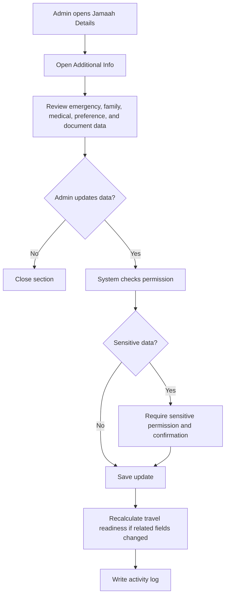

Rules:

1. Additional Info should support travel operations, not general biography.
2. Hobbies, working experience, education, generic certifications, awards, and portfolio documents should not block jamaah registration or travel readiness.
3. Medical and medication notes are sensitive and require additional permission.
4. Emergency contact should be required before Ready for Departure.
5. Travel document completeness may affect Document Status and Ready for Departure.
6. User-facing self-service portal may allow jamaah to complete emergency contact, medical notes, language preference, and documents.

### 12.3.5 Emergency Contact Flow

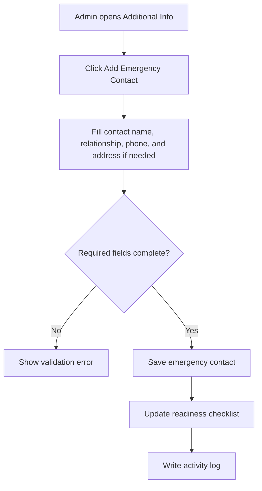

Emergency Contact form:

| Field | Type | Required | Validation | Notes |
|---|---|---:|---|---|
| Contact Name | Text input | Yes | Max 120 characters | Emergency contact full name |
| Relationship | Select | Yes | Must select one option | Father, Mother, Spouse, Child, Sibling, Guardian, Other |
| Country Code | Phone country selector | Yes | Valid country code | Default follows jamaah phone country if available |
| Phone Number | Phone input | Yes | Valid phone format | Primary emergency number |
| Secondary Phone Number | Phone input | Optional | Valid phone format | Backup emergency number |
| Email | Email input | Optional | Valid email | Useful for notification/support |
| Address | Long text | Optional | Max length by policy | Emergency contact address |
| Is Primary Contact | Toggle | Yes | One primary contact only | Default enabled if first contact |

Rules:

1. At least one primary emergency contact is required before Ready for Departure.
2. Phone number is mandatory for emergency contact.
3. Only one emergency contact can be marked as primary.

### 12.3.6 Family / Mahram Grouping Flow

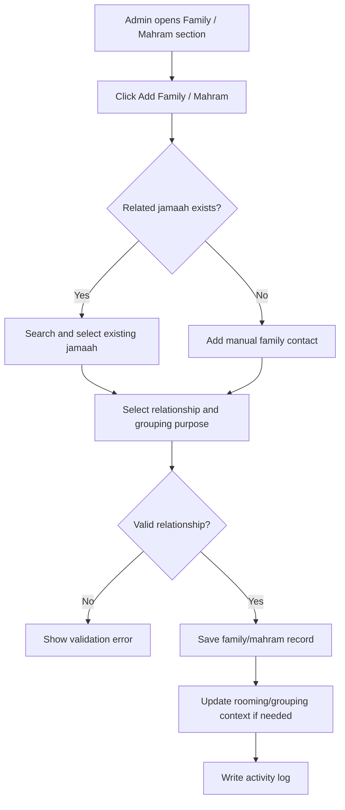

Family / Mahram form:

| Field | Type | Required | Validation | Notes |
|---|---|---:|---|---|
| Link Type | Select | Yes | Existing Jamaah or Manual Entry | Existing is preferred |
| Related Jamaah | User/Jamaah search | Conditional | Required if Existing Jamaah | Search by name, email, phone |
| Family Member Name | Text input | Conditional | Required if Manual Entry | For family member not in system |
| Relationship | Select | Yes | Must select one option | Spouse, Father, Mother, Child, Sibling, Guardian, Mahram, Other |
| Gender | Select | Optional | Male or Female | Useful for grouping |
| Phone Number | Phone input | Optional | Valid phone format | Required if manual contact is emergency backup |
| Grouping Purpose | Multi-select | Optional | Rooming, seating, mahram, family package | Supports operations |
| Notes | Long text | Optional | Internal only if flagged | Additional context |

Rules:

1. Existing jamaah cannot be linked twice with the same relationship context.
2. Mahram relationship should be flagged clearly if used for operational or compliance grouping.
3. Family grouping must not override group trip room allocation without confirmation.

### 12.3.7 Medical & Special Needs Flow

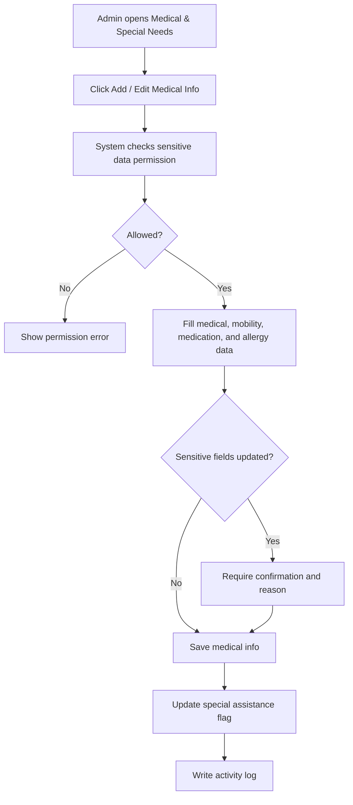

Medical & Special Needs form:

| Field | Type | Required | Validation | Notes |
|---|---|---:|---|---|
| Has Medical Condition | Toggle | Yes | Yes/No | If Yes, medical notes become required |
| Medical Notes | Long text | Conditional | Required if Has Medical Condition = Yes | Sensitive field |
| Mobility Assistance | Select | Optional | None, Wheelchair, Elderly Assistance, Other | Used by operations |
| Medication Notes | Long text | Optional | Sensitive field | Medication carried or schedule |
| Allergy Information | Long text | Optional | Sensitive field | Food/medicine allergy |
| Special Assistance Required | Toggle | Yes | Yes/No | Used for trip preparation |
| Assistance Notes | Long text | Conditional | Required if assistance is required | Operational instruction |
| Doctor / Clinic Contact | Text input | Optional | Max 120 characters | Optional reference |

Rules:

1. Medical, medication, and allergy data are sensitive.
2. Sensitive medical data must be masked or hidden from unauthorized users.
3. Special Assistance Required should be visible as an operational flag without exposing full medical notes.

### 12.3.8 Preferences Flow

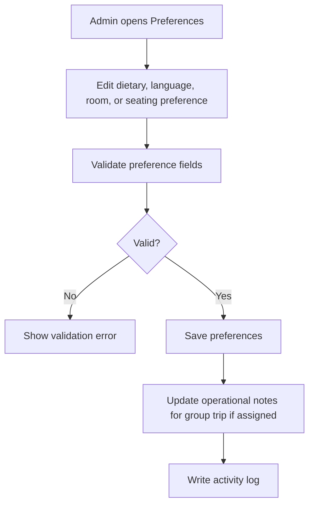

Dietary Requirements form:

| Field | Type | Required | Validation | Notes |
|---|---|---:|---|---|
| Dietary Requirement | Multi-select | Optional | Master Data options | No restriction, vegetarian, diabetic, allergy, other |
| Dietary Notes | Long text | Conditional | Required if Other or Allergy selected | May contain sensitive health info |

Language Preference form:

| Field | Type | Required | Validation | Notes |
|---|---|---:|---|---|
| Preferred Language | Select | Optional | Master Data language | Malay, Indonesian, English, Arabic, Other |
| Proficiency | Select | Optional | Basic, Conversational, Fluent, Native | Optional support context |
| Notes | Long text | Optional | Max length by policy | Operational note |

Room / Seating Preference form:

| Field | Type | Required | Validation | Notes |
|---|---|---:|---|---|
| Room Preference | Select | Optional | Master Data options | Family room, same gender, elderly support, no preference |
| Preferred Roommate / Family Group | Jamaah search | Optional | Must belong to same group trip if assigned | Used for room allocation |
| Seating Preference | Select | Optional | Aisle, window, near family, elderly support, no preference | Operational note only |
| Notes | Long text | Optional | Max length by policy | Does not guarantee allocation |

Rules:

1. Preferences are requests, not guaranteed allocations.
2. Roommate selection must respect group trip and room allocation rules.
3. Dietary allergy notes may be treated as sensitive data.

### 12.3.9 Travel Documents Flow

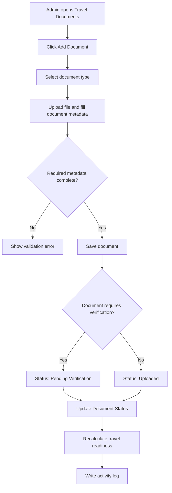

Travel Document form:

| Field | Type | Required | Validation | Notes |
|---|---|---:|---|---|
| Document Type | Select | Yes | Must select one type | Passport, Visa, Vaccination, Insurance, Consent Letter, Other |
| Document Number | Text input | Conditional | Required for passport/visa if applicable | Masked for sensitive document types |
| Issuing Country | Select | Conditional | Required for passport | Master Data country |
| Issue Date | Date picker | Optional | Cannot be future date | Based on document type |
| Expiry Date | Date picker | Conditional | Required for passport/visa/insurance if applicable | Used for expiry warning |
| File Upload | File upload | Yes | See upload size and format policy below | Stored as sensitive document |
| Verification Status | Select | System/Conditional | Uploaded, Pending Verification, Verified, Rejected, Expired | System or authorized verifier |
| Review Note | Long text | Conditional | Required if rejected | Internal/compliance note |
| Visible to Jamaah | Toggle | Optional | Default based on document type | Whether jamaah can view uploaded document |

Upload size and format policy:

| Upload Type | Allowed Format | Max Size | Optimization Rule |
|---|---|---:|---|
| Profile Photo | JPG, JPEG, PNG, WEBP | 2 MB | Compress and resize to max 1024px on longest side |
| IC / Passport Image | JPG, JPEG, PNG, WEBP, PDF | 5 MB | Compress image and generate preview thumbnail |
| Passport Document | JPG, JPEG, PNG, WEBP, PDF | 5 MB | Compress image/PDF where possible |
| Visa Document | JPG, JPEG, PNG, WEBP, PDF | 5 MB | Compress image/PDF where possible |
| Vaccination Document | JPG, JPEG, PNG, WEBP, PDF | 5 MB | Compress image/PDF where possible |
| Insurance Document | PDF, JPG, JPEG, PNG, WEBP | 5 MB | Compress PDF/image where possible |
| Consent Letter | PDF, JPG, JPEG, PNG, WEBP | 5 MB | Compress PDF/image where possible |
| Other Supporting Travel Document | PDF, JPG, JPEG, PNG, WEBP | 5 MB | Require document type and reason |

Rules:

1. Passport is required before Ready for Departure if international travel requires passport.
2. Visa, vaccination, insurance, and consent letter are conditional based on package, destination, age, and policy.
3. Expired documents should block Ready for Departure when the document is mandatory.
4. Replacing or deleting a document must preserve history and audit logs.
5. Rejected document requires review note.
6. Upload should be rejected if file size exceeds the allowed max size.
7. System should compress uploaded images before storage when possible.
8. System should generate thumbnails/previews instead of loading original files in list or card views.
9. Original file access should be restricted and loaded only when Admin opens preview/download.
10. Files should be stored in object storage or equivalent file storage, not directly inside the application server filesystem.
11. Server should validate MIME type and file extension to prevent unsafe uploads.
12. System should scan uploaded files for malware if scanning service is available.

### 12.3.10 Internal Notes Flow

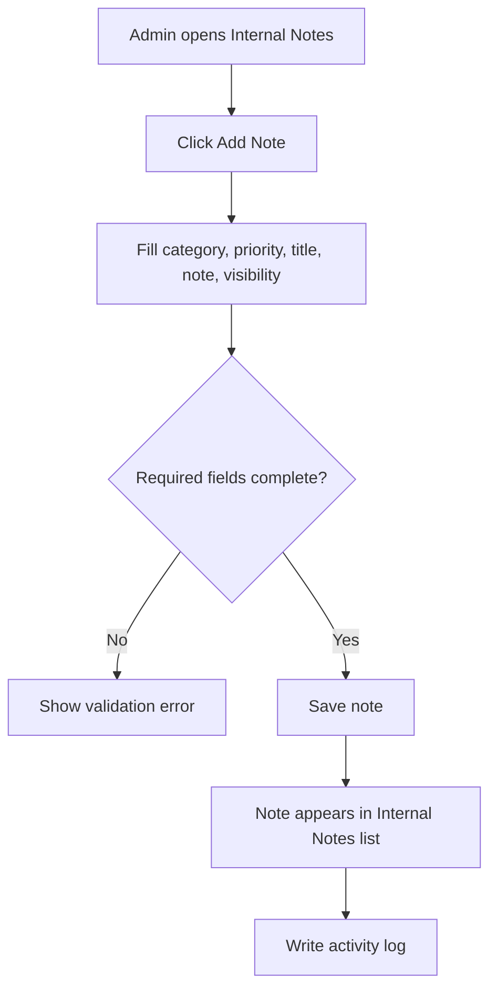

Internal Notes form:

| Field | Type | Required | Validation | Notes |
|---|---|---:|---|---|
| Category | Select | Yes | Must select one category | Operations, Document, Payment, Medical, Support, Other |
| Priority | Select | Yes | Low, Normal, High, Urgent | Used for follow-up |
| Title | Text input | Yes | Max 120 characters | Short summary |
| Note | Long text | Yes | Max length by policy | Internal-only note |
| Visibility | Select | Yes | Internal Only, Restricted Admins | Never visible to Jamaah |
| Follow-up Date | Date picker | Optional | Future date | Optional reminder context |

Rules:

1. Internal notes must never be visible to Jamaah users.
2. Medical-related internal notes require sensitive permission.
3. Restricted notes are visible only to authorized internal roles.

### 12.4 Jamaah Details Edit Flow

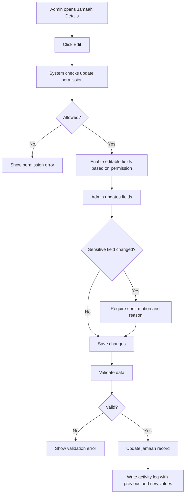

### 12.5 Sensitive Field Rules

Sensitive fields include:

1. IC / Passport ID.
2. IC / Passport document images.
3. Date of birth.
4. Bank account details.
5. Payment-related fields.
6. Medical notes or special needs.
7. Account email if used for login.

Rules:

1. Sensitive fields should be masked by default where possible.
2. Viewing sensitive fields requires Sensitive Data permission.
3. Editing sensitive fields requires Update Sensitive Data permission.
4. Bank details require Finance or View Sensitive Data permission.
5. Sensitive field changes require confirmation.
6. Previous and new values must be recorded in audit logs, with masking policy applied for highly sensitive values.
7. Jamaah may be allowed to update self-service fields through their own portal when available.

---

## 13. Validation Rules

1. Jamaah Name is required for new user.
2. Email is required for invitation.
3. Phone Number is required for MVP based on current design.
4. Email must use valid format.
5. Phone number must use valid country code.
6. System must check duplicate email before creating new user.
7. System must check duplicate phone number and warn Admin.
8. Existing user cannot be added twice to the same travel agency/group trip context.
9. Travel Agency Admin can only add jamaah under their own agency.
10. Group Trip assignment must respect capacity if group trip is selected.
11. Ready for Departure cannot be assigned from list unless document and payment rules are satisfied.
12. Invitation cannot be sent if email is missing or invalid.
13. Email changes require account-level permission because email is tied to User Account login.
14. Sensitive identity, document, bank, payment, and medical fields require additional permission.
15. Sensitive field updates require confirmation and reason.
16. Bank Details should remain optional unless refund or payout workflow is enabled.
17. Skills/Talents and About Me should not block jamaah registration or travel readiness.
18. Hobbies, working experience, education, generic certifications, awards, and portfolio documents should not be required for Jamaah Profile.
19. Emergency Contact should be required before Ready for Departure.
20. Medical notes, medication notes, and special needs require sensitive permission.
21. Travel document completeness may update Document Status and travel readiness.

---

## 14. Empty State

Examples:

```text
No jamaah found.
No jamaah matches your filter.
No pending invitations found.
No existing user found with this email or phone number.
```

Empty state actions:

1. Add Jamaah if Admin has create permission.
2. Clear filters if active filters are causing no result.

---

## 15. Error State

The system must show clear error messages when:

1. Jamaah data fails to load.
2. Admin does not have permission.
3. Required form fields are missing.
4. Email already exists.
5. Phone number already exists.
6. Existing user cannot be linked due to duplicate assignment.
7. Invitation email fails to send.
8. Invitation token is expired or invalid.
9. Selected group trip is full.
10. Export fails.

Example messages:

```text
This email is already registered. You can add the existing user instead.
```

```text
Invitation could not be sent. Please try again or contact support.
```

---

## 16. Responsive Behavior

### Desktop Web

1. Use full table layout.
2. Search and Add Jamaah button appear in the page header.
3. Filters appear above table.
4. Pagination appears below table.
5. Wide table may use horizontal scroll.

### Tablet Web

1. Use condensed table.
2. Less important columns may be hidden.
3. Filters can wrap to multiple rows.
4. Add Jamaah modal should fit viewport with sticky footer actions.

### Mobile Web

1. Use card list or horizontally scrollable table.
2. Filters should open in a bottom sheet or collapsible panel.
3. Search should remain easy to access at top.
4. Add Jamaah modal should become full-screen.
5. Row actions should use bottom sheet menu.

---

## 17. Activity Logs

The system must log critical actions:

1. Create new jamaah.
2. Add existing user as jamaah.
3. Edit jamaah profile.
4. Send invitation.
5. Resend invitation.
6. Accept invitation.
7. Cancel invitation.
8. Change jamaah status.
9. Assign jamaah to travel agency.
10. Assign jamaah to package.
11. Assign jamaah to group trip.
12. Remove jamaah from group trip.
13. Export jamaah data.
14. View sensitive data if applicable.
15. Edit sensitive identity fields.
16. Upload, replace, or delete IC/passport images.
17. Edit bank details.
18. Edit medical notes or special needs.
19. Change account email.
20. Save jamaah details as draft.
21. Add or edit emergency contact.
22. Add or edit family/mahram grouping.
23. Add or edit dietary requirements.
24. Add or edit language preference.
25. Upload, replace, or delete travel documents.
26. Add or edit room/seating preference.
27. Add or edit internal notes.
28. Verify or reject travel document.
29. Replace expired travel document.
30. Update travel readiness based on additional info.

Each log must include actor, role, action, previous value, new value, timestamp, IP address, and device.

---

## 18. Acceptance Criteria

1. Admin can view Jamaah List based on permission and data scope.
2. Admin can search jamaah by name, email, phone number, passport number if permitted, travel agency, package, and group trip.
3. Admin can filter jamaah by status, invitation status, country, gender, travel agency, package, group trip, payment status, document status, and date created.
4. Admin can add jamaah as a new user.
5. Admin can add jamaah from an existing registered user.
6. System detects duplicate email and suggests adding existing user instead.
7. System prevents duplicate assignment to the same group trip.
8. Admin can send email invitation after adding jamaah.
9. Invitation email uses secure activation link and does not include temporary password.
10. Admin can resend invitation if invitation is pending or expired.
11. System tracks invitation status as Not Sent, Pending, Accepted, Expired, or Cancelled.
12. Admin can view row actions based on permission and jamaah status.
13. Bulk actions validate eligibility per selected jamaah.
14. Sensitive fields are hidden unless Admin has permission.
15. Jamaah status follows the defined status flow.
16. All critical actions are recorded in activity logs.
17. Jamaah List works on desktop, tablet, and mobile web.
18. Admin can view Jamaah Details according to permission and data scope.
19. Admin can edit non-sensitive operational fields with update permission.
20. Sensitive identity, document, bank, payment, medical, and account email fields require additional permission.
21. Sensitive field updates require confirmation, reason, and audit log.
22. Bank Details are optional in MVP unless refund or payout workflow is enabled.
23. Skills/Talents and About Me are optional and do not block registration, invitation, or travel readiness.
24. Hobbies, working experience, education, generic certifications, awards, and portfolio documents are excluded from Jamaah MVP unless a specific business use case is approved.
25. Additional Info for Jamaah focuses on emergency contact, family/mahram grouping, medical/special needs, dietary requirements, language preference, room/seating preference, travel documents, and internal notes.
26. Emergency Contact is required before Jamaah can become Ready for Departure.
27. Medical and medication notes are treated as sensitive data.
28. Admin can add and edit emergency contact with required name, relationship, and phone number.
29. Admin can add family/mahram grouping by linking existing jamaah or entering manual family contact.
30. Admin can add medical and special needs data only with sensitive data permission.
31. Admin can add dietary, language, room, and seating preferences as operational requests.
32. Admin can upload travel documents with document type, file, metadata, and verification status.
33. Mandatory expired or rejected travel documents prevent Ready for Departure.
34. Admin can add internal notes that are never visible to Jamaah users.
35. Additional Info updates can recalculate Document Status and travel readiness when relevant.

---

## 19. Open Questions

1. Should Travel Agency Admin be allowed to create jamaah without Super Admin approval?
2. Is phone number required for all countries, or only recommended?
3. Should gender be mandatory during Add Jamaah or only before document completion?
4. Should jamaah be assigned to Travel Agency at creation time, or can they exist as platform-level users first?
5. Should invitation expiry be 7 days, 14 days, or configurable by Settings?
6. Should existing users receive email notification or in-app notification only?
7. Should bulk import from spreadsheet be included in MVP or future phase?

---

## 20. Future Enhancements

1. Bulk import jamaah from CSV/XLSX.
2. Bulk document upload.
3. Family/group registration.
4. Duplicate merge tool.
5. Advanced document expiry reminders.
6. WhatsApp invitation.
7. Self-service jamaah profile completion.
8. Automated Ready for Departure checklist.
9. QR check-in for departure events.
