# Package Management - Module Product Requirements Document

Version: v1.0
Platform: Responsive Web Platform
Scope: Package Management
Status: Draft
Prepared by: Product / UI/UX Team
Last updated: 2 June 2026

> Phase 1 focuses on responsive web. Native Android and iOS applications are out of scope.


---

# Module PRD - Package Management

Product: UmrahHaji.com Admin Panel
Module: Package Management
Scope: Admin Panel and Travel Agency package catalog
Platform: Responsive Web Platform
Status: Draft
Last Updated: 4 June 2026

---

## 1. Objective

Package Management allows Admin to view, monitor, review, export, create, and manage all Umrah/Hajj packages created by Travel Agencies.

Admin can create a package manually on behalf of a Travel Agency when the Travel Agency requests assistance or gives approval. Admin can also edit package data under specific rules, permission controls, and Travel Agency approval requirements.

Package is the sellable product. Booking is the customer reservation created from a package schedule. Group Trip is the actual departure operation created from confirmed booking allocation or from manual Admin/Travel Agency assistance.

---

## 2. Scope

### In Scope

1. Package List across Travel Agencies.
2. Package summary cards.
3. Search and filter package records.
4. Export package data.
5. Create package manually for a selected Travel Agency.
6. Edit package with approval rules.
7. Package details.
8. Package basic information.
9. Key features.
10. Package inclusions.
11. Itinerary planning and itinerary template selection.
12. Season reference and trip schedule setup.
13. Flight option setup.
14. Hotel option setup.
15. Room configuration and pricing.
16. Payment and promotional configuration.
17. Commission configuration.
18. Transport information.
19. Gallery and media.
20. Package status management.
21. Share link.
22. Activity logs and audit history.

### Out of Scope for Phase 1

1. Live hotel booking.
2. Live flight booking.
3. Real-time seat inventory.
4. Real-time room inventory.
5. Automated package purchase checkout.
6. Payment gateway settlement.
7. Automated commission payout.
8. Dynamic pricing engine.
9. AI package builder.
10. Supplier contract management.

---

## 3. Product Positioning

Package Management is a package catalog and sales configuration module.

It stores product-level package data such as price, schedule options, inclusions, hotels, flights, itinerary reference, promotional labels, and commission settings.

When a customer reserves a package, Booking Management references the published package version and stores a booking snapshot. When a real departure is prepared, Group Trip Management uses confirmed bookings or package data as the starting point and copies operational data into trip-specific snapshots.

### Package vs Booking vs Group Trip

| Area | Package | Booking | Group Trip |
| --- | --- | --- | --- |
| Purpose | Sellable product / offer | Customer reservation and payment record | Actual departure operation |
| Schedule | One or more available trip schedules | Selected package schedule snapshot | One confirmed departure schedule |
| Hotel | Package hotel option | Selected hotel/room pricing snapshot | Hotel assignment snapshot |
| Flight | Package flight option | Selected flight option snapshot | Flight assignment snapshot |
| Itinerary | Itinerary template/reference | Package itinerary reference | Dated itinerary snapshot |
| Price | Package pricing and commission | Booking price, payment, balance, cancellation/refund | Payment tracking and operational cost reference |
| Members | Not managed here | Booker and booking participants | Managed in Trip Members |

---

## 4. Relationship With Other Modules

```text
Travel Agency
↓
Package
├── Itinerary Template
├── Season Reference
├── Hotel Options
├── Flight Options
├── Room Pricing
├── Payment & Promotion
├── Commission
├── Gallery / Media
└── Booking
    └── Group Trip Allocation
```

### Relationship Diagram

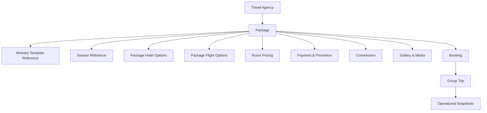

### Integration Table

| Module | Relationship |
| --- | --- |
| Travel Agency Management | Package belongs to one Travel Agency |
| Itinerary Management | Package selects itinerary template/version |
| Season Management | Package schedules can use active season types and periods as calendar and pricing references |
| Hotel Management | Package selects active hotel catalog records |
| Flight / Airline Management | Package selects active airline/flight catalog records |
| Booking Management | Booking references package version, selected schedule, price snapshot, and participant list |
| Group Trip Management | Group trip can be created from package schedule manually or from confirmed booking allocation |
| Jamaah Management | Jamaah may book/select package through Booking Management |
| Billing & Payment Management | Package price, deposit rule, payment terms, and commission rule become invoice/payment defaults |
| Commission | Package stores agent/public commission rules |
| Announcement | Package may be promoted in future |

---

## 5. Core Data Behavior

### Reference vs Snapshot

| Data | Package Behavior | Group Trip Behavior |
| --- | --- | --- |
| Travel Agency | Reference owner agency | Reference owner agency |
| Itinerary | Reference template/version | Copy into dated itinerary snapshot |
| Season | Reference active season type/period from Season Management | Copy into schedule, booking, group trip, and invoice snapshot |
| Hotel | Reference selected hotel option | Copy into hotel assignment snapshot |
| Flight | Reference selected flight/airline option | Copy into flight assignment snapshot |
| Room Pricing | Package-level pricing | Copied as booking/payment reference and group trip reference if needed |
| Promotion Label | Package display metadata | Optional copied display reference |
| Commission | Package-level commission rule | Used for downstream commission calculation |

### Rules

1. Package should store selected catalog IDs and package-specific overrides.
2. Package should not guarantee live hotel room or flight seat availability.
3. Group Trip should copy package defaults when created.
4. Updating package after group trip creation should not automatically update existing group trip snapshots.
5. Admin edit on behalf of Travel Agency must be logged.
6. Published package edits require stricter approval than draft package edits.
7. Customer-facing package display should clearly separate included, optional, excluded, and to-be-confirmed services.
8. Package terms should be versioned together with price and schedule because customers may book based on a specific published offer.

### Package Versioning

Package versioning is required because a published package can be shared, booked, edited, or used to create group trips.

| Version Type | Purpose |
| --- | --- |
| Draft Version | Editable working copy |
| Published Version | Customer/Travel Agency visible package offer |
| Pending Approval Version | Proposed Admin or Travel Agency change awaiting approval |
| Archived Version | Historical record preserved for audit |

### Versioning Rules

1. Publishing a package creates a published version.
2. Editing a published package should create a new draft or pending approval version instead of silently overwriting the active version.
3. Minor typo correction can update the current version only if permission allows and the activity log records the correction.
4. Price, commission, schedule, hotel, flight, itinerary, inclusion, cancellation, and payment term changes should create a new version.
5. Booking created from a package should reference the package version shown to the customer at booking time.
6. Group Trip created from a package or booking should reference the package version used at creation/allocation time.
7. Archived package versions remain viewable for audit but are not selectable for new group trips.

### Package Versioning Flow

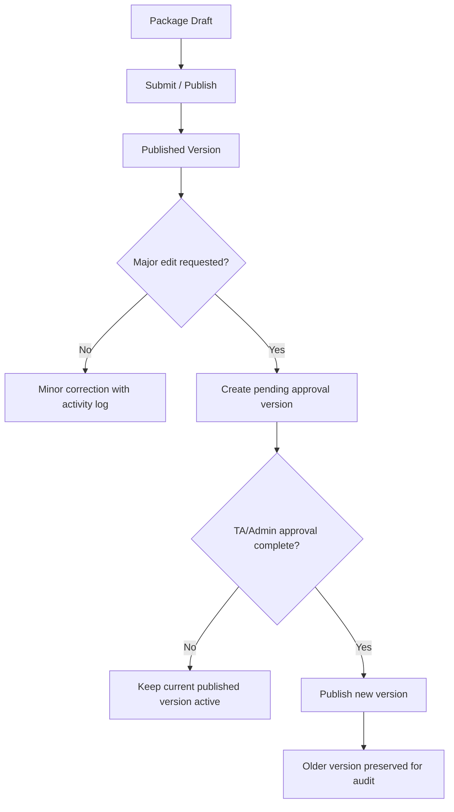

---

## 6. User Roles & Permissions

| Role | Access |
| --- | --- |
| Super Admin | Full access to all packages |
| Admin / Operations | View and manage packages based on permission |
| Travel Agency Admin | Manage own packages in Travel Agency Portal |
| Travel Agency Staff | Limited package access based on role |
| Finance Admin | View pricing, payment, and commission sections if permitted |
| Auditor | Read-only package and activity log access |

### Permission Rules

1. Admin can view packages across Travel Agencies if global permission is granted.
2. Travel Agency users can only view packages owned by their agency.
3. Create package for Travel Agency requires `Package Create For Agency` permission.
4. Edit package owned by Travel Agency requires package edit permission and may require Travel Agency approval.
5. Pricing and commission edits require elevated permission.
6. Publish package requires `Package Publish` permission.
7. Archive package requires `Package Archive` permission.
8. Export requires `Package Export` permission.
9. Delete is allowed only for empty draft packages and should be restricted.
10. Share link generation requires package visibility permission.

---

## 7. Navigation Entry Point

Admin Panel navigation:

```text
Package Management
├── Package List
├── Create Package
├── Package Details
├── Edit Package
├── Export
└── Activity Logs
```

Related entry points:

1. Travel Agency Details -> Packages.
2. Group Trip Create -> Select Package.
3. Itinerary Details -> Used in Packages.
4. Hotel Details -> Used in Packages.
5. Flight Details -> Used in Packages.

---

## 8. Information Architecture

```text
Package Management
- Package List
  - Summary Cards
  - Search
  - Filters
  - Export
  - Create Package
  - Row Actions
- Create / Edit Package
  - Step 1: Basic Info & Package Details
    - Basic Package Information
    - Key Features
    - Package Inclusions
    - Itinerary Planning
  - Step 2: Accommodation & Transportation
    - Flight & Hotel Information
    - Season Reference
    - Trip Schedules
    - Airline / Flight Options
    - Hotel Selection
    - Room Configuration & Pricing
    - Payment & Promotional Configuration
    - Commission Configuration
    - Transport Information
  - Step 3: Gallery & Media
    - Thumbnail
    - Gallery Images
    - Brochure
    - Customer Preview
- Package Details
  - Overview
  - Schedule & Availability
  - Pricing
  - Hotel & Flight
  - Itinerary
  - Media
  - Usage in Group Trips
  - Activity Logs
```

### IA Diagram

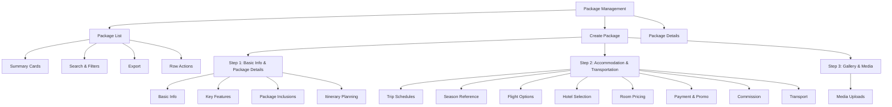

---

## 9. Design Review and Recommended Improvements

### Keep

1. Summary cards: Total Packages, Published, Draft, Archived.
2. Search and filters above table.
3. Export and Create Package actions.
4. Package table with agency, category, hotel, flight, price, schedule, commission, status, and actions.
5. Multi-step Create Package flow.
6. Step status indicators: Complete, In Progress, Empty.
7. Key Features and Package Inclusions quick-add chips.
8. Itinerary template selection and editable itinerary planning.
9. Season reference and trip schedules.
10. Airline chips and add airline dropdown.
11. Room configuration and pricing table.
12. Payment, promotion, commission, and transport sections.

### Improve

1. Add `Travel Agency Approval Reference` when Admin creates or edits package on behalf of TA.
2. Add `Creation Source`: Travel Agency, Admin Assistance, Admin Correction.
3. Add `Edit Reason` for Admin edits.
4. Add `Published Edit Lock` behavior.
5. Add `Package Code` for unique reference.
6. Add `Visibility`: Internal, Public, Private Link, Hidden.
7. Add `Booking Availability`: Open, Closed, Coming Soon, Sold Out, On Request.
8. Add `Package Owner Scope`: Travel Agency-owned, Admin-created for agency.
9. Add warning when itinerary duration does not match schedule duration.
10. Add warning when hotel nights do not match package duration.
11. Add warning when flight route does not match selected destination.
12. Add `Used in Group Trips` count and lock risky edits.
13. Add `Price Last Updated` and `Updated By`.
14. Add media upload limits to protect server performance.
15. Add versioning for published packages.
16. Add package terms, cancellation/refund notes, and important disclaimers.
17. Add package readiness checklist before publish.
18. Add package-to-group-trip handoff rules.
19. Add schedule-level capacity/allotment field if Travel Agency wants to limit package seats before group trip creation.

### Reduce or Avoid

1. Avoid live inventory assumptions.
2. Avoid hard delete for packages used by group trips.
3. Avoid allowing Admin to silently edit TA-owned published package.
4. Avoid mixing member allocation into Package Management.
5. Avoid putting final operational e-ticket/passenger data inside Package Management.
6. Avoid editing published offer details without preserving previous published version.
7. Avoid showing package as available if all active schedules are disabled, expired, sold out, or on request only.

---

## 10. Package List

Package List allows Admin to view all packages created by Travel Agencies and packages created by Admin on behalf of Travel Agencies.

### Summary Cards

| Card | Description |
| --- | --- |
| Total Packages | Total packages visible to current user |
| Published | Packages visible/available according to visibility rules |
| Draft | Packages still being prepared |
| Archived | Packages no longer active but preserved |

### Recommended Table Columns

| Column | Description |
| --- | --- |
| Checkbox | Bulk selection |
| Package Name | Thumbnail, name, promo labels |
| Travel Agency | Owner agency and verification indicator |
| Category | Umrah, Hajj, Custom, plus package type badges |
| Hotel | Main Makkah/Madinah hotel summary |
| Flight | Airline and primary flight/airline summary |
| Price/Pax | Base package price per pax |
| Schedule | Main schedule or nearest schedule |
| Commission/Pax | Agent and public commission |
| Status | Draft, Published, Archived, etc. |
| Date Created | Created date |
| Actions | Edit, Share Link, Set Draft, Archive |

### Search

Search should support:

1. Package name.
2. Package code.
3. Travel Agency name.
4. Hotel name.
5. Airline name.
6. Flight number.
7. Category.
8. Promo label.
9. Schedule date.

### Filters

| Filter | Values |
| --- | --- |
| Category | Umrah, Hajj, Custom, Ziyarah, Other |
| Type | Economy, Standard, Premium, VIP, Family, Express, Custom |
| Status | Draft, Pending Approval, Published, Unpublished, Archived |
| Travel Agency | Active agency list |
| Hotel | Active hotel list |
| Flight | Active airline/flight list |
| Date Created | All Time, Today, This Week, This Month, This Year, Custom Range |
| Promo Label | Hot Deal, Best Offer, Low Season, Family Deal, etc. |
| Booking Availability | Open, Closed, Sold Out, Coming Soon, On Request |

### Row Actions

| Action | Rule |
| --- | --- |
| View Details | Opens package details |
| Edit | Requires permission and approval rules |
| Share Link | Available for published/private-link packages |
| Set Draft | Requires permission; not allowed if active bookings depend on it unless confirmed |
| Archive | Preferred over delete |
| Delete | Only empty draft and restricted |

### Bulk Actions

| Action | Rule |
| --- | --- |
| Export Selected | Requires export permission |
| Archive Selected | Draft/unpublished only unless Super Admin |
| Update Status | Restricted |
| Apply Label | Optional future enhancement |

---

## 11. Admin Create Package for Travel Agency

Admin can create package for a Travel Agency when the Travel Agency asks for help or gives approval.

### Admin Assistance Rule

Admin-created package on behalf of Travel Agency requires:

1. Selected Travel Agency.
2. Creation Source = Admin Assistance.
3. Request source.
4. Travel Agency PIC if available.
5. Approval reference or approval note.
6. Activity log entry.

### Create Package Flow

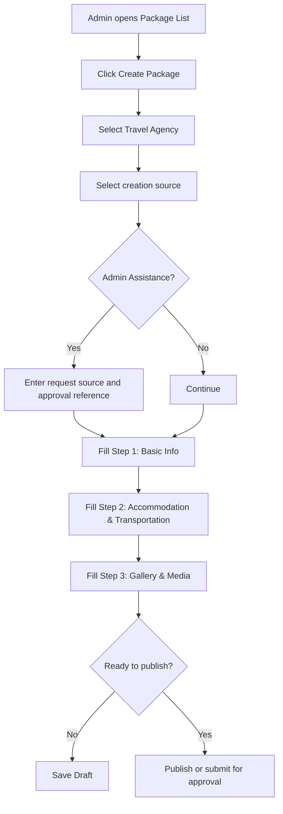

### Creation Source Values

| Value | Meaning |
| --- | --- |
| Travel Agency | Created by Travel Agency user |
| Admin Assistance | Created by Admin for selected Travel Agency |
| Admin Correction | Created/updated by Admin for correction/compliance |

---

## 12. Admin Edit Package With TA Approval

Admin can edit a package created by Travel Agency only under controlled conditions.

### Edit Rules

| Package State | Admin Edit Rule |
| --- | --- |
| Draft | Admin can edit with permission; approval recommended if TA-owned |
| Pending Approval | Admin can edit review notes or requested fields |
| Published | Admin edits require Travel Agency approval unless compliance/emergency correction |
| Used in Group Trip | Risky fields require confirmation and should not affect existing group trip snapshots |
| Archived | Read-only except restore/archive metadata |

### Fields Requiring Approval

1. Package name.
2. Package description.
3. Price/pax.
4. Deposit configuration.
5. Commission.
6. Hotel selection.
7. Flight selection.
8. Schedule.
9. Itinerary.
10. Package inclusions.
11. Promotional labels.
12. Public visibility/share link.

### Fields Admin May Correct Without TA Approval

1. Typo correction that does not change offer meaning.
2. Compliance label.
3. Broken image or media replacement if approved policy allows.
4. Internal notes.
5. Archive due to policy violation, with reason.

### Admin Edit Approval Flow

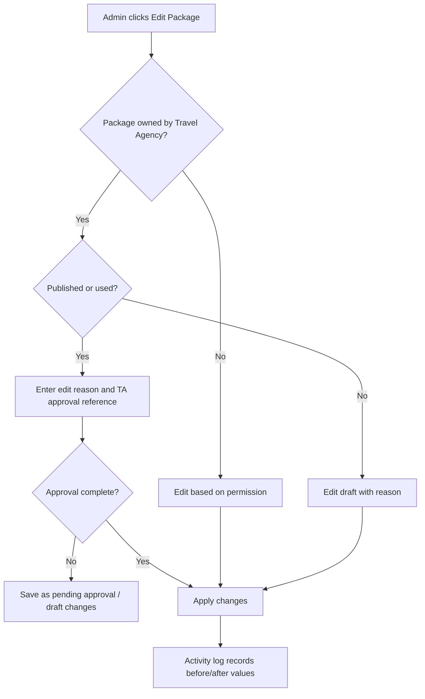

### Admin Edit Fields

| Field | Type | Required | Validation | Notes |
| --- | --- | --- | --- | --- |
| Edit Reason | Textarea/select | Yes | Max 500 chars | Required for Admin edit |
| Approval Source | Select | Conditional | Email, WhatsApp, call, ticket, other | Required for TA-owned published package |
| Travel Agency PIC | Select/text | Conditional | Max 150 chars | Approver |
| Approval Reference | Text/upload | Conditional | Max 500 chars or file | Required for major edit |
| Internal Note | Textarea | Optional | Max 1,000 chars | Admin-only |

### Approval Evidence Upload

| File Type | Max Size | Max Files | Notes |
| --- | --- | --- | --- |
| PDF | 2 MB | 3 | Email or formal request |
| JPG, JPEG, PNG | 2 MB | 3 | Screenshot proof |
| DOCX | 2 MB | 1 | Optional |

---

## 13. Create / Edit Package Wizard

The Create Package page uses a 3-step wizard:

1. Basic Info & Package Details.
2. Accommodation & Transportation.
3. Gallery & Media.

### Step Rules

1. User can jump to any step.
2. Each step shows status: Complete, In Progress, Empty.
3. Save Draft is available from every step.
4. Publish or Save & Continue validates current step.
5. Missing required fields should show inline validation.
6. Admin-created package for TA cannot publish without approval reference if required.

### Wizard Flow

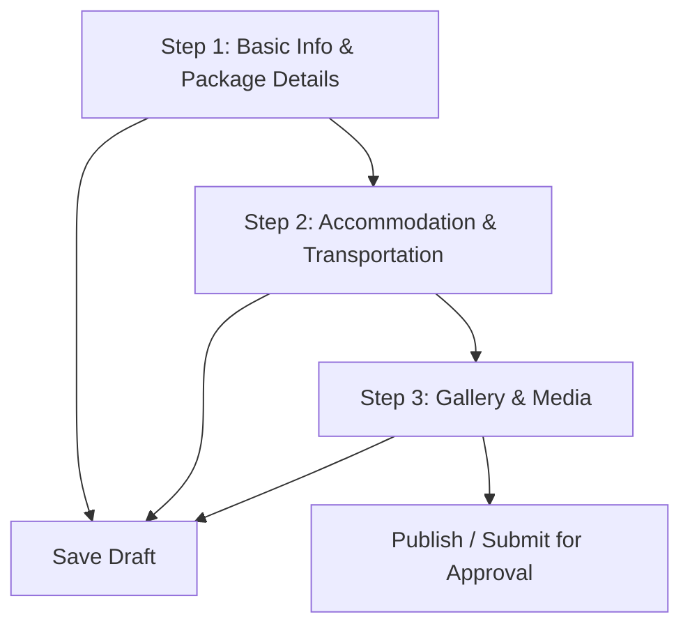

---

## 14. Step 1 - Basic Info & Package Details

### Basic Package Information

| Field | Type | Required | Validation | Notes |
| --- | --- | --- | --- | --- |
| Package Code | Auto/text | Yes | Unique | Example: PKG-UMR-2025-001 |
| Package Name | Text input | Yes | Max 150 chars | Example: Premium Umrah 2025 |
| Package Description | Textarea | Yes | Max 2,000 chars | Customer-facing |
| Package Category | Select | Yes | Umrah, Hajj, Custom, Ziyarah, Other | Required |
| Package Type | Select | Yes | Economy, Standard, Premium, VIP, Family, Express, Custom | Required |
| Travel Agency | Select | Yes | Active agency only | Owner agency |
| Visa Type | Select | Optional | Umrah Visa, Hajj Visa, Tourist Visa, Other | Package-specific |
| Visibility | Select | Yes | Internal, Public, Private Link, Hidden | Default Internal/Draft |
| Booking Availability | Select | Yes | Open, Closed, Coming Soon, Sold Out, On Request | Default Closed |
| Creation Source | Select | Yes | Travel Agency, Admin Assistance, Admin Correction | Audit |

### Key Features

Key Features describe selling points shown to customer.

| Feature Type | Examples |
| --- | --- |
| Guide | Mutawwif Guide, Spiritual Counselling |
| Support | 24/7 Support, Emergency Medical Support |
| Transport | Group Transport, Airport Transfers |
| Accommodation | Comfortable Accommodation |
| Meals | Halal Meals |
| Experience | Historical Tours, Shopping Assistance |
| Accessibility | Multi-language Support |

### Key Feature Rules

1. Admin can add custom feature.
2. Admin can quick-add default features.
3. Feature labels should be customer-facing.
4. Duplicate feature should be prevented.
5. Selected features can be removed before save.

### Package Inclusions

Package Inclusions define what is included in the package price.

| Inclusion Type | Examples |
| --- | --- |
| Travel | Flight Tickets, Transportation, Airport Assistance |
| Visa | Visa Processing |
| Hotel | Hotel Stay |
| Insurance | Travel Insurance |
| Support | Emergency Support, Guide Services |
| Meal | Daily Breakfast |
| Worship Item | Prayer Mat, Ihram Clothing, Zam-zam Water |
| Extra | City Tours, Laundry Service, Group Support |

### Inclusion Rules

1. Admin can add custom inclusion.
2. Admin can quick-add default inclusions.
3. Inclusion can be marked included, optional, excluded, or to be confirmed if needed.
4. Duplicate inclusion should be prevented.
5. Public display should only show customer-visible inclusions.

---

## 15. Itinerary Planning

Package can select an itinerary template and customize package-level itinerary display.

### Itinerary Behavior

1. Package references an active itinerary template/version.
2. Package can customize itinerary content at package level if allowed.
3. Group Trip created from package should copy itinerary into dated operational snapshot.
4. Editing package itinerary should not change original itinerary template.
5. Editing itinerary template should not automatically update package unless Admin/TA chooses update version.

### Itinerary Planning Flow

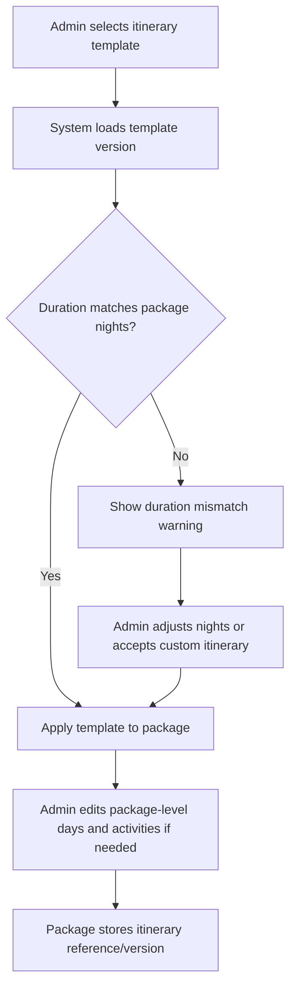

### Fields

| Field | Type | Required | Validation | Notes |
| --- | --- | --- | --- | --- |
| Makkah Nights | Number | Recommended | Min 0 | Used for package summary |
| Madinah Nights | Number | Recommended | Min 0 | Used for package summary |
| Itinerary Template | Select | Recommended | Active and available template | Stores template/version |
| Day Title / Focus | Select/text | Optional | Max 100 chars | Package copy |
| Location | Select/text | Optional | Max 100 chars | Package copy |
| Activity Name | Text | Optional | Max 150 chars | Package copy |
| Activity Time | Time | Optional | Valid time | Customer-facing if enabled |
| Activity Icon | Select | Optional | Master icon | Optional |
| Short Description | Textarea | Optional | Max 500 chars | Customer-facing |

---

## 16. Step 2 - Accommodation & Transportation

Step 2 configures season reference, schedule, flight, hotel, room pricing, payment, promotion, commission, and transport.

### Section Structure

1. Flight & Hotel Information.
2. Season Reference.
3. Trip Schedules.
4. Airline / Flight Options.
5. Hotel Selection.
6. Room Configuration & Pricing.
7. Payment & Promotional Configuration.
8. Commission Configuration.
9. Transport Information.

---

## 17. Seasons and Trip Schedules

Package can define multiple schedules and optionally group them by season. Season values should come from Season Management so package schedule, pricing, group trip, and billing records use the same calendar reference.

### Season Behavior

1. Package may use active Season Types such as Low Season, Medium Season, and High / Peak Season from Season Management.
2. Package schedule can auto-resolve season based on departure date.
3. Admin can manually override the resolved season with permission.
4. Each season can contain multiple trip schedules.
5. Each schedule defines departure and return dates.
6. Schedule can have flight status and hotel status.
7. Schedule can be used later to create a Group Trip.
8. Schedule can optionally store capacity/allotment before group trip exists.
9. Season-specific pricing can be configured manually in Package Management using the selected season reference.

### Schedule Flow

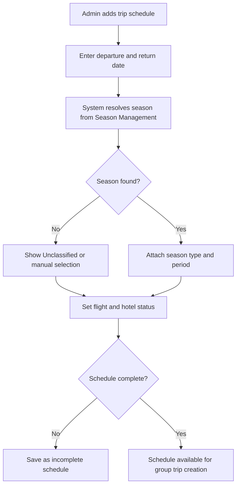

### Schedule Fields

| Field | Type | Required | Validation | Notes |
| --- | --- | --- | --- | --- |
| Season Type | Select/auto | Optional | Active season type | From Season Management |
| Season Period | Select/auto | Optional | Active season period | Resolved by departure date |
| Season Override Reason | Textarea | Conditional | Max 300 chars | Required if manually overridden |
| Schedule Enabled | Toggle | Yes | Boolean | Default enabled |
| Departure Date | Date picker | Yes | Future/current date | Required for published schedule |
| Return Date | Date picker | Yes | After departure | Calculates duration |
| Duration | Auto | Yes | Days/nights | Auto-calculated |
| Flight Status | Select | Yes | Pending, Confirmed, Not Required | Schedule-level |
| Hotel Status | Select | Yes | Pending, Confirmed, Not Required | Schedule-level |
| Schedule Capacity | Number | Optional | Min 1 | Optional pre-trip allotment |
| Available Slots | Number/auto | Optional | 0 to capacity | If booking flow exists |
| Booking Cut-off Date | Date picker | Optional | Before departure date | Optional |
| Schedule Visibility | Select | Yes | Visible, Hidden, On Request | Controls public display |
| Date Created | Auto | Yes | Timestamp | Audit |
| Last Updated | Auto | Yes | Timestamp | Audit |

### Schedule Rules

1. Return date must be after departure date.
2. Published package must have at least one active schedule or availability = On Request.
3. Schedule used by group trip cannot be deleted; archive/disable instead.
4. Flight/hotel pending status should show warning before publish.
5. Schedule capacity is not the same as confirmed seat inventory.
6. Available slots should be treated as package sales control, not airline or hotel inventory.
7. Expired schedules should be hidden from public view unless Admin enables historical display.
8. If departure date changes, system should re-check season and ask confirmation before replacing selected season.
9. If the schedule spans more than one season period, system should keep departure-date season and show cross-season warning.
10. Published package price must not change automatically when Season Management is edited.

### Schedule to Group Trip Flow

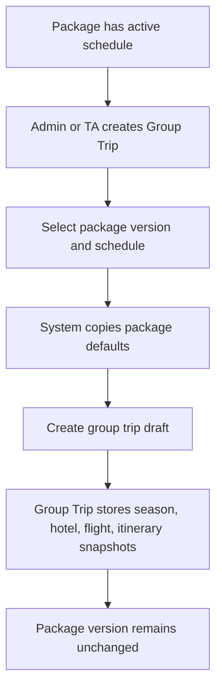

---

## 18. Flight Options

Package can define one or more airline/flight options.

### Flight Behavior

1. Admin can select active airlines/flights from Flight / Airline Management.
2. Package may show airline option even if exact flight number is pending.
3. Package flight option does not guarantee seat availability.
4. Group Trip should copy selected flight option into actual flight assignment snapshot.

### Airline Option Flow

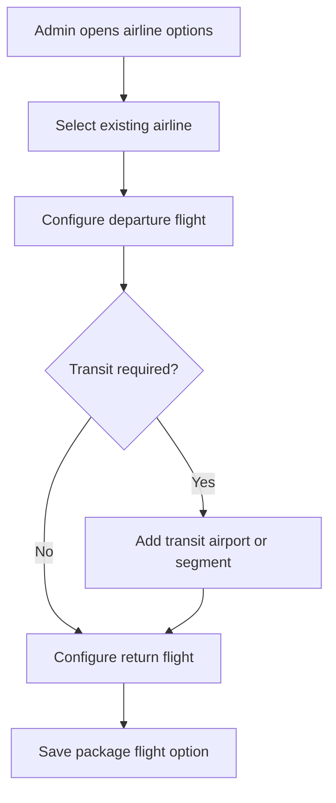

### Flight Option Fields

| Field | Type | Required | Validation | Notes |
| --- | --- | --- | --- | --- |
| Airline | Select | Recommended | Active airline | Example: Malaysia Airlines |
| Airline Code | Auto/read-only | Optional | From airline catalog | Example: MH |
| Package Flight Status | Select | Yes | Pending, Confirmed, To Be Confirmed, Not Included | Package-level |
| Default Flight Class | Select | Optional | Economy, Business, First, Mixed | Package default |
| Departure Airport | Select | Recommended | Airport master | Example: KUL |
| Arrival Airport | Select | Recommended | Airport master | Example: JED |
| Add Transit Area | Toggle | Optional | Boolean | Shows transit fields |
| Transit Airport | Select | Conditional | Required if transit enabled | Example: DXB |
| Transit Duration | Duration | Conditional | Required if transit enabled | Example: 1h 30m |
| Return Departure Airport | Select | Recommended | Airport master | Example: JED |
| Return Arrival Airport | Select | Recommended | Airport master | Example: KUL |
| Baggage Notes | Textarea | Optional | Max 500 chars | Customer-visible if needed |

---

## 19. Hotel Selection

Package can define hotels for Makkah, Madinah, and optional other city segments.

### Hotel Behavior

1. Admin can select active hotels from Hotel Management catalog.
2. Package can define city segment, room defaults, nights, and customer-visible notes.
3. Package hotel option does not guarantee live room availability.
4. Group Trip should copy selected hotel data into hotel assignment snapshot.

### Fields

| Field | Type | Required | Validation | Notes |
| --- | --- | --- | --- | --- |
| Makkah Hotel | Select | Conditional | Active hotel | Required if Makkah nights > 0 |
| Madinah Hotel | Select | Conditional | Active hotel | Required if Madinah nights > 0 |
| Other Hotel | Select | Optional | Active hotel | Transit/other city |
| Hotel Status | Select | Yes | Pending, Confirmed, To Be Confirmed, Not Included | Package-level |
| Hotel Notes | Textarea | Optional | Max 500 chars | Customer-visible |

### Validation

1. Makkah hotel is recommended when Makkah nights > 0.
2. Madinah hotel is recommended when Madinah nights > 0.
3. Archived/inactive hotels cannot be selected for new package.
4. Published package with hotel inclusion should not have empty hotel selection unless status is To Be Confirmed.

---

## 20. Room Configuration and Pricing

Room Configuration and Pricing defines package price per room type and age category.

### Pricing Behavior

1. Package can enable/disable room types.
2. One room type can be marked as default.
3. Price can differ for adult, child, child without bed, and infant.
4. Discount can be applied per room type.
5. Base Price Package displayed to users is derived from default room type and selected pax category.

### Room Pricing Fields

| Field | Type | Required | Validation | Notes |
| --- | --- | --- | --- | --- |
| Room Type Enabled | Toggle | Yes | Boolean | Per room type |
| Room Type | Select/read-only | Yes | Single, Double, Triple, Quad, Quint, Infant | Configurable |
| Default Room Type | Radio | Yes | One default required | Used for base price |
| Adult Price | Currency | Conditional | >= 0 | Required if room type enabled |
| Child Price | Currency | Optional | >= 0 | Child < 12 years |
| Child Without Bed Price | Currency | Optional | >= 0 | Optional |
| Infant Price | Currency | Optional | >= 0 | Per infant/baby |
| Discount Enabled | Toggle | Optional | Boolean | Per row |
| Discount Type | Select | Conditional | Amount, Percentage | Required if discount enabled |
| Discount Amount | Currency/number | Conditional | >= 0 | Amount or percentage |
| Base Price Package | Auto | Yes | Derived | Displayed user-facing |

### Pricing Rules

1. Published package requires at least one enabled room type.
2. Published package requires one default room type.
3. Default room type must have adult price.
4. Discount percentage cannot exceed 100%.
5. Price should store currency, amount, and effective date.
6. Price changes on published package require approval and activity log.
7. Package used by active group trip should not update existing group trip payment references automatically.
8. Pricing may be configured globally for the package or overridden per season/schedule.
9. If schedule-level pricing is enabled, public display should show the price for the selected schedule.
10. Base price should clearly indicate whether it is adult price, child price, infant price, or default room/pax price.
11. Currency should be stored explicitly for every price.

### Pricing Dependency Rules

| Scenario | System Behavior |
| --- | --- |
| Price changed on Draft package | Update directly and log change |
| Price changed on Published package | Create new version or require approval |
| Price changed after Group Trip exists | Do not update existing group trip payment reference automatically |
| Season-specific price enabled | Require valid Season Management reference and schedule/season price mapping |
| Default room type disabled | Block save until another default is selected |
| Discount greater than price | Block save |
| Deposit greater than base price | Block publish |

---

## 21. Payment and Promotional Configuration

### Payment Options

| Field | Type | Required | Validation | Notes |
| --- | --- | --- | --- | --- |
| Full Payment | Toggle | Optional | Boolean | Allow full payment option |
| Deposit Payment | Toggle | Optional | Boolean | Allow deposit option |
| Deposit Type | Select | Conditional | Amount, Percentage | Required if deposit enabled |
| Deposit Amount | Currency/number | Conditional | > 0 | Per pax |
| Payment Notes | Textarea | Optional | Max 500 chars | Customer-visible if needed |

### Payment Rules

1. At least one payment option is required for published package if booking/payment is enabled.
2. Deposit amount cannot exceed package base price if type is amount.
3. Deposit percentage cannot exceed 100%.
4. Payment gateway integration is not part of Package Management; Billing & Payment Management owns payment link, gateway payment, invoice, and receipt behavior.
5. Package should store payment terms text if customer-facing booking/payment is enabled.
6. Refund and cancellation rules should be shown before customer booking in future customer-facing workflow.

### Promotional Labels

Package can select up to two promotional labels.

| Label | Meaning |
| --- | --- |
| Hot Deal | Highlighted offer |
| Best Offer | Recommended offer |
| Low Season | Low season price |
| Mid Season | Mid season package |
| High Season | High season package |
| Early Bird | Early registration offer |
| New | Newly published |
| Limited Time | Time-limited promotion |
| Family Deal | Family-focused package |

### Promotional Rules

1. Maximum two labels can be selected.
2. Labels should be customer-visible only when package visibility allows.
3. Expired labels should be removed automatically if expiry is configured in future phase.
4. Promotion labels should not imply a discount unless the actual discount/price rule exists.
5. Labels can be schedule-specific in future phase if needed.

### Package Terms and Cancellation

Package should include customer-facing terms so Travel Agency and Admin can keep the offer clear and auditable.

| Field | Type | Required | Validation | Notes |
| --- | --- | --- | --- | --- |
| Cancellation Policy | Textarea/select | Recommended | Max 2,000 chars | Customer-facing |
| Refund Policy | Textarea/select | Recommended | Max 2,000 chars | Customer-facing |
| Amendment Policy | Textarea/select | Optional | Max 1,000 chars | Date/name/package changes |
| Payment Due Date Rule | Text/select | Optional | Max 500 chars | Example: balance due 30 days before departure |
| Visa Disclaimer | Textarea | Optional | Max 1,000 chars | If visa processing is included |
| Flight Disclaimer | Textarea | Optional | Max 1,000 chars | If flight is pending/to be confirmed |
| Hotel Disclaimer | Textarea | Optional | Max 1,000 chars | If hotel may change to similar class |
| Package Exclusions | Repeater/chips | Recommended | No duplicate | Items not included |

### Terms Rules

1. Published package should clearly show cancellation/refund terms if booking is enabled.
2. If visa issuance affects cancellation/refund, package should show a specific visa-related disclaimer.
3. If hotel or flight is pending, public package display should show `To Be Confirmed` instead of implying confirmed services.
4. Changes to cancellation/refund/payment terms on published package should create a new version or require approval.
5. Package exclusions should be displayed near inclusions to reduce customer misunderstanding.

---

## 22. Commission Configuration

Commission configuration defines package-level commission per pax.

### Fields

| Field | Type | Required | Validation | Notes |
| --- | --- | --- | --- | --- |
| Commission Type | Select | Yes | Fixed Amount, Percentage, None | Default Fixed Amount |
| Agent Commission | Currency/number | Conditional | >= 0 | Per pax |
| Public Commission | Currency/number | Optional | >= 0 | Per pax |
| Commission Notes | Textarea | Optional | Max 500 chars | Internal |

### Rules

1. Commission can be configured per package.
2. Commission changes on published package require elevated permission.
3. Commission payout is not handled in Package Management; Billing & Payment / Commission modules calculate payment-based commission and settlement readiness.
4. Package stores commission rule for future payment/commission workflows.
5. Commission should not be visible to public users unless intentionally exposed.

---

## 23. Transport Information

Transport Information defines package-level transport inclusions.

### Fields

| Field | Type | Required | Validation | Notes |
| --- | --- | --- | --- | --- |
| Makkah Transport Type | Select | Optional | Bus, Van, Private Coach, Other | Package-level |
| Makkah Transport Status | Select | Optional | Pending, Confirmed, To Be Confirmed, Not Included | Status |
| Madinah Transport Type | Select | Optional | Bus, Van, Private Coach, Other | Package-level |
| Madinah Transport Status | Select | Optional | Pending, Confirmed, To Be Confirmed, Not Included | Status |
| Inter-city Transport Type | Select | Optional | Bus, Haramain Train, Private Coach, Other | Package-level |
| Inter-city Transport Status | Select | Optional | Pending, Confirmed, To Be Confirmed, Not Included | Status |
| Transport Notes | Textarea | Optional | Max 500 chars | Customer-visible/internal based on setting |

---

## 24. Step 3 - Gallery and Media

Gallery and Media defines customer-facing package visuals.

### Media Fields

| Field | Type | Required | Validation | Notes |
| --- | --- | --- | --- | --- |
| Thumbnail | Upload | Recommended | JPG, JPEG, PNG, WebP max 2 MB | Main package image |
| Gallery Images | Multi-upload | Optional | JPG, JPEG, PNG, WebP max 2 MB each, max 10 files | Customer gallery |
| Short Video | Upload/link | Optional | MP4 max 10 MB or external URL | Optional; avoid large upload |
| Brochure PDF | Upload | Optional | PDF max 5 MB | Customer download |
| Media Alt Text | Text | Optional | Max 150 chars | Accessibility/SEO |

### Server Load Rules

1. Compress images before storage.
2. Generate thumbnails for gallery.
3. Reject unsupported formats.
4. Reject files above max size.
5. Limit gallery image count.
6. Prefer external hosted video URL over direct video upload.
7. Virus/malware scan uploaded brochure before download availability.
8. Store optimized preview separately from original if needed.

### Media Review Rules

1. Media should belong to the package or selected catalog item and should not misrepresent hotel, airline, or itinerary.
2. If hotel images come from Hotel Management catalog, package should identify whether image is inherited from catalog or uploaded specifically for package.
3. If Travel Agency uploads media, Admin can review or hide media based on permission.
4. Archived/deleted media should remain referenced in audit logs but not shown publicly.

---

## 25. Package Details Page

Package Details allows Admin to inspect complete package data.

### Recommended Tabs

| Tab | Purpose |
| --- | --- |
| Overview | Package identity, agency, status, visibility |
| Pricing | Room pricing, payment, promotion, commission |
| Schedule | Seasons and trip schedules |
| Hotel & Flight | Accommodation and transportation options |
| Itinerary | Package itinerary reference and preview |
| Media | Thumbnail, gallery, brochure |
| Usage | Group trips created from package |
| Approval History | Admin/TA approval records |
| Activity Logs | Audit trail |
| Terms | Cancellation, refund, exclusions, disclaimers |
| Versions | Draft, published, pending approval, and archived versions |

### Overview Data

1. Package name.
2. Package code.
3. Travel Agency.
4. Category and type.
5. Description.
6. Price/pax.
7. Promo labels.
8. Status.
9. Visibility.
10. Booking availability.
11. Schedule summary.
12. Hotel summary.
13. Flight summary.
14. Commission summary.
15. Created by.
16. Last updated by.
17. Package version.
18. Terms status.
19. Readiness score.

---

## 26. Status Management

### Status Values

| Status | Meaning |
| --- | --- |
| Draft | Package is being prepared |
| Pending Approval | Waiting for Admin or TA approval |
| Published | Package is available according to visibility rules |
| Unpublished | Package is not publicly available |
| Archived | Package is hidden from active list but preserved |
| Rejected | Package submission rejected |
| Sold Out | Package has no available slot for active schedules |
| Expired | All schedules are in the past |

### Status Flow

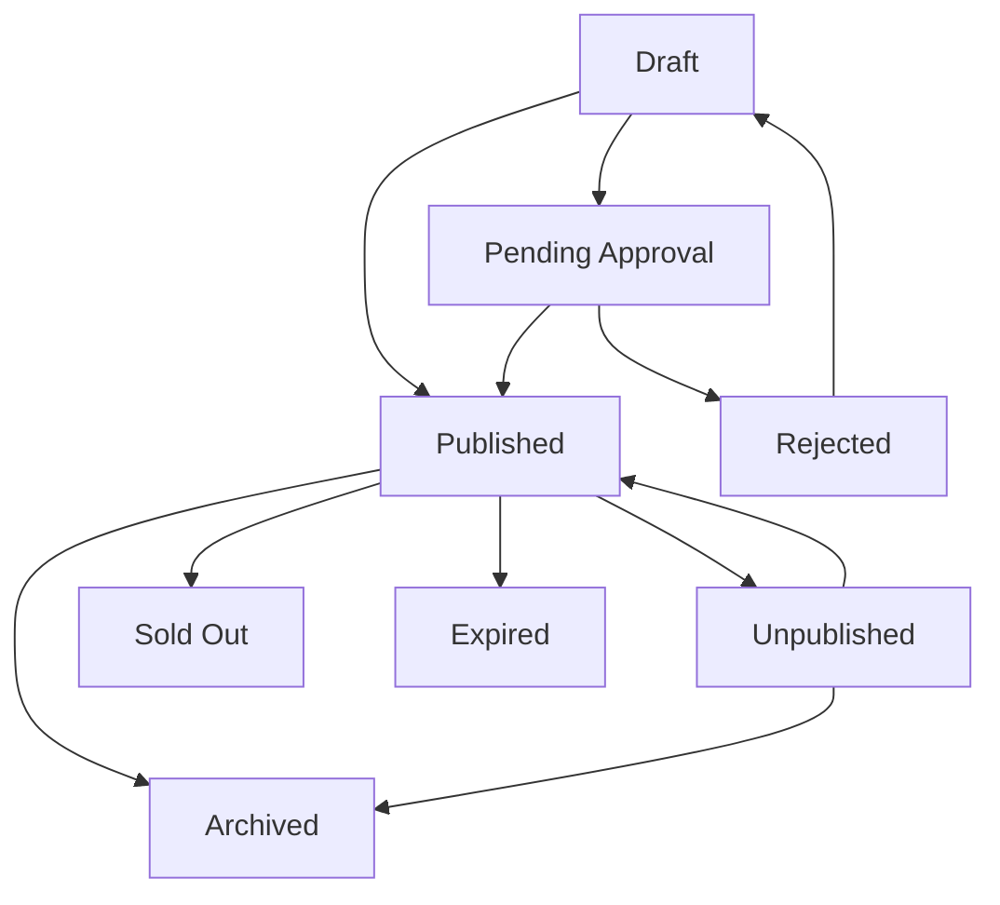

### Publish Requirements

1. Package name is completed.
2. Travel Agency is selected.
3. Category and type are selected.
4. Price is configured.
5. At least one schedule exists or availability is On Request.
6. Package inclusions are defined.
7. Required media is uploaded if policy requires it.
8. Required approval reference is completed for Admin-created/edited TA package.
9. Terms and cancellation/refund policy are completed if customer booking is enabled.
10. Package has no blocking readiness warnings.

### Automatic Status Suggestions

| Condition | Suggested Status |
| --- | --- |
| All schedules are in the past | Expired |
| Active schedule capacity is full | Sold Out |
| Package is missing required publish data | Draft / Incomplete |
| TA approval is required but missing | Pending Approval |
| Package is hidden intentionally | Unpublished |

---

## 27. Share Link

Share Link allows Admin or Travel Agency to generate/open a package URL.

### Rules

1. Share link is available only for Published or Private Link packages.
2. Hidden/Internal packages should not expose public URL.
3. Share link action should be logged.
4. If package is archived, share link should show unavailable state.
5. Link may include package slug generated from package name.
6. Share link should point to a specific published package version.
7. If a newer version is published, old share link may redirect to latest version or preserve versioned view based on product decision.

### Share Link Fields

| Field | Type | Required | Validation | Notes |
| --- | --- | --- | --- | --- |
| Slug | Auto/text | Yes | Unique | Public URL path |
| Visibility | Select | Yes | Public, Private Link, Hidden | Controls access |
| Share Link | URL | Auto | Valid URL | Generated |
| Link Version Behavior | Select | Optional | Latest, Version Locked | Future-proofing |

---

## 28. Export

Export allows Admin to download package data.

### Export Types

| Export Type | Content |
| --- | --- |
| Package List CSV/XLSX | Table data and filters |
| Package Summary PDF | Package overview, pricing, schedule, inclusions |
| Internal Review PDF | Includes approval notes and internal metadata |

### Export Rules

1. Export requires permission.
2. Internal notes should not be included in public/customer export.
3. Commission should be hidden from customer export.
4. Export action should be logged.

---

## 29. Validation Rules

| Validation | Rule |
| --- | --- |
| Travel Agency | Required for every package |
| Package Name | Required and max 150 chars |
| Package Category | Required |
| Package Type | Required |
| Price | Required before publish |
| Default Room Type | Required before publish |
| Schedule | Required before publish unless On Request |
| Itinerary | Recommended before publish |
| Hotel | Required if package inclusion includes hotel stay unless To Be Confirmed |
| Flight | Required if package inclusion includes flight ticket unless To Be Confirmed |
| Commission | Required if commission enabled |
| Promo Label | Max two labels |
| Admin Assistance | Approval reference required before publish |
| Published Edit | Requires edit reason and possibly TA approval |
| Used Package | Cannot be hard-deleted |
| Package Terms | Required before publish if booking is enabled |
| Schedule Capacity | Must be >= booked/allocated count if booking exists |
| Version Approval | Required for major published package edits |
| Public Visibility | Requires published version |

---

## 30. Empty and Error States

### Empty State

#### Package List

Message:

```text
No package has been created yet.
```

CTA:

```text
Create Package
```

### Error States

| Error | System Behavior |
| --- | --- |
| Travel Agency missing | Block save/publish depending on state |
| Approval reference missing | Allow draft, block publish |
| Price missing | Block publish |
| No schedule | Block publish unless availability is On Request |
| Inactive hotel selected | Disable selection or show warning |
| Inactive flight selected | Disable selection or show warning |
| Itinerary duration mismatch | Show warning and allow controlled override |
| Duplicate promo labels | Prevent duplicate |
| File too large | Reject upload and show max size |
| Unsupported file type | Reject upload |
| Used by group trip | Block delete and suggest archive |

---

## 31. Notification Rules

| Event | Recipient | Channel | Notes |
| --- | --- | --- | --- |
| Admin creates package for TA | Travel Agency PIC | In-app/email optional | If notification module exists |
| Admin edit requires approval | Travel Agency PIC | In-app/email optional | Approval workflow |
| Package published | Travel Agency PIC/Admin | In-app optional | Audit visibility |
| Package archived | Travel Agency PIC/Admin | In-app optional | Important change |
| Package rejected | Travel Agency PIC | In-app/email optional | Include reason |

Phase 1 should keep notifications controlled and avoid notifying customers automatically unless package/public workflow is finalized.

---

## 32. Activity Log Requirements

| Action | Logged Data |
| --- | --- |
| Create package | Actor, Travel Agency, creation source |
| Admin assistance creation | Request source, approval reference |
| Edit package | Before/after values |
| Edit pricing | Old/new price, actor, approval |
| Edit commission | Old/new commission, actor |
| Update schedule | Old/new date |
| Update hotel | Old/new hotel |
| Update flight | Old/new airline/flight |
| Update itinerary | Old/new template version |
| Upload media | File metadata |
| Publish package | Actor and timestamp |
| Share link opened/copied | Actor and package |
| Export package | Export type and actor |
| Archive package | Reason and actor |

---

## 33. Responsive Web Behavior

### Desktop Web

1. Package List uses dense table layout.
2. Create Package wizard uses multi-column sections.
3. Pricing table can use horizontal scrolling if needed.
4. Sticky footer actions are recommended.

### Tablet Web

1. Filters may wrap into multiple rows.
2. Wizard sections stack where needed.
3. Pricing table should remain readable with horizontal scroll.
4. Media upload previews should fit screen width.

### Mobile Web

1. Package List should become card list or horizontal table.
2. Wizard steps stack vertically.
3. Room pricing should use expandable cards or horizontal scroll.
4. Large tables must not overflow without scroll.
5. Primary actions should remain accessible.

---

## 34. Security and Data Privacy

1. Admin must not edit TA-owned package without permission.
2. Major Admin edits require reason and approval reference.
3. Pricing and commission require elevated permission.
4. Media uploads must be validated.
5. Package share link must respect visibility.
6. Internal notes must not appear on public package page.
7. Activity logs must record actor, timestamp, and before/after data.
8. Archived packages should remain available for audit.

---

## 35. Form Field Specification Summary

### 35.1 Create / Edit Package Form

| Section | Field | Type | Required | Validation | Notes |
| --- | --- | --- | --- | --- | --- |
| Basic Info | Package Code | Auto/text | Yes | Unique | Auto recommended |
| Basic Info | Package Name | Text | Yes | Max 150 chars | Required |
| Basic Info | Description | Textarea | Yes | Max 2,000 chars | Customer-facing |
| Basic Info | Category | Select | Yes | Master data | Umrah/Hajj/etc |
| Basic Info | Type | Select | Yes | Master data | Economy/VIP/etc |
| Basic Info | Travel Agency | Select | Yes | Active agency | Owner |
| Basic Info | Visa Type | Select | Optional | Master data | Optional |
| Basic Info | Visibility | Select | Yes | Internal/Public/etc | Default internal |
| Approval | Creation Source | Select | Yes | Fixed values | Audit |
| Approval | Request Source | Select/text | Conditional | Required for Admin Assistance | Audit |
| Approval | Approval Reference | Text/upload | Conditional | Required before publish | TA approval |
| Features | Key Feature | Repeater/chips | Optional | No duplicate | Customer-facing |
| Inclusions | Inclusion | Repeater/chips | Recommended | No duplicate | Customer-facing |
| Itinerary | Itinerary Template | Select | Recommended | Active template | Stores version |
| Schedule | Season Type | Select/auto | Optional | Active season type | From Season Management |
| Schedule | Season Period | Select/auto | Optional | Active season period | Resolved by departure date |
| Schedule | Season Override Reason | Textarea | Conditional | Max 300 chars | Required if manual override |
| Schedule | Departure Date | Date | Conditional | Valid date | Required for schedule |
| Schedule | Return Date | Date | Conditional | After departure | Required for schedule |
| Flight | Airline | Select | Optional | Active airline | Package option |
| Flight | Airports | Select | Optional | Master airport | Route |
| Hotel | Makkah Hotel | Select | Conditional | Active hotel | If Makkah nights |
| Hotel | Madinah Hotel | Select | Conditional | Active hotel | If Madinah nights |
| Pricing | Room Type Prices | Table | Yes before publish | >= 0 | At least one room |
| Payment | Deposit Amount | Currency/number | Conditional | > 0 | If deposit enabled |
| Promotion | Labels | Multi-select | Optional | Max 2 | Customer-facing |
| Commission | Agent Commission | Currency/number | Optional | >= 0 | Internal |
| Media | Thumbnail | Upload | Recommended | Image max 2 MB | Optimized |
| Media | Gallery | Multi-upload | Optional | Image max 2 MB each, max 10 | Optimized |
| Media | Brochure | Upload | Optional | PDF max 5 MB | Download |

---

## 36. Acceptance Criteria

### Package List

1. Admin can view all packages based on permission.
2. Admin can search package by name, agency, hotel, flight, and schedule.
3. Admin can filter packages by category, type, status, agency, hotel, flight, and date.
4. Admin can export package list if permitted.
5. Admin can open row actions.

### Create Package

1. Admin can create package for a selected Travel Agency.
2. Admin assistance package requires request source and approval reference before publish.
3. Admin can save package as draft from any step.
4. Admin can configure basic info, features, inclusions, itinerary, schedule, flight, hotel, pricing, payment, promo, commission, transport, and media.
5. System prevents publishing incomplete package.

### Edit Package

1. Admin can edit package according to permission.
2. Published TA-owned package major edit requires approval reference.
3. Edit reason is required for Admin edits.
4. Package used by group trip cannot be hard-deleted.
5. Existing group trip snapshots are not automatically changed by package edits.

### Media and Upload

1. Image max size limits are enforced.
2. Brochure PDF max size is enforced.
3. Unsupported file types are rejected.
4. Gallery count limit is enforced.

### Integration

1. Package can reference active itinerary template/version.
2. Package schedule can reference or auto-resolve active season type and period from Season Management.
3. Package can select active hotel records.
4. Package can select active airline/flight records.
5. Group Trip can be created from package schedule.

---

## 37. Open Questions

1. Should Admin-created package require formal TA approve/reject workflow or approval reference is enough in Phase 1?
2. Should Travel Agency be notified automatically when Admin edits a package?
3. Should package publish require Admin approval for all Travel Agencies?
4. Should package support multiple currencies later?
5. Should commission be per package only or per schedule/season?
6. Should room pricing differ per season for all packages or only when enabled per package?
7. Should package support child age bands beyond current fields?
8. Should schedule capacity be stored in Package or only in Group Trip?
9. Should public share link be generated before publish?
10. Should package media be reviewed by Admin before public visibility?

---

## 38. Edge Case Matrix

This section captures important cases that should be handled before implementation.

### Ownership and Approval Cases

| Case | Expected Behavior |
| --- | --- |
| Admin creates package for Travel Agency without approval reference | Allow Save Draft, block Publish |
| Admin edits TA-owned draft package | Allow with edit reason and activity log |
| Admin edits TA-owned published package price | Require approval reference or create Pending Approval version |
| TA rejects Admin proposed edit | Keep current published version active and mark proposed version rejected |
| Admin makes compliance correction | Allow only with elevated permission and mandatory correction reason |
| Package owner Travel Agency becomes inactive | Keep package visible to Admin; hide from public/selection if policy requires |

### Package Version and Usage Cases

| Case | Expected Behavior |
| --- | --- |
| Package already used by Group Trip | Do not update group trip snapshots automatically |
| Package price changes after Group Trip creation | Existing group trip payment reference remains unchanged |
| Itinerary template updated | Package stays on selected version until user updates reference |
| Hotel catalog archived after package publish | Existing package can keep reference but shows warning for future publish/update |
| Flight catalog inactive after package publish | Existing package can keep reference but shows warning |
| Package archived | Cannot create new group trip from package |

### Schedule Cases

| Case | Expected Behavior |
| --- | --- |
| Schedule has missing return date | Save Draft only, block publish for that schedule |
| Return date before departure date | Block save for schedule |
| All schedules expired | Suggest Expired status |
| Schedule disabled | Hide from public and group trip creation |
| Schedule capacity is full | Suggest Sold Out for that schedule |
| Active schedule has pending flight/hotel status | Allow publish only with clear `To Be Confirmed` display or warning |

### Pricing and Payment Cases

| Case | Expected Behavior |
| --- | --- |
| No default room type | Block publish |
| Default room type disabled | Require another default room type |
| Deposit amount greater than base price | Block publish |
| Discount percentage greater than 100% | Block save |
| Commission changed on published package | Require elevated permission and approval log |
| Currency missing | Block publish |

### Customer Display Cases

| Case | Expected Behavior |
| --- | --- |
| Flight included but flight pending | Show `Flight To Be Confirmed` |
| Hotel included but hotel pending | Show `Hotel To Be Confirmed` |
| Visa included but visa disclaimer missing | Show warning before publish |
| Package has inclusions but no exclusions/terms | Allow draft, warn before publish |
| Share link opened for archived package | Show unavailable/archived state |
| Private link package shared | Accessible only by link if visibility allows |

### Media Cases

| Case | Expected Behavior |
| --- | --- |
| Image above max size | Reject upload |
| Unsupported media type | Reject upload |
| Gallery exceeds max files | Block additional upload |
| Video uploaded above max size | Reject upload and suggest external link |
| Brochure PDF above max size | Reject upload |
| Media removed from package | Remove public display, preserve audit metadata |

---

## 39. Package Readiness Checklist

Before publishing, system should calculate a readiness checklist.

| Area | Required for Publish | Warning Only |
| --- | --- | --- |
| Basic Info | Package name, category, type, Travel Agency | Package code auto-generated |
| Description | Customer-facing description | SEO/meta description |
| Pricing | Base price, default room type, currency | Child/infant pricing |
| Schedule | At least one active schedule or On Request | Multiple season schedules |
| Flight | Required if flight ticket included unless To Be Confirmed | Exact flight number |
| Hotel | Required if hotel stay included unless To Be Confirmed | Room details |
| Itinerary | Recommended active template/version | Custom activity detail |
| Terms | Required if booking/payment enabled | Detailed amendment policy |
| Media | Thumbnail recommended/required by policy | Gallery and brochure |
| Approval | Required for Admin Assistance or major Admin edit | Additional approval attachment |

### Readiness Flow

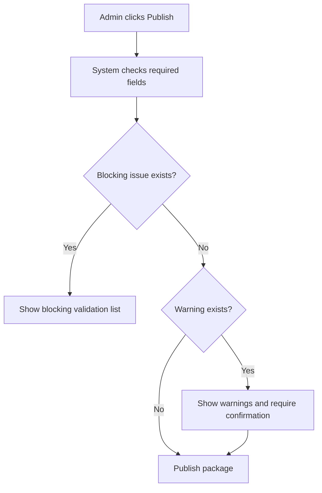

---

## 40. Research Notes and References

The following references were used to align package logic with travel/Umrah operational expectations:

1. Nusuk allows pilgrims/travelers to plan and book elements such as eVisa, flights, accommodation, and transportation. This supports the PRD decision to model package components such as flight, hotel, transport, and itinerary as separate but related package sections.
2. Nusuk Hajj package information presents package services as structured combinations of accommodation, transportation, guidance/service support, and related service components. This supports explicit package inclusions, exclusions, service status, and customer-facing terms.
3. Tourism Malaysia/MOTAC references were used as context that travel agencies and tour/travel operating businesses are regulated entities, supporting the PRD requirement to preserve Travel Agency ownership, approval, and audit trails when Admin edits TA-owned package content.
4. IATA references were used only for flight-related package fields, reinforcing that airline/flight/airport codes and flight details should come from catalog/master data rather than free-form package text wherever possible.

Reference links:

1. Nusuk official platform: https://www.nusuk.sa/
2. Nusuk Hajj official information: https://hajj.nusuk.sa/
3. Ministry of Tourism, Arts and Culture Malaysia: https://www.motac.gov.my/
4. Tourism Malaysia: https://www.malaysia.travel/
5. IATA code search: https://www.iata.org/en/publications/directories/code-search/
