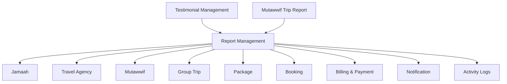
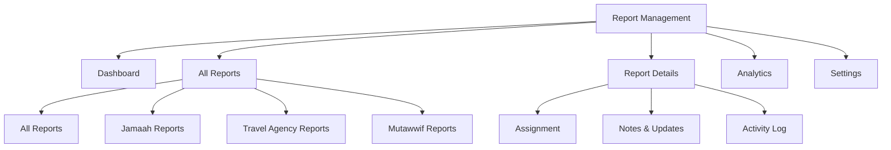
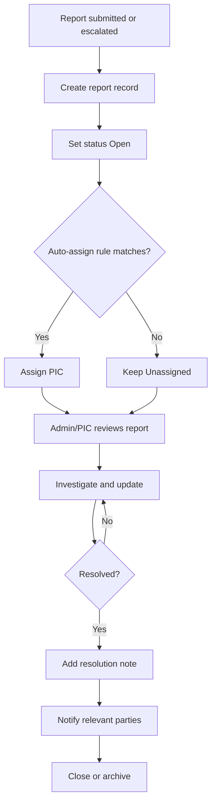
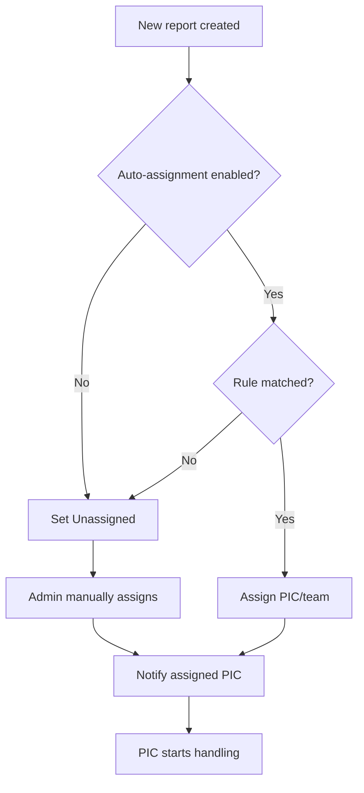
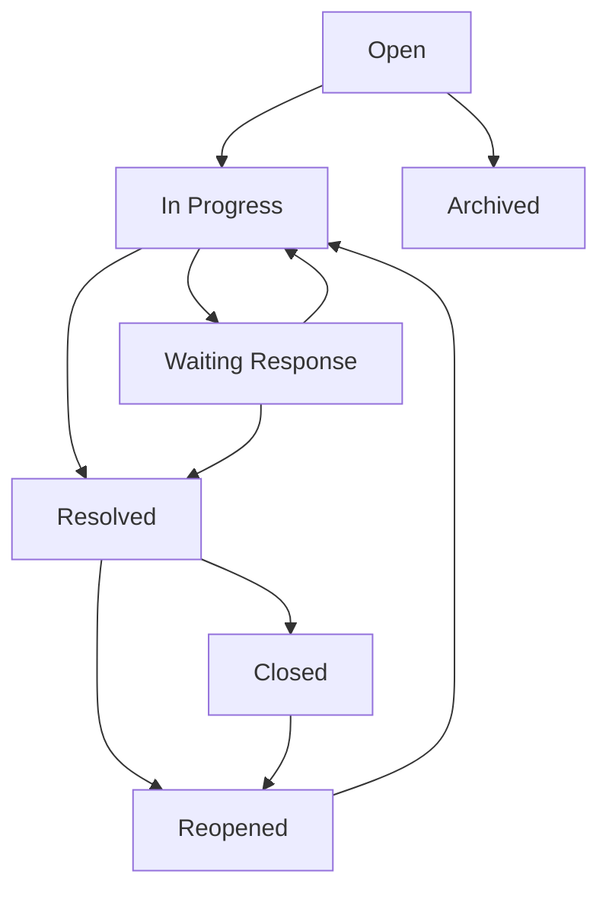

# Report Management - Module Product Requirements Document

Version: v1.0
Platform: Responsive Web Platform
Scope: Reports, Complaints, Issues, Assignments, and Escalations
Status: Draft
Prepared by: Product / UI/UX Team
Last updated: 2 June 2026

> Phase 1 focuses on responsive web. Native Android and iOS applications are out of scope.


---

# Module PRD - Report Management

Product: UmrahHaji.com Admin Panel
Module: Report Management
Scope: Admin Panel report, complaint, issue, and escalation workspace
Platform: Responsive Web Platform
Status: Draft
Last Updated: 4 June 2026

---

## 1. Objective

Report Management allows Admin and Support teams to monitor, triage, assign, resolve, and audit reports submitted by or about Jamaah, Travel Agencies, Mutawwif, and platform operations.

The module acts as the central case workspace for complaints, service issues, document issues, payment concerns, compliance concerns, operational incidents, and platform problems.

The goal is to cover many report cases without making the product too complex. Report Management should behave like a lightweight ticketing system with clear sender, reported party, category, priority, status, assignee, attachments, internal notes, and resolution tracking.

---

## 2. Scope

### In Scope

1. Reports dashboard summary.
2. All Reports list.
3. Role-based report tabs:
   - Jamaah Reports.
   - Travel Agency Reports.
   - Mutawwif Reports.
   - Platform / Admin Reports.
4. Report details modal/page.
5. Assign and reassign PIC.
6. Update status and priority.
7. Add internal notes and resolution notes.
8. Archive report.
9. Reopen report.
10. Attachment review and download.
11. Email and WhatsApp notification settings.
12. Basic analytics.
13. Auto-assignment settings.
14. Activity log and audit trail.
15. Responsive web behavior.

### Out of Scope for Phase 1

1. Full customer support chat.
2. SLA billing penalties.
3. AI report summary.
4. Public knowledge base.
5. External helpdesk integration.
6. Automated legal dispute workflow.
7. Advanced sentiment analysis.
8. Native Android or iOS app behavior.

---

## 3. Product Positioning

Report Management is the operational issue center.

It should not replace:

1. Testimonial Management, which handles feedback, ratings, reviews, and public display consent.
2. Mutawwif Trip Report, which is an internal operational report submitted by Mutawwif.
3. Billing & Payment Management, which owns invoices, payments, refunds, and commission records.
4. Travel Agency Management, Jamaah Management, and Mutawwif Management, which own profile data.

Report Management receives escalations from those modules when an issue needs follow-up, assignment, evidence, status tracking, or resolution history.

---

## 4. Report Concept

### Sender vs Reported Party

| Concept | Meaning |
| --- | --- |
| Sender | User or role submitting the report |
| Reported Party | User, role, agency, mutawwif, jamaah, or platform area being reported |
| Related Entity | Optional operational context such as package, group trip, booking, invoice, hotel, or flight |
| Assigned PIC | Internal Admin/Support/Operations/Finance/Compliance person handling the report |

### Supported Sender Roles

1. Jamaah.
2. Travel Agency Admin / Staff.
3. Mutawwif.
4. Platform Admin / Staff.

### Supported Reported Party Types

1. Jamaah.
2. Travel Agency.
3. Travel Agency Staff.
4. Mutawwif.
5. Platform / Admin Team.
6. Package.
7. Group Trip.
8. Hotel or flight reference, if issue is operational.

### Report Direction Examples

| Sender | Reported Party | Example |
| --- | --- | --- |
| Jamaah | Travel Agency | Package inclusion not delivered |
| Jamaah | Mutawwif | Guide late or unclear instruction |
| Travel Agency | Jamaah | Jamaah violates trip terms |
| Travel Agency | Platform | Package data display issue |
| Mutawwif | Travel Agency | Poor coordination or missing manifest |
| Mutawwif | Jamaah / Group | Repeated lateness or safety concern |
| Admin | Travel Agency | Compliance follow-up |
| Admin | Platform | Internal operational issue |

---

## 5. Relationship With Other Modules

```text
Report Management
├── Jamaah Management
├── Travel Agency Management
├── Mutawwif Management
├── Group Trip Management
├── Package Management
├── Booking Management
├── Billing & Payment Management
├── Testimonial Management
└── Notification / Announcement
```

### Relationship Diagram



### Integration Table

| Module | Relationship |
| --- | --- |
| Jamaah Management | Shows reports submitted by or about the Jamaah |
| Travel Agency Management | Shows reports submitted by or about the Travel Agency |
| Mutawwif Management | Shows reports submitted by or about the Mutawwif |
| Group Trip Management | Provides trip, member, document, service, and operational context |
| Package Management | Provides package context for package-related issues |
| Booking Management | Provides booking context in Phase 2 |
| Billing & Payment Management | Provides invoice/payment context for payment-related reports |
| Testimonial Management | Low rating with complaint or incident may be escalated to Report Management |
| User Management | Controls sender identity, assignee, role, and permission |
| Notification / Announcement | Sends report status updates and assignment notifications |

---

## 6. User Roles & Permissions

| Role | Access |
| --- | --- |
| Super Admin | Full access to all reports, settings, assignment, archive, and analytics |
| Admin | View, assign, update, resolve reports based on permission |
| Support Staff | Handle service, platform, document, and general reports |
| Operations Staff | Handle group trip, hotel, flight, mutawwif, and jamaah operational reports |
| Finance Admin | Handle payment, refund, commission, and invoice-related reports |
| Compliance Officer | Handle compliance, safety, legal, and policy reports |
| Travel Agency Admin | View and respond to reports involving own agency if enabled |
| Mutawwif | Submit and view own submitted reports if enabled |
| Jamaah | Submit and view own reports from customer-facing area if enabled |
| Auditor / View Only | Read-only access to selected reports and audit logs |

### Permission Rules

1. Sensitive reports require restricted access.
2. Payment reports require Finance or elevated permission.
3. Compliance and safety reports require Compliance or elevated permission.
4. Travel Agency users can only access reports involving their own agency.
5. Jamaah and Mutawwif can only access reports they submitted or are allowed to respond to.
6. Internal notes are never visible to Jamaah, Travel Agency, or Mutawwif unless explicitly marked external.
7. Archive, reopen, and delete-like actions require elevated permission.

---

## 7. Navigation & Entry Point

```text
Admin Panel
└── Reports
    ├── Dashboard
    ├── All Reports
    ├── Analytics
    └── Settings
```

### Related Entry Points

1. Travel Agency Details -> Quality & Logs -> Issue Reports.
2. Jamaah Details -> Reports.
3. Mutawwif Details -> Reports / Trip Reports.
4. Group Trip Details -> Trip Members / Documents / Services issue.
5. Billing & Payment -> Invoice or payment issue.
6. Testimonial Management -> Escalate low rating or complaint.
7. Notification -> New report assigned.

---

## 8. Information Architecture

```text
Report Management
├── Dashboard
│   ├── Summary Cards
│   ├── Reports by Status
│   ├── Reports by Priority
│   ├── Reports by Category
│   └── Top Performing PICs
├── All Reports
│   ├── All Reports Tab
│   ├── Jamaah Reports Tab
│   ├── Travel Agency Reports Tab
│   ├── Mutawwif Reports Tab
│   ├── Search & Filter
│   └── Report Table
├── Report Details
│   ├── Core Report Info
│   ├── Sender / Reported Party
│   ├── Related Context
│   ├── Attachments
│   ├── Assignment
│   ├── Notes & Updates
│   └── Activity Log
├── Analytics
└── Settings
```

### IA Diagram



---

## 9. Main User Flow

```text
Report is submitted or escalated
↓
System creates report record
↓
System assigns status Open and priority
↓
System auto-assigns PIC if rule matches, otherwise Unassigned
↓
Admin reviews report details and related context
↓
Admin assigns/reassigns PIC
↓
PIC investigates and updates status
↓
PIC resolves report with resolution note
↓
System sends status notification
↓
Report can be closed, reopened, or archived
```

### Main Flow Diagram



---

## 10. Report Dashboard

### Summary Cards

| Card | Description |
| --- | --- |
| Open | Reports waiting for first action |
| In Progress | Reports currently handled |
| Resolved | Reports resolved within selected period |
| Urgent | Reports with urgent priority |
| Unassigned | Reports without PIC |

### Dashboard Metrics

1. Total Reports.
2. Resolution Rate.
3. Average Response Time.
4. Average Resolution Time.
5. Satisfaction Score, if post-resolution feedback is enabled.
6. Reports by Status.
7. Reports by Priority.
8. Reports by Category.
9. Report Trends.
10. Top Performing PICs.

### Dashboard Rules

1. Dashboard data follows role and permission scope.
2. Finance users should see payment-related reports if permitted.
3. Travel Agency users should only see own-agency report analytics if exposed in TA Portal.
4. Satisfaction score is optional and should not block Phase 1.

---

## 11. All Reports List

### Page Purpose

All Reports allows Admin to view, search, filter, triage, assign, and update report cases across the platform.

### Tabs

| Tab | Purpose |
| --- | --- |
| All Reports | Shows all accessible reports |
| Jamaah Reports | Reports submitted by or about Jamaah |
| Travel Agency Reports | Reports submitted by or about Travel Agencies |
| Mutawwif Reports | Reports submitted by or about Mutawwif |

### Recommended Columns

| Column | Description |
| --- | --- |
| Report ID | Unique report number |
| Sender | Reporter name, email, and role |
| Reported | Reported party name and role/entity |
| Related Context | Optional group trip, package, booking, invoice, or service context |
| Subject & Message | Short subject and message preview |
| Attachments | Count and indicator |
| Category | Service, Compliance, Document, Payment, Platform, Safety, Other |
| Priority | Normal, Important, Urgent |
| Status | Open, In Progress, Waiting Response, Resolved, Closed |
| Assigned PIC | Admin/staff responsible |
| Created | Created date/time |
| Actions | View Details, Assign/Reassign, Edit, Mark Resolved, Close, Reopen, Archive |

### Search

Admin can search by:

1. Report ID.
2. Sender name, email, or phone.
3. Reported party name.
4. Travel Agency name.
5. Group trip name.
6. Package name.
7. Subject or message keyword.

### Filters

| Filter | Options |
| --- | --- |
| Status | Open, In Progress, Waiting Response, Resolved, Closed, Archived |
| Priority | Normal, Important, Urgent |
| Category | Service, Compliance, Document, Payment, Platform, Safety, Other |
| Sender Role | Jamaah, Travel Agency, Mutawwif, Admin |
| Reported Type | Jamaah, Travel Agency, Mutawwif, Platform, Package, Group Trip |
| Assigned PIC | Admin/staff list, Unassigned |
| Date | All Time, Today, This Week, This Month, Custom Range |
| Travel Agency | Active agency list |
| Group Trip | Group trip search |

### Row Actions

1. View Details.
2. Assign PIC.
3. Reassign PIC.
4. Edit Report.
5. Mark as Resolved.
6. Close Report.
7. Reopen.
8. Archive Report.

### Simplification Rule

Do not create too many list variants. Use the same table structure for all tabs, but allow a few context columns to change:

1. Jamaah tab emphasizes Jamaah and Travel Agency context.
2. Travel Agency tab emphasizes agency, package, payment, and compliance context.
3. Mutawwif tab emphasizes group trip, package, and reported party context.

---

## 12. Report Details

### Purpose

Report Details allows Admin to inspect report content, evidence, sender, reported party, related context, assignment, status notification, timestamps, and action history.

### Sections

1. Report summary.
2. Subject and message.
3. Attachments.
4. Sender information.
5. Reported party information.
6. Related Travel Agency.
7. Related group trip.
8. Related package.
9. Related invoice/payment, if applicable.
10. Assigned PIC.
11. Status notification.
12. Notes and resolution.
13. Activity log.

### Core Fields

| Field | Description |
| --- | --- |
| Report Number | Unique report ID |
| Status | Current status |
| Priority | Normal, Important, Urgent |
| Category | Report category |
| Subject | Report subject |
| Message / Description | Full report detail |
| Sender | User who submitted report |
| Reported Party | Target of report |
| Related Company | Rename to Related Travel Agency |
| Group Name | Related group trip if available |
| Package | Related package if available |
| Created At | Report creation timestamp |
| Last Updated | Last update timestamp |

### Detail Actions by Status

| Status | Available Actions |
| --- | --- |
| Open | Assign PIC, Edit Report, Archive |
| In Progress | Reassign PIC, Add Note, Mark Resolved, Archive |
| Waiting Response | Add Note, Send Reminder, Mark Resolved, Archive |
| Resolved | Close Report, Reopen, Archive |
| Closed | Reopen, Archive |
| Archived | View only unless restored by authorized admin |

---

## 13. Create Report / Escalate Report

### Creation Sources

| Source | Description |
| --- | --- |
| Manual Admin Entry | Admin creates report from Admin Panel |
| Jamaah Submission | Jamaah submits complaint/issue from customer-facing area |
| Travel Agency Submission | Travel Agency submits issue from TA Portal |
| Mutawwif Submission | Mutawwif submits issue or incident |
| Testimonial Escalation | Low rating or complaint escalated from Testimonial Management |
| Mutawwif Trip Report Escalation | Incident or follow-up escalated from Mutawwif Trip Report |
| System Generated | Future automation creates report from defined trigger |

### Create Report Fields

| Field | Type | Required | Validation | Notes |
| --- | --- | --- | --- | --- |
| Creation Source | Select/auto | Yes | Valid source | Auto when escalated |
| Sender Type | Select | Yes | Jamaah, Travel Agency, Mutawwif, Admin | Required |
| Sender | Search/select | Yes | Existing user/entity | Who submitted |
| Reported Party Type | Select | Yes | Jamaah, Travel Agency, Mutawwif, Platform, Package, Group Trip | Required |
| Reported Party | Search/select | Conditional | Required unless Platform | Target of report |
| Related Travel Agency | Select/auto | Recommended | Active agency | Context |
| Related Group Trip | Search/select | Optional | Active/historical trip | Context |
| Related Package | Search/select | Optional | Existing package | Context |
| Related Booking | Search/select | Optional | Existing booking | Phase 2 context |
| Related Invoice/Payment | Search/select | Optional | Existing invoice/payment | Payment context |
| Category | Select | Yes | Service, Compliance, Document, Payment, Platform, Safety, Other | Required |
| Priority | Select | Yes | Normal, Important, Urgent | Default Normal |
| Subject | Text input | Yes | Max 150 chars | Short issue summary |
| Message / Description | Textarea | Yes | Max 3,000 chars | Full detail |
| Visibility | Select | Yes | Internal Only, Sender Visible, Sender + Reported Visible | Default Internal Only for admin-created |
| Attachments | Multi-upload | Optional | Follow upload policy | Evidence |

### Create Rules

1. Sender and reported party can be different roles.
2. Sender and reported party can be the same only for self-reporting or support request.
3. Platform issue does not require reported user.
4. Payment category should recommend invoice/payment reference.
5. Group trip issue should recommend group trip reference.
6. Compliance and safety reports should default to Important or Urgent.
7. Internal Only reports should not notify external parties.

---

## 14. Assignment Flow

### Assignment Rules

1. New report may be unassigned.
2. Urgent report can be auto-assigned to Platform Admin or configured team.
3. Payment category can be assigned to Finance.
4. Compliance or safety category can be assigned to Compliance/Operations.
5. Travel Agency reports may be left unassigned for Admin triage if the issue belongs to agency handling.
6. Reassignment requires reason.

### Assignment Flow Diagram



### Assign / Reassign Fields

| Field | Type | Required | Validation | Notes |
| --- | --- | --- | --- | --- |
| Assigned PIC | Select | Yes | Active admin/staff | Role-filtered |
| Assigned Team | Select | Optional | Support, Operations, Finance, Compliance | Optional |
| Assignment Reason | Textarea | Conditional | Max 500 chars | Required for reassignment |
| Notify PIC | Toggle | Optional | Boolean | Default On |

---

## 15. Status Flow

### Status Definitions

| Status | Meaning |
| --- | --- |
| Open | Report submitted and waiting for action |
| In Progress | Assigned PIC is handling the report |
| Waiting Response | Waiting for sender, reported party, or internal team response |
| Resolved | PIC has provided resolution |
| Closed | Resolution accepted or case closed by Admin |
| Archived | Hidden from active operations but retained for audit |

### Status Flow Diagram



### Status Rules

1. Report starts as Open.
2. Report can move to In Progress when assigned or when PIC starts handling.
3. Waiting Response should identify who the system is waiting for.
4. Resolved requires resolution note.
5. Closed is final operational state but can be reopened with reason.
6. Archived reports remain searchable by authorized users.

---

## 16. Priority and Category Rules

### Priority

| Priority | Meaning | Suggested Response |
| --- | --- | --- |
| Normal | General inquiry, minor issue, non-urgent feedback | Handle during normal support queue |
| Important | Operational impact, repeated issue, document/payment concern | Prioritize within current working day |
| Urgent | Safety, compliance, imminent departure risk, payment blockage, serious complaint | Immediate escalation |

### Category

| Category | Example |
| --- | --- |
| Service | Hotel, transport, mutawwif, itinerary, or support service issue |
| Compliance | Policy violation, contract issue, regulation concern |
| Document | Passport, visa, vaccination, permit, missing file |
| Payment | Invoice, refund, commission, deposit, outstanding payment |
| Platform | App/web bug, incorrect package data, access issue |
| Safety | Medical, safety, lost item, emergency, risky behavior |
| Other | Issue that does not fit existing categories |

### Default Routing

| Category | Suggested Team |
| --- | --- |
| Service | Support / Operations |
| Compliance | Compliance Officer |
| Document | Operations |
| Payment | Finance |
| Platform | Platform Admin / Technical Support |
| Safety | Operations + Compliance |
| Other | Support |

---

## 17. Notes, Comments, and Resolution

### Notes Types

| Note Type | Visibility | Use Case |
| --- | --- | --- |
| Internal Note | Admin only | Investigation, internal coordination |
| Sender Update | Sender visible | Update to report submitter |
| Reported Party Update | Reported party visible | Ask for clarification or response |
| Resolution Note | Visible based on report visibility | Final explanation |

### Resolution Fields

| Field | Type | Required | Validation | Notes |
| --- | --- | --- | --- | --- |
| Resolution Type | Select | Yes | Resolved, No Action Needed, Duplicate, Invalid, Escalated | Required |
| Resolution Note | Textarea | Yes | Max 2,000 chars | Required |
| Follow-up Required | Toggle | Optional | Boolean | If additional task exists |
| Follow-up Owner | Select | Conditional | Active user/team | Required if follow-up |
| Notify Sender | Toggle | Optional | Boolean | Default based on visibility |
| Notify Reported Party | Toggle | Optional | Boolean | Default Off for sensitive cases |

---

## 18. Attachment Policy

Reports may include evidence attachments. Upload limits must avoid unnecessary server load.

### Supported Files

| File Type | Format | Max Size | Max Count | Notes |
| --- | --- | --- | --- | --- |
| Image | JPG, JPEG, PNG, WEBP | 3 MB per file | 5 files | Compress and generate thumbnail |
| PDF | PDF | 5 MB per file | 5 files | For document proof |
| Video | MP4, WEBM | 20 MB per file | 2 files | Optional; store in object storage |

### Upload Rules

1. Total attachments per report should not exceed 25 MB in Phase 1.
2. Store files in object storage or equivalent, not application server filesystem.
3. Generate thumbnails for images and videos.
4. Validate file extension and MIME type.
5. Scan files for malware if scanning service is available.
6. Video upload can be disabled in settings if storage cost becomes a concern.
7. External users should see only attachments they are allowed to access.

---

## 19. Notification Rules

### Events

| Event | Recipient | Channel |
| --- | --- | --- |
| New report submitted | Admin / Support queue | In-app, email optional |
| Report assigned | Assigned PIC | In-app, email |
| Status updated | Sender and permitted related party | Email / WhatsApp based on setting |
| Comment added | Relevant visible parties | Email / WhatsApp based on setting |
| SLA warning | Assigned PIC / Admin | In-app, email |
| Report resolved | Sender and permitted related party | Email / WhatsApp based on setting |
| Report reopened | Assigned PIC / Admin | In-app, email |

### Notification Rules

1. Internal Only reports do not notify external parties.
2. WhatsApp should only be sent to users with verified phone numbers.
3. Email should be default fallback.
4. Sensitive compliance/safety reports should notify internal roles only unless Admin chooses otherwise.
5. Notification message should not expose sensitive internal notes.

---

## 20. Auto-Assignment Settings

### Purpose

Auto-assignment reduces manual triage for common report cases while keeping Phase 1 logic simple.

### Configuration

| Setting | Description |
| --- | --- |
| Enable Auto Assignment | Master toggle |
| Urgent Reports | Auto-assign to configured Admin/team |
| Important Reports | Optional auto-assignment |
| Reports for Platform | Auto-assign to Platform Admin / Technical Support |
| Payment Reports | Auto-assign to Finance |
| Compliance Reports | Auto-assign to Compliance |
| Travel Agency Reports | Manual or assign to Support |
| Mutawwif Reports | Manual or assign to Operations |

### Rules

1. If multiple rules match, priority rule wins over category rule.
2. If PIC is inactive, report remains Unassigned.
3. System must log auto-assignment reason.
4. Auto-assignment is optional for Phase 1 and can be disabled.

---

## 21. Analytics

### Analytics Metrics

1. Total Reports.
2. Resolution Rate.
3. Average First Response Time.
4. Average Resolution Time.
5. Reports by Status.
6. Reports by Priority.
7. Reports by Category.
8. Reports by Sender Role.
9. Reports by Reported Party Type.
10. Reports by Travel Agency.
11. Top Reported Issues.
12. Top Performing PICs.

### Phase 1 Recommendation

Keep analytics simple. Required Phase 1 charts:

1. Reports by Status.
2. Reports by Priority.
3. Reports by Category.
4. Created vs Resolved trend.
5. PIC workload summary.

Advanced satisfaction and SLA analytics can be Phase 2.

---

## 22. Settings

### General Settings

| Setting | Default | Notes |
| --- | --- | --- |
| Enable Report Management | On | Controls module availability |
| Allow Jamaah Report Submission | On | Customer-facing depends on portal scope |
| Allow Travel Agency Report Submission | On | TA Portal |
| Allow Mutawwif Report Submission | On | Mutawwif portal/app if available |
| Allow Anonymous Report | Off | Not recommended for Phase 1 |
| Enable Video Attachment | Optional | Can be Off to control storage |
| Require Resolution Note | On | Recommended |
| Require Reopen Reason | On | Recommended |

### Notification Settings

1. Email enabled.
2. WhatsApp enabled if integration exists.
3. New report submitted.
4. Report assigned.
5. Status updated.
6. SLA warning.
7. Report resolved.
8. Comment added.

---

## 23. Data Model Reference

### Report

| Field | Notes |
| --- | --- |
| id | Unique identifier |
| report_number | Human-readable ID |
| creation_source | Manual, Jamaah, Travel Agency, Mutawwif, Testimonial, Trip Report, System |
| sender_type | Jamaah, Travel Agency, Mutawwif, Admin |
| sender_id | Sender record |
| reported_party_type | Jamaah, Travel Agency, Mutawwif, Platform, Package, Group Trip |
| reported_party_id | Nullable for platform reports |
| category | Service, Compliance, Document, Payment, Platform, Safety, Other |
| priority | Normal, Important, Urgent |
| status | Open, In Progress, Waiting Response, Resolved, Closed, Archived |
| subject | Short issue |
| description | Full issue |
| visibility | Internal Only, Sender Visible, Sender + Reported Visible |
| assigned_pic_id | Nullable |
| assigned_team | Optional |
| related_agency_id | Optional |
| related_group_trip_id | Optional |
| related_package_id | Optional |
| related_booking_id | Optional |
| related_invoice_id | Optional |
| created_at | Timestamp |
| updated_at | Timestamp |
| resolved_at | Timestamp |
| closed_at | Timestamp |

### Report Attachment

| Field | Notes |
| --- | --- |
| id | Unique identifier |
| report_id | Parent report |
| file_name | Original file name |
| file_type | Image, PDF, Video |
| file_size | Size in bytes |
| storage_url | Object storage URL |
| thumbnail_url | Optional |
| visibility | Internal Only or External Visible |
| uploaded_by | User |
| uploaded_at | Timestamp |

### Report Update

| Field | Notes |
| --- | --- |
| id | Unique identifier |
| report_id | Parent report |
| update_type | Status Change, Assignment, Note, Resolution, Reopen, Archive |
| note | Optional text |
| visibility | Internal, Sender Visible, Reported Party Visible |
| actor_id | User |
| created_at | Timestamp |

---

## 24. Empty States

### No Reports

```text
No reports have been submitted yet.
Reports from Jamaah, Travel Agency, Mutawwif, and Admin will appear here when available.
```

### No Unassigned Reports

```text
All reports are assigned.
Great. New unassigned reports will appear here for triage.
```

### No Reports After Filter

```text
No reports match the selected filters.
Try changing status, priority, category, sender, or date range.
```

---

## 25. Error States

| Scenario | System Response |
| --- | --- |
| Attachment too large | Reject upload and show size limit |
| Unsupported file type | Reject upload and show allowed formats |
| Missing resolution note | Block resolve action |
| Assign to inactive PIC | Block assignment |
| Unauthorized user opens report | Show access denied |
| External notification fails | Keep report update and show notification failure log |
| Duplicate report suspected | Show possible duplicate warning, allow continue |

---

## 26. Responsive Web Behavior

### Desktop Web

1. Use full table with horizontal scroll if needed.
2. Summary cards can display in a single row.
3. Report details can open as modal or detail page.
4. Analytics can use two-column chart layout.

### Tablet Web

1. Summary cards wrap into two columns.
2. Report table can scroll horizontally.
3. Detail modal should use full-height layout.

### Mobile Web

1. Report list should become stacked report cards.
2. Filters should collapse into filter drawer.
3. Report details should open as full-screen sheet.
4. Attachment previews should stack vertically.
5. Primary actions should remain reachable at bottom.

---

## 27. Security & Privacy

1. Reports may contain sensitive personal, financial, medical, or compliance information.
2. Role-based access is mandatory.
3. Internal notes must be hidden from external users.
4. Attachments must use private storage access.
5. Download actions should be logged.
6. Sensitive reports should be excluded from broad exports unless user has permission.
7. Medical/safety details should be limited to authorized operations/support roles.
8. Archive does not delete data.

---

## 28. Activity Log Requirements

System must log:

1. Report created.
2. Report viewed by Admin.
3. Report assigned.
4. Report reassigned.
5. Status changed.
6. Priority changed.
7. Category changed.
8. Attachment uploaded.
9. Attachment downloaded.
10. Internal note added.
11. External update sent.
12. Resolution added.
13. Report closed.
14. Report reopened.
15. Report archived.
16. Notification failed.

---

## 29. Acceptance Criteria

### Report List

1. Admin can view reports based on permission.
2. Admin can filter reports by status, priority, category, sender, assignee, and date.
3. Admin can search report by ID, user, agency, package, group trip, or subject.
4. Admin can switch between All, Jamaah, Travel Agency, and Mutawwif report tabs.

### Report Details

1. Admin can open report details.
2. Admin can see sender, reported party, category, priority, status, related context, and attachments.
3. Admin can assign or reassign PIC.
4. Admin can update status.
5. Admin cannot resolve report without resolution note.

### Attachments

1. System validates file size and type.
2. System rejects unsupported uploads.
3. System stores attachments securely.
4. Authorized users can view/download allowed attachments.

### Status & Assignment

1. New report starts as Open.
2. Report can be moved to In Progress.
3. Report can be marked Resolved with resolution note.
4. Resolved or Closed report can be reopened with reason.
5. Archived reports are removed from active list but retained for audit.

### Integration

1. Reports can link to Jamaah, Travel Agency, Mutawwif, Group Trip, Package, Booking, or Billing records when available.
2. Testimonial escalation can create a report.
3. Mutawwif incident report can create a report.
4. Related module detail pages can show linked reports.

---

## 30. Open Questions

1. Should Jamaah be allowed to report another Jamaah directly, or only report through Travel Agency/Admin?
2. Should Travel Agency be allowed to close reports involving their own agency, or only respond?
3. Should Mutawwif be able to view reports submitted about them?
4. Should urgent safety reports trigger WhatsApp immediately in Phase 1?
5. Should report satisfaction score be included in Phase 1 or Phase 2?

---

## 31. Future Enhancements

1. SLA policy per category and priority.
2. AI report summary.
3. Duplicate report detection.
4. Public support portal.
5. Knowledge base article suggestion.
6. Advanced dispute workflow.
7. External helpdesk integration.
8. Automated escalation to Travel Agency PIC.
9. Report satisfaction survey.
10. Bulk assignment.

