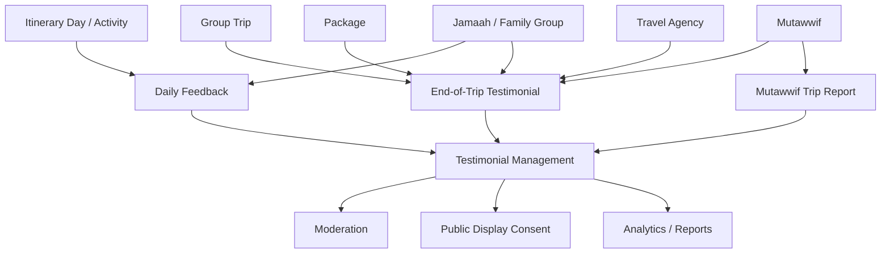
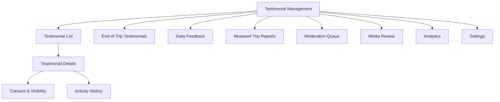
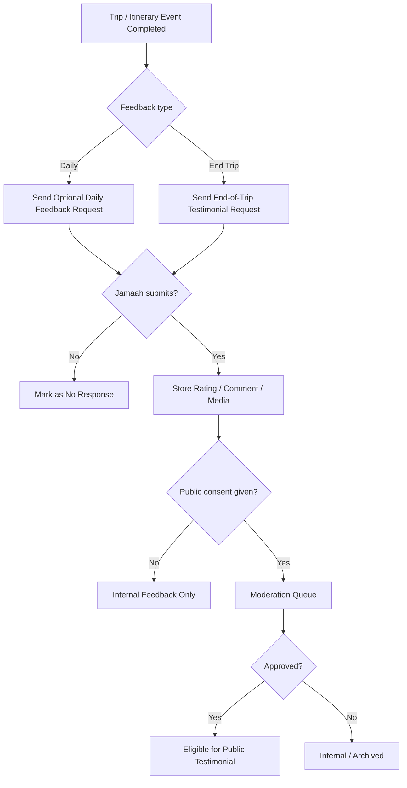
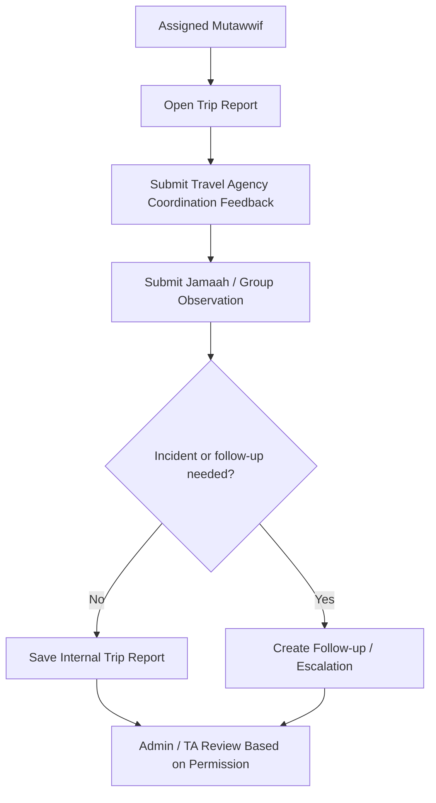
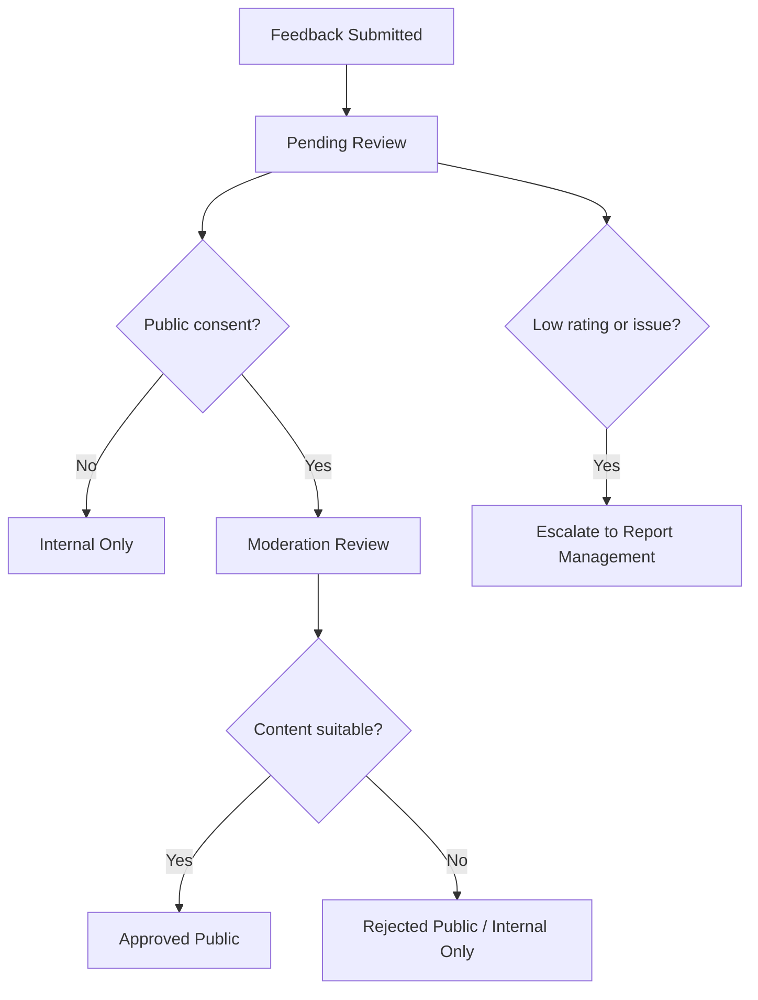

# Testimonial Management - Module Product Requirements Document

Version: v1.0
Platform: Responsive Web Platform
Scope: Daily Feedback, End-of-Trip Testimonials, Moderation, and Review Analytics
Status: Draft
Prepared by: Product / UI/UX Team
Last updated: 2 June 2026

> Phase 1 focuses on responsive web. Native Android and iOS applications are out of scope.


---

# Module PRD - Testimonial Management

Product: UmrahHaji.com Admin Panel
Module: Testimonial Management
Scope: Admin Panel, Travel Agency Portal, and Jamaah feedback collection
Platform: Responsive Web Platform
Status: Draft
Last Updated: 4 June 2026

---

## 1. Objective

Testimonial Management allows Admin to monitor, review, moderate, export, and analyze feedback/testimonials submitted by Jamaah after daily itinerary activities and at the end of a trip. The module also supports internal trip reports and observations submitted by Mutawwif after or during a trip.

The module supports two feedback layers:

1. Daily feedback, collected from itinerary day/activity experience.
2. End-of-trip testimonial, collected after the trip is completed.
3. Mutawwif trip report and observation, collected from assigned Mutawwif for internal operational review.

Daily feedback is mainly for operational improvement. End-of-trip testimonial is mainly for overall package, Travel Agency, Mutawwif, and customer experience evaluation.

Mutawwif trip report is internal feedback. It should not be treated as public testimonial because it may include operational issues, Jamaah behavior, health concerns, incident notes, or Travel Agency coordination feedback.

---

## 2. Research-Based Recommendation

### Mandatory vs Optional

| Item | Recommendation | Reason |
| --- | --- | --- |
| System creates feedback request | Mandatory | Every completed itinerary day/trip should have a feedback opportunity for tracking consistency |
| Jamaah submits daily feedback | Optional | Daily feedback can create survey fatigue if forced too often |
| Jamaah submits end-of-trip feedback | Strongly prompted, optional | End-of-trip feedback is more complete but still should be voluntary |
| Rating field when user opens feedback form | Recommended required | If user chooses to submit, rating is the minimum useful signal |
| Written comment | Optional | Reduces friction and supports quick feedback |
| Media upload | Optional | Useful for testimonial proof/story, but not required |
| Public testimonial consent | Mandatory if displayed publicly | Needed before using the feedback for marketing/customer-facing display |
| Anonymous submission | Optional by setting | Useful for honest feedback, but must still be traceable internally for abuse control |
| Tip / gratuity | Optional and separated from review | Must not be tied to positive feedback or public review |
| Mutawwif trip report | Recommended after trip, mandatory if incident exists | Internal operational record from assigned guide |
| Mutawwif feedback to Travel Agency | Optional / recommended | Useful to improve coordination and agency readiness |
| Mutawwif observation for Jamaah/group | Optional, mandatory for incidents | Should be internal and privacy-controlled |

### Product Decision

Daily feedback should be optional and lightweight. End-of-trip feedback should be strongly prompted after trip completion, but not forced as a blocker to account access, booking completion, or document access.

Public testimonial display requires explicit consent. Admin may use feedback internally without public display as long as privacy rules and permissions are followed.

End-of-trip Jamaah feedback should be separated into Overall Trip, Travel Agency, and Mutawwif sections. This keeps the form simple while making the data actionable. A single general comment can still be provided at the end to reduce form fatigue.

---

## 3. Scope

### In Scope

1. Testimonial List across Travel Agencies.
2. End-of-trip testimonial view.
3. Daily itinerary feedback view.
4. Package-level rating summary.
5. Group Trip-level rating summary.
6. Travel Agency rating and feedback.
7. Mutawwif rating and feedback.
8. Itinerary day/activity feedback.
9. Jamaah/family/group feedback grouping.
10. Anonymous feedback handling.
11. Media attachment viewing and download.
12. Recommendation signal: Yes/No.
13. Moderation and archive flow.
14. Public display consent tracking.
15. Export to PDF.
16. Search and filters.
17. Feedback analytics summary.
18. Activity logs.
19. Mutawwif trip report.
20. Mutawwif feedback to Travel Agency.
21. Mutawwif Jamaah/group observation.
22. Incident notes from Mutawwif.

### Out of Scope for Phase 1

1. AI sentiment analysis.
2. AI auto-summary.
3. Auto-publishing testimonials to public website.
4. External Google review sync.
5. Incentivized review campaigns.
6. Automated compensation for reviews.

### Phase 2 Enhancements

1. Sentiment analysis.
2. Keyword/theme analysis.
3. AI summary per package/trip.
4. Public testimonial showcase workflow.
5. Travel Agency response workflow.
6. Mutawwif performance dashboard.
7. Advanced review analytics.
8. Complaint escalation from low rating.

---

## 4. Product Positioning

### Testimonial vs Feedback vs Report

| Area | Feedback | Testimonial | Report / Issue |
| --- | --- | --- | --- |
| Purpose | Operational improvement | Customer experience story / rating | Problem escalation |
| Timing | Daily or end-of-trip | Usually end-of-trip | Any time |
| Visibility | Internal by default | Internal or public with consent | Internal/support |
| Content | Rating, comment, quick signal | Rating, comment, recommendation, media | Issue type, severity, evidence |
| Owner Module | Testimonial Management | Testimonial Management | Report Management |

### Key Principle

Do not treat every feedback as a public testimonial. Feedback should become a public testimonial only when the Jamaah gives explicit consent and the content passes moderation.

Mutawwif submissions should be treated as internal operational reports. They can affect service quality tracking, Travel Agency coordination review, Jamaah assistance notes, and incident follow-up, but they should not be shown publicly.

---

## 5. Relationship With Other Modules

```text
Itinerary
↓
Daily Feedback

Group Trip Completed
↓
End-of-Trip Testimonial
├── Overall Trip Rating
├── Travel Agency Rating
├── Mutawwif Rating
├── Package / Trip Rating
├── Recommendation Signal
├── Media Attachments
└── Public Display Consent

Mutawwif Trip Report
├── Travel Agency Coordination Feedback
├── Jamaah / Group Observation
├── Incident Notes
└── Follow-up Recommendation
```

### Relationship Diagram



### Integration Table

| Module | Relationship |
| --- | --- |
| Itinerary Management | Daily feedback request can be configured per itinerary day/activity |
| Group Trip Management | End-of-trip testimonial is triggered by trip completion |
| Package Management | Package rating summary is calculated from related trip testimonials |
| Travel Agency Management | Travel Agency rating and testimonial summary are shown in agency details |
| Mutawwif Management | Mutawwif rating from Jamaah and Mutawwif-submitted trip reports are shown based on permission |
| Jamaah Management | Feedback submitter references Jamaah profile or family/group |
| Announcement / Notification | Feedback request reminders can be sent after day/trip completion |
| Reports | Aggregated testimonial analytics feed reports |
| Billing & Payment Management | Tip/gratuity, if enabled, is payment-related and must not be tied to review score |

---

## 6. User Roles & Permissions

| Role | Access |
| --- | --- |
| Super Admin | Full access to all testimonials and moderation |
| Admin / Operations | View, filter, archive, export, and moderate based on permission |
| Travel Agency Admin | View own agency testimonials and daily feedback in Travel Agency Portal |
| Travel Agency Staff | Limited view based on role |
| Mutawwif | View own feedback summary if enabled |
| Support Staff | View feedback and escalate issues |
| Auditor | Read-only testimonial and activity log access |

### Permission Rules

1. Admin can view testimonials across Travel Agencies only with global permission.
2. Travel Agency can only view testimonials related to its own trips.
3. Mutawwif can only view feedback related to assigned trips if permission is enabled.
4. Anonymous feedback hides public identity, but internal audit retains submitter reference.
5. Public display approval requires moderation permission.
6. Download media requires media access permission.
7. Archive/delete requires elevated permission.

---

## 7. Navigation & Entry Point

```text
Admin Panel
└── Testimonial
    ├── Testimonial List
    ├── End-of-Trip Testimonials
    ├── Daily Feedback
    ├── Mutawwif Trip Reports
    ├── Moderation Queue
    ├── Media Review
    ├── Analytics
    └── Settings
```

### Module IA Diagram



---

## 8. Main User Flow

### Daily Feedback Flow

```text
Group Trip itinerary day is completed
↓
System checks daily feedback setting from itinerary snapshot
↓
System sends optional daily feedback request
↓
Jamaah may submit rating, short feedback, tip, and optional media
↓
System stores response as daily feedback
↓
Admin/Travel Agency reviews operational feedback
```

### End-of-Trip Testimonial Flow

```text
Group Trip is completed
↓
System sends end-of-trip feedback request to participants
↓
Jamaah may submit overall trip, Travel Agency, and Mutawwif rating
↓
Jamaah may add section-specific comments, general testimonial, recommendation signal, and media
↓
Jamaah chooses public display consent
↓
System stores testimonial for moderation
↓
Admin reviews, archives, or approves for internal/public visibility
```

### Mutawwif Trip Report Flow

```text
Group Trip is departed or completed
↓
System allows assigned Mutawwif to submit trip report
↓
Mutawwif reviews Travel Agency coordination, Jamaah/group behavior, assistance needs, and incidents
↓
Mutawwif submits internal report
↓
System stores report as internal operational feedback
↓
Admin / Travel Agency reviews report based on permission
↓
Incident or low-readiness notes can be escalated to Report Management
```

### Collection Flow Diagram



### Mutawwif Report Flow Diagram



---

## 9. Testimonial List Requirements

### Page Purpose

Testimonial List gives Admin an overview of testimonial and feedback data grouped by package, Travel Agency, group trip, and feedback type.

### Top-Level Filters

| Filter | Options |
| --- | --- |
| Rating | All, 5, 4, 3, 2, 1 |
| Status | All, Pending Review, Approved, Internal Only, Archived, Rejected |
| Travel Agency | Active agency list |
| Departure Date | All Time, Today, This Week, This Month, Custom Range |
| Feedback Type | End Trip, Daily |
| Public Consent | All, Consent Given, Internal Only |
| Recommendation | All, Yes, No |

### Search

Search by:

1. Package name.
2. Group trip name.
3. Jamaah name.
4. Family/group name.
5. Travel Agency.
6. Mutawwif.

### Recommended Grouping

```text
Package
└── Group Trip
    ├── End Trip tab
    └── Daily tab
        └── Day / Activity
            └── Jamaah / Family responses
```

### Recommended Columns - End Trip

| Column | Description |
| --- | --- |
| Jamaah / Family | Submitter name, relationship, email, phone, anonymous badge |
| Travel Agency | Rating and written feedback |
| Mutawwif | Rating and written feedback |
| Overall Trip | Overall rating and optional general testimonial |
| Media | Count of uploaded media |
| To Recommend | Yes/No recommendation signal |
| Consent | Public display consent status |
| Date | Submitted date/time |
| Actions | Details, approve, archive |

### Recommended Columns - Daily

| Column | Description |
| --- | --- |
| Jamaah / Family | Submitter details |
| Rating & Feedback | Daily rating and comment |
| Tip | Optional tip/gratuity summary if enabled |
| Media | Uploaded media count |
| Date | Submitted date/time |
| Actions | Details, archive |

---

## 10. End-of-Trip Testimonial Form

### Purpose

End-of-trip testimonial collects overall experience after the group trip is completed.

The form should separate feedback targets while keeping the user experience lightweight. The recommended structure is:

```text
Overall Trip Experience
Travel Agency Experience
Mutawwif Experience
Optional General Testimonial
Consent & Media
```

### Recommended Fields

| Field | Type | Required | Validation | Notes |
| --- | --- | ---: | --- | --- |
| Group Trip | System reference | Yes | Completed trip | Auto-filled |
| Package | System reference | Yes | Related package | Auto-filled |
| Overall Trip Rating | Rating 1-5 | Yes if form submitted | 1 to 5 | Main trip/package rating |
| Overall Trip Feedback | Textarea | Optional | Max 1,000 chars | General trip feedback |
| Travel Agency Rating | Rating 1-5 | Yes if form submitted | 1 to 5 | Core rating |
| Travel Agency Feedback | Textarea | Optional | Max 1,000 chars | Written testimonial |
| Mutawwif Rating | Rating 1-5 | Yes if mutawwif assigned and form submitted | 1 to 5 | Service/guide rating |
| Mutawwif Feedback | Textarea | Optional | Max 1,000 chars | Service feedback |
| Recommend This Trip/Agency | Select | Optional | Yes, No, Not Sure | Useful summary signal |
| General Testimonial | Textarea | Optional | Max 1,000 chars | Public-facing story if consent is given |
| Submit Anonymously | Checkbox | Optional | Boolean | Internal identity still logged |
| Public Display Consent | Checkbox | Conditional | Required for public display | Not required for internal feedback |
| Media Upload | File upload | Optional | See upload policy | Photos/videos |

### End-of-Trip Feedback Rules

1. Overall Trip Rating should be the primary package/group trip rating.
2. Travel Agency Rating should measure admin support, package accuracy, communication, logistics, hotel/flight coordination, and customer service.
3. Mutawwif Rating should measure guidance, communication, punctuality, empathy, knowledge, and support during ibadah/trip.
4. Section comments are optional to reduce friction.
5. General Testimonial is optional and should be used for public display only with consent.
6. If there is no assigned Mutawwif, the Mutawwif section should be hidden.
7. If multiple Mutawwif are assigned, user may rate primary Mutawwif and optionally add feedback for additional Mutawwif.

### Public Consent Copy Requirement

Consent copy should clearly state:

1. Feedback may be used for internal service improvement.
2. Public display is optional.
3. If public display is selected, name/avatar/media may be shown based on selected visibility.
4. User can choose anonymous public display if supported.

---

## 11. Daily Feedback Form

### Purpose

Daily feedback captures low-friction responses for itinerary day/activity experience.

### Recommended Fields

| Field | Type | Required | Validation | Notes |
| --- | --- | ---: | --- | --- |
| Group Trip | System reference | Yes | Active/completed day | Auto-filled |
| Itinerary Day | System reference | Yes | Day/activity snapshot | Auto-filled |
| Activity | System reference | Optional | Existing activity | Optional if feedback is per day |
| Daily Rating | Rating 1-5 | Yes if form submitted | 1 to 5 | Minimum useful signal |
| Daily Feedback | Textarea | Optional | Max 500 chars | Keep lightweight |
| Tip Amount | Currency | Optional | >= 0 | Payment handled separately |
| Tip Payment Method | Select | Conditional | Bank Transfer, Cash, E-wallet, Card | If tip enabled |
| Submit Anonymously | Checkbox | Optional | Boolean | Depends on settings |
| Media Upload | File upload | Optional | See upload policy | Optional |

### Daily Feedback Rules

1. Daily feedback must not block the next itinerary day.
2. Form should be short, ideally rating plus optional comment.
3. Daily feedback should not require public display consent by default because it is operational feedback.
4. If daily feedback is later used publicly, explicit consent is required.
5. Tip/gratuity must not be conditional on rating or recommendation.

---

## 12. Mutawwif Trip Report Form

### Purpose

Mutawwif Trip Report collects internal operational feedback from assigned Mutawwif. It helps Admin and Travel Agency understand trip execution quality, Jamaah needs, Travel Agency coordination, and incidents from the guide's perspective.

This report is not a public testimonial and should not be shown to Jamaah by default.

### Report Timing

| Timing | Recommendation | Notes |
| --- | --- | --- |
| During trip | Optional | Useful for daily operational notes or incidents |
| End of trip | Recommended | Main trip report after completion |
| Incident occurred | Mandatory | Required if safety, medical, conflict, document, or serious operational issue occurred |

### Recommended Fields

| Field | Type | Required | Validation | Notes |
| --- | --- | ---: | --- | --- |
| Group Trip | System reference | Yes | Assigned trip | Auto-filled |
| Mutawwif | System reference | Yes | Assigned mutawwif | Auto-filled |
| Report Type | Select | Yes | Daily Note, End Trip Report, Incident Report | Required |
| Report Date | Date/time | Yes | Valid date | Auto-filled |
| Travel Agency Coordination Rating | Rating 1-5 | Optional | 1 to 5 | Internal |
| Travel Agency Coordination Notes | Textarea | Optional | Max 1,000 chars | Communication, readiness, PIC support |
| Jamaah / Group Readiness Rating | Rating 1-5 | Optional | 1 to 5 | Internal |
| Jamaah / Group Observation | Textarea | Optional | Max 1,500 chars | Behavior, discipline, assistance needs |
| Special Assistance Needed | Multi-select | Optional | Elderly, wheelchair, medical, language, family, child, other | Internal |
| Incident Occurred | Toggle | Yes | Boolean | Required |
| Incident Category | Select | Conditional | Medical, Safety, Lost Item, Document, Conflict, Schedule, Other | Required if incident occurred |
| Incident Notes | Textarea | Conditional | Max 2,000 chars | Required if incident occurred |
| Follow-up Required | Toggle | Yes | Boolean | Required |
| Follow-up Recommendation | Textarea | Conditional | Max 1,000 chars | Required if follow-up needed |
| Visibility | Select | Yes | Admin Only, Admin + Travel Agency, Admin + Support | Default Admin Only |
| Attachment | File upload | Optional | PDF/JPG/PNG/WEBP max 5 MB/file | Incident evidence if needed |

### Mutawwif Report Rules

1. Mutawwif can submit report only for assigned trip.
2. Incident report should be mandatory when incident occurred.
3. Jamaah/group observation must be treated as sensitive internal data.
4. Medical or safety notes should be visible only to authorized roles.
5. Travel Agency can view coordination feedback only if visibility allows.
6. Mutawwif report should not affect public rating automatically.
7. Admin can convert severe report into issue/report case.
8. Mutawwif can edit report within configured edit window unless it has been reviewed or escalated.

---

## 13. Testimonial Details

### Details Modal / Page Sections

| Section | Purpose |
| --- | --- |
| Trip & Package Summary | Package, Travel Agency, group trip, schedule |
| Submitter Summary | Jamaah/family, anonymous flag, contact metadata |
| Feedback Direction | Jamaah to platform/TA/mutawwif, or Mutawwif to TA/Jamaah/group |
| Travel Agency Feedback | Rating and comment |
| Mutawwif Feedback | Rating and comment |
| Mutawwif Trip Report | Internal report, observations, incidents, and follow-up |
| Daily Feedback Context | Itinerary day/activity for daily entries |
| Media | Uploaded photos/videos and download actions |
| Consent & Visibility | Public display, anonymous display, internal-only |
| Moderation | Status, reason, reviewer |
| Activity Log | History of actions |

### Actions

1. Approve for internal use.
2. Approve for public display if consent exists.
3. Mark internal only.
4. Archive.
5. Reject public display.
6. Download media.
7. Export testimonial.
8. Escalate to report/support issue.

---

## 14. Moderation and Visibility

### Moderation Status

| Status | Meaning |
| --- | --- |
| Pending Review | New feedback awaiting review |
| Approved Internal | Approved for internal analytics only |
| Approved Public | Approved for public display with consent |
| Internal Only | No public consent or sensitive content |
| Rejected Public | Not suitable for public display |
| Archived | Hidden from active list but retained for audit |
| Escalated | Converted or linked to report/support issue |

### Visibility Rules

1. Internal feedback can be used for analytics based on permission.
2. Public testimonial requires explicit consent.
3. Anonymous public display must hide name, email, phone, and identifiable profile details.
4. Media with identifiable people should require public media consent before display.
5. Sensitive medical, passport, payment, or private family information must not be displayed publicly.
6. Admin should be able to archive but not hard-delete by default.

### Moderation Flow Diagram



---

## 15. Rating Calculation

### Aggregation Levels

| Level | Source |
| --- | --- |
| Package rating | End-of-trip overall ratings from completed trips |
| Group Trip rating | End-of-trip ratings from trip participants |
| Travel Agency rating | Travel Agency rating from end-of-trip testimonials |
| Mutawwif rating | Mutawwif rating from assigned trip testimonials |
| Itinerary day rating | Daily feedback per day/activity |
| Travel Agency coordination score | Mutawwif internal report, not public rating |
| Jamaah/group readiness score | Mutawwif internal report, not public rating |

### Calculation Rules

1. Only submitted feedback contributes to average rating.
2. No-response should not count as zero.
3. Archived fraudulent/spam feedback should be excluded from public average.
4. Internal-only feedback may be included in internal analytics but excluded from public testimonial display.
5. Anonymous feedback may contribute to averages unless rejected.
6. Daily feedback should not directly replace end-of-trip rating.
7. Mutawwif trip report should not affect public Travel Agency or Jamaah rating automatically.

---

## 16. Media Upload Policy

| Upload Type | Allowed Format | Max Size | Max Count | Optimization Rule |
| --- | --- | ---: | ---: | --- |
| Testimonial image | JPG, JPEG, PNG, WEBP | 5 MB/file | 5 per response | Compress, generate thumbnail, lazy-load original |
| Testimonial video | MP4, MOV, WEBM | 25 MB/file | 1 per response | Store in object storage, generate preview thumbnail |
| Mutawwif report attachment | PDF, JPG, JPEG, PNG, WEBP | 5 MB/file | 5 per report | Store privately with restricted access |
| Export PDF | PDF | System generated | 1 per export | Generated on demand |

### Media Rules

1. Uploaded media must be stored in object storage or equivalent, not application server filesystem.
2. List pages must load thumbnails only.
3. Original media loads only in detail view with permission.
4. Public media display requires public media consent.
5. System should validate MIME type and extension.
6. System should scan files for malware if scanning service is available.

---

## 17. Settings

### Feedback Collection Settings

| Setting | Recommended Default | Notes |
| --- | --- | --- |
| Enable Daily Feedback | On if itinerary feedback is needed | Optional for Jamaah |
| Enable End-of-Trip Feedback | On | Strongly prompted, optional response |
| Daily Feedback Frequency | Per day | Can be changed to selected days only |
| Daily Feedback Prompt | Short default prompt | Max 300 chars |
| End Trip Feedback Prompt | Default prompt | Max 500 chars |
| Anonymous Submission | Enabled | Internal identity retained |
| Public Consent Option | Enabled | Required for public display |
| Media Upload | Enabled with limits | Optional |
| Low Rating Escalation | Enabled for rating <= 2 | Creates support/report queue |
| Reminder Schedule | 1 day and 3 days after trip | Avoid too many reminders |
| Enable Mutawwif Trip Report | On | Recommended |
| Require Mutawwif Report After Trip | Optional | Recommended for operational quality |
| Require Incident Report | On | Mandatory when incident is marked |
| Mutawwif Report Visibility | Admin Only | Can allow Admin + TA |

### Reminder Rules

1. Maximum one daily feedback reminder per day.
2. Maximum two end-of-trip reminders.
3. Stop reminders after submission.
4. Do not send reminder if user opted out.
5. Do not offer incentives for positive reviews.

---

## 18. Export Requirements

### Export to PDF

Admin can export:

1. Package testimonial summary.
2. Group Trip testimonial summary.
3. Daily feedback per itinerary day.
4. End-of-trip feedback list.
5. Mutawwif feedback summary.
6. Travel Agency feedback summary.
7. Mutawwif trip report summary.
8. Incident and follow-up summary.

### Export Rules

1. Export must respect permission and privacy rules.
2. Anonymous entries should remain anonymous in export unless internal audit export permission is granted.
3. Personal contact details should be hidden by default in public/shareable exports.
4. Media export should use links or thumbnails to avoid huge PDF size.

---

## 19. Notification Rules

| Event | Recipient | Channel | Notes |
| --- | --- | --- | --- |
| Daily itinerary day completed | Jamaah | In-app / email / WhatsApp if enabled | Optional feedback request |
| Trip completed | Jamaah | In-app / email / WhatsApp if enabled | End-of-trip request |
| Low rating submitted | Admin / Travel Agency support | In-app | Escalation |
| Mutawwif trip report submitted | Admin / Operations | In-app | Internal |
| Mutawwif incident report submitted | Admin / Support / Travel Agency if visible | In-app / email | Priority alert |
| Public testimonial approved | Travel Agency / Admin | In-app | Optional |
| Feedback archived | Auditor / Admin | In-app | Audit visibility |

---

## 20. Activity Log Requirements

System must log:

1. Feedback request created.
2. Feedback request sent.
3. Feedback submitted.
4. Feedback edited by submitter if allowed.
5. Moderation status changed.
6. Public consent changed.
7. Media downloaded.
8. Feedback archived.
9. Feedback escalated to report/support issue.
10. Export generated.
11. Mutawwif trip report submitted.
12. Mutawwif incident report escalated.

Each log should include timestamp, actor, role, entity type, entity ID, old value, new value, and reason where applicable.

---

## 21. Privacy, Compliance, and Anti-Manipulation Rules

1. Testimonials must reflect genuine trip experience.
2. Do not offer payment, discounts, free services, or benefits in exchange for positive reviews.
3. Do not suppress negative feedback from internal analytics.
4. Public display must require consent.
5. Public testimonial content should not expose private identity, passport, medical, payment, or contact details.
6. Admin must be able to mark suspicious/fake feedback for review.
7. If Travel Agency responds to feedback in Phase 2, response must be moderated.
8. User should be able to request removal of public testimonial display where policy allows.
9. Mutawwif trip reports are internal records and should not be displayed publicly.
10. Mutawwif observations about Jamaah must be protected as sensitive operational data.

---

## 22. Edge Cases

| Case | Expected Behavior |
| --- | --- |
| Jamaah does not submit feedback | Mark as No Response; do not penalize |
| Jamaah submits daily feedback but no end-trip feedback | Daily remains operational feedback only |
| End-trip testimonial has no public consent | Keep internal only |
| Anonymous feedback submitted | Hide identity in standard views; retain internal reference for audit |
| Low rating with complaint | Escalate to Report Management |
| Media contains private documents | Reject public display and mark internal/sensitive |
| Group trip cancelled | Do not send normal end-trip testimonial; optional cancellation feedback can be separate |
| Mutawwif changed mid-trip | Attribute feedback to assigned mutawwif snapshot by day/trip |
| Mutawwif submits incident report | Create support/report escalation and restrict sensitive fields |
| Mutawwif gives low TA coordination score | Show internally and optionally to TA based on visibility |
| Mutawwif observation mentions medical issue | Restrict to authorized roles only |
| Package changed after trip | Rating remains tied to package/trip snapshot |
| Duplicate feedback from same Jamaah | Allow one response per feedback type/day/trip unless update window is enabled |

---

## 23. Responsive Web Behavior

### Desktop

1. Use expandable grouped table by package and group trip.
2. End Trip and Daily tabs can be shown side by side under the selected package/trip.
3. Details modal can be wide with media preview.

### Tablet

1. Filters wrap into multiple rows.
2. Grouped table remains expandable.
3. Details modal can become full-screen.

### Mobile

1. Testimonial list should become stacked cards.
2. Filters should use drawer.
3. Daily feedback grouped by day should use accordion.
4. Media preview should use carousel.

---

## 24. Acceptance Criteria

1. Admin can view testimonial list across Travel Agencies based on permission.
2. Admin can switch between End Trip and Daily feedback views.
3. Daily feedback is connected to itinerary day/activity snapshot.
4. End-of-trip testimonial is connected to completed group trip, package, Travel Agency, Mutawwif, and Jamaah.
5. Jamaah feedback submission remains optional.
6. Rating is required only if the user chooses to submit the form.
7. Public display requires explicit consent.
8. Anonymous feedback hides identity in standard views.
9. Admin can moderate, approve, archive, or escalate feedback.
10. Low rating can trigger support/report escalation.
11. Media upload follows max size and optimization policy.
12. Export to PDF respects privacy and permission rules.
13. Aggregated ratings update package, Travel Agency, Mutawwif, and trip summaries.
14. Critical actions are logged.
15. Assigned Mutawwif can submit internal trip report based on permission.
16. Mutawwif incident report can be escalated to Report Management.
17. Mutawwif observations are protected by visibility and privacy rules.
