# Travel Agency Management - Module Product Requirements Document

Version: v1.0
Platform: Responsive Web Platform
Scope: Travel Agency Management
Status: Draft
Prepared by: Product / UI/UX Team
Last updated: 2 June 2026

> Phase 1 focuses on responsive web. Native Android and iOS applications are out of scope.


---

# Module PRD — Travel Agency Management

Version: 1.0  
Date: 2 Juni 2026  
Parent Document: Master PRD — UmrahHaji.com Admin Panel  
Scope: Travel Agency Management

---

## 1. Objective

Travel Agency Management memungkinkan Admin untuk meninjau pengajuan travel agency dari public website, memverifikasi dokumen legal, mengaktifkan agency, dan mengelola informasi agency secara menyeluruh setelah agency aktif.

Module ini mencakup:

1. Travel Agency Applications
2. Travel Agency List
3. Add Travel Agency
4. Travel Agency Details
5. Compliance and Legal Documents
6. Employees and Roles
7. Settlement / Bank Details
8. Commission, Reviews, Issue Reports, Activity Logs, Internal Remarks, and Settings

---

## 2. Scope

### In Scope

1. Review application dari public website.
2. Approve, reject, request revision, and reopen application.
3. Create or activate travel agency record.
4. Manage active travel agency profile.
5. Manage PIC, employees, roles, and permissions.
6. Verify SSM, MOTAC, Umrah/Ziarah Authorization, and PJH documents.
7. Manage settlement and payout information.
8. View agency-scoped jamaah, mutawwif, packages, group trips, hotels, flights, itineraries, commissions, reviews, reports, logs, and remarks.

### Out of Scope

1. Public website registration UX.
2. Native Android or iOS apps.
3. External SSM/MOTAC API verification in MVP.
4. Full commission engine if referral/agent rules are not finalized.

### Portal & Design System Principle

Admin Panel and Travel Agency Portal will use the same design system to maintain visual consistency, component reuse, and development efficiency. However, each portal will have a separate navigation structure, permission model, user workflow, and data scope based on the role and operational needs of its users.

---

## 3. User Roles & Permissions

| Role | Access |
|---|---|
| Super Admin | Full access, approve/reject/reopen, assign reviewer, manage status |
| Operations Admin | View/edit operational agency data based on permission |
| Finance Admin | View settlement/bank details and finance-related data |
| Compliance Officer | Verify legal documents and compliance status |
| Travel Agency Admin | Access own agency data only, no admin application workspace |
| Support Staff | View only or limited support access |
| Auditor | Read-only audit/report access |

Sensitive areas:

1. Bank details require View Sensitive Data permission.
2. Role management requires Roles Update permission.
3. Status changes require Manage Status permission.
4. Commission release requires Commission Release permission.
5. Internal remarks require Internal Remarks Read permission.

---

## 4. Navigation Entry Point

```text
Travel Agency Management
- Applications
- Travel Agency List
- Add Travel Agency
- Travel Agency Details
```

Applications is a submenu under Travel Agency Management because it represents the intake/review stage before a travel agency becomes active.

---

## 5. Travel Agency Applications

Travel Agency Applications is a review and verification workspace for Admin to manage incoming agency registration requests from the public website. Admin can inspect submitted agency data, verify legal documents, request revision, approve, reject, and track review history before the agency becomes active in the platform.

### Travel Agency List Requirements

Travel Agency List is the main list page for active and inactive travel agencies. Applications that are still under review are accessed from the Applications submenu.

### Travel Agency List Columns

| Column | Description |
|---|---|
| Travel Agency Name | Agency logo, name, and main email |
| Agency Type | Travel Agency, Tour Operator, Branch Office, Supplier |
| License Category | Inbound, Outbound, Ticketing, Umrah/Ziarah |
| Status | Active, Pending Verification, Need Revision, Suspended, Rejected, Inactive |
| PIC | PIC name and contact |
| Country / State | Agency location |
| Total Jamaah | Number of jamaah under agency |
| Active Packages | Number of active packages |
| Active Group Trips | Number of active group trips |
| License Expiry | License expiry date and warning state |
| Last Updated | Last modified date |
| Actions | View details, edit, suspend/reactivate, archive |

### Travel Agency List Filters

1. Status.
2. Agency Type.
3. License Category.
4. Country / State.
5. License Expiry Status.
6. Has Active Packages.
7. Has Active Group Trips.
8. Search by agency name, PIC, email, phone, SSM number, or MOTAC license number.

### Travel Agency List Actions

| Action | Description |
|---|---|
| View Details | Opens Travel Agency Details page |
| Edit | Opens edit agency form if user has update permission |
| Suspend | Suspends active agency with reason |
| Reactivate | Reactivates suspended or inactive agency if requirements are valid |
| Archive | Archives agency if allowed |
| Export | Exports selected or filtered data if user has export permission |

### Application List Columns

| Column | Description |
|---|---|
| Application ID | ID unik pengajuan |
| Travel Agency Name | Nama agency |
| PIC Name | Penanggung jawab agency |
| PIC Email | Email PIC |
| Phone Number | Nomor kontak |
| Country / State | Lokasi agency |
| Submitted Date | Tanggal submit application |
| Verification Status | Pending Verification, Need Revision, Approved, Rejected |
| Document Status | Complete, Incomplete, Need Revision |
| Assigned Reviewer | Admin yang menangani review |
| Actions | View, Review, Approve, Reject |

### Review Actions

1. Approve Application
2. Request Revision
3. Reject Application
4. Reopen Application by Super Admin
5. Assign Reviewer

### Application Flow

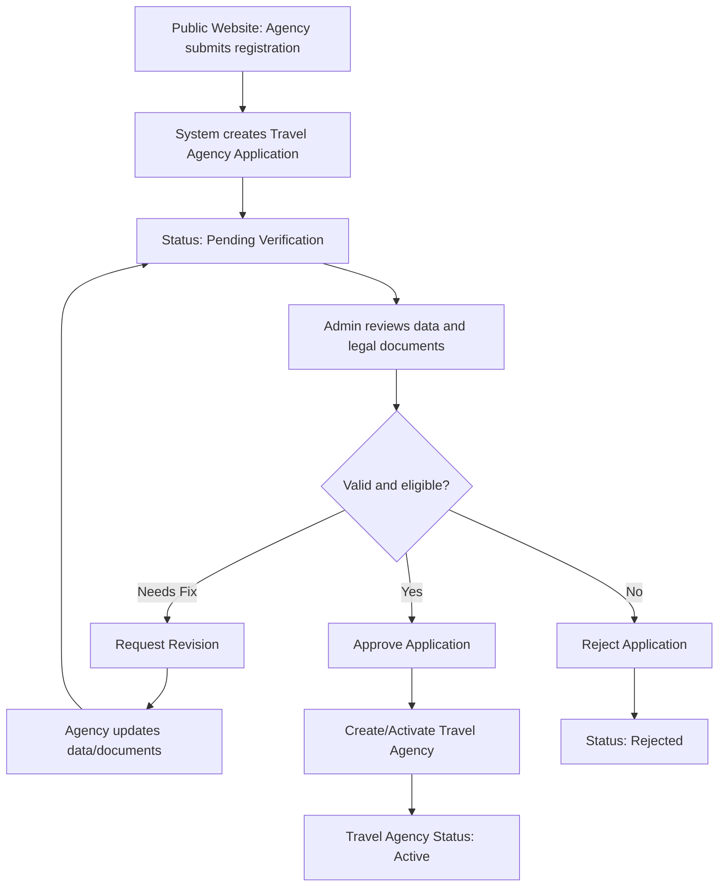

### Travel Agency Application Approval Flow

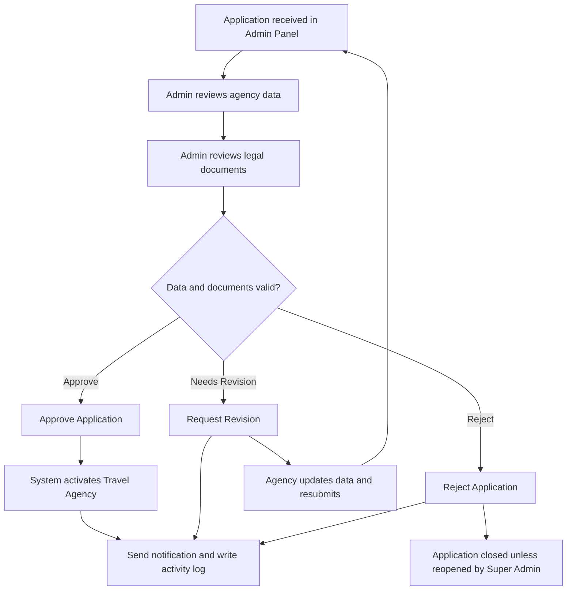

### Application Detail Review Form

Application Detail includes a review panel that allows Admin to make a decision after inspecting submitted data and documents.

Review panel fields:

| Field | Type | Required | Notes |
|---|---|---:|---|
| Review Decision | Select | Yes | Approve, Request Revision, Reject |
| Revision Category | Multi-select | Conditional | Required when decision is Request Revision |
| Rejection Reason | Long text | Conditional | Required when decision is Reject |
| Internal Note | Long text | Optional | Only visible to internal admins |
| Notify Agency PIC | Toggle | Yes | Default enabled |
| Assigned Reviewer | User select | Optional | Super Admin only, optional MVP |

Revision categories:

| Category | Example |
|---|---|
| Agency Information | Nama agency tidak sesuai dokumen |
| Legal Document | Dokumen blur, expired, atau salah upload |
| License Information | MOTAC number tidak valid |
| PIC Information | Data PIC tidak lengkap |
| Bank Details | Nama rekening tidak sesuai agency |
| Address | Alamat tidak lengkap |

### Document Review Flow

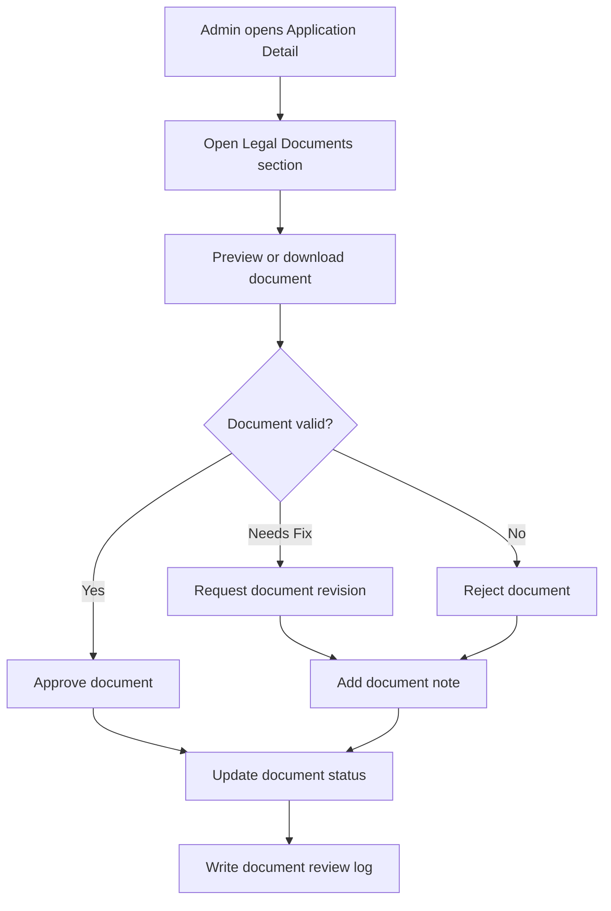

Document review fields:

| Field | Type | Required | Notes |
|---|---|---:|---|
| Document Decision | Select | Yes | Approve, Request Revision, Reject |
| Document Note | Long text | Conditional | Required for Request Revision or Reject |
| Expiry Date | Date | Conditional | Required for documents with validity period |
| Notify Agency PIC | Toggle | Yes | Default enabled when revision/reject |

---

## 6. Add Travel Agency

Add Travel Agency digunakan Admin untuk membuat agency secara internal atau melengkapi data agency hasil approval dari Travel Agency Applications. Field yang sama juga menjadi basis data submission dari public website, dengan beberapa field internal hanya terlihat untuk Admin.

### Form Structure

```text
Add Travel Agency

1. Travel Agency Information
   - Agency Logo
   - Travel Agency Name
   - Agency Type
   - Main Email
   - Main Phone Number
   - Website
   - SSM Registration Number
   - MOTAC License Number
   - License Category
   - License Validity Period
   - Office Type
   - Status

2. Social Media
   - Platform
   - URL / Contact Link
   - Public Display Toggle

3. Agency Address
   - Country
   - State / Province
   - City
   - Postal / ZIP Code
   - Street Address
   - Google Maps Link

4. PIC Information
   - PIC Full Name
   - Position
   - Email
   - Phone Number
   - Access Level
   - ID / Passport Number
   - Authorization Letter

5. Settlement / Bank Details
   - Account Holder Name
   - Travel Agency Registration Number
   - Finance Email
   - Finance Phone Number
   - Bank Country
   - Bank Name
   - Bank Account Number
   - Payout Currency
   - Tax / SST Number

6. Employees List
   - Employee Name
   - Position
   - Email
   - Phone Number
   - Country
   - Access

7. Legal Documents
   - SSM Certificate
   - MOTAC License
   - Umrah / Ziarah Authorization
   - PJH Certificate
   - Bank Statement / Proof of Account
   - Supporting Documents

8. Admin Notes & Verification
   - Internal Notes
   - Verification Status
   - Rejection / Revision Reason
```

### Travel Agency Information Fields

| Field | MVP | W/O | Type | Validation / Notes |
|---|---|---|---|---|
| Agency Logo | Yes | Optional | Image | Untuk branding agency. |
| Travel Agency Name | Yes | Required | Text | Nama resmi sesuai dokumen legal. |
| Agency Type | Yes | Required | Select | Travel Agency, Tour Operator, Branch Office, Supplier. |
| Main Email | Yes | Required | Email | Kontak utama untuk login atau komunikasi. |
| Main Phone Number | Yes | Required | Phone | Kontak utama agency. |
| Website | No | Optional | URL | Opsional. |
| SSM Registration Number | Yes | Required | Text | Menerima format baru 12 digit atau format lama. |
| MOTAC License Number | Yes | Required | Text | Nomor lisensi travel agency. |
| License Category | Yes | Required | Multi-select | Inbound, Outbound, Ticketing, Umrah/Ziarah. Outbound wajib jika menjual Umrah. |
| License Validity Period | Yes | Required | Date range | Start date dan expiry date. Memicu reminder dan auto-suspend saat kedaluwarsa. |
| Office Type | Yes | Required | Select | Head Office atau Branch. |
| Status | Yes | Required | Select | Draft, Pending Verification, Active, Suspended, Inactive. |

### License & Compliance Fields

| Field | MVP | W/O | Type | Validation / Notes |
|---|---|---|---|---|
| Umrah / Ziarah Authorization | Conditional | Conditional | Text + Document | Wajib jika agency menjual Umrah. |
| KPPU Status (Director) | No | Optional | Select + Date | Status dan tanggal penyelesaian jika relevan. |
| Bank Guarantee | No | Optional | Group | Provider, amount, start date, end date, status. |
| PJH License / Status | No | Conditional | Text + Document | Wajib untuk membuat atau menjual paket Haji. |
| Industry Association | No | Optional | Multi-select | MATTA, BUMITRA, MCTA, atau asosiasi lain. |
| TIN / Tax Number | No | Conditional | Text | Untuk kebutuhan tax dan billing. |
| SST Number | No | Conditional | Text | Wajib jika agency registered SST. |
| MSIC Code | No | Optional | Text | Kode aktivitas bisnis jika diperlukan. |

### Agency Address Fields

| Field | MVP | W/O | Type | Validation / Notes |
|---|---|---|---|---|
| Country | Yes | Required | Select | Default Malaysia jika market awal Malaysia. |
| State / Province | Yes | Required | Select | Negeri atau provinsi. |
| City | Yes | Required | Text | Kota. |
| Postal / ZIP Code | Yes | Required | Text | Kode pos. |
| Street Address | Yes | Required | Text | Alamat lengkap kantor. |
| Google Maps Link | No | Optional | URL | Membantu validasi lokasi kantor. |
| Business Premise License Number | No | Optional | Text | Digunakan jika dibutuhkan untuk compliance lokal. |

### Social Media Fields

| Field | MVP | W/O | Type | Notes |
|---|---|---|---|---|
| Platform | No | Optional | Select | WhatsApp, Instagram, Facebook, TikTok, YouTube. |
| URL / Contact Link | No | Optional | URL/Text | Link atau nomor kontak harus valid. |
| Is Publicly Displayed | No | Optional | Boolean | Menentukan apakah channel tampil di profil publik agency. |

### PIC Information Fields

PIC Information dipisahkan dari Employees List karena PIC menjadi penanggung jawab utama saat onboarding.

| Field | MVP | W/O | Type | Notes |
|---|---|---|---|---|
| PIC Full Name | Yes | Required | Text | Nama penanggung jawab utama. |
| PIC Position | Yes | Required | Text | Director, Manager, Operation Lead, atau jabatan lain. |
| PIC Email | Yes | Required | Email | Email untuk login dan notifikasi. |
| PIC Phone Number | Yes | Required | Phone | Kontak utama PIC. |
| PIC ID / Passport Number | No | Conditional | Text | Untuk KYC internal jika diperlukan. |
| PIC Authorization Letter | No | Optional | Document | Jika PIC bukan director atau owner. |
| Access Level | Yes | Required | Select | PIC, Admin, atau Staff untuk MVP. |

### Settlement / Bank Details Fields

| Field | MVP | W/O | Type | Notes |
|---|---|---|---|---|
| Account Holder Name | Yes | Required | Text | Nama pemilik rekening. |
| Travel Agency Registration Number | Yes | Required | Text | Sinkron dengan SSM Registration Number. |
| Finance Email | Yes | Required | Email | Email untuk billing dan settlement. |
| Finance Phone Number | No | Optional | Phone | Kontak finance. |
| Bank Country | Yes | Required | Select | Negara bank. |
| Bank Name | Yes | Required | Select/Text | Nama bank. |
| Bank Account Number | Yes | Required | Text | Nomor rekening bank. |
| Payout Currency | Yes | Required | Select | MYR, SAR, IDR, atau currency lain yang didukung. |
| Tax / SST Number | No | Conditional | Text | Dibutuhkan untuk tax/payment compliance jika berlaku. |
| Bank Statement / Proof of Account | No | Optional | Document | Untuk verifikasi rekening payout. |

### Employees List Fields

Minimal wajib ada satu employee dan salah satu employee wajib menjadi PIC.

| Field | MVP | W/O | Type | Notes |
|---|---|---|---|---|
| Employee Name | Yes | Required | Text | Nama employee. |
| Position | Yes | Required | Text | Jabatan. |
| Email | Yes | Required | Email | Email harus unik. |
| Phone Number | Yes | Required | Phone | Nomor telepon. |
| Country | No | Optional | Select | Negara. |
| Access Level | Yes | Required | Select | PIC, Admin, Staff, Finance, atau Operations. |

Access levels:

| Access | Description | MVP |
|---|---|---|
| PIC | Kontak utama dan perwakilan agency. | Yes |
| Admin | Mengelola operasional agency. | Yes |
| Staff | Akses operasional terbatas. | Yes |
| Operation Staff | Akses group trip, jamaah, hotel, flight, dan itinerary. | Phase 2 |
| Finance Staff | Akses data billing dan payment. | Phase 2 |
| Customer Service | Akses dukungan pelanggan. | Phase 2 |
| Marketing Staff | Akses kebutuhan campaign atau konten agency. | Phase 2 |

### Admin Notes & Verification Fields

| Field | MVP | W/O | Type | Notes |
|---|---|---|---|---|
| Internal Notes | Yes | Optional | Long text | Catatan internal admin/compliance, tidak tampil ke agency. |
| Verification Status | Yes | Required | Select | Draft, Pending Verification, Revision Required, Verified, Rejected, Suspended. |
| Rejection / Revision Reason | Yes | Conditional | Long text | Wajib jika status Rejected atau Revision Required. |
| Verified By | Yes | System | User reference | Terisi otomatis saat diverifikasi. |
| Verified At | Yes | System | Timestamp | Terisi otomatis saat diverifikasi. |

### MVP Field Minimum

1. Travel Agency Name
2. Agency Logo
3. Agency Type
4. Main Email
5. Main Phone Number
6. Office Type
7. Address
8. PIC Information
9. Employee minimal satu orang
10. SSM Registration Number
11. MOTAC License Number
12. License Category
13. License Validity Period
14. Umrah / Ziarah Authorization jika menjual Umrah
15. Required Legal Documents
16. Settlement / Bank Details
17. Payout Currency
18. Tax / SST Number jika berlaku
19. Verification Status
20. Status

### Edit Travel Agency Flow

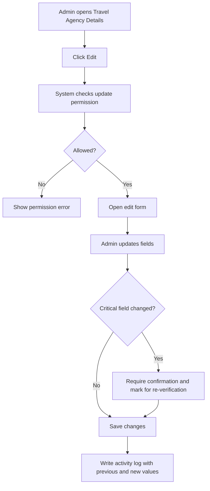

Fields that may trigger re-verification:

1. Travel Agency Name.
2. SSM Registration Number.
3. MOTAC License Number.
4. License Category.
5. License Validity Period.
6. Umrah / Ziarah Authorization.
7. PJH License / Status.
8. Settlement / Bank Details.
9. Legal Documents.

## 7. Travel Agency Details

Travel Agency Details is an agency-specific 360-degree view that allows Admin to view, monitor, verify, and manage all information related to a selected Travel Agency.

### Header

| Element | Description |
|---|---|
| Back Button | Return admin to previous page |
| Agency Logo | Display logo or placeholder |
| Travel Agency Name | Selected agency name |
| Agency Status | Active, Pending Verification, Need Revision, Suspended, Rejected, Inactive |
| Rating Summary | Average rating and total reviews |
| Edit Button | Visible only with update permission |

Header behavior:

1. Header remains consistent across all tabs.
2. Edit button is only visible to users with update permission.
3. Status badge must reflect current agency status.
4. Rating summary should be hidden if there is no rating data.

### Recommended 7-Tab Structure

| Tab | Contains | Notes |
|---|---|---|
| Profile | Agency info, social media, address, legal documents | Settlement summary may be shown only with permission, but detailed bank management belongs in Finance. |
| Users & Team | PIC, employees, invitation status, agency roles | Split from Profile because users/roles are managed frequently. |
| Jamaah & Mutawwif | Jamaah sub-tab and Mutawwif sub-tab | People and assignment data. |
| Packages & Group Trips | Packages sub-tab and Group Trips sub-tab | Product and departure data are tightly related. |
| Operations | Hotel, Flight, Itinerary | Travel components should be grouped to reduce tab clutter. |
| Finance | Settlement, billing/payment summary, commission | Sensitive and permission-based. |
| Quality & Logs | Review & Rating, Issue Reports, Activity Logs, Internal Remarks | Monitoring, quality, audit, and internal notes. |

### Data Scope Rule

All data displayed in Travel Agency Details must be scoped only to the selected Travel Agency. Admin must not see cross-agency data inside this page unless explicitly accessing a global module from the sidebar.

### Travel Agency Details Data Scope Diagram

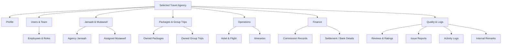

### Profile Tab

Purpose:

Displays core travel agency profile, public/contact information, address, and legal/compliance documents.

Sections:

1. Travel Agency Information.
2. Social Media.
3. Agency Address.
4. Legal Documents.
5. Compliance Summary.

Travel Agency Information fields:

| Field | Description |
|---|---|
| Travel Agency Name | Official name of the agency |
| Agency Type | Travel Agency, Tour Operator, Branch Office, or configured type |
| Main Phone Number | Main contact number |
| Main Email | Main agency email |
| Website | Official website URL |
| Status | Current agency status |
| License Number | Agency license number, if available |
| Rating | Average rating and total reviews |

Legal Document actions:

1. View document.
2. Download document.
3. Replace document.
4. Approve document.
5. Request document revision.
6. Reject document.
7. Add document review note.

What to reduce:

1. Do not put full employee/role management here; move it to Users & Team.
2. Do not expose full bank details here; move sensitive finance data to Finance.

### Users & Team Tab

Purpose:

Allows Admin to manage PIC, employees, invitation status, and agency-specific roles.

Recommended columns:

| Column | Description |
|---|---|
| Employee Name | Full name of employee |
| Position | Job position |
| Email | Employee email |
| Phone Number | Employee phone number |
| Country | Employee country |
| Access Role | PIC, Admin, Staff, Finance, Operations, Sales, Customer Support, Marketing |
| Status | Active, Pending, Inactive |
| Actions | View, edit, deactivate, resend invitation |

Rules:

1. A Travel Agency must have at least one PIC.
2. Employee email must be unique.
3. One employee can only have one primary access role at a time.
4. Pending employees are users who have been invited but have not activated their account.
5. Role management requires Roles Update permission.

Invite employee flow:

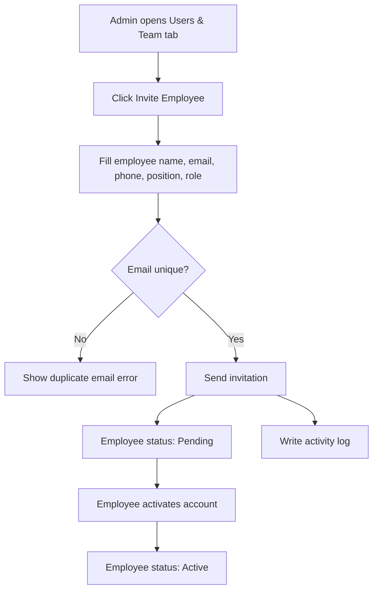

Invite employee fields:

| Field | Type | Required | Notes |
|---|---|---:|---|
| Employee Name | Text | Yes | Full name |
| Position | Text | Yes | Job position |
| Email | Email | Yes | Must be unique |
| Phone Number | Phone | Yes | Include country code if applicable |
| Country | Select | Optional | Employee country |
| Access Role | Select | Yes | PIC, Admin, Staff, Finance, Operations, Sales, Customer Support, Marketing |
| Send Invitation Email | Toggle | Yes | Default enabled |

Employee actions:

| Action | Description |
|---|---|
| Edit Role | Update employee primary role |
| Deactivate | Disable employee access |
| Reactivate | Restore employee access |
| Resend Invitation | Send invitation again for pending users |
| Transfer PIC | Assign another employee as PIC |

Default agency roles:

| Role | Description |
|---|---|
| PIC / Owner | Main agency representative |
| Admin | Manage agency operations |
| Operations Manager | Manage daily operations, group trips, jamaah, hotel, flight, and itinerary |
| Sales | Manage sales, inquiries, and booking-related tasks |
| Finance | Manage payment, commission, invoices, and financial records |
| Customer Support | Manage customer inquiries, complaints, and issue reports |
| Marketing | Manage promotion-related tasks |
| View Only | Read-only access |

### Jamaah & Mutawwif Tab

This tab contains two sub-tabs:

```text
1. Jamaah
2. Mutawwif
```

Jamaah sub-tab columns:

| Column | Description |
|---|---|
| Jamaah Name | Full name, email, and phone number |
| Gender | Male / Female |
| Country | Jamaah country |
| Package / Group Trip | Related package or group trip |
| Payment Status | Unpaid, Partial, Paid, Refunded |
| Join Date | Date jamaah was added |
| Status | Pending, Active, Inactive |
| Actions | View details, edit, remove from agency |

Jamaah filters:

1. Sort by newest / oldest.
2. Status.
3. Country.
4. Gender.
5. Date Created.
6. Search by name, email, or phone number.

Logic note:

Jamaah table must not use Experience & Rating because jamaah are customers, not service providers.

Mutawwif sub-tab columns:

| Column | Description |
|---|---|
| Mutawwif Name | Full name, email, and phone number |
| Gender | Male / Female |
| Job Type | Full-time, Part-time, Freelance |
| Country | Mutawwif country |
| Experience & Rating | Total trips handled and average rating |
| Total Jamaah Handled | Total jamaah handled by the mutawwif |
| Assigned Group Trips | Number of assigned group trips |
| Join Date | Date mutawwif was added |
| Status | Pending, Active, Inactive |
| Actions | View details, assign, unassign, edit |

### Packages & Group Trips Tab

This tab contains two sub-tabs:

```text
1. Packages
2. Group Trips
```

Packages sub-tab purpose:

Displays all packages owned or managed by the selected Travel Agency.

Packages columns:

| Column | Description |
|---|---|
| Package Name | Name of package |
| Package Type | Umrah, Hajj, Ziarah, or configured type |
| Duration | Package duration |
| Price | Package price |
| Total Bookings | Number of bookings |
| Active Group Trips | Number of active group trips using this package |
| Status | Draft, Active, Inactive, Archived |
| Date Created | Package creation date |
| Actions | View, edit, duplicate, archive |

Group Trips sub-tab purpose:

Displays group trips under the selected Travel Agency.

Group Trips columns:

| Column | Description |
|---|---|
| Group Name | Group trip name |
| Package Name | Related package |
| Mutawwif | Assigned mutawwif |
| Duration | Trip duration |
| Departure Date | Departure date |
| Return Date | Return date |
| Total Jamaah | Number of jamaah assigned |
| Available Seat | Remaining seat capacity |
| Hotel | Hotel assigned for Makkah / Madinah |
| Flight Info | Flight information |
| WAG Link | WhatsApp group link |
| Status | Draft, Active, Inactive, Completed, Cancelled |
| Date Created | Date group trip was created |
| Actions | View, edit, archive |

Logic notes:

1. Package is a core module because group trips, bookings, jamaah, commission, and reviews are often connected to package data.
2. Since this page is already scoped to one Travel Agency, global filters such as All Agency must not be displayed.

### Operations Tab

Purpose:

Groups operational travel components used by the selected Travel Agency.

Sub-tabs:

```text
1. Hotel
2. Flight
3. Itinerary
```

Hotel columns:

| Column | Description |
|---|---|
| Hotel Name | Hotel name |
| City | Hotel city |
| Hotel Type | Makkah / Madinah / Transit / Other |
| Check-in Date | Check-in date |
| Check-out Date | Check-out date |
| Room Allocation | Number of rooms or pax allocation |
| Related Group Trip | Linked group trip |
| Status | Active, Draft, Inactive |
| Actions | View details |

Flight columns:

| Column | Description |
|---|---|
| Airline | Airline name |
| Flight Number | Flight number |
| Departure Airport | Origin airport |
| Arrival Airport | Destination airport |
| Departure Date | Departure date |
| Return Date | Return date |
| Related Group Trip | Linked group trip |
| Status | Active, Draft, Inactive |
| Actions | View details |

Itinerary columns:

| Column | Description |
|---|---|
| Itinerary Name | Name of itinerary |
| Duration | Duration of itinerary |
| Total Activity | Total number of activities |
| Linked Group Trips | Number of group trips using this itinerary |
| Description | Short description |
| Status | Draft, Active, Inactive, Archived |
| Date Created | Date itinerary was created |
| Actions | View, edit, archive, delete |

Search placeholder:

```text
Search by itinerary name or description
```

### Finance Tab

Purpose:

Displays settlement, billing/payment summary, payout-sensitive information, and commission records related to the selected Travel Agency.

Sections:

1. Settlement / Bank Details.
2. Billing & Payment Summary.
3. Commission.

Security rules:

1. Bank details are sensitive information.
2. Only Super Admin, Finance Admin, or users with View Sensitive Data permission can view or edit settlement/bank details.
3. Commission release requires Commission Update or Release permission.

Commission summary cards:

| Card | Description |
|---|---|
| Total Commission | Total accumulated commission |
| This Month | Total commission records or amount this month |
| Pending | Commission pending release |
| Locked | Commission currently locked |
| Released | Commission already released |

Commission columns:

| Column | Description |
|---|---|
| Booking Details | Jamaah name, booking ID, date, pax count |
| Agent | Agent or referrer who generated booking |
| Package | Package name and price |
| Commission Breakdown | Commission amount, rate, and calculation |
| Source | WhatsApp, Facebook, Instagram, Direct Link, Manual |
| Status | Pending, Locked, Released, Cancelled |
| Actions | View details, release, lock, cancel |

Logic note:

Commission status must not be mixed with payout status. If payout is implemented separately, payout status should use Pending, Approved, Paid, Rejected.

Settlement details update flow:

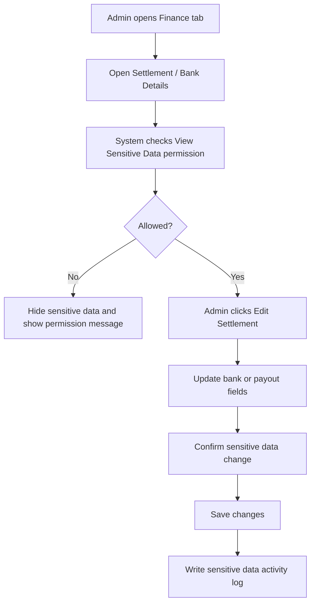

Commission action flow:

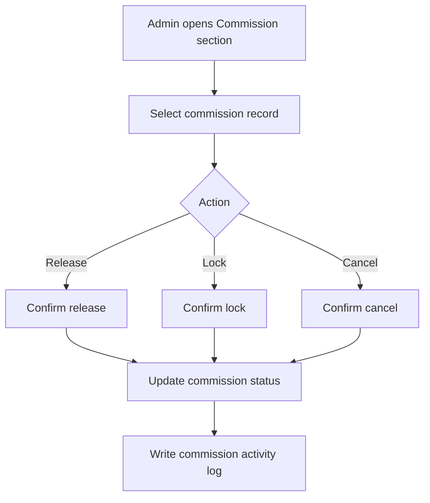

### Quality & Logs Tab

Purpose:

Groups quality monitoring, issue handling, internal remarks, and audit trail for the selected Travel Agency.

Sub-tabs:

```text
1. Review & Rating
2. Issue Reports
3. Activity Logs
4. Internal Remarks
```

Review & Rating columns:

| Column | Description |
|---|---|
| Jamaah / Family | Reviewer name or family group |
| Rating & Feedback | Star rating and written feedback |
| Tip | Optional tip given by jamaah |
| Date | Feedback date and time |
| Anonymous | Indicates if reviewer is anonymous |
| Actions | View details, archive |

MVP rating sources:

1. Agency rating.
2. Package rating.
3. Group trip rating.
4. Mutawwif rating.

Review moderation flow:

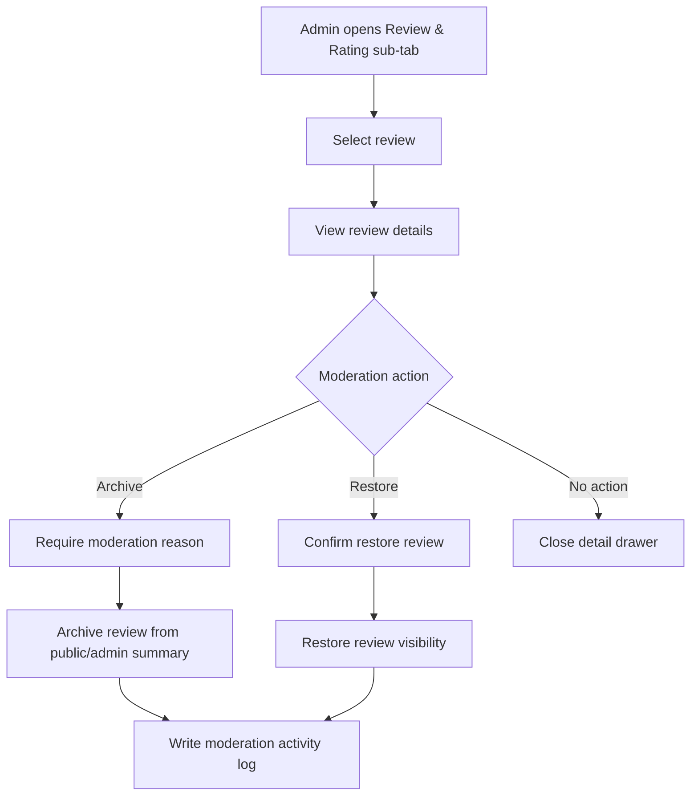

Review moderation fields:

| Field | Type | Required | Notes |
|---|---|---:|---|
| Action | Select | Yes | Archive or Restore |
| Reason | Long text | Conditional | Required when archiving review |
| Internal Note | Long text | Optional | Visible only to authorized Admin |

Issue Reports are owned by Report Management. The Travel Agency Details page only shows reports related to the selected Travel Agency so Admin can review agency quality and follow-up history without leaving the agency profile.

Issue Reports columns:

| Column | Description |
|---|---|
| Date & Time | Report creation time |
| Jamaah | Jamaah who submitted or is related to the report |
| Report | Short issue description |
| Rating | Related rating, if available |
| Category | Service, Compliance, Document, Payment, Platform, Safety, Other |
| PIC | Assigned person in charge |
| Priority | Normal, Important, Urgent |
| Status | Open, In Progress, Waiting Response, Resolved, Closed |
| Actions | View details, assign PIC, update status |

Issue Report handling flow:

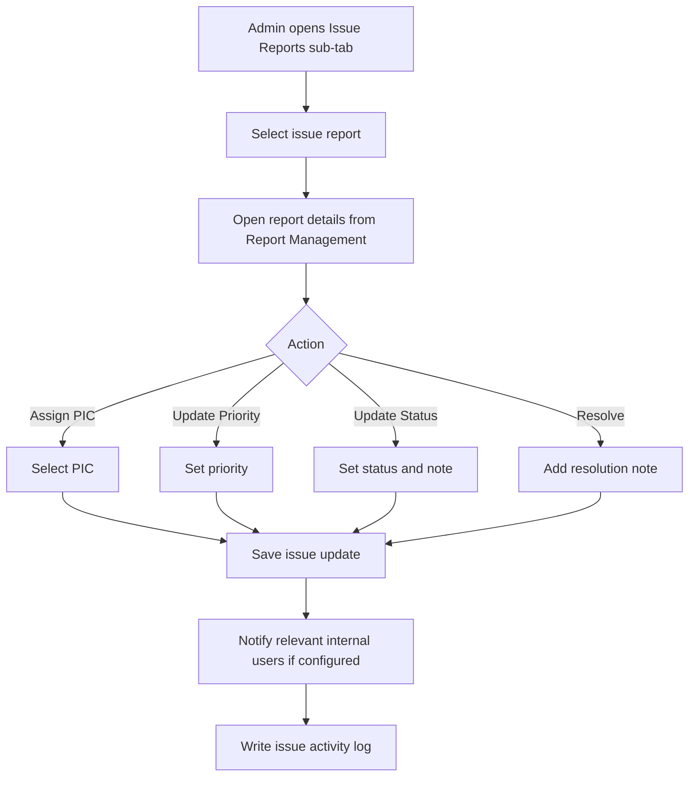

Issue Report update fields:

| Field | Type | Required | Notes |
|---|---|---:|---|
| PIC | User select | Conditional | Required when assigning or reassigning issue |
| Priority | Select | Yes | Normal, Important, Urgent |
| Status | Select | Yes | Open, In Progress, Waiting Response, Resolved, Closed |
| Resolution Note | Long text | Conditional | Required when status is Resolved or Closed |
| Internal Note | Long text | Optional | Internal handling note |

Activity Logs columns:

| Column | Description |
|---|---|
| Activity | Description of action |
| Actor | User who performed the action |
| Role | Actor role |
| Date & Time | Activity timestamp |
| IP Address | IP address used |
| Device | Desktop, Mobile, Tablet |
| Location | Location detected from IP, if available |

Internal Remarks columns:

| Column | Description |
|---|---|
| Date & Time | Remark creation date |
| Created By | Admin who created the remark |
| Title | Short title of the remark |
| Note | Remark content |
| Category | Operations, Finance, Service, Administration, Compliance |
| Priority | Low, Normal, High, Urgent |
| Visibility | Internal Only, Restricted Admins |
| Status | Open, In Progress, Resolved, Unresolved |
| Actions | View, edit, resolve, mark unresolved |

Add Internal Remark flow:

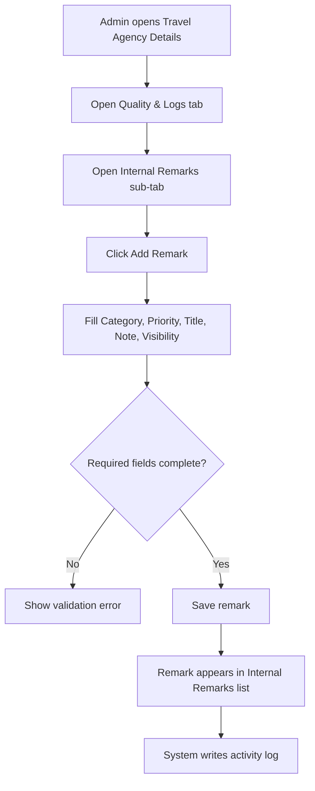

Add Internal Remark fields:

| Field | Type | Required | Validation | Notes |
|---|---|---:|---|---|
| Category | Select | Yes | Must select one category | Operations, Finance, Service, Administration, Compliance |
| Priority | Select | Yes | Must select one priority | Low, Normal, High, Urgent |
| Title | Text input | Yes | Max 120 characters | Short summary of the remark |
| Note | Long text | Yes | Max length follows product policy | Main internal remark content |
| Visibility | Select | Yes | Must select one option | Internal Only, Restricted Admins |

Internal Remark rules:

1. Internal remarks are never visible to Travel Agency users.
2. Visibility controls which internal roles can view the remark.
3. Finance-related remarks should default to Restricted Admins.
4. Add, edit, resolve, and mark unresolved actions must be logged.
5. Edit history should preserve previous and new values.

Quality & Logs rules:

1. The issue tab should be named Issue Reports or Complaints & Reports instead of only Reports.
2. Activity logs must use real system actions, not generic placeholder text.
3. Internal remarks are internal-only and must not be visible to Travel Agency users.
4. Internal remarks require Internal Remarks Read permission.
5. Adding or editing internal remarks requires Internal Remarks Update permission.
6. Review moderation requires Review Update permission.
7. Issue assignment and status update require Issue Report Update permission.

Export flow:

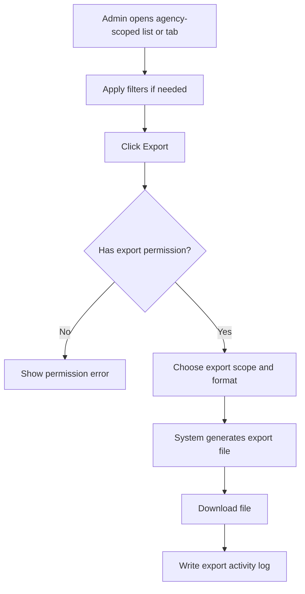

Export fields:

| Field | Type | Required | Notes |
|---|---|---:|---|
| Export Scope | Select | Yes | Current page, filtered result, or selected rows |
| Data Type | Select | Yes | Employees, jamaah, mutawwif, packages, group trips, finance summary, reviews, issue reports, activity logs |
| File Format | Select | Yes | CSV or XLSX |
| Include Sensitive Fields | Toggle | Conditional | Only visible for authorized roles |

### Tab Reduction Notes

1. Hotel, Flight, and Itinerary are grouped into Operations to reduce top-level tab clutter.
2. Commission and settlement/bank details are grouped into Finance because both are sensitive financial areas.
3. Review & Rating, Issue Reports, Activity Logs, and Internal Remarks are grouped into Quality & Logs because they support monitoring, quality, and audit workflows.
4. Settings is not a top-level MVP tab unless agency-level configuration becomes a frequent workflow. Role management lives under Users & Team; notification/security/regional settings can be added later if needed.

## 8. Status Management

| Status | Behavior |
|---|---|
| Pending Verification | Only Profile, Legal Documents, Application Review, Internal Remarks, and Activity Logs are available |
| Need Revision | Agency must revise data/documents before approval |
| Active | All authorized tabs/actions are available |
| Suspended | Data can be viewed, but operational actions are limited |
| Rejected | Only application-related data, remarks, and logs are available |
| Inactive | Data can be viewed, but operational creation actions are disabled |

Restricted actions for Suspended agencies may include:

1. Create package
2. Create group trip
3. Add jamaah
4. Assign mutawwif
5. Release commission
6. Publish package

### 8.1 Suspend / Reactivate Flow

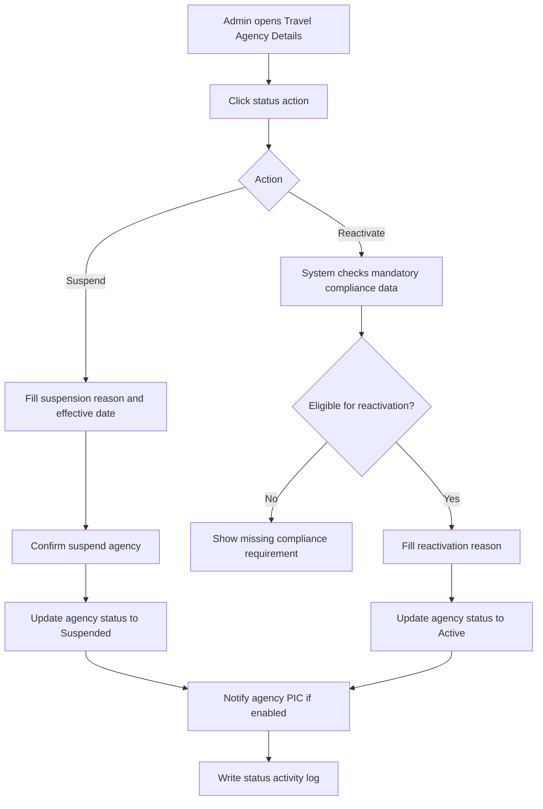

Suspend / Reactivate fields:

| Field | Type | Required | Notes |
|---|---|---:|---|
| Action | Select | Yes | Suspend or Reactivate |
| Reason | Long text | Yes | Required for both suspend and reactivate |
| Effective Date | Date picker | Conditional | Required for suspension if not effective immediately |
| Notify Agency PIC | Toggle | Yes | Default enabled |
| Internal Note | Long text | Optional | Internal-only context |

Suspend / Reactivate rules:

1. Suspension requires Travel Agency Status Update permission.
2. Reactivation is allowed only if mandatory legal and compliance data is valid.
3. Suspended agencies cannot create operational records listed above.
4. Reactivation restores allowed actions based on role and permission.
5. Previous status, new status, reason, actor, and timestamp must be logged.

### 8.2 Travel Agency Status Flow Diagram

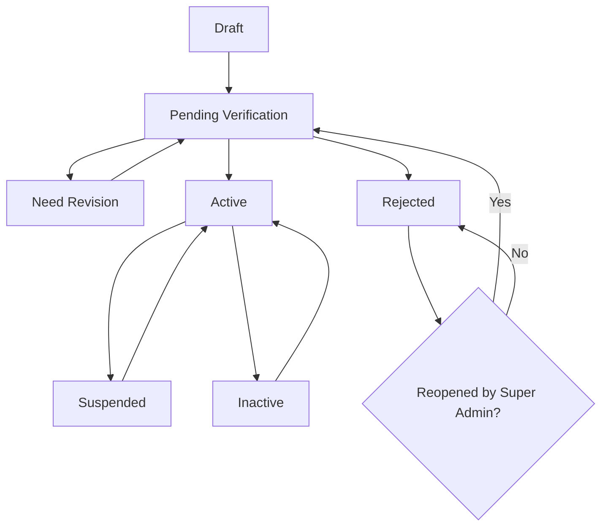

---

## 9. Form Fields & Legal Documents

Legal document handling uses two types of data:

1. Structured field/number for validation, search, expiry reminder, and reporting.
2. Uploaded document as evidence for manual verification by Compliance Officer.

| Legal Item | Structured Field / Number | Upload Document | MVP | W/O | Notes |
|---|---|---|---|---|---|
| SSM Registration | SSM Registration Number | SSM Certificate | Yes | Required | Nomor dan dokumen wajib untuk validasi entitas legal. |
| MOTAC License | MOTAC License Number + License Validity Period | MOTAC License file | Yes | Required | Nomor, masa berlaku, dan dokumen wajib untuk validasi lisensi travel agency. |
| Umrah / Ziarah Authorization | Authorization number/reference if available | Umrah / Ziarah Authorization file | Conditional | Conditional | Wajib jika agency menjual Umrah. |
| PJH License / Status | PJH License number/status if available | PJH Certificate | Conditional | Conditional | Wajib jika agency membuat atau menjual paket Haji. |
| Bank Account | Bank Account Number | Bank Statement / Proof of Account | No | Optional | Upload dapat diwajibkan jika payout verification dibutuhkan. |
| Tax / SST | Tax / SST Number | Tax Document | No | Conditional | Nomor wajib jika berlaku; dokumen pajak optional atau sesuai kebutuhan finance. |
| Business Premise | Business Premise License Number | Business Premise License | No | Optional | Digunakan jika compliance lokal membutuhkan validasi kantor fisik. |
| PIC Identity | PIC ID / Passport Number | Director / PIC ID Document | No | Optional | Untuk KYC internal jika diperlukan. |
| Insurance | Insurance Policy Number if available | Insurance Policy | No | Future | Dapat dipertimbangkan jika ada produk/aktivitas yang membutuhkan insurance. |
| Supporting Documents | - | Supporting Documents | No | Optional | Lampiran tambahan. |

### Legal Document Upload Policy

| Upload Type | Allowed Format | Max Size | Optimization Rule |
|---|---|---:|---|
| Agency Logo | JPG, JPEG, PNG, WEBP | 2 MB | Compress and resize to max 1024px on longest side |
| SSM Certificate | PDF, JPG, JPEG, PNG, WEBP | 5 MB | Compress PDF/image where possible and generate preview thumbnail |
| MOTAC License | PDF, JPG, JPEG, PNG, WEBP | 5 MB | Compress PDF/image where possible and generate preview thumbnail |
| Umrah / Ziarah Authorization | PDF, JPG, JPEG, PNG, WEBP | 5 MB | Compress PDF/image where possible and generate preview thumbnail |
| PJH Certificate | PDF, JPG, JPEG, PNG, WEBP | 5 MB | Compress PDF/image where possible and generate preview thumbnail |
| Bank Statement / Proof of Account | PDF, JPG, JPEG, PNG, WEBP | 5 MB | Sensitive file; restrict preview/download by permission |
| Tax Document | PDF, JPG, JPEG, PNG, WEBP | 5 MB | Compress PDF/image where possible |
| Business Premise License | PDF, JPG, JPEG, PNG, WEBP | 5 MB | Compress PDF/image where possible |
| PIC ID / Passport Document | PDF, JPG, JPEG, PNG, WEBP | 5 MB | Sensitive file; restrict preview/download by permission |
| Insurance Policy | PDF, JPG, JPEG, PNG, WEBP | 5 MB | Compress PDF/image where possible |
| Supporting Documents | PDF, JPG, JPEG, PNG, WEBP | 5 MB per file | Require document label and reason |

Upload performance and storage rules:

1. Upload must be rejected if file size exceeds the allowed max size.
2. System should compress uploaded images before storage when possible.
3. System should generate thumbnails/previews instead of loading original files in list or card views.
4. Original file access should be restricted and loaded only when Admin opens preview/download.
5. Files should be stored in object storage or equivalent file storage, not directly inside the application server filesystem.
6. Server should validate MIME type and file extension to prevent unsafe uploads.
7. System should scan uploaded files for malware if scanning service is available.
8. Sensitive files such as bank proof and identity documents require permission-based preview/download.

MVP mandatory rule:

1. SSM Registration Number dan upload SSM Certificate wajib.
2. MOTAC License Number, License Validity Period, dan upload MOTAC License wajib.
3. Umrah / Ziarah Authorization wajib hanya jika agency menjual Umrah.
4. PJH License / Status dan PJH Certificate wajib hanya jika agency membuat atau menjual paket Haji.
5. Bank Statement / Proof of Account dapat tetap optional di MVP, kecuali stakeholder memutuskan payout verification wajib sebelum settlement.

## 10. Validation Rules

1. Save as Draft can be done even if legal fields are incomplete.
2. Submit for Verification requires MVP minimum fields.
3. Active status requires mandatory legal fields and documents to be verified.
4. Umrah sellers require Outbound license category and Umrah / Ziarah Authorization.
5. Haji sellers require valid PJH License / Status.
6. SSM Registration Number must accept new 12-digit format and old format.
7. Employee email must be unique.
8. Agency must have at least one PIC.
9. Rejected or Revision Required must have reason.
10. Payout Currency is required before settlement.

---

## 11. Empty State

Examples:

```text
No travel agency applications found.
No legal documents have been uploaded yet.
No group trips found for this Travel Agency.
No commission records available.
```

Empty states may include CTA only if the admin has permission.

---

## 12. Error State

The system must show clear error messages when:

1. Data fails to load.
2. Admin does not have permission.
3. Required data is missing.
4. Uploaded document format is invalid.
5. Sensitive data is restricted.
6. Action cannot be completed due to agency status.

Example:

```text
You do not have permission to view settlement details.
```

---

## 13. Responsive Web Behavior

### Desktop Web

1. Use tab-based navigation.
2. Use data table layout for large datasets.
3. Show filters and search in table header.
4. Support horizontal scrolling for wide tables.
5. Allow document preview and review actions.
6. Use sticky action buttons where necessary.

### Mobile Web

1. Use stacked layout.
2. Convert tables into cards or horizontally scrollable tables.
3. Use collapsible filters.
4. Use horizontal scroll or dropdown for tabs.
5. Important actions must use confirmation modal.
6. Document preview should open in full-screen mode.

---

## 14. Activity Logs

The system must log critical actions:

1. View sensitive bank details.
2. Edit agency profile.
3. Upload or replace legal document.
4. Approve or reject document.
5. Approve or reject application.
6. Request revision.
7. Change agency status.
8. Add or edit employee.
9. Change user role.
10. Update permissions.
11. Release commission.
12. Add internal remark.
13. Edit internal remark.
14. Resolve or mark unresolved internal remark.
15. Resolve issue report.
16. Assign or reassign issue PIC.
17. Update issue priority or status.
18. Moderate review or rating.
19. Export agency-scoped data.
20. Suspend or reactivate agency.

Each log must include actor, role, action, previous value, new value, timestamp, IP address, and device.

---

## 15. Acceptance Criteria

1. Admin can view Travel Agency Applications.
2. Admin can approve, reject, request revision, and reopen application based on permission.
3. System creates or activates Travel Agency after approval.
4. Admin can view Travel Agency Details from Travel Agency List.
5. System displays selected agency name, logo, status, and rating in page header.
6. All data in Travel Agency Details is scoped to the selected agency.
7. Admin can view profile, employees, bank details, and legal documents based on permission.
8. Admin can view agency-scoped jamaah, mutawwif, packages, group trips, hotels, flights, itineraries, commissions, reviews, issue reports, activity logs, and internal remarks.
9. Sensitive bank details are only visible to authorized roles.
10. Operational tabs/actions are restricted based on agency status.
11. System records all critical actions in audit logs.
12. Page supports desktop, tablet, and mobile web layouts.
13. Admin can add internal remark with Category, Priority, Title, Note, and Visibility if they have permission.
14. Internal remarks are not visible to Travel Agency users.
15. Admin can invite employees, update roles, deactivate access, and transfer PIC based on permission.
16. Admin can update settlement details and perform commission actions based on finance permission.
17. Admin can assign PIC, update priority, change status, and resolve issue reports.
18. Admin can archive or restore reviews with moderation reason when required.
19. Admin can export agency-scoped data based on export permission.
20. Admin can suspend and reactivate agency with reason, compliance validation, notification option, and audit log.
