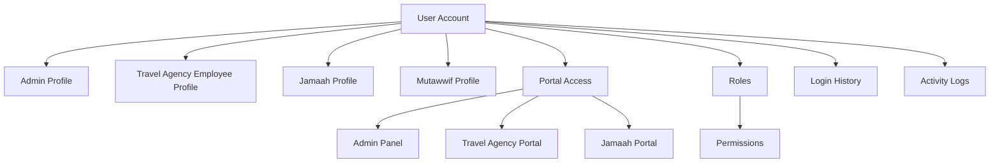
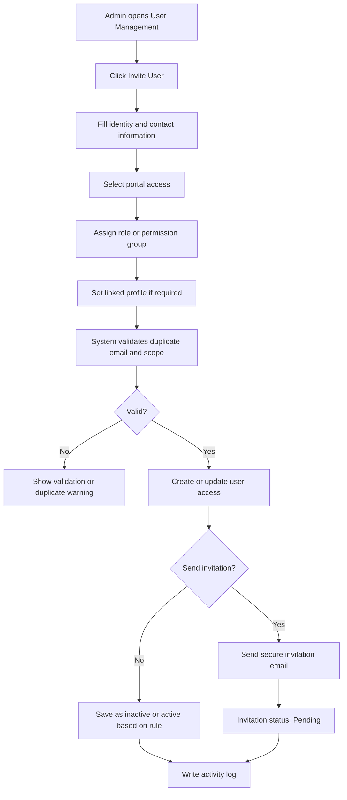
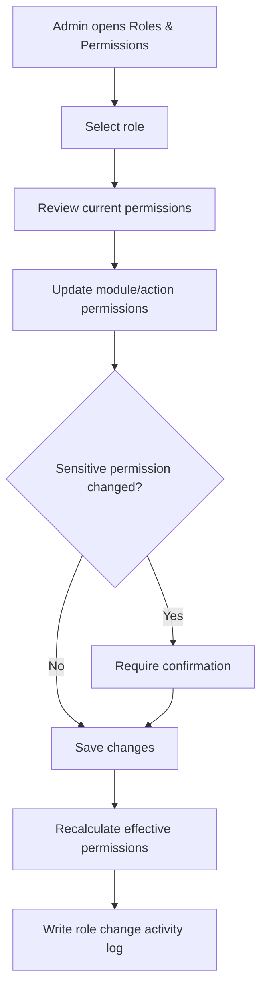
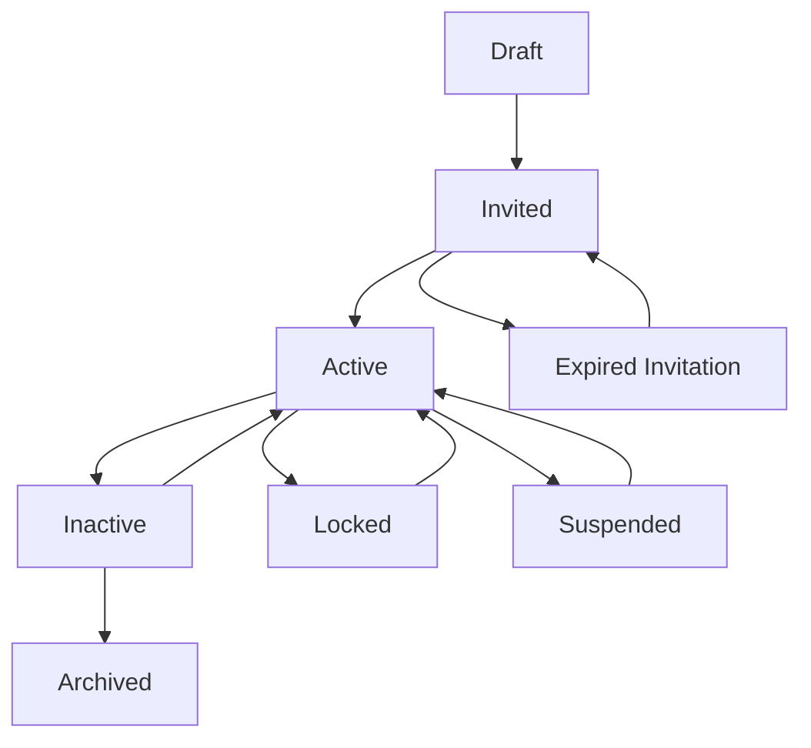
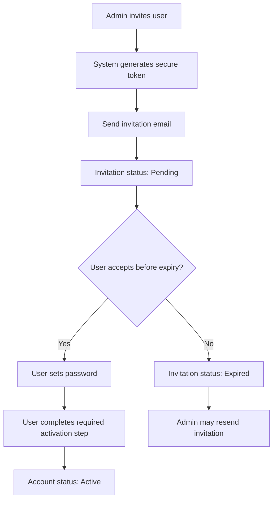
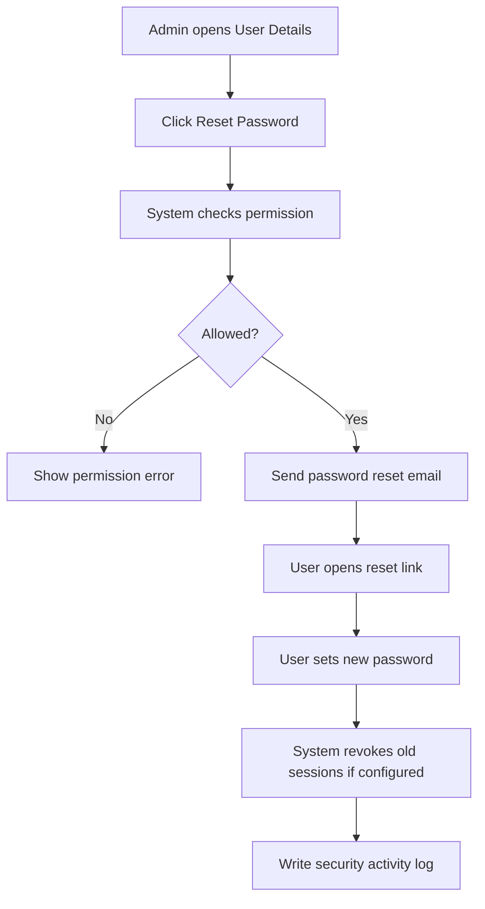

# User Management / Access Management - Module Product Requirements Document

Version: v1.0
Platform: Responsive Web Platform
Scope: User Management, Roles, Permissions, and Access Control
Status: Draft
Prepared by: Product / UI/UX Team
Last updated: 2 June 2026

> Phase 1 focuses on responsive web. Native Android and iOS applications are out of scope.


---

# Module PRD - User Management / Access Management

Version: 1.0  
Date: 2 Juni 2026  
Parent Document: Master PRD - UmrahHaji.com Admin Panel  
Scope: User Management, Roles, Permissions, and Access Control

---

## 1. Objective

User Management memungkinkan Admin untuk mengelola akun pengguna, akses portal, role, permission, invitation, account status, password reset, session control, dan audit trail di UmrahHaji.com.

Module ini berbeda dari Jamaah Management. Jamaah Management mengelola data operasional jamaah seperti profile perjalanan, passport, dokumen, package, group trip, dan payment tracking. User Management mengelola akses sistem seperti login, role, permission, status akun, dan keamanan.

Core principle:

```text
User Account = access, authentication, role, permission
Jamaah Profile = operational jamaah data
Travel Agency Profile = operational agency data
```

A user account may be linked to one or more operational profiles, such as Jamaah Profile, Travel Agency Employee Profile, Admin Profile, or Mutawwif Profile.

---

## 2. Scope

### In Scope

1. User List.
2. Add / Invite User.
3. User Details.
4. Edit user access.
5. Role assignment.
6. Permission group assignment.
7. Portal access assignment.
8. Account activation.
9. Password reset flow.
10. Deactivate / reactivate account.
11. Lock / unlock account.
12. Revoke sessions.
13. Role & Permission Management.
14. Login history.
15. User activity logs.
16. Permission-based access and data scope.
17. Responsive web behavior for desktop, tablet, and mobile web.

### Out of Scope

1. Operational jamaah profile details.
2. Passport, documents, travel information, and payment tracking.
3. Travel agency legal/compliance document verification.
4. Native Android app.
5. Native iOS app.
6. External SSO integration in MVP.
7. Advanced identity provider integration.
8. Biometric authentication.
9. Public marketing website registration UX.

Notes:

1. Jamaah invitation from Jamaah Management may create or link a User Account, but operational jamaah data remains managed under Jamaah Management.
2. Travel Agency employee invitation may create or link a User Account, but agency profile and operational data remain managed under Travel Agency Management.

### Portal & Design System Principle

Admin Panel and Travel Agency Portal will use the same design system to maintain visual consistency, component reuse, and development efficiency. However, each portal will have a separate navigation structure, permission model, user workflow, and data scope based on the role and operational needs of its users.

---

## 3. User Types

| User Type | Description | Portal Access |
|---|---|---|
| Super Admin | Internal platform owner with full access | Admin Panel |
| Admin | Internal admin with assigned permissions | Admin Panel |
| Operations Staff | Internal staff for operational modules | Admin Panel |
| Finance Admin | Internal finance user | Admin Panel |
| Compliance Officer | Internal compliance and verification user | Admin Panel |
| Support Staff | Internal support user with limited access | Admin Panel |
| Auditor | Read-only audit/reporting user | Admin Panel |
| Travel Agency Owner / PIC | Main agency representative | Travel Agency Portal |
| Travel Agency Staff | Agency employee with assigned agency role | Travel Agency Portal |
| Jamaah User | Jamaah with activated account | Jamaah Portal / Public user area, if available |
| Mutawwif User | Mutawwif with portal access, if enabled | Mutawwif Portal, future phase |

User type rules:

1. A user can have access to one or more portals only if explicitly assigned.
2. A user must have at least one role or permission group for each accessible portal.
3. Portal access must be scoped by role and data ownership.
4. Operational profiles should not be deleted when user access is deactivated.

---

## 4. Navigation Entry Point

Recommended Admin Panel navigation:

```text
Settings
- User Management
  - User List
  - Invite User
  - Roles & Permissions
  - Login History
  - User Activity Logs
```

Alternative navigation if Access Management becomes a major module:

```text
Access Management
- Users
- Roles
- Permissions
- Portal Access
- Login History
- Activity Logs
```

Recommendation:

Use `Settings -> User Management` for MVP. Promote it to `Access Management` only if role and permission configuration becomes a frequent operational workflow.

---

## 5. Information Architecture

```text
User Management
- User List
  - Search
  - Filters
  - Bulk Actions
  - Row Actions
- Add / Invite User
  - Create New User
  - Invite Existing User
  - Assign Portal Access
  - Assign Role / Permission Group
- User Details
  - Profile
  - Portal Access
  - Roles & Permissions
  - Linked Profiles
  - Login & Security
  - Activity Logs
- Roles & Permissions
  - Role List
  - Create Role
  - Permission Matrix
  - Role Users
- Login History
- Activity Logs
```

---

## 6. Relationship With Other Modules

| Module | Relationship |
|---|---|
| Jamaah Management | May create/link User Account for jamaah portal activation |
| Travel Agency Management | May create/link User Account for agency PIC and employees |
| Mutawwif Management | May create/link User Account for mutawwif access, if enabled |
| Settings | Contains platform-level role, permission, and security configuration |
| Audit Logs | Records user access, role changes, and security actions |
| Announcement | Uses user roles and audience targeting |
| Articles Management | Uses Admin, Content Admin, Content Editor, Reviewer, and Author roles for content publishing access |

### User Account Relationship Diagram



Rules:

1. One User Account can be linked to multiple profiles if business rules allow.
2. Role and permission must be evaluated per portal.
3. Data scope must be derived from portal access, role, and linked operational profile.
4. Deactivating a User Account prevents login but does not delete linked operational records.

---

## 7. User List

### Page Purpose

User List allows authorized Admin to view, search, filter, invite, and manage user accounts across the platform.

### Table Columns

| Column | Description |
|---|---|
| Checkbox | Select row for bulk action |
| User | Avatar, full name, email, and phone number |
| User Type | Super Admin, Admin, Travel Agency User, Jamaah User, etc. |
| Portal Access | Admin Panel, Travel Agency Portal, Jamaah Portal |
| Role / Permission Group | Assigned role or permission group |
| Linked Profile | Admin Profile, Travel Agency, Jamaah, Mutawwif |
| Account Status | Invited, Active, Inactive, Locked, Suspended |
| Invitation Status | Not Sent, Pending, Accepted, Expired, Cancelled |
| Last Login | Last successful login timestamp |
| Date Created | Account creation date |
| Actions | View, edit, resend invitation, reset password, deactivate |

Optional columns:

1. MFA Status.
2. Login Provider.
3. Created By.
4. Last Updated.
5. Failed Login Count.

### Search

Admin can search by:

1. Name.
2. Email.
3. Phone number.
4. User ID.
5. Role.
6. Travel agency name.
7. Linked profile name.

Search behavior:

1. Search supports partial match.
2. Search ignores case.
3. Search preserves active filters.
4. Search result must respect the current admin's permission and data scope.

### Filters

| Filter | Options |
|---|---|
| Sort By | Newest, Oldest, Name A-Z, Name Z-A, Recently Active |
| User Type | Internal Admin, Travel Agency User, Jamaah User, Mutawwif User |
| Portal Access | Admin Panel, Travel Agency Portal, Jamaah Portal, Mutawwif Portal |
| Account Status | Invited, Active, Inactive, Locked, Suspended |
| Invitation Status | Not Sent, Pending, Accepted, Expired, Cancelled |
| Role | Role list |
| Permission Group | Permission group list |
| Travel Agency | Travel agency list based on permission |
| Last Login | All Time, Today, This Week, This Month, This Year, Never Logged In |
| Date Created | All Time, Today, This Week, This Month, This Year, Custom Range |

Filter behavior:

1. Filters can be combined.
2. Selected filters should appear as chips.
3. Admin can clear individual filters or clear all filters.
4. Role, Permission Group, and Travel Agency filters should support search inside dropdown.

### Row Actions

| Action | Availability | Description |
|---|---|---|
| View Details | Users with read permission | Opens User Details |
| Edit User | Users with update permission | Updates name, phone, role, portal access, or status |
| Resend Invitation | Pending or Expired invitation | Sends new invitation link |
| Reset Password | Active user and permitted roles | Sends password reset email |
| Lock Account | Active user | Prevents login temporarily |
| Unlock Account | Locked user | Restores login access |
| Deactivate | Active user | Disables user login |
| Reactivate | Inactive user | Restores account access |
| Revoke Sessions | Active user | Forces logout from all sessions |

### Bulk Actions

| Action | Description |
|---|---|
| Export Selected | Export selected users if permitted |
| Resend Invitations | Resend invitations to selected pending/expired users |
| Assign Role | Assign role to selected users if eligible |
| Deactivate Users | Deactivate selected users with reason |
| Revoke Sessions | Force logout selected users |

Bulk action rules:

1. Bulk actions require at least one selected row.
2. System must validate eligibility per selected user.
3. Failed rows should be reported after bulk action completes.
4. Bulk changes to role, permission, status, or sessions must be recorded in activity logs.

---

## 8. Add / Invite User

Add / Invite User allows authorized Admin to create a new user account, invite an existing user to another portal, or assign role and permission for system access.

### Add / Invite User Main Flow



### Add / Invite User Fields

| Field | Type | Required | Validation | Notes |
|---|---|---:|---|---|
| Full Name | Text input | Yes | Max 120 characters | User display name |
| Email | Email input | Yes | Valid and unique for new user | Primary login identity |
| Country Code | Phone country selector | Optional | Valid country code | Required if phone is mandatory by policy |
| Phone Number | Phone input | Optional | Numeric format | Useful for support and notifications |
| User Type | Select | Yes | Must select one type | Internal Admin, Travel Agency User, Jamaah User, etc. |
| Portal Access | Multi-select | Yes | At least one portal | Admin Panel, Travel Agency Portal, Jamaah Portal |
| Role | Select | Yes | Role must match selected portal | Example: Admin, Finance, Agency Staff |
| Permission Group | Select | Optional | Based on portal | Additional granular access |
| Linked Profile | Entity selector | Conditional | Required for agency/jamaah scoped users | Travel Agency, Jamaah, Mutawwif, Admin Profile |
| Send Invitation | Toggle | Yes | Default enabled | Sends activation email |
| Invitation Language | Select | Optional | Default system language | Bahasa Indonesia, English, Malay, Arabic if supported |
| Internal Note | Long text | Optional | Internal only | For admin context |

### Create New vs Existing User Rules

| Case | System Behavior |
|---|---|
| Email does not exist | Create new User Account |
| Email already exists | Show existing user and allow portal/role assignment if permitted |
| User already has selected portal access | Prevent duplicate portal assignment |
| User already linked to selected profile | Prevent duplicate profile link |
| User has conflicting role | Show warning and require confirmation |

Rules:

1. Email is the primary unique identifier for user account.
2. Phone can be used as secondary matching data.
3. Existing user assignment requires User Update permission.
4. Admin cannot assign a role higher than their own access level unless Super Admin.
5. Admin cannot grant permissions they do not have.

---

## 9. User Details

User Details provides a complete access and security view for a selected user account.

### Recommended Tabs

| Tab | Contains |
|---|---|
| Profile | Name, email, phone, user type, account status |
| Portal Access | Portal access, linked profile, data scope |
| Roles & Permissions | Assigned roles, permission groups, effective permissions |
| Linked Profiles | Related jamaah, travel agency employee, admin, or mutawwif profile |
| Login & Security | Last login, failed login count, MFA status, sessions, password reset |
| Activity Logs | User-related access and admin actions |

### Header

| Element | Description |
|---|---|
| User Avatar | Avatar or placeholder |
| Full Name | User display name |
| Email | Primary login email |
| User Type | Internal Admin, Travel Agency User, Jamaah User, etc. |
| Account Status | Invited, Active, Inactive, Locked, Suspended |
| Last Login | Last successful login timestamp |
| Actions | Edit, reset password, deactivate, revoke sessions |

### User Details Data Scope

1. Super Admin can view all user details.
2. Admin can view users based on assigned permission.
3. Travel Agency Admin can view only users under their travel agency if agency user management is enabled.
4. Sensitive security information must be restricted to authorized roles.

---

## 10. Roles & Permissions

Roles & Permissions allows authorized Admin to configure access for modules, actions, sensitive data, and portal-specific workflows.

### Permission Model

Recommended model:

```text
Portal Access
-> Role
-> Permission Group
-> Module Permission
-> Action Permission
-> Data Scope
```

### Core Permission Actions

| Code | Meaning |
|---|---|
| View | Can view records |
| Create | Can create records |
| Update | Can edit records |
| Delete / Archive | Can delete or archive records |
| Approve / Verify | Can approve, reject, verify, or request revision |
| Export | Can export data |
| Manage Status | Can change operational status |
| View Sensitive Data | Can view sensitive fields |
| Manage Roles | Can assign or modify roles |
| Manage Permissions | Can assign or modify permission groups |

### Role List

| Role | Portal | Description |
|---|---|---|
| Super Admin | Admin Panel | Full platform access |
| Admin | Admin Panel | Internal admin access based on permission |
| Operations Admin | Admin Panel | Operational module access |
| Finance Admin | Admin Panel | Billing, payment, settlement, commission access |
| Compliance Officer | Admin Panel | Legal and document verification access |
| Support Staff | Admin Panel | Customer support and issue handling access |
| Auditor | Admin Panel | Read-only audit/reporting access |
| Travel Agency Owner / PIC | Travel Agency Portal | Main agency administrator |
| Travel Agency Admin | Travel Agency Portal | Agency operations access |
| Travel Agency Staff | Travel Agency Portal | Limited agency access |
| Jamaah | Jamaah Portal | Own profile, booking, document, and payment access |

### Role Management Flow



Rules:

1. Only Super Admin or authorized Admin can create/edit roles.
2. Role and permission changes must be logged.
3. Sensitive permissions require confirmation.
4. Changing role permissions affects all users assigned to that role.
5. Built-in system roles should not be deleted.
6. Custom roles can be archived if no active user depends on them, or reassigned before archival.

---

## 11. Account Status Management

| Status | Description |
|---|---|
| Draft | User record created but not invited or activated |
| Invited | Invitation sent but not accepted |
| Active | User can log in |
| Inactive | User cannot log in, but record remains |
| Locked | User is blocked due to failed login or admin action |
| Suspended | User access is disabled due to policy, compliance, or investigation |
| Deleted / Archived | User is removed from active access list but retained for audit if required |

### Account Status Flow



Rules:

1. Deactivate, suspend, and archive require reason.
2. Locked account can be unlocked by authorized Admin.
3. Inactive, locked, and suspended users cannot log in.
4. Status changes must revoke active sessions if configured.
5. User status changes must not delete operational data.

---

## 12. Invitation & Activation

### Invitation Security Rule

Invitation email must use a secure single-use activation link. The system must not send temporary passwords by email.

### Invitation Flow



### Invitation Email Content

| Element | Requirement |
|---|---|
| Subject | Invitation to join UmrahHaji.com |
| Greeting | Personal greeting using user's name |
| Portal Context | Explain which portal the user is invited to access |
| Role Context | Optional role or access description |
| CTA | Accept Invitation |
| Expiry Notice | Show invitation expiry period |
| Support Contact | Configured support email |
| Footer | UmrahHaji.com Team |

### Resend Invitation Rules

1. Resending invitation invalidates previous pending token.
2. Invitation token must expire based on configurable setting.
3. Accepted invitation cannot be resent unless account is reset by authorized Admin.
4. Resend action should be rate-limited.
5. Invitation actions must be logged.

---

## 13. Password Reset & Security

### Password Reset Flow



Security requirements:

1. Password reset link must be single-use.
2. Password reset link must expire.
3. Password value must never be visible to Admin.
4. Admin must not manually set or view user passwords.
5. Failed login attempts should be tracked.
6. Account can be auto-locked after configured failed attempts.
7. Revoke Sessions must force logout from all active sessions.
8. MFA status should be supported as future-ready field, even if not MVP.

---

## 14. Form Field Specification

### 14.1 Invite User Form

| Field | Type | Required | Validation | Notes |
|---|---|---:|---|---|
| Full Name | Text | Yes | Max 120 characters | User display name |
| Email | Email | Yes | Unique or existing user match | Login identity |
| Country Code | Select | Optional | Valid country code | Phone country code |
| Phone Number | Phone | Optional | Valid phone format | Optional for MVP unless policy requires |
| User Type | Select | Yes | Must match allowed types | Internal, Agency, Jamaah, etc. |
| Portal Access | Multi-select | Yes | At least one portal | Admin Panel, Travel Agency Portal, Jamaah Portal |
| Role | Select | Yes | Role must belong to selected portal | Primary access role |
| Permission Group | Select | Optional | Must belong to selected portal | Additional access group |
| Linked Profile | Entity selector | Conditional | Required for scoped user types | Agency, Jamaah, Mutawwif, Admin Profile |
| Send Invitation | Toggle | Yes | Default enabled | Sends activation email |
| Internal Note | Long text | Optional | Internal only | Not visible to invited user |

### 14.2 Role Form

| Field | Type | Required | Validation | Notes |
|---|---|---:|---|---|
| Role Name | Text | Yes | Unique per portal | Example: Finance Admin |
| Portal | Select | Yes | Must select one portal | Admin Panel, Travel Agency Portal, etc. |
| Description | Long text | Optional | Max length by policy | Role purpose |
| Permission Matrix | Checkbox group | Yes | At least one permission | Module/action permissions |
| Data Scope | Select | Yes | Global, agency-scoped, own-data only | Defines accessible records |
| Status | Select | Yes | Active or Inactive | Inactive roles cannot be newly assigned |

### 14.3 Deactivate / Suspend User Form

| Field | Type | Required | Validation | Notes |
|---|---|---:|---|---|
| Action | Select | Yes | Deactivate, Suspend, Lock | Action type |
| Reason | Long text | Yes | Required | Internal reason |
| Revoke Active Sessions | Toggle | Yes | Default enabled | Forces logout |
| Notify User | Toggle | Optional | Default based on action | Sends notification if enabled |
| Internal Note | Long text | Optional | Internal only | Extra context |

---

## 15. Validation Rules

1. Email is required and must be valid.
2. Email must be unique for new User Account.
3. Existing user must not be duplicated.
4. User must have at least one portal access to become Active.
5. User must have at least one role or permission group per portal.
6. Admin cannot assign role higher than their own access level unless Super Admin.
7. Admin cannot grant permission they do not have unless Super Admin.
8. Travel Agency user must be linked to a Travel Agency.
9. Jamaah user should be linked to Jamaah Profile if Jamaah Portal access is enabled.
10. Deactivate, suspend, lock, and archive actions require reason.
11. Role name must be unique per portal.
12. Built-in roles cannot be deleted.
13. Sensitive permission changes require confirmation.
14. Password cannot be set or viewed manually by Admin.

---

## 16. Empty State

Examples:

```text
No users found.
No users match your filters.
No roles have been created yet.
No login history available.
No activity logs available for this user.
```

Empty state actions:

1. Invite User if Admin has create permission.
2. Create Role if Admin has role management permission.
3. Clear Filters if active filters cause no result.

---

## 17. Error State

The system must show clear error messages when:

1. User data fails to load.
2. Admin does not have permission.
3. Required field is missing.
4. Email is already registered.
5. User already has selected portal access.
6. Role assignment is invalid.
7. Admin attempts to grant unauthorized permission.
8. Invitation email fails to send.
9. Password reset email fails to send.
10. Account status change is blocked.
11. Role cannot be archived because active users are assigned.

Example messages:

```text
This email is already registered. You can assign additional portal access to the existing user instead.
```

```text
You do not have permission to assign this role.
```

---

## 18. Responsive Behavior

### Desktop Web

1. Use full table layout for User List.
2. Use side drawer or page view for User Details.
3. Role permission matrix may use wide table with horizontal scroll.
4. Sticky action bar should be used for long role forms.

### Tablet Web

1. Use condensed table.
2. Hide non-critical columns by default.
3. Permission matrix may use accordion by module.
4. User Details tabs should support horizontal scroll.

### Mobile Web

1. Use card list or horizontally scrollable table.
2. Filters should open in bottom sheet or collapsible panel.
3. Invite User should open as full-screen modal.
4. Permission matrix should use grouped accordion layout.
5. Sensitive actions require confirmation modal.

---

## 19. Activity Logs

The system must log critical actions:

1. Create user.
2. Invite user.
3. Resend invitation.
4. Accept invitation.
5. Edit user profile.
6. Assign portal access.
7. Remove portal access.
8. Assign role.
9. Remove role.
10. Assign permission group.
11. Update role permissions.
12. Create role.
13. Archive role.
14. Reset password request.
15. Lock account.
16. Unlock account.
17. Deactivate user.
18. Reactivate user.
19. Suspend user.
20. Revoke sessions.
21. View sensitive security data.
22. Export user list.

Each log must include actor, actor role, target user, action, previous value, new value, timestamp, IP address, device, and portal context.

---

## 20. Acceptance Criteria

1. Admin can view User List based on permission.
2. Admin can search users by name, email, phone number, role, user type, and linked profile.
3. Admin can filter users by user type, portal access, account status, invitation status, role, permission group, travel agency, last login, and date created.
4. Admin can invite a new user with portal access and role assignment.
5. Admin can assign additional portal access to an existing user if permitted.
6. System prevents duplicate user account creation for the same email.
7. System prevents duplicate portal access assignment.
8. Admin cannot assign a role or permission they are not authorized to grant.
9. User invitation uses secure activation link and does not include temporary password.
10. Admin can resend invitation for pending or expired invitation.
11. Admin can reset password without seeing or setting the user's password.
12. Admin can deactivate, reactivate, lock, unlock, suspend, and revoke sessions based on permission.
13. Super Admin or authorized Admin can create and update roles.
14. Role and permission changes affect assigned users based on effective permission rules.
15. Built-in roles cannot be deleted.
16. Sensitive permission changes require confirmation.
17. Travel Agency users are scoped to their own travel agency.
18. Jamaah users are linked to Jamaah Profile when Jamaah Portal access is enabled.
19. All critical user, role, permission, and security actions are recorded in activity logs.
20. User Management works on desktop, tablet, and mobile web.

---

## 21. Open Questions

1. Should User Management include Travel Agency users in MVP, or should agency user management remain inside Travel Agency Management first?
2. Should Jamaah Portal access be enabled in Phase 1, or only prepare User Account linkage for future portal access?
3. Should MFA be required for Super Admin and Finance Admin in MVP?
4. What is the invitation expiry period: 7 days, 14 days, or configurable?
5. Should phone number be mandatory for all user types?
6. Should support staff be allowed to resend invitations and reset passwords?
7. Should custom roles be available in MVP, or only predefined roles?
8. Should user export include security fields such as last login and account status?

---

## 22. Future Enhancements

1. Multi-factor authentication.
2. Single Sign-On.
3. OAuth/social login for public users.
4. Advanced custom permission builder.
5. Approval workflow for sensitive role changes.
6. Role change comparison and diff view.
7. Device management.
8. IP allowlist for Admin Panel.
9. Suspicious login detection.
10. Automated access review.
11. User merge tool.
12. Self-service profile and password management.
